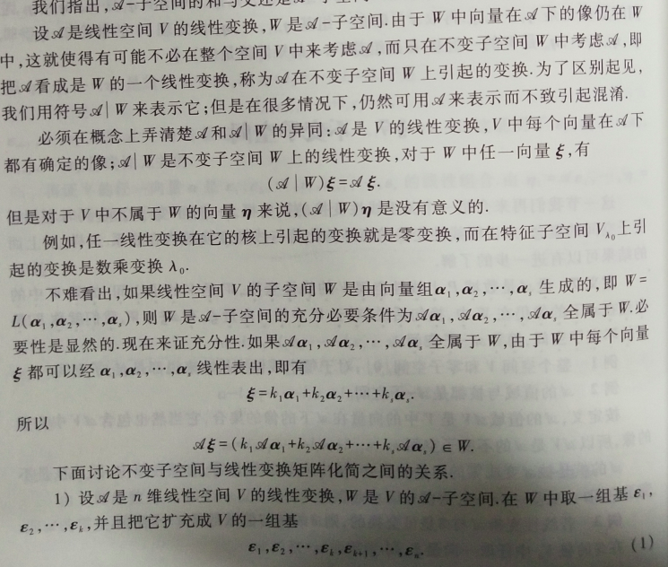
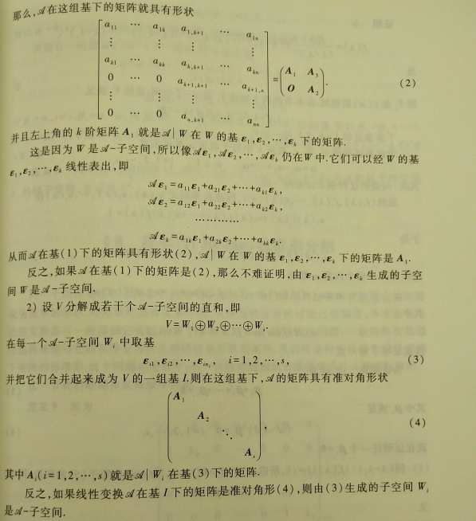

## 7 线性变换

### 7.0 线性变换的定义

数域 $P$ 上任意一个 $n$ 维线性空间都与 $P^n$ 同构，因之，有限维线性空间的结构可以认为是完全清楚了。线性空间是某一类事物从量的方面的一个抽象。认识客观事物，固然要弄清它们单个的和总体的性质，但是更重要的是研究它们之间的各种各样的联系。在线性空间中，事物之间的联系就反映为线性空间的映射。线性空间 $V$ 到自身的映射通常称为 $V$ 的一个**变换**。该章要探讨的线性变换就是最简单的，同时也可以认为是最基本的一种变换，正如线性函数是最简单的和最基本的函数一样。线性变换是线性代数的一个主要研究对象。

后面如果不特别声明，所考虑的都是某一固定的数域 $P$ 上的线性空间。

> **定义1：**	线性空间 $V$ 的一个变换 $\mathscr{A}$  称为**线性变换**，如果对于 $V$ 中任意的元素 $\alpha,\beta$ 和数域 $P$ 中任意数 $k$ ，都有：
> $$
> \mathscr{A}(\alpha+\beta) = \mathscr{A}(\alpha) + \mathscr{A}(\beta)~,
> ~~\mathscr{A}(k\alpha) = k\mathscr{A}(\alpha)~. \tag{1}
> $$

以后一般用花体拉丁字母 $\mathscr{A,B,...}$ 代表 $V$ 的变换，$\mathscr{A}(\alpha)$ 或 $\mathscr{A}\alpha$ 代表元素 $\alpha$ 在变换 $\mathscr{A}$ 下的像。

定义中等式 $(1)$ 所表示的性质，有时也说成线性变换保持向量的加法与数量乘法。

线性空间 $V$ 中的**恒等变换**或称为**单位变换** $\mathscr{E}$ ，即：
$$
\mathscr{E}(\alpha) = \alpha~,~~\alpha \in V~,
$$
以及**零变换** $\mathscr{0}$ (这里花体的0无法正常显示)，即：
$$
\mathscr{0}(\alpha) = 0~,~~\alpha \in V~.
$$
  不难直接从定义推出线性变换的以下简单性质：

1. 设 $\mathscr{A}$ 是 $V$ 的线性变换，则 $\mathscr{A}(0) = 0,\mathscr{A}(-\alpha) = -\mathscr{A}(\alpha)$ 。这是因为：
   $$
   \mathscr{A}(0) = \mathscr{A}(0·\alpha) = 0 \mathscr{\alpha} = 0,\\
   \mathscr{A}(-\alpha) = \mathscr{A}((-1)\alpha) = (-1)\mathscr{A}(\alpha) = -\mathscr{A}(\alpha)~.
   $$

2. 线性变换保持线性组合与线性关系式不变。换句话说，如果 $\beta$ 是 $\alpha_1,\alpha_2,\dots,\alpha_r$ 的线性组合，即 
   $$
   \beta = k_1\alpha_1 + k_2\alpha_2 + \dots + k_r\alpha_r,
   $$
   那个经过线性变换 $\mathscr{A}$ 之后，$\mathscr{A}(\beta)$ 是 $\mathscr{A}(\alpha_1),\mathscr{A}(\alpha_2),\dots,\mathscr{A}(\alpha_r)$ 同样的线性组合，即 
   $$
   \mathscr{A}(\beta) = 
   k_1\mathscr{A}(\alpha_1)+k_2\mathscr{A}(\alpha_2)+\dots+k_r\mathscr{A}(\alpha_r)~.
   $$
   又如果 $\alpha_1,\alpha_2,\dots,\alpha_r$ 之间有一线性关系式 
   $$
   k_1\alpha_1 + k_2\alpha_2 + \dots + k_r\alpha_r = 0~,
   $$
   那么它们的像之间也有同样的关系：
   $$
   k_1\mathscr{A}(\alpha_1)+k_2\mathscr{A}(\alpha_2)+\dots+k_r\mathscr{A}(\alpha_r) = 0~.
   $$

3. 线性变换把线性相关的向量组变成线性相关的向量组。(该性质的逆不成立)

### 7.1 线性变换的运算

#### 7.1.0 线性变换的乘法

设 $\mathscr{A,B}$ 是线性空间 $V$ 的两个线性变换，定义它们的**乘积** $\mathscr{AB}$ 为
$$
(\mathscr{AB})(\alpha) = \mathscr{A}(\mathscr{B}(\alpha))~,~~\alpha \in V~.
$$
易知，线性变换的乘积也是线性变换，满足：
$$
(\mathscr{AB})(\alpha+\beta) = (\mathscr{AB})(\alpha) + (\mathscr{AB})(\beta)~,\\
(\mathscr{AB})(k\alpha) = \mathscr{A}(\mathscr{B}(k\alpha)) = \mathscr{A}(k\mathscr{B}(\alpha))
= k\mathscr{A}(\mathscr{B}(\alpha)) = k(\mathscr{AB})(\alpha)~.
$$
且线性变换的乘法也适合结合律，$(\mathscr{AB})\mathscr{C} = \mathscr{C}(\mathscr{AB})~.$  

但线性变换的乘法一般是不可交换的。假如有 $\mathscr{DJ} = \mathscr{E}$ ，一般 $\mathscr{JD} \neq \mathscr{E}$ 。但对于单位变换，$\mathscr{EA} = \mathscr{AE} = \mathscr{A}$ 。

#### 7.1.1 线性变换的加法

设 $\mathscr{A,B}$ 是线性空间 $V$ 的两个线性变换，定义它们的**和** $\mathscr{A}+\mathscr{B}$ 为：
$$
(\mathscr{A}+\mathscr{B})(\alpha) = \mathscr{A}(\alpha) + \mathscr{B}(\alpha)~,~~\alpha \in V~.
$$
线性变换的和还是线性变换。

线性变换的加法还适合结合律与交换律，$\mathscr{A}+(\mathscr{B}+\mathscr{C}) = (\mathscr{A}+\mathscr{B})+\mathscr{C}~,~\mathscr{A}+\mathscr{B} = \mathscr{B}+\mathscr{A}$ 。

零变换与所有线性变换 $\mathscr{A}$ 的和仍等于 $\mathscr{A}$ 。

#### 7.1.2 其他

对每个线性变换 $\mathscr{A}$ ，可以定义它的负变换 $-\mathscr{A}$ ：$(-\mathscr{A})(\alpha) = -\mathscr{A}(\alpha)~,~~\alpha \in V~.$

线性变换的乘法对加法有左右分配率，即：$\mathscr{A(B+C)} = \mathscr{AB+AC},~(\mathscr{B+C})\mathscr{A} = \mathscr{BA+CA}~.$

数域 $P$ 中每个数 $k$ 都决定一个数乘变换 $\mathscr{K}$ 。利用线性变换的乘法，可以定义数域 $P$ 中的数与线性变换的**数量乘法**为：
$$
k\mathscr{A} = \mathscr{KA},
$$
即
$$
(k\mathscr{A})(\alpha) = \mathscr{K}(\mathscr{A}(\alpha)) = \mathscr{KA}(\alpha)~,
$$
 $k\mathscr{A}$ 还是线性变换。且线性变换的数量乘法也适合向量数量乘法的运算律。

线性空间 $V$ 上全体线性变换，对于如上定义的加法与数量乘法，也构成数域 $P$ 上的一个线性空间。$V$ 的变换 $\mathscr{A}$ 称为可逆的，如果有 $V$ 的变换 $\mathscr{B}$ 存在，使得：
$$
\mathscr{AB=BA=E}~.
$$
这时，变换 $\mathscr{B}$ 称为 $\mathscr{A}$ 的**逆变换**，记为 $\mathscr{B}^{-1}$ 。如果线性变换 $\mathscr{A}$ 是可逆的，那么它的逆变换 $\mathscr{A}^{-1}$ 也是线性变换。

当 $n$ 个线性变换 $\mathscr{A}$ 重复相乘时，可以用：
$$
\overset{n个}{\overbrace{\mathscr{AA \cdots A}}}
$$
来表示，称 $\mathscr{A}$ 的 $n$ 次幂，简单地记作 $\mathscr{A}^n$ 。且定义 $\mathscr{A}^0 = \mathscr{E}$ 。单一线性变换的多次幂也满足指数法则，也可以推广到负正数幂。

但线性变换乘积的指数法则不成立，即一般来说 $(\mathscr{AB})^n \neq \mathscr{A}^n \mathscr{B}^n ~.$

设 $f(x) = a_mx^m + a_{m-1}x^{m-1} + \dots + a_0$ 是 $P[x]$ 中一多项式，$\mathscr{A}$ 是 $V$ 的一线性变换，定义：
$$
f(\mathscr{A}) = a_m\mathscr{A}^m + a_{m-1}\mathscr{A}^{m-1} + \dots + a_0\mathscr{E}~.
$$
显然，$f(\mathscr{A})$ 是一线性变换，它称为**线性变换**$\mathscr{A}$**的多项式**。同一个线性变换的多项式的乘法是可变换的，即 $f(\mathscr{A})g(\mathscr{A}) = g(\mathscr{A})f(\mathscr{A})$ 。 

### 7.2 线性变换的矩阵

设 $V$ 是数域 $P$ 上的 $n$ 维线性空间，$\varepsilon_1,\varepsilon_2,\dots,\varepsilon_n$ 是 $V$ 的一组基，现在来建立线性变换与矩阵的关系。空间 $V$ 中任一向量 $\xi$ 可以经这组基线性表出，即有关系式：
$$
\xi = x_1\varepsilon_1 + x_2\varepsilon_2 + \dots + x_n\varepsilon_n~,
$$
其中系数是唯一确定的，它们就是 $\xi$ 在这组基下的坐标。由于线性变换保持线性关系不变，因而在 $\xi$ 的像 $\mathscr{A} (\xi)$ 与基的像 $\mathscr{A}(\varepsilon_1),\mathscr{A}(\varepsilon_2),\dots,\mathscr{A}(\varepsilon_n)$ 之间也必然有相同的关系，即：
$$
\mathscr{A}(\xi) = \mathscr{A}(x_1\varepsilon_1 + x_2\varepsilon_2 + \dots + x_n\varepsilon_n)
= x_1\mathscr{A}(\varepsilon_1)+x_2\mathscr{A}(\varepsilon_2)+\dots+x_n\mathscr{A}(\varepsilon_n)
~.
$$
上式表明，如果知道了基 $\varepsilon_1,\varepsilon_2,\dots,\varepsilon_n$ 的像，那么线性空间 $V$ 中任一个向量 $\xi$ 的像也就知道了，或者说：

1. 设 $\varepsilon_1,\varepsilon_2,\dots,\varepsilon_n$ 是线性空间 $V$ 的一组基。如果线性变换 $\mathscr{A}$ 与 $\mathscr{B}$ 在这组基上的作用相同，即：
   $$
   \mathscr{A}(\varepsilon_i) = \mathscr{B}(\varepsilon_i)~,~~i=1,2,\dots,n,
   $$
   那么 $\mathscr{A}=\mathscr{B}$ 。

2. 设 $\varepsilon_1,\varepsilon_2,\dots,\varepsilon_n$ 是线性空间 $V$ 的一组基。对于任意一组向量 $\alpha_1,\alpha_2,\dots,\alpha_n$ ，一定有一个线性变换 $\mathscr{A}$ ，使
   $$
   \mathscr{A}(\varepsilon_i) = \alpha_i~,~~i=1,2,\dots,n.
   $$

> **定理1：**	设 $\varepsilon_1,\varepsilon_2,\dots,\varepsilon_n$ 是线性空间 $V$ 的一组基，$\alpha_1,\alpha_2,\dots,\alpha_n$ 是 $V$ 中任意 $n$ 个向量，存在唯一的线性变换 $\mathscr{A}$ ，使：
> $$
> \mathscr{A}(\varepsilon_i) = \alpha_i~,~~i=1,2,\dots,n.
> $$

> **定义2：**	设 $\varepsilon_1,\varepsilon_2,\dots,\varepsilon_n$ 是数域 $P$ 上 $n$ 维线性空间 $V$ 的一组基，$\mathscr{A}$ 是 $V$ 中的一个线性变换。基向量的像可以经这组基线性表出，即：
> $$
> \left\{
> \begin{array}{}
> \mathscr{A}(\varepsilon_1) = 
> a_{11}\varepsilon_1 + a_{21}\varepsilon_2 + \dots + a_{n1}\varepsilon_n~,\\
> \mathscr{A}(\varepsilon_2) = 
> a_{12}\varepsilon_1 + a_{22}\varepsilon_2 + \dots + a_{n2}\varepsilon_n~,\\
> ~~~~~\dots\dots\dots\\
> \mathscr{A}(\varepsilon_n) = 
> a_{1n}\varepsilon_1 + a_{2n}\varepsilon_2 + \dots + a_{nn}\varepsilon_n~.
> \end{array}
> \right.
> $$
> 用矩阵表示就是：
> $$
> \mathscr{A}(\varepsilon_1,\varepsilon_2,\dots,\varepsilon_n) = 
> [\mathscr{A}(\varepsilon_1),\mathscr{A}(\varepsilon_2),\dots,\mathscr{A}(\varepsilon_n)]
> = [\varepsilon_1,\varepsilon_2,\dots,\varepsilon_n]A~,\tag{2}
> $$
>  其中：
> $$
> A = 
> \left[
> \begin{matrix}
> a_{11} & a_{12} & \dots & a_{1n}\\
> a_{21} & a_{22} & \dots & a_{2n}\\
> \vdots & \vdots & & \vdots\\
> a_{n1} & a_{n2} & \dots & a_{nn}
> \end{matrix}
> \right]~.
> $$
> 矩阵 $A$ 称为 $\mathscr{A}$ **在基**$\varepsilon_1,\varepsilon_2,\dots,\varepsilon_n$**下的矩阵**。

**(线性变换对子空间的投影)**设 $\varepsilon_1,\varepsilon_2,\dots,\varepsilon_m$ 是 $n(n>m)$ 维线性空间 $V$ 的子空间 $W$ 的一组基，把它扩充为 $V$ 的一组基 $\varepsilon_1,\varepsilon_2,\dots,\varepsilon_n$ 。定义线性变换 $\mathscr{A}$ 如下：
$$
\left\{
\begin{array}{}
\mathscr{A}(\varepsilon_i) ~,~~ i = 1,2,\dots,m~,\\
\mathscr{A}(\varepsilon_i) ~,~~ i = m+1,m+2,\dots,n~.
\end{array}
\right.
$$
如此确定的线性变换 $\mathscr{A}$ 称为对子空间 $W$ 的一个 **投影** 。且有 $\mathscr{A}^2 = \mathscr{A}$ 。

> **定理2：**	设 $\varepsilon_1,\varepsilon_2,\dots,\varepsilon_n$ 是数域 $P$ 上 $n$ 维线性空间 $V$ 的一组基，在这组基下，每个线性变换按公式 $(2)$ 对应一个 $n \times n$ 矩阵。这个对应具有以下的性质：
>
> 1. 线性变换的和对应与矩阵的和；
> 2. 线性变换的乘积对应于矩阵的乘积；
> 3. 线性变换的数量乘积对应于矩阵的数量乘积；
> 4. 可逆的线性变换与可逆矩阵对应，且逆变换对应于逆矩阵。

定理2说明数域 $P$ 上 $n$ 维线性空间 $V$ 的全部线性变换组成的集合 $L(V)$ 对于线性变换的加法与数量乘法构成 $P$ 上一个线性空间，与数域 $P$ 上 $n$ 阶方阵构成的线性空间 $P^{n \times n}$ 同构。利用线性变换的矩阵可以直接计算一个向量的像。

> **定理3：**	设线性变换 $\mathscr{A}$ 在基 $\varepsilon_1,\varepsilon_2,\dots,\varepsilon_n$ 下的矩阵是 $A$ ，向量 $\xi$ 在基 $\varepsilon_1,\varepsilon_2,\dots,\varepsilon_n$ 下的坐标是 $(x_1,x_2,\dots,x_n)$，则 $\mathscr{A}(\xi)$ 在基 $\varepsilon_1,\varepsilon_2,\dots,\varepsilon_n$ 下的坐标 $(y_1,y_2,\dots,y_n)$ 可以按公式：
> $$
> \left[\begin{matrix}
> y_1\\ y_2\\ \vdots \\ y_n
> \end{matrix}\right]
> =A
> \left[\begin{matrix}
> x_1\\ x_2\\ \vdots \\ x_n
> \end{matrix}\right]
> $$
> 计算。

线性变换的矩阵是与空间中一组基联系在一起的。一般来说，随着基的改变，同一个线性变换就有不同的矩阵。为了利用矩阵来研究线性变换，下面就探讨线性变换的矩阵是如何随着基的改变而改变。

> **定理4：**	设线性空间 $V$ 中线性变换 $\mathscr{A}$ 在两组基：
> $$
> \varepsilon_1,\varepsilon_2,\dots,\varepsilon_n~,\tag{3}
> $$
>
> $$
> \eta_1,\eta_2,\dots,\eta_n~,\tag{4}
> $$
>
> 下的矩阵分别为 $A$ 和 $B$ ，从基 $(3)$ 到 $(4)$ 的过渡矩阵是 $X$ ，于是 $B=X^{-1}AX$ 。

> **定义3：**	设 $A,B$ 为数域 $P$ 上两个 $n$ 阶矩阵，如果可以找到数域 $P$ 上的 $n$ 阶可逆矩阵 $X$ ，使得 $B = X^{-1}AX$ ，就是说 $A$**相似**于$B$ ，记作 $A \sim B$ 。

相似是矩阵之间的一种关系，这种关系具有下面三个性质：

1. 自反性：$A \sim A$ 。
2. 对称性：如果 $A \sim B$ ，那么 $B \sim A$ 。
3. 传递性：如果 $A \sim B,B \sim C$ ，那么 $A \sim C$ 。

有了矩阵相似的概念之后，定理4可以补充成：

> **定理5：**	线性变换在不同基下所对应的矩阵是相似的。反过来，如果两个矩阵相似，那么它们可以看作同一个线性变换在两组基下所对应的矩阵。

矩阵的相似对于运算有下面的性质：

如果 $B_1 = X^{-1} A_1 X , B_2 = X^{-1} A_2 X$ ，那么 $B_1+B_2 = X^{-1}(A_1+A_2)X,~B_1B_2=X^{-1}(A_1A_2)X~.$ 由此可知，如果$B = X^{-1}AX$ ，且 $f(x)$ 是数域 $P$ 上一多项式，那么 $f(B) = X^{-1}f(A)X~.$

利用矩阵相似的这个性质可以简化矩阵的计算。

### 7.3 特征值与特征向量

> **定义4：**	设 $\mathscr{A}$ 是数域 $P$ 上线性空间 $V$ 的一个线性变换，如果对于数域 $P$ 中一数 $\lambda_0$ ，存在一个非零向量 $\xi$ ，使得：
> $$
> \mathscr{A}(\xi) = \lambda_0 \xi~,\tag{5}
> $$
> 那么 $\lambda_0$ 称为 $\mathscr{A}$ 的一个**特征值**，而 $\xi$ 称为 $\mathscr{A}$ 的属于特征值 $\lambda_0$ 的一个**特征向量**。

从几何上来看，特征向量的方向经过线性变换后，保持在同一条直线上，这时或者方向不变$(\lambda_0>0)$ ，或者方向相反$(\lambda_0<0)$ ，至于$\lambda_0=0$ 时，特征向量就被线性变换成 $0$ 。

如果 $\xi$ 是线性变换 $\mathscr{A}$ 的属于特征值 $\lambda_0$ 的特征向量，那么 $\xi$ 的任何一个非零倍数 $k\xi$ 也是 $\mathscr{A}$ 的属于特征值 $\lambda_0$ 的特征向量，即有 $\mathscr{A}(k\xi) = \lambda_0(k\xi)$ 。这说明 特征向量不是被特征值所唯一决定的，相反，特征值却是被特征向量所唯一决定的，因为，一个特征向量只能属于一个特征值。

特征值与特征向量的求解一般采用：$|\lambda_0 E - A|=0$ 。(即求解一个行列式等于0的问题)
$$
\left\{\begin{array}{}
(\lambda_0 - a_{11})x_1 - a_{12}x_2 - \dots - a_{1n}x_n = 0~,\\
-a_{21}x_1 + (\lambda_0-a_{22})x_2 - \dots - a_{2n}x_n = 0~,\\
~~~~~\dots\dots\dots\\
-a_{n1}x_1 - a_{n2}x_2 - \dots +(\lambda_0 - a_{nn})x_n = 0~.
\end{array}\right. \tag{6}
$$

> **定义5：**	设 $A$ 是数域 $P$ 上一 $n$ 阶矩阵，$\lambda$ 是一个文字，矩阵 $\lambda E - A$ 的行列式：
> $$
> |\lambda E - A| = 
> \left|\begin{matrix}
> \lambda-a_{11} & -a_{12} & \dots & -a_{1n}\\
> -a_{21} & \lambda-a_{22} & \dots & -a_{2n}\\
> \vdots & \vdots & & \vdots \\
> -a_{n1} & -a_{n2} & \dots & \lambda-a_{nn}\\
> \end{matrix}\right|
> $$
> 称为 $A$ 的**特征多项式**，这是数域 $P$ 上的一个 $n$ 次多项式。

如果 $\lambda_0$ 是线性变换 $\mathscr{A}$ 的特征值，那么 $\lambda_0$ 一定是矩阵 $A$ 的特征多项式的一个根；反过来，如果 $\lambda_0$ 是矩阵 $A$ 的特征多项式在数域 $P$ 中的一个根，即 $|\lambda_0 E - A|=0$ ，那么齐次线性方程组 $(6)$ 就有非零解，解就是特征向量在 $\mathscr{A}$ 的坐标。如果 $(x_{01},x_{02},\dots,x_{0n})$ 是一个非零解，那么非零向量 ：
$$
\xi = x_{01}\varepsilon_1 + x_{02}\varepsilon_2 + \dots + x_{0n}\varepsilon_n
$$
就满足 $(5)$ ，即 $\lambda_0$ 是线性变换 $\mathscr{A}$ 的一个特征值，$\xi$ 就是属于特征值 $\lambda_0$ 的一个特征向量。

因此，确定一个线性变换 $\mathscr{A}$ 的特征值与特征向量的方法可以分成以下几步：

1. 在线性空间 $V$ 中取一组基 $\varepsilon_1,\varepsilon_2,\dots,\varepsilon_n$ ，写出 $\mathscr{A}$ 在这组基下的矩阵 $A$ ；
2. 求出 $A$ 的特征多项式 $|\lambda E - A|$ 在数域 $P$ 中全部的根，它们也就是线性变换 $\mathscr{A}$ 的全部特征值；
3. 把所求得的特征值逐个地代入方程组 $(6)$ ，对于每一个特征值，解方程组 $(3)$ ，求出一组基础解系，它们就是属于这个特征值的几个线性无关的特征向量在基 $\varepsilon_1,\varepsilon_2,\dots,\varepsilon_n$ 下的坐标，这样，就求出了属于每个特征值的全部线性无关的特征向量。（该方法理论可行，但当矩阵规模较大或矩阵元素较为复杂时，计算起来十分麻烦，所以需要计算数学中的一些专门方法）

矩阵 $A$ 的特征多项式的根也称为 $A$ 的特征值，而相应的线性方程组 $(6)$ 的解也就称为 $A$ 的属于这个特征值的特征向量。

容易得到，对于线性变换 $\mathscr{A}$ 的任一特征值 $\lambda_0$ ，全部适合条件：
$$
\mathscr{A}(\alpha) = \lambda_0 \alpha
$$
的向量 $\alpha$ 所成的集合，也就是 $\mathscr{A}$ 的属于 $\lambda_0$ 的全部特征向量再添上零向量所成的集合，也是 $V$ 的一个子区间，称为 $\mathscr{A}$ 的一个**特征子区间**，记为 $V_{\lambda_0}$ 。显然，$V_{\lambda_0}$ 的维数就是属于 $\lambda_0$ 的线性无关的特征向量的最大个数。用集合记号可写为：
$$
V_{\lambda_0} = \{ \alpha | \mathscr{A}\alpha = \lambda_0 \alpha,~\alpha \in V\}~.
$$

> **定理6：**	相似的矩阵有相同的特征多项式。

定理6 说明，线性变换的矩阵的特征多项式与基的选择无关，它是直接被线性变换决定的。即可以直接说线性变换的特征多项式。

> **哈密顿-凯莱($Hamilton-Cayley$)定理：** 	设 $A$ 是数域 $P$ 上一 $n \times n$ 矩阵 ，$f(\lambda) = |\lambda E - A|$ 是 $A$ 的特征多项式，则：
> $$
> f(A) = A^n - (a_{11}+a_{22}+\dots+a_{nn})A^{n-1}+\dots+(-1)^n|A|E=O~.
> $$

> **推论：**	设 $\mathscr{A}$ 是有限维空间 $V$ 的线性变换，$f(\lambda)$ 是 $\mathscr{A}$ 的特征多项式，那么 $f(\mathscr{A}) = \mathscr{0}$。(最后这个0表示零变换，未显示花体……) 

### 7.4 对角矩阵

> **定理7：**	设 $\mathscr{A}$ 是 $n$ 维线性空间 $V$ 的一个线性变换，$\mathscr{A}$ 的矩阵可以在某一组基下为对角矩阵的充分必要条件是，$\mathscr{A}$ 有 $n$ 个线性无关的特征向量。

> **定理8：**	数域不同特征值的特征向量是线性无关的。

> **定理9：**	如果 $\lambda_1,\dots,\lambda_k$ 是线性变换 $\mathscr{A}$ 的不同的特征值，而 $\alpha_{i1},\dots,\alpha_{ir_i}(i=1,2,\dots,k)$ ，是属于特征值 $\lambda_i$ 的线性无关的特征向量，那么向量组 $\alpha_{1 i},\dots,\alpha_{1 r_i},\dots,\alpha_{k 1},\dots,\alpha_{k r_i}$ 也线性无关。 

根据这个定理，对于一个线性变换，求出属于每个特征值的线性无关的特征向量，把它们合在一起还是线性无关的。如果它们的个数等于空间的维数，那么这个线性变换在一组合适的基下的矩阵是对角矩阵；如果它们的个数少于空间的维数，那么这个线性变换在任何一组基下的矩阵都不能是对角形的。换句话说，设 $\mathscr{A}$ 全部不同的特征值是 $\lambda_1,\dots,\lambda_r$ ，于是 $\mathscr{A}$ 在某一组基下的矩阵成对角形的充要条件是 $\mathscr{A}$ 的特征子空间 $V_{\lambda_1},\dots,V_{\lambda_r}$ 的维数之和等于空间的维数。

当线性变换 $\mathscr{A}$ 在一组基下的矩阵 $A$ 是对角形时，即：
$$
A = 
\left[\begin{matrix}
\lambda_1 &&&\\
& \lambda_2 &&\\
&& \ddots &\\
&&& \lambda_n
\end{matrix}\right]~,
$$
$\mathscr{A}$ 的特征多项式就是 $|\lambda E - A| = (\lambda-\lambda_1)(\lambda-\lambda_2)\dots(\lambda-\lambda_n)$ 。因此，如果线性变换 $\mathscr{A}$ 在一组基下的矩阵是对角形，那么主对角线上的元素除排列次序外是确定的，它们正是 $\mathscr{A}$ 的特征多项式全部的根。（重根按重数计算）

### 7.5 线性变换的值域与核

> **定义6：**	设 $\mathscr{A}$ 是线性空间 $V$ 的一个线性变换，$\mathscr{A}$ 的全体像组合的集合称为 $\mathscr{A}$ 的**值域**，用 $\mathscr{A}(V)$ 表示。所有被 $\mathscr{A}$ 变成零向量的向量组成的集合称为 $\mathscr{A}$ 的**核**，用 $\mathscr{A}^{-1}(0)$ 表示。

若用集合的记号则 $\mathscr{A}(V) = \{ \mathscr{A}(\xi)|\xi \in V\},~\mathscr{A}^{-1}(0)=\{ \xi|\mathscr{A}(\xi)=0,\xi \in V\}$ 。 

线性变换的值域与核都是 $V$ 的子空间。

$\mathscr{A}(V)$ 的维数称为 $\mathscr{A}$ 的**秩**，$\mathscr{A}^{-1}(0)$ 的维数称为 $\mathscr{A}$ 的**零度**。

> **定理10：**	设 $\mathscr{A}$ 是 $n$ 维线性空间 $V$ 的线性变换，$\varepsilon_1,\varepsilon_2,\dots,\varepsilon_n$ 是 $V$ 的一组基，在这组基下 $\mathscr{A}$ 的矩阵是 $A$ ，则：
>
> 1. $\mathscr{A}$ 的值域 $\mathscr{A}(V)$ 是由基像组生成的子空间，即 $\mathscr{A}(V) = L(\mathscr{A}(\varepsilon_1),\mathscr{A}(\varepsilon_2),\dots,\mathscr{A}(\varepsilon_n))$ ；
> 2. $\mathscr{A}$ 的秩 = $A$ 的秩。

 定理10说明线性变换与矩阵之间的对应关系保持不变。

> **定理11：**	设 $\mathscr{A}$ 是 $n$ 维线性空间 $V$ 的线性变换。则 $\mathscr{A}(V)$ 的一组基的原像及 $\mathscr{A}^{-1}(0)$ 的一组基合起来就是 $V$ 的一组基。由此还有：
> $$
> \mathscr{A} 的秩 + \mathscr{A} 的零度 = n~.
> $$

> **推论：**	对于有限维线性空间的线性变换，它是单射的充要条件为它是满射。

要注意，虽然子空间 $\mathscr{A}(V)$ 与 $\mathscr{A}^{-1}(0)$ 的维数之和为 $n$ ，但是 $\mathscr{A}(V) + \mathscr{A}^{-1}(0)$ 并不一定是整个空间。

### 7.6 不变子空间

> **定义7：**	设 $\mathscr{A}$ 是数域 $P$ 上线性空间 $V$ 的线性变换，$W$ 是 $V$ 的子空间。如果 $W$ 中的向量在 $\mathscr{A}$ 下的像仍在 $W$ 中，换句话说，对于 $W$ 中任一向量 $\xi$ ，有 $\mathscr{A}(\xi) \in W$ ，称 $W$ 是 $\mathscr{A}$ 的**不变子空间**，简称 $\mathscr{A}$-**子空间**。

- 整个空间 $V$ 和零子空间 $\{0\}$，对于每个线性变换 $\mathscr{A}$ 来说都是 $\mathscr{A}$-子空间。
- $\mathscr{A}$ 的值域与核都是 $\mathscr{A}$-子空间。
- 若线性变换 $\mathscr{A}$ 与 $\mathscr{B}$ 是可交换的，则 $\mathscr{B}$ 的核与值域都是 $\mathscr{A}$-子空间。
- 任何一个子空间都是数乘变换的不变子空间。
- $\mathscr{A}$ 的属于特征值 $\lambda_0$ 的特征子空间 $V_{\lambda_0}$ 也是 $\mathscr{A}$-子空间。
- $\mathscr{A}$-子空间的和与交还是 $\mathscr{A}$-子空间。

特征向量与一维不变子空间之间有着紧密的关系。设 $W$ 是一维 $\mathscr{A}$-子空间，$\xi$ 是 $W$ 中任何一个非零向量，它构成 $W$ 的基。按 $\mathscr{A}$-子空间的定义，$\mathscr{A}(\xi) \in W$ ，它必定是 $\xi$ 的一个倍数，即 $\mathscr{A}(\xi) = \lambda_0 \xi$ 。这说明 $\xi$ 是 $\mathscr{A}$ 的特征向量，而 $W$ 即是由 $\xi$ 生成的一维 $\mathscr{A}$-子空间。反过来，设 $\xi$ 是 $\mathscr{A}$ 属于特征值 $\lambda_0$ 的一个特征向量，则 $\xi$ 以及它的任一倍数在 $\mathscr{A}$ 下的像是原像的 $\lambda_0$ 倍，依旧是 $\xi$ 的一个倍数。这说明 $\xi$ 的倍数构成一个一维 $\mathscr{A}$-子空间。显然，$\mathscr{A}$ 的属于特征值 $\lambda_0$ 的特征子空间 $V_{\lambda_0}$ 也是 $\mathscr{A}$-子空间。 

> **定理12：**	设线性变换 $\mathscr{A}$ 的特征多项式为 $f(\lambda)$ ，它可分解成一次因式的乘积：
> $$
> f(\lambda) = (\lambda-\lambda_1)^{r_1}(\lambda-\lambda_2)^{r_2}\dots(\lambda-\lambda_s)^{r_s}~,
> $$
> 则 $V$ 可分解成不变子空间的直和：
> $$
> V = V_1 \oplus V_2 \oplus \dots \oplus V_s~,
> $$
> 其中 $V_i=\{ \xi \in V | (\mathscr{A}-\lambda_i \mathscr{E})^{r_i}\xi=0\}$ 。

> **定义8：**	$V,~\mathscr{A},~f(\lambda)$ 如 定理12 ，称 $V_i=\{ \xi \in V | (\mathscr{A}-\lambda_i \mathscr{E})^{r_i}\xi=0\}$ 为 $\mathscr{A}$ 的属于特征值 $\lambda_i$ 的**根子空间**，常记为 $V^{\lambda_i}$ 。 

### 7.7 若尔当 $(Jordan)$ 标准形介绍 

同一个线性变换在不同基下的矩阵是相似的，一般期望通过基的变换使它的矩阵化为简单的形状。对角矩阵具有简单形状，但并不是每个线性变换都有一组基使它在这组基下矩阵为对角形。现在提出问题：一般线性变换通过选择基能将它的矩阵变成什么样的简单形状的矩阵。将这种矩阵称为线性变换下矩阵的标准形。这个问题也等价于：任一方阵经过相似变换能变成什么样的标准形。

这一小节限制在复数域中讨论。

> **定义9：**	形为：
> $$
> J(\lambda_0,k) = 
> \left[\begin{matrix}
> \lambda_0 & 0 & 0 & \dots & 0 & 0 & 0 \\
> 1 & \lambda_0 & 0 & \dots & 0 & 0 & 0 \\
> \vdots & \vdots & \vdots & & \vdots & \vdots & \vdots \\
> 0 & 0 & 0 & \dots & 1 & \lambda_0 & 0 \\
> 0 & 0 & 0 & \dots & 0 & 1 & \lambda_0 
> \end{matrix}\right]_{k \times k}
> $$
> 的矩阵称为**若尔当块**，其中 $\lambda_0$ 是复数。由若干个若尔当块组成的准对角矩阵：
> $$
> A = 
> \left[\begin{matrix}
> J(\lambda_1,k_1) & & & \\
> & J(\lambda_2,k_2) & & \\
> & & \ddots & \\
> & & & J(\lambda_s,k_s)
> \end{matrix}\right]
> $$
> 称为**若尔当形矩阵**，其中 $\lambda_1, \lambda_2, \dots, \lambda_s$ 为复数，有一些可以相同。（主对角线相同或不同，主对角线下的元素必须是1，但若看作都是由$k=1$的若尔当块组成的话，其实没有1也一样，没太懂）

例如：
$$
J(1,3) = 
\left[\begin{matrix}
1 & 0 & 0 \\1 & 1 & 0 \\0 & 1 & 1
\end{matrix}\right]~,\\
\left[\begin{matrix}
J(1,3) & \\ & J(4,2)
\end{matrix}\right] = 
\left[\begin{matrix}
1 & 0 & 0 & 0 & 0 \\ 1 & 1 & 0 & 0 & 0 \\
0 & 1 & 1 & 0 & 0 \\ 0 & 0 & 0 & 4 & 0 \\
0 & 0 & 0 & 1 & 4
\end{matrix}\right]~,
$$
都是若尔当形矩阵。

关于若尔当形矩阵的主要结果是：

> **定理13：**	设 $\mathscr{A}$ 是复数域上 $n$ 维线性空间 $V$ 的一个线性变换，则 $V$ 中一定存在一组基，$\mathscr{A}$ 在这组基下的矩阵是若尔当形矩阵，称为 $\mathscr{A}$ 的若尔当标准形。

> **引理：**	$n$ 维线性空间 $V$ 上的线性变换 $\mathscr{B}$ 满足 $\mathscr{B}^k = 0$ ，$k$ 是某正整数，就称 $\mathscr{B}$ 为 $V$ 上幂零线性变换。对幂零线性变换 $\mathscr{B}$ ，$V$ 中必有下列形式的一组元素作为基：
> $$
> \begin{gather*}\begin{matrix}
> \alpha_1 & \alpha_2 & \dots & \alpha_s \\
> \mathscr{B}(\alpha_1) & \mathscr{B}(\alpha_2) & \dots & \mathscr{B}(\alpha_s) \\
> \vdots & \vdots & & \vdots \\
> \mathscr{B}^{k_1-1}(\alpha_1) & \mathscr{B}^{k_2-1}(\alpha_2) & \dots 
> & \mathscr{B}^{k_s-1}(\alpha_s) \\
> (\mathscr{B}^{k_1}(\alpha_1)=0) & (\mathscr{B}^{k_2}(\alpha_2)=0) & \dots 
> & (\mathscr{B}^{k_s}(\alpha_s)=0)
> \end{matrix}\end{gather*}
> $$
>
> 于是 $\mathscr{B}$ 在这组基下的矩阵为：
> $$
> \left[\begin{matrix}
> \underbrace{
> \begin{gather*}\begin{matrix}
> 0 & & & \\ 1 & 0 & & \\ & \ddots & \ddots & \\ & & 1 & 0
> \end{matrix}\end{gather*}}\limits_{k_1} & & & \\
> & \underbrace{
> \begin{gather*}\begin{matrix}
> 0 & & & \\ 1 & 0 & & \\ & \ddots & \ddots & \\ & & 1 & 0
> \end{matrix}\end{gather*}}\limits_{k_2} & &  \\
> & & \ddots & \\
> & & & \underbrace{
> \begin{gather*}\begin{matrix}
> 0 & & & \\ 1 & 0 & & \\ & \ddots & \ddots & \\ & & 1 & 0
> \end{matrix}\end{gather*}}\limits_{k_s} \\
> \end{matrix}\right]~.\\
> $$

> **定理14：**	每个 $n$ 阶复矩阵 $A$ 一定与一个若尔当形矩阵相似。这个若尔当形矩阵除去其中若尔当块的排列顺序外由 $A$ 唯一决定，称为 $A$ 的**若尔当标准形**。

因为若尔当形矩阵是三角矩阵，故 $\mathscr{A}$ (或$A$) 的若尔当标准形中主对角线上的元素就是它的特征多项式的全部根(即特征值)（重根按重数计算）。 