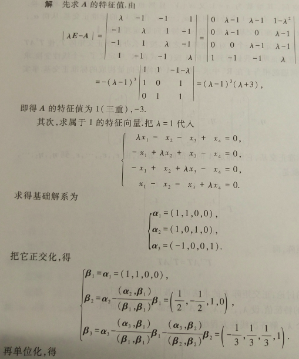
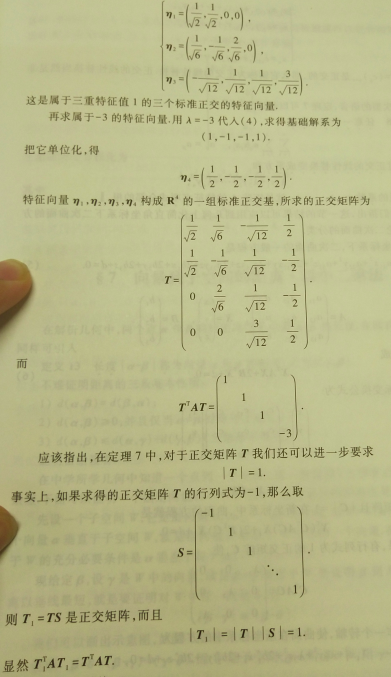
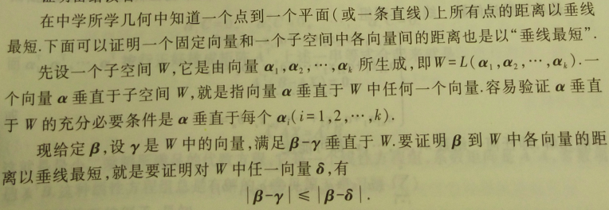
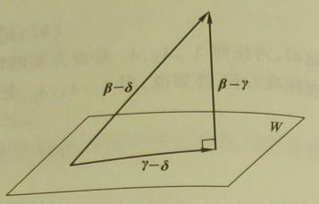
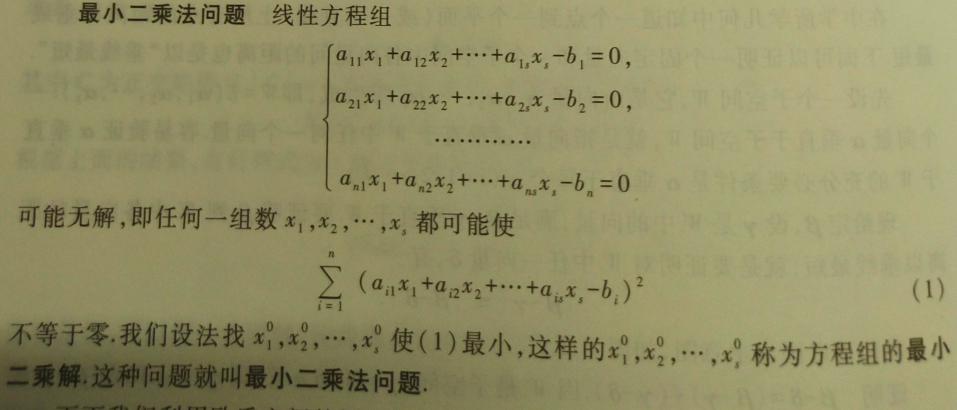
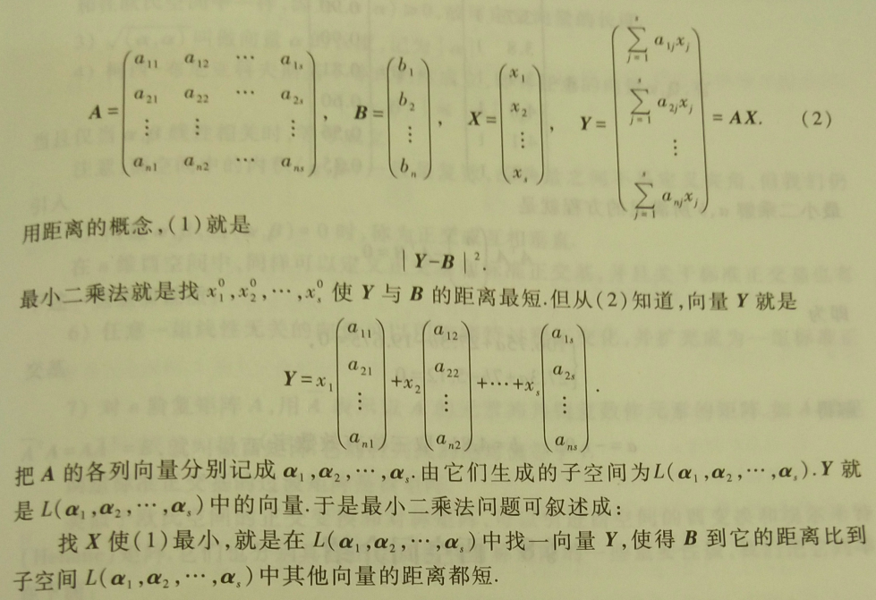
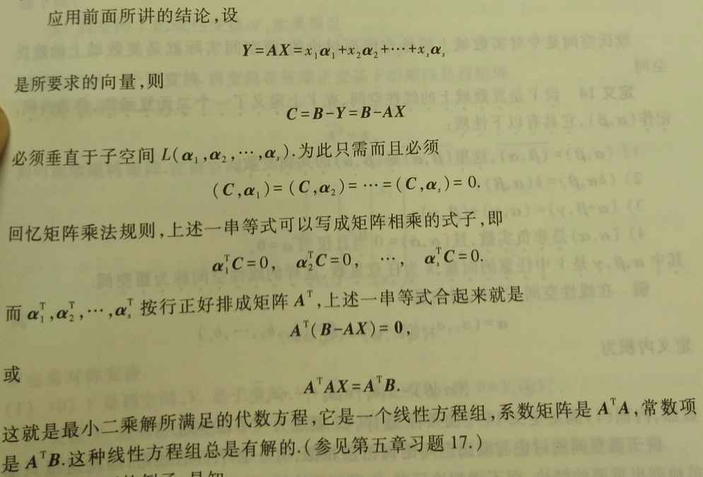
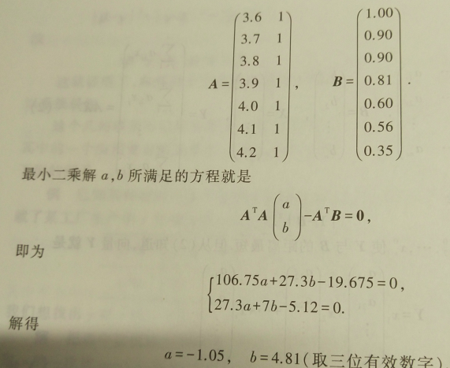

## 9 欧几里得空间

### 9.0 定义与基本性质

在线性空间中，向量之间的基本运算只有加法与数量乘法，统称为**线性运算**。如果以几何空间中的向量作为线性空间理论的一个具体模型，那么就会发现向量的度量性质，如长度、夹角等，在线性空间的理论中没有得到反映。但是这些度量性质在许多问题中有着特殊的地位，因此有必要引入度量的概念。

在解析几何中，向量的长度与夹角等度量性质都可以通过向量的内积来表示，而且向量的内积有明显的代数性质。所以在抽象的讨论中，取内积作为基本的概念。

> **定义1：**	设 $V$ 是实数域 $\mathbf{R}$ 上一线性空间，在 $V$ 上定义了一个二元函数，称为**内积**，记作 $(\alpha,\beta)$ 。6它具有以下性质：
>
> 1. $(\alpha,\beta)=(\beta,\alpha)$ ；
> 2. $(k\alpha,\beta)=k(\alpha,\beta)$ ；
> 3. $(\alpha+\beta,\gamma)=(\alpha,\beta)+(\beta,\gamma)$ ；
> 4. $(\alpha,\alpha) \geqslant 0$ ，当且仅当 $\alpha=0$ 时，$(\alpha,\alpha)=0$ ，
>
> 其中 $\alpha,\beta,\gamma$ 是 $V$ 中任意的向量，$k$ 是任意实数。这样的线性空间 $V$ 称为**欧几里得空间**。

欧几里得空间可以是有限维，也可以是无限维的。

> **例：**	在线性空间 $\mathbf{R}^n$ 中，对于向量：
> $$
> \alpha=(a_1,a_2,\dots,a_n)~,~~\beta=(b_1,b_2,\dots,b_n)~,
> $$
> 定义内积：
> $$
> (\alpha,\beta)=a_1b_1 + a_2b_2 + \dots + a_nb_n~.
> $$
> 此内积适合 定义1 中的条件，这样，$\mathbf{R}^n$ 就成为一个欧几里得空间。（仍用 $\mathbf{R}^n$ 表示这个欧几里得空间）

> **定义2：**	非负实数 $\sqrt{(\alpha,\alpha)}$ 称为向量 $\alpha$ 的**长度**，记为 $|\alpha|$ 。

长度为 1 的向量称为**单位向量**。如果 $\alpha \neq 0$ ，则向量 $\frac{1}{\alpha}\alpha$ 就是一个单位向量。用向量的长度去除向量本身，得到一个与向量成比例的单位向量，通常称为把向量**单位化**。

在解析几何中，向量 $\alpha,\beta$ 的夹角余弦可以通过内积来表示，即：
$$
cos \langle \alpha,\beta \rangle = \frac{(\alpha,\beta)}{|\alpha|·|\beta|}~.
$$
如果要使上式在一般的欧几里得空间中成立，那么就要满足：
$$
\Bigg| \frac{(\alpha,\beta)}{|\alpha|·|\beta|} \Bigg| \leqslant 1~,
$$
这就所谓的 柯西-布尼亚科夫斯基 不等式，即对于任意的向量 $\alpha,\beta$ ，有：
$$
|(\alpha,\beta)| \leqslant |\alpha|·|\beta|~,
$$
当且仅当 $\alpha,\beta$ 线性相关时，等号才成立。

> **定义3：**	非零向量 $\alpha,\beta$ 的**夹角**$\langle \alpha,\beta \rangle$ 规定为：
> $$
> \langle \alpha,\beta \rangle = \arccos \frac{(\alpha,\beta)}{|\alpha|·|\beta|}~,~~
> 0 \leqslant \langle \alpha,\beta \rangle \leqslant \pi~.
> $$

> **定义4：**	如果向量 $\alpha,\beta$ 的内积为零，即：
> $$
> (\alpha,\beta)=0~,
> $$
> 那么 $\alpha,\beta$ 称为**正交**或**互相垂直**，记为 $\alpha \bot \beta$ 。向量正交的充要条件是向量夹角为 $\frac{\pi}2$ 。

只有零向量才与自己正交。

若向量 $\alpha,\beta$ 是正交的，则 $|\alpha+\beta|^2=|\alpha|^2+|\beta|^2$ 。

推广到两两正交的向量组有 $|\alpha_1+\alpha_2+\dots+\alpha_m|^2 = |\alpha_1|^2 + |\alpha_2|^2 + \dots + |\alpha_m|^2$ 。

设 $V$ 是一个 $n$ 维欧几里得空间，在 $V$ 中取一组基 $\varepsilon_1,\varepsilon_2,\dots,\varepsilon_n$ ，对 $V$ 中任意两个向量：
$$
\alpha = x_1\varepsilon_1+x_2\varepsilon_2+\dots+x_n\varepsilon_n~,~~
\beta = y_1\varepsilon_1+y_2\varepsilon_2+\dots+y_n\varepsilon_n~,
$$
由内积的性质得到：
$$
(\alpha,\beta) = (x_1\varepsilon_1+x_2\varepsilon_2+\dots+x_n\varepsilon_n,~
\beta = y_1\varepsilon_1+y_2\varepsilon_2+\dots+y_n\varepsilon_n) 
= \overset{n}\sum\limits_{i=1}\overset{n}\sum\limits_{j=1}
(\varepsilon_i,\varepsilon_j)x_iy_j~.
$$
令 $a_{ij} = (\varepsilon_i,\varepsilon_j)~,~~i,j=1,2,\dots,n$ ，显然有 $a_{ij}=a_{ji}$ 。 于是：
$$
(\alpha,\beta) = \overset{n}\sum\limits_{i=1}\overset{n}\sum\limits_{j=1}a_{ij}x_iy_j~.
$$
利用矩阵，$(\alpha,\beta)$ 还可以写成：
$$
(\alpha,\beta) = X^TAY~,
$$
其中：
$$
X = \left[\begin{matrix}
x_1 \\ x_2 \\ \vdots \\ x_n
\end{matrix}\right]~,~~ 
Y = \left[\begin{matrix}
y_1 \\ y_2 \\ \vdots \\ y_n
\end{matrix}\right]~,
$$
分别是 $\alpha,\beta$ 的坐标，而矩阵：
$$
A =\left[\begin{matrix}
    a_{11} & a_{12} & \cdots & a_{1n} \\
    a_{21} & a_{22} & \cdots & a_{2n} \\
    \vdots & \vdots &  & \vdots \\
    a_{s1} & a_{s2} & \cdots & a_{sn}
\end{matrix}\right]
$$
称为基 $\varepsilon_1,\varepsilon_2,\dots,\varepsilon_n$ 的**度量矩阵** 。在知道一组基的度两矩阵之后，任意两个向量的内积就可以通过坐标求出，因而度量矩阵完全确定了内积。

设 $\eta_1,\eta_2,\dots,\eta_n$ 是空间 $V$ 的另一组基，而由 $\varepsilon_1,\varepsilon_2,\dots,\varepsilon_n$ 到 $\eta_1,\eta_2,\dots,\eta_n$ 的过渡矩阵为 $C$ ，即：
$$
(\eta_1,\eta_2,\dots,\eta_n) = (\varepsilon_1,\varepsilon_2,\dots,\varepsilon_n)C~.
$$
于是，基 $\eta_1,\eta_2,\dots,\eta_n$ 的度量矩阵：
$$
B = (b_{ij})_{n \times n} = C^TAC~,
$$
其中 $b_{ij} = (\eta_i,\eta_j)$ 。这就是说，不同基的度量矩阵是合同的。

对于非零向量 $\alpha$ ，即 $X \neq [0~0~\dots~0]'$ ，有 $(\alpha,\alpha)=X^TAX>0$ ，因此，度量矩阵是正定的。

反之，给定一个 $n$ 阶正定矩阵 $A$ 及 $n$ 维实线性空间 $V$ 的一组基 $\varepsilon_1,\varepsilon_2,\dots,\varepsilon_n$ ，可以规定 $V$ 上内积，使它成为欧几里得空间，并且基 $\varepsilon_1,\varepsilon_2,\dots,\varepsilon_n$ 的度量矩阵为 $A$ 。

### 9.1 标准正交基

> **定义5：**	欧式空间 $V$ 中一组非零的向量，如果它们两两正交，就成为一**正交向量组** 。

按定义，由单个非零向量所组成的向量组也是正交向量组。

正交向量组是线性无关的。在 $n$ 维欧式空间中，两两正交的非零向量不超过 $n$ 个

> **定义6：**	在 $n$ 维欧式空间中，由 $n$ 个向量组成的正交向量组称为**正交基**；由单位向量组成的正交基称为**标准正交基**。(对一组正交基进行单位化就得到一组标准正交基)

设 $\varepsilon_1,\varepsilon_2,\dots,\varepsilon_n$ 是一组标准正交基，由定义，有：
$$
(\varepsilon_i,\varepsilon_j) =
\begin{cases}
1~,& i=j~, \\
0~,&i\neq j~.
\end{cases}
$$
显然，上式完全刻画了标准正交基的性质。换句话说，一组基为标准正交基的充要条件是：它的度量矩阵为单位矩阵。可以断言，在 $n$ 维欧式空间中，标准正交基是存在的。

> **定理1：**	$n$ 维欧式空间中任一个正交向量组都能扩充成一组正交基。

> **定理2：**	对于 $n$ 维欧式空间中任意一组基 $\varepsilon_1,\varepsilon_2,\dots,\varepsilon_n$ ，都可以找到一组标准正交基 $\eta_1,\eta_2,\dots,\eta_n$ ，使：
> $$
> L(\varepsilon_1,\varepsilon_2,\dots,\varepsilon_n) = L(\eta_1,\eta_2,\dots,\eta_n)~,~~i=1,2,\dots,n~.
> $$
> 这也就是说，由基 $\varepsilon_1,\varepsilon_2,\dots,\varepsilon_n$ 到基 $\eta_1,\eta_2,\dots,\eta_n$ 的过渡矩阵是上三角形的。 

> **定义7：**	$n$ 阶实矩阵 $A$ 称为**正交矩阵**，如果 $A^TA=E$ 。

由标准正交基到标准正交基的过渡矩阵是正交矩阵；反过来，如果第一组基是标准正交基，同时过渡矩阵是正交矩阵，那么第二组基也一定是标准正交基。

### 9.2 同构

> **定义8：**	实数域 $\mathbf{R}$ 上欧式空间 $V$ 与 $V'$ 称为**同构的**，如果由 $V$ 到 $V'$ 有一个双射 $\sigma$ ，满足：
>
> 1. $\sigma(\alpha+\beta) = \sigma(\alpha)+\sigma(\beta)$ ；
> 2. $\sigma(k\alpha) = k\sigma(\alpha)$ ；
> 3. $(\sigma(\alpha),\sigma(\beta)) = (\alpha,\beta)$ 。
>
> 其中 $\alpha,\beta \in V,k \in \mathbf{R}$ ，这样的映射 $\sigma$ 称为 $V$ 到 $V'$ 的**同构映射**。

同构的欧式空间必有相同的维数。每个 $n$ 维的欧式空间都与 $\mathbf{R}^n$ 同构。

同构作为欧式空间之间的关系具有自反性、对称性与传递性。由此，任意两个 $n$ 维欧式空间都同构。

> **定理3：**	两个有限维欧式空间同构的充要条件是它们的维数相同。

从抽象的观点看，欧式空间的结构完全被它的维数决定。

### 9.3 正交变换

在解析几何中有正交变换的概念。正交变换就是保持点之间的距离不变的变换。在一般的欧式空间中，我们有

> **定义9：**	欧式空间 $V$ 的线性变换 $\mathscr{A}$ 称为**正交变换**，如果它保持向量的内积不变，即 $\forall \alpha,\beta \in V$ ，都有：
> $$
> (\mathscr{A}(\alpha),\mathscr{A}(\beta)) = (\alpha,\beta)~.
> $$

正交变换可以从以下几个不同的方面来加以刻画

> **定理4：**	设 $\mathscr{A}$ 是 $n$ 维欧式空间 $V$ 的一个线性变换，于是下面四个命题是相互等价的：
>
> 1. $\mathscr{A}$ 是正交变换 ；
> 2. $\mathscr{A}$ 保持向量的长度不变，即对于 $\alpha \in V,~|\mathscr{A}(\alpha)|=|\alpha|$ ；
> 3. 如果 $\varepsilon_1,\varepsilon_2,\dots,\varepsilon_n$ 是标准正交基，那么 $\mathscr{A}(\varepsilon_1),\mathscr{A}(\varepsilon_2),\dots,\mathscr{A}(\varepsilon_n)$ 也是标准正交基 ；
> 4. $\mathscr{A}$ 在任一组标准正交基下的矩阵是正交矩阵。

因为正交矩阵是可逆的，所以正交变换也是可逆的。由定义，正交变换实际上就是一个欧式空间到它自身的同构映射，因而正交变换的乘积与正交变换的逆变换还是正交变换。在标准正交基下，正交变换与正交变换对应，因此，正交矩阵的乘积与正交矩阵的逆矩阵也是正交矩阵。

如果 $A$ 是正交矩阵，那么由：
$$
AA^T = E
$$
可知：
$$
|A|^2 = 1~或者~|A|=\pm1~.
$$
因此，正交变换的行列式等于 1 或者 -1 。行列式等于 1 的正交变换通常称为**旋转**，或者称为**第一类的**；行列式等于 -1 的正交变换称为**第二类的**。

### 9.4 子空间

> **定义10：**	设 $V_1,V_2$ 是欧式空间 $V$ 中两个子空间。如果 $\forall\alpha\in V_1,\forall\beta\in V_2$ ，恒有：
> $$
> (\alpha,\beta) = 0~,
> $$
> 则称 $V_1,V_2$ 为**正交的**，记为 $V_1 \bot V_2$ 。一个向量 $\alpha$ ，如果 $\forall\beta\in V_1$，恒有：
> $$
> (\alpha,\beta)=0~,
> $$
> 则称 $\alpha$ **与子空间** $V_1$ **正交**，记为 $\alpha \bot V_1$ 。

只有零向量与它自身正交，所以由 $V_1 \bot V_2$ 可知 $V_1 \cap V_2 = \{0\}$ ；由 $\alpha\bot V_1,\alpha\in V_1$ 可知 $\alpha=0$ 。

关于正交的子空间，有

> **定理5：**	如果子空间 $V_1,V_2,\dots,V_s$ 两两正交，那么和 $V_1+V_2+\dots + V_s$ 是直和。

> **定义11：**	子空间 $V_2$ 称为子空间 $V_1$ 的一个**正交补**，如果 $V_1 \bot V_2$ ，并且 $V_1+V_2=V$ 。

显然，如果 $V_2$ 是 $V_1$ 的正交补，那么 $V_1$ 也是 $V_1$ 的正交补。

> **定理6：**	$n$ 维欧式空间 $V$ 的每一个子空间 $V_1$ 都是唯一的正交补。

$V_1$ 的正交补记为 $V_1^{\bot}$ ，由定义可知：
$$
维(V_1)+维(V_1^{\bot}) = n~.
$$

> **推论：**	$V_1^{\bot}$ 恰由所有与 $V_1$ 正交的向量组成。

由分解式 $V = V_1 \oplus V_1^{\bot}$ 可知，$V$ 中任一向量 $\alpha$ 都可以唯一地分解成：
$$
\alpha = \alpha_1 + \alpha_2~,
$$
其中 $\alpha_1\in V_1,\alpha_2\in V_1^{\bot}$ 。称 $\alpha_1$ 为向量 $\alpha$ 在子空间 $V_1$ 上的**内射影**。 

### 9.5 实对称矩阵的标准形

任意一个对称矩阵都合同于一个对角矩阵，换句话说，都有一个可逆矩阵 $C$ ，使 $C^T AC$ 成对角矩阵。推广到欧式空间可以得到：

对于任意一个 $n$ 阶实对称矩阵 $A$ ，都存在一个 $n$ 阶正交矩阵 $T$ ，使 $T^TAT=T^{-1}AT$ 成对角矩阵。

> **引理1：**	设 $A$ 是实对称矩阵，则 $A$ 的复特征值皆为实数。

对应于实对称矩阵 $A$ ，在 $n$ 维欧式空间 $\mathbf{R}^n$ 上定义一个线性变换 $\mathscr{A}$ 为：
$$
\mathscr{A}([x_1,x_2,\dots,x_n]') = A·[x_1,x_2,\dots,x_n]~,
$$
显然 $\mathscr{A}$ 在标准正交基：
$$
\varepsilon_1=[1,0,\dots,0]',\varepsilon_2=[0,1,\dots,0]',\dots,\varepsilon_n=[0,0,\dots,1]'~,
$$
下的矩阵就是 $A$ 。

> **引理2：**	设 $A$ 是实对称矩阵，$\mathscr{A}$ 的定义如上，则对任意 $\alpha,\beta \in \mathbb{R}^n$ ，有：
> $$
> (\mathscr{A}(\alpha),\beta) = (\alpha,\mathscr{A}(\beta))~,\tag{1}
> $$
> 或：
> $$
> \beta^T(A\alpha) = \beta^TA^T\alpha = (A\beta)^T\alpha = \alpha^T(A\beta)~.
> $$
> **定义12：**	欧式空间中满足等式 $(1)$ 的线性变换称为**对称变换**。

容易看出，对称变换在标准正交基下的矩阵是实对称矩阵。可以用对称变换来反映实对称矩阵。

> **引理3：**	设 $\mathscr{A}$ 是对称变换，$V_1$ 是 $\mathscr{A}$-子空间，则 $V_1^{\bot}$ 也是 $\mathscr{A}$-子空间。	

> **引理4：**	设 $A$ 是实对称矩阵，则 $\mathbf{R}^n$ 中属于 $A$ 的不同特征值的特征向量必正交。

> **定理7：**	对于任意一个 $n$ 阶实对称矩阵 $A$ ，都存在一个 $n$ 阶正交矩阵 $T$ ，使 $T^TAT=T^{-1}AT$ 成对角形。

给定一个实对称矩阵 $A$ 后，求正交矩阵 $T$ ，使 $T^TAT$ 成对角形。该正交矩阵 $T$ 的求法可以按照以下步骤进行：

1. 求出 $A$ 的特征值。设 $\lambda_1,\lambda_2,\dots,\lambda_r$ 是 $A$ 的全部不同的特征值。

2. 对于每个 $\lambda_i$ ，解齐次线性方程组：
   $$
   (\lambda_i E - A)[x_1,x_2,\dots,x_n]' = 0~,
   $$
   求出一个基础解系，这就是 $A$ 的特征子空间 $V_{\lambda_i}$ 的一组基。由这组基出发，按 [定理2](#定理2) 的方法求出 $V_{\lambda_i}$ 的一组标准正交基 $\eta_{i1},\dots,\eta_{ik_i}$ 。

3.  因为 $\lambda_1,\dots,\lambda_r$ 两两不同，所以根据 引理4 ，向量组 $\eta_{11},\dots,\eta_{1k_i},\dots,\eta_{r1},\dots,\eta_{rk_i}$ 还是两两正交的。又根据 定理7 以及 $\S 7.4$ 的讨论，它们的个数就等于空间的维数。因此，它们就构成 $\mathbf{R}^n$ 的一组标准正交基，并且也都是 $A$ 的特征向量。这样，正交矩阵 $T$ 也就求出了。 

> **例：**	已知
> $$
> A = \left[\begin{matrix}
> 0 & 1 & 1 & -1\\
> 1 & 0 & -1 & 1\\
> 1 & -1 & 0 & 1\\
> -1 & 1 & 1 & 0
> \end{matrix}\right]~,
> $$
> 求一正交矩阵 $T$ ，使 $T^TAT$ 成对角形。
>
> 
>
> 

如果线性替换：
$$
\left\{\begin{array}{}
x_1 & = c_{11}y_1 + c_{12}y_2 + \dots + c_{1n}y_n~,\\
x_2 & = c_{21}y_1 + c_{22}y_2 + \dots + c_{2n}y_n~,\\
& \dots\dots\\
x_n & = c_{n1}y_1 + c_{n2}y_2 + \dots + c_{nn}y_n
\end{array}\right.
$$
的矩阵 $C=(c_{ij})_{n\times n}$ 是正交的，那么它就称为正交的线性替换。正交的线性替换当然是非退化的。

用二次型的语言，定理7 可以叙述为

> **定理8：**	任意一个实二次型：
> $$
> \overset{n}\sum\limits_{i=1}\overset{n}\sum\limits_{j=1} a_{ij}x_ix_j~,~~a_{ij}=a_{ji}~,
> $$
> 都可以经过正交的线性替换变成平方和：
> $$
> \lambda_1 y_1^2 + \lambda_2 y_2^2 + \dots +\lambda_n y_n^2~,
> $$
> 其中平方项的系数 $\lambda_1,\lambda_2,\dots,\lambda_n$ 就是矩阵 $A$ 的特征多项式全部的根。

### 9.6 向量到子空间的距离·最小二乘法

在解析几何中，两个点 $\alpha$ 和 $\beta$ 间的距离等于向量 $\alpha-\beta$ 的长度。在欧式空间中同样可引入：

> **定义13：**	长度 $|\alpha-\beta|$ 称为向量 $\alpha$ 和 $\beta$ 的距离，记为 $d(\alpha,\beta)$ 。

不难证明：

1. $d(\alpha,\beta) = d(\beta,\alpha)$ ；
2. $d(\alpha,\beta) \geqslant 0$ ，并且仅当 $\alpha=\beta$ 时等号才成立；
3. $d(\alpha,\beta) \leqslant d(\alpha,\gamma) + d(\gamma,\beta)$ （三角不等式）。

可以画出示意图如下图所示：

在欧式空间中，最小二乘可以以如下方式来表达，且给出最小二乘解所满足的代数条件。

