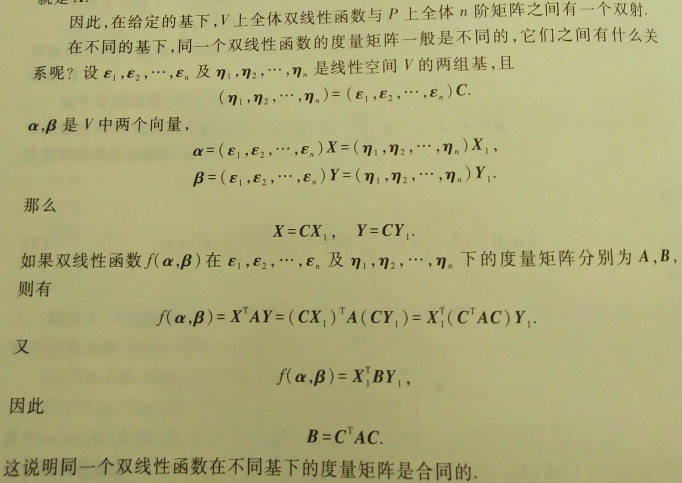
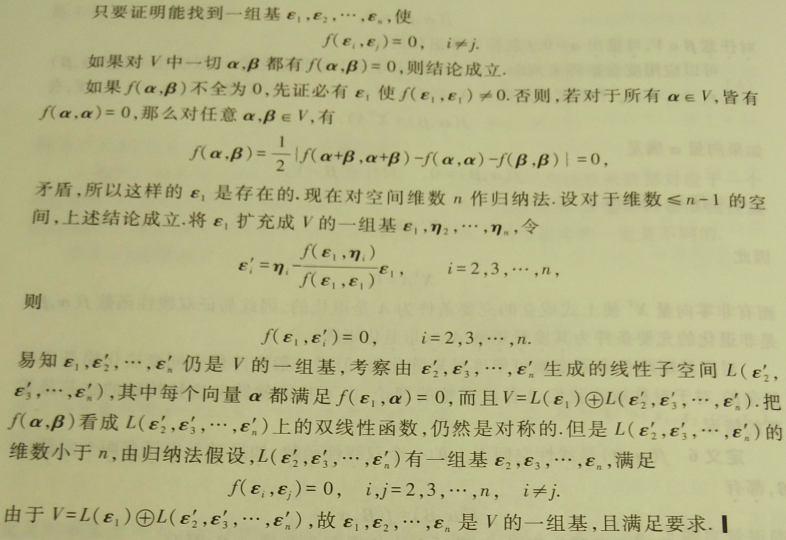

## 10 双线性函数与辛空间

这一章的目的是把二次型、欧式空间的部分内容统一到双线性函数的概念之下。

### 10.0 线性函数

> **定义1：**	设 $V$ 是数域 $P$ 上的一个线性空间，$f$ 是 $V$ 到 $P$ 的一个映射，如果 $f$ 满足
>
> 1. $f(\alpha + \beta) = f(\alpha) + f(\beta)$ ；
> 2. $f(k\alpha) = kf(\alpha)$ ，
>
> 其中 $\alpha,\beta$ 是 $V$ 中任意元素，$k$ 是 $P$ 中任意数，则称 $f$ 为 $V$ 上的一个**线性函数**。

由定义推出的简单性质：

1. 设 $f$ 是 $V$ 上的线性函数，则 $f(0)=0,f(-\alpha)=-f(\alpha)$ 。

2. 如果 $\beta$ 是 $\alpha_1,\alpha_2,\dots,\alpha_s$ 的线性组合，即
   $$
   \beta = k_1\alpha_1 +k_2\alpha_2 + \dots + k_s\alpha_s~,
   $$
   那么
   $$
   f(\beta) = k_1f(\alpha_1) + k_2f(\alpha_2) + \dots + k_sf(\alpha_s)~.
   $$

如果 $V$ 是数域 $P$ 上一个 $n$ 维线性空间。取定 $V$ 的一组基 $\varepsilon_1,\varepsilon_2,\dots,\varepsilon_n$ 。对 $V$ 上任意线性函数 $f$ 及 $V$ 中任意向量：
$$
\alpha = x_1\varepsilon_1 + x_2\varepsilon_2 + \dots + x_n\varepsilon_n~,
$$
都有：
$$
f(\alpha) = f\Big( \sum\limits_{i=1}^n x_i\varepsilon_i \Big) = \sum\limits_{i=1}^n x_if(\varepsilon_i)~.
$$
因此，$f(\alpha)$ 由 $f(\varepsilon_1),\dots,f(\varepsilon_n)$ 的值唯一确定。反之，任给 $P$ 中 $n$ 个数 $a_1,a_2,\dots,a_n$ ，用下式定义 $V$ 上一个函数 $f$:
$$
f\Big( \sum\limits_{i=1}^n x_i\varepsilon_i \Big) = \sum\limits_{i=1}^n a_i x_i~.
$$
这是一个线性函数，并且：
$$
f(\varepsilon_i) = a_i~,~~i=1,2,\dots,n~.
$$
因此，有：

> **定理1：**	设 $V$ 是 $P$ 上一个 $n$ 维线性空间，$\varepsilon_1,\varepsilon_2,\dots,\varepsilon_n$ 是 $V$ 的一组基，$a_1,a_2,\dots,a_n$ 是 $P$ 中任意 $n$ 个数，存在唯一的 $V$ 上的线性函数 $f$ ，使
> $$
> f(\varepsilon_i) = a_i~,~~i=1,2,\dots,n~.
> $$

### 10.1 对偶空间

设 $V$ 是数域 $P$ 上一个 $n$ 维线性空间，$V$ 上全体线性函数组成的集合记作 $L(V,P)$ ，可以用自然的方法在 $L(V,P)$ 上定义加法和数量乘法。

设 $f,g$ 是 $V$ 上的两个线性函数。定义函数 $f+g$ 如下：
$$
(f + g)(\alpha) = f(\alpha) + g(\alpha)~,~~\alpha\in V~.
$$
$f+g$ 也是线性函数：
$$
\begin{align}
(f+g)(\alpha+\beta) & = f(\alpha+\beta) + g(\alpha+\beta) \\
& = f(\alpha) + f(\beta) + g(\alpha) + g(\beta) \\
& = (f + g)(\alpha) + (f + g)(\beta)~,\\
(f+g)(k\alpha) & = f(k\alpha) + g(k\alpha) = kf(\alpha)+kg(\alpha)=k(f+g)(\alpha)~. 
\end{align}
$$
$f+g$ 称为 $f$ 和 $g$ 的和。

还可以定义数量乘法。设 $f$ 是 $V$ 上的一线性函数，对 $P$ 中任意数 $k$ ，定义函数 $kf$ 如下：
$$
(kf)(\alpha) = k(f(\alpha))~,~~\alpha\in V~,
$$
$kf$ 称为 $k$ 与 $f$ 的数量乘法，易证 $kf$ 也是线性函数。

容易检验，在这样定义的加法和数量乘法下，$L(V,P)$ 成为数域 $P$ 上的线性空间。

取定 $V$ 的一组基 $\varepsilon_1,\varepsilon_2,\dots,\varepsilon_n$ ，作 $V$ 上 $n$ 个线性函数 $f_1,f_2,\dots,f_n$ ，使：
$$
f_i(\varepsilon_j)=
\begin{cases}
1, & j=i; \\
0, & j \neq i,
\end{cases} ~~i,j=1,2,\dots,n~.\tag{1}
$$
因为 $f_i$ 在基 $\varepsilon_1,\varepsilon_2,\dots,\varepsilon_n$ 上的值已确定，这样的线性函数是存在且唯一的。对 $V$ 中向量 $\alpha=\sum\limits_{i=1}^n x_i \varepsilon_i$ ，有：
$$
f_i(\alpha) = x_i~,
$$
即 $f_i(\alpha)$ 是 $\alpha$ 的第 $i$ 个坐标的值。

> **引理：**	对 $V$ 中任意向量 $\alpha$ ，有：
> $$
> \alpha = \sum\limits_{i=1}^n f_i(\alpha) \varepsilon_i~,
> $$
> 而对 $L(V,P)$ 中任意向量 $f$ ，有：
> $$
> f = \sum\limits_{i=1}^n f(\varepsilon_i)f_i~.
> $$

> **定理2：**	$L(V,P)$ 的维数等于 $V$ 的维数，而且 $f_1,f_2,\dots,f_n$ 是 $L(V,P)$ 的一组基。

> **定义2：**	$L(V,P)$ 称为 $V$ 的**对偶空间**。由式 $(1)$ 决定的 $L(V,P)$ 的基称为 $\varepsilon_1,\varepsilon_2,\dots,\varepsilon_n$ 的**对偶基**。

简单地把 $V$ 的对偶空间记作 $V^*$ 。

下面探讨 $V$ 的两组基的对偶基之间的关系。

设 $V$ 是数域 $P$ 上一个 $n$ 维线性空间。$\varepsilon_1,\varepsilon_2,\dots,\varepsilon_n$ 及 $\eta_1,\eta_2,\dots,\eta_n$ 是 $V$ 的两组基。它们的对偶基分别是 $f_1,f_2,\dots,f_n$ 及 $g_1,g_2,\dots,g_n$ 。再设：
$$
(\eta_1,\eta_2,\dots,\eta_n) = (\varepsilon_1,\varepsilon_2,\dots,\varepsilon_n)A~,\\
(g_1,g_2,\dots,g_n) = (f_1,f_2,\dots,f_n)B~,
$$
其中：
$$
A = \left[\begin{matrix}
a_{11} & a_{12} & \cdots & a_{1n}\\
a_{21} & a_{22} & \cdots & a_{2n}\\
\vdots & \vdots & \ddots & \vdots\\
a_{n1} & a_{n2} & \cdots & a_{nn}\\
\end{matrix}\right]~,~~
B = \left[\begin{matrix}
b_{11} & b_{12} & \cdots & b_{1n}\\
b_{21} & b_{22} & \cdots & b_{2n}\\
\vdots & \vdots & \ddots & \vdots\\
b_{n1} & b_{n2} & \cdots & b_{nn}\\
\end{matrix}\right]~.
$$
由假设：
$$
\eta_i = a_{1i}\varepsilon_1+a_{2i}\varepsilon_2+\dots+a_{ni}\varepsilon_n~,~~i=1,2,\dots,n~,\\
g_j = b_{1j}f_1 + b_{2j}f_2 + \dots + b_{nj}f_n~,~~j=1,2,\dots,n~.
$$
因此：
$$
\begin{align}
g_j(\eta_i) & = \sum\limits_{k=}^n b_{kj}f_k(a_{1i}\varepsilon_1+a_{2i}\varepsilon_2+\dots+a_{ni}\varepsilon_n) \\
& = b_{1j}a_{1i} + b_{2j}a_{2i} + \dots + b_{nj}a_{ni} \\
& = \begin{cases}
1, & i=j; \\
0, & i \neq j,
\end{cases}~~i,j=1,2,\dots,n~.
\end{align}
$$
由矩阵乘法定义，即得：
$$
B^TA=E~,
$$
即：
$$
B^T = A^{-1}~.
$$

> **定理3：**	设 $\varepsilon_1,\varepsilon_2,\dots,\varepsilon_n$ 及 $\eta_1,\eta_2,\dots,\eta_n$ 是线性空间 $V$ 的两组基，它们的对偶基分别为 $f_1,f_2,\dots,f_n$ 及 $g_1,g_2,\dots,g_n$ 。如果由 $\varepsilon_1,\varepsilon_2,\dots,\varepsilon_n$ 及 $\eta_1,\eta_2,\dots,\eta_n$ 的过渡矩阵为 $A$ ，那么由 $f_1,f_2,\dots,f_n$ 及 $g_1,g_2,\dots,g_n$ 的过渡矩阵为 $(A^T)^{-1}$ 。 

设 $V$ 是 $P$ 上一个线性空间，$V^*$ 是其对偶空间，取定 $V$ 中一个向量 $x$ ，定义 $V^*$ 的函数：
$$
x^{**}(f) = f(x)~,~~f\in V^*~.
$$
根据线性函数的定义，容易检验 $x^{**}$ 是 $V^*$ 上的一个线性函数，因此是 $V^{*}$ 的对偶空间 $(V^*)^* = V^{**}$ 中的一个元素。

> **定理4：**	$V$ 是一个线性空间，$V^{**}$ 是 $V$ 的对偶空间的对偶空间。$V$ 到 $V^{**}$ 的映射是一个同构映射。

这个定理说明，线性空间 $V$ 也可看成 $V^*$ 的线性空间，$V$ 与 $V^*$ 实际上是互为线性函数空间的。这就是说对偶空间名词的来由。由此可知，任一线性空间都可看成某个线性空间的线性函数所成的空间。

### 10.2 双线性函数

> **定义3：**	$V$ 是数域 $P$ 上一个线性空间，$f(\alpha,\beta)$ 是 $V$ 上一个二元函数，即对 $V$ 中任意两个向量 $\alpha,\beta$ ，根据 $f$ 都唯一地对应于 $P$ 中一个数 $f(\alpha,\beta)$ 。如果 $f(\alpha,\beta)$ 有下列性质：
>
> 1. $f(\alpha,k_1\beta_1+k_2\beta_2) = k_1f(\alpha,\beta_1)+k_2f(\alpha,\beta_2)$ ；
> 2. $f(k_1\alpha_1+k_2\alpha_2,\beta) = k_1f(\alpha_1,\beta)+k_2f(\alpha_2,\beta)$ ，
>
> 其中 $\alpha,\alpha_1,\alpha_2,\beta,\beta_1,\beta_2$ 是 $V$ 中任意向量，$k_1,k_2$ 是 $P$ 中任意数，则称 $f(\alpha,\beta)$ 为 $V$ 上的一个**双线性函数**。

这个定义实际上是说对于 $V$ 上双线性函数 $f(\alpha,\beta)$ ，将其中一个变元固定时是另一个变元的线性函数。

> **例1：**	欧式空间 $V$ 的内积是 $V$ 上双线性函数。
>
> **例2：**	设 $f_1(\alpha),f_2(\alpha)$ 都是线性空间 $V$ 上的线性函数，则：
> $$
> f(\alpha,\beta) = f_1(\alpha)f_2(\beta)~,~~\alpha,\beta \in V
> $$
> 是 $V$ 上的一个双线性函数。
>
> **例3：**	设 $P^n$ 是数域 $P$ 上 $n$ 维列向量构成的线性空间，$X,Y \in P^n$ ，再设 $A$ 是 $P$ 上一个 $n$ 阶方阵。令：
> $$
> f(X,Y) = X^TAY~,\tag{2}
> $$
> 则 $f(X,Y)$ 是 $P^n$ 上的一个双线性函数。

如果设 $X=(x_1,x_2,\dots,x_n)',Y=(y_1,y_2,\dots,y_n)'$ ，并设：
$$
A = \left[\begin{matrix}
a_{11} & a_{12} & \cdots & a_{1n}\\
a_{21} & a_{22} & \cdots & a_{2n}\\
\vdots & \vdots & \ddots & \vdots\\
a_{n1} & a_{n2} & \cdots & a_{nn}\\
\end{matrix}\right]~,
$$
则：
$$
f(X,Y) = \sum\limits_{i=1}^n \sum\limits_{j=1}^n a_{ij}x_iy_j~.\tag{3}
$$
$(2)$ 或 $(3)$ 实际上是数域 $P$ 上任意 $n$ 维线性空间 $V$ 上的双线性函数 $f(\alpha,\beta)$ 的一般形式，可以如下地说明这一事实。取 $V$ 的一组基 $\varepsilon_1,\varepsilon_2,\dots,\varepsilon_n$ ，设：
$$
\alpha = [\varepsilon_1,\varepsilon_2,\dots,\varepsilon_n]
\left[\begin{matrix}x_1 \\ x_2 \\ \vdots \\ x_n \\ \end{matrix}\right] = 
[\varepsilon_1,\varepsilon_2,\dots,\varepsilon_n] X~,~~
\beta = [\varepsilon_1,\varepsilon_2,\dots,\varepsilon_n]
\left[\begin{matrix}y_1 \\ y_2 \\ \vdots \\ y_n \\ \end{matrix}\right] = 
[\varepsilon_1,\varepsilon_2,\dots,\varepsilon_n] Y~,
$$
则：
$$
f(\alpha,\beta) = 
f\Big(\sum\limits_{i=1}^nx_i \varepsilon_i,
\sum\limits_{i=1}^ny_j \varepsilon_j \Big) = 
\sum\limits_{i=1}^n \sum\limits_{j=1}^n f(\varepsilon_i,\varepsilon_j)x_iy_j~.
\tag{4}
$$
令：
$$
a_{ij}=f(\varepsilon_i,\varepsilon_j)~,~~i,j=1,2,\dots,n,\\
A = \left[\begin{matrix}
a_{11} & a_{12} & \cdots & a_{1n}\\
a_{21} & a_{22} & \cdots & a_{2n}\\
\vdots & \vdots & \ddots & \vdots\\
a_{n1} & a_{n2} & \cdots & a_{nn}\\
\end{matrix}\right]~,
$$
则 $(4)$ 就成为 $(2)$ 或 $(3)$ 。

> **定义4：**	设 $f(\alpha,\beta)$ 是数域 $P$ 上 $n$ 维线性空间 $V$ 上的一个双线性函数，$\varepsilon_1,\varepsilon_2,\dots,\varepsilon_n$ 是 $V$ 的一组基，则矩阵：
> $$
> A = \left[\begin{matrix}
> f(\varepsilon_1,\varepsilon_1) & f(\varepsilon_1,\varepsilon_2) & \cdots & f(\varepsilon_1,\varepsilon_n)\\
> f(\varepsilon_2,\varepsilon_1) & f(\varepsilon_2,\varepsilon_2) & \cdots & f(\varepsilon_2,\varepsilon_n)\\
> \vdots & \vdots & \ddots & \vdots\\
> f(\varepsilon_n,\varepsilon_1) & f(\varepsilon_n,\varepsilon_2) & \cdots & f(\varepsilon_n,\varepsilon_n)
> \end{matrix}\right]~,
> $$
> 称为 $f(\alpha,\beta)$ 在 $\varepsilon_1,\varepsilon_2,\dots,\varepsilon_n$ 下的**度量矩阵**。

上面的讨论说明，取定 $V$ 的一组基 $\varepsilon_1,\varepsilon_2,\dots,\varepsilon_n$ 后，每个双线性函数都对应于一个 $n$ 阶矩阵，就是这个双线性函数在基 $\varepsilon_1,\varepsilon_2,\dots,\varepsilon_n$ 下的度量矩阵。度量矩阵被双线性函数及基唯一确定。而且不同的双线性函数在同一组基下的度量矩阵一定是不同的。

反之，任给数域 $P$ 上一个 $n$ 阶矩阵：
$$
A = \left[\begin{matrix}
a_{11} & a_{12} & \cdots & a_{1n}\\
a_{21} & a_{22} & \cdots & a_{2n}\\
\vdots & \vdots & \ddots & \vdots\\
a_{n1} & a_{n2} & \cdots & a_{nn}\\
\end{matrix}\right]~,
$$
对 $V$ 中任意向量 $\alpha = (\varepsilon_1,\varepsilon_2,\dots,\varepsilon_n)X$ 及 $\beta=(\varepsilon_1,\varepsilon_2,\dots,\varepsilon_n)Y$ ，其中 $X=(x_1,x_2,\dots,x_n)',Y=(y_1,y_2,\dots,y_n)'$ ，用：
$$
f(\alpha,\beta) = X^TAY = \sum\limits_{i=1}^n \sum\limits_{j=1}^n a_{ij}x_iy_j
$$
定义的函数是 $V$ 上一个双线性函数。容易计算出 $f(\alpha,\beta)$ 在 $\varepsilon_1,\varepsilon_2,\dots,\varepsilon_n$ 下的度量矩阵就是 $A$ 。

> **定义5：**	设 $f(\alpha,\beta)$ 是线性空间 $V$ 上一个双线性函数，如果：
> $$
> f(\alpha,\beta) = 0~,
> $$
> $\forall \beta \in V$ 可推出 $\alpha=0$ ，$f$ 就称为**非退化的**。

可以应用度量矩阵来判断一个双线性函数是不是非退化的。设双线性函数 $f(\alpha,\beta)$ 在基 $\varepsilon_1,\varepsilon_2,\dots,\varepsilon_n$ 下的度量矩阵为 $A$ ，则对 $\alpha=(\varepsilon_1,\varepsilon_2,\dots,\varepsilon_n)X,~\beta=(\varepsilon_1,\varepsilon_2,\dots,\varepsilon_n)Y$ ，有：
$$
f(\alpha,\beta) = X^TAY~.
$$
如果向量 $\alpha$ 满足：
$$
f(\alpha,\beta) = 0~,~~\forall \beta \in V~,
$$
那么 $\forall Y$ 都有：
$$
X^TAY=0~.
$$
因此：
$$
X^TA=0~.
$$
而有非零向量 $X^T$ 使上式成立的充要条件为 $A$ 是退化的，因此易证双线性函数 $f(\alpha,\beta)$ 是非退化的充要条件为其度量矩阵 $A$ 为非退化矩阵。

对度量矩阵作为合同变换可使度量矩阵化简，但对一般矩阵用合同变换化简是比较复杂的。对于对称变换矩阵已有较完整的理论，下面就转向这种特殊的也是最重要的情形。

> **定义6：**	$f(\alpha,\beta)$ 是线性空间 $V$ 上的一个双线性函数，如果对 $V$ 中任意两个向量 $\alpha,\beta$ ，都有：
> $$
> f(\alpha,\beta) = f(\beta,\alpha)~,
> $$
> 则称 $f(\alpha,\beta)$ 为**对称双线性函数**。如果对 $V$ 中任意两个向量 $\alpha,\beta$ ，都有：
> $$
> f(\alpha,\beta) = -f(\beta,\alpha)~,
> $$
> 则称 $f(\alpha,\beta)$ 为**反称双线性函数**。

设 $f(\alpha,\beta)$ 是线性空间 $V$ 上的一个对称双线性函数，对 $V$ 的任一组基 $\varepsilon_1,\varepsilon_2,\dots,\varepsilon_n$ ，由于：
$$
f(\varepsilon_i,\varepsilon_j) = f(\varepsilon_j,\varepsilon_i)~,
$$
故其度量矩阵是对称的。另一方面，如果双线性函数 $f(\alpha,\beta)$ 在 $\varepsilon_1,\varepsilon_2,\dots,\varepsilon_n$ 下的度量矩阵是对称的，那么对 $V$ 中任意两个向量 $\alpha=(\varepsilon_1,\varepsilon_2,\dots,\varepsilon_n)X$ 及 $\beta = (\varepsilon_1,\varepsilon_2,\dots,\varepsilon_n)Y$ ，都有：
$$
f(\alpha,\beta) = X^TAY=Y^TA^TX=Y^TAX=f(\beta,\alpha)~.
$$
因此 $f(\alpha,\beta)$ 是对称的，这就是说，双线性函数是对称的，当且仅当它在任一组基下的度量矩阵是对称矩阵。

同样的，双线性函数是反称的当且仅当它在任一组基下的度量矩阵是反称矩阵。

欧式空间的内积不仅是对称双线性函数，而且它在任一组基下的度量矩阵是正定矩阵。

根据二次型中关于对称矩阵在合同变换下的标准形的理论，有：

> **定理5：**	设 $V$ 是数域 $P$ 上 $n$ 维线性空间，$f(\alpha,\beta)$ 是 $V$ 上的对称双线性函数，则存在 $V$ 的一组基 $\varepsilon_1,\varepsilon_2,\dots,\varepsilon_n$ ，使 $f(\alpha,\beta)$ 在这组基下的度量矩阵为对角矩阵。

如果 $f(\alpha,\beta)$ 在 $\varepsilon_1,\varepsilon_2,\dots,\varepsilon_n$ 下的度量矩阵为对角矩阵，那么对 $\alpha=\sum\limits_{i=1}^n x_i\varepsilon_i,~\beta=\sum\limits_{i=1}^n y_i\varepsilon_i~,f(\alpha,\beta)$ 有表达式：
$$
f(\alpha,\beta) = d_1x_1y_1 + d_2x_2y_2 + \dots + d_nx_ny_n~.
$$
这个表达式也是 $f(\alpha,\beta)$ 在 $\varepsilon_1,\varepsilon_2,\dots,\varepsilon_n$ 下的度量矩阵为对角形的充分条件。  

> **推论1：**	设 $V$ 是复数域上 $n$ 维线性空间，$f(\alpha,\beta)$ 是 $V$ 上对称双线性函数，则存在 $V$ 的一组基 $\varepsilon_1,\varepsilon_2,\dots,\varepsilon_n$ ，对 $V$ 中任意向量 $\alpha=\sum\limits_{i=1}^n x_i\varepsilon_i,~\beta=\sum\limits_{i=1}^n y_i\varepsilon_i$ ，有：
> $$
> f(\alpha,\beta) = x_1y_1 + x_2y_2 + \dots + x_ry_r~,~~0\leqslant r \leqslant n~.
> $$
> **推论2：**	设 $V$ 是实数域上 $n$ 维线性空间，$f(\alpha,\beta)$ 是 $V$ 上对称双线性函数，则存在 $V$ 的一组基 $\varepsilon_1,\varepsilon_2,\dots,\varepsilon_n$ ，对 $V$ 中任意向量 $\alpha=\sum\limits_{i=1}^n x_i\varepsilon_i,~\beta=\sum\limits_{i=1}^n y_i\varepsilon_i$ ，有：
> $$
> f(\alpha,\beta) = x_1y_1 + \dots + x_py_p - x_{p+1}y_{p+1}- \dots x_ry_r
> ~,~~0\leqslant p \leqslant r \leqslant n~.
> $$

对称双线性函数与二次齐次函数是 1-1 对应的，首先给出下述定义：

> **定义7：**	设 $V$ 是数域 $P$ 上线性空间，$f(\alpha,\beta)$ 是 $V$ 上双线性函数。当 $\alpha=\beta$ 时，$V$ 上函数 $f(\alpha,\alpha)$ 称为与 $f(\alpha,\beta)$ 对应的二次齐次函数。

给定 $V$ 上一组基 $\varepsilon_1,\varepsilon_2,\dots,\varepsilon_n$ ，设 $f(\alpha,\beta)$ 的度量矩阵为 $A=(a_{ij})_{n \times n}$ 。对 $V$ 中任一向量 $\alpha = \sum\limits_{i=1}^n x_i \varepsilon_i$ ，有：
$$
f(\alpha,\alpha) = \sum\limits_{i=1}^n\sum\limits_{j=1}^n a_{ij}x_ix_j~,
\tag{5}
$$
其中 $x_ix_j$ 的系数为 $a_{ij}+a_{ji}$ 。因此如果两个双线性函数的度量矩阵分别为：
$$
A=(a_{ij})_{n \times n} 及 B=(b_{ij})_{n \times n}~,
$$
只要：
$$
a_{ij}+a_{ji} b_{ij}+b_{ji}~,~~i,j=1,2,\dots,n~.
$$
那么它们对应的二次齐次函数就相同，因此有很多双线性函数对应于同一个二次齐次函数，但是如果要求 $A$ 为对称矩阵，即要求双线性函数为对称的，那么一个二次齐次函数只对应一个对称双线性函数。从 $(5)$ 看出二次齐次函数的坐标表达式就是前面的二次型。它与对称矩阵是 1-1 对应的，而这个对称矩阵就是唯一的与这个二次齐次函数对应的对称双线性函数的度量矩阵。

> **定理6：**	设 $f(\alpha,\beta)$ 是 $n$ 维线性空间 $V$ 上的反称双线性函数，则存在 $V$ 的一组基 $\varepsilon_1,\varepsilon_{-1},\dots,\varepsilon_r,\varepsilon_{-r},\eta_1,\dots,\eta_s$ ，使：
> $$
> \begin{cases}
> f(\varepsilon_i,\varepsilon_{-i}) = 1,&i=1,2,\dots,r~; \\
> f(\varepsilon_i,\varepsilon_j) = 0,&i+j \neq 0~; \\
> f(\alpha,\eta_k) = 0,&\alpha\in V,k=1,2,\dots,s~.
> \end{cases}
> $$

从 定理5 可知，$V$ 上的对称双线性函数 $f(\alpha,\beta)$ 如果是非退化的，则有 $V$ 的一组基 $\varepsilon_1,\varepsilon_2,\dots,\varepsilon_n$ 满足：
$$
\begin{cases}
f(\varepsilon_i,\varepsilon_{i}) \neq 0,&i=1,2,\dots,n~; \\
f(\varepsilon_i,\varepsilon_j) = 0,&j \neq i~.
\end{cases}
$$
前面的不等式是非退化条件保证的，这样的基叫做 $V$ 的对于 $f(\alpha,\beta)$ 的**正交基**。

而从 定理6 可知，$V$ 上的反称双线性函数 $f(\alpha,\beta)$ 如果是非退化的，则有 $V$ 的一组基 $\varepsilon_1,\varepsilon_2,\dots,\varepsilon_n$ ，使：
$$
\begin{cases}
f(\varepsilon_i,\varepsilon_{-i}) = 1,&i=1,2,\dots,r~; \\
f(\varepsilon_i,\varepsilon_j) = 0,&i+j \neq 0~.
\end{cases}
$$
由于非退化的条件，定理6 中的 $\eta_1,\dots,\eta_s$ 不可能出现。因此具有非退化反称双线性函数的线性空间一定是偶数维的。

对于具有非退化对称、反称双线性函数的线性空间 $V$ ，也可以将这些双线性函数看成 $V$ 上的一个“内积”，仿照欧式空间来探讨它的度量性质，一般的长度、角度很难推广进去，但是还能讨论“正交性”“正交基”以及保持这个双线性函数的线性变换等。

> **定义8：**	设 $V$ 是数域 $P$ 上的线性空间，在 $V$ 上定义了一个非退化双线性函数，则 $V$ 称为一个**双线性度量空间**。当 $f$ 是非退化对称双线性函数时，$V$ 称为 $P$ 上的**正交空间** ；当 $V$ 是 $n$ 维实线性空间，$f$ 是非退化对称双线性函数时，$V$ 称为**准欧式空间** ；当 $f$ 是非退化反称双线性函数时，$V$ 称为**辛空间**。有着非退化双线性含糊的 $f$ 的双线性度量空间常记为 $(V,f)$ 。