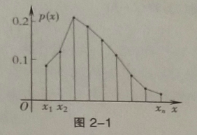

## 2 随机变量及其分布

### 2.0 随机变量的概念

> **定义1：**	设 $\Omega$ 为随机试验的样本空间，如果对每一个样本点 $\omega \in \Omega$ ，均有唯一确定的实数 $X(\omega)$ 与之对应，即存在一个定义与 $\Omega$ 的单值实函数 $X = X( \omega )$ ，则称 $X = X(\omega)$ 为样本空间 $\Omega$ 上的随机变量。

通常用大写英文字母 $X,Y,Z,\dots$ 表示随机变量。

随机变量 $X=X(\omega)$ 与普通函数的定义域有较大差别，普通函数的定义域是数集，而随机变量的定义域是试验的样本空间，这其中的样本点不一定是数。

### 2.1 离散型随机变量的概率分布

> **定义2：**	设离散型随机变量 $X$ 所有可能取的值为 $x_k(k=1, 2, \dots)$ ，而 $X$ 取值 $x_k$ 的概率为：
> $$
> P(X = x_k) = p_k ~~ (k=1,2, \dots),
> $$
> 称上式为离散型随机变量 $X$ 的概率分布或分布律。

$X$ 的概率分布也可以用表格的形式表示：

| $X$  | $x_1$ | $x_2$ |$x_3$| $\dots$ | $x_k$ | $\dots$ |
| :--: | :---: | :---: | :-:|:-----: | :---: | :-----: |
| p | $p_1$ | $p_2$ | $p_3$ | $\dots$ | $p_k$ | $\dots$ |

还可以写成矩阵形式：
$$
X \sim \left[
\begin{matrix}
x_1 & x_2 & x_3 & \dots & x_k & \dots\\
p_1 & p_2 & p_3 & \dots & p_k & \dots 
\end{matrix}
\right]
$$
用折线顺次把点列 $\{(x_i , p(x_i))\}$ 连接起来，就得到随机变量的概率分布图，如图 2 - 1 ：

由概率的基本性质，概率分布具有如下性质：

1. $p_i \geqslant 0~~(k=1, 2, \dots)$；
2. $\overset{n}{\sum \limits_{i=1}} p_i = 1$ 。

### 2.2 几种常见的离散型随机变量的分布

#### 2.2.0 "0-1"分布

> **定义3：**	若随机变量 $X$ 的概率分布为
> $$
> P(X=1) = p,~~P(X=0)=q
> $$
> 其中，$0<p<1,p+q=1$，则称 $X$ 服从 "0-1"分布（或称两点分布）。

#### 2.2.1 超几何分布

> **定义4：**	设随机变量 $X$ 的可能取值为：$0,1,2, \dots , n$ ，且
> $$
> P(X=m) = \frac{C^m_M C_{N-M}^{n-m}}{C^n_N},
> $$
> 其中，$n、M、N$ 都是正整数，且 $n \leqslant N,M \leqslant N$ ，则称 $X$ 服从超几何分布，记作 $X \sim H(n, M, N)$ 。

由排列组合的性质易知：
$$
\overset{n}{\sum \limits_{m=0}} \frac{C^m_M C_{N-M}^{n-m}}{C^n_N} = 1
$$
超几何分布的直观背景为：一批产品共有 $N$ 个，其中有 $M$ 个次品，从这批产品中任意取出 $n$ 个产品，则取出的 $n$ 个产品中的次品数 $X$ 服从超几何分布 $H(n,M,N)$ 。

#### 2.2.2 二项分布

> **定义5：**	设随机变量 $X$ 的可能取值为：$0, 1, 2, \dots , n$ ，且
> $$
> P(X=k) = C^k_np^kq^{n-k}~~(k=0,1,2,\dots , n),
> $$
> 其中，$0<p<1$，$p+q = 1$ ，则称 $X$ 服从参数为 $(n,p)$ 的二项分布，记作 $X \sim B(n,p)$。

由二项式定理，知
$$
\overset{n}{\sum \limits_{k=0}} P(X=k) = \overset{n}{\sum \limits_{k=0}}C^k_np^kq^{n-k} = (p+q)^n =1.
$$

> **定理1：**	若随机变量 $X$ 服从超几何分布 $H(n, M, N)$ ，则当 $N \rightarrow \infty$ 时，$X$ 近似地服从二项分布 $B(n,p)$ 。即
> $$
> P(X=m) = \frac{C^m_M C^{n-m}_{N-M}}{C^n_N} \rightarrow C^m_np^mq^{n-m}
> $$
> 其中 $p=\frac{M}{N},q = 1-p$ 。

下面讨论二项分布的最可能取值，即随机变量 $X$ 取何值时概率最大，设 $X \sim B(n,p)$ ，则有
$$
\frac{P(X=k)}{P(X=k-1)} = \frac{C^k_np^kq^{n-k}}{C^{k-1}_np^{k-1}q^{n-k+1}} = \frac{(n-k+1)p}{kq}\\
=1+ \frac{(n+1)p-k}{kq}.
$$
上式表明：

* 当 $k<(n+1)p$ 时，$P(X=k)>P(X=k-1)$ ；
* 当 $k=(n+1)p$ 时，$P(X=k)=P(X=k-1)$ ；
* 当 $k>(n+1)p$ 时，$P(X=k)<P(X=k-1)$ ；

当 $(n+1)p$ 不是整数时，则存在正整数 $m$ ，满足 $(n+1)p-1<m \leqslant (n+1)p$ 。当 $k$ 从 $0$ 变到 $m$ 时，$P(X=k)$ 单调增加，并在 $k=m$ 处达到最大值，之后单调减少。当 $(n+1)p$ 等于正整数 $m$ ，则有 $P(X=m)=P(X=m-1)$ ，即在 $k=m$ 和 $k=m-1$ 两处概率达到最大值，把使 $P(X=k)$ 取得最大值的 $k$ 称为二项分布的最可能取值。由上可得，最可能取值的计算方法为：

1. 若 $(n+1)p$ 不是整数，则其整数部分 $[(n+1)p]$ 即为所求；（ [ ] 表示取整）
2. 若 $(n+1)p = m$ 是整数，则 $m$ 和 $m-1$ 即为所求。

#### 2.2.3 泊松($Poisson$) 分布

> **定义6：**	若随机变量 $X$ 的可能取值为 $0,1,2,\dots$ ，其概率分布为
> $$
> P(X=k) = P_{\lambda}(k) = \frac{\lambda ^k}{k!}e^{-\lambda} ~~ (k=0,1,2, \dots),
> $$
> 其中，$\lambda > 0$ 为常数，则称 $X$ 服从参数为 $\lambda$ 的泊松分布，记作 $X \sim P(\lambda)$ ，容易看出，级数
> $$
> \overset{\infty}{\sum \limits_{k=0}}P(X=k) = \overset{\infty}{\sum \limits_{k=0}}P_{\lambda}(k)
> $$
> 是收敛的，且有
> $$
> \overset{\infty}{\sum \limits_{k=0}}P(X=k) = \overset{\infty}{\sum \limits_{k=0}}P_{\lambda}(k)= \overset{\infty}{\sum \limits_{k=0}}P_{\lambda}\frac{\lambda ^k e^{- \lambda}}{k!}\\
> = e^{-\lambda} \overset{\infty}{\sum \limits_{k=0}}\frac{\lambda ^k}{k!}\\
> = e^{-\lambda} ·e^{\lambda}=1,
> $$
> 即 $P(X=k)$ 满足分布律的两个条件。

> **定理2(泊松定理)：**	设随机变量 $X_n \sim B(n, p_n)(n=1, 2, \dots)$ ，又设 $np_n = \lambda >0$ 是常数，则有
> $$
> \lim_{n \rightarrow \infty} P(X_n = k) = \frac{\lambda ^k}{k!} e^{-\lambda}.
> $$

因此，只要 $n$ 很大，$p$ 很小，$np$ 的值不太大，就可以用泊松分布近似替代二项分布，即
$$
C^k_n p^k (1-p)^{n-k} \approx \frac{\lambda ^k}{k!} e^{-\lambda}~~(其中，\lambda = np).
$$

#### 2.2.4 几何分布

> **定义7：**	若随机变量 $X$ 的概率分布为
> $$
> P(X=k) = q^{k-1}p, ~~k=1, 2, \dots
> $$
> 其中，$0<p<1$ ，$p+q=1$ ，则称 $X$ 服从参数为 $p$ 的几何分布，记作 $X \sim G(p)$ 。

### 2.3 随机变量的分布函数

#### 2.3.0 分布函数的定义

> **定义8：**	设 $X$ 是一个随机变量，$x$ 为任意实数，称函数
> $$
> F(x) = P(X \leqslant x)
> $$
> 为随机变量 $X$ 的分布函数。

就是 $X$ 的取值落在 $(- \infty , x]$ 内的概率。

.png)

#### 2.3.1 分布函数的性质

分布函数具有下列基本性质：

1. $0 \leqslant F(x) \leqslant 1$ ，且 $F(+ \infty)= \lim \limits_{x \rightarrow \infty} F(x)=1$ ， $F(- \infty)= \lim \limits_{x \rightarrow -\infty} F(x)=0$ 。

2. $F(x)$ 是 $x$ 的单调不减函数，即若 $x_1 < x_2$ ，则 $F(x_1) \leqslant F(x_2)$ 。

3. $F(x)$ 右连续，即 $F(x+0) = F(x)$ 。

4. 对于任意的 $x_1 < x_2 \in R$ ，则
   $$
   P(x_1 < X \leqslant x_2) = F(x_2) - F(x_1).
   $$

5. 对于任意的 $x \in R$ ，有 $P(X=x)=F(x)-F(x-0)$ 。

6. 对于离散型随机变量，我们有
   $$
   F(x)=P(X \leqslant x)= \sum \limits_{x_i \leqslant x} P(X=x),
   $$
   这里和式是对小于等于 $x$ 的一切 $x_i$ 求和。

7. 对于连续型随机变量，且它的分布函数 $F(x)$ 是连续函数。它的图形是位于直线 $y=0$ 与 $y=1$ 之间的单调不减的连续曲线。

### 2.4 连续型随机变量的概率密度

> **定义9：**	设连续型随机变量 $X$ 落在区间 $(x, x+ \triangle x]$ 内的概率为
> $$
> P(x < X \leqslant x + \triangle x),
> $$
> 其中，$x$ 是任意实数， $\triangle x > 0$ 是区间的长度，称比值
> $$
> \frac{P(x < X \leqslant x + \triangle x)}{\triangle x}
> $$
> 为随机变量 $X$ 在区间 $(x, x + \triangle x]$ 上的平均概率分布密度。

> **定义10：**	如果当 $\triangle x \rightarrow 0$ 时，比值
> $$
> \frac{P(x < X \leqslant x + \triangle x)}{\triangle x}
> $$
> 的极限存在，则称这极限值为随机变量 $X$ 在点 $x$ 处的概率密度或概率分布密度，记作
> $$
> f(x) = \lim \limits_{\triangle x \rightarrow 0} \frac{P(x<X\leqslant x + \triangle x)}{\triangle x}.
> $$

分布函数 $F(x)$ 与概率密度 $f(x)$ 的关系如下：

1. $f(x) = F'(x)$ .
2. $F(x) = \int_{-\infty}^x f(t) dt$ .

连续型随机变量的分布函数与 $R$ 上处处连续。因此，若 $X$ 为连续型随机变量，则对于任意的 $x \in R$ ，都有
$$
P(X=x)=F(x)-F(x-0)=0,
$$
即连续型随机变量取任何值的概率都是 0 。由这一事实可知：一个事件的概率为 0 并不表明它是不可能事件。同样的，一个事件的概率为 1 ，这个事件也不一定是必然事件。

在计算连续型随机变量落在某一区间的概率时，可以不必区分该区间是开区间或闭区间或半开区间，即
$$
P(a \leqslant X \leqslant b) = P(a < X < b) = P(a < X \leqslant b) = P(a \leqslant X < b).
$$
概率密度 $f(x)$ 具有如下性质：

1. 由定义可知，$f(x) \geqslant 0$ 。概率密度 $y=f(x)$ 的图形通常叫做分布曲线，且该分布曲线位于 $x$ 轴的上方。

2. 根据牛顿-莱布尼兹公式，且有 $F(-\infty)=0,F(+\infty)=1$ ，有
   $$
   \int_{-\infty}^{+\infty} f(x)dx = 1.
   $$

3. $P(x_1 < X \leqslant x_2) = F(x_2)-F(x_1)=\int_{x_1}^{x_2}f(x)dx ~ .$

$f(x)$ 本身并非概率，但它的大小却决定了 $X$ 落入区间 $(x, x + \triangle x]$ 内的概率的大小。$f(x)$ 反映了点 $x$ 附近所分布的概率的"稀疏"程度。

### 2.5 几种常用的连续随机变量的分布

#### 2.5.0 均匀分布

> **定义11：**	若随机变量 $X$ 的概率密度为
> $$
> f(x) = 
> \begin{cases}
>     \frac{1}{b-a}, & a<x<b;\\
>     0,& 其他.
> \end{cases}
> $$
> 则称 $X$ 服从区间 $(a,b)$ 上的均匀分布，记作 $X \sim U(a, b)$ 。

对于均匀分布，有 $F(x)$ 分布函数如下：
$$
F(x) = 
\begin{cases}
	0, & x \leqslant a;\\
    \frac{x-a}{b-a}, & a<x<b;\\
    1, & x \geqslant b.
\end{cases}
$$
设 $X \sim U(a, b)$ ，对任意的 $x_1, x_2 \in (a, b)(x_1 < x_2)$ ，有
$$
P(x_1 < X < x_2) = F(x_2)-F(x_1)=\frac{x_2 - x_1}{b-a},
$$
这表明，$X$ 落在 $(a, b)$ 的子区间 $(x_1, x_2)$ 上的概率只与子区间的长度 $x_2 - x_1$ 有关，而与子区间在区间 $(a, b)$ 中的具体位置无关。$X$ 落在 $(a, b)$ 的子区间 $(x_1 , x_2)$ 上的概率与子区间的长度 $x_2 - x_1$ 成正比。 

#### 2.5.1 指数分布

> **定义12：**	若连续型随机变量 $X$ 的概率密度为
> $$
> f(x) = 
> \begin{cases}
> 	\lambda e ^{-\lambda x}, & x > 0;\\
>     0, & x \leqslant 0.
> \end{cases}
> $$
> 其中，$\lambda > 0$ ，为常数，则称 $X$ 服从参数为 $\lambda$ 的指数分布，记为 $X \sim e(\lambda)$ 。

易得对于指数分布，有
$$
F(x) = 
\begin{cases}
	1 - e ^{-\lambda x}, & x > 0;\\
    0, & x \leqslant 0.
\end{cases}
$$
指数分布有以下重要性质：

* 对任意的 $s > 0 , t > 0$ ，有
  $$
  \begin{align}
  P(X>s+t|X>s) & = \frac{P(X>s+t)}{P(X>s)}=\frac{e^{-\lambda (s+t)}}{e^{-\lambda s}}\\
  & = e^{-\lambda t}=P(X>t).
  \end{align}
  $$
  

#### 2.5.2 正态分布

> **定义13：**	若随机变量 $X$ 的概率密度为：
> $$
> f(x) = \frac{1}{\sqrt{2\pi} \sigma }e^{- \frac{(x-\mu)^2}{2 \sigma^2}} ~ , x ~ \in (- \infty , + \infty).
> $$
> 其中，$\mu 、\sigma$ 是常数，且 $\sigma > 0$，则称 $X$ 服从参数为 $\mu , \sigma^2$ 的正态分布，记为 $X \sim N(\mu, \sigma^2)$ 。

显然，$f(x) \geqslant 0$，且令 $\frac{x - \mu}{\sigma} = t$ 得
$$
\int^{+\infty}_{-\infty} \frac{1}{\sqrt{2\pi} \sigma }e^{- \frac{(x-\mu)^2}{2 \sigma^2}} dx =
\frac{1}{\sqrt{2 \pi}} \int_{- \infty}^{+ \infty} e^{- \frac{t^2}{2}} dt
$$
利用广义积分 $\int^{+\infty}_0 e^{-x^2}dx = \sqrt{\frac{\pi}{2}}$ ，有
$$
\int_{- \infty}^{+ \infty} e^{- \frac{t^2}{2}} dt = \sqrt{2 \pi}~,
$$
因此有 $\frac{1}{\sqrt{2\pi} \sigma } \int^{+\infty}_{-\infty} e^{- \frac{(x-\mu)^2}{2 \sigma^2}} dx = 1 $ 。

正态分布的分布函数为
$$
F(x) = \frac{1}{\sqrt{2\pi} \sigma } \int^{x}_{-\infty} e^{- \frac{(t-\mu)^2}{2 \sigma^2}} dt ~ , -\infty < x < +\infty ~ .
$$
$\sigma$ 控制正态图像的高矮，越大越矮，即越分散；$\mu$ 控制图像的左右位置。

正态分布的特征：

1. 函数 $f(x)$ 的图形关于直线 $x = \mu$ 对称。
2. $f(x)$ 在 $x = \mu$ 处取得最大值 $f(\mu) = \frac{1}{\sqrt{2 \pi}·\sigma}$ 。

**标准正太分布：** 	常用 $\varphi (x)$ 表示，即 $\varphi (x) = \frac{1}{\sqrt{2 \pi}}e^{- \frac{x^2}{2}} ~~ (-\infty < x < +\infty) $ 。

相应的，标准正态分布的分布函数记为：
$$
\Phi(x) = \frac{1}{\sqrt{2 \pi}} \int^{x}_{- \infty} e^{\frac{t^2}{2}}dt~~(-\infty < x < +\infty) .
$$
且 $\Phi(-x) = 1 - \Phi(x)$ 。

对于正态分布，有如下结论：

1. 若 $X \sim N(\mu , \sigma^2)$ ，则 $Y = \frac{X - \mu}{\sigma} \sim N(0,1)$ 。
2. 一般正态分布的分布函数 $F(x)$ 与标准正态分布的分布函数 $\Phi (x)$ 之间的关系为 $F(x) = \Phi(\frac{x - \mu}{\sigma})$ 。

### 2.6 随机变量函数的分布

设 $X$ 为随机变量，$g(x)$ 为实数集 $D$ 上的连续函数，且 $X$ 的全部可能取值都落在 $D$ 上，则 $X$ 的函数 $Y = g(X)$ 也是一个随机变量，当 $X$ 取值 $x$ 时，随机变量 $Y$ 取值 $y=g(x)$ 。

由随机变量 $X$ 的分布去求 $Y = g(X)$ 的分布。

#### 2.6.0 离散型随机变量函数的分布

一般地，若离散型随机变量 $X$ 的概率分布为：

|   $X$    |  $x_1$   |  $x_2$   |  $x_3$   | $\dots$ |  $x_k$   | $\dots$ |
| :------: | :------: | :------: | :------: | :-----: | :------: | :-----: |
| $p(x_i)$ | $p(x_1)$ | $p(x_2)$ | $p(x_3)$ | $\dots$ | $p(x_k)$ | $\dots$ |

为了求随机变量函数 $Y = g(X)$ 的概率分布，应当先写出下表：

|     $Y$      | $g(x_1)$ | $g(x_2)$ | $g(x_3)$ | $\dots$ | $g(x_k)$ | $\dots$ |
| :----------: | :------: | :------: | :------: | :-----: | :------: | :-----: |
| $p(Y = y_i)$ | $p(x_1)$ | $p(x_2)$ | $p(x_3)$ | $\dots$ | $p(x_k)$ | $\dots$ |

如果 $y_1, y_2, \dots , y_k, \dots$ 的值全不相等，则上表就是随机变量 $Y$ 的概率分布；如果 $y_1, y_2, \dots , y_k, \dots$ 的值中有相等的，则把那些相等的值合并起来，对应的概率相加，就得到 $Y$ 的概率分布。

#### 2.6.1 连续型随机变量函数的分布

对于连续型随机变量函数，为了求 $Y = g(X)$ 的概率密度 $f_Y(y)$ ，应先求 $Y$ 的分布函数。按分布函数的定义
$$
F_Y(y) = P(Y \leqslant y) = P(g(X) \leqslant y).
$$
从不等式 $g(X) \leqslant y$ 中解得 $X$ 的取值范围，利用 $X$ 的概率密度 $f_X(x)$ 即可求得 $F_Y(y)$ ，再对 $y$ 求导数，得到 $Y$ 的概率密度。

> **定理3：**	设随机变量 $X$ 具有概率密度 $f_X(x)$ ，$-\infty < x < +\infty$ ，函数 $g(x)$ 处处可导，且恒有 $g'(x) > 0(或g'(x)<0)$ ，则 $Y = g(X)$ 是连续型随机变量，其概率密度为：
> $$
> f_Y(y) = 
> \begin{cases}
>     f_X[h(y)] ~ |h'(y)|, & \alpha < y < \beta ~ ;\\
>     0,& 其他 .
> \end{cases}
> $$
> 其中，$\alpha = min(g(-\infty),g(+\infty))$ ，$\beta = max(g(-\infty),g(+\infty))$ ，$h(y)$ 是 $g(x)$ 的反函数。