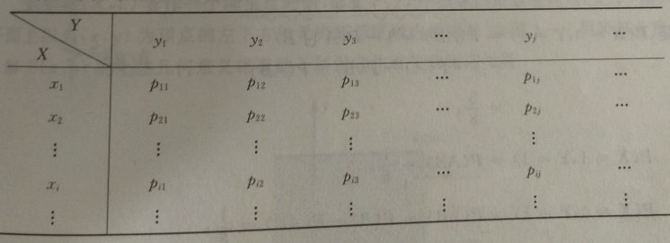
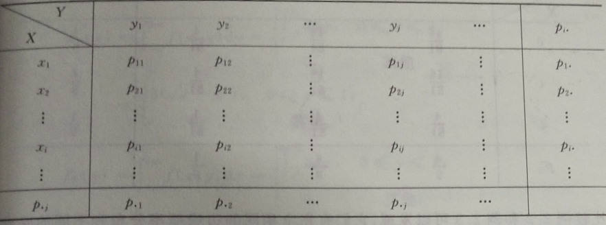

## 3 多维随机变量及其分布

### 3.0 二维随机变量的联合分布

#### 3.0.0 二维离散型随机变量的联合概率分布

> **定义1：**	设 $(X,Y)$ 为二维离散型随机变量，其全部可能取值为 $(x_i,y_i)(i,j=1, 2, \dots)$ ，称
> $$
> P(X=x_i,Y=y_i) = p_{ij}~~(i,j=1, 2, \dots)
> $$
> 为 $(X,Y)$ 的联合概率分布（或联合分布律）。

联合概率分布也可以用下面的表格来表示：

由概率的定义可知，$p_{ij}$ 具有如下性质：

1. $0 \leqslant p_{ij} \leqslant 1$ ；
2. $\sum \limits_{i,j} p_{ij} = \overset{\infty}{\sum \limits_{j=1}} \overset{\infty}{\sum \limits_{i=1}} p_{ij} = 1$ . 

#### 3.0.1 二维随机变量的联合分布函数

> **定义2：**	设 $(X,Y)$ 为二维随机变量，$x,y$ 为任意实数，则称二元函数
> $$
> F(x, y) = P(X \leqslant x, Y \leqslant y) = p[\{X \leqslant x \} ~ \cap ~ \{Y \leqslant y\}]
> $$
> 为 $(X,Y)$ 的联合分布函数。

如果将 $(X,Y)$ 看作一个随机点，那么 $F(x, y)$ 描述的就是随机点 $(X,Y)$ 落入 $xy$ 平面上以点 $(x, y)$ 为顶点的左下方的无穷矩形区域内的概率。

该联合分布律有如下性质：

1. 对任意实数 $x, y$ ，有 $0 \leqslant F(x, y) \leqslant 1$ ；

2. $F(x, y)$ 关于 $x$ 和 $y$ 都是单调不减的；

3. 对任意 $x$ 和 $y$ ，有
   $$
   F(-\infty, y) = \lim \limits_{x \rightarrow -\infty} F(x, y) = 0,\\
   F(x, -\infty) = \lim \limits_{y \rightarrow -\infty} F(x, y) = 0,\\
   F(-\infty,-\infty) = \lim \limits_{x \rightarrow -\infty \\ y \rightarrow -\infty} F(x, y) = 0,\\
   F(+\infty,+\infty) = \lim \limits_{x \rightarrow +\infty \\ y \rightarrow +\infty} F(x, y) = 1;
   $$

4. 对任意的 $x_1 < x_2$，$y_1 < y_2$ 有
   $$
   P(x_1 < X \leqslant x_2 , y_1 < Y \leqslant y_2) = F(x_2, y_2) - F(x_2, y_1) - F(x_1, y_2)+F(x_1, y_1) \geqslant 0~;
   $$

5. 二维离散型随机变量 $(X,Y)$ 的联合分布函数与概率分布之间具有以下关系：
   $$
   F(x, y) = \sum \limits_{x_i \leqslant x} \sum \limits_{y_i \leqslant y} p_{ij}, 
   $$
   其中，和式是对一切满足 $x_i \leqslant x$ ，$y_j \leqslant y$ 的 $i$ 和 $j$ 求和。

6. 对于二维连续型随机变量 $(X,Y)$ ，它的联合分布函数 $F(x,y)$ 为连续函数。

#### 3.0.2 二维连续型随机变量的联合概率密度

> **定义3：**	设二维随机变量 $(X, Y)$ 落在矩形区域 $D : x < X \leqslant x + \triangle x , y < Y \leqslant y + \triangle y$ 内的概率为
> $$
> \begin{align}
> &P(x < X \leqslant x + \triangle x , y < Y \leqslant y + \triangle y) \\
> & ~~ = F(x + \triangle x, y + \triangle y) - F(x+\triangle x, y) - F(x, y + \triangle y)+F(x, y) ~ ,
> \end{align}
> $$
> 其中，$x,y$ 为任意实数，$\triangle x > 0, \triangle y > 0 $ ，当 $\triangle x \rightarrow 0,\triangle y \rightarrow 0$ 时，称极限
> $$
> f(x, y) = \lim \limits_{\triangle x \rightarrow 0 \\ \triangle y \rightarrow 0} \frac{P(x< X < x+ \triangle x ~ , ~ y < Y < y + \triangle y)}{\triangle x \triangle y}
> $$
> 为二维连续型随机变量 $(X,Y)$ 的联合概率密度，记作 $f(x,y)$ 。

二维概率密度的图形可以描绘成曲面 $z = f(x, y)$ ，通常称这曲面为分布曲面。

按照定义，概率密度 $f(x, y)$ 具有下列性质：

1. $f(x, y) \geqslant 0$；

2.  $\int^{+\infty}_{-\infty} \int^{+\infty}_{-\infty} f(x, y)dxdy = 1$ ；

3. 设 $G$ 是平面 $xoy$ 上的区域，则 $(X,Y)$ 落在 $G$ 内的概率为
   $$
   P\{(X,Y) \in G\} = \iint \limits_{G} f(x,y)dxdy ~ ；
   $$

4. 若 $f(x,y)$ 在点 $(x, y)$ 连续，则有 $\frac{\partial ^2 F(x, y)}{\partial x \partial y} = f(x,y)$ ；

5. $F(x, y) = P(X \leqslant x,Y \leqslant y) = \int^{+\infty}_{-\infty} \int^{+\infty}_{-\infty} f(u, v)dudv$ .

#### 3.0.3 两个重要的二维连续分布

##### 3.0.3.0 二维均匀分布

> **定义4：**	设 $D$ 为 $xy$ 平面上的有界区域，面积为 $A$ ，如果二维随机变量 $(X,Y)$ 具有联合概率密度
> $$
> f(x, y)=
> \begin{cases}
>     \frac{1}{A}, & (x, y) \in D ~ ;\\
>     0 , & (x, y) \notin D ~ .
> \end{cases}
> $$
> 则称 $(X,Y)$ 在 $D$ 上服从均匀分布。

如果二维随机变量 $(X,Y)$ 在 $D$ 上服从均匀分布，且 $G$ 为 $D$ 的子区域，面积为 $A_G$ ，则
$$
\begin{align}
P\{(X,Y) \in G\} & = \iint \limits_{G} \frac{1}{A} dxdy \\
& = \frac{A_G}{A} ~.
\end{align}
$$
这表明服从区域 $D$ 上均匀分布的二维随机变量 $(X,Y)$ 落入 $D$ 内任意子区域 $G$ 内的概率只与 $G$ 的面积有关，而与 $G$ 的形状及位置无关。

##### 3.0.3.1 二维正态分布

> **定义5：**	如果二维随机变量 $(X,Y)$ 的概率密度为 
> $$
> \Large
> f(x,y)=\frac{1}{2 \pi \sigma_1 \sigma_2 \sqrt{1-\rho^2}}
> e^{-\frac{1}{2(1-\rho^2)} 
> [\frac{(x-\mu_1)^2}{\sigma^2_1} - \frac{2\rho (x-\mu_1)(y-\mu_2)}{\sigma_1 \sigma_2} + \frac{(y-\mu_2)^2}{\sigma^2_2}]} \\
> \large
> (-\infty < x < +\infty ~ , ~ -\infty < y < +\infty),
> $$
> 其中，$\mu_1 、\mu_2 、\sigma_1 、\sigma_2 、\rho$ 均为参数，且 $\sigma_1 >0,\sigma_2>0,-1< \rho < 1$ ，则称 $(X,Y)$ 服从参数为 $\mu_1, \mu_2, \sigma_1^2,\sigma_2^2 , \rho$ 的二维正态分布，记作 $(X,Y) \sim N(\mu_1,\sigma^2_1;\mu_2,\sigma^2_2)$ 。 

### 3.1 二维随机变量的边缘分布

#### 3.1.0 边缘分布函数

二维随机变量 $(X,Y)$ 作为一个整体，具有联合分布函数 $F(x, y)$ ，而分量 $X$ 和 $Y$ 都是一维随机变量，它们各有其自己的分布函数，分别记为 $F_X(x)$ 和 $F_Y(y)$ ，依次称它们为随机变量 $(X,Y)$ 关于分量 $X$ 和 $Y$ 的边缘分布函数。

事实上，边缘分布函数可以由 $(X,Y)$ 的联合分布函数 $F(x,y)$ 来确定。设随机变量 $(X,Y)$ 的联合分布函数为 $F(x,y)$ ，则：
$$
\begin{align}
F_X(x) & = P(X \leqslant x) = P(X \leqslant x, Y < +\infty)\\
& = F(x, +\infty) = \lim_{y \rightarrow +\infty} F(x,y) ~ ;
\end{align}
$$

$$
\begin{align}
F_Y(y) & = P(Y \leqslant y) = P(X < +\infty, Y \leqslant y)\\
& = F(+\infty, y) = \lim_{x \rightarrow +\infty} F(x,y),
\end{align}
$$

所以有：
$$
F_X(x) = F(x, +\infty) ~ ;\\
F_Y(y) = F(+\infty,y) ~ .
$$

#### 3.1.1 离散型随机变量的边缘概率分布

> **定义6：**	称二维离散型随机变量 $(X,Y)$ 中分量 $X(或Y)$ 的概率分布（或分布律）为 $(X,Y)$ 关于 $X(或Y)$ 的边缘概率分布（或边缘分布律）。

事实上，边缘概率分布可由联合概率分布求得：
$$
\begin{align}
P(X = x_i) & = P(\{X = x_i\} \cup \{Y = y_i\}) = P(\mathop{\cup} \limits_{j} \{X = x_i, Y = y_i\}) \\
& = \sum_j P(X = x_i,Y = y_i) = \sum_j p_{ij}(i = 1, 2, \dots )
\end{align}
$$

类似地，有 $P(Y = y_i) = \sum \limits_i p_{ij}(j=1, 2, \dots)$ 。通常记 $p_{i·} = \sum\limits_j p_{ij}~,~p_{·j} = \sum\limits_{j} p_{ij}$ ，所以有 $P(X=x_i)=p_{i·},P(Y = y_i) = p_{·j}$ 。

二维离散型随机变量 $(X,Y)$ 的联合概率分布和边缘概率分布通常也被列成下面表格的形式：

注意，相同的边缘概率分布不代表有相同的联合概率分布，对 $(X,Y)$ 中分量的概率分布的讨论不能代替对 $(X,Y)$ 整体分布的讨论。

#### 3.1.2 连续型随机变量的边缘概率密度

> **定义7：**	称二维连续型随机变量 $(X,Y)$ 中分量 $X(或Y)$ 的概率密度为 $(X,Y)$ 关于 $X(或Y)$ 的边缘密度概率。

设 $(X,Y)$ 为连续型随机变量，其联合概率密度为 $f(x,y)$ ，则 $X$ 的边缘分布函数为 
$$
F_X(x) = F(x,+\infty)=\int^{x}_{-\infty}\Big[  \int^{+\infty}_{-\infty} f(x,y)dy \Big]dx ~ ,
$$
所以，$X$ 的边缘概率密度为
$$
f_X(x) = (F_X(x))' = \int^{+\infty}_{-\infty} f(x,y)dy ~ .
$$
同理可得，$Y$ 的边缘分布函数与边缘概率密度为
$$
F_Y(y) = F(+\infty , y)=\int^{y}_{-\infty}\Big[  \int^{+\infty}_{-\infty} f(x,y)dx \Big]dy ~ ,\\
f_Y(y) = (F_Y(y))' = \int^{+\infty}_{-\infty} f(x,y)dx ~ .
$$

> **定理1：**	若随机变量 $(X,Y)$ 服从二维正态分布 $N(\mu_1,\sigma^2_1 ; \mu_2 , \sigma^2_2 ; \rho)$ ，则 $X \sim N(\mu_1,\sigma^2_1)$ ，$Y \sim N(\mu_2, \sigma^2_2)$ 。

### 3.2 二维随机变量的条件分布

#### 3.2.0 离散型随机变量的条件概率分布

> **定义8：**	设 $(X,Y)$ 是二维离散型随机变量，其联合概率分布为
> $$
> P(X=x_i,Y=y_i)=p_{ij},i=1, 2, \dots,j=1, 2, \dots ~~.
> $$
> $(X,Y)$ 关于 $X$ 与 $Y$ 的边缘概率分布分别为
> $$
> P(X=x_i)=p_{i·} = \sum_{j}p_{ij},i=1, 2, \dots~~;\\
> P(Y=y_i)=p_{·j} = \sum_{i}p_{ij},j=1, 2, \dots~~.\\
> $$

称在 $Y=y_i$ 的条件下，随机变量 $X$ 的概率分布为在 $Y=y_i$ 的条件下随机变量 $X$ 的条件概率分布，记作 $P_{X|Y}(x_i|y_i)$ ；同样的，也有 $P_{Y|X}(y_i|x_i)$ 。

若 $P(Y=y_i) > 0$ ，则有：
$$
\begin{align}
P_{X|Y}(x_i|y_i) & = P(X=x_i|Y=y_i) = \frac{P(X=x_i,Y=y_i)}{P(Y=y_i)}\\
& = \frac{p_{ij}}{p_{·j}},(i=1, 2, \dots) ~ ；
\end{align}
$$
若 $P(X=x_i) > 0$ ，则有：
$$
\begin{align}
P_{Y|X}(y_i|x_i) & = P(Y=y_i|X=x_i) = \frac{P(X=x_i,Y=y_i)}{P(X=x_i)}\\
& = \frac{p_{ij}}{p_{i·}},(j=1, 2, \dots) ~ .
\end{align}
$$
这就是求条件概率分布的公式。

#### 3.2.1 连续型随机变量的条件概率密度

设 $(X,Y)$ 是二维连续型随机变量，由于 $P(Y=y)=0$ ，因此不能够像离散型那样引入条件分布。可以使用极限的方法给出如下定义：

> **定义9：**	设 $(X,Y)$ 是二维连续型随机变量，给定 $y,f_Y(y)>0$ ，假设 $P(y<Y\leqslant y + \Delta y) > 0$ ，且对于任意实数 $x$ ，极限
> $$
> \lim_{\Delta y \rightarrow 0}P(X \leqslant x|y<Y\leqslant y + \Delta y) = 
> \lim_{\Delta y \rightarrow 0}\frac{P(X\leqslant x,y<Y\leqslant y + \Delta y)}{P(y<Y\leqslant y + \Delta y)}
> $$
> 存在，则称此极限为在条件 $Y=y$ 下 $X$ 的条件分布函数，记为 $F_{X|Y}(x|y)$ ；同样的，可以定义在条件 $X=x$ 下 $Y$ 的条件分布函数，记为 $F_Y|X(y|x)$ 。

若 $f_X(x) > 0$ ，有
$$
F_{Y|X}(y|x) = \frac{\int^y_{-\infty} f(x, y)dy}{f_X(x)},\\
f_{Y|X}(y|x) = \frac{f(x,y)}{f_X(x)} .
$$

### 3.3 随机变量的独立性

> **定义10：**	设 $X$ 和 $Y$ 为离散型随机变量，若对任意的 $i、j$ ，事件 $\{X=x_i\}$ 与 $\{Y=y_i\}$ 相互独立，则称随机变量 $X$ 和 $Y$ 相互独立；设 $X$ 与 $Y$ 为连续型随机变量，若对任意的实数 $x,y$ ，事件 $\{X \leqslant x\}$ 与 $\{Y \leqslant y\}$ 相互独立，则称随机变量 $X$ 与 $Y$ 相互独立。

> **定理2：**	随机变量 $X$ 与 $Y$ 相互独立的充要条件是对任意的 $x,y$ 有
> $$
> \begin{align}
> 连续型:& F(x,y) = F_X(x)F_Y(y) ~ ;\\
> & f(x,y) = f_X(x)·f_Y(y) ~ ;\\
> 离散型:& P(X=x_i,Y=y_i) = P(X=x_i)P(Y=y_i) ~ .
> \end{align}
> $$

> **定义11：** 定义10推广到 $n$ 个随机变量就可以得到：
> $$
> F(x_i,x_2,\dots,x_n) = F_{x_1}(x_1)F_{x_2}(x_2) \dots F_{x_n}(x_n).
> $$

若 $X$ 与 $Y$ 是离散型随机变量，且相互独立，则任一变量的条件概率分布与其边缘概率分布是相同的。有
$$
P_{X|Y}(x_i|y_j) = \frac{p_{ij}}{p_{·j}} = \frac{p_{i·}p_{·j}}{p_{·j}} = p_{i·} ~ ;\\
P_{Y|X}(y_j|x_i) = \frac{p_{ij}}{p_{i·}} = \frac{p_{i·}p_{·j}}{p_{i·}} = p_{·j} ~ .
$$
若 $X$ 与 $Y$ 是连续型随机变量，且相互独立，则任一变量的条件概率密度等于其边缘概率密度。有
$$
f_{X|Y}(x|y) = \frac{f(x,y)}{f_Y(y)} = \frac{f_X(x) f_Y(y)}{f_Y(y)} = f_X(x) ~ ;\\
f_{Y|X}(y|x) = \frac{f(x,y)}{f_X(x)} = \frac{f_X(x) f_Y(y)}{f_X(x)} = f_Y(y) ~ .
$$

### 3.4 二维随机变量函数的分布

#### 3.4.0 $Z=X+Y$ 的分布

设 $(X,Y)$ 是离散型随机变量，其联合概率密度分布为
$$
p_{ij} = P(X=x_i,Y=y_j)(i,j=1, 2, \dots) ~ ,
$$
则 $Z=X+Y$ 的概率分布为
$$
\begin{align}
P(Z=z_k) & = \sum_{x_i + y_i = z_k} P(X=x_i,Y=y_i)\\
& = \sum_i P(X=x_i,Y=z_k-x_i)(k=1, 2, \dots),\\
或 P(Z=z_k) & = \sum_j P(X=z_k-y_j,Y=y_j),(k=1, 2, \dots).
\end{align}
$$
设 $(X,Y)$ 是连续型随机变量，其联合概率密度分布为 $f(x,y)$ ，则 $Z=X+Y$ 的分布函数为
$$
\begin{align}
F_Z(z) & = P(Z \leqslant z) = P(X+Y \leqslant z) = \iint_{x+y \leqslant z} f(x,y)dxdy\\
& = \int^{+\infty}_{-\infty}dx \int^{z-x}_{-\infty}f(x,y)dy ~ \Big[或 \int^{+\infty}_{-\infty}dy \int^{z-y}_{-\infty}f(x,y)dx \Big] ~ ,
\end{align}
$$
其概率密度为
$$
f_Z(z) = F'_Z(z) = \int^{+\infty}_{-\infty} f(x, z-x)dx ~ , 或 \\
f_Z(z) = \int^{+\infty}_{-\infty}f(z-y,y)dy
$$
特别地，当 $X$ 和 $Y$ 相互独立时，有 $f(x,y) = f_X(x)f_Y(y)$ ，则
$$
f(x,z-x) = f_X(x)f_Y(z-x) ~ ,\\
f(z-y,y) = f_X(z-y)f_Y(y) ~ .
$$
所以
$$
f_Z(z) = \int^{+\infty}_{-\infty} f(x, z-x)dx = \int^{+\infty}_{-\infty}f_X(x)f_Y(z-x)dx ~ , ~ 或\\
f_Z(z) = \int^{+\infty}_{-\infty} f(z-y, y)dx = \int^{+\infty}_{-\infty}f_X(z-y)f_Y(y)dy ~ .
$$
一般来说，两个独立的正态随机变量之和仍为正态随机变量。

若随机变量 $X_1,X_2,\dots , X_n$ 相互独立，且都服从正态分布，则它们的线性组合 $a_1X_1 + a_2X_2 + \dots + a_nX_n$ 也服从正态分布。

另一种常用方法就是先求出 $Z=X+Y$ 的分布函数，再求导得到其密度函数。

#### 3.4.1 $Z=\max\{X,Y\}$ 和 $Z=\min\{X,Y\}$ 的分布

设 $X,Y$ 是两个相互独立的随机变量，它们的分布函数分别为 $F_X(x)$ 和 $F_Y(y)$ 。由于事件 $\{ \max \{X,Y\} \leqslant z\}$ 等价于事件 $\{X\leqslant z,Y\leqslant z\}$ ，且 $X,Y$ 相互独立，有
$$
F_Z(z) = F_\max (z) = F_X(z) F_Y(z) ~ ,\\
f_Z(z) = f_\max (z) = f_X(z)F_Y(z) + F_X(z)f_Y(z) ~ , \\
F_Z(z) = F_\min (z) = 1 - \big[1-F_X(z)\big]\big[1 - F_Y(z)\big] ~ ,\\
f_Z(z) = f_\min (z) = f_X(z) \big[1-F_Y(z)\big] + f_Y(z)\big[1 - F_X(z)\big] ~ .\\
$$

特别地，如果 $X,Y$ 有相同的分布函数，则
$$
F_\max(z) = [F(z)]^2 ~ ,\\
F_\min(z) = 1 - [1-F(z)]^2 ~ .
$$
设 $n$ 个随机变量 $X_1, X_2,\dots ,X_n$ 相互独立，它们的分布函数分别为 $F_{X_1}(x_1), F_{X_2}(x_2), \dots , F_{X_n}(x_n)$ ，则它们的最大值 $Z=\max\{X_1, X_2, \dots , X_n\}$ 的分布函数为
$$
F_Z(z) = F_{X_1}(z)F_{X_2}(z) \dots F_{X_n}(z).
$$
它们的最小值 $Z = \min\{ X_1, X_2, \dots , X_n\}$ 的分布函数为
$$
F_Z(z) = 1 - \big[1-F_{X_1}(z)\big] \big[1-F_{X_2}(z)\big] \dots \big[1-F_{X_n}(z)\big].
$$