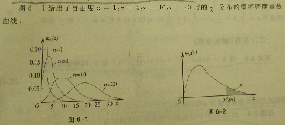
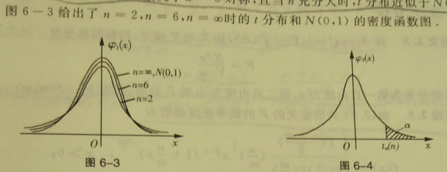
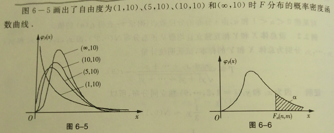

## 6 数理统计的基本概念与抽样分布

数理统计研究如何通过试验或观察收集带有随机性的数据，并在设定的统计模型下，对数据进行深入的分析（统计分析），以对研究的问题作为尽可能精确、可靠的结论（统计判断）。也就是通过对被研究随机现象的观测，由观测得到的资料对该随机现象的一般概率特征，如概率分布、数学期望、方差等。

### 6.0 数理统计的基本概念

#### 6.0.0 总体和样本

研究对象的全体称为总体（或母体），组成总体的每个元素称为个体。对于不同的个体，其指标值是不同的，因此数量指标 $X$ 是一个随机变量（或随机向量）。后面，一般用 $X$ 代表总体，总体分布就是 $X$ 的分布，总体的数字特征就是 $X$ 的数字特征。 

为了对总体的分布进行研究，必须从总体中抽样一部分个体进行观察，这个过程称为抽样。抽样得到的数据称为样本（或子样），即样本就是所抽样的个体指标值。由于样本随每次抽样观察而改变，所以我们一般用随机向量 $(X_1, X_2, $$\dots, X_n)$ 表示样本，并称 $n$ 为样本容量。样本观察值用 $(x_1, x_2, \dots, x_n)$ 表示，它是 $(X_1, X_2, \dots, X_n)$ 的一组观察值。

为使得样本能尽可能的反映总体的特征，通常要求抽样满足以下两点：

1. 独立性：	每次观察的结果既不影响其他观察结果，也不受其他观察结果的影响，即 $(X_1,X_2, \dots , X_n)$ 为相互独立的随机变量。
2. 代表性：	样本的每一个分量 $X_i$ 与总体 $X$ 有相同的分布。

一般称 $X_1, X_2, \dots, X_n$ 相互对立且与总体 $X$ 同分布的随机样本 $(X_1, X_2, \dots, X_n)$ 为简单随机样本。后面如无特殊声明，所有样本一般都是指简单随机样本。

#### 6.0.1 统计量

把不含任何未知参数的、样本 $X_1, X_2, \dots , X_n$ 的函数称为统计量。统计量是一个完全由样本所决定的量，由于样本是随机的，所以统计量也是一个随机变量。

例如，总体 $X \sim N(\mu, \sigma^2)$，$X_1, X_2, \dots, X_n$ 为其样本，则当 $\mu$ 和 $\sigma^2$ 未知时，$\frac{1}{n}\overset{n} \sum\limits_{i=1} X_i$ ，$\overset{n} \sum\limits_{i=1} X_i^2$ 是统计量，但 $\frac{1}{n}\overset{n} \sum\limits_{i=1} (X_i - \mu)^2$ ，$\frac{1}{\sigma^2}\overset{n} \sum\limits_{i=1} X_i^2$ 都不是统计量。

下面介绍一些常用的统计量——样本矩：

1. 样本均值
   $$
   \overline{X} = \frac{1}{n}\overset{n} \sum\limits_{i=1} X_i ~ ;
   $$

2. 样本方差
   $$
   S^2 = \frac{1}{n-1}\overset{n} \sum\limits_{i=1} (X_i - \overline{X})^2 ~ ;
   $$

3. 样本标准差
   $$
   S = \sqrt{S^2} = \sqrt{\frac{1}{n-1}\overset{n} \sum\limits_{i=1} (X_i - \overline{X})^2} ~ ;
   $$

4. 样本的 $k$ 阶原点矩
   $$
   A_k = \frac{1}{n}\overset{n} \sum\limits_{i=1} X_i^k ~ , ~ k=1, 2, 3, \dots ~ ;
   $$

5. 样本的 $k$ 阶中心矩
   $$
   B_k = \frac{1}{n}\overset{n} \sum\limits_{i=1} (X_i - \overline{X})^k ~ , ~ k=2, 3, \dots ~ ;
   $$

样本矩反映对应的总体矩的信息。如样本均值集中反映了总体数学期望的信息，常用来估计总体的数学期望；样本方差 $S^2$ 和样本的二阶中心矩 $B_2$ 集中反映了总体方差的信息，常用来估计总体的方差。

#### *6.0.2 顺序(次序)统计量、样本中位数与样本极差

#### 6.0.3 频率直方图

作图步骤：

1. 找出样本观测值 $x_1, x_2, \dots , x_n$，将其由小到大排列为
   $$
   x_{(1)} \leqslant x_{(2)} \leqslant \dots \leqslant x_{(n)}~.
   $$

2.  适当选取略小于 $x_{(1)}$ 的 $a$ 和略大于 $x_{(n)}$ 的 $b$，使得所有样本值都在区间 $(a, b)$ 内，将 $(a, b)$ 分为 $m$ 个相邻的子区间 $(c_i, c_{i+1})$，其中，$c_1 = a$，$c_{m+1} = b$ 。各区间的长度 $\Delta c_i = c_{i+1}-c_i (i=1, 2, \dots, m)$ 既可相等，也可不等。子区间的个数一般为 $8 \sim 15$ 个，因为太多则由于频率的随机摆动而使分布显得杂乱，太少则难以显示分布的特征。此外，为方便起见，区间端点的取值比样本观测值<u>多取一位小数</u>。

3.  根据样本观测值计算落入各区间的频数 $n_i$ 和频率 $f_i = \frac{n_i}{n}(i=1, 2, \dots, m)$ 。

4. 在 $Ox$ 轴上截取各子区间，并以各子区间为底，以 $\frac{f_i}{\Delta c_i}(i=1, 2, \dots , m)$ 为高作小矩形，各小矩形的面积就等于样本观测值落入个区间的频率，所有小矩形的面积之和等于1. 

当样本容量 $n$ 充分大时，随机变量 $X$ 落入各个区间上的频率就近似等于其概率，所以频率直方图大致描述了总体 $X$ 的概率分布。

#### 6.0.4 经验分布函数

设总体 $X$ 的分布函数 $F(x)$ 未知，$x_1,x_2,\dots,x_n$ 为总体 $X$ 的一个样本观察值，将它们按大小排列为：$x_{(1)} \leqslant x_{(2)} \leqslant \dots \leqslant x_{(n)}$，令：
$$
f(n)=
\begin{cases}
    0, & x < x_{(1)} ~ ;\\
    \frac{k}{n}, & k=1,2,\dots,n-1 ~ ;\\
    1, & x_{(n)} \leqslant x ~ .
\end{cases}
$$
称 $F_n(x)$ 为 $x_1,x_2,\dots,x_n$ 的经验分布函数。

对任意实数 $x$ ，$F_n(x)$ 就是事件 $\{X \leqslant x\}$ 出现的频率，而该事件出现的概率就是总体 $X$ 的分布函数 $F(x)$ 。$F_n(x)$ 可以作为未知分布函数 $F(x)$ 的一个近似，且 $n$ 越大时，这种近似的精确程度越高。

为了方便起见，今后一般既把 $x_1,x_2,\dots,x_n$ 看作样本 $X_1,X_2,\dots,X_n$ 的观测值，又用它们来表示这些随机变量，即 $x_1,x_2,\dots,x_n$ 在得到观测数据之前为 $n$ 维随机变量，在得到观测数据之后为 $n$ 个具体数据。相应地，用 $\overline{x}$ 表示样本均值，$s^2$ 表示样本方差。

### 6.1 数理统计中的某些常用分布

数理统计中常用的分布，除正态分布外，还有 $\chi^2$ 分布、$t$ 分布和 $F$ 分布。（这三种都算是从正态分布派生出来的分布）（其实还有很多分布）

#### 6.1.0 $\chi^2$ 分布

> **定义：**	设 $X_1,X_2,\dots,X_n$ 相互独立，且都服从标准正态分布 $N(0,1)$ ，则称随机变量
> $$
> \chi^2 = \overset{n}{\sum\limits_{i=1}}X^2_i 
> $$
> 所服从的分布为自由度为 $n$ 的 $\chi^2$ 分布，记为 $\chi^2(n)$ 。

> **定理：**	自由度为 $n$ 的 $\chi^2$ 分布的概率密度函数为
> $$
> \huge \varphi_{\chi^2}(x)=
> \begin{cases}
> \frac{1}{2^{\frac{n}{2}}\Gamma (\frac{n}{2})} x^{\frac{n}{2}-1}e^{-\frac{x}{2}},&x 
> < 0 ~;\\
> 0 , &x\geqslant 0 ~ .
> \end{cases}
> $$
> 其中，$\Gamma(\alpha) = \int^{+\infty}_0x^{\alpha-1}e^{-x}dx,\alpha >0$ 。

> **定理(**$\chi^2$**分布的独立可加性)：**	如果 $X \sim \chi^2(n),Y\sim \chi^2(m)$，且 $X$ 与 $Y$ 相互独立，则
> $$
> X+Y \sim \chi^2(n+m) ~ .
> $$

> **定理：**	设 $X \sim \chi^2(n)$ ，则 $E(X)=n,D(X)=2n$ 。

$\chi^2(n)$ 的分位数 $\chi^2_{\alpha}(n)$ 表示，即 $\chi^{^2}_{\alpha}(n)$ 满足（上右图）
$$
P(X \geqslant \chi^2_{\alpha}(n)) = \alpha ~ ,
$$
对某些 $0<\alpha<1$ 和 $n$ ，由 $\chi^2$ 分布的分位数表可以查得 $\chi^{^2}_{\alpha}(n)$ 的值。

#### 6.1.1 $t$ 分布(学生分布)

> **定义：**	设 $X \sim N(0,1),Y \sim \chi^2(n)$ ，且 $X$ 与 $Y$ 独立，则称随机变量 
> $$
> T = \frac{X}{\sqrt{\frac{Y}{n}}}
> $$
> 所服从的分布为自由度为 $n$ 的 $t$ 分布，记为 $t \sim t(n)$

> **定理：**	 $T$ 分布的概率密度函数为
> $$
> \huge\varphi_{t}(x)=
> \frac{\Gamma(\frac{n+1}{2})}{\sqrt{n\pi}\Gamma(\frac{n}{2})}(1 + \frac{x^2}{n})^{-\frac{n+1}{2}} ~ ,
> $$
> 由上式可知，$t$ 分布的密度函数关于 $x=0$ 对陈，且当 $n$ 充分大时，$t$ 分布近似于 $N(0,1)$ 分布。

$t(n)$ 的分位数 $t_{\alpha}(n)$ 表示，即 $t_{\alpha}(n)$ 满足（上右图）
$$
P(X \geqslant t_{\alpha}(n)) = \alpha ~ ,
$$
由 $t$ 分布的对称性有
$$
t_{1-\alpha}(n) = -t_{\alpha}(n) ~ ，
$$
对某些 $0<\alpha<1$ 和 $n$ ，由 $t$ 分布的分位数表可以查得 $t_{\alpha}(n)$ 的值。

#### 6.1.2 $F$ 分布

> **定义：**	设 $X \sim \chi^2(n),Y \sim \chi^2(m)$，且相互独立，则称随机变量
> $$
> F = \frac{X/n}{Y/m} ~ ,
> $$
> 所服从的分布为第一自由度为 $n$ ，第二自由度为 $m$ 的 $F$ 分布，记为 $F \sim F(n,m)$ 。

> **定理：**	$F$ 分布的概率密度函数为
> $$
> \Large f(x)=
> \begin{cases}
> \frac{\Gamma{(\frac{n+m}{2}})}{\Gamma (\frac{n}{2})\Gamma (\frac{m}{2})} 
> {(\frac{n}{m}})^{\frac{n}{2}}x^{\frac{n}{2}-1}(1+\frac{n}{m}x)^{-\frac{n+m}{2}},&x 
> > 0 ~;\\
> 0 , & x\leqslant0 ~ .
> \end{cases}
> $$

> **推论：**	如果 $X \sim F(n,m)$ ，则 $\frac{1}{X} \sim F(m,n)$ 

$F(n,m)$ 的分位数 $F_{\alpha}(n,m)$ 表示，即 $F_{\alpha}(n,m)$ 满足（上右图）
$$
P(X \geqslant F_{\alpha}(n,m)) = \alpha ~ ,
$$
对某些 $0<\alpha<1$ 和 $n$ ，由 $F$ 分布的分位数表可以查得 $F_{\alpha}(n,m)$ 的值。

另外由推论可证得：
$$
\frac{1}{F_{\alpha}(n,m)} = F_{1-\alpha}(m,n)~.
$$

### 6.2 正态总体统计量的分布

> **定理：**	设总体 $X \sim N(\mu,\sigma^2),x_1,x_2,\dots,x_n$ 为其样本，且样本均值 $\overline{x}$ 与样本方差 $s^2$ 独立，则有
>
> 1. $$
>    \frac{\overline{x}-\mu}{\sigma / \sqrt{n}} \sim N(0,1) ~ ;
>    $$
>
> 2. $$
>    \frac{1}{\sigma^2} \overset{n}{\sum\limits_{i=1}}(x_i-\mu)^2 \sim \chi^2(n) ~ ;
>    $$
>
> 3. $$
>    \frac{(n-1)s^2}{\sigma^2} = 
>    \frac{1}{\sigma^2} \overset{n}{\sum\limits_{i=1}}(x_i-\overline{x})^2 \sim \chi^2(n-1)~;
>    $$
>
> 4. $$
>    \frac{\overline{x}-\mu}{s/\sqrt{n}} \sim t(n-1) ~ .
>    $$

> **定理：**	设总体 $X \sim N(\mu_1,\sigma^2)$ ，总体 $Y \sim N(\mu_2,\sigma^2)$，则有
>
> 1. $$
>    \frac{s_1^2}{s_2^2} \sim F(n-1,m-1) ~ ;
>    $$
>
> 2. $$
>    \frac{(\overline{x}-\overline{y})-(\mu_1-\mu_2)}
>    {s_{\omega}\sqrt{\frac{1}{n} + \frac{1}{m}}} \sim t(n+m-1) ~ ,
>    其中,s_{\omega}^2 = {\frac{(n-1)s^2_1 + (m-1)s^2_2}{n+m-2}},
>    s_{\omega} = \sqrt{s^2_{\omega}} ~ .
>    $$

> **定理：**	设 $X \sim N(\mu_1,\sigma^2_1)$，总体 $Y \sim N(\mu_2,\sigma^2_2)$，则有
>
> 1. $$
>    \frac{(\overline{x}-\overline{y})-(\mu_1-\mu_2)}
>    {\sqrt{\frac{\sigma_1^2}{n} + \frac{\sigma^2_2}{m}}} \sim N(0,1)~ ;
>    $$
>
> 2. $$
>    \frac{s_1^2/\sigma^2_1}{s_2^2 / \sigma^2_2} \sim F(n-1,m-1) ~ .
>    $$

以上定理统称为抽样分布定理。