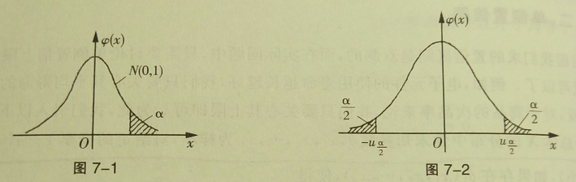
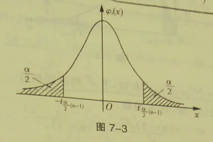
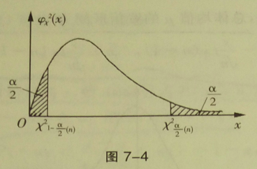
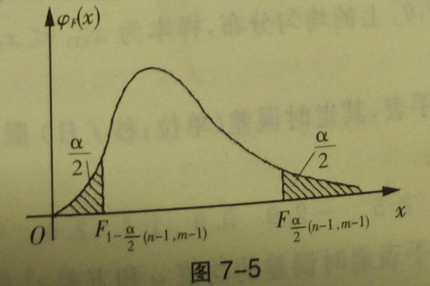

## 7 参数估计

参数估计是统计推断的基本问题之一。有样本对总体分布中的未知参数或总体的某些数字特征做出参数估计。例如，设总体服从正态分布 $N(\mu, \sigma^2)$ ，其中 $\mu~,~\sigma^2$ 未知，如何由样本来估计 $\mu$ 和 $\sigma^2$ 就是参数估计问题。当总体分布未知时，对总体的某些数字特征如数学期望、方差等的估计也是参数的估计值。

参数估计通常有两种：

- 参数的点估计。就是以样本的某一函数作为未知参数的估计值。
- 参数的区间估计。就是由样本估计未知参数的一个所在范围，并指出参数落在此范围中的概率。

### 7.0 参数的点估计

设 $\theta$ 为总体中要估计的未知参数，如果取样本的一个函数 $\hat{\theta} = \hat{\theta}(x_1,x_2,\dots,x_n)$ 作为 $\theta$ 的估计值，则称 $\hat{\theta}$ 为 $\theta$ 的点估计。

#### 7.0.0 衡量估计量好坏的标准

1. 无偏性

如果 $\hat{\theta}$ 的数学期望等于未知参数 $\hat{\theta}$ ，即
$$
E(\hat{\theta}) = \theta ~ ,
$$
则称 $\hat{\theta}$ 为 $\theta$ 的无偏估计。

无偏估计意味着参数估计的误差 $\hat{\theta}-\theta$ 的数学期望等于 0，即所谓不含系统误差。

2. 有效性

设 $\hat{\theta_1}(x_1,x_2,\dots,x_n)$ 和 $\hat{\theta_2}(x_1,x_2,\dots,x_n)$ 都是 $\theta$ 的无偏估计，如果
$$
D(\hat{\theta_1}) \leqslant D(\hat{\theta_2})~,
$$
则称 $\hat{\theta_1}$ 较 $\hat{\theta_2}$ 有效。

3. 一致性(相合性)

如果当样本容量 $n \to \infty$ 时，$\hat{\theta_n} = \hat{\theta_1}(x_1,x_2,\dots,x_n)$ 按概率收敛于 $\theta$ ，即对于任意 $\varepsilon > 0$ ，有
$$
\lim\limits_{n\to\infty}P(|\hat{\theta}-\theta| \leqslant \varepsilon)=1~,
$$
则称 $\hat{\theta_n}$ 为 $\theta$ 的一致估计(相合估计)。

一致性是指：当样本容量 $n$ 无限增大时，$\hat{\theta_n}$ 可以无限趋近与 $\theta$ 。

#### 7.0.1 求点估计的两种常用方法

1. 矩估计法

以样本矩（原点矩或中心矩）作为相应的总体矩的估计，例如

- 用样本均值 $\overline{x}$ 估计总体的期望值 $\mu$ ；
- 用二阶样本中心矩 $B_2~(\frac{1}{n}\overset{n}\sum\limits_{i=1}(X_i-\overline{X})^2)$ 估计总体方差 $\sigma^2$ 。

矩估计的优点在于即便对总体的分布一无所知，也可以对总体的数字特征作出估计。

设总体 $X$ 的分布依赖于未知参数 $\theta=(\theta_1,\theta_2,\dots,\theta_k)$ ，且总体的 $k$ 阶原点矩 $E(X^k)$ 存在，$E(X^k)$ 也依赖于 $\theta_1,\theta_2,\dots,\theta_k$ ，记为：
$$
\alpha_j(\theta_1,\theta_2,\dots,\theta_k) = E(X^j)~,~j=1, 2, \dots,k~,
$$
则由矩估计法，用样本原点矩 $A_j$ 估计总体矩 $E(X^j)$ ，则得到一个方程组：
$$
A_j(x_1,x_2,\dots,x_n) = \alpha_j(\theta_1,\theta_2,\dots,\theta_k),j=1, 2, \dots, k~,
$$
解此方程组，得其解：
$$
\hat{\theta_j} = \hat{\theta_j}(x_1,x_2,\dots,x_n),j=1,2,\dots,k~.
$$
$\hat{\theta_j}$ 即为 $\theta_j$ 的矩估计。

也可以用样本中心矩作为对应的总体中心矩的估计来建立方程组。一般做法为：

- 当总体只有一个未知参数时，用 $\overline{x}=E(X)$ 建立一个方程即可求得此参数的矩估计；
- 当总体有两个未知参数时，用 $\overline{x}=E(X)$ 和 $B_2= D(X)$ 建立方程组即可求得这两个参数的矩估计。如正态总体 $N(\mu,\sigma^2)$ 中未知参数 $\mu~,\sigma^2$ 的矩估计就分别为 $\overline{x}~,B_2$ 。

2. 极大似然估计

极大似然法的直观想法是：如果抽样的结果是得到样本观察值 $x_1,x_2,\dots,x_n$ ，则有理由认为 $x_1,x_2,\dots,x_n$ 出现的可能性应该最大，所以应该选取使得这组样本观察值出现的可能性最大所对应的参数值作为参数 $\theta$ 的估计值。

(1). 如果总体 $X$ 是离散随机变量，$X=x$ 的概率为 $p(x;\theta)$，其中 $\theta$ 是未知数。则由样本的独立同分布性知，样本 $x_1,x_2,\dots,x_n$ 出现的概率为 $\overset{n}\prod\limits_{i=1} p(x_i,\theta)$ ，称
$$
L(\theta) = \overset{n}\prod\limits_{i=1} p(x_i,\theta)
$$
为似然函数，对于已取定的 $x_1,x_2,\dots,x_n$ ，它是参数 $\theta$ 的函数。则 $\theta$ 的估计 $\hat{\theta}$ 应使得样本 $x_1,x_2,\dots,x_n$ 出现的概率最大，也就是使得似然函数 $L(\theta)$ 达到极大值，所以称 $\hat{\theta}$ 为 $\theta$ 的极大似然估计。换句话说，$\theta$ 的极大似然估计 $\hat{\theta}$ 是其似然函数 $L(\theta)$ 的极大值点，即 $\hat{\theta}$ 满足
$$
L(\hat{\theta}) = \max\limits_{ \theta } \{ L(\theta) \} = 
\max\limits_{\theta}\{\prod_{i=1}^n p(x_i,\theta) \}~.
$$
(2). 如果总体 $X$ 是连续随机变量，其概率密度为 $f(x;\theta)$ ，其中 $\theta$ 是未知参数。则其似然函数为
$$
L(\theta) = \prod_{i=1}^n f(x_,\theta)~.
$$
同理，$\theta$ 的极大似然估计 $\hat{\theta}$ 满足
$$
L(\hat{\theta}) = \max\limits_{\theta} \{ L(\theta) \} = 
\max\limits_{\theta} \{ \prod\limits_{i=1}^n f(x_i, \theta) \} ~ .
$$
所以，求参数的极大似然估计问题就是求极大似然函数的极大值点问题。一般来说，这个问题可以同构求解下面的方程
$$
\frac{dL}{d\theta} = 0 \tag{1}
$$
来解决。因为 $L$ 一定是非负的，所以 $\ln L$ 是 $L$ 的增函数，故 $L$ 与 $\ln L$ 的极大值点相同。因此，可以将方程 $(1)$ 换成下面的方程
$$
\frac{d \ln L}{d\theta} = 0 ~ . \tag{2}
$$
由方程 $(1)$ 或 $(2)$ 解出的 $\hat{\theta}$ 就是参数 $\theta$ 的极大似然估计。 

> **例题：**	设总体 $X$ 服从泊松分布 $P (\lambda)$ ，其中 $\lambda > 0$ 为未知参数。如果样本观察值为 $x_1,x_2,\dots,x_n$ ，求参数 $\lambda$ 的极大似然估计。
>
> **解：**	由 $X \sim P(\lambda)$ 得 $P(X=x)=\frac{\lambda^x}{x!}e^{-\lambda}$ ，容易知道其似然函数为
> $$
> \large L(\lambda) = \prod_{i=1}^n \frac{\lambda^x}{x!}e^{-\lambda} = 
> \frac{\lambda^{\overset{n}\sum\limits_{i=1}x_i}}{\overset{n}\prod\limits_{i=1}(x_i!)}e^{-n\lambda}~,
> $$
> 两边取对数，得
> $$
> \ln L(\lambda) = (\overset{n}\sum\limits_{i=1}x_i)\ln \lambda - 
> \overset{n}\sum\limits_{i=1}\ln (x_i!)-n\lambda~,
> $$
>
> 按式 $(2)$ 得到方程
> $$
> \frac{d\ln L(\lambda)}{d\lambda} = 
> \frac{1}{\lambda} \overset{n}\sum\limits_{i=1}-n=0~,
> $$
> 所以 $\lambda$ 的极大似然估计为
> $$
> \hat{\lambda} = \frac{1}{n}\overset{n}\sum\limits_{i=1}x_i = \overline{x}~.
> $$

值得注意的是，方程 $(1)$ 或 $(2)$ 只是求解似然函数最大值方程的方法之一。有的情况下，需要用其他方法来求解。如果总体分布中含有若干个未知参数 $\theta_1,\theta_2,\dots,\theta_k$ ，则似然函数 $L$ 是这些参数的多元函数。为求解似然函数 $L$ 的极大值点，可通过求解下列方程组：

$$
\begin{cases}
\frac{\partial L}{\partial\theta_1}=0~,\\
\frac{\partial L}{\partial\theta_2}=0~,\\
~~\vdots\\
\frac{\partial L}{\partial\theta_k}=0~.
\end{cases} 或 
\begin{cases}
\frac{\partial \ln L}{\partial\theta_1}=0~,\\
\frac{\partial \ln L}{\partial\theta_2}=0~,\\
~~\vdots\\
\frac{\partial \ln L}{\partial\theta_k}=0~.
\end{cases}
$$
由上述方程组解出的 $\hat{\theta_1},\hat{\theta_2},\dots,\hat{\theta_k}$ 分别为参数 $\theta_1,\theta_2,\dots,\theta_k$ 的极大似然估计。

### 7.1 区间估计

参数的点估计就是构造合适的统计量，利用样本来得到未知参数的估计量。由于其估计量是一个随机变量，所以这样的估计一般都有误差，并且无法提供估计的精确度和可信度。为克服这一缺点，需要根据总体的分布，在一定的可靠程度下，求出被估计参数所在的可能数值范围，这就是参数的区间估计问题。这样就可以把可能的误差用明确的形式表现出来。

#### 7.1.0 基本概念

> **定义1：**	设总体 $X$ 的分布函数为 $F(x;\theta)$ ，其中 $\theta$ 为未知参数，$x_1,x_2,\dots,x_n$ 为样本，$\hat{\theta_1}(x_1,x_2,\dots,x_n)$ 和 $\hat{\theta_2}(x_1,x_2,\dots,x_n)$ 是样本确定的两个统计量。如果对给定的概率 $1-\alpha(0<\alpha<1,\alpha 很小)$ 有
> $$
> P(\hat{\theta_1}<\theta<\hat{\theta_2}) = 1-\alpha~,
> $$
> 则称随机区间 $(\hat{\theta_1},\hat{\theta_2})$ 为参数 $\theta$ 的对应于置信概率为 $1-\alpha$ 的置信区间；$\hat{\theta_1},\hat{\theta_2}$ 分别称为置信下限和置信上限。

对应于已给的置信概率，根据样本观察值来确定未知参数 $\theta$ 的置信区间，称为参数 $\theta$ 的区间估计。显然，置信区间表示估计的精确性。而用 $(\hat{\theta_1},\hat{\theta_2})$ 估计 $\theta$ 时，$(\hat{\theta_1},\hat{\theta_2})$ 包含参数 $\theta$ 真值的概率为 $1-\alpha$ ，即 $(\hat{\theta_1},\hat{\theta_2})$ 包含参数 $\theta$ 的可信程度为 $1-\alpha$ ，所以置信概率则表示估计的可信度。

求区间估计的原则是：在保证给定的置信概率的条件下使其区间长度尽可能的小。

#### 7.1.1 单侧置信限

前面提到的置信区间都是双侧的。

设总体 $X$ 的分布中包含未知参数 $\theta$，$x_1,x_2,\dots,x_n$ 为样本，对给定的概率 $1-\alpha(0<\alpha<1,\alpha 很小)$ ，如果存在 $\hat{\theta_1}(x_1,x_2,\dots,x_n)$，使得
$$
P(\theta>\hat{\theta_1})=1-\alpha~,
$$
则称 $\hat{\theta_1}$ 为参数 $\theta$ 的置信水平为 $1-\alpha$ 的单侧置信下限；如果存在 $\hat{\theta_2}(x_1,x_2,\dots,x_n)$ ，使得
$$
P(\theta<\hat{\theta_2}) = 1-\alpha~,
$$
则称 $\hat{\theta_2}$ 为参数 $\theta$ 的置信水平为 $1-\alpha$ 的单侧置信上限。

### 7.2 正态总体参数的区间估计

如果已知样本函数的分布，则对应的区间估计问题就不难解决。前面只探讨了正态总体的某些样本函数的分布，所以下面只要探讨正态总体中的未知参数的区间估计问题。

#### 7.2.0 单个正态总体参数的区间估计

##### 7.2.0.0 正态总体均值 $\mu$ 的区间估计

1. 设正态总体 $X \sim N(\mu,\sigma^2),\sigma=\sigma_0$ 已知，求 $\mu$ 的区间估计。

易得样本函数为：
$$
u=\frac{\overline{x}-\mu}{\sigma_0 /\sqrt{n}} \sim N(0,1)~.
$$
如果 $u\sim N(0,1)$ ，则对给定的 $\alpha$ ，数 $u_\alpha$ 由等式 $P(u\geqslant u_\alpha)=\alpha$ 确定(见图 7-1)。对给定的置信概率为 $1-\alpha$ ，存在 $u_{\frac{\alpha}2}$ 使得(见图 7-2)：
$$
P(-u_{\frac{\alpha}2} < \frac{\overline{x}-\mu}{\sigma_0 /\sqrt{n}}<u_{\frac{\alpha}2}) 
= 1-\alpha~,\\
即：~~
P(\overline{x}-u_{\frac{\alpha}2}\frac{\sigma_0}{\sqrt{n}}
<\mu<
\overline{x}+u_{\frac{\alpha}2}\frac{\sigma_0}{\sqrt{n}})
= 1-\alpha~,
$$
所以，对应于置信概率为 $1-\alpha$ ，总体均值 $\mu$ 的置信区间为：
$$
\Big(\overline{x}-u_{\frac{\alpha}2}\frac{\sigma_0}{\sqrt{n}},~\overline{x}+u_{\frac{\alpha}2}\frac{\sigma_0}{\sqrt{n}}\Big)~.
$$

由于：
$$
P(\frac{\overline{x}-\mu}{\sigma_0 /\sqrt{n}}<u_\alpha) = 1-\alpha~,
$$
所以，对应于置信概率为 $1-\alpha$ ，总体均值 $\mu$ 的单侧置信下限为：
$$
\overline{x}-u_\alpha \frac{\sigma_0}{\sqrt{n}}~.
$$
同理可得，对应于置信概率为 $1-\alpha$ ，总体均值 $\mu$ 的单侧置信上限为：
$$
\overline{x} + u_\alpha \frac{\sigma_0}{\sqrt{n}}~.
$$

2. 设正态总体 $X \sim N(\mu,\sigma^2),\sigma$ 未知，求 $\mu$ 的区间估计。

易得样本函数为：
$$
t=\frac{\overline{x}-\mu}{s/\sqrt{n}} \sim t(n-1)~,
$$
所以，对给定的置信概率 $1-\alpha$ ，存在 $t_{\frac{\alpha}2}(n-1)$ (见图 7-3)使得：
$$
P\Big( |t|=\Big| \frac{\overline{x}-\mu}{s/\sqrt{n}} \Big| < t_{\frac{\alpha}2}(n-1) \Big)
= 1-\alpha~,\\
即:~~
P(\overline{x}-\frac{s}{\sqrt{n}} t_{\frac{\alpha}2}(n-1)
< \mu < 
\overline{x}+\frac{s}{\sqrt{n}} t_{\frac{\alpha}2}(n-1))
= 1-\alpha~,
$$
故对应于置信概率为 $1-\alpha$ ，总体均值 $\mu$ 的置信区间为：
$$
\Big(
\overline{x}-\frac{s}{\sqrt{n}} t_{\frac{\alpha}2}(n-1)~,~~
\overline{x}+\frac{s}{\sqrt{n}} t_{\frac{\alpha}2}(n-1)
\Big)~.
$$

##### 7.2.0.1 正态总体方差 $\sigma^2$ 的区间估计

1. 设正态总体 $X \sim N(\mu,\sigma^2),\mu$ 已知，求 $\sigma^2$ 的区间估计。

易得样本函数：
$$
\frac1{\sigma^2} \overset{n}\sum\limits_{i=1}(x_i-\mu)^2 \sim \chi^2(n)~,
$$
所以，对给定的置信概率为 $1-\alpha$ ，存在 $\chi^2_{1-\frac{\alpha}2}(n)$ 和 $\chi^2_{\frac{\alpha}2}(n)$ (见图 7-4)使得：
$$
\large  
P \Big[ \chi^2_{1-\frac{\alpha}2}(n)
<\frac1{\sigma^2} \overset{n}\sum\limits_{i=1}(x_i-\mu)^2<
\chi^2_{\frac{\alpha}2}(n)
\Big]=1-\alpha~,\\
即:~~
P\Big[ \frac{\overset{n}\sum\limits_{i=1}(x_i-\mu)^2}{\chi^2_{\frac{\alpha}2}(n)}
<\sigma^2<
\frac{\overset{n}\sum\limits_{i=1}(x_i-\mu)^2}{\chi^2_{1-\frac{\alpha}2}(n)}
\Big] = 1-\alpha~,
$$
故对应于置信概率为 $1-\alpha$ ，总体方差 $\alpha^2$ 的置信区间为：
$$
\Big[
\frac{\overset{n}\sum\limits_{i=1}(x_i-\mu)^2}{\chi^2_{\frac{\alpha}2}(n)},~~
\frac{\overset{n}\sum\limits_{i=1}(x_i-\mu)^2}{\chi^2_{1-\frac{\alpha}2}(n)}
\Big]~.
$$

2. 设正态总体 $X \sim N(\mu,\sigma^2),\mu$ 未知，求 $\sigma^2$ 的区间估计。

易得样本函数：
$$
\frac{(n-1)s^2}{\sigma^2} \sim \chi^2(n-1)~,
$$
所以，对应与置信概率为 $1-\alpha$ ，总体方差 $\sigma^2$ 的置信区间为：
$$
\Big( \frac{(n-1)s^2}{\chi^2_{\frac{\alpha}2}(n-1)}~,~~ \frac{(n-1)s^2}{\chi^2_{1-\frac{\alpha}2}(n-1)} \Big)
$$

#### 7.2.1 两个正态总体均值差与方差比的区间估计

设总体 $X \sim N(\mu_1,\sigma^2_1)$ ，其样本容量为 $n$ 、样本均值记为 $\overline{x}$ 、样本方差记为 $s_1^2$ ；总体 $Y \sim N(\mu_2,\sigma^2_2)$ ，期样本容量为 $m$ 、样本均值记为 $\overline{y}$ 、样本方差记为 $s_2^2$ ，并假设所有的观察都是独立的，即两个样本相互独立。

##### 7.2.1.0 均值差

1. 设两个总体 $X\sim N(\mu_1,\sigma^2_1),~Y\sim N(\mu_2,\sigma_2^2)$ ，$\sigma_1,\sigma_2$ 已知，求 $\mu_1-\mu_2$ 的区间估计。

易得样本函数：
$$
\frac{\overline{x}-\overline{y}-(\mu_1-\mu_2)}
{\sqrt{\frac{\sigma_1^2}{n} + \frac{\sigma_2^2}{m}}} \sim N(0,1)~,
$$
所以有：
$$
P\Big[
-u_{\frac{\alpha}{2}} < 
\frac{\overline{x}-\overline{y}-(\mu_1-\mu_2)}
{\sqrt{\frac{\sigma_1^2}{n} + \frac{\sigma_2^2}{m}}} 
< u_{\frac{\alpha}{2}} 
\Big] = 1-\alpha~,
$$
故对应于置信概率为 $1-\alpha$ ，均值为 $\mu_1-\mu_2$ 的置信区间为：
$$
\Big(
\overline{x}-\overline{y}-u_{\frac{\alpha}{2}}\sqrt{\frac{\sigma_1^2}{n}+\frac{\sigma_2^2}{m}}
~,~~
\overline{x}-\overline{y}+u_{\frac{\alpha}{2}}\sqrt{\frac{\sigma_1^2}{n}+\frac{\sigma_2^2}{m}}
\Big)~.
$$

2. 设两个总体 $X\sim N(\mu_1,\sigma^2_1),~Y\sim N(\mu_2,\sigma_2^2)$ ，$\sigma_1,\sigma_2$ 未知，但假设 $\sigma_1=\sigma_2$，求 $\mu_1-\mu_2$ 的区间估计。

易得样本函数：
$$
\frac{\overline{x}-\overline{y}-(\mu_1-\mu_2)}
{s_w\sqrt{\frac{1}{n} + \frac{1}{m}}} \sim t(n+m-2)~,
$$
所以有：
$$
P\Big[
-t_{\frac{\alpha}2}(n+m-2) < 
\frac{\overline{x}-\overline{y}-(\mu_1-\mu_2)}{s_w\sqrt{\frac{1}{n}+\frac{1}{m}}}
< t_{\frac{\alpha}2}(n+m-2)
\Big] = 1-\alpha~,
$$
故对应于置信概率为 $1-\alpha$ ，均值差 $\mu_1-\mu_2$ 的置信区间为：
$$
\Big(
\overline{x}-\overline{y}-t_{\frac{\alpha}2}(n+m-2)s_w\sqrt{\frac{1}{n}+\frac{1}{m}}~,~~
\overline{x}-\overline{y}+t_{\frac{\alpha}2}(n+m-2)s_w\sqrt{\frac{1}{n}+\frac{1}{m}}
\Big)~.
$$

##### 7.2.1.1 方差比

设两个总体 $X\sim N(\mu_1,\sigma^2_1),~Y\sim N(\mu_2,\sigma_2^2)$ ，$\mu_1,\mu_2$ 未知，求方差比 $\frac{\sigma_1^2}{\sigma_2^2}$ 的区间估计。

易得样本函数：
$$
\frac{s_1^2/\sigma_1^2}{s_2^2/\sigma_2^2} \sim F(n-1,m-1)~.
$$
所以，对给定的置信概率为 $1-\alpha$ ，存在 $F_{1-\frac{\alpha}2}(n-1,m-1),F_{\frac{\alpha}2}(n-1,m-1)$ (见图 7-5)使得：
$$
P\Big[
F_{1-\frac{\alpha}2}(n-1,m-1)
< \frac{s_1^2/\sigma_1^2}{s_2^2/\sigma_2^2} <
F_{\frac{\alpha}2}(n-1,m-1)
\Big] = 1-\alpha~,\\
即:~
P\Big[
\frac{s_1^2}{F_{\frac{\alpha}2}(n-1,m-1)s_2^2}
< \frac{\sigma_1^2}{\sigma_2^2} <
\frac{s_1^2}{F_{1-\frac{\alpha}2}(n-1,m-1)s_2^2}
\Big] = 1-\alpha~.
$$
所以，对应于置信概率为 $1-\alpha$ ，方差比 $\frac{\sigma_1^2}{\sigma_2^2}$ 的置信区间为：
$$
\Big(
\frac{s_1^2}{F_{\frac{\alpha}2}(n-1,m-1)s_2^2}~,~~
\frac{s_1^2}{F_{1-\frac{\alpha}2}(n-1,m-1)s_2^2}
\Big)~.
$$
