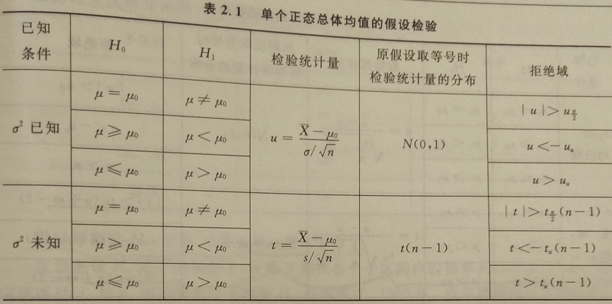
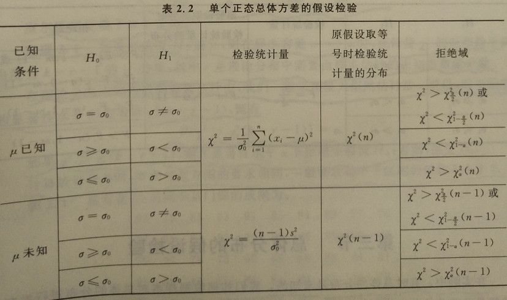
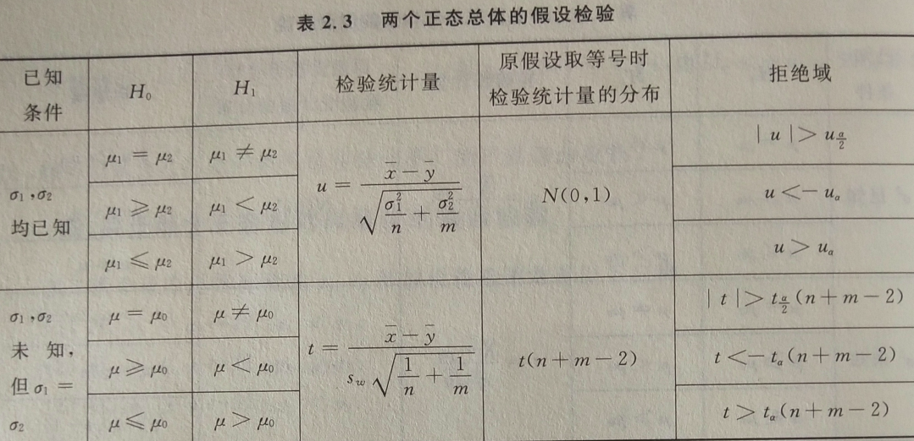
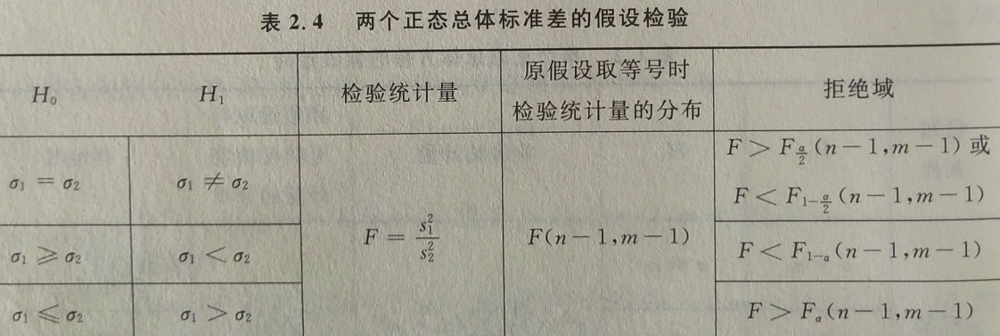

## 8 假设检验

在数理统计中，有这样一类重要的统计推断问题：首先对总体 $X$ 的分布律或分布中的参数做出某种假设；然后根据所得到的样本数据，运用统计分析的方法，检验这种假设是否正确；最后做出接受或拒绝原所作假设的决定，这就是假设检验问题。

假设检验主要分为参数检验和非参数假设检验。如果检验对参数所作的假设，则称为参数假设检验；如果检验对总体分布等非参数所作的假设，则称为非参数假设检验。

后面主要探讨参数假设检验和总体分布的假设检验。

### 8.0 假设检验的基本概念

#### 8.0.0 假设检验的基本思想和基本步骤

假设检验使用“反证法”，首先假定原假设 $H_0$ 成立，然后根据小概率事件是否发生来作出结论，如果出现小概率事件发生这一“不合理”现象，则表明原假设 $H_0$ 很可能不正确，从而拒绝 $H_0$ ；反之，如果没有出现“不合理”现象，则接受原假设 $H_0$ 。

通常称假设 $H_0$ 为原假设，称与 $H_0$ 对立的假设 $H_1$ 为备择假设。检验的目的是原假设 $H_0$ 和备择假设 $H_1$ 中选择一个，或者接受 $H_0$ (即拒绝 $H_1$) ，或者拒绝 $H_0$ (即接受 $H_1$) 。

假设检验的基本步骤：

1. 根据实际问题提出原假设 $H_0$ 和备择假设 $H_1$ 。
2. 根据原假设 $H_0$ ，选取合适的统计量，并在原假设 $H_0$ 成立时确定该统计量的分布。
3. 选取适当的显著性水平 $\alpha$ ，并根据统计量的分布查表，确定对应于 $\alpha$ 的临界值。
4. 由样本观测值计算统计量的观测值，并与临界值比较，从而作出拒绝或接受原假设 $H_0$ 的结论。

#### 8.0.1 两类错误：

1. 原假设 $H_0$ 是正确的，而错误地拒绝了它，称之为第一类错误或“弃真”错误。
2. 原假设 $H_0$ 是不正确的，而错误地接受了它，称之为第二类错误或“纳伪”错误。

- 对于错误的做法是：控制犯第一类错误的概率不超过事先给定的 $\alpha$ ，而使第二类错误的概率 $\beta$ 尽可能的小。

#### 8.0.2 双侧假设检验和单侧假设检验

当统计量 $u$ 的观察值落在区间 $(-\infty,u_{\frac{\alpha}2})$ 和 $(u_{\frac{\alpha}{2}},+\infty)$ 内时，则拒绝 $H_0$ ，所以称这样的区间为 $H_0$ 的拒绝域。因为这样的拒绝域分别位于两侧，所以称这样的假设检验为双侧假设检验。

与此对立的就称为单侧假设检验，即拒绝域是单侧的，比如 $(u_{\alpha},+\infty)$ 。

### 8.1 正态总体参数的假设检验

首先探讨单个正态总体的参数的假设检验。设 $X\sim N(\mu,\sigma^2)$ ，样本为 $x_1,x_2,\dots,x_n$ ，下面检验关于未知参数 $\mu$ 和 $\sigma^2$ 的某些假设，设显著性水平为 $\alpha$ 。

#### 8.1.0 关于正态总体均值的假设检验

关于均值 $\mu$ 的假设检验通常有以下三种：

（1）、$H_0 : \mu = \mu_0 \leftrightarrow H_1 : \mu \neq \mu_0$ ；

（2）、$H_0 : \mu \leqslant \mu_0 \leftrightarrow H_1 : \mu > \mu_0$ ；

（3）、$H_0 : \mu \geqslant \mu_0 \leftrightarrow H_1 : \mu < \mu_0$ 。(其中，$\mu_0$ 为给定常数)

1. 当 $\sigma = \sigma_0$ 已知

此时采用所谓的 $u$ 检验，即令：
$$
u = \frac{\overline{x}-\mu_0}{\sigma / \sqrt{n}}~.
$$

- 对于检验问题（1）：

则在 $H_0$ 成立时，$u\sim N(0,1)$ 且有 $P\{|u|>u_{\frac{\alpha}{2}}\}=\alpha$ ，故 $H_0$ 的拒绝域为：
$$
V_1 = \{ |u|>u_{\frac{\alpha}{2}} \} 
= \Big\{ |\overline{x}-\mu_0|>\frac{\sigma}{\sqrt{n}}u_{\frac{\alpha}{2}} \Big\}~.
$$

- 对于检验问题（2）：

由原假设 $H_0$ 为 $\mu \leqslant \mu_0$ 知，当 $\overline{x}-\mu_0$ 偏大时，或等价地 $u$ 偏大时，就有理由怀疑原假设 $H_0$ 不真而拒绝 $H_0$ ，所以直观上 $H_0$ 的拒绝域应为 $\{ u>C \}$ 。

当 $\mu = \mu_0$ 时，$u\sim N(0,1)$ ，且 $P\{ u>u_{\alpha}\}=\alpha$ ；

当 $\mu < \mu_0$ 时，$\frac{\overline{x}-\mu}{\sigma / \sqrt{n}} \sim N(0,1)$ ，且 $P\{ \frac{\overline{x}-\mu}{\sigma / \sqrt{n}}>u_\alpha \}=\alpha$ ；而由
$$
u = \frac{\overline{x}-\mu_0}{\sigma / \sqrt{n}} < \frac{\overline{x}-\mu}{\sigma / \sqrt{n}}~,
$$
可得
$$
\{u>u_\alpha\} \subset \Big\{ \frac{\overline{x}-\mu}{\sigma / \sqrt{n}}>u_\alpha \Big\}~,
$$
故此时有 $P\{ u>u_\alpha \}<\alpha$ 。

总之，当 $H_0$ 成立时，有 $P\{ u>u_\alpha \} \leqslant \alpha$ 。

所以 $H_0$ 的拒绝域为：
$$
V_2 = \{u>u_\alpha\} = \Big\{ \overline{x}>\mu_0+\frac{\sigma}{\sqrt{n}}u_\alpha \Big\}~.
$$

- 对于检验问题（3）：

由原假设 $H_0$ 为 $\mu \geqslant \mu_0$ 知，当 $\overline{x}-\mu_0$ 偏下时，或等价地 $u$ 偏小时，就有理由怀疑原假设 $H_0$ 不真而拒绝 $H_0$ ，所以直观上 $H_0$ 的拒绝域应为 $\{u<C\}$ 。

当 $\mu = \mu_0$ 时，$u\sim N(0,1)$ ，且 $P(u<-u_\alpha) = \alpha$ ；

当 $\mu > \mu_0$ 时，$\frac{\overline{x}-\mu}{\sigma / \sqrt{n}} \sim N(0,1)$ ，且 $P\{ \frac{\overline{x}-\mu}{\sigma / \sqrt{n}}<-u_\alpha \}=\alpha$ ；而由
$$
u = \frac{\overline{x}-\mu_0}{\sigma / \sqrt{n}} > \frac{\overline{x}-\mu}{\sigma / \sqrt{n}}~,
$$
可得
$$
\{u<-u_\alpha\} \subset \Big\{ \frac{\overline{x}-\mu}{\sigma / \sqrt{n}}<-u_\alpha \Big\}~,
$$
故此时有 $P\{ u<-u_\alpha \}<\alpha$ 。

总之，当 $H_0$ 成立时，有 $P\{ u<-u_\alpha \} \leqslant \alpha$ 。

所以 $H_0$ 的拒绝域为：
$$
V_3 = \{u<-u_\alpha\} = \Big\{ \overline{x}<\mu_0-\frac{\sigma}{\sqrt{n}}u_\alpha \Big\}~.
$$

2. $\sigma$ 未知

此时采用所谓 $t$ 检验，即令：
$$
t = \frac{\overline{x}-\mu_0}{s/\sqrt{n}}~.
$$

- 对于检验问题（1）：

则在 $H_0$ 成立时，$t\sim t(n-1)$ 且有 $P\{|t|>t_{\frac{\alpha}{2}}(n-1)\}=\alpha$ ，故 $H_0$ 的拒绝域为：
$$
V_1 = \{ |t|>t_{\frac{\alpha}{2}} \} 
= \Big\{ |\overline{x}-\mu_0|>\frac{s}{\sqrt{n}}t_{\frac{\alpha}{2}}(n-1) \Big\}~.
$$

- 对于检验问题（2）：

.png)
$$
V_2 = \{t>t_\alpha(n-1)\} = \Big\{ \overline{x}>\mu_0 + \frac{s}{\sqrt{n}}t_\alpha(n-1)\Big\}~.
$$

- 对于检验问题（3）：

.png)
$$
V_3 = \{t<-t_\alpha(n-1)\} = \Big\{ \overline{x}<\mu_0 - \frac{s}{\sqrt{n}}t_\alpha(n-1)\Big\}~.
$$

#### 8.1.1 关于正态总体标准差的假设检验

关于标准差 $\sigma$ 的假设检验通常有以下三种：

（1）、$H_0 : \sigma = \sigma_0 \leftrightarrow H_1 : \sigma \neq \sigma_0$ ；

（2）、$H_0 : \sigma \leqslant \sigma_0 \leftrightarrow H_1 : \sigma > \sigma_0$ ；

（3）、$H_0 : \sigma \geqslant \sigma_0 \leftrightarrow H_1 : \sigma < \sigma_0$ 。(其中，$\sigma_0$ 为给定常数)

同上讨论，有以下结论：

1. $\mu = \mu_0$ 已知

此时采用所谓的 $\chi^2$ 检验，即令：
$$
\chi^2 = \frac1{\sigma_0^2}\overset{n}\sum\limits_{i=1}(x_i-\mu_0)^2~.
$$

- 对于检验问题（1）：

在 $H_0$ 成立时，$\chi^2 \sim \chi^2(n)$ ，且有 $P\{ \chi^2 < \chi^2_{1-\frac{\alpha}2} 或 \chi^2 > \chi^2_{\frac{\alpha}2} \}=\alpha$ ，故 $H_0$ 的拒绝域为：
$$
V_1 = \{ \chi^2 < \chi^2_{1-\frac{\alpha}2}(n) 或 \chi^2 > \chi^2_{\frac{\alpha}2}(n) \}~.
$$

- 对于检验问题（2）：

则在 $\sigma = \sigma_0$ 时，$\chi^2 \sim \chi^2(n)$ 且 $P\{\chi^2 > \chi^2_{\alpha}(n)\}=\alpha$ ；当 $\sigma < \sigma_0$ 时，$P\{\chi^2 > \chi^2_{\alpha}(n)\}<\alpha$ 。故 $H_0$ 的拒绝域为：
$$
V_2 = \{\chi^2 > \chi^2_{\alpha}(n)\}~.
$$

- 对于检验问题（3）：

则在 $H_0$ 成立时，有 $P\{\chi^2 < \chi^2_{1-\alpha}(n)\} \leqslant\alpha$ ，故 $H_0$ 的拒绝域为：
$$
V_3 = \{\chi^2 < \chi^2_{1-\alpha}(n)\}~.
$$

2. $\mu$ 未知

同样采用所谓的 $\chi^2$ 检验，即令：
$$
\chi^2 = 
\frac{(n-1)s^2}{\sigma_0^2} =
\frac1{\sigma_0^2}\overset{n}\sum\limits_{i=1}(x_i-\overline{x})^2~.
$$

- 对于检验问题（1）：

在 $H_0$ 成立时，$\chi^2 \sim \chi^2(n-1)$ ，且有 $P\{ \chi^2 < \chi^2_{1-\frac{\alpha}2}(n-1) 或 \chi^2 > \chi^2_{\frac{\alpha}2}(n-1) \}=\alpha$ ，故 $H_0$ 的拒绝域为：
$$
V_1 = \{ \chi^2 < \chi^2_{1-\frac{\alpha}2}(n-1) 或 \chi^2 > \chi^2_{\frac{\alpha}2}(n-1) \}~.
$$

- 对于检验问题（2）：

则在 $H_0$ 成立时， 有 $P\{\chi^2 > \chi^2_{\alpha}(n-1)\}\leqslant\alpha$ ，故 $H_0$ 的拒绝域为：
$$
V_2 = \{\chi^2 > \chi^2_{\alpha}(n-1)\}~.
$$

- 对于检验问题（3）：

则在 $H_0$ 成立时，有 $P\{\chi^2 < \chi^2_{1-\alpha}(n-1)\} \leqslant\alpha$ ，故 $H_0$ 的拒绝域为：
$$
V_3 = \{\chi^2 < \chi^2_{1-\alpha}(n-1)\}~.
$$

#### 8.1.2 关于两个正态总体均值的假设检验

关于两个正态总体均值 $\mu_1 , \mu_2$ 的假设检验通常有以下三种：

（1）、$H_0 : \mu_1 = \mu_2 \leftrightarrow H_1 : \mu_1 \neq \mu_2$ ；

（2）、$H_0 : \mu_1 \leqslant \mu_2 \leftrightarrow H_1 : \mu_1 > \mu_2$ ；

（3）、$H_0 : \mu_1 \geqslant \mu_2 \leftrightarrow H_1 : \mu_1 < \mu_2$ 。

1. 当 $\sigma_1，\sigma_2$ 已知

令：
$$
u = \frac{\overline{x}-\overline{y}}
{\sqrt{\frac{\sigma_1^2}{n}+\frac{\sigma_2^2}{m}}}~,
$$
则同上探讨有：

- 对于检验问题（1）：

在 $H_0$ 成立时，
$$
u = \frac{\overline{x}-\overline{y}}
{\sqrt{\frac{\sigma_1^2}{n}+\frac{\sigma_2^2}{m}}} \sim N(0,1)~,
$$
所以 $H_0$ 的拒绝域为：
$$
V_1 = \{|u|>u_{\frac{\alpha}2}\} = \Big\{|\overline{x}-\overline{y}| >
u_{\frac{\alpha}2}\sqrt{\frac{\sigma_1^2}{n}+\frac{\sigma_2^2}{m}}\Big\}~.
$$

- 对于检验问题（2）：

 $H_0$ 的拒绝域为：
$$
V_2 =  \{u>u_{\alpha}\} = \Big\{\overline{x}>\overline{y} +
u_{\alpha}\sqrt{\frac{\sigma_1^2}{n}+\frac{\sigma_2^2}{m}}\Big\}~.
$$

- 对于检验问题（3）：

 $H_0$ 的拒绝域为：
$$
V_3 = \{u<-u_{\alpha}\} = \Big\{\overline{x}<\overline{y} -
u_{\alpha}\sqrt{\frac{\sigma_1^2}{n}+\frac{\sigma_2^2}{m}}\Big\}~.
$$

2. $\sigma_1,\sigma_2$ 未知，但假定 $\sigma_1=\sigma_2$

令：
$$
t = \frac{\overline{x}-\overline{y}}
{s_w\sqrt{\frac1{n}+\frac1{m}}}~.
$$
同上探讨有：

- 对于检验问题（1）：

在 $H_0$ 成立时，
$$
t = \frac{\overline{x}-\overline{y}}
{s_w\sqrt{\frac1{n}+\frac1{m}}} \sim t(n+m-2)~,
$$
所以 $H_0$ 的拒绝域为：
$$
V_1 = \{|t|>t_{\frac{\alpha}2}(n+m-2)\} = \Big\{|\overline{x}-\overline{y}| >
t_{\frac{\alpha}2}(n+m-2)s_w\sqrt{\frac1{n}+\frac1{m}}\Big\}~.
$$

- 对于检验问题（2）：

 $H_0$ 的拒绝域为：
$$
V_2 =  \{t>t_{\alpha}(n+m-2)\} = \Big\{\overline{x}>\overline{y} +
t_{\alpha}(n+m-2)s_w\sqrt{\frac1{n}+\frac1{m}}\Big\}~.
$$

- 对于检验问题（3）：

 $H_0$ 的拒绝域为：
$$
V_3 = \{t<-t_{\alpha}(n+m-2)\} = \Big\{\overline{x}<\overline{y} -
t_{\alpha}(n+m-2)s_w\sqrt{\frac1{n}+\frac1{m}}\Big\}~.
$$

#### 8.1.3 关于两个正态总体标准差的假设检验

关于两个正态总体标准差 $\sigma_1, \sigma_2$ 的假设检验通常有以下三种：

（1）、$H_0 : \sigma_1 = \sigma_2 \leftrightarrow H_1 : \sigma_1 \neq \sigma_2$ ；

（2）、$H_0 : \sigma_1 \leqslant \sigma_2 \leftrightarrow H_1 : \sigma_1 > \sigma_2$ ；

（3）、$H_0 : \sigma_1 \geqslant \sigma_2 \leftrightarrow H_1 : \sigma_1 < \sigma_2$ 。

令：
$$
F = \frac{s_1^2}{s_2^2}~.
$$

- 对于检验问题（1）：

当 $H_0$ 成立时，有：
$$
F \sim F(n-1,m-1)~,
$$
且：
$$
P\{F<F_{1-\frac{\alpha}2}(n-1,m-1)或F>F_{\frac{\alpha}2}(n-1,m-1)\}=\alpha~,
$$
所以，$H_0$ 的拒绝域为：
$$
V_1 = \{F<F_{1-\frac{\alpha}2}(n-1,m-1)或F>F_{\frac{\alpha}2}(n-1,m-1)\}~,
$$

- 对于检验问题（2）：

$H_0$ 的拒绝域为：
$$
V_2 = \{ F>F_\alpha(n-1,m-1) \}~.
$$

- 对于检验问题（3）：

$H_0$ 的拒绝域为：
$$
V_3 = \{ F<F_{1-\alpha}(n-1,m-1) \}~.
$$

#### 8.1.4 速查表格









### 8.2 总体分布的假设检验

在实际中，有时总体的分布是未知的，如何来根据样本对总体的分布进行推断，这就是关于总体分布的假设检验。

由样本观察值，可以得到总体的统计分布（频率分布），由统计分布检验是否与某个理论分布相符。总体的统计分布与理论分布之间一般会存在差异，这种差异有两种可能：或者仅仅是由样本量有限而导致的随机性所产生，或者是选择的理论分布与总体的实际分布有实质性差异。

与参数检验的思路一样，还是根据总体的统计分布与理论分布的差异大小来判断：如果差异不大，就可以认为总体分布与该理论分布相符；如果差异较大，则认为总体分布与该理论分布不符。所以这种检验也称为拟合优度检验，即用理论分布取拟合总体分布是否拟合得好。

下面探讨最常用的 皮尔逊($Pearson$)$\chi^2$ 拟合检验。

设进行 $n$ 次独立试验，得到总体 $X$ 的统计分布如下：

|     子区间      |   频数   |   频率   |
| :-------------: | :------: | :------: |
|   $(a_0,a_1)$   |  $m_1$   |  $f_1$   |
|   $(a_1,a_2)$   |  $m_2$   |  $f_2$   |
|    $\vdots$     | $\vdots$ | $\vdots$ |
| $(a_{k-1},a_k)$ |  $m_k$   |  $f_k$   |
|    **总计**     |   $n$    |    1     |

提出原假设 $H_0$ ，总体 $X$ 服从某一理论分布。

在原假设 $H_0$ 成立的条件下，计算 $X$ 落在各个子区间内的概率 $p_i(i=1,2,\dots,k)$ 。通过 $f_i$ 与 $p_i$ 的差异大小来判断 $H_0$ 是否成立。1900年，皮尔逊提出以下统计量：
$$
\chi^2 
= \overset{k}\sum\limits_{i=1}\frac{n(f_i-p_i)^2}{p_i} 
= \overset{k}\sum\limits_{i=1}\frac{(m_i-np_i)^2}{np_i}~.
$$
皮尔逊还证明了以下定理：

> **定理：**	如果原假设 $H_0$ 成立，则在样本容量 $n \to +\infty$ 时，统计量 $\chi^2$ 的分布趋于自由度为 $k-r-1$ 的 $\chi^2$ 分布，其中 $r$ 是理论分布中需要由样本估计的未知参数的个数。

在理论分布未知参数的参数估计中，一般采用极大似然估计法。所以，对于给定的显著性水平 $\alpha$ ，查表得 $\chi_{\alpha}^2(k-r-1)$ ，则有
$$
P(\chi^2 > \chi_{\alpha}^2(k-r-1))=\alpha~.
$$
如果 $\chi^2 > \chi_{\alpha}^2(k-r-1)$ ，则在显著性水平 $\alpha$ 下拒绝原假设 $H_0$ ；否则，接受 $H_0$ 。

计算统计分布时，要求与直方图的要求相同，一般要求每个子区间的频数不小于 5 。

> **例题：**	某专业 60 名同学某门课的成绩为：
>
> ```
> 93	75	83	93	91	85	84	82	77	76
> 77	95	94	89	91	88	86	83	96	81
> 79	97	78	75	67	69	68	83	84	81
> 74	66	85	70	86	84	83	82	80	78
> 75	73	76	70	94	76	90	89	71	66
> 86	73	80	94	79	77	78	63	53	55
> ```
>
> 问考试成绩是否服从正态分布（$\alpha = 0.1$）？
>
> **解：**	设 $X$ 为考试成绩，其分布函数为 $F(x)$ ，则原假设为
> $$
> H_0:F(x) = \Phi (\frac{x - \mu}{\sigma})~,
> $$
> 取自区间为 $(-\infty,70),[70,80),[80,90),[90,+\infty)$ ，参数 $\mu,\sigma^2$ 的极大似然估计为
> $$
> \begin{align}
> & \hat{\mu} = 80,\hat{\sigma^2} = 9.6^2, \\
> & \hat{p_1} = \hat{P}(X<70) = \Phi(\frac{70-80}{9.6}) = \Phi(-1.04) = 0.1492, \\
> & \hat{p_2} = \hat{P}(70 \leqslant X < 80) = \Phi(\frac{70-80}{9.6}) = \Phi(-1.04) = 0.1492, \\
> 
> \end{align}
> $$
> 