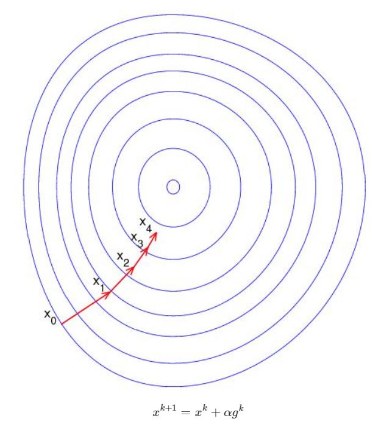
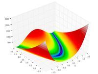
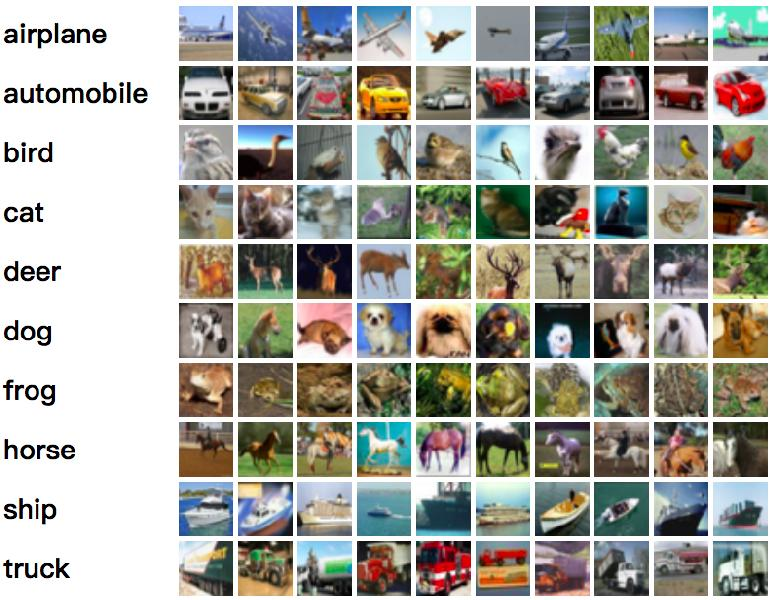

PyTorch中最常用的模块包括：

|      模块      | 描述                                                        |
| :------------: | :---------------------------------------------------------- |
|     torch      | 类似Numpy，但支持GPU加速                                    |
| torch.autograd | 自动求导模块                                                |
|    torch.nn    | 神经网络模块，定义了大量搭建神经网络所需的layer和loss       |
|  torch.optim   | 优化算法模块，实现了常用的优化算法，如SGD，Adam，L-BFGS等等 |
|  torch.utils   | 定义了一些常用的接口，如数据加载（DataLoader）              |

什么情况下可以使用PyTorch：

* 需要大量的矩阵运算，使用GPU来进行加速。复杂的矩阵运算，如求特征值并不适用PyTorch
* 构建深度学习模型

## 1 Tensor 模块

### 1.0 生成张量

```python
x = [[1, 2], [3, 4]]
y = torch.tensor(x)
print(y,y.type)
'''
tensor([[1, 2],
        [3, 4]]) <built-in method type of Tensor object at 0x00000283E6710380>
''' # 所有输出都是在 jupyter 中的运行结果
```

```python
print(torch.zeros(2, 3))
# torch.zeros_like(x)
# torch.ones(2, 3)
# torch.ones_like(x)
# torch.rand(2, 3)
# torch.rand_like(x)
'''

'''
```

### 1.1 查看 tensor 维度操作

* 查询 tensor 的 shape 有两种操作

  * .size()
  * .shape ：该操作与 numpy 操作一样

* 查询 tensor 的维度和元素个数

  * .ndimension()
  * .nelement()

* 转秩操作

  * .transpose()

  * .t() 等价于 .transpose(0, 1)

  * 很多函数都有两种或更多种调用方式

    * ```python
      y = x.transpose(0, 1)
      # 与下面的语句等价
      z = torch.transpose(x, 0, 1)
      
      # 方法名后接一个下划线表示是否覆盖原数据
      x.transpose(0, 1)		# 返回一个新tensor
      x.transpose_(0, 1)		# 原来的 x 被 x 的转秩所覆盖	
      
      y = torch.rand(3, 4)
      y.normal_()
      # 将原本是均匀分布的 y 覆盖为一个正态分布的 y
      ```

torch 一共定义了 8 种类型的张量，如下：

|         Data Type | CPU张量            | GPU张量 |
| ----------------: | ------------------ | ------- |
|     32-bit 浮点数 | torch.FloatTensor  | torch.cuda.FloatTensor |
|     64-bit 浮点数 | torch.DoubleTensor | torch.cuda.DoubleTensor |
|     16-bit 浮点数 | torch.HalfTensor   |  torch.cuda.HalfTensor  |
|  8-bit 无符号整数 | torch.ByteTensor   |   torch.cuda.ByteTensor   |
|  8-bit 有符号整数 | torch.CharTensor   |   torch.cuda.CharTensor   |
| 16-bit 有符号整数 | torch.ShortTensor  |   torch.cuda.ShortTensor  |
| 32-bit 有符号整数 | torch.IntTensor    |   torch.cuda.IntTensor    |
| 64-bit 有符号整数 | torch.LongTensor   |   torch.cuda.LongTensor   |

### 1.2 数据类型转化

```python
x = torch.LongTensor(2, 3)
x.fill_(-1)
print(x.type(), x.dtype)
print(x)
y = x.int()
z = x.float()
print(y.dtype, z.dtype)
'''
torch.LongTensor torch.int64
tensor([[-1, -1, -1],
        [-1, -1, -1]])
torch.int32 torch.float32
'''
```

#### 1.2.0 CPU和GPU张量转换

```python
x = torch.rand(3, 4)
y = x.cuda()
z = y.cpu()
print(x.type(), y.type(), z.type())
''' 会显示下面的东西，但莫得cuda，莫得执行
torch.FloatTensor 	torch.cuda.FloatTensor	torch.FloatTensor
'''
```

```python 
# .4 版本后有了一种新的方法来进行转换
gpu = torch.device('cuda')
cpu = torch.device('cpu')
y = x.to(gpu)
z = y.to(cpu)
# 和上面的语句效果一致
```

#### 1.2.1 numpy 数组和 torch 张量转换

```python
import numpy as np
x = np.random.rand(3, 4)
y = torch.from_numpy(x)
	# y 就是一个和 x 等值的 torch 张量了
z = y.numpy()
	# z 就是一个和 y 等值的 numpy 数组了
```

### 1.3 张量运算

* `+-*/` (逐个元素运算)
  * torch.add(x,y) 等价于 x+y
  * torch.add(x,y,out=z) 可以直接将结果赋值给 z 
* z = torch.mm(x, y) 矩阵相乘
* .max() (dim参数来指定维度，相当于numpy中的axis)
* .min() (dim参数来指定维度，相当于numpy中的axis)
* .mean() (dim参数来指定维度，相当于numpy中的axis)
* .sum() (dim参数来指定维度，相当于numpy中的axis)
* 结合之间的下划线覆盖形式
  * x.mul_(10) (x中每一个元素乘10然后覆盖原数据)

### 1.4 索引与切片

toech 张量的索引以及切片规则和 numpy 基本一致，但现在还不能使用 step 为负数的切片。

```python
x = torch.rand(2, 3, 4)
print(x[1].shape)

y = x[1, 0:2, :]
print(y.shape)

z = x[:, 0, ::2]
print(z.shape)
'''
torch.Size([3, 4])
torch.Size([2, 4])
torch.Size([2, 2])
'''
```

### 1.5 张量变形

* .view()
* .resize_()
* .squeeze()      .unsqueeze()
* .transpose()

.view() 可以改变 tensor 的形状，但是必须保证变换前后元素总数一样。同时，view 不会修改原数据结果，返回的新数据与原数据共享内存。

```python
x = torch.rand(3, 1, 2)
y = x.view(2, 3)
print(x.shape, y.shape)
'''
torch.Size([3, 1, 2]) torch.Size([2, 3])
'''
```

.resize() 与 .view() 不同的是，它可以改变 tensor 的大小，如果新规格大于原数据，会分配新的内存空间，如果新规格小于原规格，则会保存之前的数据。

```python
x = torch.rand(3, 1, 2)
print(x)
print(x.resize_(4))
print(x.resize_(6))
print(x.resize_(3, 3))
'''
tensor([[[0.3424, 0.2800]],

        [[0.4689, 0.2045]],

        [[0.4901, 0.8346]]])
tensor([0.3424, 0.2800, 0.4689, 0.2045])
tensor([0.3424, 0.2800, 0.4689, 0.2045, 0.4901, 0.8346])
tensor([[ 0.3424,  0.2800,  0.4689],
        [ 0.2045,  0.4901,  0.8346],
        [-0.0000,  1.5795, -2.0000]])
'''
```

.squeeze() 与 .unsqueeze() 主要用于需要减少维度的情况。

```python
x = torch.rand(3, 2, 2)
y = x.squeeze()
z1 = x.unsqueeze(3) # 在第4维度插入内存
z2 = x.unsqueeze(1) # 在第2维度插入内存，原本的第2维度变为第3维
print(x.shape, y.shape, z1.shape, z2.shape)
'''
torch.Size([3, 2, 2]) torch.Size([3, 2, 2]) torch.Size([3, 2, 2, 1]) torch.Size([3, 1, 2, 2])
'''
```

.transpose 改变形状，以转秩的形式。

```python
x = torch.rand(3, 2, 4)
y = x.transpose(1, 2)
print(x.shape, y.shape)
'''
torch.Size([3, 2, 4]) torch.Size([3, 4, 2])
'''
```

## 2 自动求导

直接用张量无法求导，自动求导功能有 autograd 模块提供。

主要有：

- 计算图 （computational graph）
- autograd.Variable
- backward

#### 2.0 一个例子

一个例子：实现 $f(x)=x^2-x$ 在 $x=3$ 处的导数，结果为 $f'(3) = 2x-1 = 2 \times 3 - 1 = 5$ 。

```python
import torch
from torch.autograd import Variable

# 定义变量 x
x = Variable(torch.Tensor([3]), requires_grad=True)

# 定义函数
f = x*x - x

# 求导数
f.backward()

print(x)
print('f(x)=', f.data[0]) 			# 计算函数值
print('f\'(3)=', x.grad.data[0])	 # 计算导数值 
"""
tensor([3.], requires_grad=True)
f(x)= tensor(6.)
f'(3)= tensor(5.)
"""
```

这是一个典型的自动求导过程：

1. 首先定义 Variable 生产变量
2. 接着前向传播计算函数（同时构建计算图）：`y=f(x)`
3. 反向传播计算导数 `y.backward()` ，导数 `dy/dx` 自动存储在 `x.grad`

#### 2.1 Variable

Variable 类封装了 Tensor 类，其支持几乎所有 Tensor 支持的运算。和 Tensor 的运算不同，基于 Variable 的运算是会同时构建计算图。这个计算图能帮助我们进行自动求导。Variable 主要包含三个部分（见下图）：

<svg id="SvgjsSvg1006" width="556" height="289" xmlns="http://www.w3.org/2000/svg" version="1.1" xmlns:xlink="http://www.w3.org/1999/xlink" xmlns:svgjs="http://svgjs.com/svgjs"><defs id="SvgjsDefs1007"></defs><g id="SvgjsG1008" transform="translate(25.012527465820312,25.00000762939453)"><path id="SvgjsPath1009" d="M 0 0L 507 0L 507 239L 0 239Z" stroke-dasharray="3,4" stroke="rgba(50,50,50,1)" stroke-width="2" fill-opacity="1" fill="#ffffff"></path><g id="SvgjsG1010"><text id="SvgjsText1011" font-family="微软雅黑" text-anchor="middle" font-size="13px" width="487px" fill="#323232" font-weight="400" align="middle" anchor="middle" family="微软雅黑" size="13px" weight="400" font-style="" opacity="1" y="109.55" transform="rotate(0)"></text></g></g><g id="SvgjsG1012" transform="translate(160.41253662109375,51.600006103515625)"><path id="SvgjsPath1013" d="M 0 0L 214 0L 214 67.39999389648438L 0 67.39999389648438Z" stroke="none" fill="none"></path><g id="SvgjsG1014"><text id="SvgjsText1015" font-family="微软雅黑" text-anchor="middle" font-size="20px" width="214px" fill="#323232" font-weight="400" align="middle" anchor="middle" family="微软雅黑" size="20px" weight="400" font-style="" opacity="1" y="18.199996948242188" transform="rotate(0)"><tspan id="SvgjsTspan1016" dy="25" x="107"><tspan id="SvgjsTspan1017" style="text-decoration:;">autograd.Variable</tspan></tspan></text></g></g><g id="SvgjsG1018" transform="translate(84.91253662109375,159.40000915527344)"><path id="SvgjsPath1019" d="M 0 4Q 0 0 4 0L 95 0Q 99 0 99 4L 99 64Q 99 68 95 68L 4 68Q 0 68 0 64Z" stroke="rgba(50,50,50,1)" stroke-width="2" fill-opacity="1" fill="#ffffff"></path><g id="SvgjsG1020"><text id="SvgjsText1021" font-family="微软雅黑" text-anchor="middle" font-size="13px" width="79px" fill="#323232" font-weight="400" align="middle" anchor="middle" family="微软雅黑" size="13px" weight="400" font-style="" opacity="1" y="24.05" transform="rotate(0)"></text></g></g><g id="SvgjsG1022" transform="translate(213.91253662109375,159.40000915527344)"><path id="SvgjsPath1023" d="M 0 4Q 0 0 4 0L 103 0Q 107 0 107 4L 107 64Q 107 68 103 68L 4 68Q 0 68 0 64Z" stroke="rgba(50,50,50,1)" stroke-width="2" fill-opacity="1" fill="#ffffff"></path><g id="SvgjsG1024"><text id="SvgjsText1025" font-family="微软雅黑" text-anchor="middle" font-size="13px" width="87px" fill="#323232" font-weight="400" align="middle" anchor="middle" family="微软雅黑" size="13px" weight="400" font-style="" opacity="1" y="24.05" transform="rotate(0)"></text></g></g><g id="SvgjsG1026" transform="translate(358.91253662109375,159.40000915527344)"><path id="SvgjsPath1027" d="M 0 4Q 0 0 4 0L 95 0Q 99 0 99 4L 99 64Q 99 68 95 68L 4 68Q 0 68 0 64Z" stroke="rgba(50,50,50,1)" stroke-width="2" fill-opacity="1" fill="#ffffff"></path><g id="SvgjsG1028"><text id="SvgjsText1029" font-family="微软雅黑" text-anchor="middle" font-size="13px" width="79px" fill="#323232" font-weight="400" align="middle" anchor="middle" family="微软雅黑" size="13px" weight="400" font-style="" opacity="1" y="24.05" transform="rotate(0)"></text></g></g><g id="SvgjsG1030" transform="translate(74.41253662109375,172.90000915527344)"><path id="SvgjsPath1031" d="M 0 0L 120 0L 120 41L 0 41Z" stroke="none" fill="none"></path><g id="SvgjsG1032"><text id="SvgjsText1033" font-family="微软雅黑" text-anchor="middle" font-size="13px" width="120px" fill="#323232" font-weight="400" align="middle" anchor="middle" family="微软雅黑" size="13px" weight="400" font-style="" opacity="1" y="10.55" transform="rotate(0)"><tspan id="SvgjsTspan1034" dy="16" x="60"><tspan id="SvgjsTspan1035" style="text-decoration:;">data</tspan></tspan></text></g></g><g id="SvgjsG1036" transform="translate(207.41253662109375,172.90000915527344)"><path id="SvgjsPath1037" d="M 0 0L 120 0L 120 41L 0 41Z" stroke="none" fill="none"></path><g id="SvgjsG1038"><text id="SvgjsText1039" font-family="微软雅黑" text-anchor="middle" font-size="13px" width="120px" fill="#323232" font-weight="400" align="middle" anchor="middle" family="微软雅黑" size="13px" weight="400" font-style="" opacity="1" y="10.55" transform="rotate(0)"><tspan id="SvgjsTspan1040" dy="16" x="60"><tspan id="SvgjsTspan1041" style="text-decoration:;">grad</tspan></tspan></text></g></g><g id="SvgjsG1042" transform="translate(348.41253662109375,172.90000915527344)"><path id="SvgjsPath1043" d="M 0 0L 120 0L 120 41L 0 41Z" stroke="none" fill="none"></path><g id="SvgjsG1044"><text id="SvgjsText1045" font-family="微软雅黑" text-anchor="middle" font-size="13px" width="120px" fill="#323232" font-weight="400" align="middle" anchor="middle" family="微软雅黑" size="13px" weight="400" font-style="" opacity="1" y="10.55" transform="rotate(0)"><tspan id="SvgjsTspan1046" dy="16" x="60"><tspan id="SvgjsTspan1047" style="text-decoration:;">grad_fn</tspan></tspan></text></g></g></svg> 

- Variable.data：存储 Variable 的值，有以下两个可选参数
  - requires_grad（boolean）：是否需要对该变量进行求导
  - volatile（boolean）：为 True 时，意味着构建在该 variable 之上的图都不会求导，且优先级高于 requires_grad

```python
# Variable 变量与构建它的 Tensor 变量不共享内存
value = torch.Tensor([1, 2])
x = Variable(value, requires_grad=True)
print(x.data is value)
"""
False
"""
```

- Variable.grad_fn ：存储该 Variable 是通过什么样的基本运算得到的，它将被用于 backward 的时候求导。譬如 `y = x + x` ，那么 grad_fn 记录的就是 `y是由x和x做加法得到的` 。根据链式法则，有了 `dy` ，那么 grad_fn 就会告诉我们如何求出 `dx` 。

```python
y = x + x
z = x**3
print(y.grad_fn)
print(z.grad_fn)
"""
<AddBackward0 object at 0x000001964072D550>
<PowBackward0 object at 0x00000196406FD6D0>
"""
```

叶子节点（leaf node）：由用户自己创建，不依赖于其他变量的节点。叶子节点的 grad_fn 为 None

```python
# check whether is leaf node
print(x.is_leaf, y.is_leaf)

# 查看该变量的反向传播函数
print(x.grad_fn, y.grad_fn)

# next_functions 保存 grad_fn 的输入，y中两个节点均为叶子节点，需要求导，梯度是累加的
print(y.grad_fn.next_functions)
"""
True False
None <AddBackward0 object at 0x00000196406FDE50>
((<AccumulateGrad object at 0x000001965953B790>, 0), (<AccumulateGrad object at 0x000001965953B790>, 0))
"""
```

- Variable.grad ：存储导数。注意：
  - Variable.grad 本身还是一个 Variable
  - 一个变量 x 可能会属于多个计算图，每次调用 `backward()` ，导数是累加的。所以如果不想导数累加，运行 `backward()` 前需要用 `x.grad.data.zero_()` 对导数清零
  - 在计算 x 的导数时，导数值会在前向的过程中形成 buffer ，在计算完成后会自动清空。若是需要多次反向传播，需要使用 `backward(retain_graph=True)` 来保留这些 buffer

```python
x = Variable(torch.Tensor([1]), requires_grad=True)
y = x + x		# 计算图1
z = x**3		# 计算图2

# 第一次求导
y.backward()
print(x.grad.data)	# dy/dx = 2

# 第二次求导
z.backward()
print(x.grad.data)	# dy/dx + dz/dx = 2+3 = 5
"""
tensor([2.])
tensor([5.])
"""
```

#### 2.2 高阶求导

PyTorch 提供的高阶导数功能并不是直接求二姐导数，而是提供对梯度的函数求导，也就是说我们可以做如下运算
$$
\nabla _x G(\nabla f(x))
$$
下面是一个例子：
$$
f(x_1, x_2, x_3) = \overset{3}{\sum\limits_{i=1}}x^2_i
$$

```python
import torch
from torch.autograd import Variable
x = Variable(torch.Tensor([1, 2, 3]), requires_grad=True)
y = x*x
f = y.sum()
df = torch.autograd.grad(f, x, create_graph=True)
	# create_graph = True 会对反向传播构建计算图，用于计算二阶导数
print(df[0])
"""
tensor([2., 4., 6.], grad_fn=<AddBackward0>)
"""
```

这里要掌握函数 `torch.autograd.grad(y,x,create_graph=False)` ，该函数直接返回导数 dy/dx 。不同于 `backward()` ，它并不会把导数累加到 x.grad 上面。另外 `create_graph` 参数表示反向传播的时候是否构建新计算图，如果需要计算二阶导数，其值必须为 `True` ；否则没法对导数继续求导。下面来完成导数的导数：
$$
G(x_1,x_2,x_3) = \sum_{i=1}^3 \bigg(\frac{\partial f}{\partial x_i}\bigg)^2 = \sum\limits_{i=1}^34x_i^2\\
\frac{\partial G}{\partial x_i} = 8x_i ~,~~\forall i=1,2,3
$$

```python
G = df[0].pow(2).sum()
dG = torch.autograd.grad(G,x)
print(dG[0])
"""
tensor([ 8.,  16.,  24.])
"""
```

#### 2.3 Autograd 拓展

目前，绝大多数函数都可以通过 autograd 完成自动求导。但当遇到一个不支持自动反向求导的复杂函数时，需要定义一个 Function 去实现它的前向和反向传播

- 举例说明 $y = \omega x+b$ 的求导过程

```python
from torch.autograd import Function
class MulAdd(Function):
    @staticmethod
    def forward(self,x,w,b):
        self.save_for_backward(w,x)
        output = w * x + b
        return output
    
    @staticmethod
    def backward(self, grad_output):
        w,x = self.saved_variables
        grad_x = grad_output * w
        grad_w = grad_output * x 
        grad_b = grad_output * 1
        return grad_x, grad_w,grad_b
    
x = torch.tensor(1.0)
w = torch.tensor(2.0,requires_grad = True)
b = torch.tensor(3.0,requires_grad = True)
z=MulAdd.apply(x, w, b)
z.backward()
x.grad, w.grad, b.grad
"""
None tensor(1.) tensor(1.)
"""
```

## 3 优化器(optim)

`torch.optim` 实现了丰富的优化算法，包括 SGD，Adam，L-BFGS 等等。假设目标为：
$$
\min\limits_{x} F(x)~,
$$
一个优化算法每次迭代可以抽象成：


$$
x^{k+1} = x^k + \alpha g^k
$$
其中 $\alpha$ 是学习率，而 $g^k$ 是一个迭代方向，这个方向的目的是减小目标函数 $F(x)$ 的值，即粗略的使得：
$$
F(x^{k+1})\leqslant F(x^k)~.
$$
不同的优化算法的区别就在于 $g^k$ 的选取。

### 3.0 测试案例

通过一个简单的例子来熟悉 `torch.optim` 的 API 。考虑极小化经典的 Rosenbrock 函数：
$$
F(x_1,x_2) ~:=~100(x_2-x_1^2)^2 + (x_1-1)^2
$$
该函数的 landscape 如下：



全局极小点为：$F(1,1) = 0$ 。

```python
import torch
import torch.nn as nn
from torch.autograd import Variable
import matplotlib.pyplot as plt
```

1. 定义 Rosenbrock 函数
   1. 注意：PyTorch 的 Variable 不能是标量

```python
def rosenbrock(x):
    y = 100*(x[1]-x[0]*x[0])**2 + (x[0]-1)**2
    return y
```

2. 构建优化算法（Optimizer）每个优化算法有两组参数：
   1. params ：一个可迭代的对象，该迭代器返回的必须求导 Variable 。譬如一个列表 $[x_1,x_2,\dots,x_m]$ ，其中每个 $x_i$ 必须是可求导的 Variable 。
   2. 超参数（hyper-parameters）：主要包括学习率，动量等等。不同的算法超参数不完全一致。

```python
# 随机初始化
value = torch.rand(2)
# 要优化的变量
x = Variable(value,requires_grad=True)
y = rosenbrock(x)
# 定义优化器，这里选择随机梯度法
optimizer = torch.optim.SGD(params=[x],lr=0.001) # params=x 会报错
```

3. 运行算法，迭代 10 步骤
   1. 可以看到函数值单调下降。

```python 
nstep = 10
for i in range(nstep):
    optimizer.zero_grad()	# 因为backward自动求导，导数会累加，所以每次迭代前需要导数清零
    y = rosenbrock(x)
    y.backward()			# 求导
    optimizer.step()		# 算法更新 x ，对于 SGD 它等同于 x=x-lr*x.grad
    print('iter: %d\t fun_val: %.2e' % (i,y.data))
""" 运行结果：
iter: 0	 fun_val: 6.30e+01
iter: 1	 fun_val: 1.22e+00
iter: 2	 fun_val: 3.45e-01
iter: 3	 fun_val: 1.82e-01
iter: 4	 fun_val: 1.47e-01
iter: 5	 fun_val: 1.40e-01
iter: 6	 fun_val: 1.38e-01
iter: 7	 fun_val: 1.37e-01
iter: 8	 fun_val: 1.37e-01
iter: 9	 fun_val: 1.36e-01
"""
```


### 3.1 SGD 和 Adam 比较

Adam 是一种自动调节步长的 SGD 。下面比较一下两个算法的收敛速度。

1. 两个算法从同一点初始化

```python
x0 = torch.rand(2)
```

2. SGD
   1. 其中学习率已经调到最优

```python
x = Variable(x0.clone(), requires_grad=True)
sgd = torch.optim.SGD(params=[x], lr=0.003)

y_sgd = []
for i in range(500):
    sgd.zero_grad()	
    y = rosenbrock(x)
    y.backward()			
    sgd.step()		
    y_sgd.append(y.data)

print('converged solution (%.2e,%.2e)' % (x.data[0],x.data[1]))
""" 运行结果：
converged solution (7.91e-01,6.25e-01)
"""
```

3. Adam

```python
x = Variable(x0.clone(), requires_grad=True)
adam = torch.optim.SGD(params=[x], lr=0.003)

y_adam = []
for i in range(500):
    adam.zero_grad()	
    y = rosenbrock(x)
    y.backward()			
    adam.step()		
    y_adam.append(y.data)

print('converged solution (%.2e,%.2e)' % (x.data[0],x.data[1]))
""" 运行结果：
converged solution (7.91e-01,6.25e-01)
"""
```

4. 可视化算法的收敛过程

```python
plt.semilogy(y_sgd, '_', label='SGD')
plt.semilogy(y_adam, '-', label='Adam')
plt.legend()
plt.ylabel('F(x)')
plt.xlabel('number of iteration')
```

![img](data:image/png;base64,iVBORw0KGgoAAAANSUhEUgAAAYoAAAEGCAYAAAB7DNKzAAAAOXRFWHRTb2Z0d2FyZQBNYXRwbG90bGliIHZlcnNpb24zLjMuMiwgaHR0cHM6Ly9tYXRwbG90bGliLm9yZy8vihELAAAACXBIWXMAAAsTAAALEwEAmpwYAAAfLElEQVR4nO3de3hU9Z3H8fcXggQkQgxgVQyBBgtyMZgoVLDF6ipecNc7gje0smi9oNvdQqui9qGy22qxrRWDaOsuxBVFK6xYrYLWCwgBCmiwUCQYFbkYrhIh4bd/zBkcQjKZJDM5M2c+r+eZh5lzzpz5nTDkw+96zDmHiIhIfVr5XQAREUluCgoREYlKQSEiIlEpKEREJCoFhYiIRJXhdwESoXPnzi4vL8/vYoiIpIzS0tKtzrkude0LZFDk5eWxdOlSv4shIpIyzKy8vn1qehIRkagUFCIiEpWCQkREogpkH4WISDT79++noqKCqqoqv4vS4jIzM+nWrRtt2rSJ+T0KChFJOxUVFWRlZZGXl4eZ+V2cFuOcY9u2bVRUVNCjR4+Y36emJxFJO1VVVeTk5KRVSACYGTk5OY2uSSkoIpSWV/LognWUllf6XRQRSbB0C4mwply3mp48peWVjH5iEfuqD3BERitm/nAwhd2z/S6WiIjvVKMAWPAghU/lsab1SNa3HcWa1iMpfCoPFjzod8lEJKAmT55M3759GTBgAAUFBSxevJjq6mp++tOf0qtXLwoKCigoKGDy5MkH39O6dWsKCgro27cvJ598Mg899BAHDhxIeFlVowA4cyKlPccx+olF7K8+QBvVKEQkgd577z3mzZvHsmXLaNu2LVu3bmXfvn3cfffdbNq0iVWrVpGZmcmuXbt46KGHDr6vXbt2rFixAoDNmzczatQodu7cyf3335/Q8iooPIXds5n5w8EsWr+NwT1zFBIicojS8sq4/X74/PPP6dy5M23btgWgc+fOfPXVV0yfPp0NGzaQmZkJQFZWFvfdd1+d5+jatSvFxcWceuqp3HfffQntc1FQRCjsnq2AEJHDxLsP85xzzuGBBx7gxBNP5Oyzz+bKK68kOzub3NxcsrKyYj5Pz549qampYfPmzRxzzDFNLk9D1EchItKAReu3sa/6AAcc7K8+wKL125p1vg4dOlBaWkpxcTFdunThyiuvZOHChYcc89RTT1FQUMAJJ5zAJ5980qzPay7VKEREGjC4Zw5HZLQ62Ic5uGdOs8/ZunVrhg0bxrBhw+jfvz+PP/44GzduZNeuXWRlZTFmzBjGjBlDv379qKmpqfMc69evp3Xr1nTt2rXZ5YlGQSEi0oB492F+9NFHtGrVil69egGwYsUKvvOd7zBw4EBuvfVWHn/8cTIzM6mpqWHfvn11nmPLli2MGzeOW2+9NeFzQhQUIiIxiGcf5u7du7ntttvYvn07GRkZ5OfnU1xcTMeOHbnnnnvo168fWVlZtGvXjuuuu47jjjsOgL1791JQUMD+/fvJyMjgmmuu4a677opLmaIx51zCP6SlFRUVOd24SETqU1ZWRp8+ffwuhm/qun4zK3XOFdV1fNLXKMzsSOD3wD5goXNups9FEhFJK76MejKzJ81ss5mtrrV9uJl9ZGbrzGyCt/kS4Dnn3E3ARS1eWBGRNOfX8Ng/AMMjN5hZa+BR4DzgJOAqMzsJ6AaEx4bV3fUvIiIJ40tQOOfeAr6stfk0YJ1zbr1zbh/wDPDPQAWhsIAo5TWzsWa21MyWbtmyJRHFFhFJS8k04e54vqk5QCggjgfmAJea2WPA3Pre7Jwrds4VOeeKunTpktiSioikkaTvzHbO7QHG+F0OEZF0lUw1ik+BEyJed/O2iYgE0osvvoiZsWbNmjr3Dxs2jGQY6p9MQbEE6GVmPczsCGAk8JLPZRIRSZiSkhKGDh1KSUmJ30WJyq/hsSXAe8B3zKzCzG50zlUDtwJ/BsqAZ51zH/hRPhGRRNu9ezdvv/02M2bM4JlnngFCM69HjhxJnz59uPjii9m7d+/B42+++WaKioro27cvkyZNOrg9Ly+PiRMnUlBQQFFREcuWLePcc8/l29/+NtOmTYtLWX3po3DOXVXP9peBl5t6XjMbAYzIz89v6ilERFrEn/70J4YPH86JJ55ITk4OpaWlvPnmm7Rv356ysjJWrlzJKaeccvD4yZMnc/TRR1NTU8NZZ53FypUrGTBgAAC5ubmsWLGCO++8k+uvv5533nmHqqoq+vXrx7hx45pd1qTvzG4M59xcYG5RUdFNfpdFRAJiwYPw5pTDt39/Apw5scmnLSkp4Y477gBg5MiRlJSUsG7dOm6//XYABgwYcDAIAJ599lmKi4uprq7m888/58MPPzy4/6KLQnOR+/fvz+7du8nKyiIrK4u2bduyfft2OnXq1ORyQsCCQkQk7s6c2KxAqMuXX37JG2+8wapVqzAzampqMDMGDhxY5/Eff/wxv/rVr1iyZAnZ2dlcf/31VFVVHdwfvlNeq1atDj4Pv66urm52eZOpM1tEJC0899xzXHPNNZSXl7NhwwY++eQTevToQWFhIbNmzQJg9erVrFy5EoCdO3dy5JFH0rFjR7744gvmz5/fouVVjUJEpIWVlJTwk5/85JBtl156KcuXL2fv3r306dOHPn36UFhYCMDJJ5/MwIED6d27NyeccAJDhgxp0fJqmXERSTtaZrxxy4yr6UlERKIKVFCY2QgzK96xY4ffRRERCYxABYVzbq5zbmzHjh39LoqIJLkgNrvHoinXHaigEBGJRWZmJtu2bUu7sHDOsW3bNjIzMxv1Po16EpG0061bNyoqKkjHe9dkZmbSrVu3hg+MoKAQkbTTpk0bevTo4XcxUoaankREJCoFhYiIRKWgEBGRqAIVFJpHISISf4EKCs2jEBGJv0AFhYiIxJ+CQkREolJQiIhIVAoKERGJSkEhIiJRKShERCQqBYWIiEQVqKDQhDsRkfgLVFBowp2ISPwFKihERCT+FBQiIhKVgkJERKJSUIiISFQKChERiUpBISIiUSkoaiktr+TRBesoLa/0uygiIkkhw+8CJJPS8kpGP7GIfdUHOCKjFTN/OJjC7tl+F0tExFcKirAFD1L45hTWtAZae9ueAr4/Ac6c6GPBRET8FaigMLMRwIj8/PzGv/nMiZT2HMfoJxaxv/oAbVSjEBEBAtZH0dwlPAq7Z3PvhX05Pb8z917YVyEhIkLAahTNVVpeyQPzPqBq/wHeWbeVjdv2MOH8Pn4XS0TEVwqKsLr6KN6H2R+MpucVk1W7EJG0Faimp2Y5cyK7jhl02ObL98xk/4zhzFq80YdCiYj4T0ERIevmV3n7uBsP2z641RpGze/Pqv+Z4EOpRET8paCoZejYh+sMC4D+6x7j7eK7WrhEIiL+UlDUYejYh1mVf3Pd+z6bwSu/vb2FSyQi4h8FRT36Xz2FWeetYtGB3oftG77tj3wweaiW+RCRtKCgiGLUoFza3PgKH7Tpf9i+vvtXqZNbRNKCgqIBhd2z6fuzt3kl57rD9qmTW0TSgYIiRsNv+406uUUkLSkoGqGhTu7Zv7xF/RYiEjiBCgozG2FmxTt27EjYZ0Tr5NbkPBEJokAFRXMXBYxVuJP72SNHH7Yv3G8xd+ptql2ISCAEKihaUmH3bK7499/X228xYvvTvD39LtUuRCTlKSiaKVq/xR0ZczQqSkRSnoIiDsL9Fo9UX1L3fo2KEpEUpqCIk1GDchl608O81OnaOvcP/WwGM6eMU7+FiKQcBUUcFXbP5qLxv613VNToqhL2zxjOlJfLfCidiEjTKCgSINrSH4NbrWHC+4M150JEUoaCIkHCS3+M770w6pwL1S5EJNkpKBJs6siBrL9gNjNaX3HYPtUuRCQVKChawKhBudx4z/R651yodiEiyUxB0YKGjn2YWeetYmodw2hVuxCRZKWgaGGjBuVyxk0P17n8B6h2ISLJR0Hhg/DyH6pdiEgqUFD4KNbaxdinlyowRMQ3CgqfxVK7KF5/lhYYFBHfKCiSREO1i/ACg1q+XERamoIiiUTWLupbYFDLl4tISzPnnN9liBszGwGMyM/Pv2nt2rV+F6dZSssr+fSFe7lo+9P1HjO307Ucd/EDFHbPbsGSiUgQmVmpc66ozn1BCoqwoqIit3TpUr+LERezFm9ky9xJ3JExp879j1RfQpcR9zNqUG4Ll0xEgiRaUKjpKck1tHy5+i5EJNEUFCkgcvnyaH0Xf51+lybqiUjcqekpxcTSd/Fk6yvIPOceNUeJSMzU9BQgsdQubqh5lp7/dzlXTHtXzVEi0mwKihQV7ru4qefr9U7Ue3bTeVo3SkSaTU1PAVBaXsmU+WUMqZjO+HpGR6k5SkSiUdNTwBV2z2b2uNOjzuwON0ed/8hbao4SkUaJuUZhZkXAGcBxwF5gNfCacy7pfuukW42itlmLN7J57qR6axeLDvRm4eA/MOH8Pi1cMhFJVs2qUZjZGDNbBkwE2gEfAZuBocBfzOyPZqb2jCQSXjfq8m/Nr/N+3eFlzGdOGafahYg0qMEahZn9CHjSObe3nv0FQI5z7vX4F69p0r1GEam0vJK7X1jFpC//ncGt1hy2f9GB3jx83K/5yXl9tBSISBpL2BIeZnaEc25fk0+QIAqKw81avJHer1zJKe7DOvdPrb6Ed7vdpMAQSVNx6cw2s4Vmlhfx+jRgSfOLJy1h1KBcTpn0HuN7L6yzOWp8xhye3XQef51+l26UJCKHaMyopweBV8zsFjObDEwDxiSmWJIoU0cOZP0FsxmSOafewChef5aWAxGRgxrV9GRmw4DXgK3AQOfcpsQUq3nU9BSbWYs3svfVn3NjzbP1HqP5FyLpIV5NT/cAvwW+B9wHLDSzC+JSQvHFqEG53HjPdKactqjO2d2g+Rci0rimpxzgNOfce865x4FzgfEJKZW0qAnn9+GMBpYDeblyBPtnDNf6USJpSEt4yCHCy4H822d31jmcFkIjpD488Uf86/e/rRFSIgHR3Al3082sfz37jjSzG8ys7nUjJOWElwNpc+MrnNdpboMd3hohJRJ8sUy4KwB+CvQntGzHFiAT6AUcBTwJTHPOfZ3QkjaCahTxE0uH99TqS6g6/T+0JIhICovLhDsz6wAUAccSWuupzDn3UdxKGUcKivib8nIZme/+V73rR4FGSImksmYFhZnlOuc2JqRkCaKgSIzS8kqmvfkP+v790agLDj6Q80t+/i/91X8hkkKaOzz2xYgTPR+vQknqKeyezfRrizRCSiTNxBIUFvG8Z6IKEg9mNsLMinfs2OF3UQItMjCirVAbXhLk7IffZNbilKqUikiEWILC1fM86Tjn5jrnxnbs2NHvoqSFWEdI/WXnRWyeO4mhU15XYIikoFj6KGqAPYRqFu2Ar8K7AOecOyqhJWwC9VH4I5YRUurDEElOCVtmPFkpKPw15eUypr21nvEZz0Xt9NZ9MESSh4JCWlxpeSXPL6tgeXllvTdNAs3yFkkWCgrxVUN32QPdOEnEbwoKSQqxzvJWYIi0PAWFJJVYZnkrMERaloJCkk54lvdrH37BM0c8ELVJat7R13PDkB5aGkQkgRQUkrTCgbF8YyW/23d31MB4tcsYDasVSRAFhaSEWOdh/Lj9L7jlzF6qYYjEUVxuhSqSaJG3Zs2rmlXv0iBvV12imd4iLUhBIUlnwvl9eP7m03lp4BN8v/2L9S4N8nbVJbqft0gLUNOTJL1Zizfy6IK1XL77f6LO9L7/6F9ySvdsLjmlm/oxRBpJTU+S0kYNyuWdCWfRdcT9DMmcU2+T1PztI+hS+jCXPfYuU14u86GkIsGkGoWknFhmegMU2+Us7TFOy4OIxEA1CgmUwu7ZzB//PdZfMJshmXPqvIESwFg3mxvW/YhLH3uXsU8vVT+GSBOpRiEpb9bijTz59nourPyjZnuLNJHmUUhaKC2vZMr8MoZUTG8wMP7ceYw6vkUiKCgkrTQmMB6pvox//V5PJpzfpwVLKJJ8FBSSlmJdTwrU8S2ioJC0Frme1NVVs6LOxRi5717OOekYBYakHQWFiEcd3yJ1U1CI1NKYfoznOlytRQgl8BQUIvVoTGDMzBzFwNxsNUtJICkoRBoQa8d3uB/jtLxsNUtJoCgoRGIUa8c36O57EiwKCpEmCK9a++n2qgZv1/pix2sZkt9ZE/gkZSkoRJohXMs49eNpjHWz6z1OzVKSyhQUInEy5eUypr21vsEJfBpeK6lGQSESR6XllTy/rIJ31m7l4p1Pa3itBIKCQiRBwhP41m3Z02A/hobXSjJTUIgkWORoqd/tu7vB4bX5XTtotJQkFQWFSAuK5R7foNFSklwUFCI+iDUwNFpKkoGCQsRH4WVClmyojGm0lG6qJH5QUIgkgcaOlppafZlqGdJiFBQiSSbW0VKgIbbSMlI6KMysJ/AzoKNz7rJY3qOgkFTR2LWlNMRWEsW3oDCzJ4ELgc3OuX4R24cDjwCtgSecc1NiONdzCgoJslhrGRpiK4ngZ1B8D9gNPB0OCjNrDfwd+CegAlgCXEUoNB6sdYobnHObvfcpKCQtqJYhfvC16cnM8oB5EUHxXeA+59y53uuJAM652iFR+zxRg8LMxgJjAXJzcwvLy8vjcwEiPmrsEFvVMqSpogVFq5YuDHA88EnE6wpvW53MLMfMpgEDw6FSF+dcsXOuyDlX1KVLl/iVVsRHowbl8s6Eszjjpoe5/FvzyauaxdTqSw47bnCrNWzIHMVfdl7E5rmTGPbLBfzshVWUllf6UGoJmgy/C9AQ59w2YJzf5RDxU2H3bGaPO90bYpvLeeVjOHfrU3XWMsZnzGH8njksWt6bSxdrIp80nx9B8SlwQsTrbt42EWlAYffsg7/wS8v7c/n8m+qdyBeuZbAJpk6/hLs1kU+ayI8+igxCndlnEQqIJcAo59wH8fpMdWZLOtFEPokHP0c9lQDDgM7AF8Ak59wMMzsfmEpopNOTzrnJ8fxcBYWkq8ZO5NOIKQlL6Ql3jWFmI4AR+fn5N61du9bv4oj4prFDbKdWX0a3Tpma/Z3G0iYowlSjEPmGahkSCwWFiBxSy9i6e59mf8shFBQicohwLWPLnq8Zs+8Zzf4WBYWI1K+xs7+Pz25H32OPUmgEjIJCRBoUeYOl8RnPxdQBrqap4FBQiEjMwvMylpdX1jv7O5Lu/R0MaRMUGh4rEl+NqWWoaSq1pU1QhKlGIRJfkbWMsk27Yhpmq6ap1KKgEJG4acySIaCmqVShoBCRhAgPs/3Hlj3cEWPTVJ9vZWlxwiSkoBCRhGpq05QWJ0weCgoRaTFNaZp64ahr6dS+DVeemqv+DJ8oKETEF5HrTMU6NyMvp736M3ygoBARX4XXmfrwsx18ur2qwaapcH+GmqZaTtoEheZRiCS/xixOCFprqqWkTVCEqUYhkhpmLd7I/y7ZyBc7qhi5d2ZMTVMaNZUYCgoRSXqNvW+GQiO+FBQikjKa0jSlobbNp6AQkZTUmPtmgPozmkNBISIprylDbbt0OEKhESMFhYgERmOH2qo/IzYKChEJpKb2Zyg0DqegEJHAi+zP2PFVtTrBGyltgkIT7kQE1AneFGkTFGGqUYhIWFM6wbsf3T7tFilUUIhI2mtqJ3i6LFKooBARidDYTvB0uOmSgkJEpB5N7QQPWmgoKEREYtCYRQrhm9DI79qBG4b0SOn+DAWFiEgjNaYTHEKh8Uz70RxzVGZKdoIrKEREmqh2J3hDoRHuz/jWUW1TKjQUFCIicRAZGp9tr6Ikxk7wVAgNBYWISJyVllfy/LIK3lm7lfIvv4p55FSyhoaCQkQkgSI7wTft+jrm0Eim1W3TJii0hIeI+K2poXF8djv6HnuUb6GRNkERphqFiCSD2qER6xIifoSGgkJExGfh0Nj+1X4u3vl0zHM0Wio0FBQiIkmktLySKfPLWLKhMuY5Gom+Y5+CQkQkCYVHTi0vr6Rs0y5fQ0NBISKS5GqHBhDzulPdOmVyy5m9mjXcVkEhIpJCwqGx7otdrN+6J+bbvD7X4eomB4aCQkQkhTVmhdtFB3qz/oLZjQ4LBYWISEDEfJvX7kNgzMsxnzdaUGQ0qaQiIuKLUYO+Wfpj1uI+DFlwNZ9urzrkmF9c3D+uy4MoKEREUlQ4NMKLFW7eWZWQNaQUFCIiKa6wezbTr62z1SguWiXszCIiEgiBCgozG2FmxTt27PC7KCIigRGooHDOzXXOje3YsaPfRRERCYxABYWIiMSfgkJERKJSUIiISFSBnJltZluA8ia+vTOwNY7FSQW65vSga04PTb3m7s65LnXtCGRQNIeZLa1vGntQ6ZrTg645PSTimtX0JCIiUSkoREQkKgXF4Yr9LoAPdM3pQdecHuJ+zeqjEBGRqFSjEBGRqBQUIiISlYLCY2bDzewjM1tnZhP8Lk88mdmTZrbZzFZHbDvazF4zs7Xen9nedjOz33g/h5Vmdop/JW8aMzvBzBaY2Ydm9oGZ3eFtD/I1Z5rZ+2b2N++a7/e29zCzxd61/a+ZHeFtb+u9Xuftz/P1AprBzFqb2XIzm+e9DvQ1m9kGM1tlZivMbKm3LaHfbQUFoS8a8ChwHnAScJWZneRvqeLqD8DwWtsmAK8753oBr3uvIfQz6OU9xgKPtVAZ46ka+Dfn3EnAYOBH3t9nkK/5a+AHzrmTgQJguJkNBv4T+LVzLh+oBG70jr8RqPS2/9o7LlXdAZRFvE6Haz7TOVcQMV8isd9t51zaP4DvAn+OeD0RmOh3ueJ8jXnA6ojXHwHHes+PBT7ynj8OXFXXcan6AP4E/FO6XDPQHlgGDCI0QzfD237wew78Gfiu9zzDO878LnsTrrWb94vxB8A8wNLgmjcAnWttS+h3WzWKkOOBTyJeV3jbguwY59zn3vNNwDHe80D9LLzmhYHAYgJ+zV4TzApgM/Aa8A9gu3Ou2jsk8roOXrO3fweQ06IFjo+pwH8AB7zXOQT/mh3wqpmVmtlYb1tCv9u6FargnHNmFrhx0mbWAXgeGO+c22lmB/cF8ZqdczVAgZl1Al4AevtbosQyswuBzc65UjMb5nNxWtJQ59ynZtYVeM3M1kTuTMR3WzWKkE+BEyJed/O2BdkXZnYsgPfnZm97IH4WZtaGUEjMdM7N8TYH+prDnHPbgQWEml06mVn4P4SR13Xwmr39HYFtLVvSZhsCXGRmG4BnCDU/PUKwrxnn3Kfen5sJ/YfgNBL83VZQhCwBenmjJY4ARgIv+VymRHsJuM57fh2hdvzw9mu90RKDgR0RVdqUYKGqwwygzDn3cMSuIF9zF68mgZm1I9QnU0YoMC7zDqt9zeGfxWXAG85rxE4VzrmJzrluzrk8Qv9m33DOjSbA12xmR5pZVvg5cA6wmkR/t/3umEmWB3A+8HdC7bo/87s8cb62EuBzYD+hNsobCbXNvg6sBf4CHO0da4RGgP0DWAUU+V3+JlzvUELtuCuBFd7j/IBf8wBguXfNq4F7ve09gfeBdcBsoK23PdN7vc7b39Pva2jm9Q8D5gX9mr1r+5v3+CD8uyrR320t4SEiIlGp6UlERKJSUIiISFQKChERiUpBISIiUSkoREQkKgWFiMfMFppZXG9KX8/n3G5mZWY2s9b2IjP7jfd8mJmdHsfPzDOzUXV9lkhDtISHSByYWYb7Zn2hhtwCnO2cq4jc6JxbCiz1Xg4DdgPvxqkMecAoYFYdnyUSlWoUklK8/xmXmdl0774Lr3ozkQ+pEZhZZ29pB8zsejN70Vunf4OZ3Wpmd3n3MFhkZkdHfMQ13jr/q83sNO/9R1ronh7ve+/554jzvmRmbxCa7FS7rHd551ltZuO9bdMITZqab2Z31jp+mJnN8xYyHAfc6ZXlDG/m9fNmtsR7DPHec5+Z/beZvQP8t/fz+auZLfMe4VrJFOAM73x3hj/LO8fR3s9npffzGBBx7ie9n+t6M7u9uX9/kqL8nmmohx6NeRD6n3E1UOC9fha42nu+EG/mKdAZ2OA9v57QbNwsoAuhVUPHeft+TWjRwPD7p3vPv4e3LDvwi4jP6ERoBv+R3nkr8GbB1ipnIaGZsEcCHQjNoh3o7dtArWWive3D+GZ28X3AjyP2zSK0GBxALqHlScLHlQLtvNftgUzveS9gae1z1/FZvwUmec9/AKyIOPe7QFvv57kNaOP3d0CPln+o6UlS0cfOuRXe81JC4dGQBc65XcAuM9sBzPW2ryK0/EVYCYBz7i0zO8pbP+kcQovP/dg7JpPQL2uA15xzX9bxeUOBF5xzewDMbA5wBqFlNpribOAk+2YF3KMstDouwEvOub3e8zbA78ysAKgBTozh3EOBSwGcc2+YWY6ZHeXt+z/n3NfA12a2mdDy1RX1nEcCSkEhqejriOc1QDvveTXfNKdmRnnPgYjXBzj030HtNW0cofVyLnXOfRS5w8wGAXsaVfKmawUMds5V1SoDtcpwJ/AFcLL3nkOOb4LaP2v9zkhD6qOQINlAqMkHvlk9tLGuBDCzoYRW2txB6M5ot3mr0mJmA2M4z1+BfzGz9t4qnxd722K1i1BTWdirwG3hF16NoS4dgc+dcweAa4DW9ZyvdllHe+cdBmx1zu1sRFkl4BQUEiS/Am42s+WE2tSbosp7/zS+udfyzwk16aw0sw+811E555YRulf5+4TurveEc64xzU5zgYvDndnA7UCR1+H8IaHO7rr8HrjOzP5G6MZF4drGSqDGzP5WuxOdUF9EoZmtJNTpfR0iEbR6rIiIRKUahYiIRKWgEBGRqBQUIiISlYJCRESiUlCIiEhUCgoREYlKQSEiIlH9PyaxE0aTi3y7AAAAAElFTkSuQmCC) 

根据理论，其实 Adam 收敛得比 SGD 应该快很多，特别是迭代的后期。可能是现在算法优化的到位，收敛速度相差不大了。只有前两次的收敛有差异。

### 3.2 调整学习率

在建立神经网络时，经常会需要对不同的层采取不同的学习率，接下来，展示如何调整学习率。

首先，定义一个只有两个卷积层的网络：

```python
class Net(nn.Module):
    def __init__(self):
        super(Net, self).__init__()
        self.conv1 = nn.Conv2d(3, 6, 3)
        self.conv2 = nn.Conv2d(6, 6, 3)
        
    def forward(self, x):
        out = self.conv2(self.conv1(x))
        return out
    
net = Net()

x = Variable(torch.randn(1, 3, 5, 5))
net(x)
""" 运行结果：
tensor([[[[-0.4377]],

         [[ 0.0248]],

         [[-0.3165]],

         [[ 0.1306]],

         [[-0.2002]],

         [[-0.2558]]]], grad_fn=<MkldnnConvolutionBackward>)
"""
```


```python
# 设置第一层的学习率为 0.1 ，第二层为 0.01
optimizer = torch.optim.SGD([
    {'params': net.conv1.parameters()}, 		   # predict 的学习率为 0.1，使用外层设置参数
    {'params': net.conv2.parameters(), 'lr': 0.01} 	# hidden 层学习率为 0.01，单独设置参数
], lr=0.1) 
```


## 4 神经网络模块

简单地介绍搭建神经网络所需要的模块 `torch.nn` 和 `torch.nn.functional` 。其中 `torch.nn` 中提供搭建神经网络所需模块，而这些模块的具体在 `torch.nn.functional` 中实现。

搭建一个神经网络所需要的基本元素包括：

* Layer 函数，包括：线性变换、卷积变化、池化、批量归一化（Batch Normalization）等；
* 激活函数（activate function）：包括 sigmoid 、Tanh 、ReLU 、Leaky ReLU 等；
* 损失函数（loss function）：包括二次函数、交叉熵（corss-entropy）等。

下面来实践其中比较重要的一些函数。

- `torch.nn` 里面定义的函数，输入必须是 Variable ，其输出依然是 Variable 
- 对于可学习的函数，它的参数都属于 Parameter 类。Parameter 类继承自 Variable 类，表明它是**可学习**的参数。

```python
import torch
import torch.nn as nn
import torch.nn.functional as F
from torch.autograd import Variable
```


### 4.0 Layer 函数

全连接层：`nn.Linear(m, n)`

1. 该函数实现了 $y = Wx+b:\mathcal{R}^m \mapsto \mathcal{R}^n$ 。它的两个可学习参数分别是 weight 和 bias

```python
# 返回一个函数
f = nn.Linear(2, 2)

# 输入必须是 VAriable 
x = Variable(torch.Tensor([[3, 4]]))
y = f(x)
print(y)

# 查看参数 w, b
for name, parameters in f.named_parameters():
    print(name, parameters)
""" 运行结果：
tensor([[2.2213, 1.3499]], grad_fn=<AddmmBackward>)
weight Parameter containing:
tensor([[ 0.3004,  0.3452],
        [-0.2617,  0.3720]], requires_grad=True)
bias Parameter containing:
tensor([-0.0608,  0.6470], requires_grad=True)
"""
```

2. 手动的给参数赋值，每个参数都是 Parameter 类的一个实例：

```python
print('type of weight:',type(f.weight),'\n')

f.weight.data = torch.Tensor([[1,2],[5,6]])    # W
print(f.weight.data)
f.bias.data = torch.Tensor([1,1])              # b
print(f.bias.data)
y = f(x)                                       # y = Wx+b
print(y)
""" 运行结果：
type of weight: <class 'torch.nn.parameter.Parameter'> 

tensor([[1., 2.],
        [5., 6.]])
tensor([1., 1.])
tensor([[12., 40.]], grad_fn=<AddmmBackward>)
"""
```


卷积层 `nn.Conv2d(in_channels=I,out_channels=O,kernel_size=k,stride=s,padding=p)`

1. 该函数实现二维卷积运算：输入的维度为 $N \times I \times W \times H$ ，则输出的维数为 $N \times O \times W_O \times H_O$ ，其中

    $$
    W_O = floor((W+2p-k)/s+1)\\
    H_O = floor((H+2p-k)/s+1)~.
    $$

    实际中最常用的卷积层会选取：$k=3,p=1,s=1$ ，警告这个小卷积变换之后的特征图的大小不变，即 $W_O=W,H_O=H$ 。

2. 一维和三维的卷积实现：`nn.Conv1d` 和 `nn.Conv3d`

```python
net = nn.Conv2d(10, 5, kernel_size=3, stride=1, padding=1)
x = Variable(torch.rand(4, 10, 28, 28))
print(x.shape)
y = net(x)
print(y.data.shape)
""" 运行结果：
torch.Size([4, 10, 28, 28])
torch.Size([4, 5, 28, 28])
"""
```

池化（pooling）

1. 平均池化（average pooling）：`nn.AvgPool2d(kernel_size=k,stride=s,padding=p)` ，假设输入的维度为 $N \times C \times W \times H$ ，则输出的维数为 $N \times C \times W_O \times H_O$ ，其中
   $$
   W_O = floor((W+2p-k)/s+1)\\
   H_O = floor((H+2p-k)/s+1)~.
   $$
   
   注意：平均池化可以理解成在每个 feature map 上做卷积运算，卷积核固定为：
   $$
   \frac{1}{k^2}
   \left[\begin{matrix}
   1 & 1 & \dots & 1\\
   1 & 1 & \dots & 1\\
   \vdots & \vdots & \ddots & \vdots\\
   1 & 1 & \dots & 1
   \end{matrix}\right]
   $$
   不同于卷积层 `nn.Conv2d` 在 channel 之间做全连接的线性变化，池化是 channel 内独立运算，不同 channel 之间不产生特征的融合。

2. 最大池化（max pooling）：`nn.MaxPool2d(kernel_size=k,stride=s,padding=p)` 

   参数的输入和输出维度的变化和平均池化一样。唯一不同的是求每个窗口的平均值换成了求最大值。最大池化在早期的网络结构设计(像AlexNet, VGGNet)中被大量使用，因为它似乎提供一定程度的平移不变性以及非线性。然而最近的研究趋势是，平均池化渐渐取代了最大池化，因为实际中往往效果更好。一种可能的解释是：平均池化能起到 variance reduction 的作用。

   需要注意的是，在 `nn.MaxPool2d` 中，默认 `stride=k`

```python
avgpool_1 = nn.AvgPool2d(3)
avgpool_2 = nn.AvgPool2d(3,stride=2)
maxpool = nn.MaxPool2d(3)
x = Variable(torch.rand(3, 3, 9, 9))
y1 = avgpool_1(x)
y2 = avgpool_2(x)
y3 = maxpool(x)

print(y1.data.shape)
print(y2.data.shape)
print(y3.data.shape)
""" 运行结果：
torch.Size([3, 3, 3, 3])
torch.Size([3, 3, 4, 4])
torch.Size([3, 3, 3, 3])
"""
```

除了卷积和池化层外，在深度学习中，还经常遇到以下几个层：

1. BatchNorm：批规范化层，分为 1D、2D 和 3D 。主要有标准的 BatchNorm 层和风格迁移中常用到的 InstanceNorm 层

```python
# 线性回归
x = Variable(torch.randn(2, 2))
f = nn.Linear(2, 3)
y = f(x)

# BatchNorm 3 channel
bn = nn.BatchNorm1d(3)
bn.weight.data = torch.ones(3)  # 初始化标准差为 1
bn.bias.data = torch.zeros(3)   # 均值为 0
b_output = bn(y)
print(b_output)
""" 运行结果：
tensor([[-1.0000, -1.0000,  1.0000],
        [ 1.0000,  1.0000, -1.0000]], grad_fn=<NativeBatchNormBackward>)
        """
```

2. Dropout ：dropout 层，用来防止过拟合，同样分为 1D、2D 和 3D 。

```python
# 假设每个元素以 0.5 的概率被舍弃
dropout = nn.Dropout(0.5)
d_output = dropout(b_output)
print(d_output)
""" 运行结果：
tensor([[-2.0000, -1.9999,  2.0000],
        [ 2.0000,  1.9999, -0.0000]], grad_fn=<MulBackward0>)
        """
```

### 4.1 激活函数

* 常用的激活函数包括：`nn.ReLU` ，`nn.Tanh` ，`nn.LeakyReLU` ，`nn.Sigmoid` 。
* `nn.Softmax` 该函数实际中并不作为激活函数，但是 PyTorch 把它定义为激活函数。
* 注意每个激活函数有个参数：inplace 。如果该参数为 True 的话，函数直接在输入上操作，否则生成一个新的 Tensor 。实际中常常使用前者，因为后者会分配额外的内存来构架返回值。 

```python
# Inplace operation
relu1 = nn.ReLU(inplace=True)
x = Variable(torch.Tensor([[1, -10]]))
y1 = relu1(x)
print('Inplace operation:')
print('y=',y1.data,'x=',x.data) # y1.data 其实就是 x.data
""" 运行结果：
Inplace operation:
y= tensor([[1., 0.]]) x= tensor([[1., 0.]])
"""
```

```python
# non-inplace operation
relu2 = nn.ReLU(inplace=False)
x = Variable(torch.Tensor([[1, -10]]))
y2 = relu2(x)
print('non-inplace operation:')
print('y=',y2.data,'x=',x.data) # y2.data 是新分配的张量
""" 运行结果：
non-inplace operation:
y= tensor([[1., 0.]]) x= tensor([[  1., -10.]])
"""
```

### 4.2 损失函数

这里测试最常用的二次损失函数，即：
$$
l(x,\hat{x}) = \frac{1}{B} \sum\limits_{i=1}^B \|x_i-\hat{x_i}\|^2_2
$$
其中 $x=(x_1,\dots,x_B)^T \in \mathbb{R}^{B \times d}$ 和 $\hat{x} = (\hat{x_1},\dots, \hat{x_B})^B \in \mathbb{R}^{B \times d}$ ，这里 $B$ 代表样本个数，$d$ 是维度。

```python
loss = nn.MSELoss(size_average=True)
B = 10
d = 20

x1 = Variable(torch.ones(B, d))
x2 = Variable(-torch.ones(B, d))

error = loss(x1, x2)
print(error)
""" 运行结果：
tensor(4.)
"""
print(x1)
""" 运行结果：
tensor([[1., 1., 1., 1., 1., 1., 1., 1., 1., 1., 1., 1., 1., 1., 1., 1., 1., 1., 1., 1.],
        [1., 1., 1., 1., 1., 1., 1., 1., 1., 1., 1., 1., 1., 1., 1., 1., 1., 1., 1., 1.],
        [1., 1., 1., 1., 1., 1., 1., 1., 1., 1., 1., 1., 1., 1., 1., 1., 1., 1., 1., 1.],
        [1., 1., 1., 1., 1., 1., 1., 1., 1., 1., 1., 1., 1., 1., 1., 1., 1., 1., 1., 1.],
        [1., 1., 1., 1., 1., 1., 1., 1., 1., 1., 1., 1., 1., 1., 1., 1., 1., 1., 1., 1.],
        [1., 1., 1., 1., 1., 1., 1., 1., 1., 1., 1., 1., 1., 1., 1., 1., 1., 1., 1., 1.],
        [1., 1., 1., 1., 1., 1., 1., 1., 1., 1., 1., 1., 1., 1., 1., 1., 1., 1., 1., 1.],
        [1., 1., 1., 1., 1., 1., 1., 1., 1., 1., 1., 1., 1., 1., 1., 1., 1., 1., 1., 1.],
        [1., 1., 1., 1., 1., 1., 1., 1., 1., 1., 1., 1., 1., 1., 1., 1., 1., 1., 1., 1.],
        [1., 1., 1., 1., 1., 1., 1., 1., 1., 1., 1., 1., 1., 1., 1., 1., 1., 1., 1., 1.]])
"""
```

* 注意其中参数 `size_average=True` 表示对样本求平均，否则不求平均

```python
loss = nn.MSELoss(size_average=False)
B = 10
d = 20

x1 = Variable(torch.ones(B, d))
x2 = Variable(-torch.ones(B, d))

error = loss(x1, x2)
print(error)
""" 运行结果：
tensor(800.)
"""
```

### 4.3 初始化

在 PyTorch 中，专门设计的 `nn.init` 模块实现初始化功能，当某种初始化策略 `nn.init` 不提供时，用户也可以自己定义初始化。

```python
import torch
import torch.nn as nn
import torch.nn.functional as F
from torch.autograd import Variable

%matplotlib inline
import matplotlib.pyplot as plt
```

```python
# 使用 init 进行初始化
from torch.nn import init
linear = nn.Linear(3, 4)
print(init.xavier_normal(linear.weight))
""" 运行结果：
Parameter containing:
tensor([[ 0.7032,  0.3665, -0.6144],
        [ 0.7639,  0.3077,  0.5412],
        [-0.6325, -0.7634,  0.1853],
        [-0.6666,  0.2212, -0.8316]], requires_grad=True)
"""
```

```python
# 自定义初始化
import math
linear = nn.Linear(3, 4)
print(linear.weight.data.normal_(0, 1))
	# 与 init.xavier_normal(linear.weight) 等价
""" 运行结果：
tensor([[ 2.1356,  1.7108, -0.1343],
        [ 0.0705,  0.1797,  0.0643],
        [-0.5914,  0.3744, -0.2870],
        [-1.1299,  1.1970,  1.1133]])
        """
```

### 4.4 nn.Module

`torch.nn` 中的每个模块都继承自 `nn.Module` ，其中定义了对一个神经网络操作的常见的接口。譬如下面代码片段实现了全连接层。

```python
class Linear(nn.Module):
    def __init__(self,in_features,out_features,bias=True):
        super(Linear,self).__init__()
        ...
        
    def forward(self,input):
        return F.linear(input,self.weight,self.bias)
```

其中：

* `__init__` ：实现初始化
* `forward` ：定义前向传播。有了这个函数，当调用 `y=f(x)` 实际上操作为 `y=f.forward(x)` 。

接下来了解下 `Module` 内部是什么

**初始化方法：**

```python
def __init__(self):
    self._parameters = OrderedDict()
    self._modules = OrderedDict()
    self._buffers = OrderedDict()
    self._backward_hooks = OrderedDict()
    self._forward_hooks = OrderedDict()
    self.training = True
```

其中每个属性的解释如下：

- self.\_parameters：字典，用来存放用户设置的parameter对象
- self.\_modules: 保存注册的Module对象，使用self.\_submodel1可以保存子module
- self.\_buffers：缓存，如batchnorm使用momentum机制，每次前向传播需用到上一次前向传播的结果
- self.\_backward\_hooks 与 self.\_forward\_hooks： 用于提取中间变量
- self.training 表示是不是在training状态下 下面将举例说明：

```python
class Example(nn.Module):
    def __init__(self):
        super(Example,self).__init__()
        self.param = nn.Parameter(torch.randn(2, 2))
        self.submodel = nn.Linear(2, 3)
        
    def forward(self,x):
        y = self.param.mm(x)
        y = self.submodel(y)
        return y
    
example = Example()
example
""" 运行结果：
Example(
  (submodel): Linear(in_features=2, out_features=3, bias=True)
)
"""
example._parameters
""" 运行结果：
OrderedDict([('param',
              Parameter containing:
              tensor([[-0.2597, -0.2195],
                      [-0.4554,  0.4051]], requires_grad=True))])
                      """
example._modules
""" 运行结果：
OrderedDict([('submodel', Linear(in_features=2, out_features=3, bias=True))])
"""
```

```python 
for name, param in example.named_parameters():
    print(name, param.size())
""" 运行结果：
param torch.Size([2, 2])
submodel.weight torch.Size([3, 2])
submodel.bias torch.Size([3])
"""
```

* `__getattr__` 和 `__setattr__` 
  * `getattr(obj, 'attr1')` 等价于 `obj.attr` ，如果 `getattr` 函数无法找到所需属性，Python 就会调用 `obj.__getattr__('attr1')` 的方法，若 `__getattr__` 也无法处理，就会返回 `raise AttributeError` 。
  * `setattr(obj,'name',value)` 等价于 `obj.attr = value` ，如果 obj 对象实现了 `__setattr__` 方法，则直接调用 `obj.__setattr__('name',value)` ，否则调用 buildin 方法。

```python
print(getattr(example,'training'))
print(example.training,'\n')
print(getattr(example,'param'))
print(example.__getattr__('param'),'\n')
setattr(example,'param1',torch.randn(2, 2))
""" 运行结果：
True
True 

Parameter containing:
tensor([[-0.2597, -0.2195],
        [-0.4554,  0.4051]], requires_grad=True)
Parameter containing:
tensor([[-0.2597, -0.2195],
        [-0.4554,  0.4051]], requires_grad=True) 
"""
```

### 4.5 nn.Functional

`nn` 中还有一个很常用的模块：`nn.functional` ，`nn` 中的大多数 layer ，在 functional 中都能找到与之对应的函数。`nn.functional` 与 `nn.Module` 主要的区别在于：`nn.Module` 实现的 `laters` 是一个特殊的类，会自动提取可学习的函数，更像是纯函数，由 `def function` 定义。当函数中不存在可学习的参数时，`nn.Functional` 和 `nn.Module` 二者在性能上不存在太大差异。

下面以 `Linear` 为例，说明 `nn.functional` 与 `nn.Module` 的区别。

```python
x = Variable(torch.randn(2, 3))

# torch.nn.Conv2d
f = nn.Linear(3, 4)
output1 = f(x)

# torch.nn.functional.Conv2d
output2 = nn.functional.linear(x, f.weight, f.bias)
output1 == output2
""" 运行结果；
tensor([[True, True, True, True],
        [True, True, True, True]])
"""
```

### 4.6 示例

下面来实现一个二次激活函数 ：$f(x) = ax^2$ 

```python
class QuadActiveFunc(nn.Module):
    def __init__(self,a=0.5,inplace=True):
        super(QuadActiveFunc, self).__init__()
        self.a = a
        self.inplace = inplace
        
    def forward(self, x):
        if self.inplace:
            x = self.a*x*x
            return x
        else:
            return self.a*x*x
        
acFunc = QuadActiveFunc()
x = Variable(torch.ones(3, 4) * 3)
y = acFunc(x)

print(x)
print(y)
""" 运行结果：
tensor([[3., 3., 3., 3.],
        [3., 3., 3., 3.],
        [3., 3., 3., 3.]])
tensor([[4.5000, 4.5000, 4.5000, 4.5000],
        [4.5000, 4.5000, 4.5000, 4.5000],
        [4.5000, 4.5000, 4.5000, 4.5000]])
        """
```

### 4.7 自动求导

`nn.Module` 自动处理了自动求导部分，也就是说定义了 `forward` 操作，那么 `backward` 函数由 `nn.Module` 自动求导给出，不需要用户定义。

```python
x = Variable(torch.Tensor([1, 2]),requires_grad=True)
acFunc1 = QuadActiveFunc(a=1)
y = acFunc1(x)
S = y.sum()
S.backward()

print('x1*x1 + x2*x2 = ',S.data)
print('grad:',x.grad.data)
""" 运行结果：
x1*x1 + x2*x2 =  tensor(5.)
grad: tensor([2., 4.])
"""
```

## 5 数据加载与处理

在应用机器学习解决现实问题中，其实很大部分的精力用在数据的加载和预处理当中。为此PyTorch提供了很多辅助代码帮助我们更简单、有效地完成这个任务；另外使用PyTorch提供的API也有会大大增强代码的可读性。

后面的内容包括：

- `torchvision.datasets` 提供了大量常用的计算机视觉相关数据集，包括MNIST,CIFAR10,CIFAR100,SVHN等等。
- `torchvision.transform` 提供了大量的预处理和数据增强的方法。
- `torch.utils.data.DataLoader` 提供了数据（并行）加载和预处理的统一接口。

```python
import numpy as np
%matplotlib inline
import matplotlib.pyplot as plt

import torch 
from torch.utils.data import DataLoader

import torchvision.datasets as dsets
import torchvision.transforms as trans
```

### 加载 MNIST 的例子

```python
# 加载MNIST数据

# 参数 train=True，加载训练数据，否则加载的是测试数据
train_set = dsets.MNIST(root='./data/mnist',train=True,
                        transform=trans.ToTensor(),download=True)
test_set = dsets.MNIST(root='train_set = dsets.CIFAR10(root='../data/cifar10',train=True,
                        transform=trans.ToTensor(),download=True)
test_set = dsets.CIFAR10(root='../data/cifar10',train=False,
                       transform=trans.ToTensor(),download=True)

train_loader = DataLoader(train_set,batch_size=100,shuffle=True)
test_loader = DataLoader(test_set,batch_size=100,shuffle=False)./data/mnist',train=False,
                       transform=trans.ToTensor(),download=True)

# 用迭代器封装数据
# 第三个参数: shuffle = True 表示每个epoch开始前都会打乱数据的顺序
train_loader = DataLoader(train_set,batch_size=10,shuffle=True)
test_set = DataLoader(test_set,batch_size=10,shuffle=False)
```

上面例子中，参数 `transform=ToTensor()` 使得输出的张量的每个值在 $[0,1]$ 中。可视化一下 MNIST 数据：

```python
for batch_x,batch_y in train_loader:
    break

# 输出的维数为 NxCxWxH 第二个维度是channel数量，这和Numpy里面正常
# 的channel的位置不太一样
print('batch data shape:',batch_x.shape)

print('visualize the data')
plt.figure(figsize=(15,2))
for i in range(10):
    plt.subplot(1,10,i+1)
    plt.imshow(batch_x[i][0].numpy(),cmap='gray');
    plt.axis('off')
```

运行结果：

batch data shape: torch.Size([10, 1, 28, 28])
vissualize the data
![img](data:image/png;base64,iVBORw0KGgoAAAANSUhEUgAAA2oAAABpCAYAAABLV9A4AAAABHNCSVQICAgIfAhkiAAAAAlwSFlz%0AAAALEgAACxIB0t1+/AAAADl0RVh0U29mdHdhcmUAbWF0cGxvdGxpYiB2ZXJzaW9uIDIuMS4wLCBo%0AdHRwOi8vbWF0cGxvdGxpYi5vcmcvpW3flQAAGaFJREFUeJzt3Xu4VFUZx/Hf8YKiFggKKSmCBsid%0AVFIxREn0ESlBLRRvoFCP2gXFRw2C5GIpCkUXTEUJgzBDrfACitcQs0wRBKU0CSVNUTSFvODpj553%0AzbuZOfc9c9ae8/3843remdmzXOwzM3uvd72rorKyUgAAAACAeOzQ2B0AAAAAACRxoQYAAAAAkeFC%0ADQAAAAAiw4UaAAAAAESGCzUAAAAAiAwXagAAAAAQGS7UAAAAACAyXKgBAAAAQGS4UAMAAACAyOxU%0AyjerqKioLOX7ZUllZWVFfV7HmFaNMU0fY5o+xjR9jGn66jumEuNaHc7V9DGm6WNM01fbMWVGDQAA%0AAAAiw4UaAAAAAESGCzUAAAAAiAwXagAAAAAQGS7UAAAAACAyXKgBAAAAQGS4UAMAAACAyJR0HzUA%0AAICsOv/88yVJU6ZMCbEJEyZIkubMmdMofQJQvphRAwAAAIDIMKMGoEn4zGc+I0nauHFjiPXv3z+0%0A//jHP5a8T7Hr1atXaB988MGSpE6dOoVYx44dJUkVFRUhNmzYsNB+8MEHJUkTJ04MsZUrVxans0CR%0A7LfffqE9adIkSVLbtm1DrG/fvpKYUQOQPmbUAAAAACAyXKgBAAAAQGRIfZTUrFmz0J45c6Yk6dRT%0ATw2xtWvXSpIGDBhQ0n6Vm9GjR4f2HnvsUeXzZsyYEdpXXnmlJOmdd94Jsffee0+SdOONN6bdxZLx%0AC9EvuOACSVKrVq1CbM2aNZKkH//4xyF22223hbYfD9RNZWVlaA8cODC0SX3MGTdunCRp8uTJIbbr%0ArrvW+ThDhgyRJH3pS18Ksa5du0qS1q9f35AuAiXTunXr0G7Xrl0j9iRbrMiK/xw54ogjJEl/+tOf%0AGqVPQNYwowYAAAAAkWlyM2o777yzJKlz584hduutt4a2LZ7/z3/+E2KPPvpoiXqXHSeddFJoN2/e%0AXJLUsmXLELM7aVKu0IBffL3jjjtWeexPPvmk4HHMpk2bJEmPPPJIiK1bt67WfY/BLrvsEtp77rmn%0ApORMjxVuuP7660Psm9/8ZmjbHco777wzxD7++OPidLZM+Nkz4wuLIGfEiBGSCs+ibd68ObSvuuoq%0ASbmiIpL00ksvhfYll1wiKfm3b8VGLHsBiF2HDh2qfXzhwoUl6km2jBo1SlLyu22fffZprO4AmcSM%0AGgAAAABEhgs1AAAAAIhMplMf/QL1K664QlIyLcf26zn66KNDzBYF9+zZs+AxbYHriSeeGGJvv/12%0ASj3OvtNPP11Scr8YX4ylEEt99OkPtfXUU09Jkj788MMQs39jn56aNcuWLQvtt956S5K0atWqvOf5%0AojY29lKusIgvNjJ27NjU+1nuPv/5zzd2F6I0d+5cScl0Ufts/N3vfhdiq1evznvtpZdeGto77ZTp%0Arxg0cbvvvrukXHEd74EHHgjtxx9/vGR9KiVb1iDllov476lt27aVvE/4P/8b1n6vDh06NMTatGkj%0ASerRo0eIWSG2LHrsscckSUceeWSI2ZKX++67L8Rs787nnnsuxKz4mi2byRpm1AAAAAAgMhX1meWo%0A95tVVKT6ZkuXLg1tP7tWnTfeeENS8s7CrFmzQnvevHmSSj+LVllZWVGf16U9pjWxWZvp06dX+zw/%0As/n+++9LShYJsTHfsGFDtce5++67JUlbt26tc1+zMqa11bdv39C2cdlhh9y9ls997nOScjN0xZDl%0AMb3uuuskJWcezznnnNC2okL2PCl3N3LQoEFF61eWx9SccMIJoe23kfjUpz4lKXl386ijjpJU3C0m%0AymFMa+IzRb761a9KSv47VMd/v5199tmScluCVKW+YyoVd1xtZqFfv34hNnv27FSOvf/++0uSXn75%0A5bzHFi1aFNqnnXZavd8j5nP16quvDm2bVRw+fHiI3X777dW+3goLtW/fPsROOeUUSdJdd92VWj+3%0AV+wx3W233ULbCnrZd7Ik3XzzzZJqP4PlizbZ1kU2TlKuAJMk7bfffon/SrmZ30K/521mTWrYjFJj%0An6fvvvuupOTY19Y//vEPScnPOD9W9v107733hlgptuup7ZgyowYAAAAAkeFCDQAAAAAik+mV3j5l%0A0VIfn3/++RA744wz8l5jqXZZXVTY2L785S/nxSwt5Kc//WmI+b3n/vrXvxa9X03Bk08+GdqWWuEL%0AN/i92fB/fjH84MGDJdVc1ObYY48N7aqKDjVlfg/EQw45RJJ0zz33VPuaG264IbSLmfJYrnyKs+1N%0A5fehs3Sp+rC0Hyv6lDWXXXaZpGSxJTtH/XdSfVRXoKmc9wHs3r27pNy55j300EMNOnY5/B7w6Xf2%0A29Mvv7HzxgraSdV/71iKrST16dOnxudLueIaUi611B/Hij9luehaWmwfRL/fpx9f2xfYFw16+OGH%0AJUlnnXVWiP373/8uZjerxIwaAAAAAEQm0zNqhUpDe2vXrpUkffDBB3mP2d11STr88MND28rs+mPX%0AVPCi3PlF6wMGDJCULAxy5plnSpKeeOKJkvarKbOZon/9618hZkVbkHPyySeHthVb2bJlS4gtXrw4%0AtDt16pT4LwqbMGFCaE+aNKlWr/nud78b2vZ5WsxiAllhC/1tVkjKZYK88MILIdalS5fQbtu2raTk%0AnfJbbrlFUm7RvGeL8KXcdifHHHNMiPntFrLCZnIlaciQIZKSpeIbUi7fCuBIUosWLfIet61i/OdI%0AOfAzqhMnTpSU285Iys0Svfnmm3U+pj+2bYnyz3/+s/6dbWS+YJedi7ZFlJSbkfQZSIVmyOxcsqIr%0AUi4r7Le//W2I+WJMti2E/7tesGCBJKldu3YhNmXKlMR7ZN2KFSskJbeMSZvPFrH38VsgjRgxQlLy%0A928pMKMGAAAAAJHhQg0AAAAAIpPp1MdCfIpI586dJSX3OLH9Zg466KAQK7SI2i8avPzyyyVJc+fO%0ATbWvsdt3330lJVNjbMp36tSpIVYOi4OzwM5dSTr//PMlJff88qkQ+D9fbMVceOGFoe33k7KF2H5P%0Am6bOpz4tWbJEktS7d+86H8fS9aTcPmsXXXRRiN1444317WLmWFqUJM2fP19S4aI1fg8m2+vM83t7%0ArVu3rk59KMUeQcVgRVN8mpnFRo8eHWIN+U565JFHQrvQub58+XJJ0jPPPFPv94iRXw5ie3j5dL3a%0AnjN77713aFsaaX2OEzOf+mbnwde+9rW85x155JHVHsfSZ+tzLlkBDCn372X7BEvJPcHKgaXZ+8JJ%0A3bp1y4ulzV8/fOtb35KUHOdSYEYNAAAAACKT6Rm1V155JbSt+Ie/Wzl9+nRJ0nHHHRdiVmDkO9/5%0ATohZGVMpdwfkG9/4RojZ3d5BgwaFWKHS/+XAL6SePHmypOTdio0bN0pKlj0ul8WqMdlzzz0lSWPG%0AjAkxX7jBZoF9iV7k2N+qzapLufO0qiJEVhQnq2XKi8FvgWJFAArxM5N+JsjK9rds2TLE7M6zv1PZ%0AFGbU7HN06dKlIbbPPvtU+Xz/ueoLL2zdulWStH79+rS7GD0riT9s2LAQs4JKVlChofxvCPss8DNC%0AvshDOdlrr73yYj6bZtWqVbU6TteuXUPbvse8uhQjybqGFLWpSY8ePULbztPGKh9fClasrl+/fiE2%0AdOhQScnPg+r437d+RjJ2zKgBAAAAQGS4UAMAAACAyGQ69fHjjz8O7Y8++ijvcUt5tHRHSfrCF74g%0AKZme4z355JOScvvSSLm9lnyqzh/+8AdJ0q9//et69T1WV199dWife+65eY9bIQC/mNIKBTRr1qza%0AY/fq1Su0LVXK7/tjaZVNgRWukHLj4vfzs7GvKjXKCmL4NKqmzqfZ3HnnnZKShUHOO+88SVUXGrDU%0APp/mZPtONVWf/vSnq33cCoyMGjUqxPzefsanVdk+df58/+xnPyspmc5ebmwPyurSHT2fQua/w2z/%0ANL/32uzZs1PoYZz8XlT+O9jccccdknIpoWmyz4K///3vIbZw4cLU3ycGfomI2bx5c2jvsEPV9/X9%0A56zfdwrFc+KJJ4a2naeLFi1qrO40Cvuet//WxO+T1qpVq9C231s/+MEPqn39yJEjJUnXXHNNXbrZ%0AYMyoAQAAAEBkKgrtll60N6uoKNqb2Z3vPn365D3mS6TagsS6sDugfnd4WxDr3+/999+v87FNZWVl%0AvSoYpDWmVobYZgqlwnd+n376aUnJEsZWHKCqO8WFFmSbDRs2hHaHDh3q2u1qNfaYGr/49ec//7kk%0AqWPHjiG2++671/mYdi76ksBr1qypbxdrLZYx9Wz8HnjggRCzmXNfcME+B/yMj9/Ow4oK+eI5VuTC%0AFxdKW4xjag444IDQPvrooyUlP+fqU1hhxowZkpIFnYYMGSJJuvvuu+vTzTwxjmn79u0lSc8++2yI%0A1TRjWVs/+tGPJEljx45N5XiF1HdMpfqNq43NsmXLQuyQQw6RlMzEOP744yUlZ70awhdx2Wmn/ycd%0ArVy5MsQK/cZoiMY+V+1722/3YP/fns3k+tL09t3uCzD5gg3G/137GdJiaewxLSbLPrDfYp7fTuLV%0AV19N9X3LbUzt81jKZSYdeOCB1b7G/lbSKs9f2zFlRg0AAAAAIsOFGgAAAABEJtPFRLxCU/C2x1R9%0A0h09S5XyaSVWbMRP42etsIilkUjS/fffL0lq0aJFta859NBDJVW/p9L2bBGyT5kwvqiGpUJZGk+5%0A6NmzZ2j7vU+MpdrcddddIbZixQpJyfSFb3/726F92GGHSUruAWj7gvi01Kbg4osvliT17ds3xGzc%0ATj/99BCz8TnllFNCzP97WMqj3xNs/PjxRehxdvh0KN9uiEIp0PZvklbqY4wsDdenQtdUgMn4Qg63%0A3nqrpGTarhXK8cWgXnvttfp3NgJt2rSRlPyeMn4fz7RSHqvj36/cWJq4Pxftb9TSHaXC39+FHvPf%0AWZam5wu/oWFGjx4tKVkMw/ZrSzvdsdz45TlWOFCSWrduXeVr/Jg21p7BzKgBAAAAQGS4UAMAAACA%0AyJRN6qNV07voootC7IILLkj1Pf785z/nxXwaVdZSH/v37x/aVmGrpiqgluLgn7dp0yZJ0oMPPljw%0ANYWqPh577LGSqp9yLhc+PbFQKp1VcPz9739f7XF8hT07zve+970QGzdunKSmkfo4efLk0J4wYULe%0A45Yq5ivGNW/evFbHnjZtWmjbuY3iqk/l06xavXp1g14/f/58SdKUKVNCzNIqfapa1n3xi1/Mi1ma%0A44IFC0raly1btpT0/UrJxvT1118PMduX6tJLLw2xqvae3Z7fp7Jdu3aSav5dgdobNmxYXqycU8bT%0A5Ks31/Tb05Y8DR48OMTeeeed4nSsBsyoAQAAAEBkymZG7aabbkr8txj8glhrt23btmjv19jWrVsn%0AKTmr8Oijj0pKzv7YnTa/z1xNli9fLqlpzKj5O4y+3RA263P44YeH2MCBAyUlFxm/9dZbqbxfLKyg%0AzxVXXBFihe7W2qJhv+eXzUQ888wzITZ9+vTQtkXDv/rVr1LsMbZnBQa8hx9+uPQdSZnfP2rHHXeU%0AJP33v/8NMd+uDT8D7Is3+VkOs3jxYkkN28szBn5m1TIEvNmzZ0tKzv4U07Zt2yRlf1yrYzO8nTt3%0ADrG0Zw5eeOGFVI/X1IwZMya0u3XrJin5N3DHHXeUvE9ZYnuATpw4McQKFcexv3dJuuGGGyQ1PAMi%0ADcyoAQAAAEBkuFADAAAAgMiUTepjKVgqoCT97W9/a8SepMMvQN2wYUPe47b/nF9EvHnz5lT74Kea%0Ay2khfKn41MYPPvhAUvX73WSRpXpIucIhfl8p+//1xXwsFWTNmjUhZn+/tp/a9ubOnStJeuONN1Lo%0AdXYccMABkqRXXnklxNLe9+ioo44K7SFDhkhKfuYsWbIk1fcrpZYtW0pKptS2b99eUjLl65577pGU%0ATNu1v1nPCjBcf/31IVbonF26dGlo+2Nm2S677BLaBx98cN7j9h2x7777hpilhZ5xxhl1fj+frt+h%0AQwdJubRVKVdE5M0336zzsbOmmIUSSH2sO/8d95WvfCW0LdXfFxfzv02Rzz4//W+jQksmnn766dD2%0AxZoaGzNqAAAAABCZTM+o2Z1gSXrttdck1X3Bdl107NgxtO3uW5aLNfi7MIXuyNid4vvvvz/EDjvs%0AsFT7sHHjxtCeM2dOqscuZyNHjpSUvItsJZXTnvVsbP5v7KmnnpKUvBt21VVXSar9tgR+Sw2v3Mat%0AOjvtlPvov+222yTlZhQlad68eZLqV0TBz0jstddekqSf/OQnIbbrrrtKkm6//fYQe+mll+r8PrGw%0Awko2i+b5Ag3WPuigg0LsL3/5S95rhg8fLik5o+SzGmbOnClJmjVrVkO6HSU/k2vlsa0wkJRb4P/y%0Ayy/nvdb/HkiLFTfx/7aPP/546u+Tdfvvv39od+/ePe9x+9xG7fXu3Tu0TzjhhNC2WeWf/exnJe9T%0Alvituny7OlOnTi1WdxqEGTUAAAAAiAwXagAAAAAQmUynPvqp3y5dukiSrrnmmhCzVJ5CC7brwhY4%0Af//73w8xS99Zu3Ztg44dM9sXyO/hY/tR1DbNzOvUqVNoWzqLXzCLfH5vplGjRoX2+PHjJSULsPhz%0Av5xYCpQkDRo0qMHH84UIKioqGny8LPIpZuvXr5eU/Dy1VJErr7wyxGyvswEDBlQbO+uss0J78ODB%0Aee9taY4333xz/TofmVtuuUVSMlXJiifstttuIda1a1dJuWIq27e354s7XHbZZaH9i1/8ooE9jte7%0A774b2nbu2GedJPXv319SMs3xxRdflCQtWrSo2mNbgaGaCoGtWLEitH0aL6rmv8d9WrXxhYpQO1Ut%0ABbn22mslSc8//3wpu5MZdv6ddtppIbbzzjvnPe+jjz4K7SOOOEKStHLlyiL3rn74lQwAAAAAkcn0%0AjNro0aND20ofz549O8TsrtukSZNC7MMPP6zz+1jBhjPPPDPEXn311bxjlytfuMEWzl9yySUhZnc0%0AH3rooYKvt5k0vx2ALdI+++yz0+1sBtmdY5udkKQxY8ZIki6++OIQs7Ld3rnnnhvahQoTIJ8/n33b%0AlztuSi6//HJJ0qGHHhpiVshi4cKFIWaZCb6EeqFYTebPny8puXVCltmMmhXzkaStW7dKkvr06RNi%0A9llX06zwddddJym53URTKnRjbLsDf2fcZsObN28eYjYLl9a2Gn5bhAsvvDCVYzYlhcqeo/batm0r%0ASWrTpk3Bx1etWlXK7mTOMcccI0nq169ftc/zxaz81ioxYkYNAAAAACLDhRoAAAAARKailNPUFRUV%0ARXuzPfbYQ5J07733hphNfT733HMhNmPGDEnSL3/5S9+v0D7uuOMkSaeeemqIWcqjX3xo6Rj33Xdf%0AKv2vrKysV1WDYo6pTb37PVAs9cSfN1bQoqpUJisc4vdasXTS3/zmNyn2OCnGMTVDhw4NbdvHyhe9%0AsdRQzxcXmDZtmqTc+SxJn3zySer93F7MY1pb/m/Wp6HZefr666+XtD+xjKnf88tSyW2/yFr0JbQL%0ApZZ+/etfDzFLFdy2bVv9O1uDWMa0nNR3TKVsjetJJ50U2uecc44kacSIESFWn+UT1cnyuWrFVvz3%0A+Mknn5z3vNatW4d2KdJ4szymlvo8duzYgo/vvffekqRNmzaVrE9S3GPqU6GtWJWNk+cLk/Xs2TO0%0A33777SL2rmq1HVNm1AAAAAAgMmUzo2bsrrgkLVmyRJLUvXv3vOf52QmvRYsWeTFbvOnvCj/xxBMN%0A6uf2Yr5b0atXr9A+77zzJCXLStvi12bNmhV8vd1tt7v0Uq4IRjHvCsU8pr6U/rhx4/Iet1lKKykt%0ASTNnzgztZ599toi9q1rMY1pbfrb8hz/8YWjbDHxTnVHzbPZ74MCBITZs2DBJhUvuz5s3L7R9URY7%0Aj+uznUdDxDimWddUZtRKLcvnasuWLSXV/D3OjFr1bLsnSdqyZYukZGbC6tWrQ9tKydvzSiXmMbWM%0AOqn682vBggWhHUMhO2bUAAAAACCjuFADAAAAgMiUXeqjZ7uR+8XBVgTE71TuCzvYoli/x8LixYsl%0AJYuJpC3maeWaDB8+XJLUpUuXEOvRo0doP/bYY5Kkm266KcTee++9ovcr5jG1MZGk3r17S5KmTp0a%0AYtdee62k4hZcqI+YxzSrGNP0MabpI/WxOLJ8rtpyhzlz5oSYFQqTpFmzZklK7gdait+cWRvTkSNH%0AhraNpR8n/xvV9rIttZjHtKbUx2XLlkmSjj/++GJ3pU5IfQQAAACAjCrrGbUsifluRVYxpuljTNPH%0AmKaPMU0fM2rFwbmavqyMqW2BtHz58hA78MADJUkvvvhiiHXr1i20094eorZiHtOaZtQKzezGgBk1%0AAAAAAMgoLtQAAAAAIDI7NXYHAAAAgKakVatWkqSOHTvmPeYLjDRWumNW+D3lxo8fL0maNm1aiK1c%0AubLkfUoTM2oAAAAAEBmKiUQi5oWaWcWYpo8xTR9jmj7GNH0UEykOztX0MabpY0zTRzERAAAAAMgo%0ALtQAAAAAIDIlTX0EAAAAANSMGTUAAAAAiAwXagAAAAAQGS7UAAAAACAyXKgBAAAAQGS4UAMAAACA%0AyHChBgAAAACR4UINAAAAACLDhRoAAAAARIYLNQAAAACIDBdqAAAAABAZLtQAAAAAIDJcqAEAAABA%0AZLhQAwAAAIDIcKEGAAAAAJHhQg0AAAAAIsOFGgAAAABEhgs1AAAAAIgMF2oAAAAAEBku1AAAAAAg%0AMlyoAQAAAEBkuFADAAAAgMhwoQYAAAAAkeFCDQAAAAAi8z+OFkZDoLS7GgAAAABJRU5ErkJggg==)

 ### CIFAR 的例子

* [CIFAR10](http://www.cs.toronto.edu/~kriz/cifar.html) 一共10个类别。训练集和测试集分别包含50000和10000张图片。每张图片是大小为32x32x3的彩色图片（如下图）。
* [CIFAR100](http://www.cs.toronto.edu/~kriz/cifar.html)一共100类别。训练集和测试集分别包含50000和10000张图片。每张图片是大小为32x32x3的彩色图片。



加载 CIFAR-10 和 MNIST 基本一样：

```python
train_set = dsets.CIFAR10(root='../data/cifar10',train=True,
                        transform=trans.ToTensor(),download=True)
test_set = dsets.CIFAR10(root='../data/cifar10',train=False,
                       transform=trans.ToTensor(),download=True)

train_loader = DataLoader(train_set,batch_size=100,shuffle=True)
test_loader = DataLoader(test_set,batch_size=100,shuffle=False)
```

#### 使用迭代器

```python
batch_x,batch_y = iter(train_loader).next()
print('batch data shape:',batch_x.shape)
idx2class = ['airplane','automobile','bird','cat','deer',
             'dog','frog','horse','ship','truck']

print('visualize the data')
indices = torch.rand(10).fill_(-1).long()
cnt = 0
for i in range(100):
    label = batch_y[i]
    if indices[label] == -1:
        indices[label]=i
        cnt += 1
    if cnt == 10:
        break

plt.figure(figsize=(15,4))
for i in range(10):
    plt.subplot(2,5,i+1)
    img = batch_x[indices[i]].numpy().transpose([1,2,0])
    plt.imshow(img)
    plt.title('%d:%s'%(i,idx2class[i]))
    plt.axis('off')
```

运行结果：

batch data shape: torch.Size([100, 3, 32, 32])
visualize the data
![img](data:image/png;base64,iVBORw0KGgoAAAANSUhEUgAAAz0AAAEICAYAAAB1QJpCAAAABHNCSVQICAgIfAhkiAAAAAlwSFlz%0AAAALEgAACxIB0t1+/AAAADl0RVh0U29mdHdhcmUAbWF0cGxvdGxpYiB2ZXJzaW9uIDIuMS4wLCBo%0AdHRwOi8vbWF0cGxvdGxpYi5vcmcvpW3flQAAIABJREFUeJzsvXm4ZFlZ5vt+MceJM485Z9ZITVDM%0ABUIJzhcFpdWLNCgK3bZD2z70o7bDFQW15fa9ttpXHHBoREAQERELFLwXhGYsKKqAGnOoyqyTw8mT%0AZz4n5mHdPyJyv++OisiMU5WVRZ36fs+TT64TsYe191577bXje9f7WQgBjuM4juM4juM4O5XEE10B%0Ax3Ecx3Ecx3GcxxN/6XEcx3Ecx3EcZ0fjLz2O4ziO4ziO4+xo/KXHcRzHcRzHcZwdjb/0OI7jOI7j%0AOI6zo/GXHsdxHMdxHMdxdjT+0tPBzO4xs5c+hvWPm9m3X8IqOc43FGZ2yMyCmaX6fP8rZvbngyzr%0AOOcxs5ea2ckLfP8nZvambW4zmNnVj712juM4O4en+rP5Sf/SY2aTZvb3ZlY0sxNm9ppHs50Qwo0h%0AhH+9xNVznkKY2c+Y2ZfNrGpmf/k47eMbtsMKIfx2COHfP9H1cJ54zCxrZn/R6ZM3zexOM3vZo9lW%0ACOEnQwi/eanr6Dj9MLN3m9kZM9sws8Nmdkn7tYu96DvOoJjZNWZWMbN3P9F1eTLwpH/pAfCHAGoA%0A5gC8FsAfm9mNl3IH34gDTOcbktMAfgvA/3yiK+I4TzApAPMAXgJgDMCbALzfzA5dyp143+w8TrwV%0AwKEQwiiA7wXwW2b2nCe4To7Tiz8E8KUnuhJPlr74Sf3SY2YFAD8A4E0hhK0QwmcAfBjAj/RY9ioz%0A+4SZLZvZkpm9x8zG5ftInmZmbzazD3R+7dkA8GPy2d90frn8ipnd3Kdezzezz5vZWufXoreZWUa+%0AD2b2k2Z2xMxWzewPzczk+zeY2X2d7z5mZgcv2UlzHjdCCB8MIXwIwPKFljOzCTO7zczOda7xbWa2%0AT76PSSU7be/8rzif7vy/ZmZbZvZCM0uY2a92flVfNLO/MrOxzrrnI0OvN7P5zv5+0syeZ2Zf67TR%0At8m++m5LeIOZne607Z/rU8/uYx7r/PJ/xsxOmdlvmVlykPPqPPkIIRRDCG8OIRwPIbRCCLcBeAhA%0A34GjteWRS532/1r5/C/N7Lc65Zea2Ukz+0UzWwDwjs7nv9BpW6fN7A2P8+E5O5wQwj0hhOr5Pzv/%0Aruq1rJl9n5nd1YkKHTOz/63z+es7z/FNM3vQzH6i83kBwD8B2NPpw7fMbM9lOCxnh2FmrwawBuD/%0Au8AySTP7nU7f+iCA7+n6/oLP5guNRztji/9oZkcAHLn0R3jpeVK/9AC4FkAzhHBYPvsqgBvN7EBn%0AQHeg87mh/evNHgDXA9gP4M0X2Pb3AfgAgHEA75HP/hbAJIC/BvAhM0v3WLcJ4D8DmAbwQgDfBuCn%0Au5Z5OYDnAbgZwKsAfBcAmNkrAfwKgO8HMAPgfwF47wXq6TwJ6LTFF3f+TKA9WDsI4ACAMoC39Vu3%0Ai2/u/D8eQhgOIXwewI91/n0LgCsBDPfY3i0ArgHwQwB+H8D/AeDbAdwI4FVm9pLOcoNs61s62/pO%0AAL9kg81leyeABoCrATyrs65L4Z4imNkc2v31PZ2/9X4AgF1o95d7AfwogD81s6f12dwutPvggwD+%0AQ2eQ+fMAvgPtdulzK53HjJn9kZmVANwP4AyAj3Y+j9qumT0fwF8B+AW0xwrfDOB4ZxOLaD/nRwG8%0AHsDvmdmzQwhFAC8DcLrThw+HEE5fviNzdgJmNgrgNwD8XNfn3WPfH0e7HT4LwHMB/GDXpvo+mwcc%0Aj74S7fHFDZfkwB5nnuwvPcMA1rs+WwcwEkJ4OIQwHkJ4GABCCEdDCP8SQqiGEM4B+F20pRf9+HwI%0A4UOdXynLnc/uCCF8IIRQ76yfA/CC7hVDCHeEEL4QQmiEEI4DeHuPff2fIYS1Tv0+CeCZnc9/AsBb%0AQwj3hRAaAH4bwDM92vPkptMWP9MpL4cQ/i6EUAohbAL4r7hwW7wYrwXwuyGEB0MIWwB+GcCrLR5u%0A/s0QQiWE8HEARQDvDSEshhBOod2RPWsb23pL55f8r6P98vZvL1S5zoD3ZQDe2FlvEcDvAXj1Yzhm%0A50lC54eh9wB4ZwjhfiB+Pwhv6vTPnwLwEbR/DOpFC8Cvd5Ytd5Z7Rwjh7s6A8s2Py4E4TylCCD8N%0AYATArQA+CKDa+Vzb7r8D8D87Y4tWCOGUtPGPhBCOhTafAvDxzrYc51LwmwD+IoQwrx92j33R7h9/%0AP4QwH0JYQfvHfwADPZsHGY++NYSwIuPkb2ie7C89W2j/iqKMAtjsXtDMZs3sfZ3w3QaAd6P9y2I/%0A5i/0WQihBeAk2pGj7n1da23J0kJnX7/dY18LUi6h/QIHtH+9/B+dN/U1ACtoR6n2XqCuzpMIMxsy%0As7d3JGQbaEvWxh+D3GsPgBPy9wm051TMyWdnpVzu8ff59jfItua7vr+YNOMggDSAM9Ku3w5g9iLr%0AOU9yzCwB4F1oz7v8mQssutp5YTnPhdrVuRBCRf7eg0e2Scd5zIQQmp0XnH0AfqrHIvsBHOu1rpm9%0AzMy+YGYrnT7vu3HhMYfjDISZPRPtiPbvDbD4hfrHiz2bBxmP9horf8PyZH/pOQwgZWbXyGc3oyOh%0A6OKtaOtyn9GZnPjDaF+8foQen+0/X+g8zPehPXm9mz9GOyR+TWdfv3KRfSnzAH6i86Z+/l8+hPC5%0AAdd3vvH5OQBPA3BLp32cl6ydbyNFAEOy/C4p92qXp9HunM5zAO1w9dkey16MQba1v+v7i0kz5tH+%0AlXRa2vRoCOGSGo4431iYmQH4C7RfmH+gEyHvx0RnrsN5LtSuuu+BM3hkm3ScS0kKvef0zPf63Myy%0AAP4OwO8AmAshjKMtjzvfx/fqxx1nUF4K4BCAhztzG38ewA+Y2Vd6LHuh/vFiz+ZBxqNPqrb8pH7p%0A6fwy+EEAv2FmBTN7Edrzbt7VY/ERtCNDa2a2F20N7nZ5jpl9f0fq80a0G8sX+uxrA8CWmV2H3r8Q%0A9eNPAPyydRzoOpPM/vdHUVfnMmNmKTPLAUgCSJpZzno7moygHV1ZM7NJAL/e9f1daEvK0mbWrcE9%0Ah7a850r57L0A/rOZXWFmw2hHFv+mE47eLoNs602daNWNaGvV/+ZCGwwhnEFb2vHfzWzU2mYJV8k8%0AImdn8sdoz598xYDSh7eYWcbMbkVbg/63A+7n/WibzdxgZkN45P3kOAPTUYW82syGO5PAvwttCe8n%0Aeiz+FwBeb2bf1unX9nae+RkAWbT764a17dq/U9Y7C2DKHmkS4ziD8Kdov2w/s/PvT9CWBH9Xj2Xf%0AD+BnzWyfmU0A+KXzXwzwbN5x49En9UtPh58GkEd70uB7AfxUCOGezmSuLZnM9RYAz0Z7zs9H0H5Z%0A2i7/gPZE8FW0HeK+v8+vlz8P4DVoy+z+DBcZFCohhL8H8N8AvK8jfbobbc2l843Pr6L9MvNLaEcS%0Ay53P0GmL5/Xcv492m11C+6X5n7u28ya0O7RVtNvtX5//IoRQQnsO0Gc7IecXoG2R/S60ZXIPAagA%0A+E+P8hgG2danABxF2zHmdzrzhC7G69AeCNzbOa4PANj9KOvofIPT0Xz/BNoP5AWjS9VrO9/r/QC0%0A5b6raEd33gPgJ8/PjbgYIYR/Qvue+gTa7bLX4NRxBiWg/UPlSbTb5O+gPefhH4B42w0h3I6OSQHa%0AY4tPATjYmav5s2gPOFfRHg98ONpBu22/F8CDnX7c3ducgenMB144/w/tH/QrIYRzPca+fwbgY2ib%0AfH0Fjxz79n0278TxqIXwpIpMPWGY2ZsBXB1C+OEnui6O4ziO4ziO4wzOToj0OI7jOI7jOI7j9MVf%0AehzHcRzHcRzH2dG4vM1xHMdxHMdxnB2NR3ocx3Ecx3Ecx9nR9LLTfdwolUpRWKlep+lZO53DI9Eo%0AVL9lHrHOoNlwHiWP2Pw2A2X9Imv9I26D7uDiB67ncGxs7HE+UzuDP33nh6ML0E7N1CbI7wUtWb4V%0Aa6fxU2yyZCJIGU1ZSq63/CSRSKR6lnUhk/01ZNe1LuPqVpM5UC12w+iCrJMetxJvstuPGLdaPAf9%0A2n9Ctvszb/geb7MDcOffvzU6aeUynaKH8kyDky8Ms5xjSqhGK/5ISKTZVoaGMlG51WBu0EadbSWT%0ASUflaqUUlWtVLp/K5Ll9aculLeaUbrXijXZ+YTkqLy9zudER5qbO53PcR4JtqyVtq9mUey1IG5d7%0Ap1Krxfa9uclzmE7xHIyO8bzlszxPjTrr/pIf/Q1vswPwIz/yI9FFmp9nrsOJiYmoPDMzE5VnZ5nX%0AeNcuTWMGJJNyLRq8Ftlstue+h4aGepZ1+URC+v4+7am7D8tk2FbS6XTPz7WuqVTqop9rPXSbukz3%0Ad/323W9/IyMj3mYH5JbvfSHHtMa2kEqyLVRKMkJIsm9JJOK5yA28Nnv2sh0m6+zX1je4fCvFP0q1%0AKreT0jbZkDL3lzC2iVZLc0IDhTz752Y9JcvJ8WXYDrfK7OeTSS6v90MiwXI2x3okmyOxfe8eZ87T%0A2UnW4/75I1F5ubjFeqTYVG//6zsHarce6XEcx3Ecx3EcZ0fjLz2O4ziO4ziO4+xoLqu8TcOpKm3p%0AJ13Tzy9kuBD75vEOzHZVY7u7G+yY5HORH7UuoCAyU5GVR6cvFXqJtKxnGwme79h1MJWtASbXVUPF%0AQbZmsg9r6v0i9RDpjm7TjGHjkBR5UFc9gsr09N4LuhNuNxlYj74q036yzT6Ld+8vtFq9F3kUsrmn%0AOk05laMjlElk0pRPNBqUWdRblPEMFSgpAIB0mte+KW22JhKuVpPlZFPbo0hApVKNGqXN+YJI0kSG%0AU6nEcz6n01xubo51lOqhKR1kKs1jajV7y+9SSbkP9HzU4nKPSplyutzYGNeXm7XV4D4ajd5t2enP%0A4uJiVO6Wap1Hxwwqj691yRHHx8ejskrURkdHey6Ty7Ft5UXao5+r7E3rp/VYX1+P1UP/1uX6yfb7%0AlZV+y6g8rftvLas8bpD9ORdmTCS/K2trUTlIPzM6zj6jWucyra5nXkPaiPbPaHJbyST3ZyIlm5qk%0ATGxL5F9rG6uyB/ZR2axc+2T8fivXue+8yJuDyPRqRSnXRUrcoow5LrHkdnJp3mN79lwZ2/f0OHP0%0ANpu8f6qyTCLD+7L5KIzYPNLjOI7jOI7jOM6Oxl96HMdxHMdxHMfZ0VxWedt2Q7n91r3wgr0/7icl%0A235YN/T9c5BtDeJIF6urLJNKxN1nWuI+1GppAPBSHaujshUk9Lqo1k1d3WT5LlmZotc4SKONeb/p%0AMk2V+3CphKl0QeQ2QeUUcSeshLi4tGKOdFpBLcelRr2W6StDu1D0Wd3bWr3PlQuFtk8qoe2D5Y0t%0AyrY2Num4k82zPDoal3blREqwWaTMq1SijGFslE5wRZF3NhvSHkUCh8C+qlShlKJS4zbr1XibyyRV%0AysM2W61y/WZL7qMMyypp0wapzl7FIs+BygABIJfmOuUi5SJDIn8qi3yv2m2X6FyUSkXc/frI4LWs%0AMq2YI1/Xd4UCHQvVyVD73+Fhtl9dd2SEkiF1PVPZm36ujnLd+1tYWIjKm5u8j7br5jqI29uFlusn%0Ab3MeHbtnKJMckvM8v8J+olplf5cWWVm9Hr/GqRSvTa3KtmNge9NrVq+rRFnvE9Yjk6Yssy6OmwmV%0A5Kfj48pmU+4TyD6kry4Wec8lhrl+bKwh44yRYUr8ZodHpTwZ2/dogcttlbi/pI6rmiUpbz9u45Ee%0Ax3Ecx3Ecx3F2NP7S4ziO4ziO4zjOjuayytu2n5hzQNSAqp/K5rHu4/yuLrCZQfax3Xqoodb65kbs%0Au6SEQ/ND4rLxeJ3npyAmssFWq5/jiciJpNx9vk2kBRr6jdNbEhRL9GUi/+hnL6fJRUOXe1tMWqf1%0AkGPqI29rDeCmFvrWCYgL+ETqGXon+fM2u30mRim5qZbo5FMsUraQzVL2U5CknvV6XJrVaIiUQNo/%0ApA02RSbWiLkSanuX+0ISj1a3uHxFE1Z3ZZluNil1WBNXrHyBEqQRcecqigwtl5NkqEYpRrmscg3e%0A52PDcXmbyXFsiDQpk6EUsFjhua1fyGbT6YlK1OISnt7SWpVvdbtgFYu8LipF0+1qAlRNeqqOU7od%0AlcD1TaSciP+GrOscOnQoKqur28rKSlRWiZ/Wo5/7Wr9y9zqDTCtwqdujo1FiXzYmzmpB8rtuNtiO%0AQlDnsa5tJUX2K49slcsmEuyzNkX+VWuwn9dBamGY+2s0VQIn95vOjADQlLFJUepYlmdDTdbPJymh%0Aa9a4Ql763dkhytbS0p9mLO4Wmmqw3QeRhzblmREkQXT3vT8IHulxHMdxHMdxHGdH4y89juM4juM4%0AjuPsaC6rvE3p52LWT9rSHX6N/a1hwsc5StvqDm0PIL95LA5xVUm89o//+M+xpa688kBUftGtz4rK%0ANQmHetj6sZFNUV6hCQ/LVXU4kXMsbiIJxCVs1aokcUwxjGsJkSaqi5nJdexTP4u5rzHUmxRpXLpL%0ASVdrajI/kYmoNE8kOq3QFf/mzmX5i7ssXYjQJ1GpeXLSbVOXa7+wSPlMQ5KQmlzTmjidtbpkZcMi%0AH8sW2Gbzos2oliiBq5Yp0RkZneC+pZ+slCgRq9YkcWiWUofCUFz2sLXOpH4JuV9qkui0VBT5ryZS%0ALfNYkxlJkpcVmYRI/IpbIukDsLLJY2qB57Airkzlkrgtdbm/ORdH+wxNNqoyL11G5XDd7m26vjql%0AqRubOqutSVLJ3bt3R+Xbb789Kr/0pS+NylNTUz3r1I0+ezVJar/kqerwdvfdd0flK69kAsfp6emo%0ArH1rt3tbv3q4vO3SMjpCCeO4JN0cERPMpjzHUym2wWrX8Hutwna4WWWfU5bk4Mm0JBhtybhBH+mx%0A8bQ6/LIPborULW3xttOoybM8x74sJXK1IJq4ZIrrD0t73jtON8OW9I8VOZ50Nt7P57KSrFrbpzxv%0AEi32CY1qf4fcfnikx3Ecx3Ecx3GcHY2/9DiO4ziO4ziOs6O5zPI2G6Cskjb0/Lz9p8hv+indVKoR%0Ak230ftezPiKieNLGbjeZQeQ3vY817gIj4TsJF546y5D35+74cmyrew7s6rkH3VY8z6mHsLdLaFAe%0A0QqS3EvlXHKOVXqzssJwNQA8fPJUVL7q6mujckkSLBbE8UeTKrYkHJ1U5zh1gdOwtri55HOanBEw%0AsA3XGpIQraExcu0a+oSQY81X7lttf13Sk753i8pEQu/26wxGS8L/U3OU6zQk0e7D88tROSEJFifG%0A43KDdFLc1UQSlBap58iIuqOp3IztvxYkKaLIMBNJXmDNIdpqxpOk1upsz4UC26aJU1EuRxlJJsM6%0A1WtcXpOhigEdiiKNq1TjDnZjo5QjWUJWavFYR+S+dfe27aOJYjWZpsrbVM6lz05NEArEHduGhugs%0ApW5q/ZKWqlROneM+8IEPROWXv/zlUVld2bTeFzoORWVpn/zkJ6OyustpXXft4jO/n6tb998uaXv8%0AqINtZ2b3oag8VGTSzUaZEmNriAw2Fe9rD4xTuqjJjk+unY3Ki+vnovKoOPbqmLHRVGdNbqchyaLj%0AyX3j/V1KRpNJbUcytknn2P+nU1x+rkBJc0ESoFZFnlYSp8xW13g6kVSZq0j0TVzd6jqm8OSkjuM4%0AjuM4juM4Mfylx3Ecx3Ecx3GcHY2/9DiO4ziO4ziOs6O5rHN6+mdX7zePp/+6rVhW+V5bQmwej/XT%0AlMfe+/p4X19Aoh36fBmvb793S11G54hQv3j4BLW9W40KlN37qNe3fifBZbuPibu+9NmoXBim3eTq%0AOucATE1Rizu7i9m9Tzx4OLatzRKv39Ymt7W8ygzdlTLnDzRFB6tzCYaGqPE2sZweHWPWY6syI30r%0AG7/Ns6Ivz4ht7+o69cYb65z7MFJgpnu1ulQdfjyDONt7qzvtdD97ep0HJPN7fE7P9kmIZXJKM7Mn%0AqKWenaPt7ugw5z0koPO6gHJZ7Zp1TgW12NUy10lJV1epcD7c4irbyrDYvI4MURteKsp2UnEb1cLw%0ApHyXljJ3mBY76rq0zSDHZHI8axu0pq7LXI7QjOvMC3neqwmZp3H0yIOyP2m/Kbes3i7al+gcFp2T%0Ao2W1fda5OkB8Lo1aQuv6ak19+DD76ZLYr6tV9Lvf/e6orDbVamW9f//+WD0eeuihqKx22QcOMNXE%0AZz7zmaj86U9/Oio/97nPjcrr63w+aJ/Zb97Ohb7rN4/H5/c8OjaKbC8bJV6nmZmDUblc5NydWplz%0AKcvSPwJAq8Xn79gQ58ZMTD4tKn/9KNveQ+dORuWG9F8tGdYHmfObEUttfY63qvE+PytjgobMgWyI%0A9X8qzfY1Nsb7b67AckLSCdTFOjvIWHxpaTG275VFzlk6e/rhqFwpyjzkOus0PM77alA80uM4juM4%0AjuM4zo7GX3ocx3Ecx3Ecx9nRXGZ5m2aHZTmR6G1ZHV83/nlMwSVut/G3OAmpWdyWjxVRy9/ei1y8%0Adhejd9ZmPaSEseZFkUE98MCRqDw6zLA/AEyMU3ak4U1Xt1060i1ei+Ekw8OZgkgGqmL/W2J7mhuN%0AW1JurDF0e26Bodtmk9d+fvF0VK6WKKHLFShdk4TJGBnh59dcdVVUbjVo+ZvPxkPAY2LnG8ReNyOW%0A3Iun2O7WMxKyNvUV1nrQJnZ2jlKklsXPQamsdpUt+ZwygcII23mj1ue+dfqSSGalzHaal+uYTFBa%0AEQLP8cYmJRYAEIzbyuYpD6rXuNzSCmUdKemMMyJzHBsfk2Wkz5XOKiUSyVQ6LhHLi0wpk1bJnsgl%0ApQ9tSv1qdbatpEjPUmkedzYp7Xo4/hRRiV9Nttuq83Ntp9kM7wVnMFRepTK00VE+41QipnbNtVpc%0AnqPbUpmXWlCPqRRYltdt6TIHD1Ku9PnPfz4qq911Ph/v644dOxaVp6YoJ9XjuO2226LyC17wgp51%0AWl7m80W5kGzNrakvDyVxTz6zuhSVx0Ypn8zkRR5ubF9pxKcrVMt8Zi+v85rN5vhcn53ks3W1yPHE%0A5jL7uJK082xG+k3tK2VsPDzG+gFALid2/2LLX5QH/sQo+7gD02IFL+NQPbqRMcr+8zKOKhbXoSRk%0ATLAq459N6YMzw+yr9x2iDHBQPNLjOI7jOI7jOM6Oxl96HMdxHMdxHMfZ0Txh8jYNr4XQL/za2+np%0AQqjUTUwi4i5rMWM2/UNco7R+sXXjrkKDvDcG1QHJptTFwiRcv7CwEJWPHaMDzOxUPJQ3OioyoBbl%0AFWbqsuT2V4+FwlBOygyr7p6RkLW4iVRqDMOmEvF2nRNXlIWzZ6JytSLOViKRuELc+RbXROomIeuU%0AZDA+cv/X+Lm4qyyfo1ykvV26B6nTmtZ9dFgcXDRjs7ixpZPsPipbzDpdGZKsyo14F3NuaY37FpmS%0A3qupFCVwodv9zbko6mLWbLAfK5e3orLKDNXhLZePO2E1YspctgNty9MTXEdly/WqSL4SbLOFAtt4%0AKsP2kREJm3X1WwaV64iDYJ37qImso9lgOS91LYtcdWuLDocNqevwGKVIQLz/V+egsUn2x6UtygWL%0AtbhE0Lk46rKmsrKJCcnwLq5u6qCmUjcg7iRZqfB66z4yGbYJdX/b2uI9oi5rt956a1Q+depUVNZn%0AtW6/e/1ikdKlj3/841G5WuV9qDK0L37xi1H55ptvjsqDurK5vO3ysF5l+worfAZOD7O8b/c+LiPP%0AzLTF2wtabAtJecY3EmyrLVFyzoqbbEvcNE+dY/8zLOODg7voeDgxxHY0MzoXq0YuLW6VcmtV5FjT%0Axro2xJHu1DIld60s792RcTrcVlo8B2eWjsb2XSlT7rYpsmQTyXB2SMYm8k4xKB7pcRzHcRzHcRxn%0AR+MvPY7jOI7jOI7j7Gguq7ytXzLOuMTsUYRiNcmhrN5SNx8plyXhEhrqusPTkRKJiKnU7RFyGx5H%0A/zCyaERMiyJDa/GLo8dOROX1DYbFn3EdXTy661sXaVKij7zNpW7bJ5NnmFkuETbFtUdlkWWRydQR%0Al12MTtF5ZeUkXdp0u7kCpWh5SeI4Km1lq8pQdpCstBtFSuBmRAo5LY4vAFAYorxI5RnL65SeJUQS%0AtFGkdCcZNDzPiudETrdwiknTcl2ORtPjlKhsliglue6666NyTZJDLpxi/ZzB0ASLoanSWl6vtMgn%0AkqoJ7urDspIINDtMeUQ6RwlSZY3XaHVBrz3bbyavkjZxStNngjgJNrv7KnERij1FRHpZq/CerIv8%0AqaL9vbStcomfq4NithZPTqr97NlF3gtbm+xz1UVxaZEuTs5gzMzQ3Wl2djYqq3ubStL6lYF4clL9%0ATuVnWu4nb9PPVYa2uck2sLbGPrM7OeniIhMvqrxNE7Fec801UVmd4+65556ofJW4cvZLTqplwJOQ%0AXi6a0rUU62wjJxc4hstJouW8uGmi3p1Qlu1Nr3O9zDY2PXpdVJ4Z2xuVR9bujMpzw5SI5WQ6xtwQ%0Ay+Myvk024g5qoSmOhDmRuqV5z9SrHBOvVXkcGUnS3BA32GaR91XIcIyzuB7vKzc3eaz1hkg5E3x+%0ArK9TTletxh3wBsEjPY7jOI7jOI7j7Gj8pcdxHMdxHMdxnB3N5XVvMxUm9JNabT/8qtttyXbrLb7T%0A3XeUySC/cidDx6kgjly7GVa/6mqGqmdmKF0oZOLviQkJQ7b6yMfUbSj+OY+1Im5KX/v6fVFZ5W27%0A5igBAICEyOYaIrFKST08mP3YaIo7SEXkB+oOpfK2koR9G4n47ZUVt5XJabqZLC/R6UXdoWriyJfO%0AUaaRFMmShnezskyQOi0uxiViTVlHnf5S4uQ2f4r3S0nkGJOjInESidT4KB2vcmmV9cXbfkP0ANZg%0APZZEFlWXBGd1SdjmDMbZJUoJdk1T5pgUN8GkuP2srtBxp16P92+791JCkZ5keXSGjkQj+yi/qVc/%0AEZWXz3G7FemImiV1jhOJjuw305WcVCV4zQbbUEMkJVtFyvrKVS6zLMlT1QFsv7oYqk1RiCfE1WfK%0A7t17ovLJcJbL6DOo7gl1t8tudP7uAAAgAElEQVTu3XSq1OSd3Y5o59FnZ7dsW2ViKnVTWZo6vI2P%0Aj/csa0JRdWxT+eiKOHZ1k8vRcUoTo6psTmV9Wietd7+krBeSqrl72+WhUeazqiYS3NUM28XJs7yu%0AI1mRsDXjMtqUJjEVWfHKOUrA5mbZJmfGeM+srzCZeCKw/4f0laVVytZSKttPx8cprbQkUJW+0FSu%0AX5NxTlWmqsiYu1RhPbLj7KfrDbbHciueWLiqz6gEz0FDXQ5lbJNodbspXxyP9DiO4ziO4ziOs6Px%0Alx7HcRzHcRzHcXY0l1XeFks4N4CRmNlgbmOaPC4hkqL776WDxrv/5kNRuSwSpHyaThJHjs9H5Qce%0AZFLQ/fsZRjy0Jy4x2y3hRk0Wmknr+6SG4iU0J04eJ0/RzeuhB49HZd3M7HTchaulCUljIX5J2BQL%0AbXuYe7uo/EalZypxKEu5rglnM3HnskZFQrwiURsVl7aEuE6trDB5oqUkIamEvmuS2FTljpossdp1%0A3TPyW0dCjq9cY/2GRQY0mhX3GZG0Zay3JGh9nWHtpMV/V6nW1HmO6x994DjX0eSrie2Hr5/qrBd5%0A/+fyvKZ5cSFLBLbl+XnKH5tGSQ4AzM5R8rt16v6oHDbpoDNxxY1ReWwf5V9HTnK76+Jelc1yHxlx%0ANirkWL9ck/UGAEhfVxWXNu1PNU9dJs197N9HeVAuJ20rlsma5XpcdQKTdpqd5L2nafGOHjkWlZfO%0ArsLZHnlx91MJl0rVdBn9vN51wVQmVhaXzUlxsVTpmiY6VamcOrM98MADUVklcCdPUpar8rnuemjd%0A1VFOj+O66+jMde+990ZllcCp7O1SStjc2fXRsb4q11wedWcDxwT6DBvaK25oFpfwVhO8BvkRypJD%0AlhterEgScOmAzi1RKt4qsZw0kciLI2tF2lGhq89Pi0RNE5Nbgm21JfdcVZYZmeJYZnOTff5WlWOC%0AFUm0Xm3G5W116YeTUo+EiZxOxznF+D03CB7pcRzHcRzHcRxnR+MvPY7jOI7jOI7j7Ggur3ubhFAb%0ADYarUiLdCaJRGFTeZhIW1MSjX72Tcoxzi3TwGRpjqLkuMo9Ek2HI+dN0HlpYZJj7oWNnYvvePcsw%0A5O7dLO+ao+Pb7CQ/HxpiKFHVQfccpvtGXWRU+2YZkp8VKR0QP59JaKhbhRfyOVwqtF2edvXVUTnm%0A3ibKmKZK0kTadbI7SaG4oCWTEl7OiWyjzNB0Q9xd0iITy4qz1fguyo808Vld6trqSqir2xoaorwz%0ALbKhIQkza7NJiJQ0J/WoiLtKTZxdukUXmvcxITKWkdFdUTmbZ52SLm/bNvt2Uw5Tq1Bi0GyxzWkS%0A3eER7VfibSVZZRsujM9xW/WSlNnm776fMqAHjtABcL3GlrBnN7cznGCDWJfGMjEUd+0aHqUspC7t%0AuVgUVx95XkxNUoI0UmCfW63w/iqJnDMlyR275VIqrdN7PSnrTEzxnB9LUKrsDIZK2jR5p0rPdJmm%0AODyqhA2Iy8pUSraxQVmNJv/UZVS6dvfdd0flhx9mW15dpXxR+091oAPiCU11uV272NeNjY2hF7qM%0AopK7aXEAdYe2J4hk7/HVZoV9yDFJRB7kiTiU1STNQC7L/nlcpkrM7n92VN7aYltfX2RfW2lxfDst%0AY8aUDAUrInnXuoaup7RKLq3B+y8tcy2070tkZLoIu2nM5uhGN7/Ae+HMKUqju4f441lJXr7EZ1dL%0AzlVdxk5bG10y6AHwSI/jOI7jOI7jODsaf+lxHMdxHMdxHGdHc1nlbercND/PZF979zJJnLrrxKUW%0A8RCchrdNljvxMF3X7hOpxXCBEqKWOE2pVKJeZFhPEyOlUgx/N1vxxHNbZYYM17YYen7wBN8nJ0cY%0Awt6zh2HrqRnKSh4SByWTMP7Bg0ySOtoVCq9LEjx1LkJCXYk8Sdlj4Yy480CkVipv2yoy5HzfUba/%0AaldO2oQk7VRp4rrIzcYkcZ2Js1pRpBlHxEnoxuuuicoFCYlnReJh2bhELNTYbhqSZFVlHplYU5H7%0AUByvWuq0Iuvm06xHCPE21xBnmU0J1QdxZCkkpB6Zy9pF7QisyfOaTfK8FktsQycX6AJUyLPN7Z2K%0Ay8pSTVlu9lncR4FSntV1Sivu+jITKzfWuW4Qx8yTknA2KX1VI7CdXr2f0h0A2BKHRHV8q5XZZ6/I%0Afbi8wmPdt5fSsyFpp82mOrY15XPtTAHIM6Iq0qvVNR53Ikddx+yVTNbqDIZKatQZU/skRa9RIhH/%0A7VZlbBWRM6ps8cABjjmuuOKKnvtQCZxK6NSJTT/vfr6OjlLec+ONdDh8wQte0HN/+ky4+eabo7Ke%0AA3WIUwe6C9HPme1CCV6dwbCEPEulfcUeWxlxCD7FMWKyS9uVS/F6LJxjuz24h9d8Zo7ttpAWtzd5%0AYKelvaSlK0tK8vKU7CvdlZy0LtVqtCgfa6jzqshOqxWWUzJ+SafZJz788J1ReWWT/ebwJO8RAKgX%0AuQ8dayekD86KNM8Cz+2geKTHcRzHcRzHcZwdjb/0OI7jOI7jOI6zo7ms2pFmiyGqSpXh7BPzTAoq%0AeY6QSlKik8vFEyhNiXNJLs/lTp6iTGzhLCV0QaRJQSQfseSdmlhSrNVyOXGTSok9BYBklt81JexW%0AFye4hXMM159aoDQpV5DjG6FrTHaI8qDpWR7nyBiXAeLJKC3FugdJSBXkvTY0Xd62Xeoij2jpuZT2%0AsXSODldpabOHrroytq2WSMOqVW63VqJEYlSSgmZERlEsM8x8UpyEUiJLSKkEVKRxrS7pgoazg9yT%0A9RZj4erokpTVW+IMWG+qTJSfq+yt1eUGVm7wOKotdcPjtiqb3FY6HU/w6lycmriSmeheW+KYOTHM%0Afiufp6RtaCTev5XFyGy1xOs1Pcl1CmPso26+5duj8uG7vhiV5+RJs97gH2eXeO9siKzpi19nsk8A%0AKItrVVrkbQfm6FR05cG93NYGlz+8QTnFFVceZL3F1U0T92Vb8YR555bo5JmQZNYFsSqqimR0nzgq%0AOoOhrmlFSWSrUjd1ZVN529wc3QABYM8eJshVBzaVm+3fT9n4usgz1Znt6NGjUVmlYJpEVOVt3Y5r%0Aul11odN1tK7q9ra8TIcrTaqq4yCXpD3xtCSBpsplKxWVgrFsLXVA63LKFBfj8ib7r9MPfY2fb1G6%0AmZWkpaUy+5+hCY4hdArF5gLH2a0m77FyNd7ftWQcrMfXknTMJsuks7yvxicOReXZA9dG5a8e5bi8%0AkpdYSysed9mShKYpcbPLZGTsFfh5sxV3wBsEj/Q4juM4juM4jrOj8Zcex3Ecx3Ecx3F2NJdV3pZM%0AM3x35dUMfX3wgx+Kyh/5yMej8jVXPS0qV0QOBABXXkHp0DXXMYHkV++me9DZc0wKlZLQeDLNUHUj%0A5tRD2UQmLWHkJsN/weKhwFqdoepSgS4b05OUfGRTdLRQB7vNCpefmJ6VMtfd2GLiv6/cdVds3y1x%0AHEpI3ZviKKIh16xI8b71Rb0dZJw4QyL9aYASmKqEWM9tUUZZEKe+rSKvHQDUpK3VG5p0j/s4vSbh%0AXXVZk4S1FXUQlORosfCzSBlbIe7eVlMzNkn01RS5mkrUqjGXH25Lw+IqzWg0KEmp1uL3C8RpKUj3%0AkxLHGQ2vN+ESju2icrWW3P8tY98zIjJKdfKpdTmX1evsB9eP3BuVE0n2JTP76CD4wm/9tqh843Ne%0AGJWHC5RAPHycsqH3v/vPo/KY9GGVTNyVR5P+bm5syucs33mCiaOzIuu76eC+qLyQ5b26IbLSOUks%0AOTUalwEfPXY8Ko9OUo60dxelI6MZ3jtXTMflVs7FUQc1Tdi5sEBZzOnTfJ5rsk+VqgFx+Zg6n6VS%0A7G/mRVKvkrE777yz5+eaFFTd4XSbBbmnAGBxcTEqf/SjH43Kn/rUp6Ly85///Ki8bx/bqUrXVMqn%0A0j+V62k9gEc62jmPD8N5Sg/zo+x3J6cofR1K8Bk4JBJ3Q9zetdXQ5ynbcEOzg4sD7PwC21dSHGBv%0AuPKmqHxgN/urEy32a8UNrtuqxcfWiMncWc6ItDcl0ykyGUkc3WL9vnbv/ay2TEHJNHlPLs9TTgoA%0A1pC+N8d7wDJcvypSvlZq+1M2/M5wHMdxHMdxHGdH4y89juM4juM4juPsaC6rvG1tnWHhdZEl3H0P%0AZRNf+/rXo3KQcNyEOJgAwIdv+3BUHv8cvwsi99nYYOhsbIwSM00mWZdkcybvgHlJ2NdQx6mleHLS%0AhIQVJXKJfJahzpQxnNeQxKj6ynngICUiDanT1+/6bFT+xCc/Ftt3s8rlUkmG4pN5noO1NZ7z2Rm6%0Ay7i8bTAaEuotS3l8F5OE1VNMYFqV8O50VzLZVpFh5Ka004y4QKmhS1JcTrYk0eO1NzwjKk/NUdox%0ANiRtQOScd91Dx0AAWFylq1ChwHY+LOsnRFbWDJrslp83RLrWkjYLWb5RjcvTWiKVyxd4j0yMU9LZ%0AkFVq1fj95lycrLjzlVu9pa4bdUoQVUGYz8Xd8iRPMhol9tkP30dXrKHRiais8rjVFbaPsUnKd6+7%0AmUlOv3vz30Tlc2coPcuPM6EoAJw9RWnTwgm6Fx47RgnF2QXK246eZRu//wTd1+ZG2d6HhkVmsfWV%0AqLx7Ou6S+U03Xx+V9XxUxSVvaIznID0SX9+5OCpjSyaTPZdRBzV1bNOEnQBw7Bid/zTpqUq+VAJ3%0A4sSJqKzytkOHDkXlrDzPDx8+HJWHJRnjl7/85Vg9tkSaPjvL9j8zw7at63/1q1+NyirfUxmbfq5S%0At7GuZ80gCUmdx853vOg5UbmxRMlkQdzGttbY1lSa2/1kK4lcfLPCcqrAa1tfoixt5RzLkxPsc+69%0Ag+1oYZr31cwE29HULpGklSndBIBimY6aMI4jQlMGrAm2w7pM3/jsV5nQ955jvE/GZrlMXdzsajLd%0AAwBM7v0g01DKmiBapMuzu+Juo4PgkR7HcRzHcRzHcXY0/tLjOI7jOI7jOM6Oxl96HMdxHMdxHMfZ%0A0VzWOT333U+N3+oKNdf5Ier9pqZpA6rzX2bmqPkHgHvup3bw9P2Lshy1vtddT8trk0zyi2fPRuVa%0Ag5rClVVqG1WPm5ZMuWo1DMSthFuyLbX9a0nWe0vyPbMhWZrPnGadrr/hxqi8tEx9Zb0qOnwAe2aZ%0AgTyRoBZS93d2kXr2xcW4PaBzcSpVXseHz3DOwGqZt87NT39mVD6zwPk9J06yXQLAmbO8lmMT1HhP%0AzVKX2hLtqlpW5xPU7I6O8H5Z26DudWVVLC8T1HufrcR/29gM1ONKAmSMi552JCNdQ4kLaXtvyJyG%0AltpcSjmRjs8RSYkVPMT2u1KWeyehGaHdsnq7NOWctRq8Fk2xuF+SzPMN6dMmJ+JzA0YKnPcSEuwH%0A1yRj/ANf5VyGa59JjXvY4tyb+z7JZa64nstcfSUtVU8e5/ycOz55e6we1Qp18YlES8psN5MTvI+m%0AJniPaEb0YZnDlsvLXEuxoy+X4zrzdbF/b9R5buvLMpckwfWzk/5b4nbROS86R+ehhx6KyhMTnDel%0ANs6VStxyV/9Wy+pSic/Phx9m27zjjjuiss55Scu8yH7b1Lk0DzwQnzup9dU5RFq+7rrrovLBgwd7%0ArqtznHQOkJZ1HjAQt7DWuUw+1+fSsnCMcxtLy3ze63x0nQerZ7+VSkOpBrGUlmHmvlGOidfWOUbV%0ANC4bmxyvnlni/VO6l+kBrhRb+Bc8k/MUh7Jxq3XUZN6RZDCoyfMjJ3PL6uAz/cF5jn8qTbbzGUlZ%0AUN/gWdC5cgBQkTk+LZN5xZIqZvoA58RdfSPvmUHx3tlxHMdxHMdxnB2Nv/Q4juM4juM4jrOjuazy%0Ati99iaFAla0kk5TAPO+WF0flAIb7Eul4hu79B6+OyidP0SpwfJzh5ukphsyXlijzeu5zmSm8JrKJ%0Az3/hC1F5rUr5nYkMrdmVvbYlWeyDWPWa9Za0JdMMjUNC9FtblJusrdBm8NnPoD3x3ByPBwC++dZv%0A5vqbDN0fFsvO0WGGye+/n/IRZzBaIsFa32RbWdykzWl2iCHnVFakDxPxzOyWZtss19hWltd47aYm%0AKePMJhn+bkm4fK2kEkmRLiRYVxMJ0NgEw+MAMDLJ5ZKaubtJuVpK/NdDuirLMPxcLzGk3qhzmWSC%0AdVUbbQDISThb7WRFEYdWs7c01BmMmsgi1VZZz/f4MPvTkQKv0dBQXOqQkL6rIlbYKxu0UJ9/8HhU%0AntxFucGh6yihaK1RipMQVUdijFKFl77sVVH5Wc+jRTUALD/MtAaH76Ul60mRQFdK0v6TKlPiPblr%0AhvfCiNhXp0SylB+iFAMAtmpsj2eX+Vwoiv3sqqQGyBf4rHEGQ+VVa2vsT9WuWSVbKouZn+fzHwDq%0A9XrP8qlTtEQ/cuRIVNb7Ip/nWETXVZtptddWVLYGxCV4u3YxXcT+/UwzoM9kPe5JSdFxww03ROXd%0Au3dHZbWv1nUBYGqK7Vwlbf1kbP1kb86F2RKZcLogVuQjvH6FHPvQlWW2naLIxQCgVpXnbIr9UU0u%0AzWaZy5Rl/YSUsyMcZywvsb86cpxjlv17Wde9U/GxdaXJe6taZXtpyli3Lm3dUqzg7CyPeyTos5/3%0AmMpMs6mu540cR7nKfey9hvfPjU9nepdCIV73QfBIj+M4juM4juM4Oxp/6XEcx3Ecx3EcZ0dzWeVt%0AeQnHqoQlI5Kg0Um6VDUkg/jmBuUDAPD0Z9wUla+7nlK3sRHuo1Bg6GxWXOE0hJ0A93HD0+j2VhcX%0ACc3MfMddzNgMAGvrDB9qKH5xkU4eZcmum84wdJjJUOcxPc1w44F9dDR6zjNvjsoasgaApISqVU43%0AO0NZ1Qtu4Tk4IGF1ZzBW1ynhWjjHUPawSNdKK5T6lOsMAQ+Nxp2wpmcoTRifpuywJA5x60WGdCty%0AXyQzbLM1S/Us1wNdfkzkc61SPIzeEJcYE1lDMohUTuRtNdl3Msn7K5EflTL3kUpwm6OISz7qIrcK%0AUt+ESOK0bwjN7rzVzsVoiANgWiRpBXFia4jzD0SWm0zxmgBAU9qHXqOxYfZj6Qqv0dmHKEMrbdKR%0AMjdC2ebULNtTRmSRQ0N0X0vO8P4AgI0lSiVUoNNssG9VWeWIuLQ15Pj0mZATSVtDZJu1cvxZA5E/%0AzYhiI5EXuWqZko1lcbZzBuPcOUoC1YmsKpKf8XGODVoiOVe5TPe2VkV+dPz48Z6fq0xM5V/FIl0r%0A1U1tepptWaVue/fSTbW7jldfzTHKFeKipeOEkRG2f3WIy+XY6PR86HF200+u5u5tl5YpeaY3jH3L%0AdddeG5Xnj7JPrGyy36004s9llVM2jWPDU2fYRlbFYVjVcVslbnefjCWf+Qy6A+qzIJti26xIH9w+%0ADra3SpPPg0aD+5BhNpot1mnffu57XtxqTy+zT5XbAqlM/BWk0eA9t3s/JW1Pv5H3Twqsx8IxOuoO%0Aikd6HMdxHMdxHMfZ0fhLj+M4juM4juM4O5rLKm/LZRlCrVQZwh4bY1gXEmbV8PBw/kLvZ5RaDOUY%0AFpyYYDh81yzL65LgSd0fHnqQp+NckcvsP8Aw2wNH4skWp6YY9n760+m09sUvfjEqn5EQ+Nwct3XL%0ALbdE5VGRQonxENLirlUtx8P4pTRDj8UtkWRICHtkmPV92rVXwdkeq+LQVFGHFJFeqvWYmF1heSku%0Ac1ldZ+h2ZJwSiZk5yiKGx9hOz2wy7FwqU0YZkmzvjYQmWBRpkji/JXLxBGDpDMPXOQkvZ0XSls6I%0A9CzHsL00OViz1rOcU4XU8vHYvq0lcrVYAl85nyq3ctnFtilLIsVUkn2BSmO2JJldtiHJTFNxOSJE%0ANhtkuYbIDtc22FeWxQ1zfZFuWQ2xbMuN0uEnLRLJ4VGRNndJLo7dT+fPeXEhOinSj727Kd/dJcms%0At0q8h6siIWlIMmlRfMKSXXJQkbcltG+W5II1kdlVJJmvMxia2DMRS07MvqBfss+lJcpoAOCsJB9X%0AVzN1U9OEn5qEVCXqc5LoXKXlKk/TJKcqnQSAo0eZGFLd31TqpglGtd7XXEOHKpXXq+uc7k8ld0D/%0AY3UZ26UlnePYdd8cpW4nT/DaL53jdVX58PRI3CWyIEmiVdSdFze29WVJMC+PzLr0l+fOMkHoxATH%0At7vG2e82qtxO3eIOq8kUlyuKbE7diUelw6zIePrckji61rhMeZ3bSYszXVO2CQAjExyvzszyuI/f%0Azz5/a437qJfY7w6KR3ocx3Ecx3Ecx9nR+EuP4ziO4ziO4zg7mssqb1tYeDAqB0k6uLGmepje7iLZ%0ALolOUxxemiJTqOYlsVKZrloa1lWXlKa4RWxu0A3FAsOFDx9n6P3oYcosAGBYQpTjowzNHXng61FZ%0AQ/GHRCp3aD/D5yo9qcjyLXkvrYmjHAAsnaOkrSlyq5IksNLj1uRuzmAk1f1KZJibW5SbZdR5LMG2%0AnBHZBBBPtnX6JGURS8tspyPqBjNBF7+RWZFXXE2ZYibP8HVaEvY1xf0nSBkAYGxTWdFSLp1mCHlE%0AHA5zGUowmtI2y6uUlSQkIWa6xXZaQTx83VBJmySW1ATAau8SusLfzsXZ3FIZbFM+57XLik6xtMq2%0AfOos5WIAMDpCydnkKNu/9lFbIgEdmmFbmxil/GZtncscu4d949k19lUFkRbNTMXd26zG/Y0URA6d%0AYt3r0m4aDU04KU5zabb9VanTZpH1UPknAORE6lkXqVtJ+uNiWVyZKnFpnnNx1FlNJWb67OyXqPSh%0Ahx6KbUslberApu5Yur66o6lDnMre1PVMxw8qudPEoUBcHvec5zwnKmti1Q1xpT1w4EDPdVWqps6A%0AKo1bFxdZANi3b19UVomgSgd1bODJSR8dN93w9Kh84sH7ovLpU5Qhjkm73b2HUvYzZ+OyzJYkQU7I%0Ac69aZBuZHKfk65w4ualMrCT3zPoqxxajMkWktMnPm8PSnwIYksTVul11VSwX2V62NjWpOfvKpEij%0AWzI1QFuaJeJyy+FR7ntpidNCKluyfp3HkUTcbXQQPNLjOI7jOI7jOM6Oxl96HMdxHMdxHMfZ0VxW%0AvdPy0nxU1nCqhntVttYSh6BmK+6oo845GiHbFPssDU9XxNEoKaHtmshyzChdGBmR5FCnKMs7dIhh%0A5/Z2Gdo7OX84Ks/NMmQYWgzZhQbD0B/7pw/wGOQgEiKRSokLV7pLLqVomLAqEgyTcLaeM2cwTp6h%0AA1WxwuuiCWdDKmb9FBXr1n2+eS1UXlEqsk1siGQmk2RY/CaRR7z4RS/gFhMSBq9Q1rS+RKlmpRyX%0APmj7qImzVWH5NNcX6VoYZkh9ZpSSioNy3PNHmIBt/SzD0kO74glxSxry7uPkloBL2h4LZ5d5Tbc2%0AKY2QU49dkyJVk+SOm+W485hJotMhac6ZBK9XPsnrmBQ53RlpByur3Edxi+2vKrKyZouyjKnhuEvm%0ArinW10SSOTXJ7e7fNcu65imzWxYZW7qh9wufCU05zimRdwBAOsHjq4mcorTFc5URGUjLXCq0XVSC%0ApW5sKqlR57Ka9GEbXYnLVSqu29UxgCYk1USgKofT7WidtPz85z8/KqvsDYi7tOmzW49DJXfqCrci%0ACa81karuQ2V83dI6lb4pej5jjpnOo+LcWY4Pls6xPCSzMRLGc14sSt9cjD+XcwU+7wt5Xr8T80zA%0AqW017sRnsgz7znVJrj41rvJQSjqbzbhEzET6nJak442S7EMkxrkm76vlMxx3LK/os4fbzIq9ayYT%0A33epJPL5OstDWe6vJtNZKiIrHhSP9DiO4ziO4ziOs6Pxlx7HcRzHcRzHcXY0l1XetrjIpEnqSJJO%0AS8guiIwtqItTXDKgob2kSLg0MacG/xqyP11X3dEwgJuJup8AQH5I/2bIfVySLEGOqVZjSLpSWZFl%0AdKtSD/R2W2nXUVfnH5ooT89zKunubdsliARrQ5xQypJcNz1B+Ve9IZIZxF3TgvH8t9RVLylOayLt%0AuvkmJqg7IHLL5Ts/x43K/uotXvcZCWWjHnf9a8jfX/j8Z6LyxDBD3o1Nht5TdZaf9fRbo3JW2tap%0AO3huGpuSlHUmLrvIyb1erFKapA6MSdOQtyfT2y6i1MI+kb1MTYiLmcgiWy22lRVxBAKArCQVHR4S%0AWXCV135ygi5tJ0UKfOI0tzU5S9eiwhilRckCZRzJpDpqxWUPa5vc1sOn6TCnMr2ZKW6rJImczyyy%0AbU7KfTEksuqxEbb97m5yfZ3b0uTXo+LWWchz/Vpl+5ILh/RzGVVZWUkkmSrZAuLPPJXB6fNTyyox%0A0+e+lnWb585RwvOVr3wlKqvzW/dyKkvTsiYh1eSkC5LQ/NZb2ed2J0A9j0rpgLicTpOT6nGovE0/%0AdwZn4fT9UTkpKUUTIm1viGR9eZl91549XVMlRHp7WqTBOuZU2WJqhbLHltwD2Sz7pa1N3ifHj3N6%0AycG9lAKPDsfblLportTYhhtFmQqSZn83LIlxy/Nsw1viFpowTZArktOqOo0CW5LcOi2uiiFm7irv%0ABa3tS4k90uM4juM4juM4zo7GX3ocx3Ecx3Ecx9nRXFa9k0p/NCyVSGgYWUKE6C11AwCT97VGYLnV%0AZ5mWSMxM9mcSdlPlWsxFTrdq8VOmBigawlPpWVygI6F0k4RLQULvSQ0FitStEd+3nsNkSkJ+Emat%0AiNQt665C22ZGEpIuLlJesbrJ0PKKnNdkmpKZha5Ej7t3M2FcriAub3VJoNfk9d4tiR73p7jM4X++%0ALSqX1ijdGd7FcPm3vP41UbnciCdLXFpkyPol38TkalMTTIB659eYQPKOu++Jyl/6GpPzqjMMJplI%0A9dDVz4jK+VTchWt5kQ5xa1W6u1TEKSmVEOehRzjgORfjOTfRBWqkIIk2W+x/W9KfnhMpxblzdBcC%0AgF27ZqJyQvpTdcDMD/F67Z6jjG12im1i/ozsY4Htb7PJ67twlp/Pjsbbze5pSkgrFd5vpSSP6fY7%0A7ozKM7OUb0xPUX6hIicJoQwAACAASURBVJ5NSehsRUm2eibuYFcYUpkF+++z6k6U5PpJi8utnIuj%0AzzmVrunnmqhUndW6pejq0qbyNl1OJXG6LUWTlqqkRssqYVPHte7tqgObOnCpXGlmhveaytg0+aoe%0Ajzq2dcvT+rm0qVRKZYQXcoZ1+tOUaQUN8Nk/NM5rOSHOk6fPcopHt452boLyyOUlynlbMi49dIBu%0AqKfP0NWtWuU1Lm6q9JPtpVxh3z4+KYmgC/G+9uQiXeg2RSZck7HJqdNs98MjMtVExq7VOtu/ugib%0AyPnr9XhfGRrclt5/dXFJDo3H1r96pMdxHMdxHMdxnB2Nv/Q4juM4juM4jrOjuazytlpN5G0SkW6K%0AZKApMq+E1C4R4g5UicBwrIZ2G5LkMJlkuNFUStbkthJBJRuaZFKcTaR+9Wo8jKzyuGSCYTt1IlIH%0ANpWetYKG6MXZS46nKe5hesztv1nfZpV1bIigriESjlzO3du2S1KS3e6W5IeWYttaFpmXJonNpOIO%0AVOrikhQ3tlaS1yglksVUne1gfZOh6Zq4Tg3tEne0HCURn/jXz0flqri6AcCauL5URTIyIe5DZ8RJ%0AqC7h5FWRcKi8siUJyo4e5rqlVXFyAxBaDJfv2j3J48iJm5L0E9Vab+mJ05/hLNudyhsaci6rde2H%0A2G9pYmQAeHiBMovyJCVme2ZZTqXZTisVtuV6izKxsXFJ1iz9U2qL1zolTmzpLgevLVnuzCLdBOeN%0A98KhvZRnViVpXaPB+ql8dHNLzkeV98HIULyfLZV5rhaXKWlrSH+cz4pLpsWfVc7F2ZT+TeVp/SRm%0AKvPqTrKp8jgl5vgqMhzdh8q/dHlNoK6oRKzS5drXLxnq2NgYeqGf67r330+HsFmRbWq9u13d+kn5%0A9Jj0WPvJ3pwLc8XBm6JydmgiKufECbXeZD94bP5EVE6W4s9lA/ujjTWusynS21yW6yeaMnVBBst1%0AGRcGdfyVMel6ne3r4XOUHgPA0jJl/ENDbFfVMteflwTYQ2n2d2V5xjTViVmmADSl/6+VuqZcyHg8%0A6Bhcxuyq99Nx86B4pMdxHMdxHMdxnB2Nv/Q4juM4juM4jrOjuaxxzJZIzzRZaK0uIa60uKmpO5nF%0AZWVJcVRTdzV1aWvFwrpcNxFLzMdToHVKST3Ufi2Z7naRUyc42YesruF3E/+guPxJJCl1CatnWL9m%0AaxVKRkLSmRTdOJZWGHpsyrYq5bh0xbk4olaLXa9Ukl9oU1lbo5wrmYhLDtIpXq+6yBdaEvqdFhlQ%0A+RylZOuTdPkZv+oqriuyxgQot6lJ2LcZumR2gaHzkwsPR+VT4rBVExfFokiF7vrKHdx3neH10iZl%0AP9k09713jiF/ABgeZh2rRbrbaRi9JtsdzccT/jkXp1KjvKcufWtFpIypDM93rkB52/OeR9chACiX%0AeS02S+I8qdIY6ZsLo2y/G2dFptikPCiR4bqFYX4+p25UtbhEbGmVEtI5cTXMyD2VTotbp0nfKI+5%0AXJb37UienyfA+6vV5RS6vMq2XRVZ1ZTck0l5Dmxs8Dw7g6ESdZVmqYxNy+o2pp8DcXe0fkk383k6%0AVqnLmkrjtKzyL113bY3yz24HtL176WSoY4BnP/vZUfmKK+i0OCpJIQ8fPtzzc92HJkbVYwaAm266%0Aqec6gyRfdXnb4ByYFXm5OI2eOkMZ2n0PfC0q59QxLxm/ZsWajBOz7J+TMlbYKlLa2wp8Ro+MUj5Z%0Aa7Kt1mR8ayJDTsug5dgxugMCQLOl959K23k/lDfZP4+pu6WOlxKsU1PG/nXZZndi4YT057H7OKPj%0AWFm/tX0nN4/0OI7jOI7jOI6zo/GXHsdxHMdxHMdxdjT+0uM4juM4juM4zo7m8lpWq/VzXeYiqH0k%0A+PnuGdGydk1HWRfr0IpoU1uqU21QI6n6VZ2vE0Lv+UAyTQhBtJMW4u+J6pbZEmvUZEqspkUPXK+L%0AblPqJFN3MFygLn52N3WRE9OSqR7xORWNCnXGmQy1pefWeD4zOW7XGYyUzOMpiJZ7fIQ68LJov1sF%0AzlGoN+NtZXaalronTh6NysOj1O9edYAa4bkCr31KtK6rFbat9Q3eB8UVznvY2mKdVAcMALWqaHNL%0A1KQ36pyLUJc5FTUpF3I8vukxtsfd+3dF5Un5fHQknu0ZgW222RLLdplDNCRzMxo1zj9yBmNlhdc7%0AmRQ9v2i1dT4gxJa90TWfJZfj+glZrlJhW2nELIPZkY2Ocj7WiGTt3pC2eU7q2myofWncyjSVkbk/%0AY+zHCnnen/mMWA+LPWsyoSkDWI/lVe57S+Y7JbrOwcw056VNT9FmvSxzQfROL+TiWn3n4qhd88mT%0AzFofe27LfAjV+3fP6dHnbb85LGrdrGORiQlea7WB1uV1f2p9fejQoVg9rrvuup71vf7666Py5CTb%0Ak86recUrXtFz3Yce4vyLX/u1X4vKn/70p2P7fuMb3xiVdQ5Rv/k6es6cwSlJeoVmlXOpj9zL+VaJ%0AFPulpz/zRVE5mYlfi80in9+VMrf14Drn2qbSaqPOtrcly1cbkrJEUqQM5/gsrjdkvmU1fv/k8zKv%0AWPrFmthch4TcV3IYmmogK/NGS0U+x7U/1vsHAJIy3orN89NsMjI+SD6KNxhv6Y7jOI7jOI7j7Gj8%0ApcdxHMdxHMdxnB3NZZW3NcWuOSsyIJVdWKD0YXqEod98Pm4HOSl/N8FtnThLuU5xi6G9bJahPbWW%0ADia2pWJD3JRst3WRke2e3herR2GIYfmEMTSXFDtCtePVUHVSZBTpBEPsQwWx7csxvFgY6ZL6tFiv%0A4ga3tW8f67hRptRoZHwPnO2hvwqoPe7ECM+rWgGjyOtQrcdvr4RqJkUStLpM6+av3nV7VF6YPx2V%0AaxLWXhPJV0OkZ5mmtD+RYZZKDJsDQF0sjatVfqcO6nv3sK2IwztqZe57doJh8N0zlIWkJPQdi0sD%0AgIn0RxarN3gcjSrv25jk1BmIhQVa249PsA8dkSzhTZEqNGti9dylI06JZ3tT5LtNTQcgyyRk/SGx%0ALG3VuXy9yvtidoL9p7a/lVXatQNAQp4dVZFKpCDW2zntv7m/mshBkyk+N3Iik0gEtssVsSEGgKLI%0AP/bM0dI7mxWJlUikQuC5dQZDrZ/VonlD5Lv9bK27JTKJPvIZlbFpWaVrKrNTedvmJuVDWj/d/tAQ%0A2zsALCyILElkP8PDfHYcP348KquttR7ryAj72RtuuCEqv/KVr4zKb3/722P7/tznPheVr7nmmqg8%0APk7JaasVl3E622dsmv3r/Xd/PSo3JQ3F9Tc9Jyo/+3kvjsqf+uRtsW0dO0Jr63W5HzI6RhUt2ewM%0ApfCNRY4hqnXKbsUpGknppxsNLpPtslrX50RVbLQzE+zvyiJvzmTlvhTpZ0pSaIwOyX2Y5Lkph3hq%0AAk13odM3qjXuLz8i4+lc/J4bBI/0OI7jOI7jOI6zo/GXHsdxHMdxHMdxdjSXVd6WFOlDSsNYEmY1%0AY2htYY3Sm1wpXtVMkpK2tGT4HhbZUUrkak+7lmHhLXHJWF6jFKQl2V2rIgFqyucjYwytAcCYhKo1%0A+fOYOBcl0zymiXFxh0mLM01CHJcSlG9UxR3kzOlzsX0P5yVLdJbnZ3NLJHFDdAwrFnlMzmBo5mLN%0AVJwRacyUuEnVmuJq1YjLBzbX5RrL52oIeGr+wai8tbzML8RFC+La0pBwck6cukQNhGo1Lrcxkdll%0AU7xHJkTaMTNKOWg+LY50NX6eNsmMXBfppchF0qm4e1tL5G6hxeNIqw1LhiFvzeTsDMbc7GxUTqUp%0ASYgbNInTpFyvRIi7ptVE2tWQa5fWbNkNLlMW+WML6sInUuOMSoq5zMYWpUz1eDWQz3N/VclQrrK5%0AjXVKkJIJtq2MyDcS0p60HkH6eJWBAHFXOe1bVQ6dTqpDXFflnYty9CjdLK+66qqorE5pKmnLZtkn%0Adcu0VEqmGd91uYq0IZWb6ee676o49alEXaVxpVL8+ap/qyucrq+SOK2HyuZU4qflK664IiqfOnUq%0Atu/3ve99UfmFL3xhVL7lllvQC5e6PTqOHKYk7YGH7o7KeZn2kM3yup586HBUbtR5LYF4X9gSl8mE%0APBrLVT4b82NsO9lR9nG7xzkeOX2GY46yyt6kH2zVeS8BwFaJ446QFvlYU58l4lyZ1dEMy60in/3Z%0AtDi1ytipmef9CQCtIXmuiKlcdVMl86x7Krt9p0yP9DiO4ziO4ziOs6Pxlx7HcRzHcRzHcXY0l1Xe%0Apm9YxS1KzDSUm80z1HZmWWQ5IR46zohkDE2G8BImiUCrDBHee+/9UdlElnDm7JmoXBMpWX5IEt1J%0AxY89+ECsHirbqIu7UV5cJYLUaUg+3zXDMOToEI9vuMAQZlJkfMXNuHvbmdPiwJFleHN1g+tXRXO3%0AsOSuQttFpTFpcX5KlkUCI9KAyRavaTPEk34tLTJsXJfEnCmJLidEMlYsLkVlk/2p5E5ldvmCSM/E%0A3TA30eVwIjK9nMhExkbElUiSlyVFrpPPsctIy77V5UsTujZbcXcW7QXUdKklToZBEhS7VGj7jE9S%0AWqH2Peq41hQ1i4m0UPtAACiJJNZEZ1FpisRMnHWSIi1S5590hm0zJ1JciFNfRWSYa2uUqgFAPs82%0APDVFB7VGQ6Vu4rgpB5jMqxSK+9sqiUxCGuOuubnYviGyqob08TXZR0PcB4NLMrdNPxc0dVlTR7N+%0ArmxAXHKm8jaVx/WTq62vxxM599qOSut0+f3798fW0e/S8hw5fJgSp127mNQ5L8mvVa7Wz3FN6/3m%0AN785tm+t45y0Zz03Sgjezz4ajj94X1ROiCNaIcXzmWidjcp3f/VLUTmZisccxgvsFzek+yvsZhvZ%0Av4/Sz7NnON1h8Rz76WyB7WJcEpwHqVNLnqsbrXifPzHHMUylIVI0mY4Bke4nRY6eliTSmhg1Kw5v%0AetzT+fjYRBNdJ+ssTxdEoizusAm5jwfFIz2O4ziO4ziO4+xo/KXHcRzHcRzHcZwdzWWVt5U3JYwm%0AUdZkYKi6WlQnIA1dxcOvGXFsU2mCyXJ1cV8pV5joUcPC1Yq6w7BSRamrJjurV+PShX7uMFUJzaXE%0AIUsTR21sUe60d47hu0mxLlpdZdKpsQnKjwCgUmNirJOLPA6VAQwNs+4zU3R1cgYjLpVgGLclyQ+T%0AkohseIgShWotnjSvWhCZjDbnpCSmzdLlJ4h9ST6tIWs6CKqrVTrLuqoXTyrV5XCi+1ZHuqSW2TXk%0AMmybGSmre1VLpD5NVVA8Qk6hCQalGi39XJOTwtkmpZJIE6VtisoWdenGGpJorivPI0YkEaM6nJW2%0ARFo7TPlNU/rAXJI7WdtinVY3pH/KsW0WCtzXri7Xv0QsGaX2/ZQhq7yzpK5z0ueeW2Kfu7TBz8fE%0AlXNckkECQF5c3ori7tWQk5iT4xgbF3mhMxCa8HNmhvJFla6dPs1nuD6T9XkOxJ/DKitT+ZjKufRz%0ATeytjmvT09NRWSVpWp6djT9fVYKn+9Axgx5fWZJca2JUlftdffXVPff3vd/7veiHblfPjZ7DfrI3%0A58Jcfz37gNKaJJTNsZ+pFT8flVs1TusYSsfHc6PTbKvTM2zT01ewjU1N8fPPfYZTM66/iusWi+zX%0AZsTVbXYP102mqJ9bWov3tXNXcVz5wIOUWVpN6iTurrmM3G8yHeOhIzwHBw7yGVGT9l/panaVmjga%0Ai5Q4KZK2tPTzx09KYvgB8UiP4ziO4ziO4zg7Gn/pcRzHcRzHcRxnR2Pu2uE4juM4juM4zk7GIz2O%0A4ziO4ziO4+xo/KXHcRzHcRzHcZwdjb/0OI7jOI7jOI6zo/GXHsdxHMdxHMdxdjT+0rMNzOyQmQUz%0Au6z5jRxnUMzsp8zsrJltmdnUE10fx1HM7KVmdvKJrofjPB6Y2b+a2b/v892BTr+c7PW94zyZMLMf%0AM7PPPNH12C5PyZeeTsdU6XRAW2b2wBNdJ8e5EGb2ajO7z8yKZnbMzG7tsUwawO8C+M4QwnAIYfmR%0AW3KcS4v0o+f/Nc3sD57oejnOduj8qPlRM1s1swUze9ul/IEzhPBwp19uXnxpx+mNmV1vZp8ws3Uz%0AO2pm/6bPcv4DUw+eki89HX6m0wENhxCe9kRXxnH6YWbfAeC/AXg9gBEA3wzgwR6LzgHIAbinz3Y8%0AQulccqQfHUa7DZYB/O3jvV9vz84l5o8ALALYDeCZAF4C4Kef0Bo5jtDp8/4BwG0AJgH8BwDvNrNr%0AH8P2nlI8lV96LoqZJc3sd8xsycweBPA9Xd/vMbMPm9lK5437x+W7vJm9s/Or0X1m9l/8rdt5lLwF%0AwG+EEL4QQmiFEE6FEE7pAp1O73zEcs3MPtH5PJjZfzSzIwCOdD77JjP7UueXoi+Z2TfJdq4ws0+b%0A2aaZ/b9m9odm9u7Lc5jODuAH0R44/q8LLWRmP2dmi2Z2xsxeL5+Pmdlfmdk5MzthZr9qZonOdz9m%0AZp81s98zsxUAbzazq83sU522vGRmfyPbus7M/qXTPz9gZq96nI7Z2RlcAeD9IYRKCGEBwD8DuLF7%0AITPLmdm7zWzZzNY6feicLHKw0043zezjZjbdWS8mj+8oTt5qZrd32u8/mNnk5ThQ50nLdQD2APi9%0AEEIzhPAJAJ8F8CO6kJkVAPwTgD0Sgd9jZm82sw902u8GgB8zs780s9+SdWMRIjPbb2Yf7PTJy2b2%0Atl4VM7P/28w+Y2Zjj8NxXzKeyi89b+08JD9rZi8FIs3tmpkd6Czz4wBeDuBZAJ6L9gNdeS+Ak2g3%0Awh8E8Ntm9m2d734dwCEAVwL4DgA//Dgei7NDsbb++7kAZjov1ic7sot85/s1M3txCOEw+IAeDyF8%0Aq2zmlQBuAXBD56H6EQD/D4AptOVwHzHO//lrALd3vnszujpTx7kIPwrgr4JkvT7fRmWZXQDGAOwF%0A8O8A/KGZTXS++4POd1ei/Uv769COcJ7nFrSjnLMA/iuA3wTwcQATAPZ11j//0P8XtNvzLIB/C+CP%0AzOwRg1jH6fA/ALzazIbMbC+Al6H94gMz+5qZvaaz3I+i3Ub3o91P/iTa0c3zvAbtNjsLIAPg5y+w%0Az9cBeAPaY4gG2v2y4/TD+nx2ExAbDxTRbr+nJRJ/urP89wH4AIBxAO+54M7a44/bAJxAezy7F8D7%0AupZJmNmfAXgG2tL69Ud7cJeDp+pLzy+i/VDdC+BPAfyjmV3V0dyOhxAe7iz3KgC/H0KYDyGsAHjr%0A+Q2Y2X4ALwbwi51fhu4C8OfgIPFVAH47hLAaQjgJ78ycR8ccgDTaL9W3oi27eBaAXwWATnu92GTC%0At4YQVkIIZbSjlUdCCO8KITRCCO8FcD+AV3Re9p8H4NdCCLXOdj/8+ByWs9PotJ+XAHinft6jjdbR%0AjlzWQwgfBbAF4GmdB+wPAfjlEMJmCOE4gP+O+Iv36RDCH3TabrmzrYMA9nT64fP7eTmA4yGEd3SW%0A/QqAv8Mjf7hynPN8Cu0fjjbQ/jHzywA+BAAhhGeEEP66s1wd7Zedqzu/tt8RQtiQ7bwjhHC40z7f%0Aj3af3Y93hRDu7gxS3wTgVeZGB05/7kc7kv4LZpY2s+9Eu88dAgYeD3w+hPChjmqkfJFln4/2C/kv%0AhBCKXX0s0B6bvBdtqd0rQgilR3NQl5On5EtPCOGLnYdqNYTwTrTDg9/dY9E9AObl7xNd362EEDa7%0Avt/bZ10tO86gnO+U/iCEcCaEsIR2dKZXe+2Htr09iLdjgO32fJvWjsvbrTMorwPwmRDCQxdZbjmE%0A0JC/SwCGAUyj/cu4tk/tU4FHtsf/gvYvnbeb2T1m9obO5wcB3NL55XPNzNYAvBbtKJPjxOhIKD8G%0A4IMACmi3xQm051J2867Osu8zs9Nm9n9Z20TmPAtSPt+2+9E9vkh39u04jyCEUEdbufE9aLezn0P7%0AxXo7Uye280zfD+BEV3+tXI125OgtIYTaNrb7hPGUfOnpQUDvsOEZtC/6eQ5I+TSASTMb6fr+/FyL%0AM2jLLc6j23GcgQghrKLdoYWLLXuhzUj5NNoDQuV8uz2Ddpseku+83TqD8jp0RXm2yRIYuTmP9qlA%0A130QQlgIIfx4CGEPgJ9AW8J2NdoP9k91fvk8/284hPBTj6F+zs5lEu2+7m2dH0OXAbwDPX5c6kQo%0A3xJCuAHAN6EdVXzdo9xv9/iijvZ94Dg9CSF8LYTwkhDCVAjhu9BWLd3ea9F+m+j6u4hOpKiD/jA0%0AD+CA9Tc8uA9tKec/mdmTwhDsKffSY2bjZvZdncmIKTN7LdpuWB/rsfj7Afysme3raM5/6fwXIYR5%0AAJ9De25QzsyegbY+/T2y7i+b2URHH/wzj+dxOTuadwD4T2Y222mHb0RbZ/to+CiAa83sNZ32/0MA%0AbgBwWwjhBP7/9t402JL7PO97++z33H2bu8zMnTv7ADMACIDDBSCFhRQBcDFNybJo0S7alVKpmIri%0AJBV9SPzBKtlJXN7KVamkyrETK6JSURyJosuRLZEUQYIkQKyzAph97szcuTNz9+XsS3c+3GE/z79x%0AeubcATWQD57fp/f27eXf3f/+d/d5n37eTUnHb3uel/E875Nm9qWfxw6IzsbbNMPYbu/Dte22le+/%0ANbP/wfO8Xs/zdpnZf2NmsUYanuf9iud5P/txacU2b+hN27w+Dnie97duy0DSnucd9TzvgXttn+hc%0AbmfQL5vZN26PiwO2+e3Oiei8nuc943neQ7dlaOu2+aJyrzbUf9PzvAdv/9D0O2b2h7K0FnfC87yH%0Abz9z5j3P+29t023wd1vMesvMhtswFjhuZp/3PG/I87xx23y++Bmv2eaPof/I87zu29t9khe+LZH/%0A783se57n7b3H3bpvfOheemwzffwPzWzBNn9R+U0z+6tBEJz1UDzsZxmdf2WbL0MnzOwt20x9M3/D%0ANj/umjOzPzazvx8EwXdv/+93bPMX+stm9j3b/HCs+he1U6Kj+Qdm9rqZnbPNX1aO2eZH3D+rkfKe%0Amj1x3P4F84u2mRZfsk150Bdv3/TNNiVAn7z9v39oZv+Pqd+Ku/N1M/tWRO5rZlvuo79pm788XjKz%0AH9umEcH/cYf5j5rZq57nFWzz+7O/GwTB5dvt+JyZfdU2x+ebtilVyrbZDvHh45fM7HnbfDa4YJvG%0AAv+1mdlt6eTXbs83bpv383XbHI9/aHd4Mb8L37TNB9abtllu4L+8x/WIDw9/yzZfRObN7DNm9otB%0AEFTN3LE2CIIztvm9zaXbEt/JmPV90zafcWds0xQmdMC8/QL+JduUsV21zWfaX42u4PZnIr9jZt/3%0APG/6fe/hXyAemeyIv0A8z/uGmX01CIKnPui2CNEu3qYF8JkgCP7+B90WIYToFDzP+4GZ/X4QBP/6%0Ag26LEB8WPoyZnvuC53kTnuc9edvO76Bt/rL+xx90u4S4E7clQHtv99vnbfMjxW9/0O0SQgghhHg/%0AfOiqsd5HMmb2L22z4NmqbXqb/68faIuEuDvjtinjHLbNVPY3giA49sE2SQghhBDi/SF5mxBCCCGE%0AEKKjkbxNCCGEEEII0dHcV3nb0PZtYVopmUTR4VQKzUgkEi3jZMotUuzxfB5K7AQ+MlecxarX6y23%0Al8lkWm7Po3VyHIW3kQz8MB7Md4dxVx4W6KUKajx1GeJkAsv6tB7fh3tlpe7WftoowVSr1kRttIDc%0AMzMprpmGtp48+U78TomQf/B7fyc8aD29MH4KgkoYrxWWw3hwqC+Mp7YPOevqzqJ/1arod3UffYXP%0AcDKRC+N0qiuM/Sb6sm+Ik0nq71X0jegvG+ViIYybdfx3qOsRtDUBo5eaj1qRy7SvzcZAGFeprnO1%0Ain4drWkWeGhXtVGkbayGccNfwfy0f7/9n/2e+mwbfO/Y2bAjZGnsWvER+030tGYqT9PddTUbpASg%0AMEXjnkcdrGEYuwI6WwmayaMx2qPpfE9Iptxe2/Spz1Mbm02sq1Zr0vyY3mhiOt8HfJreDDBONnz3%0AXhPQeMztNdqG7+Oe0kM1+n7jlx9Sn22Df/qtN8KDyfc81qHwvZZjP1J2xHkGsNbLxCpceL08T+x0%0A7qfuqQ58vqe3vo4spn0xTYqfJ1p6JXa+1uvi+J994wX12TYpFovhgft5qqbinj+bNGZV6R6fTmP8%0Aunr1ahgvL+N+Hfcc22i49+jFRZSJ4mV4fOZ2ONci9Xmeh9e5trbWclkzd5+i7foZfX14xspm8Uz2%0AW7/1W231W2V6hBBCCCGEEB2NXnqEEEIIIYQQHc19lbfFpey2Gr/3fySdSLRO2XJqjqffy7bjqJKe%0A42aJpGtVyB2yWaQhCz7mqUJ1YYmA5HfcbnNlF8s17EeRVsDHIOHRdEo9ivao1yHB8ps4fnWSZtWr%0AiHMppF5zCVcr1J+FRK1ch6RobR3T+7pGwjibpnOfXMeKMqj/6KVJTkQyuUQX2uH57mVeS/eGcWUN%0AbUyuo69sG8M8b52E9OzFH78Sxp9+9kth3KBjs7IEeVo6UgoyoDqnvkET52VwLWRI2hQk9LvMVpkt%0AkGSXpGtFkt/0JHDskwFOUqnmSgpqdRpDE1hvd5LkxUmSF3s0tqYwPcVjF0nSqjWMjR6Nn8kgct49%0A7kgk96CpTQ99sMHyuAxJ6DJYwuP7AMn4UpFxNk1yaL4X1EgiWKbtpVIaZ7dKio5fVGIZTo+Tt0Uk%0AMtwH4yRcjqyGbu88PREzf8LRm/Gzgdtn/QT+l3Akd05rEflxkrR2ZHnxy8TN15bcT7RNO8fwTvPE%0APWfGyco45mULBcjXWUrW1YXnDF5npQKpfvR/vb14DmDpWqlUCuNyGfcSlqTFzb++jmeZROT+Hvds%0Azp+hcPvuBT1RCCGEEEIIIToavfQIIYQQQgghOpr7W5yUsndxqTye7ji5ee77WSKRbLmMR/nbZtNv%0AOQ+n3eLSjXHtiMLLp2m9veQ215/H8tks5l8qkKQnSe5rtK/rNciBkuTaZWY21oOUX6OLJBwJrMuj%0Ag16tucuLu1OryOB8ZAAAIABJREFUQErWhHrM6jVI2rrzuIy6u3FOPHN1GjevLYTx0hzkOgd2Px3G%0AvVnI20pVyMrYCSjdQzG5l9RqcFNLGqYnk3CBMzNrkPpmoXIzjNduIhX+2rkfhfG/+ebvhXH/6HgY%0Ae03sd2kDkrYMyZ1Snnt9lcrUB2kIyCRpKEogDhLtSUsFuDGLc1o1nPsLF98N4/kzb4XxQx99KoxH%0AJ6eddZVqNG7SCcuQ2iyV4bErSfODLEnESPVmdZJDOPKeSL/xHMkSxrpmnWVD1FZ2/iSZKEsjfN4e%0AjbPZSJ/LZnFN1+ok/2tCFsLdtxjwbXWbibvjSMYcOVfreVzHtug9nO77PNlztF2tF49xbIuNnVa4%0A4z0/i/C2nWbEzONMdrbxft3b4p53JG+7F9gJmJ0hmbhPJaLPnrw8u5jVSALMMjGWrq2s4P67sIDn%0ADH7WZacznu5HPnvgbXObeNssreNjEOfkxvNwO9h1Lro87zevi+V0d3o2j0OZHiGEEEIIIURHo5ce%0AIYQQQgghREdzf+Vt9vOTqjieKTFObo5BSxvFnlj6kEjGS+sYxwGFJGrLFaQe1yhNx7X+quTqtqsf%0A0qRuSvkNUyqwXHXToY0qXDByJMnoysKxKUnpv42EW9xU3B2P3O8CH2nf3h6clzzFtQalZAM3dbux%0AjuX/4JsvhvH2kRth/NxTHw/jwSFIYzxyflvZwDkd3zUWxrv3P4BtU6Z9ZYmc38zsjZffwP/mkQp/%0A5QffD+OzZ86F8dw8UucHHsY+bRQwnftiKoNUdGEN8kAzs6VFSPYSJMNM5yAbyg9i/mw/+rJoj4aR%0A000amkyvAnnCG9/94zC++s6xMH7hK7/qrOvJpz8XxhUq2nltaSmMV1ZwjtOZ/jD2qR0lD1Iwrpfs%0ASpNZ/+xKLhIx8htSMDsSiESS3SyxQS7sW29QoVLat42Ie1hAsg4myYVYycUrEUhGvFUSLClkRzSv%0AtdTNc+7t7rr8IOY5I8Z0La74pzs9XpbUav7I5pxGxm3jPTtyl23ErucO8zk4ujnJiH+e8LjGcrF3%0A3nknjJdoDDVz5WMbGxhTWc7Fz6tMnKtbPo/75+AgbqwsK4vK29j9Le6zEHZpi3u2jpPDsYtcVBLI%0A88V9hhK37XZRpkcIIYQQQgjR0eilRwghhBBCCNHR3N/ipH9B6w3ciluttxdj9sKSCicNzMXEkjFO%0AL2bmB+SCQf8rFiBzypAMKEWyjWnK0VdWkc5c74fj0lgv5CkXFlyZ0nIBaU92v0pRMb4UuxgF76+o%0A04eRTBrHtdFEmnqkD6niTA7ytnoTkh7fRxrXzGxqxw78EZwMw9///X8fxj/5s5+G8cQ4pGtf/spX%0AwjhNrn2pNFLI09NIZadJ0lMvuf2msIJ+Y030iZXV5TDu6cM2Rjw4ys3dmgvjsTFIMvM5HI93zpzC%0AttYh8zQzu3UDcrrVFbQ9Q4dqbBckUlOZKRNbI+Eh/Z8m57GeDPry+PhQGC9fOx7GP/o25IdmZvtH%0AMEb9xjd+I4x/9/+CRPIPf/ebmP/w0TDevhtyy95xSDWzZP3GMqUU/QaXi9yZurjgJxcxzaD/1qvY%0A7zpLz3x2lKPrmcb+GhV0rkSqYwb0t1uolIuhYno6psikiMf59TVGyuhKwfgf7nyxzxn0Dxb0OMU/%0AY1fLznExM0WkNm4BVHrOiNtGO8Ut21mPRQuaxs+H9t1102ILsKsYu5C9+uqrYby66o61LDlziuEm%0A2P0XY2dPT08Yd3fjOTFOIsZxnFOcmSs/43XFFR6Nk/Kxo1xcQdGoPC2uECsXUI3bdrso0yOEEEII%0AIYToaPTSI4QQQgghhOho7qu8jVVicbWw4pwgonD6L87JxadiYRmSQSS81sX0uBCimyKktF4zKn1A%0Aqq1G0qaBLNKNB8twwyBlku0eg+RjMQNJW8mD7KdcRIpwKuMej15KBZaoHZUaOV0ESK3WzHUTE3eH%0A+1NPH85R90Ce5kE6eEffI2Gc892UbqKIZRrV3jAOPJLGDEAylu2lIp8ppI0LRZzTtSKKpF68fCmM%0Atw2PhvFNkqSZmRVLVNRsAYUsH31kP7ZN+qIfvYKiltl+yNh2bUeh0pFB7A9LAk+ePuNs+8o1ONas%0AFpDezzbx+4s/i9R7X4+KO26V4S4qbOdD2rh0DY58gaFvDoxMhPGFizPOur71Lbi8/fqv/3oY79mO%0A/tUs4Zz+2b9DIdu/+iu/FsaH9j8Txuysls2QHLSJcba3i6qfmutomaTf6pLG9wssU2hizK3UcTzS%0AVKjUyJWzStLVRuC6GdXqJGOj8b9WJ/kFFQPuStxnU9QOwKkHG2e+1qaSJU7C5RQ6jZm/ndiV4sU3%0A3G+jAPudJGotl+X18zNQVFpHrfS9mGKt4n0TJxNjKdji4mIYs5ta1FWP5W28PDM+jntuby/dc2kc%0A5b7A0jqehyVz0QKhLG/jAqhxsjKWpPH+sQscH5tcDs9R0f3k525ehuVtPJ2PQbso0yOEEEIIIYTo%0AaPTSI4QQQgghhOho9NIjhBBCCCGE6Gjuq/jY+Q7n5ykuJQl2mrSKe8iW9QB9f8DaxsIGvp9ZK+H7%0AiGqDVpqCZjGbct8Tm6RJLJToWwSSjicSw2F8pQa74MMHYce7g5ZduDYbxv76fBjvj3yS06Djma+h%0AvV1kTbtB87+dkaJ3q4yMQN86vK0vjPNd0K5aE9NH87ClrqyiP5mZdXXB+vnAgQfD+MTp82F86OED%0AiHej/2bzbGcJTWyTqsonKU7R9xG5pHveB3qwT40K2j64i77TaEJD2zT6LieFa6dSxTyzV2F3XSlC%0Ac/voo4872y6UqY10HTabmB4EaHuzqt9ltsq2HowLi2v4JvDC6VfC+OrM2TAeG8X41PTdCtkzV/Cd%0A2P/5TXyvs1bEOPbYRx8O4yey6Jtf+9oXwzgVYEz68Y/Rjt4h2JNvm8S3RdYkW3Uzu7GI74b4258c%0AWUXnyM61mcH1WW/Qdzgb0KhnEhik+3txTZSqkSrhNVw/6xsYZ+dXcWyLSfT5njR9uGmHTdydRKL1%0AFy3Odw80T8IpTeEu6xv/j9ZFH/8GXJKCy1Y4cXDX2G2r+zc/47j/i1lXG7fn6HcgcdP5mCTog6nY%0A5e++adGCl19+OYxPnDgRxhsbePLib1tKJTxvFovu88GuXbtazsffwOzcuTOM+Rsbnj9FYyLH/O0O%0Af3sT/a6Gv1Pib3oY3jYvH/c9EdtX9/X1tZw/um1enr/14Tj6PVI76IlCCCGEEEII0dHopUcIIYQQ%0AQgjR0Xxw3poxltOc4nVs8d5T7RjptcE8pAkP70b679EH9oXx+AisgI1Sc2WqGF+uQlLRJElEqgvp%0ARbb6M4vYFFI6bmnuShhfLrF9IdKQ6/OwC06RoiIwzN8zAslRqeFueyOLA3dhFva/fSQPqjdxitc8%0AWaluld3TkJixbMLoXGQ89K3SAiRf9ZJrb14NkM7OUZ8yQ7/p6YY0ZngE2+7uhzXjaB/6xK7dk2E8%0AMYR2LC7ApnrXhGvrODn8aBjPL6DfbGxAora2diuMD+/HNTUyie0t3Lgcxmmy6Z1fhE3ywWHXcvro%0A49h2dx627gsLkC81m7g+812oOi3a4/zbqPp9cx5j2vrStTD2DANOg2SRuYhV9Nx1SG3/3t/777Au%0AkjCmk7gWvvylL4Rxd5oqdZP89ujHPxbGrx17M4xPfv8HYTw5Nea0Y2X9RhgnSebkkRwvk4HUIZGH%0AbK5O1tJlkp0k6Xqe2r49jK9du+5sO5FDP634JN+o12gm7F+1wdf9XzNxdxJt2FTH20m7C0flbq1W%0A5jvrjZO0tcYxNHeeXVyr87h18bOLsw2vZehI43zaesKRxsUL1NxjFbT8R7t24MLl/HlI00+ePBnG%0AbOM8PAz58OAgSj6wfMvMtWVm2dbyMu7LvF62r2b5GD+jcsz2zixJi8rbWLrGMjjedpy1NO8TW1/z%0Asry9ZqQETJw1Na+XY1lWCyGEEEIIIUQEvfQIIYQQQgghOpoPzL3NyD3Fi3FucVK8DTd1PDYIycHR%0AfXBBO7gbDhg7J5H+6+khORFtrkYpuOIGUoTVAiQ6lsS2HUmDmeXJzS2ThytFNsC2b5xEJfTaCkno%0A9sDNq78b7RibgoRodByyi7p7COzN85CrvFnmauuQfPiUPgwijkji7gz1Iy1bKOIE+E2kVbM+5Gbr%0ACzjGQ5TKNjO7NAM5o1+D1O3hQ3B82zYIedEekq4lyLFt9x70ie3bIeNpFNB/m1XI0/qG0BfNzPp3%0AQga3czskdPNXMRwU17GvO778VBinqZ8WqIr962/CuWZwGNfjxhpdR2aWJfneNPXz1UWk8KsVpL9L%0ADchBRXtcmYHkYnGBXYBwflnmcvMmpJDplOuGw1KC5YWFME6QVLZMcsT/9w/+MIyvX8N6ewch8fgf%0A/9H/FMZfeO4zYfx3f/O/CuPXf4T+YGb25FNHw3h8EtebRzoldhwsl7DtgT5cI73kGLhOzp2LC5DP%0ANSquY1FvF1/T2O96meSqHvbPl4x4y7B63aOfYj2WpMUIzqLKLN/5H0nXSAJGasS2XNo4TsS0472u%0AbvGCvFZx1MmqFbztgJ6b4lzZzCLPUTGSu5+rm+6HCD5nLAVznYp5jMLzGDuVRf9miRnL21jy1d2N%0AZ2BeL2+PY5bMsewtm3UlzTzmnzkD51ZuR7mMMfHgwYNhzI50LG9jF7kbNzDWRo/B/DzcinmfVlch%0Aw2enOj7m7aJMjxBCCCGEEKKj0UuPEEIIIYQQoqP5S5eH57SzkcvJtgHXpeHTh/aG8cQgHJ66c0jh%0A9ZATURcVVeTUYVcvJGlU09OKVFy0UUW6LxXJAyepcCmvqzuL98kd65D4DPZBTjS2AzKNI7uwPz0j%0AcLwqlZBGnL8BJyUzs15SonSTg1ItIJcN2teaH58CF63J53C+GzUccI8KzgZlxPNLkNWwE4mZ2alT%0Ap8J41wSWeezQC2G8bRv6xNQ0ZGmjw5C0ra2gP104heKRVy7BderN49jW2KTrhNVHBSFzKVw7ebr4%0AVhYuhPHDRx7DuqYgyUz1YNkLF0kiRU5u3ZTiNjM7cw7t2rsf7opcnPD67NUwTib/0g1Rf+lJBRiv%0ArlyC7DVNxTjTaRzXRgCJwUOPQapgZpYg151jr50OY7+MvsLOPCyfeeO118N4bBxj2hsvvxTGX//6%0A18P4Ky88E8b/9B//E6cd/2EOY98k9eePfOShMM5SEb+6j2t1sQFpxLmLcBzM9+CesmtqOoyPvQF5%0AoJnZ8iK2/fW/89exzARkqe9eQrHXRE5aoa2SiJN/xTmaOXG0MCdDTmmOWxk7qG2tIGlscdLI9PbW%0ARe2OcWBz5g9i1nMH97Y7tRHLt7W4iMDnY2ZmJoyjzmw/g8fK6DztuKvFFezsoXsxF0NleRtL2rjg%0AKUvPzNx94oKpvK6LFy+GMUvuWCrH8jZ+5uaCp5kMF3J2ZWz8P36WWqfn6aj7Wzso0yOEEEIIIYTo%0AaPTSI4QQQgghhOho7qt2xIuJmaaPVF4fFS88un+HM9/UMFKBnNrr6cIyKZLGJFLsXIGt58jRIkMF%0AIFO9cIWoLcEJq1R008Msb8vlkNrzKEU4QmnLqQScJ0YHSQ7XD0etfA/iW4tIBV646hbNI+M4y6Sw%0AvVIFqcQ6uc0F95AK/LDT8HHM0kmcl0oBqduL70Bilk8hbfzjl1921rUyvxjGn3ju6TDeMYb+W6xA%0AanT65DthfO7cd8J4jVxUilRcd/Yq3LVq5HaYykB6Y2aWJB1nMon+f+sG3OUadaSsJyfgzHboIcgw%0Ae4fgTlcoof89/MiBMB4bd53j/uN3/ySMz56D9Orxx1CwcpaKQy4uui5e4u6MkxTYa5AsYAnufoM0%0AZj7zyU+G8ZFHIGcwM8tkMKb15NDnf/AdFEBlF6lGg9yFshgbk6Sf+aN/+8dh/IUXUMz0E08+Gca7%0A9v6R046ZizNhfGsRBUaXN7DtPdtQRNcv4Tpq1jD/4iKK4BZnIHW7cQtOmFdoupnZjSvY9p/8KRwH%0A/8m/+GdhfGYJ/fTCNVwvoj1ceRtp3ElS40i7vHi5metkhti31tM92p7vTG8ts/MtYqPacruRdnmt%0Ap8fJzeLWw9tu13EtTh7ntkncCywN48KjLAVjSdrAAJ4hotIslpzxMnzOWBo2NwdJOcvKeL28Tp7O%0A7WbZm5krp9u3DxL06enpMOZnbi7Qum0bZMy8nsVFPPuw1G1iYsLZNjvSnT2L5xZ2hePjES2s2g7K%0A9AghhBBCCCE6Gr30CCGEEEIIITqa+1uclIrYBZRS43QVqYlsahgSs37PdcKqUXHHep3e3Xykx7wk%0AUn7Jrl6KMT1DcriggXak2D3Dg2yICzyZmaXIBSnB+WaSeQx3YZn9ASQiiTRShJkcyenKkMDdnIXs%0AYiVS6JFlen6dC4+Syxi736gC2ZYp1XF+vRpS08dfxXm5dA7Ftp588tNhPDcLWaSZ2fQk0t/5PPrs%0AqdPvhvH3XnwzjE+8Cwe1Lkr7fvSRB8K4j1LqH98B6c3EBGRlqyuQNZmZrdDfTZKJdHVDjrS2jv6f%0AyKJvHn97JoyvXH8tjCd3Qhb1yFHIlGbnXEnmj1+Co9fSClLe20bhTrdjJ+JU1nV3EXfn+iX0zdV5%0AyK666Vj+lS/8Yhjv2Y++kkhi3DIz86hS5Bc/9fEwXrmKc3f8XRSw4zEwS9K4gX64Vq6tQG72059A%0AJrf/AKSTzz79rNOO//3c/xbGJSocPXvtirWiTDLRfB5j7sQ2uA/+5Dza3fTQ3wPflZ2wBPSN19F/%0Az52BrOMrz8PV7Xf/b7fPi3aIkZ4FMfPESNiifwfOulovHxgVdoyRrjE8TxAnh7sjrdseJ3Xju3bC%0A81v+507SOueuH+PypieDe4MlYyzN4qKZPA8/P7LMKzofxywN4+KdDzyA54DLlyHJ5cKhvI3RUTjD%0A7tmzJ7YdccuzuxzL9Fjexu5rQ0MY8/v74RjLxyZaXJTldGNjcOn8/ve/H8bXr2N8jTrktoMyPUII%0AIYQQQoiORi89QgghhBBCiI7mvsrbOGXnUTFNn6Rko3mSRARIsy1ECnOmKCXd24fUmZeHZMzIbSjh%0AyNsw3euGg5q/ijRihRzbGiXIzXIk2TAza9TQ9lKVCiuR81zPMOQjewLITdbWsN4lcuSqFeDQsXoT%0AUpXujHu63rqG9pZ8tCtNxzbwqXCgr3fcrVIpQRK0cBlFv04dJ8e2DPrf3HX0mxQ5uZmZXbiAopun%0A3oTD09wsXNO6+yBXm9wOx8JucktpBlSItoT07so6JJ9vn5sJ48FIYV+nwBnJJcrknJjvRV+bpEKq%0AmQzcWYzklYceRKp9fQUOWeUCpExmZpfOQ7K3VsD1/e//vz8P4+c//3wYf+rZIya2Rhdd5jlyVvvy%0A5z8bxp/51EfDuFnHeJNKoy+bmXn0u1hyjOQbfxtyrn/8P0N6dvU6+nJXFv1/sA9yiJVVbO9f/PN/%0AHsbDI5BDkCnmJgHG+wQ5wXH/WqV+t0ESuGvXcN31s0smyZwDdgGKFHFmRVBxHdv7k38HJ8IHDj8S%0Axnt2QKYn2sOjQuQsQ3MV2TGStiBe3hYvg/Njpt9JNne7TW3L0+6+fKwMzV0ghju09T3H5Paq4iq8%0ASt92T7C8ip3V4lzFWC4W/dwgTqrFRT65EChLGs+cgVT3xInW7pEjI5D2fv7znw9jlqpF18uSPW4f%0AFy09dOhQGLNbHLvZcVFWlsBxbOY60vE2vvrVr4bxOXJ9jSsCeyf0FCyEEEIIIYToaPTSI4QQQggh%0AhOho7qu8rVGngnGUW82QbGv3AOQVaZqn0nDTteUSpDyeh+V7xiAtSHaTMwS5xfkkj2jWKD15FWmz%0ApRk4UjTKkDSMRoot+glsO9cHGVDvMIourZWRkswtUqFTcpdLdEFmV1qCbK2wAdnbwLArU8oEaLtP%0A0sFkAg4hSSpC1ZS8bctUyjhmRVJqHTgAl5GRQfSJk6dOh/HwEEnBzKzgIcV74cxMGO/ZdzCMu3uQ%0ATr5M7m8n3z4exof2Iu3LZoIbJcjF1sjpb3DIlSyVipBVGqWd10kq5zVxrc5eg2PM+Cj6eGEFcr/B%0APsjvrs1A+je1c8rZ9tgwlp9fxHxBgB3ZdwBSucndcKQT7fHgPhTpnJqCE972CbjhlArztATGjmLB%0AdfJp1DHuNpuQjw11Y+x67mkUN/2Db/1pGKdoXF64BdnC3E2473ikHStXMKYnInKbgV6MjwFJRDbW%0A4ESYJXe6QhmyiZUVXEcryxhb8+TcuUxFS6sRmUmStD9NcnY7fepUGB87ievTS0a1eeJuJFhD6LUj%0AN2vPvY3hvsYSHt6ca/DWWguWoEuEi5k2I85ofsx+JJrkEkuz+G1pzFrP4wfudRt1c7srqk56T3CR%0AT5arsSSNJW38iUfUNY0LcDIsDeNl2GXtxg04yF68eDGMuWgpu55NTeG+/MwzzzjbYwkdFy7lbbOM%0A7YknngjjN9+E++zVq1dbxnFudmauRPDCBUjh2f3tyBFI3uOO2Z3QU7AQQgghhBCio9FLjxBCCCGE%0AEKKjua/ytgSl6biI3VAeqbIJkuL0dWN6Pue6pmUScMe4dQ0ymdwQ5DD5I4+GcZVcHrwa0neVBqQM%0ASzchwQhItlarY1srEbeJ3onpMO4ahHykkYUUrbyBNOT8LbjQldMoFjVXwj6szaHgnr+EdN/EkCub%0A+PSDkE9t34b9ODELycfcOqXDAxV63CpdaZzTd069E8aNEvQAT3ziaBjnckjXfvc733PW9fDhB8P4%0APLmYLa1CNzd3C7KjDSqwmKNrZO4mHLImJuDIkkjh/FbrSEXfvOUWJ+WUMC8zMgpJZqUE6dqtebRv%0AfQ3rrdZxTf3oxz8J421j5PaWRZrfzGxoBI4udhZhityUmg2sNwjuXixQuGRSkA+MUL9JBDiPhSLm%0ACQKMdcmk6zi4uILxjp1y+ochNzv8GOSIe9+FRHj2Aoo6r69jPY0mxqpcDv3Pc/qAWyC0VseYzTKg%0ABvXH5VVIgZsk/W2QXKNaw/x1x3mT7g/mkkxy8Wtc90uL2L/LJOlM9229YN6HnYRT8DPGWS2muOh7%0AnMpYutZ6TcbubYmYbQROzLOQA1esI1xE3kYrSFIfSlI3r5Omc6tqs0S0OOlW5W3inmB3M3ZsY6ez%0AZJtyV5bH8bqWydmXC5Wy3Iy3wcvydO4Ts7N4Do06oMUVWWXJHsvexumTj927d4fxtWtwHmbJ3Po6%0ApPdReRrvE6/3lVdeabkfzz7rFrFuB2V6hBBCCCGEEB2NXnqEEEIIIYQQHc19lbexU4OTHuuHFGxi%0AFAXqhsjpqSfvymRSBulPrYwUWfEmnCtKO8nlipx6Cstw8/EbVOwpj20nKEXYP4gc9HrE2WfHJNzi%0AukfhiLFMBU3PX2AnOEyvriH9d5yc4xYXIQV5dhTpvryH42FmlqLCkvvQdOtOY19/fBHH5ua6Ut5b%0AZbgPRQerBcgfX3oRLlUH9kLes3073LK8hHu8r5PDytU5SNT6e9C3U6R36BuAI9pwFue+UUEf6unF%0AuV5dhYyyl1LUGxuQqpmZDZFDIqsgujIk52CHogCSp0KB0u4rSFPPH4OT1QS5hL15AkXTzMzWSMo3%0A3IfU+b5dWKZaoOJli9gP0R7b91BxTCrq2WxCxlAjKU4qCYlZkHElsBvdkFwsUP+tp7GuK+uQZKZ3%0Aos8Wz0GmWyti3ExnScZBLoFc6LkZKRC6So6DfO8IaDz1aRnPY7dOctiieYp0HfH8XsL9LZCdsbiY%0AZED3jvNvQ/ratV0y4i0T4NxzoVK3tujW5W2Rf7Sch/tHEFM4NC7mIT4ZUeIGMX+kuG4l91m6ViNV%0AWVtum8P3X1tUzwb3Qp0ciUv0zMcSLnZQi7qVMSyJy9A43EOFyXk6y9hYCnb48OEwZikYS91GR/Fp%0ABe+DmdnExETLZVh+x9NZDnf0KKT+jz32WBjzvnFcKLjPJnzc+H8slWO5H8/fLsr0CCGEEEIIIToa%0AvfQIIYQQQgghOpr7Km9j+QHVdLIdVHRzoH8gjHt64BCUz7lNzSQhCcqSDK5Grj/lDRScS3iYvkFS%0Ai5mr5KZG6cLpAaQhJ3PYVrruugptFCApWi5eDuM3z8Ga6tixt8L44Sy2sT+JtOLeHri0na1hGw/k%0AKL1oLuvkOERmXdZNqccuMg7xYlLmIp7VBfSDTzz+VBiXydXq2Js4v6++8loYv/jij511ZbOQiWXJ%0A5W1gFI5m3RmcsFUqMMruZuzk5hhLkStWlgr+9o4jlW1mlsnif5U6pZ3rkJ5lqOOMjkMmukDSy95B%0AXBfLy5g+Pw9Xq+kdSJWbmfWNQlrHji5pchzzmpg+fwMF1UR7nF/C8S9XIW9N0uVf8TBuNZMYk9bq%0ArpPP9Q2MS0tUOG64AkkD+++kByG/8EkuWQ/4/KLv1+tolKNoi4xVjUacD5ezEKYGvF5yqiMNUipD%0AErgmS6rcbUeLCGI+bPv8Ocg4d+ZUUHersLTL85utZ7oXeVuc1K0deVsbsremc1d2+41bAJW25+jS%0A2GmO+llMuxO8DQr9yPxbvdPL7O3e4GcqPt8sPWNJG0/n2My9H/b14dmXl2cpGcvSJicx5rA8La6t%0AHLMjnJnZzMxMGLNjG7cjTvbm9PmY7TG8P2auWxyPu1/72tfC+PJlPGfzMWsXZXqEEEIIIYQQHY1e%0AeoQQQgghhBAdjV56hBBCCCGEEB3Nff2mh/V+PWTjNz6EbxpyOXyvwBrCdMRKlSt5c8XsZg06Rz+B%0A3UuRDen6OrTpPz31dhiXSc++MYnvIPp345uhVNPVvF96/cUwrtK3OIV12BeOpeh7DA/LHymshLG3%0AF/uzdwx6yco1rOcSaerNzPyREbS9jG2cuYVvQRbJYTuq+xV3J+mjD+3ajuP9wnOfDeNLV2DXfPIk%0AvuU6eBBW1mZmu3fvCeNBqmhfq+J89aRw7t94/Y0wLtG57+/HspUyTnBPL66dlWV8aRGRDpvv07c0%0AeVyHDcMzVIr5AAAgAElEQVT11vRxvcxegb12Xz+28ZGjh8I44WE9MzOwlzy0Z9rZ9o4RfLO3TJaU%0Ac7egK15ZwPZ2HMA2RHtcr+H41TyMhxmq+J5Os/0off8S8d1NBOiPPTn0u0IF3wR5SfSb8Z3wzp/c%0ADRvys4uXsFL6fsb5fMP5zsJphjXNtVUNt01fL/C3Ejw9m0X7pvehrMD4DlzPr792OoyLa+4Y7yVa%0AW7WWyC57cRXfj04FsI8V7eGRdTlbVnvOd1r83VX8vSxw+hF/J0Pbcxag9fp3/76nSf23SX3Dj362%0AEPNNT8A/NbNlNX3DkGTbdFq2VqvRZPpGOoPxd3NlrX/Pdr5TaufbJ3FH+FsV/gaF7aubTQxy/M1K%0AschfQ7rW1mNjGDt5G2w1zd+z8PZ4jGJ7f57O5z5q+3zuHMqn8DM422XzulKp1q8RvO24b3qi30uy%0ATTV/79Pbi+/++XjeaRyIQ5keIYQQQgghREejlx4hhBBCCCFER3Nf5W2cU+7OI3U1PAE5QIYs8pIJ%0ATom572fJDFlWkz1vk+Rj6T7I5tIpLL9Clq4rVK0+Sem74zOwst7Rh1TewWFs18wsW0d6bXw7pBN7%0AqML0+bOQTuQ2YAtsaWyvfmQH9uE0pBI3SG6ykXa37SeQevzeGbR3pUJyPzrFiUSMFaiIhaUWi0uo%0APJ+k/rRn7/4w7u6DJbMFriSzvw/Sn/U1sni+CTlYrQQZ25EjqKy8Qf20QtIivqYKlC4vFVG1eGQU%0A2zUzS6VIqkFe56O9kPsMDECGdnr9Qhjv3IZranwQlaIbDVwjjUlcz6sFpN03m4sGd5Md+84xSEiX%0Abs5hHpLyifbwk7jOGzTCV0voHzmyjc7TuJKou+Nsvor5vCb+VyGNDrnuWoZK1D/+iYNhHJQgX7p8%0A9gaWJRnO6AikG70k1TQzSyQc7/0wZIlHNovrbXgY/fTIQ5CZbptEH2db9kwaspPv/ulPnG07MiKS%0AcgyQLLtpOObbJyBNEW3ik3zRj5O3sXwxRqZlrnTNY7maI6XB9AQvztK4GKvyhCNbI6lmpB2pJkvX%0AWltkp6jPdmXxTJRy5EO4Bjfo+YGthlluZGbmJdFP3WbRH378MRTtwVIr/jRjeRn335UVfMbA8i22%0AnDZzbacrFcjWWbo2NIR7OVte8zgYZycdJ3WLSs/i5GPlMp47Ll2CXJkle7yu/n48C01N4dmY7bij%0AdtmvvPJKGPf04Pli7969YcySO1lWCyGEEEIIIUQEvfQIIYQQQgghOpr7Km9jR5I6OaCUakiJ1RuU%0ATitAhpZJRppKLmr1HnLCyiJONdj1BA4Vq+S6k6D1pql95QTSzjPLWPbQKFwkzNwU3viO7Vi+AilJ%0A/hba1Mig3a+vkvPH22hTpYq03llKBZZdpZD11rGNYoAUYyKH9TarZN8W46Ah4rlKadxGCcdydHRb%0AGM/eRIr21VdfC+NdO6edde2Z2h3GPeQoVViBbO7GVaTFp6eREt69G+t67TW4ul2+DFkjp4MLJCuL%0Apq9370HF5msk47Qa0uWPk7SutIK09tgw+v9ukrEdOwHHl4sXrobxdtpnM7Ptu+nvCrnWkbQ0l8c2%0Aak1JMrfKxiLGvQJJ3fIe5BdFqv5e9tji0f0dLB2QKxSNpxmS7iQyLAOCZGNoFGPXs5/9RBj/wY3/%0AGMZJcgx87oWnw3j/AdcBzZEakRKnSNIPdjXM92BfsyQ7qbPDEg2oDzxwIIxfehHXl5krI2EHo6mp%0AnWG82sA1Uoi4bIq7EzRxjB0ZGg9dbDZG8zQjMjT+X4PGjyadR5btNKroswHZCbKMptkgZ1aSESdJ%0AMt6VdiVmLB0OaGyt1CHJ6d8GSefIfvT5AvXrwX6Mh1M7IIGamcG1ye6XZpExP0a5FudOJ9qHx4bB%0AQchdh4ch1752DfJ1lqpF5ZMsabt582bL6RMTuHfHOfGxwx/3A5a08bajzwdxcl6WvbH8na8TbivL%0A93hZbl9UnsbyTf4fj7uPPfaYvR+U6RFCCCGEEEJ0NHrpEUIIIYQQQnQ091XexqmyjQrSfDcW4WSV%0ACeBgsnoNrlGjQ64DVZ6kPAE5/WTykDh4Jax3tYyU9OU5cuFKtH7v42Koi2Uq5FRx5TZ9XeRi1EA6%0Ab/bqxTB+dxH7unsEcriAcvdzRcQLdaQLr9aRPi2V3VSgR5IAj/YjwcXW3CVMbI3pHSRhWYTrVG8f%0A+ulHd0C645Gr2+wMZF5mZsUNyLnmb9D/Gugf3d2QKZ49ez6MWUbJRcwa1D+uXUVKfHAQ14vnub2g%0A0eA0Na6XoV5cU5ySXye5ztAQroubN3Adzc/jWvvYxz4exp9++iln2z7JgC69A1dDUrva6ChkHteX%0A4Xwj2qNG5zdFrnpZKkJaJnfJri70uYGs6xCZJHe1BLlIVStU8Zb6V5PWy0Uc012IJ7dBonHu7OUw%0AXiugD/UOuLLIYhGyCZZfHNoNWRq7Cy3TtbZeZSckzMPyi6EhXF+/8GlXPrG2Cselixdnwri7C/ez%0AWgXHsLBG7oqiLZp+TMHBmIKiRTqPt24tGMPFFpeW4ITK8h6W4SRozSy9SXPRRZIA8Tq7aLzvz7oF%0AQjMeuQPSumr0nOBduR7Gl2kMLVPf7KPCjP39kBWtrmL+bA79z8wsl8f2fL+1RJgLsUYlgqI94mRi%0ALMfqIkfiESooH3VvY2kXO8Hx/Z5lYnHyMZbcxRVPvZOcka8Tfu5gyR7vB7eV18vX2K1bt8KYHdt4%0AWTOzI0eOhDFfx3FFS+XeJoQQQgghhBAR9NIjhBBCCCGE6Gjuq7wtQcVGuSDYBUpP++Sy1l1Geizf%0A6xYp9PKQ73T1Ie1G9Q6tXkZK7PXTZ8J4fgVpxHS6dRoxk2hd1KncjAjGSEYx+86pMN4oYvqldXI9%0AorRzM0Cq+p1VpNUrNU5DkuNGwj1dDZ92NkEONM3WTkeBUthbZoMkBNUqJJLr65D69A7CUeeJTz4d%0Axmf6IN8yM5u9DMljytC3b8xB6nbuIuQO3B/XSGKWIbeUsTG4yBWKKOp57Rri/ft3Oe3gYmJGEsmp%0AacjK1tcguWtQf6pR3zz1DqRJh458JIyffe5zmL/uSn3ePH4ijC+cgePbX/vKr4Qxu7ctXXQlguLu%0A+AE55ZDswSfJheehDwV0GxgaQn8yM8tRAeXFJcgSukjqtm0blukhKc4tciBaT6K/P/mJj4Xx5fNX%0Awriwij7OcggzsyZJhRwJxTX0j1wWY3k3yfR4+q0K1ttPEtVdO+GUOEjSaTOz48feDeO+XhyPA/sg%0AfX3jNK4FmWRunXK9tbMaS3L4Pnzu0kwYv/pT122PlymS0xrLjFh6k8pgnOXCoT5dO7xtdoTLUtHc%0AhO8+G/A4nc2R9I1mqzbg1mk3ESdSVDySts1yJf5c4NBBFAI2M+vtxvOEHyMd9O/ggCfag+WQ3KdY%0AastyM+6PPN3MlatxAU8+Z+yUxsvHFSplkk7BWy5a7+Y+WMY2Ogp3QZbsxbm08bp4/p07MVayZK4Z%0AcWc9dOhQGLMM7oc//GEY8zHn/WgXZXqEEEIIIYQQHY1eeoQQQgghhBAdzX2Vt7FrVIqKgs7dQIHE%0ASR9pvQcP7A3jIOkW/qqT00+9BDmCl8V6L16E+9Wrb0Oi0DSkmvvJPeLoEaSIB8mZp6cJqc9w1tUu%0A3FrH369cgatLjdKNNUOa790Fct/ggk0BFRQ1KqhGUhULol5srV1ZfJLg8TFnpy/RHk06lsuL5ASU%0AQp/o6RkL44mdkJIdOgjJl5nZlYtwRLs2C+lPvhfp3okJ9IMLF+Be+NhHHgrjt946Se3D/EPk2JZK%0A4Fx/5im4qZmZHX4A/fzc2XfCOJsliQPJ3vp7cL2UC0idZ0mG9tkXngvjNMlFZi5DwmZmdoPkSP15%0AKkhK19X8IlzhxicgOxLtUS6ib5ZImpjN4nyVSAKxWICsbH0FkmAzs35yheoiuWWWZAzLy5DlNGuQ%0AOqRouBrqwxi9CzWc7YvPPx3Ghx+eDuPxAbcIdMLDeMwyDZZyDA2g/ydJBpQnWVM3/c7XnYe8baOI%0AYxD4bhXo4UEsv20U8osB2t7NVSyTzUrftlXm5tGH4iRYLO3aqEDikuxyHaC4yHj3ICTk/MzB62KX%0AQc9ay9rj2pFieVtE1+g4qsZoHr0k5klmMR7ynT5aPLIVpYoraarHtJcd29p18xLxsFyNjyG7n7L0%0ArLfXHdcYdijjc8NjXJysjOdhaR0TJ41LRp6tGR7beXu8r3ydsCSfY3ZcY3mbI7U3d/9421x4naX+%0A7HjXLsr0CCGEEEIIIToavfQIIYQQQgghOpr7Km/jlF2dUsrb6NVrapilakiPvXIWEjgzs4/uw0KD%0AI5AZVCjdVVnAMlywkxRBls8gtbdnYjCMh7ux7dUFyJpmliGrMzN7ewGpxJslKvZVh6yM6vtZwDI2%0AJ43futgfE53qFqrC8nUqfuY4fFS2Xsjpw069jpN3Yw4ug5yWzeXh3NTdBznFQD9cUMzMdk5Nh/FP%0AX/lBGNeq6LN9vVj+gYOQ0njUb4apoOj2SWiFTpyEVM2vQW4zMuSm1Fmmd/IkXA3Hx7HtHMmakmlc%0AI0kqxvf4Yyji2J2HBGiNiopdnbnkbNuvow92kaPRybfeDOONOvb1Y09/ycTW4IKiHjk3lVbRz3wa%0ATfp70J/YccfMLEUuUuxUxWMai2+6ySktnYOkoU7jULkHEoZnfgFObl15rH/bsNtnUzQ8skyDZQ/r%0A5KTZ9Nh5i1ZUQ/+r0rFZWobctBn5LTBD/T+dxi2zK4vpfI0V6u49Qtyd9TLkanHFSQP6I09FOo88%0A+oizLpZ0O5Jwknlxn0349FfM9gK/9T3ZI5fXOyrEeIMsDSJpEcuMeFUsH+Jjw3IjP7LxZoxEMK6R%0AwXueLkQ7sIRr3759YbxrF2TuV69C0n3+PD65iLq3ZRx3zdaFTnkZPv8sjeOY3c143OQ4Gymqy0Vv%0AWT7G0rNz5yBb5+dQ3u8dO3aEMbvRcbvHx+EYa+b2dZYO8rUxOzvbcnq7KNMjhBBCCCGE6Gj00iOE%0AEEIIIYToaO6rvC1FqSiPJFzlOsU1xAvzKCRXiTpSkHzn5g0UdDx+CcXuhg1Sht4UUrwlkgptlJBC%0A+86rx9E+SgsWy+TE5ruOaSyRcBxXqHif0TycJXcdUzhNjrhOqfpmw902FxtlSVulhDTk+vIK2lp0%0AXYnE3enuhuSxVMYxXlqFO0t+AG4kS4s3wjgZMd3ZsQOp3KHhkTA+fnwG2yNHtOldKOh1cw7FRi9f%0AhJxu904URv21X/liGM9cxToD323IaydRIPSln6Cw38c//tEwzmRxvb30CqRnv/xLn8f8Rx8P48Ii%0AnFbeOo75z7ztFmjtJwnTzkm4M1ZxaI1r63b1QCIl2mOICjkPUnHjblICUG1SS5IkrVKHzMjMdbcc%0A7UY/X6GxJEmyN5bW8YlM0liXz2CeSgX9zK9DxjFPEkwzM5/uF+y6tliBlKNGDkY9XViXXyGpG12U%0AjSY63UAf9q1QcWUnqSRLMrHtZKK11K3AnVm0RZCgYrksx6KhyyeJOt852fVs829ab6zMC2GCbquO%0Aspxdz2g9cU5nUYkZ48jHeF20g1we1FXDtV6vI+0J3OKiPOQn2mh7jKJe3AWWY0ULbf4Mlpitk/Q7%0Aei4SMY6YLA3jPswSszfewH2cJXC8LEvy2UFtbAzus2aupI336eWXXw7jixdRaJ1lbFxUen4eLqwH%0ADhxouQ8sszNz3e0GB/HsxZI7LlrK620XZXqEEEIIIYQQHY1eeoQQQgghhBAdzX2Vt5lTZAupvXUq%0AaHd5GXKzI5T5OjToujRkqfLd1VnI296agcPWdA+WGSJ523JA8grKCl9fRuqR5WnssJJIuO+JCZZz%0AJMm9jYpaBlSAjFP3XBSNY3ZiY0mb33RT2JUyZGwr5DC3vor9kKTt/XHyFIravvzTt8K4VIZsME3F%0AD83Qb6rlSKFHchx67OjRMGYpz5+/+KMwvnIFLiVPfAJSsoAcgxqkl9yxE05u5y7CNe27f451mpnN%0ALyM9vJcKAN+Yxz5dnsG2HzwMF7nDjxwO4zTJlC5dmAnj48cgE714EXJTM7O9uyDxu3Yd1+rpd1GI%0AtZ7F8fzIUy+Y2BpjOUgEeslBkIvBJsjdbLmIfnq9AlmFmdk6jR/Tk9NhnCeXwRq5+qTICcgj+UaK%0A5DceuchVSAoWZHA7urWKPmpmVkliTPSWSXZEy09QsdBmAFc3dhYsknsby+FS1Ocs4UouqiQdDqqQ%0A403umAjjHhp/uyZcRyJxdzyWrgUxRTMdOVDc9Aj0P5ZwOYJflrG1fkRxprubo/W/p4You8V5Ledj%0A2RsvHleQlKe7rm6R+XhCjPubK7OTvu1e4OPJbmNcnJSLaeZILszTzczOnIGTKru8jYxACj88jPGc%0AJV8LC7iXsmSMJWZd9JzyxBNPhHG0YCrvB8vsWNI2NYWi4Vx4tFaDPJr3gaWYfAy6nGcnVwqYdD6H%0AQb9nlzx2gmsXZXqEEEIIIYQQHY1eeoQQQgghhBAdzX2VtzXICSJpXOgO717nqfjnWB6pw/E+Nw22%0AQU5ag1mk86YHMd8KzTNCBeY8cu3xEpBjOMXBYgqZOc4y5rrIBNY6/c7LsLMGS9q4oFqD5H7lAlKN%0ARXLVMDNbW4KkorROjhsxhdTE1vG5cO7UnjC+cg1yrMszSGVnyDrIb7qOg7UJyM/GqajoV3/tb4dx%0A4OGSvHplJoxPkPwr2QXpzpkrcIs79r/8mzC+eAEOb7kupJPNzPbuhyvc0ABkSqUNyJQeefjBMH7q%0AmSdpaXJz+Qlkc6dOoTDqseNwbFtecfvsrVuQXr7dg7Zv3wmp0BOf+hTannILp4m700XDeobkt3Uq%0ATtxFRZlz1Oe6M25fKVYgV3j3Ivpgs4G+Uq0i7iGpRDe5BeWz2EaNHOKKZYxv2T7I7/oH0cfNzDza%0A3jo5btabNL0CKd78Eu4jfVQw2ClgSvejwhrWOUgyOTOztQ2sN01yur4+uAulyMmtGXHSEncnIAkh%0AO5E5Ii+f5Vh+y/nfu+LW8jG+Q8aYupnFFCdllzb+1ThhrSVpm81oXXA1ommjsLVzXNw6o/N4jnQt%0Aph1tTBd3hp/nuIjoxATuZyxJY6kaO7mZuY5qLFdbouc8lqvx+BVXwJZhGRsXdS5HnJFZ0saFVblP%0AsgyNi6Hu37+/ZVtnZmbCmI8BtyMKy/0mJ+FSy9vjtraLMj1CCCGEEEKIjkYvPUIIIYQQQoiORi89%0AQgghhBBCiI7mvn7T43PFWnZUTFPF2irmmavgnWx6CjpAM7PZZdjrDvaj6uwDE9BZvzsHS8BCguxT%0AyfKXv6th++mA/C19vz2Nth+j1XXlvGQ3TN/xlArQja8uwa51nTSLtZKrvUxwxXPSW3J7HUvMRLzm%0AWLRmz97pMO4jy9/Rc6NhfPYCvmfJkO3u8DA0umZmQ0P4e3R8dxiXyjhHv/6f/xdhvLwEXe/FC6i+%0A/K//5b8K42PvvBbGyRSXL0fYXXMrzD8xDr3x2DCunant+M7o8GFYU7MWuNnEuioFfDdRIU3+0io0%0At4urbp89+uhjYfzFL3wW294Nze7QyLYwTnquVb24O6z1XqfvAP06xpjREXznUihhnkZE3z3Qg/5R%0ApPGnRuelQPb8FRrHZsnGua8b3wp1G77TqhTxndHhYVQGX9jA+G5mdmsBbVxZxzYuX8a3a1bHfi9R%0A6QO2xeb+m6KyBFkaPx86CIt2M7MV0tSnkri+f/Gpz4Xx/DL6/Mtv4Zr8nd820QZV+h4rcL7RaX3P%0ACu5ktxzzeQrPx8s3/Nbfv8R9A8Tf6PJ3PO/5BZkW8oPWHw4Fcd/0xGzd/RaJvn26g2W1u9+82tbr%0AFe0T901P3PcvHPM3PGZm4+OwuufvfTZoDOfvWfi7H475Gx3uI3Nzc2H87W9/u2W7zVzL61KJr0v0%0AEt4G32845vn525vTp/HNL9tdm7mW1wP0vTGP8/yd0egonsPaRZkeIYQQQgghREejlx4hhBBCCCFE%0AR3N/5W0xMrFmk+wZySO4loQkYnD7bmeZs2uQ+5x4F2m75x+DNOHIbshyfvA2qsPWyAY3Za0ld47V%0AZUwVZDPXbputLH2SnrGsj9OFK0tI+a0uQkJRXIcszyd711TgpvoTZLGdpH/VY/P7SmJvlS6yh94x%0AjUrAiQys0TdKkM9cm70VxtG0cTKFVG5/P+Q3XVQNPptCv9m3DxbZLPn49KdhIb1443oYl8j+10k/%0Ak4zSzGxlEf1rmqrK7z2wN4xTeVx7SZL1Lc1h/85dQpr51hLS7rt2TYfxM8/imJmZvfD858N4cick%0AbWXq500f/brRlLxtq7BsopHA8Usn0M96+9EX8wPo4/llt0p4oQRLaCMZ2+xVjFcXL82EcZwsZ30V%0Akt3eFNrx6CHIHVdXcB390bf/zGnH+TnYm1dpzK5W0W8ytO2Aug0Pm11UDbxIY3GBZBWn3n3X2XaV%0AJCWPP/yRMF6m8fsiVWC/SVIT0R5sY96WfbIXox839znDj7GKZrmZ34atdeBo12P1c+6f7+d+6zxz%0AtJb4sbTqvU2Ks7PmZy16HvMkfb8XWArG54P7IJdCyWbx7MlSMDP3eSFH49S2bZB71+sYI6tVSIPX%0A1jBu37x5s2W8urraMm6Xri6M27xPKyuQIr/00kthnKeSBbzfx44dC2O24zZzLa9Z+nbixIkwZtmb%0Adw/9VpkeIYQQQgghREejlx4hhBBCCCFER3Nf5W2czourOOyRy9rKOuQ6SwWkv83M6oa04vwG0nwn%0AZpDOe2j/NOanquPr5DDU3+tKkNA+xCxpi6YkOXHcoP/VakhDrq8glbhCMrZyEbIJo1Rlho9NEvvp%0A110XrjinDHZp8yRpe18kEjj+7Oi3e8+BMB7dBteV06deD+MLFyHBNDM7cxYSmLFtb4XxL//yL4Ux%0AO7b9+fd/EMbTuyE9+xu/+qthXFqHxObEcayT08+ODMLM9u7FuiokifvOn/0wjG9Rn/3sZ58K4+3b%0AkFpeWYOE7vBDRxE/+GAYT07ucLadzSFF3iS3xEwa6fxGnV1i3LaLu+Ok/ClmiUGpijHQJ6u/UZIO%0AmJmVC5AO16ivDGYxnu4eRcXxOrn4sdRteD+kjH0kGT3ywKNhfOXGbBgvlCCjNDNL9aKNXbQfO8kF%0AsTeJsTygvlUsY19ZHsJOSA1ydUsmXEnl+Cja/sjDkE/fmIO88/Is3IWSuft6W+0I4sRjjlSNXdMc%0AyZcrceHxrp1nDqcdQZwsLAaWtEfmfz/rYtl8VFL/M3jf2nWYjTsGeky4N+I+fYhzcrvTOXNcd2M+%0Ar+Dxi+Vf7GI2NTUVxsUixmyWtN26hfF1fn7eaQfL1Xh5lszz9O3k+srrda9XHBuW4p08edLZ9vXr%0AkOuzxI9jltmxs127KNMjhBBCCCGE6Gj00iOEEEIIIYToaO5rHp5TdnFp61QS72E3qADp91897qyr%0ARGk+38PyM7fgEpTPIf3HheiqVcgamt1oU4ILfLL7Gjm3cHE7M9d1plRA+m9tCanEjRVI2uokY0vT%0AvqacNCnkFT7J/WoRFy7HjYbayLISrlfZVAmyLbOyglRsk2QT/SQD6u+HvOfpX/xyGD/5KchqzMzm%0ArlwM43PvwI3k9PG3w7iRIiklZb9f/Slkcxlyr+rOoV9nsogPPgCJ2czMFacdr7+Jbdcr6LNDgyjs%0A++DBnWjrGUh3miVI+T529FNhvHPvA2GcICkpS9XMzIokV6vTteRRsUufunm1KnnbVrk8B4nv0hrS%0A/2PDkJVN7YIj0GAfXC4Hc4jNzEaPHAnjNZKJsdS2STG7Gfl0veR6yDGT3DMXFjDGpxIoyPf8Zx53%0A2lFu0D2CxvK9U5C3besfCuOePIqqpqj49doaxuVCAcemQuN4IyJhzpLEOEfbvnoVctUHd0PiMTjg%0AHkOxNeKeDdznB6Pp8TIhhmVCXkwx77h5YtvXco47E1sA1Xn+4IKPrdvH+x2Vz8UVU43D9/VscC/w%0AcWdJOcu5eHpcIU8ztzBnXD+MW5fzDE0FUAfpns4SuD174AzLMl8zt9ApFzSdnYX8eHERz9m8jR07%0AIGdnKd6NG3Df5GMWdbjlY8D3Et4n3teodL8dlOkRQgghhBBCdDR66RFCCCGEEEJ0NB+YvC1O6tak%0ANGtA0q7z15EeM3MLc3okXyjWErQMUnMFktLUKCVWKEHek4trH6URK2VXslRYhfypuIE0Yb1CMjZO%0AT1JbHZcZchviFB8XUXtvArq1S1MyLi0fNFtOF/EUyenPdVSBNKZWx3HNVCCp7OuBy4iZ2b4Dh8N4%0A13bIx954/WWsN4d+/dznnsd0w/T1JbitVIpoRyaHVHGTrqn9ByE9MzPbvnNXGGdJrtPdDfmTpbGu%0A9Q1IgtYWIZ3iQsIbRfR3szrN4/bFJhW45MKSXGit0eC0vWQXW4ULyPYOQfKVo3nW5yFPKJCj5Fzd%0AlcLkySnHMhi7+KxkqA/lMyRjI5nu6gLGxo0CCp6Wy4gnhyEZ7V6PnneSbAyM0LbRPr+EPrRRRD9N%0ApdCOLpKDehnsa4Y0lYl0/G0xkcCYPT6KIrC/kIMMcNtAn4mtwVIYR9IWU2jUlRVFf7ttPV/cM0ec%0AUxZbmjVjJHdMdHq8UxpJ6mOc2dzCo63b58e1+w7bc2Nur4qT3guJGJc97gss07rTuWfpWjtuf3FS%0AuTjpZlzBVJanmZn19WH8Yrnag+TKyg5vfO0yLJNjlzXeNh8bM7OeHjyDcDvYvS3uOLeLMj1CCCGE%0AEEKIjkYvPUIIIYQQQoiOxmuraJYQQgghhBBC/CeKMj1CCCGEEEKIjkYvPUIIIYQQQoiORi89Qggh%0AhBBCiI5GLz1CCCGEEEKIjkYvPUIIIYQQQoiORi89QgghhBBCiI5GLz1CCCGEEEKIjkYvPUIIIYQQ%0AQoiORi89QgghhBBCiI5GLz1CCCGEEEKIjkYvPUIIIYQQQoiORi89QgghhBBCiI5GLz1CCCGEEEKI%0Ajn0xszcAAAB1SURBVEYvPUIIIYQQQoiORi89QgghhBBCiI5GLz1CCCGEEEKIjkYvPUIIIYQQQoiO%0ARi89QgghhBBCiI5GLz1CCCGEEEKIjkYvPUIIIYQQQoiORi89QgghhBBCiI5GLz1CCCGEEEKIjkYv%0APUIIIYQQQoiO5v8HehkfODpt1HkAAAAASUVORK5CYII=)

### 数据增强（Data Augmentation）

深度学习中的模型非常的大，为了避免过拟合（overfitting），往往需要做数据增强获得更多的数据。数据增强也可以理解成一种正则化的方式，它利用先验知识去构造新的数据。譬如对于图片 $x$ , 知道变换（旋转、平移等）后的图片 $T(x)$ 的类别是不变的。这个变换如下：
$$
(x, y) \to \{(T(x), y) \}_{T \in S}~.
$$
其中 $S$ 就是我们所知道的对于分类不影响的变换。然后把这组新的数据也加到训练集里面去，这就是数据增强。

**常见的不影响类别变换包括：**

- `torchvision.Resize` 改变图片的大小。
- `torchvision.CenterCrop`、`RandomCrop`、`RandomSizedCrop`： 根据需求裁剪图片。
- `torchvision.RandomHorizontalFlip`, `torchvision.Random.VerticalFlip` 以p=0.5的概率随机水平和上下翻转图片。
- `torchvision.Pad`: 填充。
- 更多的变换请参考官方文献[链接](http://pytorch.org/docs/master/torchvision/transforms.html)。

**`torchvision.transform` 也提供了一些常用的辅助函数：**

- `torchvision.ToTensor` 将一个PIL或者Numpy图片 $(H \times W \times C)$ ，转换为torch张量图片 $(C \times H \times W)$ 并同时scale每个像素点的取值到 $[0,1]$ 。
- `torchvision.ToPILImage` 将一个torch张量或者Numpy数组表示的图片转成PIL图片。

**需要注意的是：**

- `torchvision.transform`里面的变换都是调用了经典python图片处理包Pillow（[链接](http://pillow-cn.readthedocs.io/zh_CN/latest/)）。在pillow包里面，图片定义为一个PIL Image，这就是为什么前面会出现 ToTensor 和 ToPILImage这两个函数。实际上torchvision内部都是先使用ToPILImage把图片转化成PIL图片；然后调用Pillow里面的图片变换；再然后用ToTensor 转化成torch张量。最后再喂给我们的模型。
- transform里面的很多变换都是随机版本的。这是为了增加数据增强的多样性。

#### 实践

利用具体实践来熟悉相关函数，

```python
# load cifar10 data
train_set = dsets.CIFAR10(root='../data/cifar10/',train=True,
                        transform=trans.ToTensor(),download=True)
X = train_set.train_data
print(X.shape)
"""
(50000, 32, 32, 3)
"""

# 加载图片转成 PIL 图片 
m = trans.ToPILImage()
img_array = X[1]
img_PIL = m(img_array)
# 显示图片
print(type(img_PIL))
img_PIL
"""
<class 'PIL.Image.Image'>
"""
```

![img](data:image/png;base64,iVBORw0KGgoAAAANSUhEUgAAACAAAAAgCAIAAAD8GO2jAAAKGklEQVR4nAXBWXNcZ0IA0G+7e/e9%0Ava9qqSVZUmTLWxYTJyGhamDMLNRADVDwwh+gigd+Do8UD/BA1cxUUinGkCGTwfG44nG8yIusfe1W%0Ab7fvfr+Vc+C//PL+6evHo4NXQpDm4juLq5vl1qJpkZ3tB0e7z1gYYUHcskdM+87Hn15ZfyebT7df%0APJGSUpa93H4e+OOc5ozi6SSJkoyLvF6vlCsFoULOQJYqEsym1VJF1ZuKuO3FFSEZkolMeDabqDTr%0A1hqLvSu9K0ud7kKj0dQ0g5fs3kKLc5plqT+LxuMp0U0AcblqmE46D2aGSaTiGjGCuU9zRQBjNGdJ%0AQvvr3SiOKcsqNY9oaG1t/aMP3+82FzyvzoiwTYMoADlP4yhnzLbscqmxunL11as3ALI8Tzy3rOlg%0AHgwVoFKq2SxOk1wpQHiWQi4M3ZqPx9XWwuK1K41eR9N0wBnj2euLSbI/Yoi+ef70g82rn975QCkV%0ABPPjo3NdM3XdrdW7xydvddOO0jgIxkSDrmunaSI44Fwahk7yJC5Yplupv3vzVm9lLeT8zf5JkCSR%0A70/8ycVg5np1gPLP/+M/tb9Fn939RNNYq9UBauzPwj88eUY0wym6XCga+RiBer0iBJ1MxwjYhJBS%0AySOGoTFcTK3CQZB+/7tH00l0dj7UMNSQzDnNMtquk8vBkWvooR/sHBy02zVNI+1eq9NrHQ9O3jw/%0AabTrh8djwKSkUhBh6oZBtDQTrusSYhDbbl76fPfk5OX2C6QRkbM0jDGSaR74YRDG0eHpK8cqbqxu%0AAE7/75v/XVpeXt9Yr1Y9wySeayA+j3OUJnnqh0JkpqVFQegWXcPElLIkSUipUts92bk4PLC1fB7P%0AouASSumHkZ9mxNBqzYZV9Lr9mz0THzz9FkPKhBiNJ9evb15ZW+m164UPbz97fZxnZq5JCVyp+GBw%0ArhuGV24AEKdpSvb2Hr3e2z2/2BNhXPScjbX+1ubWxSg9GsX1VnNpdblYbQxnsRofHB8dj/zJ5lXw%0AZ+ubcZRKARSl2w+/Xdu41eyWHj767WAYMMazlM5moVUoSSXjJCYPf3ufNDdWN69bVG5eXdtYXxAZ%0AViiNwZhoJsYlxo04nHqUc6GOL2dm4cxzyyurfQVQ6ievf/+9SuXWvT+/fmMl/S7Y2z207YJXqgIg%0AgmCW5wm5PBnfvvkTw6hXMGh33KkfnuxOqTQQFJhIoXLAichTJWTBq02iGOmOVAoABSQomG6/0zOx%0AQiC6vrVcKpV+lf56cDHrNjoCZppGgiAgdqGiKeD7l0allHCZZcAqFw0JQSYUARlLTIsgSCUihWpH%0AV1NslZWOJUygcBAmmqNbBZ3n4eRsWHXqP/vxve+eHkYpzfJRnqalYgm1F5chQlkWD4NonKMZ11PN%0A9pnIFBLE4NiwXbdRNU2LUMahRJZlIQyk4kIIpGGFURSHUEoDoWA0tLD89O6N1aW64iIK4jTOiYKY%0AMZ6EoWFZYTClWZ4EoQZB0THq5YpbceolSxAvNfh0qZOLC8ASwamUUCAJNVyqlKVIBOOeZ+lQ+aGv%0AWHRrs1UqGp9//uvRcEwAp0RSzwQ9D76zUiqYFoYoDvwsmVsO21ir9JYWkLYU+X6v3d44uHQrZqXs%0AEqJLBRQGpmPzjCMFNIQykFdrhShJYn/Qrdf/8i9++Isv/pt8dve9las3z8/Oup3K+tpqq97ACoah%0An7MEIlhwnELBxLqlSZrGo3e3lvrrfSaZAohLrjDEGmGZkowjgqAJAUE5YwRrgvr1WuGTP/6AvHfj%0AnWu3b6Zbq47nSgAUhAhrFaelEEAASCk544CxPE9XryxaupPGc4UIgERBJZUSEEqpaJoK6SACEUDh%0AJDk6OPn4k9sJC20TEstxCqbh2AQQLBWAECIIpZKSSakURIgDiSBQEBVKFS6kkBhIqIBACAIBBdEU%0AUIBTKIUhsSaQk2E1TEf7w4WNhTGKSNGrKKwlOVV5nuc0jmLKaJ4zziVjjDGaJEkSh1zKYsUreqVS%0AsWbqupAUQI4ALxbNySXN0kjKMgS6FLlbNJYWm2kSK8m9okN+8asvhfbNbDaM5mOkQJ7T4XAopKrU%0AG+Va1cAknvo7b18FUdRbXsKa5hary8uLC73W8kq3YsCiqUnPBRgzwTFB2IDNfs10DaYE1kGl4pL7%0Av3lQWthQInry4DdLCwu1avXsdMClsCsliuTw9OQHd+7eunEtyTOkkYPjo523e89fPCl5hZ//9V99%0AfG1dV2ih3aMYQwSlUgwIRIRRMi2EJKYaAORv/v4fjMZaEg7ePn/abvUQQpbpUpmub62V242kVv7p%0Aj/7ULlpxnkkIuJIZzy4vp0cH57btDk4nh9tvUZbtDy7v/PD9pX6HCY5MHWgCSg6g0KEkho52Xr8I%0A5gOlFKM0imIIoWloLAnnIzU8Pvnyv76cheE8mhdd1ytXHNc4PT1v1Lqm2/jmiy+nb58JynYHw9M4%0AXNtc81zbK3uWbXqOppnYtg0STgZf/fKLk8EpYumzZwGAkHMOoLz/+Ve6Zty6/S7Vi0Ge7B9fTiav%0AaCbPB4cHh6/ev/3eP/3jPz96+C2fT4I8T4Ha/+7km8cXDmGajrFhFB1tYan/s5//HWk322v9ZQUk%0AQRJDiDBSUummAzSz0+n+yb17Rdv2zPLLF093dvda3X6mELbsFzuvX+7s2P3N8/NyuVRu6LpdsKaD%0Ao8nZ7mg8zIRiEl745KMfQDIdTT/8o48++uwzw8AEI4SQVBIDzKhIaTI5PZhmbDqe7u/unV8OCo0O%0AMEyo25Tn97/+3dLq9V6layJia0aehfvBdqHoCsUHs6hW6ydMfvX1I+LYxiTInjx73GiUm40aY2w2%0A80GWEcm6y51euXi2cxFHeaPZsqslbLpJmrXbi4Pz0/Fk3u7EUKkoZ4AYTArDcgwI6WQEkNbs9mlO%0AlQLE0GSe+Q8e/I9imWtbjPEsTQlAS/3e1odXVxc7/snpYDbWLWO12hqNousbW9eub/z7v/0rATqL%0AM0ozxQUwOTaM/vLK5ckbgLDlGJub61kS9doNkqQJQOjej34qaYwZl0IqjDHRTcce+Gno70xTDk3z%0Azff7k29HK8sbH1xZo2lm6YZiLEkzhImEIJWSCL60sJJFk6uu8+jxk/OjN2kcq2RGnILuKVCsr+d5%0AbgKkQ11ZlmHrMovCMMC221gtrdrjtwd7AGLNNs4ujqu1crVWpmmc5/M4zvIkYnlCTLvZqR9dDIfH%0Ae1k039v+vlqtq3KFJOEOkEiDheFw/vbloUks3SvVGuVOzSMIVb2qkCBLZ42G2+1ULgaDnZ1Xfbqc%0A53kYzpNkGMyDPIkETbHhbL+o0Zw2Gs3uja1GvVmrt0zDIZJmCCDCsKvJxw+/HgzHUDPu3Hnvk7vv%0Az+fzZ3/4fZxlO8cn+4eHaZIoBU23HgRhOBvHwQwCQDD0inZneblcbTc6rc7t6xXX0THGGAOIgUL/%0AD3rJ7tEb4ySaAAAAAElFTkSuQmCC)

```python
# 随机左右翻转图像
Op = trans.RandomHorizontalFlip()
imgs = []

# 翻转图片
for i in range(8):
    img = Op(img_PIL)
    imgs.append(img)

# 显示图片
plt.figure(figsize=(15,4))
for i,img in enumerate(imgs):
    img = np.asarray(img)
    plt.subplot(1,8,i+1)
    plt.imshow(img)
    plt.axis('off')
```

![img](data:image/png;base64,iVBORw0KGgoAAAANSUhEUgAAA2oAAAB7CAYAAAAFSXOoAAAABHNCSVQICAgIfAhkiAAAAAlwSFlz%0AAAALEgAACxIB0t1+/AAAADl0RVh0U29mdHdhcmUAbWF0cGxvdGxpYiB2ZXJzaW9uIDIuMS4wLCBo%0AdHRwOi8vbWF0cGxvdGxpYi5vcmcvpW3flQAAIABJREFUeJztndmTZMd13k/te1VXV+/LdPf0TM+G%0AGSwDggAIEbQBE6JJSbQlOeRghJ6sJ0fYEQ7Z/lP8oPCL7Ad5oUVRZChISpS4YOEAIIDBrD1Lr9PT%0Ae1dXde117/VD3s7vTNARfsCN9m3H93vhYeJW3sz8siMm7zl5TsTzPCGEEEIIIYQQEh6i/68HQAgh%0AhBBCCCHkWXhQI4QQQgghhJCQwYMaIYQQQgghhIQMHtQIIYQQQgghJGTwoEYIIYQQQgghIYMHNUII%0AIYQQQggJGTyoEUIIIYQQQkjI4EGNEEIIIYQQQkIGD2qEEEIIIYQQEjLiJ/myP/v+33rH9vq9j237%0AztJdERFxHAxn9MxFa5+Zv2Tt8tgZa6cz5vnF2+/ZtpWHN63dqx9ZO6b6LpZL1o6nsyIi8spXvmrb%0Azi3g3e3DfWvfvvWJtV23KyIi3V7btt25/bm1a9Vda3e6HYypGxMRkf29pm07aqKPvoNnh4cHrV0e%0AzFvb8erm2Z5tknbLLq1873/9KCJfEGpFrahVsFpRp9Ohkwi1EqFW1Cp4rb79z9+xHaYz6C6eMP8b%0AixRs28E+1nlnB+sVj6Wsnc+mRURksJK1bYmkY+1UEs8WB4asffnKVWsnE6aPaDRp264896K10yWs%0A18PFe9a+8e7PRUSk38aa1w4Ore3E+hhTAes8c+6aiIgsXHndtrVbePZgc9Xaq4/uWntrFe+O+X0P%0Az2EPT128bu0/+d23qdX/R1rRo0YIIYQQQgghIeNEPWq1A5y0KwM4+XrDo+Z/40XbNn7mrLUdF594%0Aoi5OxG7TnFTbB3voq4WvSJNDI9Y+M33O2tPnZqw9MTklIiIjI6O2LZHAyb4/gNP/9NQY2vvmy1e7%0A3bJt1QN8VdjdVV8VkmlrS8R8+SpX8I50Dn0c1g6snUpDHtdTJ/64+W3tsGrbuh18+QoCaiXUiloF%0AqhV1klOhkwi1EhFqRa0C10rPy/XgSKhUBkREpN/HePQ4M1l4UErFAbSnMyIikkhpjw+8NN0+2icm%0A5qz99lu/be2030c8jnfEYni3bh8twXtzfmZCREQ2nqzbtrWHK9ZeXXto7a0qdDveV24TbVEP79P7%0AUu9Xz4VXNNKviciz+13/HQQBtQqPVvSoEUIIIYQQQkjI4EGNEEIIIYQQQkLGiYY+Sg9uwm4HdrNp%0A3P2zC5O27ajRwLPqYu3gkLqwmzDnzPPnF2zb66++bO3J0Slrl0rDGEYc7tZs2rj748rDH1Eu3VYD%0AYQcdNf5sxoQulAcQBjF/9rK17969rzrE7zodE2JRKpZtWwLeWjmsbVnbk661XRcDPDgwa9Nqwr3q%0ABRuhQK2EWlGrgLWiTqdDJxFqJdSKWgWv1XFop4iIg+WSg6gJD8vlcmqcKquJGnOxmLF2Jm0SWujQ%0AzmQKYaXRRMLaeh31+rb9BBP1et22pdTvijmEzsZVmN3whNlXuUGV+OISkkQcHu5Y+8kWQu529mq+%0Ahf2g12V3D787Tp4hIjI6hn28vGiSyuj9Honq9friUKvwaEWPGiGEEEIIIYSEjBP1qPXV5cRIX6fl%0ANKfuw12knq2M4avVmSu4sDsyPWHtxPEnI5VPttfHV7J7T3EZuPkYJ99eFCfi+59/JiIiX7qEE/xX%0AX/mStT31SalWQzrP1ZUNEXn2FJ1M4jQ/NIwT9eraAzzjp+09auHLXq2GeccTuFBZLOJrQ6uFy86O%0Af7jv913blkqpz2cBQK2oFbUKVivqdDp0EqFWItSKWgWvVTyOf3J2Ospj47/bVckZ9Dj1Gh0cYl6O%0AZ3wNx/MXEWm20MeZ6Vlr63W8c3vR2see1YEyPERDgxX89y721M9vfGjtD+/eERGRC1eft20JF+uV%0AzcIPMjaOfTcw5Wsbhyeo18Na5DLQflUlvNjbhFf0eG+7ar976u8gCKhVeLSiR40QQgghhBBCQgYP%0AaoQQQgghhBASMk409LHThFs+r1yGxUFzIfel51+wbdNnz1u7ri7h3n+8Zu1a07jtj6qo+7FXRVjC%0A001cWiyqS78SxWXZH/y374qISOJf4Mz65mtvWDuRgGt2bAzhEeIZl271AJcaf/3JTWvHVc2UXAFu%0A3L5jQh66RxhzTB2Xh4dRa8Fx4GLd24cLOSrGdaxd0wMDuAwdBNSKWlGrYLWiTqdDJxFqJUKtqFXw%0AWun+9vawjr1e3x9PzbaNj6G+nB5/s4F1dlzzu1Q2b9vSMSSw0Oul1/Grb7yCMZVNApaxMSSaiOgk%0AMDH08emte9b+L//daPwtV/0z2sWzNZWgYnwMSV4qAyZULz+AGmPFLMIBF6YQend2ctraa48R6vrr%0Azz4181N1w47U30EQUKvwaEWPGiGEEEIIIYSEDB7UCCGEEEIIISRknGjoYyqlMqfECtZuZYwrdKmG%0ATCif/vKGtff3UHPkyQayqSRiJpNRIoosRR1V46Ddhj0+jKlubyI7S9HPalSvwo27uLSE343DxZpI%0AoI/xaePqnZiGy3d1E+ET9z+HPTKO8IjlVT/UoIcxu13YjqrFkk7CNZtSWWdabfNMsahqRsTxbBBQ%0AK2pFrYLVijqdDp1EqJUItaJWwWul+yuo0M1azaxTJo3xxKMxa3c6CKHT85KEsbsufA4TUyosroP1%0Anz130dqXryEE9jhyzukjhq6nwmKX1qCb1vNY48bupm0bGZu39nYNmUK3ugidrW6YsNaeGnPPwbtv%0ATYxae7CCMMFSHmG9rYxfWyyCbJ6plCp2FgDUKjxa0aNGCCGEEEIIISGDBzVCCCGEEEIICRknGvqY%0AzcJNuF2Fu/LhmnHn37l9y7ZFVTiA00GGpFYd2VJifmhCS7lMq3XY9QZCG5bX71o7l0F4xIX5C8ZQ%0AoQ3v/uIfrD0zN2fthQsL1q5UTEacVBrjLBXhKo72UfSv0cF5uNU0buFWFVmdHAdu13QG7uSjGp4p%0AKtdzKm3czN0u1qXZROHKIKBW1IpaBasVdTodOolQKxFqRa2C10r311cha8cZBlMJhITpcYpg/J02%0A5tXvmWcyCRXyWtu3diGG0Ltn1jGOMLRO289iuIe1XbyPIssrKmRV63ms8fLqhm27ff++tWt7ahw5%0AhMUN+GueSWHtHRVa1zpC6F1MhfW6PaxXLG6yEZ6bRqbBkQH8HQQBtQqPVvSoEUIIIYQQQkjI4EGN%0AEEIIIYQQQkLGiYY+Dgwiw8vDNbgrny4bd2U2gWwxhw0U2DuqbVs74sI9Wq2bEIRqC+7VuHI/Do2O%0AWDtTQPG+ydnnrT3tu/uXPnvftsUicJn2HLh3d3bh5rx69ZKIiJw7fxZ9qSxM+VdftPbNe6vW7rRN%0ANphOQmVnErhVXQ8u081NuGmTKbiCS+XjeSFco9VCZqsgoFbUiloFqxV1Oh06iVArEWpFrYLXqtNB%0Af5kMih3ncqaI8OEBNOmq7IG6KHghj3kdF+lOFVCkeKaCfq9dPGPtslrHvsoauLRksnV+/jnCWA+r%0A2Cd7W1ivteUn1j73/Gvm3W1H/ffP0McBdH28/Ajv9kNuB1Rx9oECwu28KPwn+SL2WimHOTZ7JhR3%0ARBWlXjiLENogoFbh0YoeNUIIIYQQQggJGSfqUXv0CDVM7j16aO2Np+YE66gLvYVSztoXzs9a+7lL%0Az1n76Y458a/s4HfDY7ikNzOPC7uFCk67Wwd43ts1X91WV/B1aqeK0/Wlyxj/P1m4ZO3GkXm3q8oh%0AeF18Mbv9Ab6knb/wgrVHJwdEROSDGz+3bZtbuKjcU5cQ2y30d3CAy5qZvOnD9fD1rNHEnIKAWlEr%0AahWsVtTpdOgkQq1EqBW1Cl4r3V8qDW9et2fGtLW5i/Go/16vYS667tzYqElM8eor12xbsV+1tl6v%0Ar0xg0fX6Hq/56Ahq1928edvad+/ctHbrEOOfvfq6+d0E6nxduwJN6nvwOK08QpKLnU1Ts29mGHtx%0AfBiepVt3kfxm8cFTa28uw1sUK5jfpgrQtZzHvEXelC8KtQqPVvSoEUIIIYQQQkjI4EGNEEIIIYQQ%0AQkLGiYY+fvDzn+DFoxesPX/pqoiIZLpwuV+6DBflhYUpazvtmLW9qHGDNgQu2HgCl/5isQFr9/pw%0AzTbqqJlQ6hp3ZN/BhcXVbVxOTOdxIbFUxAXBs/OzZgzqrNuqou7EvV99inG2MK/n3vltERG5eg2X%0AhVsfwVX86OGytbNZXFosDVQEGF9wrYZxdjrB1juhVtSKWgWrFXU6HTqJUCsRakWtgtdK91eroT7W%0A8LBJHqETUfS6KglMDXWz5s/NWvt4vqOVpG279aNfW/v+TYTCvfSP8W69vgt+6OnjR8u2bWkV+mjd%0AynEklfF8jRt1jLNXGLS23ifxBNqHhk1SjbFRJMGZHkc43ew89vD9xXVr373zwNqtpBl/NIFwOv13%0AIP/h38sXhVqFRyt61AghhBBCCCEkZPCgRgghhBBCCCEh40RDH7fXEErw4vPftHYqZVypg4g+kPEJ%0A1F/YryIz0dpDhBd0XRN2EI0gLUwsjnAAx4ObU/qYqqPqQ3iOeT5fgmtz7wjZYqJJZHtxPYQxiPg2%0AXif5NMY8OzFt7XQMv4uKqdFy9TlkjhoYgNv1+60fW3vzKdy4kyNwMzsRU99FZ9SpqUw7QUCtqBW1%0AClYr6nQ6dBKhViLUiloFr9WoqkFXLGJeyaRZ82IWoZirK8i+NzmJcX797a9Ze3rKhI22Do5sm14X%0AvV56HfX6Hq+51uEZfVL4XT6P9mONte69Pmy9T57ZP/6+2t3B2tb2djCncwi9m5ietXYkhvZ9f2t2%0AOvjdJx+9K0FCrcKjFT1qhBBCCCGEEBIyeFAjhBBCCCGEkJBxoqGP2TzcgQnl7a9WTbG51CBc9c0+%0A3I/tNp7NlAvWTrl+Jpo2QhQ8NaN2D5lj0hn8h2gEBR/dqGnPV+CuTXoIg4hlkJHJSyKGwo2YviMO%0A3KvRGN6RyCGzTSYPu98x4RZ7T7ZsWyU3bO3f+6fvWPujz5atfaSKVLZ9F2qnBdftQAFrFwTUilpR%0Aq2C1ok6nQycRaiVCrahV8Frp/hwHWfDicTPHdArrcv1lFBl/+flZaw/msF57Tx6LiEgylrVtel2a%0AR7D1OkbUu4/XXOug9UnmEPaWr2CvHWusdXcEIXR6nyTV/kllzZgKqkh0NIpx1tW+TMdU8XEP76lW%0ATcHkYhrZGPXfQRBQq/BoRY8aIYQQQgghhIQMHtQIIYQQQgghJGScaOjj+BlkJIpEcUZst427cquG%0A4SQHkC2p14erMZJAEbvWkcke0/PQVzwOF2U/BjurstaMVKrW9vaNm7/bg3s14qK/TAbF7aIqe5Tr%0AmecdB+ER0YQqmhlDH0cNZJeKuMY9mlLzr+0gXCGThUv0q69ds/b9RyvWvnVn0/RbQxappCrIGQTU%0AilpRq2C1ok6nQycRamX6plbHUKtgaDUQbtbtIW4smzHhcPMLCNe8MD9jba+Dta3tIMtnvuBr6yLs%0ATK+LXi+9jnp9XTFrrnXQ+mjdtJ7HYa+ZQayR3g9Haq6O3j9dM2+nhzFk8ihC3uwjRC7Rwbu3asiW%0A2G4bjUpZvE//HQQBtQqPVvSoEUIIIYQQQkjI4EGNEEIIIYQQQkLGiYY+ehH4K3vKLdmsG/dnSrkw%0A6zVVgLINt2SzBldpwvc6FnJwVQ6X4eIvDiJz0vAA+nbiJWu3UmYc+zPIztRxnmLQKhuM01dZnfzM%0AUE4UbtyIctcODCITjeuoPvx5l0oYTzKCVFXVugqf6MF9+sKlMfRdMPP9wQ9QxHJnCy7mIKBW1Ipa%0ABasVdTodOolQKxFqRa2C10r3NzyE9Xrjyy+LiMjsFOZX21+3dqQPXQeLCD1L+pn0Dg+hZTKBkNb0%0AIDIM6nV0VBVlu+ZKB63PaBEZQc/OjFt7cty0Z9Q8Ynmsf6qDfVJTWQB3/JDceh17rqr2ZVa9L9nF%0AHvQc9HG8t3sFzE//HQQBtQqPVvSoEUIIIYQQQkjIOFGPmqhTcNyFXfLv902XcDHv4lnUcMincfKN%0ARXC2bNTMV6J289C2ZXI9a184j69g0zNT1o4mcPHxyK9xMD2O0/eFpW1rF9Xlw8EyLgPG4+ZLgKvq%0AtnjqkJzO4fTcb+MLQ9R/PqEvPat6DpUhfIE4auJLQaO6ae3JYXOJ89u/83Xb9r0f/q0ECrWiVtQq%0AWK2o0+nQSYRaCbWiVsFrNTwCL8y3v/m2tUeHir8xnnQSuuUHMP5eBxonosaLEVXrlUzCSxNPKy+G%0ATtqCru2aax2+/tZr1q7tI5HG/NyItS9emvPHhj3lqqQTa0UM6n4f2o/Hzb5LZ+HNzBVVzTJPJdto%0Ao6bdvf4e3uOXC9P7Xf8dBAG1Co9W9KgRQgghhBBCSMjgQY0QQgghhBBCQsaJhj6++dp1a5+9/Ly1%0AN548ERGRyQmEFCycn7f22DBcmDEPftC6f0G2oy4TRqLKBZvDBcF8HqEGsSRCHhK+O7LV2LFtLz2H%0AEIbZhVlr91yEP3j+GbfvIvzAi+HdsQSWtteGW9X1L/1G4zgjR9Lat4v2Tg/vi8dQ58XpmnkPq3CG%0AN37rSxIk1IpaUatgtaJOp0MnEWolQq2oVfBa6f6GhxDqdvzuqFpnPc58Qs0rgmeO5+uqJDKeYF30%0Aeul17Kn1jcVMnN1ACYkh3v7al629vLhs7c3tVWuXi1fM/xYQhud0Ef6WmRm19oRaU8+Pa00lMP9C%0AQYXTqSQwmzsIwxtTiWueTJkkNROTk7bt8R28IwioVXi0okeNEEIIIYQQQkIGD2qEEEIIIYQQEjJO%0ANPTx+rWL1r7yIkIUWs+ZcIRcCW5J5FIR8bT7VLnqB3MmE4unjpv65Om66KWv3K2i3LSdjnF/zp87%0AY9sySYQ2tBrI/ORF1XJF4v7YVPiBB9tRY3ZVCqduy7zPcfGOaFzNT82gvofQi5WlNWt/5Y0XRUSk%0A2UNth6wOcwgAakWtqFWwWlGn06GTCLUSoVbUKnitdH+efo8fFvfuL2/Ztpm5aWsPD1Wsrefl+GFx%0Ax/MXeXZdnlkvtY59Bxn/nL6vpwct+y7WaGgIa5orQs9jjR2le19tmtzAkLULgwizPd49EbUZ7RhE%0ApO+gv+FRhOSNKrtxaFIJZjIIoSvHkeUzCKhVeLSiR40QQgghhBBCQgYPaoQQQgghhBASMk409DGj%0AsyWlU9bOZf1hxFHlThd8fCZzzDPuUeOCdHuuasMPI6r4Y18FPahkNeL5hS7zA8gM1XfwrOP+nyvv%0AeWLcsTrzjTjKzRtPqGfVZPxCdxEX7tyUekfCUe7YNtq9LbiLdx5viYjI1AUU29yNHkmQUCuhVtQq%0AUK2ok5wKnUSolemcWqGNWgVBVlU7Liut1u+v/8Z4cuMYZ7qD8fdiaI9E/fmqAsJ6XfR66XWUvnrG%0AD2WNiA7zVGuUQh/5LPQ81thVcXHP7Ae12fp9hMiJv9eiMcwpntDZEZXGat/pLZGJm8yDEaWx/jsI%0AAmolodGKHjVCCCGEEEIICRk8qBFCCCGEEEJIyDjR0MdCSbkiVZalZse4Qr0OMqF0OnCPNo4a1u72%0AuuoZ46LsqywsPZXVpaeebTaRGabZQAabvu9KLQyW1DhR0G6ggGww6WTS2o5f0FIiyD4TFdiFAgph%0A7m1jHO2WCSVw3bJtiwj6dR2sQbEAd/PMGWSRaTXNeniqEGCpEKzbm1pRK2oVrFbU6XToJEKtRKgV%0AtQpeK92ffs/xu/V49Dj1+CMxhHe6/nodz9/0i3XR66XXMRrVIavmn8GxKNar3UUf1SoydNYPq7D3%0ATXtchcJmcyjEnM2iSHIikVS22aNxVYQ8pUL2kurZXD6nnkF7xB9zNoX56b+DIKBW4dGKHjVCCCGE%0AEEIICRkn6lH73vf/xtpO4hfWPjgwl1iPDndtm7rH+MxXsK2tLfThXwAcHEbdg7Kq4ZCKYXqNfZyu%0AFx/ctXbtyJzup+dmbFssgRNzsYD+5uZQl2Fq2tRamTs7adsGU7hBWEijD1fVcRH/cmXPwReDmDqt%0Ax1Qfo7Pqq1sRXyx6nvlKEcOhXQYH1TsCgFoJtaJWgWpFneRU6CRCrUzn1OoYahUMur+YwBt5Zt4k%0AMElEkHChNAiPR8drW9tV3hanb+yYSlpRVuui18tz0MfW1lNrLz1+IiIi62ubaFtatXatvof3Kc/q%0A2tKKiIgU86iPtXD+krVzg/CgdpQuB7umv/2dbdsWU9kndA0u7ZlROWckXzIalst4NtaDp+pPLy3I%0AF4VahUcretQIIYQQQgghJGTwoEYIIYQQQgghIeNEQx9/8vfvWXtg6oK1Pce4AT957+9t28wUankM%0AVRAm8GQdLs++XzMkq9yWXXXxcGt9zdpvvfKatV+4dsXazY5xsUYTWIql1RVrLz54ZO3Pb32C8ZeM%0AC/X3/+Cf2bavXIELM+nhDDw1Po3x+W7fiHKf6hotPcHly2hc1UQZwEXEjH8h0o0hdENVoAgEakWt%0AqFWwWlGn06GTCLUSoVbUKnit1HKo6lcixYoJnXNdlcBFJaLo9VRSCvW7SNSEbo6MQNekg2c7ar0i%0AqjzWvbsPrP3d//mXIiJSPUQ42lAF4aEL5+etPXcGoazul432OkmEjnn7uxvvW7s8ibC3tmPWd319%0Aw7bFo6oOWQpJKXb3EMq3sr5u7Rdf/0dmTk8RIlhdv2/tP/2P/1a+KNQqPFrRo0YIIYQQQgghIYMH%0ANUIIIYQQQggJGSca+viH//KPrZ0aOW/tZt2EHTz4/DPbNj4Gt35U1T7IpJElpuu2RERk4Tn0VR5H%0ApqbmEGqKfOsbb1s7W8hYu+GHKOgsLX0PDtt2H+7K7e19a68sGVdoNovxbK7D9bl8G+7aaBt9PN40%0A2WNe+frLtm1mdsLaOmtTNK3SLyXgIo4c17SIoC0Z0U7mLw61olbUKlitqNPp0EmEWolQK2oVvFbJ%0AhOrPU+GYMROmGYkmVBtCzKKCME6ddXNl2azXjR9/ZNvOjkErN41Qt9nMZWsPlpFV8zvfMftnZg7r%0ANTKCOlfpOPqIR7BnjjOI5lQ4XbPesvZm58Da2TGE2VYqRtuVxce2LRnF3kmlkJlwfAz1vfYOkXnx%0ArW982/RbGLNtnW3sjSCgVuHRih41QgghhBBCCAkZPKgRQgghhBBCSMg40dDHVBLnwsV7t6xdOzQh%0ACp7OUtRF5qGjo4a1IxHEEqRTxvXaa9Zt2+EO+thaRXamv/kRimIe1NXzR4ciIlIoItSgVIYrNacK%0AQurMLyNDxh2bLsJ1+4sf4h37D25a2+kihc3DTVNYc72BMZy/hBCLUhHu01K5ZO1MFi7bUs7MO5GG%0AuzmbxTiDgFpRK2oVrFbU6XToJEKtRKgVtQpeq24f/TWbyNzXaxv7sIE5tZoI7Tw8OIRdQ1jZAz8j%0A4MZdZNTcH1OFhZMIz1s7gBYvfxNZNWtdEzb6/rsolj41hdC6Rq2jxoEw1XqtJiIipTzWs1xA4ef1%0A1SVrj8YQetrz5328z0REvD72394uQl3zeWQV1Pv4zh2zz4slFHNfGENIXhBQq/BoRY8aIYQQQggh%0AhIQMHtQIIYQQQgghJGScaOhjfQ9FJX/6Vz+09tqmKQ4X7SELy82bNfxQhSX0+33VbrLS/OQHP7VN%0AyQTctS+8+JK1u0m4OWsduGMfrxpX6t7eXTzbRrabjc1lay8t45mXX7wuIiL/5l//O9t24wMUzesf%0AwiVa68Ad2/Iz4jz+COETv/j4qbVzcbiTE0mEIMRSmFfBD1GYmpm1bb/3+39k7evyxaFW1IpaBasV%0AdTodOolQKxFqRa2C12p9F6GWf/VdhK+tryyLiEhdhdM5an69LrIONvoIQ4t4RresyjR4+GjH2kU1%0Av/ge1vHSb71h7f/8Z/9JREQ++uRj2zY3e8naE2Oz1k6m4duo+AXT5+dVSGsF+yHiYK4//h8/sna3%0AZ+ZVryL0VlSx551d9c9yFULX7GNt/vIv/lxERKbHUDx6/A++KUFCrcKjFT1qhBBCCCGEEBIyTtSj%0ANj46bu3zs3PW9sR8aYpH8cUppr52RWM4T3ouTq3JtH95L4HT8MQEai587Z13rF3Iqsu0adRBuXPL%0A1FhZfPjIto1Nzlq7rU7PsQz6uLV4z/x+cdG2ZdXJfmMD7ygPwB5Jmhom2TwuE+5v4nLl3pOH1t7Z%0A3cI4HHUh2i/O8rQK+V5/SxVsCQBqRa2oVbBaUafToZMItRKhVtQqeK12qujvw8/Wrf30iUmokohi%0APOkYnh0aQtKJs3PnrD04NiMiIs0jeE11wpjDKupjTUygjpVe3+M11zpofdrKU7Ks9Hwpa2poXTx7%0A0bYVx7FPBkbPWrsj8N5sbDwREZHhUSTg6LZVYpso5u062LuOGkffNePT+13/HQQBtQqPVvSoEUII%0AIYQQQkjI4EGNEEIIIYQQQkLGiYY+7u+grsGrX37d2q+/+aaIiKRSuOQaV2EJ0Shs11NhDGKe15cX%0AW11c6N1bR22E/TYu9+3vYhyPfffoxjYuJOdHUJdBUgh/iCThbu32zSXDn/zsl7ZtZv6qtacH4VZN%0AR7HMWf9ScqeNeiePa7fx7gLqRzgeLjhvHqCOxdDQrIiINHtYi5/+7Ia1/9Wf/LF8UagVtaJWwWpF%0AnU6HTiLUSoRaUavgtdL9NXtIHjE0eUFERGq7y7atXM5bW4+/WsOYp+bK/rNnVL9IbFGcwlyjEdh6%0Afbu+vyKaVDXjlD5HPYTnaT0HHprxPbp737YN7iA5hpdGIo1Xrz9v7cxrr4nIs0ldHMFei0bUvnSh%0ARV+F1nU65nlX7z/1dxAE1Co8WtGjRgghhBBCCCEhgwc1QgghhBBCCAkZJxr6mMvCXblXQxaVT26a%0AmggjI8hiNDoyZO1eDy7Dg4MqOmybPuIu/vvkHMILpsvI3vJkETVFGkdwt46Mmuwy2cqAbYul4bpt%0AtjDO8XG4bDc3TBac3b1D/PcJlQ1GZX056mB8Ejdr0HPhPk1lcrBVVqruHlyzEoVrdtTPHtXtwM2r%0AXhcI1EqoFbUKVCvqJKdCJxH+QSqlAAAHyklEQVRqZQZLrY6hVsGg+xsZR12pZMpkraztP8E4e2ou%0AWczF9VTGv7pZJ6eBELujPnSIpDC/vloDvb6xmMmUOabGIxHsqXIJGr58/WVr5+Mm5K5xhNp8oym8%0Ae1LpunGwbe2luyZrYl+tvaQRvlcu432JBJ7Z2t619va2yZB47dIV2zZQVOGAAUCtwqMVPWqEEEII%0AIYQQEjJ4UCOEEEIIIYSQkHGioY+phMqE0kaowXvv/Z2IiHg9hAMUsyjc2OshA0y7hWJ5cf+cOTM7%0Abduee/WytefPIFyhuoaCfZsHcEsmM8YFOV9Bgb2dHbhmr154ztpXrl6w9l/81z/3x5DEOBuqKF4X%0AtteHW1jSZi6xFFyfs3Motre9hqw0EkWmmUwOz1+6tCAiIu0mxjk9PiJBQq2EWlGrQLWiTnIqdBKh%0AViJCrahV4FqdUyGkqTT++Zn2CxKvP/4UD6vMf5EYwspmp1Vx4raJz+u0EB561IaWkRbmmkwiZE2v%0A71jFFB/+oz/8jm27/TnWq6PC5YZnZ619sGdC2rTuV6ewZ+bPwW6tblj7r7/31yIisrK8Ztv6gj2c%0AzmCPJhJYo1pTzcsvxn5hDllAUxWE9QYBtQqPVvSoEUIIIYQQQkjI4EGNEEIIIYQQQkLGiYY+Nlso%0AGimq2OQ73/iWiIi4XbhEYyoswVXF47wY3KOxuHGJpnPILLNZhcuxXl209n5LuWZV1pb7nz4WEZG9%0A95EJ6ewcQhG+dO68tbsqU1PGL7jnqcxROpNTNIaldZHARlp+Uby4g/HMTME93D7as/blIrLn3Pj4%0AE2tvrBhXb6uB9fKaBxIk1IpaUatgtaJOp0MnEWolQq2oVfBarT5CmNrGNtYmkzNjclRo5+XrL1o7%0AEkOI2ZgKWbt/36xzXxUbdiLQMqr+ifvMOqqMnsdrrnWYGBu19ofvPbL2jV+h+HJleFhERF5/FSGC%0Am2o/vH8T+6QhGNPVV74iIiLnr2DfOn1k2ow4qqCyKtDuqNC6aNLXUO33Z/4OAoBahUcretQIIYQQ%0AQgghJGTwoEYIIYQQQgghIeNkC17nkb2lpIrpFYZNtqFOBwXo0uoMmYzgd57KspLKmna3jSxF9Tqy%0AvsSyKDA5Mo/CdPNZZH55sOS7SpULNqEKaD55umrtylD5N+yuymDT6aAwX0NlauqoLEq9jnF5xtMI%0AqxidGLb2ytMta2+two3bPkLfj26bbDuVCn7nlQclSKgVtaJWwWpFnU6HTiLUSoRaUavgtfJUYeRO%0AHRk6N5YfmPHUMZ4PP0JY5uiZeWsPTNat/XDxloiI9NsIJUuksAYpP0OhiEguh9DU4gC0SPqFwfcO%0AEN63t4uQT61bZQRZPIdHTEbM+YVztm1kHNn8PA8hfrEmxnfp8kUREYmmMbZOU4XTqQykXQ/tbZVt%0AMOVn94x20a/+OwgCahUerehRI4QQQgghhJCQcbLJROq4sCcuzoiJiDmtbm3hhP7gzrK103F87UqW%0A8AVraMR8fZoYKtm2uLqwVylVrK3uDUu7hRP4yIj5OjY5gS9HTzc3rb24eNfas905ax9/paurrwrN%0AJr5a1Q7xBU5/+XK65gQeS+FC7+1bONl3OziVj4zgkuTkNdRdGRk27UPD+GKQVv0FAbWiVtQqWK2o%0A0+nQSYRaiVArahW8VgsLF619ZgaJJnZ3zNps72CuTzbhNdHjv33rc2uvrRjvjtNRCWOS2jsKT0ix%0ABE9oNguPTSFq/hn8dOOpbVteXrL20CB+98ILGH+vb5JRaN1LedTKUrklpNOAR6pR3RYRkY3dB7Zt%0Adxt9dA/xbLsPj835y7PWnpoxe9NxsQeadbUZA4BahUcretQIIYQQQgghJGTwoEYIIYQQQgghIeNE%0AQx9dVXchqs6I8Z65cFtMwB348Qc/s/bmFi7pRhK4LPjKK9dFROSN1162bYeHCBm4+etfWbvRxrsX%0AV9es/Xh5WUREWuoCoeehQEm6iIu1tRouRtYPzJgaNbhBVVkTicfw/0oFXJicmDNhDuXKuG0bmUCo%0AwcSLV609qOqdJHWdl2NbXVQWL9gzN7WiVtRKAtWKOp0OnUSolQi1olYSuFb5fAF2AeMYqphw0vPn%0AEa7WVTWq9msIl9vYUjW95HkRETnYe6r+O3Q9rO/DrqKWnMo5I7miCXUtlBHK13cQvrexcs/an0fw%0Ay0zWrP/2BkLvNh7eQr+qrl4mA7tUMqFwN97/yLbduPExxtZD8puxUYSvXn/+jLXjPRNm5/Wx/1wJ%0ANvSRWoVHK3rUCCGEEEIIISRk8KBGCCGEEEIIISEj4nne//0pQgghhBBCCCEnBj1qhBBCCCGEEBIy%0AeFAjhBBCCCGEkJDBgxohhBBCCCGEhAwe1AghhBBCCCEkZPCgRgghhBBCCCEhgwc1QgghhBBCCAkZ%0APKgRQgghhBBCSMjgQY0QQgghhBBCQgYPaoQQQgghhBASMnhQI4QQQgghhJCQwYMaIYQQQgghhIQM%0AHtQIIYQQQgghJGTwoEYIIYQQQgghIYMHNUIIIYQQQggJGTyoEUIIIYQQQkjI4EGNEEIIIYQQQkIG%0AD2qEEEIIIYQQEjJ4UCOEEEIIIYSQkMGDGiGEEEIIIYSEDB7UCCGEEEIIISRk8KBGCCGEEEIIISGD%0ABzVCCCGEEEIICRk8qBFCCCGEEEJIyPjfFQDM201SJFsAAAAASUVORK5CYII=)

Padding 该操作仅仅是简单的在图片的边界补零（补黑）：

```python
Op = trans.Pad(padding=4)
img_pad4 = Op(img_PIL)

plt.subplot(1,2,1); plt.imshow(np.asarray(img_PIL)); plt.axis('off')
plt.subplot(1,2,2); plt.imshow(np.asarray(img_pad4)); plt.axis('off');
```

![img](data:image/png;base64,iVBORw0KGgoAAAANSUhEUgAAAXQAAAC7CAYAAAB1qmWGAAAABHNCSVQICAgIfAhkiAAAAAlwSFlz%0AAAALEgAACxIB0t1+/AAAADl0RVh0U29mdHdhcmUAbWF0cGxvdGxpYiB2ZXJzaW9uIDIuMS4wLCBo%0AdHRwOi8vbWF0cGxvdGxpYi5vcmcvpW3flQAAIABJREFUeJztndtzXNlVxr++qVv3u2TJli3bYzue%0A8dwyF2YmIUNVIEMgVKACFDzAEzxB8cBfwd8AbxQPQFUgSU1IJZMLycBkMpXJ3Oy5+H63ZFmW3JL6%0AfuEh1e6z1nfonSpQy3P8/Z567z59+qj79Nbea63v26l2uw0hhBCfftJ7fQFCCCH+f9CALoQQCUED%0AuhBCJAQN6EIIkRA0oAshRELQgC6EEAlBA7oQQiQEDehCCJEQNKALIURC0IAuhBAJIdvPN/uHb32f%0AfAauf/w2Hbd26SPTbjb5MucPfob6Dh49SX2T+w6admGQz3X2zBvUd+X8+9RX39qmvoy7trHJcTom%0AWxiivuc/9wXqe+S4/Zsq9+7SMWdOv0N9rVaN+mr1CvV9eOYD0y5u3qFjqrUq9dVrGeq7u16ivu2S%0Afc9Gk881OztFfZNTI9TXbG/Zc9XpEFTKbFvxjX/7boqP3H1SqZQ8NMSu0m63g/e2ZuhCCJEQNKAL%0AIURC0IAuhBAJoa8x9OIGx4SnJzim2p6dt+3sGB2zcPAI9TVbHGhNt2yst1Vq0DGVjXW+hjLHoPfP%0AzFHfwaVHTHvpkUN0zOL+A9Q3NzdPfblc3rQbExx7Xzqwj/oaDY6hVypl6tvcsDmAO3f4+8gOFKgP%0AKY6hT07nqa8wbN/zXnGDjskX+JZrtfk7yWXt+Yv3NumYWlVhayGiaIYuhBAJQQO6EEIkBA3oQgiR%0AEDSgCyFEQuhrUhR1TlrWqtxXKtkk3/Lx/XTM9s4OnytGTDM1Y4U+2Rz/Dzt27Dj1vfTCs9S3f56T%0Am+Pjs6ZdzzbpmKECJxCzMfm8VMMmB8s7LGSqxnyGQ4OcPJ2c4ATu0SOPmvZHH30ScxF8/mqVRUTj%0AY5PUlxuw7XvFVTqmDU7gtlr8YWxs2O+3XGKRkrbDFcKiGboQQiQEDehCCJEQNKALIURC6GsMvREj%0Adkk1OOacHxg07Xt32ERqeh/Hsw8+9gj1zS0tmnbOB3qBWOeneoPj8R/fYgFS6eKafV2aY8SffPAe%0A9T138lHq+8Lzz5l2OyZIXCzeo76rV25S30COBUIDA1agNTPLuYmr187x62LMxbbLnMMoFu33lM2x%0Al9DYGJ+rXOYYfdNpjRqNFh2Tz8d8l0I8xPQ3KSqEIP7+m6+ZtncgDbmPRp1HveNoyG3UO416l9Go%0Aw2jIWdS7inpH0aibqHcS9S6i3kHUFzz0cg71jqHeLdQ7hYZcQqMOod4ZNOQK6h1Bv/nv38NuopCL%0AEEIkBA3oQgiREDSgCyFEQuhrDL1a4kTayCAn78amrFjns08+RccsHTlGfVsNdu375OI10y6WYnba%0A2WQnv/VNToDeWmH3wDEnLEKaBTCv/svXqS/3x/y/9OUXP2+PyXGydt++RepDm5PGmxtb1PeLd2x8%0ANJtjwdPwKDtbNpqcnK1t82eWcX9S3O5EzSYnjdfv8vWnYeOx2SzfqhMTvDvUpxHvQuodSEPuo1Hn%0AUe84GnIb9U6j3mU06jAachb1rqLeUTTqJuqdRL2LqHcQ9e6hvZxDyTHUuYV6p9CQS2jUIdQ7g4Zc%0AQfvtCKoZuhBCJAQN6EIIkRA0oAshREJQHboQe40zXPOGdSGzuqhRna/XDpnTeWM6b0oXNaQLGdF5%0AEzpvQBc1n/PGc950zhvOebO5nkZzzmDOm8t5Y7mQqVzUUM4byYVM5PptINfXAT2fz1FfPTNKfeVB%0AW7x/qcgK03f/6y3qu7vO7oQ3btovJ5dh9WIuzSrEauy2bty3MGs/wtsrV+iYsRhF49ZmkfrOXrpk%0Az70ww9ea469sYYm3pVuM6bu6YhPEn3xwjY6ZW5ilvstXOWmJOn9mrZrta8Y4TxYGOBGbz/J9Ua7Y%0A146NcbI2m+VzCfEwo5CLEEIkBA3oQgiREBRDF2KP8aZ13rAuZFYXNarzBnVBczpnPuJN6aKGdCEj%0AOm9C5w3oouZz3njOm855wzlvNtfLaM4bzHlzOW8sFzKVixrKeSO5kIlcvw3kNEMXQoiE0NcZ+tDQ%0APPXd3mR15/lrNln34ZnTdEw6JjnYjNnOrrxl/xtnYhKg5SonKDe3uG8rZku4y9etE97wICd5Txw9%0AQX2ISbr+9+v/adqHDh+mY46f4O3ypqdZMRlVt3UYH7NJxHSDrXh3qvw/Pm77t/ImK1GbTTu7Kwxy%0AsnO7yK8bi1Gn5gtW3VerxW1VyKpfIR5mNEMXQoiEoBi6EHuM9zjy/kYhb6Oor5H3Mwp5GXkfI+9h%0AFPUvCvkWec8i71cU9SryPkXkUeT8ibw3US9fIu9H5L2IvA9RyIMo6j/kfYdCnkP99hvSDF0IIRJC%0AX2foE1MslDl/7Sz13bpsBTZDOY7h3tth58Pt4m3qS7VszHxzi+Pgm2Xebi4bI4KamZ+jvsFR+x94%0A//KTdMySiwcDwKX3fkp9mZSNq9ebLMxZu8MukI8/fpL6Hjl2hPqWnGho5IWn6Zj3P75KfdUKO2JW%0AczHCItiZkXemA4CVlZjt8vIsEBqf9J81O3WWyyw4E+JhRiEXIfYYr6D26umQcjqqmvZq6ZBS2quk%0AvUI6qo4OqaK9ItqroaNKaK+C9gpor372yudeqmevdials1M5hxTOUXWzVzWHFM39VjMr5CKEEAlB%0AA7oQQiQEDehCCJEQ+hpDv3CBHRI/vnCe+m7eumDazS1OiI2OD1PfiWPL1Hfq5CnTvrXGibQra3z+%0A2X0sgjp0lIU+o9M2ebe6wedq37lEfVevcPJxzZWMOeU0AOC3jnMCdGeb/6YW51PRrtn46Jk3OTF7%0A7ARv9ze/f4L63nzrJ9S3smpjpvU6J0UrZRZUbcRslzc4Yt+z1eYk7E7MloafRrzgzovtQkK7qMjO%0Ai+tCwjovqvOCuqiYLiSiIwGdi8dHhXNeNOcFc14s54VyvURyXhznhXFeFBcSxEXFcF4EFxLA9Vv8%0Aphm6EEIkBA3oQgiREDSgCyFEQlAduhB7jBfcebFdSGgXFdl5cV1IWOdFdV5QFxXThUR0XkDnxXNR%0A4ZwXzXnBnBfLeaFcL5GcF8d5YZwXxYUEcVExnBfBhQRw/Ra/9XVAf/Mnr/EFzLMT4dGTj5v2YI0T%0AYicfPUZ9J44foL5mxd5k7TR/wDvgLdayOVZHZjKcHKw37Be8s3WXjhmvcXLQ+0sAwNXbVv1aGLnB%0A53L7IQLAkaPL1NeOWXyVN22C5uOfvcuvK/NnfeqV36a+x59gJWr55zahduH8ZTpmaGiE+sYnpqkP%0AsD/4YpGVwX6vSCEedhRyEUKIhKABXQghEoJi6ELsMV6f4bUZIV1GVJPhtRghHYbXYHj9RVR7EdJc%0AeL2F11pEdRZeY+H1FV5b4XUVvTQVXkvhdRReQxHST0S1E14zEdJL9FsroRm6EEIkhL7O0G9f4+Tj%0A00/+LvXl8zaDPcXus1hY5G3L7sZsi3btvE1S1lrsfpZOsawyk+XkYLPNNr5o2I+wWeWka7vJ5xoZ%0AZyvh9W373zw9wGrYVpuTqUBMH78lRgr2M1teXKJjChk+VxpsOfz4KVbNTkzY2cq3yt+jY1ZucXJz%0A/9wi9TVTtvrCu/EBQLHI2wQK8TCjGboQQiQExdCF2GN8Oa8v5Q2V8UZLeH3pbqhs15fs+nLdaKlu%0AqETXl+f60txoWa4vyfXluL4U15fh9irB9aW3vuzWl9yGym2jpbZcYtu7vLbfpbWaoQshRELQgC6E%0AEAmhryGXoZEp6svF5PM2N618OT/FCs1Sg7N+Fd4aFIOT1uIz30rxQRVOirZjPplKnZdPhUF7YDrF%0A9rCtNJ9sZJoTgQNtu4TNDLIqtD3AGeJWiq8r1eSEajpjryM3PEDHDI5wX6PKyeb1G6vUNz1sk9lf%0A/Z1X6Jifv3eZ+rZjLHUr1TXTrsZIqCdG+b4Q4mFGMXQh9hhf/eUrv0JVX9GKL1/pFary8hVevrrL%0AVHYFKrp8NZev5IpWcfkKLq7ecm03f+tVseUrtXyVlq/QClVnRSuzfEVWqBqLK7E+wm6ikIsQQiQE%0ADehCCJEQ+hpyWTjIYpRUmv+nVCp2mbJa5MscmGBhTr3B8d9UztqBlrdZJFNv8zVksyxAamS4b2jM%0ALv3mpjfpmPZdjv/WYrZnS7XsdQwODtIx6RiRlbf7BIBmk/MC6ZwrYcvw3729w/Fyb8EKAPmY7624%0AZuPqg0OcM/nCi09Q3ycXrlDf6Q9X7HUVWUI9EOOI+WnE55Z8XimUU4rmk3weKZhDcvkjnzuK5o1C%0A+SKfK/J5omiOyOeHfG7I54V8TqhXPsjngXwOyOd/QrmfaN7H53tCuZ5+53k0QxdCiISgAV0IIRKC%0ABnQhhEgIKlsUYo/xuSWfVwrllKL5JJ9HCuWQfP7I546ieaNQvsjninyeKJoj8vkhnxvyeSGfE+qV%0AD/J5IJ8D8vmfUO4nmvfx+Z5QrqffeZ6+DujtFGf0vPcwAJS27BeSj0kObhV5q7dahd0QS0V7rlyM%0Armh0mJOds5Oc0BubYrHO7IS9tmZ2nI4p5/lvvHuIhUXV5i3bESNkajZihEsxYqlmmhOZKfcjmJhi%0A4VKrGfOeMd/R+Dh/JwMpm83b3IpJENc5Kf3UyX3UNzFqv5NXX2XnxrVVdu8U4mFGIRchhEgIGtCF%0AECIhKIYuxB7jQ5E+DBkKQUbDjz7sGAo5+nCjDzVGw4yh8KIPLfqwogkpunCiDyX6MKIPIfYKH/qw%0AoQ8Z+nBhKFQYDRP68GAoNNjvsKBm6EIIkRD6O0OPSehlW9w37hLDS+Oc9PvMEVZgjRQ4UZdJ2f9Z%0AO0VO1FVK96hvcLhOfSeOcaJ06ZDdUCCdO0THbG/yey4tLPD5L1lF4NgUZ8inJnnrvWyWFbKtGBfL%0AtstJF4aH6JhGhROg6Zhz5eIUvrCzw+mZETpmu8RJ153NFerbP2vVe7//e1+iY77x7e/zhQnxEKMZ%0AuhBCJATF0IXYa9zK1a9aQyvW6GrVr1JDK1S/OvUr0+iqNLQa9StRvwqNrkD96tOvPP2q0684e602%0A/SrTrzD96jK0soyuKv1qMrSS7PcqUjN0IYRICBrQhRAiIfQ15PLyi89Q35FHn6S+mzfsjuD7FzkZ%0AefzYUerbNztHfZm2XZ5uxagXqzGKzFSaE7Ejw6wUHRlxu6QPcGI2F5P4Le+sUd9nT9kl7PLxZTqm%0A3uJkrd8RHQAaLU5utjP2b8rk+OuvVzgD2opRiqaz/J6pgvvMYo6p1vn6s5kc9TVr9nuajUmwfv7X%0An6M+IR5mFEMXYo/xEx0/yQlNcKKTGz+pCU1o/GTGT2Sik5jQ5MVPXPykJTph8ZMVP1HxkxQ/Qek1%0AOfGTEj8h8ZOR0EQkOgnxk4/QxMNPOv71669hN1HIRQghEoIGdCGESAh9Dbk888RnqO+xpzmGXj5l%0A4+PD4yymYS9BoJ3iuHfaLZGmhtnZL2YHutj/dK2YrdgaPr4cEyOuVnkLuqOPHKS+QbcTenmHBU/t%0AdMxXluK+diomFu52Vm/GfF6tGEVSrczX32xxPiGdtedLx3yKW+ucr7hy6Rr1fe7zT5t2qc5b4w35%0ApfKnFP+78L+J0O8helf630Do/vf3vv/Govd86F7397m/x6P3t7+36b5297S/n3vdy/4e9vevv3dD%0A9230nvX3aug+7fc9qhm6EEIkBA3oQgiREDSgCyFEQlDZohB7zKDTN4wUrCXr8JD7mWat7j0aMk75%0AGLprt9o2D9Squ7aLTUe3w2u4zJWXarSdzcDIhC2vbDS7r2+2/J5z9mRtuC3n/Js1nb1utpsraMPl%0AgZy1Qqplz51315Jr2r9juNJ9vr1q4/FrF+32dQdOWHuEO2neoWs36euA7m9cgG9eIHwDA/Fugv5m%0ABsI3NMA39S+P4zfwez0C4Zsc4Bsd4JsdsDc8EHPTA3TjA3zzAzE/AKDnj6B7rpgPNsYl0/8ogPAP%0AA7A/jvvvucpJ19APBej/j0WIBx2FXIQQIiFoQBdCiISgGLoQe8zouA2/tV3teKlqQ17tqrV7rUae%0A39neMc/V6jV3rK0dbzRsmK/uasvrkdeX3OYkpR1bc91wOo3RKbtF3eh41+Z3YnTGPFcYsHa5Te9/%0AlHLyfdj26GjXlmD9tn1tpWxDc63WpGmn4Kx6m/bzHYtsM3fo4Lx5rlyyn3fbWRSMj3KYeTfRDF0I%0AIRJCX2fofiYC8GwECM9IADsr6eBnJ0B4hgLwLAXgmcov+/g9Q7MWgGcuAM9eADuDAXgWA/BMBoiZ%0AzQA0owF6z2o6+NkNwDMcgGc5QHimA9jZTgc/6wHCMx+g/7MfIR50NEMXQoiEoBi6EHvMN771HdNu%0A5l437Y0NW8K5fe+OaUe3WPMr19VV+9qmq/edcna7kzPTpp3PdIeInbvWKvbsuY9Mu7htV3JLh62/%0AfybXXY2Pjdr3OXzY+r4cWLKeM4eP7LfXnbcluKOF7rlb3vspY0tl60272ss4u9yMO/f8cnelXBiz%0AK8x625bvZtwCemqKfah2E83QhRAiIWhAF0KIhNDXkItfWgK8vATCS0yAd/IG4hOloSUnwMtOgJee%0AgF1+dggtQwFeigK8HAXskhTgZSnAS1OAl6cAL1GB3svUDrRcBWjJCvCyFQgvXQG7fO3gl7FAeCkL%0A9H85K8SDjmLoQuwxr/3oDdOeOHDCtNtNOyF4540fmfahA11bhJlpOwm4cX3FtBvOsmFoylZW1dK2%0AImv1etf/+4vPv2iee+qJx0y7VK2YdtrtWXvp6pX7j8+eu2Ce++D0O6Y9MW63cvvaH/6BaX/useOm%0APRAxdj+wsGSeq7kJid9mz9t81L2PTLbbzk/YyrBBZwfSythJJU+ZdheFXIQQIiFoQBdCiISgAV0I%0AIRJCX2PoPlYIcLwQCMcMARs37ODjh0A4hghwHBHgWCJg44kdQnFFgGOLAMcXARtjBDjOCHCsEeB4%0AI8AxR6B33LGDjz8CHIMEOA4JhGORgI1HdvBxSSAcmwT6H5/cLf7oT//ctPNzx0y7tGXv4XMfvGfa%0AC/u631nafW6DBZs4rrWsVfHxU/a9JhdsgUBppqsI/sqXf9M8NzQ6aNo77j73Ts+NiHV1pWGPvX37%0ArmlfuXTTvteQ/TtWrq+b9uUz5+4/TlfsuS+u3Dbt57/0rGkfWl40bZ/wTxciGfmcvX9TXsGcss8P%0ApOJ2P949NEMXQoiEoAFdCCESgsoWhdhj8gN2XnX249OmXbxnQy5tH9qqdcNR286gzu/iVcjbQFW9%0AZM3k7q3Zc69e7YYZv/NdqyPZ2HKv3b5n2qNjNkwyPtk15xt22oPr122IZW7G6igKYzYU9Pq37bXc%0APff+/cfNmjXWO79itSjXnYHesZM27DQ+NuSuu2ukNzhkw4Pjw/bzzBVseHJoiDUWu0lfB3QfKwQ4%0AXgiEY4aAjRt28PFDIBxDBDiOCHAsEbDxxA6huCLAsUUgdic5E2MEOM4IcKwR4HgjwDFHoHfcsYOP%0APwIcgwQ4DgmEY5GAi0d2yHFcPRSbBPofnxTiQUchFyGESAga0IUQIiEohi7EHrO1bkOMP/zmt037%0A2sp1007Xbdjw/feL3YaLmTcaPnRlw1SvvfpD0x7I2ZjvU09/9v7j2sCoea5YtZu7XLxqQ3Pr69bX%0AqFbpvvfNlcvmuUuX7bHPPv2Maf/NX/2tab/15k9Nu3GvG04sug1xyrB5gYs/t+XHr799y7SHszYG%0AnxvoxsUzefv5jLoY+oFDy6b91a/9CfqJZuhCCJEQ+jpD99l8gDP6QDirD9jMfgef4QfCWX6AM/0A%0AZ/sBm/HvEMr8A5z9B7gCALBVAABXAgBcDQBwRQDAVQFA78qADr5CAOAqAYArBYBwtQBgKwY6+MoB%0AIFw9APS/gkCIBx3N0IUQIiEohi7EHrMwv2Dax5YPm3YbNu6ddbYUmcgqNJ2xc7S28/8fKLiNtXN2%0AdbS4aFd7v/HKK/cfjw65+uyCLeP98LQtLz573lpX7Nu/fP9xxdlOZAbtuU+f/die++xZ0x5aPmna%0AN292r2Vywl7XnNtYfWjElhbfXbGWG+s3zpv22p3uCrXSdBoAV398a9MOqS99MaY+eRfRDF0IIRKC%0ABnQhhEgIfQ25+PIsgEu0gHCZFuBKtTqkeHkTKtsCuHQL4PItwJZwdQiVcgFczgVwSRdgy7oALu0C%0AuLwL4BIvgMu8gN6lXh18yRfAZV8Al34B4fIvwJaAdfClYEC4HAyILwnjT0KIhwfF0IXYY+6uWTuH%0AF37tJdN+6eWXTTuft/8Us5G4ube/aDk7iQzsa+s1a6lQrtkJyfr1S93rrNh/0Hfv2Ou+6GLmN2/b%0ACdzIXMQaIm9j96kBG0OvNezE4rUf/5dpHzr6uGkvTXVj/4W0HdaG3OSsWrEVWheLZ+x1jtoKtGa7%0AOylc2bDW3jMzy6ZdqtvP+4c/fgv9RCEXIYRICBrQhRAiIWhAF0KIhNDXGLqvtwW45hYI190Ctva2%0Ag6/BBX6FOlyAanEBrscFbE1uh1BtLsD1uQDX6AK2ThfgWl2A63UBrtkFuG4X6F2728HX8AJcxwtw%0ALS8QrucFbE1vB1/bC4Tre4H+1/juFsNO8bpetBbG77z/tmnPzdnvaH5u5v7jet3GuTc2Nu2bOXvk%0AbMsev/+wtUBemuwm/W+ctUnvnW0b556b32faQ9N2a8dMxMq6VLbXsbBw0LRXbtrCiDvrVm29sOh8%0A3yNq8u2qS8Zn7edbd9tQ5gftmJB3Y0ttfa3bSNtk/bz7zdaqVsEeI3LfVTRDF0KIhKABXQghEoIG%0AdCGESAiqQxdij8nnbI6oWrFx7zfe+IFpt+s2/jw21M1n1OtWSFcpW1Fe1s3hDi3brRxPvfCoaR89%0A2I2pb16zce2VjTumPTBoY9VHp21MfW2tW8P9+IlT5rnHHj9h2v/8T//ortvmceo79jOo1brtdsNt%0AV1iwn4kXsi0fPmLat699Yl+f7tbuDw7b1548edy0KyVbp74Us5XlbtLXAd0LKAAWUQBhIQVgxRQd%0A4vYUDQkrABZXACywAKzIokNIbAGw4AJg0QXghBcAiS8AFmAALMIAWIgB9BZjdPCiDICFGQCLM4Cw%0AQAOwIo0OXqwBhAUbQLxo4y/+kvetFeJhQSEXIYRICAq5CLHHlMpuNehWmq98+Sum3arZkr1MJMzS%0AatqVTDtjV6SZrA1dFIbtim9l04Zotja75a93y3Z1lSrYFeQn71407fWfrpn2kcPdsMpzj9jNUGqu%0AjHFwwK4K264c05c9pjPdocxVvKLccmXQTft3HDpgQy6Vbetx9OhYt6zxrbffMc/dvGLDM+Ud+920%0ASxvoJ5qhCyFEQujrDN0LKAAWUQBhIQVgxRQdvKgCCAsrABZXACywAKzIokNIbAGw4AJg0QVghRcA%0Az0IAFmAALMIAWIgB9BZjdCBRBkDCDIDFGUBYoAE4kUaHNG8LGBJsAP0XbQjxoKMZuhBCJATF0IXY%0AY4ZHbFx73K08RmdtaVzVedYXIvOygZQ9V3vQWjTkh+zzrYqtMNrasvsMZIa6q8a5o3ZVeXTIli2e%0Au+SquVI2fp+LrNBv3LpqnpuemezZrpXt6rJatSvQnUgZY9WVDtbdHgXZgs0bzC/OmvaVW9aeYvVq%0A9++quA3fL5x51173tD1X2238vttohi6EEAlBA7oQQiSEvoZcvCIOYFUcEFbGAVYd18Gr5ICwUg5g%0AtRzAijnAquY6hNRzACvoAFbRAVZJB7CaDmBFHcCqOoCVdUBvdV0HUtkBpLQD4reNCyruAKO66+DV%0Ad0BYgQf0X4UnxIOOYuhC7DGlLWd13LKTjlxqxLRXV20c99yHl+8/LmTtRGdg3Ma9Z1zF2OLMuGln%0AXQ389Pj0/ceuxB2Vsq2xnpuzVVr7F238+NZKVx199qzdG3e5Zm20fZ5ga8v+zaWSjXMX73Vj/z6G%0A3qzZSV0mb6uxzpy2FXO+ompubv7+4/1P2EnW3Oy8ac/M2olaIR9j172LKOQihBAJQQO6EEIkBA3o%0AQgiREPoaQyfPCoB8K4CwdwVg/SvuH+eDfAh7WQDsZwGwpwVgfS06hPwtAPa4ANjnArBeFwD7XQDs%0AeQGw7wXA3hdAb/+LDt4HA2AvDID9MICwJwZgfTE6eH8MIOyRAfTfJ2O3aLnkdNrNs7J1ew+PueKC%0At9/88f3HK6s2KZ9yTpnPP/+MaX/+xWdN+949G6t+/xc/u/94x6msz169ZtoXL1827XLJ/t7b7e7N%0AVRiz9drFonXv3HLFBTtF+1372zSb6faMj9rf8+JhG5+fnLZbYc4t2rj34tPWlXQqcs8O+PHEtX3t%0APWK2kdxNNEMXQoiEoAFdCCESggZ0IYRICKpDF2KP+bO//rvdO3nZ1mT/x/e/17PdN+7EuG7+H4hW%0Ajpfc33zr9m139Ieu/QMkhf7a545wQtIbEQFhMyLAGhJ18MZEQNicCGCDIoBNigBrVNQhZFgExJgW%0AAZw8gTUvAtjACGDTov+tz5sZAb0Nje4fE6PI9OZGABscAWGTI8AaHXXwhkdA2PQI6L/xkRAPOgq5%0ACCFEQtCALoQQCUEDuhBCJIT+Cou8CRFARkRA2IwIsIZEHbwxERA2JwLYoAhgkyLAGhV1CBkWAWxa%0ABLBxEWDNiwA2MALYxAiIzzF4MyOgt6HR/XPFxNC9uRHABkdA2OQIsEZHHbzhERA2PQL6b3wkxIOO%0AZuhCCJEQNKALIURC0IAuhBAJQQO6EEIkhL4mRb2rHMDOckDYXQ6wDnMdvNMcEHabA9hxDmDXOcA6%0Az3UIOdAB7EIHsBMdYN3oAHakA9iVDmBnOoDd6YDeDnUdvFMdwG51ADvWAWHXOsA613XwDnbAr+Bi%0AB/TdyU6IBx39IoQQIiFoQBdCiISgAV0IIRKCBnQhhEgIqXY7xu5QCCHEpw7N0IUQIiFoQBdCiISg%0AAV0IIRKCBnQhhEgIGtCFECIhaEAXQoiEoAFdCCESggZ0IYRICBrQhRAiIWhAF0KIhKABXQghEoIG%0AdCGESAga0IUQIiFoQBdCiIRRx/mxAAAAP0lEQVSgAV0IIRKCBnQhhEgIGtCFECIhaEAXQoiEoAFd%0ACCESggZ0IYRICBrQhRAiIWhAF0KIhKABXQghEsL/ACVQ/h+VHV9AAAAAAElFTkSuQmCC)

随机剪切：

```python
Op = trans.RandomCrop(size=30)
img_crop= Op(img_pad4)
plt.subplot(1,2,1); plt.imshow(np.asarray(img_pad4)); plt.axis('off');
plt.subplot(1,2,2); plt.imshow(np.asarray(img_crop)); plt.axis('off');
```

![img](data:image/png;base64,iVBORw0KGgoAAAANSUhEUgAAAXQAAAC7CAYAAAB1qmWGAAAABHNCSVQICAgIfAhkiAAAAAlwSFlz%0AAAALEgAACxIB0t1+/AAAADl0RVh0U29mdHdhcmUAbWF0cGxvdGxpYiB2ZXJzaW9uIDIuMS4wLCBo%0AdHRwOi8vbWF0cGxvdGxpYi5vcmcvpW3flQAAIABJREFUeJztnUmM3Gd63t/aupbed3aTTTbZIjmU%0ASGk4iyLNTGYMOLbs2IYdODaSHHIIEiBAgATIKckpOSanHHKJDwES55AJYMQz0MCIlYw90lijEUbW%0ARkoUxX3rbjZ7YXV37VX/HBKy/u/zfAqakkZJffP8Tv291fWvpau+fr93ed5MkiQmhBBi8Mn+v34C%0AQgghPh+0oQshRCRoQxdCiEjQhi6EEJGgDV0IISJBG7oQQkSCNnQhhIgEbehCCBEJ2tCFECIStKEL%0AIUQk5L/IB8tkMtIZED9XkiTJfNGPedDP9b/61/+WbCPlEtnazRrZvvLcl4PXXDpxkmy7nQ7ZLt+5%0AQ7ZqjR9nb2eHbJs7m2RbXdsm29j4LD/BbJNML3/3u/x7Zvb3fv/3yPZP/sHfJ1u7s0e20F99bfUB%0A2Xa2d8n26o/fJFuj9ZBs6xu3yNbphv/0tT1+Hxu1LbJVhotky+f5xfzH//CDA32u5aELIUQkaEMX%0AQohI0IYuhBCR8IXG0IX4RaZYLJCtnRslW708Qrbr1Xrwmu8E4r9bmxxjvntvnWyFHIdlC9ke2Zqd%0AFtkaDbYtzPJ2cn/tJtnGikNkMzPb3amS7fL16/w4CzNkKxT4sReWDpFtMWC7tXabbB+9z7a5Bc4R%0A3LjFcXozM2vz+9hrsa2b75KtNMRx9YMiD10IISJBG7oQQkSCNnQhhIgEbehCCBEJSooK8QVRqcyT%0A7f4ONwFduc0JuQ8uXgheMxtIBnabbbLVd/fJlgskQOtNTkzu7LJtd58TrzfufEi24TInfU+vnCab%0AmZkFkq9/8dqfk+3Y8eNkO3X6FNmmp8fJVizx+zU+xknIbIcbi/ab7P/Wa9w4ZWZW3+EGpm63QbZS%0AmRPle1W+70GRhy6EEJGgDV0IISJBG7oQQkSCNnQhhIiEgUmK/sH3XnHrO5fecuuN6z4h0+36lzZ/%0A9EuPfz66csbdNnnoqFuXyv6+ly++7tY3r7zn1u3dfoIoB487NukTM/lSxa2f/+a33fqpU/3n2Xjo%0A1dkuXnjbrXs9n0RqtX3S5YOL77t1daff1dZs+WROu5Vz661Nr8S3V/PX7nT9/Wdnpx7/PDnlOx27%0AiU/ydCBn16h7xbrv/bc/tRiZmOIOxyu3L5Nt9QZ3R1YK4eTbw31WPdyr3idbpscJ0J1dTmzu1Dlx%0Alw90uM7Mz5GtPMpJyMPLz5FtqZQjm5nZ9Xd/QrZchhOl7S53V248YEXIc+fOkO2pkyf4+QQ6QEde%0AOE+29y6x2mKzwWqZZmbNQqBT1MbYlnBSfG3tXvCaB0EeuhBCRII2dCGEiARt6EIIEQkDE0Ovbvt4%0A8vTElFsns75pI8n7eNXC0X7srNvzQdxsz8eLezUf12ps+/hcAnHGwzP9eOLRpafcbUtPHXPrxcNH%0A3Hpuzj/vQqHf5NCZ8PH2pSNeKa4DjRiNhlfk29n2MdIHD/rvYX4IYn8ZH9ecnPbNFqVhf+2HVR+7%0ATTdsYFywkPfXqj7001xaTQ2yEuLzYGA2dCEGnatXWer20tUrZLu3epVs3UCnp5nZ6Pgw2U6fXCbb%0A2TNnyba6wZK8Nzf4cWYPcYfrsRXu1hyd5kTp+jZfL3nASV8zs1s3Oem4ERh/d+Zpvu+vnOIE6P4e%0Av74e51MtaXHi9eIbnKA9eZrHAM4fnuALmtkbb75KtrV17rhttzkp2qjz8zkoCrkIIUQkaEMXQohI%0AGJyQS9vHvVsgQFSr+WPK8qnDbr233z/6Yb321AzUihf8/7mTJ73wzzde+JpbH57vx8XHYfJ5GyaS%0AVEo+npyH8HEmNbG9DgJITXgPKmUfY5+c8EfelRP+bPrhhx+lHshfqwmT5sfHJt26AENmHlb9BJzE%0A+u9/r+df1DYcu1HQKFEIXYjPBXnoQggRCYPjoQsx4Lzx6itky8+zlOzKmXNkKwfmUZqZnXn6JNlO%0AnzpCtm6DuzOTLCcN941nZOYL3A2Zy3EysN1hGdr93S2yjbc4EWhm1unyUe3Wfe6ELY3c5WvCidLM%0A7MTKMtmSgA9b36mR7dJP3+H71vlvcPalXyObmdm5Z7kjtf4zTopevXKDbJUKz5Q9KPLQhRAiEgbG%0AQ+9AjXWm42PTxaGyWz984D2N6UN9r+XoM75WfG5p0a0LGDAG8ZF2x8fgL632S6tq1zb872Z9bP+j%0A9991669DDda3n//6458TCC5Xq150/9ZNr/kwBJ7U0JCvxZ+Z7ecVbt3+2P8uaMzs1X3cu1r172e+%0A4CfGj43171+ve4+nCw5Zp+M9neInTIEXQjwZ8tCFECIStKELIUQkaEMXQohIGJgYerPmY7ojZR8v%0AHpvy9d9fec636S6d6FcD7HZ8UPeja34ob7UGWuA7XntkE9qRV9f6mfgxqEO3rK+5fvm7f+TWhd/3%0A/1O/8+K3+rcVfOz+0CEf67fEx7V3tr3u+F++7XXb8ymdmOFRH1/HCoPWnn/NOfjXn9Y/NzPrdvu5%0Ags0t/7yy5uPz+bz/2E1MsI52jNy/zRUk55/7DbIVi6zPPRWWELeFRdbY3goMKL59hatNWr3AcOQM%0A98bn8lzd0U0C+uyd0MBqrqRJuuGKnZFx1ovf3GPpgOwQyx30gs0MAVvgoUdK/B4uLy6RrZTj62WN%0ANeXNzM6dZWmEiQmuDPp+nbX/11a5suegyEMXQohI0IYuhBCRMDAhlyKMwWrnRt26XvbF+Ner/qj3%0Azo/7Sndbm/6YdPeeb2Mv5HxJXiHrz2lNkq3trxdm/Vt6f+2mW49Bid7ujm82uHy9r0S3sOCPoIWC%0Av/bCkpfTXYT1rTUfSvro/f56DsZu3bgF4YC2f809aGzpgqRBaah/fC/m/d+q3vC/Ozbmj7j5PB/9%0AhRBPjjx0IYSIhIHx0IUYdCojU2QrBPJ2Ozs85Lk4FdbdrnU4y9fgOc9WnhwlW7GX4V9scFI0CewS%0AjTa3y+NwdTOzbGDIcy8b3nZGphfJNpRwMjdX5jb/ZIizxr0MP8dMlxOq2Rw/n8IwN7uVR9jWaXIC%0A2sxs8+462aaHOdn923/9JbL97N0bwWseBHnoQggRCQPjoVcqfmrK/R1fenjlto8Xf3DxgltnU/Hn%0ALkjv1mEaTA5i5vWmj3Pv7Pr1bkrm9sadD91tw2XvGZ1eATEmiMf/xWt//vjnY8d96dOp017Gd3ra%0Al/ulx8CZmY2P+dh0ttOXDthv+v/lKGlbh9K3bte7faWyj5PvVfu/PwYlkcWS955aLZQ+Zk9KCPHk%0AyEMXQohI0IYuhBCRMDAhFyEGnYWj3D2YybJP1WiwbvZ6NfxVHZrg7sp2h5N3mUKBbPU97nJsJ/x8%0AQmWlnRzbKmPccTk3vUO2ZIu7R83MWoGByZkeP59yuUy2bKCTtpfw9bpdTvpmCwGteGyNNrO9fU6A%0AZnrhrtdi4O9a3eBEabnCifJvv/hs8JoHYWA29Ikp/8G9cvuyW6/e8JPEKwUfE36432+n3av6KgL8%0Ao+zs+g/6Tt3Hj/NQEz8z3x/9Vh71ce3Dy8+59RLEk6+/66eL51JVAW348G088JID5875SedPnfSi%0A+ktQaz7ywvnHP793yU9Ybza8lEKzAHXo5r+s+GVZW+tL+Q4V/Zd9fBKnwcNIunr4Cy6EeDIUchFC%0AiEjQhi6EEJGgDV0IISJhYGLoV6++6daXrl5x63urV926C7Xlo+P9DrHTJ5fdbWfPnHXr1Q0f0725%0A4a81e8jXxB9b6Se7Rqd9vHh92983eeBj/bdu+lj2RkqaF6bT2a+c8jHz/T3/PHuQ70lavsb94hv9%0AeP3J015eeP6w70R8481X3Xpt3Sfq2pDAatT7j7UNMr7lEX/tXuLj8/s1lkiNkSTDyTd8H83Maruc%0AfCsGEoFmZrvVgCxug6Vta1W+ZiHQKDo6zMnO2UlO3I1Nccfl7AQ/x26epZHrxfCQ6K1j3Cna7K7y%0ALwa6VLudQEdqoBO2m+UkZiaQFJ2Y4m7UXjfwuIG/n5nZ+Di/F0MZbgve2Q0kjdthSd6DIA9dCCEi%0AQRu6EEJEgjZ0IYSIhIGJob/x6itunZ/3migrZ865dRn0u8883R9Bd/rUEXdbt+FjaEnWx6b3zWuF%0A5wu+ZjuX68eI2x0fg9zf9THO8ZaPueHot1v3+/XypZG7/r5jPq53YmXZP2/4/1zf8TG/Sz99p/+7%0Adf/+nH3p19z63LO+pr3+Mx9Dv3rlhltXKn09+vGJafP44H616kdsNZvSchHi82BgNnQhBp5A4i7f%0AY9t4iUy2NB7IYJrZl06wrO5IiRNyuQwfxvernJBr1B6SrTzcJtvpk5woXTp2hGzZwjGy4Yzex/df%0AWODHuc5SwmNT/AZNTXKXaj7PHbO9gFxxEugyLQ1XyNZpcAI0GxplamaFUAewcbJ6emaEbHufQaxO%0AIRchhIgEbehCCBEJAxNyuX/bx7HPP/cbbl0set2SKThGLSz2j2RboPV9+4qPc7d6oCOe8THgXB7m%0Aayapo1THv6Xdpo/HJ11/35Fxr1Gzudevyc4O+VrfXoLnO1hDie1IyR9DlxeXHv9cyvn7Zs3Xvp47%0A64WkJib80f779T9167XVflz88JyvJ+5mvBYOzkatVlGM6kMTQjw58tCFECISBsZDF2LQ+c6LXyXb%0AiaefI9u9u3fJdniRk5BmZqdOrpDt0CyqW5rlEk6q7ga6FJuBLsxMlu87MsydoiMjnKzMDXGCthBI%0ABJuZ1fc3yPaVs5xUXT61TLZ2jxO3WPVlZtbpcWIzyfHryxV4a2w3OAPa+4RO0WyeHztTCiS2A7/X%0AbPNrOSgDs6HjgF0crouDdXGobnqYLg7RxQG6NDwXBufi0Nz0wFwclItDcnFALg7GTQ/FxWG4OAgX%0Ah+DiAFwcfpsefIsDb3HYLQ65xQG3ONw2Pdh2r+5fc6Ppv6hNkMudGA0PQBZCPBkKuQghRCRoQxdC%0AiEjQhi6EEJEwMDF0nMeIsxhxDiPOYEzPXsSZizhvEWct4pxFnLGYnq+IcxVxpiLOU8Q5iukZijg7%0AEecm4hg4nJeIsxLTcxJxPiKO4cOZiDgPEWchpucgfnT1prvtwgdrbr1X9XK5Q4VAa2SEfPXZL5Ht%0AmfOcFK2f5UTn8Dh3QppRpaqZmSUZTr5lczxTdGr4EN834OKFvL5eYJZmJ5QgDCT4ms3wyMGVp46S%0ArTzEydf6PnezJtnAVpZhWxKQsOVyYLNu4D3sBdpMW58wPrHb4+edzQf+LoF3d3dTnaJCCPELjzZ0%0AIYSIBG3oQggRCQMTQ8fxXTi6C8d24ciu9KguHNGF47lwNBeO5cKRXOlxXDiGC0dw4fgtHLvlRm5B%0AkweO2cIRWzheC0drpcdq4TgtHKWFI7RwfBaOzkqPzfryGR+bnRj179/LL3vZgI11L+sghPh0DMyG%0ALsSgUw51V5Z4hudwJfC1zAc0Xi0sB5sJJUVDSb6EE5u9dsAWSBpiUYKZWSeQog00mVoSkPI1MxuZ%0A4G7YTpev2e0F3ovA/NAEdPjNzLKhJ9QNzB7NcxI5Qe0ks6AksplZBgf8mlkx8LwLXX4vhhvhv/VB%0AUMhFCCEiQRu6EEJEwuCEXOBog5NecMoLTnhJT3bBiS44zQUnueAUF5zgkp7eglNbcGILTmvBKS3p%0ACS04mQWnsuBEFjx+4ySW9BQWnL6Ck1dw4gpOW8FJK+kpK/s7vu788KzXgfmd3/pVt/7jH/wPE0J8%0AduShCyFEJAyOhy7EgDM6zkm/JNDBWWtyoi1p8jxKM7Nm4Hf39/bJ1mrz7zWb3MXZ6XASsh3o9mwH%0ArlcLzMKsQUeymVkn0GVqZjY6Nc62cVbinBidIVtpiOeHdkMyvZnAXFBj2+gody9v3ufrNep7ZDMz%0A6/UmyZaxwIzTLv9dx0Y5UX5Q5KELIUQkDIyHjsMBcDAADgXAgQDpQQA4AADF/1H4H0X/UfA/LfaP%0AIv8o8I/i/ijqnxb0RyF/FPFHAX8U70fh/rRoP4r1o1A/CvSTOD/cnhblz4PX2W3593MW4u/f+qtf%0Ad+v/+kevmBDiyZGHLoQQkaANXQghImFgQi4oPYqyoyg5inKj6TQMyouitCjKiqKkKP4XTEuJkoQo%0AJJRQOhQlQ9NyoSgTShKhIA+K0qDY4ZeWBEUpUJQBRflPlP5E2c+05OfN67fdbd/81nm3rrV9oqwS%0AmrUYIX/8/T8hW7fwGtm2t9fJtvcwLI+A5aZm4UTp+jpfsxtoM50KzCOdnJkmWzHHW8f+Fs8ovfzx%0Ah2Sr7oUTiUvHeX5orsBJ47FRfj7Hj7P07pEllgc+fuIw2aaK/PkbLfHj9kISxrlwV2e7y4nWXGB+%0AaC7w2PPLnPQ9KPLQhRAiErShCyFEJGhDF0KISBiYGDoq1aFKHSnUgTpdOlyIanSoRIcqdKhAh7Hp%0AtPIcKs6huBsqzaHCXFpdjlTlQFEO1eRISQ5U5NIKcqQcB9IKqBaHSnGoEpdWiEvWfTx+45qP3x45%0A7eURHmTDMVUhxJMhD10IISJhYDx0IQadV/7sdbJNHDlNtqTLJ5a3X/+z4DWPHTlCtplprgK5e2eN%0AbJ2AZndlilvtW1lu1V+/c5tsv/z8i2T78rPPkK3WbJDNzCxb4O3o+q2bZLv88VWyvX/hbbJNjI+Q%0A7Xf/5t8g2zefOUW2ocC07CMLS2RrfUKVCzYfmoV15dshzfY82w6KPHQhhIiEgfHQUdgIRY1Q0AjF%0AjNK1uShehMJFKFqEgkUoVpQWKkKBIhQnQmEiFCRKixGhCBEKEJH4EAgPoehQWnAIhYZQZAjFhVBY%0ACEWF0oJCx47Ou9vqNf9+JyBRMD7Kk3yEEE+OPHQhhIgEbehCCBEJAxNyEWLQ+b2//XfJVpw7Sbba%0ALicwP37/3eA1Fw5xoi4bGOBcLnHbeqtXJ9ups/x8JhdYDqA2w3rfv/nrf41sldEy2fY/ISkamPNs%0AncAg60aH73///hbZbl6/x8+nwu/D2p1Nst24+DHZsg1+3Gtr98lmZvb8r36NbMeWF8kWkgjIllg3%0A/aAMzIaOOhiogYH6F6h9kda8QK0L1LlAjQvUt0Bti7SuBepZoJYF6ligfkVauwI1K1CvArUqUKcC%0ANSrS+hSkSwHZevygoQ4FalCk9SdKY75HoJ34rH0OPq9TUwGNDCHEE6OQixBCRII2dCGEiARt6EII%0AEQkDE0PHLjvssMPuOuysS3fUYScddtFhBx12z2HnXLprDrvlsFMOu+SwOy7dGYcdcdgNh51w2AWH%0AHXDp7jfsesOON+x0wy437HBLd7cVJ/wYvjIk6Xo5n8Ng5ek4KQ6x/3T50gWyVR9yUjQJdBmambVb%0ArH2+FxgSjfpFZmalIr/z7RoPdX64wY+9fos7Rf/kv7Pe+/Zu4Hp7D8lmZjY6xrmU8UkerD08xkOU%0A79zhBOjcDGufl8Y4wfvaD/h5b338Htm6LR6WfWWNdebNzO4EhmOfPMMJ5/GxCtsmeVj2098IPgwh%0AD10IISJBG7oQQkSCNnQhhIiEgYmhY1MGNmRgMwY2YqQbMLDxApsusOECmy2w0SLdZIHNFdhYgU0V%0A2EyRbqTABgpsnsDGCWyawIaJdLMENklggwQ2RmBTBNapu2aIgo+vZ0C7xTL+9qEMN48IIZ6cgdnQ%0AhRh0djc52fnD7/2AbLfX7pAt2+auTjOz996rsjGQAO10uCPRAv9IX3n5h2QbKnAS8svnv0K21tAo%0A2arNGtmu3Qp3V25u8kDpVoOf4721G2S7foPv+7XzXyXbP/5H/5Rsb77xE7J1HnL3aBUE/8zM6jgo%0A5v9w7WecNH7trVWyDec50VoYYknev/MP/03wcRCFXIQQIhIGxkPHki8s98JSLyzzSpd3YVkXlnRh%0AOReWcmEZV7qEC0u3sGwLS7awVCtdpoXlWViahWVZWJKF5VjpUiwswcLyKyy7wpIrLLdKl1qVK75s%0AcXzYv5+FkvdAKhX2AIUQT448dCGEiARt6EIIEQkDE3IRYtBZmF8g28nl42RLjBOB+cBcTzOzXCAB%0Ams2xn5b0OHk3VApMiiqUyLS4yB2Xv/TSS2QbrQS6Hksss/vBhbAU8OUrPCv00OFlsjUC8z5zZX7s%0AC5cv8WNfvky2yvIZst27x897coJtc0NhqdvKCMsGb63xfNTNu1fItvEg3H16EAZmQ8cKAawOwMoA%0ArApw1QDwJaAKAMj+Y+Yfs/7pjD9m+jHLjxl+zOyns/qYzcdMPmbxMYOP2ft05h4z9pitxyw9Zugx%0AO5/OzOeK/v0ZhRj6kWPLbv3bv/u3TAjx2VHIRQghIkEbuhBCRII2dCGEiISBiaFjQgmTSZhIwiRS%0AOnmESSNMGFGyCBJFmCRKJ4gwMYRJIUwIYSIonQTC5A8mfjDpgwkfTPakEz2Y4MHkDiZ1MKGDyZx0%0AIqfRhR4A0DdY3fEfu2/8cmCYZIRsbfDcyxf+CuuifuM73yFbscjdg2Zm+UACNDRTtBeYzZkzvma7%0A1SVbvcXdnpt3rpNtq8Fdj1sP+DVfCyQ/zczu3edO2pE5nsNpRU7cZoY4KdrqcGfnKz/6MdmOrZwj%0A29JUQHo3y9tlJdBFa2bWbLB87rXqRbKNjLJkcDcJdPUeEHnoQggRCdrQhRAiErShCyFEJAxMDB3j%0Ajxh7xLgjxhzTsUaMMWJ8EWOLGFfEmGI6nohxRIwhYvwQ44YuZgixQowTYowQ44MYG0zHBTEeiLFA%0AjAFi/A9jf+m439q2Hwc4M7Ps1rW2f79/+KM3TQjx2RmYDV2IQWc4IEK2WW2Q7e333iLb3Bx3KZqZ%0Azc/NkK3d5uTk9vYO37nBj53v8X0PH+fE5NIkS+XevczysPt7nJicmz/Ez8XMKtMTZMuVOGlYq/Pz%0AXlg4Sra1eyxD/GCT55kuLAZmsAZmuO41+b2xfDgp2u5xcrlY5s7cYqDTt7W5EbzmQVDIRQghIkEb%0AuhBCRMLAhFzwuIpHVTym4hE1fTTFIykdR+EoisdQPIKmj5947MQjJx438ZiZPmLi0RKPlXikxOMk%0AHiXTx0g6PsLREY+MeFzEo6I7Jma9dss8CCy1mi23DpxuhRCfAnnoQggRCQPjoQsx6BQL3K3ZbHCy%0A8vXX/yfZkjYnAs3Mxios09puc6dho84zSfMBf+7Y8hLZzr7wNNlWjnKidOc2JyHXth+QbagcTiSu%0ATHOydGNjj2znTp8l2zPnTpPtv/zn/0S2vLHcbXuf39tWi21JhxOdVgp3daLiqJnZ8vETZLt/+yO+%0AczbcFXwQ5KELIUQkDIyHjt4Nejbo1aBHk/Zk0INB7wU9F/Ra0GNJeyvopaCHgt4JeiVpjwQ9EfRC%0A0ANB7wM9j7TXQd4GeBroYaB3QZ5FyqsoD/v7njlzyq0bNe91LS34WahCiE+HPHQhhIgEbehCCBEJ%0AAxNyqdVBwhPa91/69d90617Ll+zlUmGWXteHb5KcT0Lk8j50URr2LfdrOz5Es7vTl63dqvvQRabk%0A2/c/eueaW2/+xHeFnTjeD6t8/amT7rYWlDGWh3xoI4FyTCx7zOb6f25QtLV6D+SHu/51HDviQy6N%0AvU23fnqsX9b45ltvu9vu3fThmfq+/9sktW37RYA+w2b0OTbjz7IZf54fkQskQPHzbcafcTP+nJvx%0AZ92MP+9m/jP/CPzsm/Hn34y/A4/A74KZ/z48Ar8XZvzdMOPvhxl/R8zCnafp78oj8Dtjxt+bR+D3%0Ax4y/Q2b8PTLz36UnRR66EEJEgjZ0IYSIBG3oQggRCQMTQx8e8fG+cWgXH531pXHNpm+5L6X+dw1l%0A/LWSsm/OKFb87b2GL7Pb3a26da7Sb9efW/Gt/CsVX7b48XUYv5Xxsc1CSuLg7uotd9v0zOT/dd2q%0A+zhrs+mlAPZTZYxNKB1sN318N1/ysdT5xVm3vrm67tbrt/qvq7HnH/fqxXf8857210omp0wI8dkZ%0AmA1diEEHnRIzdkzM2DkxYwflEaXAIRsdFjN2WszYcTFj58WMHRgz78Q8Ap0ZM3ZozAJOzSMynLgt%0ABCSH0dExY+fmk2zo9Jix42PmnZ/Hv1fj9wYdoUegQ2TGTpEZO0Zm3jl6UhRyEUKISNCGLoQQkTAw%0AIZfaLtS99vz/okJmxK3X1/0x6uMPbjz+uZT3x8+hcX9UnAHp3cWZcbfOQ+3w9Pj045+xBLhR9zXW%0Ac3P+qHp40cePV9f6I+kuX/7Q3bbcOu7WeAzf3fWvuVbzx7nqw/7RGY+P3ZavNc4VfS3sxQt+Mg5K%0A4M7NzT/++fCzXrJgbnberWdmvdxBqfjp626FEH3koQshRCRoQxdCiEgYmJCLEIMOhQ3NKHRoxuFD%0AMw4hPiIdSnwEhhTNOKxoxqFFMw4vmnGI0cyHGR8RUBygkKMZhx0fgeFHMx+CfASGIs04HGkWrgzC%0AsKQZhybNfHjy8fUCVS4YqnwEhizNOGxpxqFLMx++fFIGZkPvgeB8Fg4X+bYveRoDud233vjR45/X%0A1n0pVabgS6Oef/6rbv2tF7/m1g8f+g/Fe3/508c/78P4usu3brv1tRs33Lpe82VPSdIXjCiN+TKn%0AanXXrXdBmne/6r88KD2Rz/Ut46O+rGrxuP9CTE4vuPXcoo97L54/59ZTKf2JIdTGQR0RLE9LdFAU%0A4vNA3yQhhIgEbehCCBEJ2tCFECISMkkS6D3+eT1YJvPFPZj4hSRJJyG+IA76uf7Df/fPyNYO+FSF%0AEifUtjbCQ6L/4N//IdkwR2TGeSIzzhWZcb7IjHNGZmb1gIY45o/MOIdkxnmkx9escRt96M+JuSUz%0As3yOZQwwx2TGeSYzzjX97+uxFfNOZmaL85zoNOMclJnZ3CLroS/O82uZCuih//N/+S8O9LmWhy6E%0AEJGgDV0IISJBG7oQQkSCNnQhhIgEJUVFVPz/nBQV4tNy0M+1PHQhhIgEbehCCBEJ2tCFECIStKEL%0AIUQkaEMXQohI0IYuhBCRoA1dCCEiQRu6EEJEgjZ0IYSIhC+0U1QIIcTPD3noQggRCdrQhRAiErSh%0ACyFEJGhDF0KISNCGLoQQkaDV2JqEAAAAdElEQVQNXQghIkEbuhBCRII2dCGEiARt6EIIEQna0IUQ%0AIhK0oQshRCRoQxdCiEjQhi6EEJGgDV0IISJBG7oQQkSCNnQhhIgEbehCCBEJ2tCFECIStKELIUQk%0AaEMXQohI0IYuhBCRoA1dCCEiQRu6EEJEwv8CyMSplbrOAUIAAAAASUVORK5CYII=)

综合操作：

(在实际做数据增强的时候，往往把很多操作综合人起来。譬如在图片翻转完成后接着剪切。`torchvison.Compose`可以用来轻松的完成系列操作。)

```python
Op = trans.Compose([
    trans.RandomCrop(30,padding=4),
    trans.RandomHorizontalFlip(),
    trans.ToTensor()
])

img = Op(img_PIL)
print(type(img))
print(img.shape)
""" 运行结果：
<class 'torch.Tensor'>
torch.Size([3, 30, 30])
"""
```

如果希望定义自己的变换，也可以使用Pillow或者[ski-image](http://scikit-image.org/)。

### 定义自己的数据集

```python
class MyDataset:
    def __init__(self,X,y):
        assert X.size(0) == y.size(0)
        self.X = X
        self.y = y

    def __getitem__(self,idx):
        # 这个部分的数据也可以是从硬盘中读
        # 出来的
        bx = self.X[idx]
        by = self.y[idx]
        # 这里个在对 bx 和 by 做一些处理，
        # 譬如标准化，图片变换等等。从而实
        # 现数据增强

        return bx, by

    def __len__(self):
        return self.X.size(0)

X = torch.rand(100,2,30,30)
y = torch.rand(100)

dataset = MyDataset(X,y)
dataloader = torch.utils.data.DataLoader(
                            dataset=dataset,
                            batch_size = 10,
                            shuffle = False)

for i,(bx,by) in enumerate(dataloader):
    print(i+1,bx.size(),by.size())
""" 运行结果：
1 torch.Size([10, 2, 30, 30]) torch.Size([10])
2 torch.Size([10, 2, 30, 30]) torch.Size([10])
3 torch.Size([10, 2, 30, 30]) torch.Size([10])
4 torch.Size([10, 2, 30, 30]) torch.Size([10])
5 torch.Size([10, 2, 30, 30]) torch.Size([10])
6 torch.Size([10, 2, 30, 30]) torch.Size([10])
7 torch.Size([10, 2, 30, 30]) torch.Size([10])
8 torch.Size([10, 2, 30, 30]) torch.Size([10])
9 torch.Size([10, 2, 30, 30]) torch.Size([10])
10 torch.Size([10, 2, 30, 30]) torch.Size([10])
"""
```

#### 出错样本处理

在数据处理中，有时会出现各种原因导致的某个样本无法读取的问题，这时，`__getitem__`函数中将出现异常。此时我们有以下两个解决方案：

- 将损坏样本删除。但是，在这种情况下，dataloader返回的batch数目将少于batch_size。
- 随机抽取图片代替。这种方法将能保证每个batch的数目依然与batch_size相同。

```python
# 删除损坏样本
class DelDataset(MyDataset):
    def __getitem__(self, idx):
        try:
            # 调用之前的获取函数，即 MyDataset.__getitem__(self, index)
            return super(DelDataset,self).__getitem__(idx)

        except:
            return None, None

# 导入默认的拼接方式
from torch.utils.data.dataloader import default_collate
def new_collate_fn(batch):
    # 删除为None的数据
    batch = list(filter(lambda x:x[0] is not None, batch))
    if len(batch) == 0:
        return t.Tensor()
    else:
        # 用默认方式拼接过滤后的batch数据
        return default_collate(batch)
```

```python
# 代替损坏样本
class ReplaceDataset(MyDataset):
    def __getitem__(self, idx):
        try:
            return super(ReplaceDataset, self).__getitem__(idx)
        except:
            new_idx = random.randint(0,len(self)-1)
            return self[new_idx]
```

#### 迭代器

前面我们已经使用了PyTorch提供的数据加载分装：迭代器torch.utils.data.DataLoader。 改类常用的参数包括：

```
torch.utils.data.DataLoader(
                dataset,            # 一个定义了index操作的实例，即 dataset[i]；
                batch_size=1,       # 批大小，每次迭代返回的batch大小
                shuffle=False,      # 一个epoch结束后，下次是否打乱数据
                sampler             # 样本抽样
                num_workers=0,      # 并行加载所开的worker的数量。当 dataset[i]的操作很耗时的时候（譬如涉及
                                    #   硬盘读写），我们必须开多线程，否则数据加载会变成算法性能的瓶颈
                collate_fn=default_collate,  # 如何将多个样本数据拼接成一个batch，一般使用默认的拼接方式即可
                pin_memory=False,   # 是否将数据保存在pin memory中
                drop_last=False     # 是否将不足一个batch的数据丢弃
                )
```

其它不太常用的参数可以参考[链接](http://pytorch.org/docs/master/data.html)。可以看见数据加载里面的核心算法，包括如何并行，如何抽样等都定义在这个加载器里面。如果我们有自己的数据，只要相应的定义 dataset，以及实现index操作，那么就可以用它把我们的数据封装成一个有效的数据加载器。

#### 多线程数据加载

首先我们测试不同的线程数对于加载所需时间的影响。

- 我们可以看见通过多线程，数据加载的时间开销从7秒减少到接近1秒。 另外当worker的数目多于6之后，加速接近饱和。 下面来看一个最常见的例子，假设我们的数据是两个torch张量，X 和 y。那么下面代码就定义了对应的数据加载器： `DataLoader(dataset, batch_size=1, shuffle=False, sampler=None, num_workers=0, collate_fn=default_collate, pin_memory=False, drop_last=False)`

```python
import time
train_set = dsets.CIFAR10(root='../data/cifar10',train=True,
                        transform=trans.ToTensor(),download=True)


workers = [1,3,5,7,9,11]
times = []
for nw in workers:
    dataloader = DataLoader(train_set,batch_size=50,shuffle=True,num_workers=nw)

    time_start = time.time()
    for bx,by in dataloader:
        i = 0
    time_end = time.time()
    times.append(time_end-time_start)

plt.plot(workers,times,'-o')
plt.xlabel('number of workers')
plt.ylabel('Time (second)')
```

![img](data:image/png;base64,iVBORw0KGgoAAAANSUhEUgAAAXwAAAEKCAYAAAARnO4WAAAABHNCSVQICAgIfAhkiAAAAAlwSFlz%0AAAALEgAACxIB0t1+/AAAADl0RVh0U29mdHdhcmUAbWF0cGxvdGxpYiB2ZXJzaW9uIDIuMS4wLCBo%0AdHRwOi8vbWF0cGxvdGxpYi5vcmcvpW3flQAAIABJREFUeJzt3Xl81PW1//HXyb6QEBICJJlgBJEd%0Asglo1bpVFC2yxFoVtO6ttS63tdX+7q2913q11Xu7eWtdqlZErAbErYq7aBUwC4RdZU/CEggJgSRk%0AO78/ZkCMIZlAJt9ZzvPxmAfJZGa+JwrvfPP5njkfUVWMMcYEvzCnCzDGGNM7LPCNMSZEWOAbY0yI%0AsMA3xpgQYYFvjDEhwgLfGGNChAW+McaECAt8Y4wJERb4xhgTIiKcLuBI/fv316ysLKfLMMaYgFFc%0AXLxbVVO9eaxfBX5WVhZFRUVOl2GMMQFDRLZ4+1hb0jHGmBBhgW+MMSHCAt8YY0KEBb4xxoQIC3xj%0AjAkRftWlcywWllbw4KL1VNY0kJ4Uy52ThzMtJ8Ppsowxxu8EdOAvLK3g7gUraWhuBaCipoG7F6wE%0AsNA3xph2AnpJ58FF6w+H/SENza08uGi9QxUZY4z/8mngi8htIrJKRFaLyO09/fqVNQ3dut8YY0KZ%0AzwJfRMYANwATgPHAxSIyrCePkZ4U2637jTEmlPnyDH8ksERV61W1BfgQmN6TB7hz8nBiI8O/dl9s%0AZDh3Th7ek4cxxpig4MvAXwWcKSIpIhIHTAEy2z9IRG4UkSIRKaqqqurWAablZHD/jLFkeM7oI8KE%0A/54+xi7YGmNMB3wW+Kq6Fvgt8DbwJrACaOngcY+par6q5qemejXw7Wum5WTwr7vO4d5pY2hpU4YN%0ATDje0o0xJij59KKtqv5NVXNV9UygGvjCV8eaOi6dqPAwCovLfXUIY4wJaL7u0hng+XMwMAOY56tj%0A9Y2L5DujB/Ly8gqaWtp8dRhjjAlYvu7Dny8ia4BXgR+r6l5fHuzSPBd765t5b91OXx7GGGMCkk/f%0AaauqZ/jy9ds7Y1gqAxOjKSwu54Ixab15aGOM8XsB/U7b9sLDhOk5Lt5fX0VV3UGnyzHGGL8SVIEP%0AUJCXQWub8vLyCqdLMcYYvxJ0gX/SgASyM5N4sagcVXW6HGOM8RtBF/gAl+a7WL+zjlUV+5wuxRhj%0A/EZQBv7F49KJigijsHib06UYY4zfCMrA7xsbyeTRg3h5RSUHW1q7foIxxoSAoAx8gII8FzX1zby3%0AdpfTpRhjjF8I2sA//aT+DEqMsVELxhjjEbSBHx4mzMjN4IPPq9hV1+h0OcYY47igDXyAmXkuWtuU%0AhaXWk2+MMUEd+ENT+5A7OInCYuvJN8aYoA58gIK8TD7fuZ+VFbVOl2KMMY4K+sC/eHwa0RE2J98Y%0AY4I+8BNjIrlgzCBeXl5JY7P15BtjQlfQBz64e/JrG5p513ryjTEhLCQC/7Sh/UnrG2OjFowxIS0k%0AAv9QT/6Hn1exa5/15BtjQlNIBD7AzFwXbQovWU++MSZEhUzgD0ntQ/4J/XjRevKNMSEqZAIf3Bdv%0Av9y1nxXl1pNvjAk9IRX4U8alERNpc/KNMaEppAI/MSaSC0YP4hXryTfGhKCQCnxwj1rY19jCO2t3%0AOl2KMcb0qpAL/NOGppDeN4YXi2zUgjEmtIRc4IeFCTPzXHz0RRU7aq0n3xgTOkIu8MF68o0xocmn%0AgS8id4jIahFZJSLzRCTGl8fzVlb/eE7J6kdh8TbryTfGhAyfBb6IZAC3AvmqOgYIB77vq+N1V0Ge%0Aiw1VB1i+rcbpUowxplf4ekknAogVkQggDqj08fG8dtG4dGIjw3nR5uQbY0KEzwJfVSuAh4CtwHag%0AVlXf8tXxuqtPdAQXjhnEqyusJ98YExp8uaTTD7gEOBFIB+JFZFYHj7tRRIpEpKiqqspX5XSoIM9F%0AXWMLb62xnnxjTPDz5ZLOecAmVa1S1WZgAXBa+wep6mOqmq+q+ampqT4s55smDUkhIynWtj80xoQE%0AXwb+VmCSiMSJiADnAmt9eLxuCwsTZuZm8LH15BtjQoAv1/CXAoVACbDSc6zHfHW8YzUzz92TP7/E%0AzvKNMcHNp106qnqPqo5Q1TGqOltVD/ryeMfihJR4JpyYzHybk2+MCXIh+U7b9gryXGzcfYCSrdaT%0Ab4wJXhb4wJSxacRGhtvFW2NMULPAx9OTP3YQr1lPvjEmiFngexTkuag72MKi1TucLsUYY3zCAt9j%0A0okpuPpZT74xJnhZ4Hu4e/JdfPzlbiprGpwuxxhjepwF/hFm5rpQm5NvjAlSFvhHGJwSx8QTkym0%0AnnxjTBCywG+nIM/Fpt0HKN6y1+lSjDGmR1ngtzNlbBpxUdaTb4wJPhb47cRHRzBlbBqvlW2nocl6%0A8o0xwcMCvwMFeS72W0++MSbIWOB3YEJWMpnJ1pNvjAkuFvgdONST/68Nu6mwnnxjTJCwwD+KQz35%0AC+ws3xgTJCzwjyIzOY5Th6RQWGI9+caY4GCB34mCPBdb9tRTZD35xpggYIHfiQvHDiI+KpzCIlvW%0AMcYEPgv8TsRFHerJr6S+qcXpcowx5rhY4Hfh0vxMDjS18uYq68k3xgQ2C/wunJLVj8HJcdaTb4wJ%0AeF4FvoiEiUiOiFwkIueIyEBfF+YvRISCPBefbNhD+d56p8sxxphj1mngi8hQEXkM+BJ4ALgcuBl4%0AW0SWiMg1IhL0vyXMyM0AYEGJzck3xgSursL6N8CzwFBVnayqs1S1QFXHAVOBvsBsXxfpNFe/OE4b%0AmkJhcTltbdaTb4wJTJ0GvqperqqLtYN3HqnqLlX9g6r+3Xfl+Y9L811sra7ns83VTpdijDHHJKKz%0AL4rIjM6+rqoLerYc/zV59CD6RK+msLiciUNSnC7HGGO6rdPAB77r+XMAcBrwnufzs4EPgJAJ/Lio%0ACC4am8arZZX8eupo4qO7+k9njDH+paslnWtU9RpAgVGqOlNVZwKju3phERkuIsuPuO0Tkdt7qG5H%0AFOS7qLeefGNMgPK2wyZLVbcf8flO4OTOnqCq61U1W1WzgTygHnjp2Mr0D/kn9CMrJY4Xi7c5XYox%0AxnSbt4H/gYgsEpEfiMjVwOvA+904zrnABlXd0u0K/cihnvwlG6vZVm09+caYwOJV4KvqLcCjwHgg%0AG3hMVX/SjeN8H5jX0RdE5EYRKRKRoqqqqm68pDOm57oQgfkl9s5bY0xgEV/PeheRKKASGK2qOzt7%0AbH5+vhYVFfm0np4w64mlbKk+wIc/O5uwMHG6HGNMCBORYlXN9+ax3o5WmCEiX4hIrefia52I7POy%0AnguBkq7CPpAU5LnYVt3AMuvJN8YEEG/X8H8HTFXVvqqaqKoJqpro5XMv5yjLOYFq8uhBJERH8KLN%0AyTfGBBBvA3+nqq7t7ouLSBzwHYKsXz82KpyLx6fxxqrtHDhoc/KNMYHB28AvEpF/iMjlnuWdGV29%0ACxdAVetVNUVVa4+zTr9TkOfuyf/nyu1dP9gYY/yAt4GfiLuP/nzc7779LnCxr4oKBLmD+3Fi/3ib%0Ak2+MCRhezQfwvNvWHOFQT/6Di9azdU89g1PinC7JGGM65W2XjktEXhKRXSKyU0Tmi4jL18X5u+k5%0AGYhAofXkG2MCgLdLOk8BrwDpQAbwque+kJaeFMvpJ/Vnvs3JN8YEAG8DP1VVn1LVFs/taSDVh3UF%0AjII8FxU1DSzZtMfpUowxplPeBv5uEZklIuGe2yzAEo6vevLt4q0xxt95G/jXAt8DdgDbgQLPfSEv%0AJjKci8en88bKHey3nnxjjB/zdnjaVlWdqqqpqjpAVacF+uTLnlSQ56KhuZV/lllPvjHGf3nbpfN3%0AEUk64vN+IvKk78oKLLmDkxiSaj35xhj/5u2SzjhVrTn0iaruBXJ8U1LgOdSTv2xzNZt3H3C6HGOM%0A6ZC3gR8mIv0OfSIiyXj5pq1QMSPHRZjAAuvJN8b4KW8D/3+AT0TkXhH5L+AT3BM0jcegvjGcPiyV%0A+SUV1pNvjPFL3l60fQaYiXsv2ypghqrO8WVhgehQT/6nG61j1Rjjf7w9wwdIBg6o6p+BKhE50Uc1%0ABazzRw0kIcZ68o0x/snbLp17gF8Ad3vuigSe9VVRgSomMpyp49N5Y9V26hqbnS7HGGO+xtsz/OnA%0AVOAAgKpWAgm+KiqQFeS5aGxuszn5xhi/423gN6l7t3MFEJF435UU2LIzkxhqPfk9bmFpBd964D1O%0AvOt1vvXAeywsrXC6JGMCjreB/4KIPAokicgNwDvA474rK3C5e/Iz+WzzXjZZT36PWFhawd0LVlJR%0A04ACFTUN3L1gpYW+Md3kbZfOQ0AhMB8YDvzKc/HWdGBGbgZhAvPtLL9HPLhoPQ3NrV+7r6G5lQcX%0ArXeoImMCk7cXbeOB91T1Ttxn9rEiEunTygLYwMQYzjw5lfkl5bRaT/5xq6hp6PD+yqPcb4zpmLdL%0AOouBaBHJwL2ccw3wtK+KCgYFeS621zby6QbryT8er5VVHvVr6UmxvViJMYHP28AXVa0HZgB/VtXp%0AwCjflRX4zhs5kMSYCAqLtzldSsB6Z81Obn9+OSf2jyMm8ut/VcME7jhvmEOVGROYvA58ETkVuBJ4%0A3XOfzdLpRExkOFOz03lz9Q72WU9+t338xW5unlvCqPREXrnldB6YMY6MpFgE6BcXSZvCyopap8s0%0AJqB4G9q34X7T1UuqulpEhgDv+66s4FCQl8mzS7byetl2Lp8w2OlyAsZnm6u54ZkihqTG88y1E0iI%0AiWRaTgbTcjIOP+a+19fw+EebGOdKYmaey8FqjQkc3nbpLPZsgPJbz+cbVfVW35YW+Ma7+jJsQB/r%0Aye+GsvIarnnqM9KSYphz3USS4qI6fNwvLhjBpCHJ/PKllayyM31jvNJp4IvIYyIy9ihfixeRa0Xk%0ASt+UFvgOzckv3rKXjVX7nS7H763bsY+rnlxGv/hI5l4/kdSE6KM+NiI8jIevyCU5Poqb5hSz90BT%0AL1ZqTGDq6gz/L8B/iMhaEXlRRP4iIk+KyEe4RyQn4O7P75CIJIlIoYis87zGqT1Ye0CYnuPpybc5%0A+Z3aULWfWU8sJSYinOeun0Ra3647cPr3ieaRWXlU1R3k1udLrQXWmC50GviqulxVvwecAvwf8BHw%0ACnC9qo5X1T+q6sFOXuKPwJuqOgIYD6ztoboDxoDEGL59cioLSioskI5iW3U9Vz6+FIC5N0wkMznO%0A6+dmZyZx77TRfPTFbh56y96IZUxnvF3D36+qH6jqPFVdqKpd/ssSkUTgTOBvntdoOnKbxFBSkJfJ%0A9tpG/vXlbqdL8Tvbaxu44oklNDS3Mue6iQxN7dPt17jslMFcPmEwj3ywgTdsaJ0xR9WdefjdNQT3%0AZilPiUipiDwRqkPXzhs1gL6xkXbxtp2quoNc+cRS9h5o5plrJzAyLfGYX+vXU0cxPjOJn724gi93%0A1fVglcYED18GfgSQCzyiqjm4Ryvf1f5BInKjiBSJSFFVVZUPy3FOdEQ4l2Sns2j1DmobrCcfoKa+%0Aidl/W0plTQNP/uAUxmcmHdfrRUeE89dZucRGhXPjnGLbj8CYDnQr8Lt5hl4OlKvqUs/nhbh/AHyN%0Aqj6mqvmqmp+amtqdcgJKQZ6Lgy1tvF5mSw51jc1c/eQyNlYd4PGr8plwYnKPvG5a31geviKXLXvq%0A+ekLK2xvYWPa8XZ42mkisgbPRVcRGS8if+nsOaq6A9gmIsM9d50LrDmeYgPZ2Iy+nDywT8iPWqhv%0AauHapz9jdeU+/nJlLmcM69kf8pOGpPDLKSN5a81OHvlwQ4++tjGBztsz/N8Dk4E9AKq6AvcF2a78%0ABJgrImVANvDfx1JkMDjUk1+ytYYvd4VmT35jcys3zSmmeMte/vD9bM4bNdAnx7n2W1lckp3OQ2+t%0A58PPg3OZ0Jhj4fWSjqq2PzVt7fCBX3/Ocs9yzThVnaaqe7tdYRCZlpNBeJiEZE9+c2sbtzxXwkdf%0A7OZ3BeO5eFy6z44lItw/YyzDByZw67xStlXX++xYxgQSbwN/m4icBqiIRInIzwjBnvrjNSAhhrNO%0ATmVBiM3Jb21T7vjHct5Zu4t7LxlNQS/MvomLiuDR2XmoKjfOKaahqcvzE2OCnreB/0Pgx0AG7oux%0A2Z7PTTcV5LnYue8gH4dIT35bm/KL+WW8VradX04ZwexTs3rt2CekxPPHy3NYt2Mfdy8ow70tszGh%0Ay9s3Xu1W1StVdaCqDlDVWapqO3scg3NGDiApLjR68lWVe15ZTWFxObefN4wbzxza6zWcPXwAd5x3%0AMguXV/L3Tzb3+vGN8SdejUcWkRNxX4DNOvI5qjrVN2UFr+iIcC4Zn868z7ZRW99M37jg3ClSVXng%0AjXXMWbKFG88cwm3nOrdZyS1nn0RZeS2/eX0to9L79lgbqDGBxtslnYXAZuDPwP8ccTPH4NL8TJpa%0A2ni1k+37At2f3v2SRxdvZPakE7j7whGIiGO1hIUJ/3vZeDKT47h5bgk7ahsdq8UYJ3kb+I2q+idV%0AfV9VPzx082llQWx0eiIjBiUE7bLO44s38vt3Pqcgz8V/Th3taNgfkhgTyaOz86hvauFHc4s52GIX%0AcU3o8Tbw/ygi94jIqSKSe+jm08qC2KGe/OXbaoJu7sucJVu4759ruWhcGr+dOY6wMOfD/pCTBybw%0A0KXjKd1aw72vhex7AE0I8zbwxwI3AA/w1XLOQ74qKhRcku3uyS8srnC6lB5TWFzOfyxcxXkjB/CH%0Ay7IJ96OwP2TK2DRu+vYQnl2ylReKQvtdzyb0eBv404EhqvptVT3bczvHl4UFu9SEaM4e7u7Jb2lt%0Ac7qc4/ZaWSU/L1zBGcP68/AVuUSG+3Iu3/G58/zhfOukFP594SrKykNyYrcJUd7+q1wBHN84Q/MN%0ABXmZ7Ko7yEcB3pP/zpqd3P78cvJO6Mejs/OIiQx3uqRORYSH8efLc0ntE80P5xSzZ39ne/gYEzy8%0ADfyBwDoRWSQirxy6+bKwUHDOiAH0C/Ce/I+/2M3Nc0sYlZ7Ikz84hbgorzp9HZccH8VfZ+Wx+0AT%0AP5lXGhS/ZRnTFW//dd7j0ypCVFREGJdkZ/Dc0q0B2ZP/2eZqbnimiCGp8Txz7QQSYgKr/rGuvtw3%0AbQx3Fpbx4KL13D1lpNMlGeNT3r7T9sOObr4uLhQU5Lloam3jlQDryS8rr+Gapz4jLSmGOddNJCku%0AyumSjsml+ZnMmjSYRxdvtL0KTNDrNPBF5GPPn3Uisu+IW52I7OudEoPb4Z78AOoYWbdjH1c9uYx+%0A8ZHMvX4iqQnRTpd0XH518WhyBydxZ+EKPt8ZXG2yxhypqzP8eABVTVDVxCNuCap67BuQmsNEhEvz%0AM1lRXhsQYbOhaj+znlhKTEQ4z10/ibS+sU6XdNyiIsJ4ZFYecVER3DSn2LahNEGrq8C38YK94JLs%0AdCLChPl+fvF2W3U9Vz7u3rFy7g0TyUyOc7iinjMwMYa/XJnLtup6fvrCctse0QSlri7aDhCRfzva%0AF1X1f3u4npDUv080Z48YwILSCu6cPJwIP+xh317bwBVPLKGhuZXnb5zE0NQ+TpfU4yacmMy/XzSS%0AX7+6hoff/5JbHRz4ZowvdJUs4UAfIOEoN9NDCvJcVNUd5KMv/K8nv6ruIFc+sZS9B5p55toJjEwL%0A3tW8q0/LYkZOBr9/53PeX7fL6XKM6VFdneFvV9X/6pVKQtzZwweQHB/Fi8XbOHvEAKfLOaymvonZ%0Af1tKZU0Dc66byPjM4H7/nYhw3/SxrNtRx23Pl/LKLaeT1T/e6bKM6RFdneH73zCUIBUVEca07Aze%0AWbOLvQeanC4HgLrGZq5+chkbqw7w+FX5nJIVGnPkY6PCeXR2HmFhwg+fLaa+qcXpkozpEV0F/rm9%0AUoUBvurJ94c5+fVNLVz3dBGrK/fxlytzOWNYqtMl9arM5Dj+9P0c1u+s4675K217RBMUOg18Va3u%0ArUIMjEpPZFRaouOjFhqbW7lpTjFFW6r5w/ezOW/UQEfrccqZJ6fys/OH88qKSv728SanyzHmuPlf%0AO0iIK8hzUVZey/odzvTkN7e2cctzJXz0xW5+VzCei8elO1KHv7j5rKFMHj2Q+99Yx6cbbBtnE9gs%0A8P3MoZ78wuLef+dta5tyxz+W887aXdx7yWgK8ly9XoO/EREeunQ8WSlx3PJcCdtrG5wuyZhjZoHv%0AZ1L6RHPuyAG8VFpJcy9OcGxrU34xv4zXyrbzyykjmH1qVq8d298lxETy6Ox8Dra08cNnS2x7RBOw%0ALPD9UEFeJrv3H2Tx51W9cjxV5Z5XVlNYXM7t5w3jxjOH9spxA8lJA/rw0KXjWbGthl+/strpcow5%0AJhb4fuis4amkxEf1ysVbVeWBN9YxZ8kWbjpzCLfZu0uP6oIxg7j5rKHMW7aNecu2Ol2OMd3m08AX%0Akc0islJElotIkS+PFUwiw8OYlpPBO2t3+rwn/0/vfsmjizcye9IJ3HXhCETsrRed+en5wzljWH/u%0AeXk1y7fZ9ogmsPTGGf7Zqpqtqvm9cKygUZDnorlVeXm57zY5f3zxRn7/zucU5Ln4z6mjLey9EB4m%0A/On7OQxIjOZHzxaz27ZHNAHElnT81Mi0REanJ1JY4ptlnTlLtnDfP9dy0bg0fjtzHGFhFvbe6ufZ%0AHrH6QBO3PFdi2yOagOHrwFfgLREpFpEbO3qAiNwoIkUiUlRV1TsXKQPFpXkuVlXsY+32nt1rprC4%0AnP9YuIrzRg7gD5dlE25h321jMvpy/4yxLNlYzQNvrHO6HGO84uvA/5aq5gIXAj8WkTPbP0BVH1PV%0AfFXNT00Nrbfvd2VqdgaR4T07J/+1skp+XriCM4b15+Ercon0w1HMgWJGrosfnJbFEx9v4pUVzo/D%0AMKYrPv3XrqqVnj93AS8BE3x5vGCTHB/FuSMGsnB5RY/05L+zZie3P7+cvBP68ejsPGIiw3ugytD2%0AyykjOSWrH78oLOvx38SM6Wk+C3wRiReRhEMfA+cDq3x1vGBVkOdi9/4mPlh/fMtdH3+xm5vnljA6%0APZEnf3AKcVFdTcY23oiKCOP/rswlISaCHz5bTG29bY9o/Jcvz/AHAh+LyApgGfC6qr7pw+MFpW8P%0AT6V/n6jjGrXw2eZqbnimiCGp8fz92gkkxET2YIVmQEIMj8zKo7Kmgdv/UWrbIxq/5bPAV9WNqjre%0Acxutqvf56ljBLDI8jOk5Gby7dhd7jqEFsKy8hmue+oy0pBjmXDeRpLgoH1Rp8k7ox6++O5r311fx%0Ax3e/cLocYzpkV+wCwMw8Fy1t2u0Lg+t27OOqJ5fRLz6SuddPJDUh2kcVGoBZEwdTkOfij+9+wTtr%0AdjpdjjHfYIEfAEYMSmRsRt9ujVrYULWfWU8sJSYinOeun0Ra31gfVmjAPVnzN9PGMCYjkTv+sZxN%0Auw84XZIxX2OBHyAK8lysrtzHmsquO0G2Vddz5eNLAZh7w0Qyk+N8XZ7xiIkM56+z8ogIF26aU8SB%0Ag7Y9ovEfFvgBYur4dKLCw7o8y99e28AVTyyhobmVOddNZGhqn16q0Bzi6hfHny/P5ctd+/n5/DLb%0AHtH4DQv8ANEvPorzRg1g4fIKmlo67smvqjvIlU8sZe+BZp65dgIj0xJ7uUpzyOnD+vPzC0bwetl2%0AHv9oo9PlGANY4AeUgjwX1Qea+GD9rm98raa+idl/W8r2mkaeuuYUxmcmOVChOdJNZw5hythBPPDG%0AOj75crfT5RhjgR9IzhyWSv8+0d9Y1qlrbObqJ5exseoAj1+VzylZyQ5VaI4kIvyuYDxDU/twy7xS%0AKmpse0TjLAv8ABIRHsaM3AzeW7fr8Fje+qYWrnu6iNWV+/jLlbmcPqy/w1WaI/WJjuCvs/Nobmnj%0AR88W09hs2yMa54g/XVDKz8/XoiLbJ6Uzn++s4/zfL6ZvbAT7GlqIigjjYEsbD1+Rw8Xj0p0uzxzF%0A22t2csMzRVya5+J3BeNs7wHTY0Sk2Nv9RuwMP8CsqdyHCNQ2tKDAwZY2IsOFllb/+cFtvuk7owZy%0A6zkn8WJxOc/Z9ojGIRb4AebBRetp/0tZc6vy4KL1zhRkvHbbeSdz1vBUfv3Kakq27nW6HBOCLPAD%0ATOVRLvwd7X7jP8LDhD9clk1a31h+9Gwxu+oanS7JhBgL/ACTntTxiISj3W/8S1Kce3vE2oZmbplb%0A2iP7HBjjLQv8AHPn5OHEttu4JDYynDsnD3eoItNdo9IT+e3McSzbXM1//3Ot0+WYEGK7YASYaTkZ%0AgHstv7KmgfSkWO6cPPzw/SYwXJKdwYpttTz5r02MdyXZ/z/TKyzwA9C0nAwLiCBw95QRrK6s5a4F%0AZQwb2IfR6X2dLskEOVvSMcYhkeFhPHxFLkmxUfzw2WJq6pucLskEOQt8YxyUmhDNI7Ny2Vl7kFuf%0AX06rbY9ofMgC3xiH5Qzux6+njmbx51X8/u3PnS7HBDELfGP8wOUTMrksP5OH3/+SRat3OF2OCVIW%0A+Mb4ARHhPy8ZzXhXX376wgo2VO13uiQThCzwjfETMZHhPDIrj+iIMG6aU8x+2x7R9DBryzTGj6Qn%0AxfLnK3K48vGl5P/mbQ42t9l7LUyPscA3xs/s2neQiHChsdk9dqGipoG7F6wEsNA3x8WWdIzxMw8u%0AWk9zu3HXDc2t/PbNdQ5VZIKFBb4xfuZok0+31zby47klvLt2pw1dM8fE50s6IhIOFAEVqnqxr49n%0ATKBLT4rtcP/b+OhwPt24h9dXbiclPorvjk9nRm4GYzP62g5axiu9sYZ/G7AWSOyFYxkT8O6cPJy7%0AF6yk4Yj9b2Mjw7lv2lguGpfGh+ureKm0gueWbuXpTzZz0oA+zMjNYFp2ho3JNp3y6Z62IuIC/g7c%0AB/xbV2f4tqetMW4LSyu6nIhaW9/M6yu3s6CknKItexGBU4ekMCPXxQVjBtEn2noyQkF39rT1deAX%0AAvcDCcDPLPCN8Y0tew7wUmkFC0oq2FpdT2xkOJNHD2RGrotvndSf8DBb8vFH3vxg74pfBL6IXAxM%0AUdWbReQsjhL4InIjcCPA4MGD87Zs2eKTeowJBapKyda9zC+p4LUVlexrbGFgYjSXZGcwIzeDEYNs%0AZdVfLCyt6HDp7v4ZY7sV+v4YRFD8AAALzElEQVQS+PcDs4EWIAb3Gv4CVZ11tOfYGb4xPaexuZX3%0A1+1ifkkFH6zfRUubMiotkRm5GUzNTmdAQozTJYakPfsPsnRTNXe+uIIDTa3f+HpGUiz/uuscr1/P%0ALwL/awfp5Az/SBb4xvjGnv0Hea3Mvd6/oryW8DDhjGH9mZHr4vxRA4lpt22m6Tl7DzSxdFM1Szbu%0A4dMNe1i/s67Txwuw6YGLvH797gS+XdUxJgSk9Inm6tOyuPq0LL7cVceCkgoWllZw67xS+kRHMGXs%0AIGbkupiQlUyYrfcfl9qGZpZtqubTDXv4dOMe1u3YhyrERIaRf0IyU7PTmTQkhZ/MK6GypvEbz/dl%0Ap1WvnOF7y87wjek9bW3Kkk17WFBSwRsrt3OgqZWMpFim52QwPTeDoal9nC4xIOxrbKZo81cBv7rS%0AHfBREWHkDe7HqUNTOHVoCuNcfYmO+Oo3qaBawz8WFvjGOKOhqZW31uxgfkkFH39RRZvC+MwkZuZm%0A8N1x6fSLj3K6RL+x/2CLO+A37mHJhj2srKilTSEqPIzswUmcOsQd8NmZSV0ulQVNl86xsMA3xnm7%0A9jXy8vJK5peUs25HHZHhwtnDBzAjN4OzRwz42llqKKhvaqF4y97DZ/Bl5bW0timR4UJ2ZhKThqRw%0A6pAUck/o58i1EAt8Y0yPWFO5j5dKy1m4vJKquoP0jY3ku+PTmJ7jIndwUlCOdGhsbqV4y97DF1lX%0AlNfQ3KpEhAnjXH3dAT80hbwT+hEX5fxlUAt8Y0yPamlt418b9rCgpJxFq3fQ2NxGVkocM3JdTM/J%0AIDM5zukSj1ljcyulW2vcAb9xD8u31tDU2kaYwFhXEpOGJHPqkBROyUom3g/fvWyBb4zxmbrGZt5c%0AtYMFJRV8unEPABOykpmRm8GUcWkkxkQ6XGHnmlraWL6t5vAZfMnWvRxsaUMExqT3dQf8UHfAJ/j5%0A9wIW+MaYXlJR08DC0goWlJSzoeoAURFhfGfUQGbmZnDGsFQiw52fwN7c2kZZeQ2fbtjDko3VFG2p%0AprHZHfAjByVy6tAUJg1JYcKJyfSN9f+Ab88C3xjTq1SVsvJaXiqt4OXlFeytbyYlPoqp2enMzHUx%0AOj2x19b7W1rbWFlR6+6i2VhN0eZq6j3vaB0xKIFJQ1I8t2SS4gK/+8gC3xjjmKaWNj78vIoFJeW8%0Au3YXTa1tnDywD9NzXEzLSSetb8++sai1TVldWes5g9/DZ5v3Ht4AftiAPu4+eM8ZfEqf6B49tj+w%0AwDfG+IXa+mZeW1nJgpIKij0jnE8bmsKMHPcI52O5CNrWpqzZvo8lG90Bv3RTNXWN7oAfkhp/uA9+%0A4okppCYEX8C3Z4FvjPE7m3d7RjiXlrOtuoHYyHAuHDOI6bkZnDa0P6+uqOzwTUhtbcr6nXWHz+CX%0AbqqmtqEZgKyUuMNr8JOGpDAwMfQGwlngG2P8lqpSvMUzwrmskrrGFhJjwqlvaqOl7as8igwXRg5K%0AYNveBvbWuwM+Mzn28Bn8pCEpPb48FIgs8I0xAaGxuZV31+7ipy8sp7Hlmxuzh4swLSfDE/DJuPoF%0Abr+/r3Qn8J3vmTLGhKyYyHAuGpfGwQ7CHqBNlf/53ngK8lwW9j3AAt8Y47ijjQS2Tdl7lgW+McZx%0Ad04eTmy7wWOxkeHcOXm4QxUFJ/8bDGGMCTmHRgIf76hg0zkLfGOMX5iWk2EB72O2pGOMMSHCAt8Y%0AY0KEBb4xxoQIC3xjjAkRFvjGGBMi/Gq0gohUAVucrqOb+gO7nS6il9n3HBrsew4MJ6hqqjcP9KvA%0AD0QiUuTtHItgYd9zaLDvOfjYko4xxoQIC3xjjAkRFvjH7zGnC3CAfc+hwb7nIGNr+MYYEyLsDN8Y%0AY0KEBf4xEpFMEXlfRNaKyGoRuc3pmnqDiISLSKmIvOZ0Lb1FRJJEpFBE1nn+f5/qdE2+JCJ3eP5O%0ArxKReSISlBvFisiTIrJLRFYdcV+yiLwtIl94/uznZI09zQL/2LUAP1XVkcAk4MciMsrhmnrDbcBa%0Ap4voZX8E3lTVEcB4gvj7F5EM4FYgX1XHAOHA952tymeeBi5od99dwLuqOgx41/N50LDAP0aqul1V%0ASzwf1+EOgaCe7SoiLuAi4Amna+ktIpIInAn8DUBVm1S1xtmqfC4CiBWRCCAOqHS4Hp9Q1cVAdbu7%0ALwH+7vn478C0Xi3Kxyzwe4CIZAE5wFJnK/G5PwA/BzregDQ4DQGqgKc8S1lPiEi800X5iqpWAA8B%0AW4HtQK2qvuVsVb1qoKpuB/dJHTDA4Xp6lAX+cRKRPsB84HZV3ed0Pb4iIhcDu1S12OlaelkEkAs8%0Aoqo5wAGC7Nf8I3nWrC8BTgTSgXgRmeVsVaanWOAfBxGJxB32c1V1gdP1+Ni3gKkishl4HjhHRJ51%0AtqReUQ6Uq+qh394Kcf8ACFbnAZtUtUpVm4EFwGkO19SbdopIGoDnz10O19OjLPCPkYgI7nXdtar6%0Av07X42uqerequlQ1C/dFvPdUNejP/FR1B7BNRA7tpn0usMbBknxtKzBJROI8f8fPJYgvUnfgFeBq%0Az8dXAy87WEuPsz1tj923gNnAShFZ7rnvl6r6TwdrMr7xE2CuiEQBG4FrHK7HZ1R1qYgUAiW4O9FK%0ACdJ3n4rIPOAsoL+IlAP3AA8AL4jIdbh/+F3qXIU9z95pa4wxIcKWdIwxJkRY4BtjTIiwwDfGmBBh%0AgW+MMSHCAt8YY0KEBb4JCiLygYj4fC9SEbnVMzFzro9eP+vI6Y3G9CTrwzchT0QiVLXFy4ffDFyo%0Aqpt8UEf48T5fVVt7qh4TfOwM3/Qaz9nrWhF53DNv/S0RifV87fAZuoj094xwQER+ICILReRVEdkk%0AIreIyL95BpktEZHkIw4xS0Q+8cxxn+B5frxn7vlnnudccsTrvigirwLfGA7mOcYqz+12z31/xT1M%0A7RURuaPd4/8pIuM8H5eKyK88H98rIteL24Oe11spIpd5vn6WZ1+F54CV7V5ziOe1TvHsQ/Cg5/so%0AE5GbOnq+5/t9XURWeI512XH9TzNBxc7wTW8bBlyuqjeIyAvATKCrmTxjcE8jjQG+BH6hqjki8nvg%0AKtxTPAHiVfU0ETkTeNLzvP+HewzEtSKSBCwTkXc8jz8VGKeqXxuRKyJ5uN9NOxEQYKmIfKiqPxSR%0AC4CzVXV3uxoXA2d4flC14H4nNsDpnu9vBpCNe55+f+AzEVnsecwEYIyqbvJMXsUzyuF54BpVXS4i%0AN+KeXHmKiEQD/xKRtzp4/kygUlUv8rxO3y7+25oQYmf4prdtUtVDoyiKgSwvnvO+qtapahVQC7zq%0AuX9lu+fPg8NzzhM9AX8+cJdn/MUHuH9oDPY8/u32Ye9xOvCSqh5Q1f24B4id0UWNH+Gem3868DrQ%0AR0TigCxVXe+5f56qtqrqTuBD4BTPc5e1WyJKxT3DZdYR/63OB67yfB9LgRTcPzzbP38lcJ6I/FZE%0AzlDV2i7qNiHEzvBNbzt4xMetQKzn4xa+OgFpv6Xekc9pO+LzNr7+d7j9nBDFfYY+0xO6h4nIRNyj%0AjjsiRyu+E58B+bhn7byN+yz+Btw/1Lp6zfZ11ALbcP+WsPqI5/9EVRd9rVCRs458vqp+7vkNZQpw%0Av4i8par/dQzfjwlCdoZv/MVmIM/zccExvsahdfHTcS9/1AKLgJ94Jj8iIjlevM5iYJpnYmQ8MB33%0AGfxRqWoT7pD+HrDE8/ifHfG8xcBlnrX4VNy/DSw7yss14d5p6SoRucJz3yLgR+IeyY2InCwdbMQi%0AIulAvao+i3sjk2Ae5Wy6yc7wjb94CPeUwtnAe8f4GntF5BMgEbjWc9+9uNf4yzyhvxm4uLMXUdUS%0AEXmarwL5CVUt9eL4HwHnqmq9iHwEuPgq8F/Cfc1gBe7fPH6uqjtEZMRRajgg7k1n3haRA7i3lcwC%0ASjzfRxUdb783FnhQRNqAZuBHXtRtQoRNyzTGmBBhSzrGGBMiLPCNMSZEWOAbY0yIsMA3xpgQYYFv%0AjDEhwgLfGGNChAW+McaECAt8Y4wJEf8fGzrXUpotjlcAAAAASUVORK5CYII=)

#### sampler 模块

sampler 模块主要用来对数据进行采样，常见的抽样方法有：`SequentialSampler`，`RandomSampler`和`WeightedRandomSampler`三种：

- `SequentialSampler`：它会按照顺序一个个进行采样。
- `RandomSampler`：随机采样器，打乱数据，进行随机采样。
- `WeightedRandomSampler`：根据每个样本的权重选取参数，在样本比例不均衡的情况下尤为适用。

```python
# WeightedRandomSampler(weights, num_samples, replacement=True)

# 定义数据集
X = torch.rand(10,3,4,5)
y =  torch.Tensor([[1],[1],[1],[0],[0],[1],[1],[0],[0],[0]])
dataset = MyDataset(X,y)

# 设置 y = 1 被抽中的概率是 y = 0 的两倍
weights = [2 if by == 1 else 1 for bx,by in dataset]

from torch.utils.data.sampler import  WeightedRandomSampler
# replacement用于指定可否重复选择样本，默认值为True
sampler = WeightedRandomSampler(weights,num_samples=6,replacement=True)
dataloader = DataLoader(dataset,batch_size=3,sampler=sampler)
for datas, labels in dataloader:
    print(labels.tolist())
""" 运行结果：
[[1.0], [1.0], [1.0]]
[[1.0], [1.0], [1.0]]
"""
```


## 线性回归模型

利用 PyTorch 建立线性回归模型去分类 MNIST 手写数字。

假设数据由 $\{ (x_1,y_1), (x_2,y_2),\dots,(x_n,y_n)\}$ 构成。用下面的线性函数去拟合它们：
$$
f(x) = Wx + b
$$
其中 $W,b$ 是需要学习的参数。如果使用二次损失函数的话，极小化经验风险(ERM) 可以写成：
$$
minimize J(W, b) ~:=~ \frac{1}{n}\sum\limits_{i=1}^n\|Wx_i + b - y_i\|^2+\lambda \|W\|^2~.
$$

```python
# 加载包
import numpy as np
%matplotlib inline
import matplotlib.pyplot as plt

import torch
import torch.nn as nn
import torch.nn.functional as F
from torch.optim import lr_scheduler
from torch.autograd import Variable

import torchvision.datasets as dsets
import torchvision.transforms as trans

# 加载数据
batch_size = 1000

train_set = dsets.MNIST(root='./data/',transform=trans.ToTensor(),train=True)
test_set = dsets.MNIST(root='./data/',transform=trans.ToTensor(),train=False)
train_dl = torch.utils.data.DataLoader(train_set,batch_size=batch_size,shuffle=True)
test_dl = torch.utils.data.DataLoader(test_set,batch_size=batch_size)
```

### 定义模型和算法

在训练模型时，不希望模型的学习率是一成不变的，因此，将采用`lr_scheduler.MultiStepLR`实现根据epoches的数量调整学习率：

```
torch.optim.lr_scheduler.MultiStepLR(optimizer, milestones, gamma=0.1, last_epoch=-1)
```

- optimizer (Optimizer)：训练模型所使用的优化器。
- milestones(List)：希望设定的时期指标，格式必须是list且list内的数字必须是增加的。
- gamma(Float)：学习率衰减的乘积因子。默认值为0.1。
- last_epoch(Int)：最后一个epoch的索引，默认值为-1.
- 除`MultiStepLR`以外，`torch.optim.lr_scheduler` 还提供了多种方法实现学习率的调整。[参考链接](https://ptorch.com/docs/1/optim)

```python
INPUT_DIM = 28*28 
N_CLASSES = 10 
nsample = 60000
GAMMA = 1e-5
lr = 1e-2
nepochs = 30

# 模型参数
W = Variable(
    torch.Tensor(INPUT_DIM,N_CLASSES).normal_(0,0.01),
    requires_grad=True
)
b = Variable(
    torch.Tensor(1,N_CLASSES).zero_(),
    requires_grad = True
)

# 定义优化算法 Optimizer
optimizer = torch.optim.SGD([W,b],lr=lr,momentum=0)

# 选择学习率下降策略
scheduler = lr_scheduler.MultiStepLR(optimizer,milestones=[10,15,25])

# Cost 函数
def J(x,y):
    pred = x.matmul(W) + b
    cost = (pred-y).pow(2).mean() + GAMMA * W.pow(2).sum()
    return cost
```

### 定义训练所需的辅助函数

#### One-Hot 编码

我们使用`scatter_`将label转化成one-hot编码向量：

`scatter_(dim, index, src)`

- dim(int)：表示填充方向，在2D的tensor中，dim=0表示按行填充，dim=1表示按列填充
- index(LongTensor)：表示填充位置
- src(Tensor or float)：填充内容

下面我们用一个例子来详细讲解`scatter_`的含义：

```python
# index的shape需要与x的shape对应，以保证index中每个元素都能指定x中的一个位置进行填充。
# dim=0表示按行填充，例如：index中第0行第1列的index=2，表示x中(2,1)的位置填充1。
x = torch.zeros(3, 5)
x.scatter_(0, torch.LongTensor([[1,2,0,0,1],[2,1,0,2,1]]), 1)
""" 运行结果：
tensor([[0., 0., 1., 1., 0.],
        [1., 1., 0., 0., 1.],
        [1., 1., 0., 1., 0.]])
"""
```

下面把每个label转化成了一个one-hot编码的向量,这是因为我们使用二次函数作为损失函数。如果使用交叉熵的话，则不必要这步操作

```python
def create_variable(x,y):
    n = x.size(0)
    x = x.view(n,INPUT_DIM)
    y_onehot = torch.Tensor(n,N_CLASSES)
    y_onehot.zero_()
    y_onehot.scatter_(1,y.view(-1,1),1)

    x = Variable(x)
    y = Variable(y_onehot)
    return x,y
```

#### 预测辅助函数

```python
# 预测函数
def pred(x):
    x = x.view(x.size(0),-1)
    o = x.matmul(W.data)+b.data
    probs,labels = o.max(dim=1)
    return probs,labels

# 评价函数：根据准确率对模型进行评价
def evaluate(dl):
    correct = 0
    total = 0
    for batch_x,batch_y in dl:
        _,batch_pred = pred(batch_x)
        correct += (batch_pred==batch_y).sum()
        total += batch_y.size(0)
    accuracy = 100.0*correct/total
    return accuracy

# 训练函数： 训练优化模型参数
def train_epoch(dl):
    error = 0
    for batch_x,batch_y in dl:
        x,y = create_variable(batch_x,batch_y)
        # 前向传播，计算损失
        loss = J(x,y)
        # 后向传播，计算导数
        loss.backward()
        # 参数更新
        optimizer.step()

        error += loss.data # 这行代码根据版本有感动，以前的老版本有写作
        					# error += loss.data[0]
    error /= len(dl)
    return error
```

### 训练模型

```python
for epoch in range(nepochs):
    scheduler.step()
    # 返回当前的学习率
    current_lr = scheduler.get_lr()[0]

    err = train_epoch(train_dl)
    acc_test = evaluate(test_dl)
    acc_train = evaluate(train_dl) 

    print('%d/%d, lr=%.2e, train loss: %.2e, train acc: %.2f, test acc: %.2f'%(
                epoch+1,nepochs,current_lr,err,acc_train,acc_test))
""" 运行结果有点慢，没：
1/30, lr=1.00e-02, train loss: 7.42e-02, train acc: 78.18, test acc: 79.16
2/30, lr=1.00e-02, train loss: 7.26e-02, train acc: 77.90, test acc: 78.19
3/30, lr=1.00e-02, train loss: 7.18e-02, train acc: 75.70, test acc: 76.42
4/30, lr=1.00e-02, train loss: 7.19e-02, train acc: 75.53, test acc: 75.39
5/30, lr=1.00e-02, train loss: 7.29e-02, train acc: 74.03, test acc: 75.53
6/30, lr=1.00e-02, train loss: 7.34e-02, train acc: 71.92, test acc: 71.03
7/30, lr=1.00e-02, train loss: 7.44e-02, train acc: 75.13, test acc: 75.70
8/30, lr=1.00e-02, train loss: 7.49e-02, train acc: 78.81, test acc: 78.44
9/30, lr=1.00e-02, train loss: 7.24e-02, train acc: 72.89, test acc: 72.27
10/30, lr=1.00e-02, train loss: 6.64e-02, train acc: 78.75, test acc: 78.96
11/30, lr=1.00e-04, train loss: 5.95e-02, train acc: 75.37, test acc: 75.60
12/30, lr=1.00e-03, train loss: 5.88e-02, train acc: 76.56, test acc: 76.69
13/30, lr=1.00e-03, train loss: 6.07e-02, train acc: 79.80, test acc: 79.42
14/30, lr=1.00e-03, train loss: 6.14e-02, train acc: 81.35, test acc: 81.57
15/30, lr=1.00e-03, train loss: 5.45e-02, train acc: 81.24, test acc: 81.48
16/30, lr=1.00e-05, train loss: 5.10e-02, train acc: 82.17, test acc: 82.24
17/30, lr=1.00e-04, train loss: 4.68e-02, train acc: 83.10, test acc: 83.02
18/30, lr=1.00e-04, train loss: 4.50e-02, train acc: 83.31, test acc: 83.20
19/30, lr=1.00e-04, train loss: 4.67e-02, train acc: 81.75, test acc: 81.38
20/30, lr=1.00e-04, train loss: 4.89e-02, train acc: 80.42, test acc: 79.96
21/30, lr=1.00e-04, train loss: 4.95e-02, train acc: 81.66, test acc: 81.38
22/30, lr=1.00e-04, train loss: 4.70e-02, train acc: 83.17, test acc: 83.01
23/30, lr=1.00e-04, train loss: 4.54e-02, train acc: 82.61, test acc: 82.27
24/30, lr=1.00e-04, train loss: 4.51e-02, train acc: 82.24, test acc: 82.06
25/30, lr=1.00e-04, train loss: 4.64e-02, train acc: 82.29, test acc: 82.12
26/30, lr=1.00e-06, train loss: 4.62e-02, train acc: 82.43, test acc: 82.29
27/30, lr=1.00e-05, train loss: 4.58e-02, train acc: 82.67, test acc: 82.43
28/30, lr=1.00e-05, train loss: 4.53e-02, train acc: 82.89, test acc: 82.68
29/30, lr=1.00e-05, train loss: 4.50e-02, train acc: 83.01, test acc: 82.98
30/30, lr=1.00e-05, train loss: 4.47e-02, train acc: 83.10, test acc: 83.27
"""
```

### 查看模型分类效果

```python
for X,y in test_dl:
    break

# 用上面训练出来的模型进行预测
_,pred_y = pred(X)

plt.figure(figsize=(20,3))
for i in range(7):
    plt.subplot(1,7,i+1)
    img = X[i+50].squeeze().float().numpy()/255
    plt.imshow(img)
    plt.title('truth: %d, pred: %d'%(y[i+50],pred_y[i+50]));
    plt.axis('off')
"""
运行时出现了些许问题，下面是数据酷客上给的运行结果：
"""
```

![img](data:image/png;base64,iVBORw0KGgoAAAANSUhEUgAABIEAAAC3CAYAAACFWk5iAAAABHNCSVQICAgIfAhkiAAAAAlwSFlz%0AAAALEgAACxIB0t1+/AAAADl0RVh0U29mdHdhcmUAbWF0cGxvdGxpYiB2ZXJzaW9uIDIuMS4wLCBo%0AdHRwOi8vbWF0cGxvdGxpYi5vcmcvpW3flQAAIABJREFUeJzt3XecFPX9x/HP5/bocPQORz+aCgZb%0AlJgY7GJB1GCJQlRsoMagJkaNJsYGFoq98LNEjRoINhQL2At2adKlHCC9t7v9/v6YJY/b+wzc3N3u%0A7dzN6/l43EPnfVO+w313Zva7s59R55wAAAAAAACgasvKdAMAAAAAAACQfgwCAQAAAAAARACDQAAA%0AAAAAABHAIBAAAAAAAEAEMAgEAAAAAAAQAQwCAQAAAAAARACDQHuhqtNU9aJMtyMdqvK+VUVV+e9V%0AlfetqqrKfzNVXayqR2e6HQiGvoiwqOJ9scruW1VVlf9mHBsrF/pieFX6QaBU/AFU9RZVfTZVbUqs%0As7aqPqiqa1R1o6p+kMr1VyRV7aiqr6nq5sT+3J3pNoVRGPuiqvZQ1S9VdX3i5x1V7ZGq9VckVR2k%0Aqj8mXk8/q+pTqpqT6XaFVUj7Y3tVdaq6pcjPTalaf0VK/NvsLrYvHTPdrjCiL6YXfTG4MPbFxDqr%0AxDWjql6gql+p6iZVXaaqd6tqdqbbFVYh7o/9VHWOqm5T1amq2i6V668o6rlLVdcmfu5WVc10u8Io%0ArH2xyLr/ljhnV9pBFxERVa2eeG0ty3RbKv0gUEkyePJ5VEQaiUj3xH//mI6NpHv/VLW6iLwtIu+J%0ASAsRaSMiaXmBV3UZ6ov5InKGeH2wiYi8IiIvpGNDFbB/H4vIEc65+iLSUUSyReS2NG+zysrwhXkD%0A51zdxM8/0rGBCtq/fxfZj7rOuYUVsM0qh76YEvTFFOCasdxqi8jV4l1vHCoi/URkRJq3WWVloj+q%0AahMRmSAiN4nXF78UkX+naVvp3r+hInKaiPQSkQNEpL+IXJLmbVZJmTxPq2on8d7LrEjjNipq/64V%0AkZ8raFv7VKkHgVT1GRHJFZFXE598XVfk070LVXWJiLynqr8pPuK2Z8RTVY8XkRtE5HeJdXxXZLZ2%0Aqvpx4g6YKYkDY5B2dRWRU0RkqHNutXOu0Dn3VSn2y6nqlaq6MPGp0EhVzUr8bnCiTfep6joRuSWR%0A/0FVZ6t3t8dbRUftVfWYxKjjRlUdJyKlGQUfLCL5zrl7nXNbnXM7nHPfl2L5SAhrX3TObXDOLXbO%0AOfH+7oUi0rkU+xWavuicW+qcW1MkKtW+RElY+2M592lP+4eqar6qrlDVPxX5/S2q+rKqPquqm0Rk%0AsKpmqeqfVXWBep8CvqiqjYos83tV/Snxu7+mex+iiL5IXwyLsPZFrULXjM65h5xzHzrndjnnlovI%0Av0TkiKDLR0lY+6OInC4iM51zLznndojXZ3qparcA+xS2Y+MFInKPc25Zoj/eI977GhQR4r64xzgR%0AuV5EdpVin8LWF0VVO4jIeSJyR2mXTQvnXKX+EZHFInJ0ken2IuJE5GkRqSMitUTkNyKybG/LiXeA%0Ae7bY76eJyAIRyUusY5qI3Fnk99+LyDl7adP5IvKDiNwnImsS/z+wFPvkRGSqeCPwuSIyV0QuSvxu%0AsIgUiMhw8e6EqCXeKPd88T5ByhaRG0Xkk8T8TURkk3gjqNXE+3SpoMj6ckVkg4jk7qUtT4rIMyIy%0AObEv00Rk/0z/3cP4E8a+WGSeDYm/e1xEbqyMfTExT18R2Zho11YROTbTf/ew/oSxPxZpw3IRWSYi%0A40WkScD92bPs84n27y8iq4u1dXeiD2Yl2na1iHwm3h2MNUTkERF5PjF/DxHZIiJHJn53b6I/7llf%0AXxHZsI/23JLoi+tEZKaIXJbpv3lYf+iL9MWw/IS0L1aZa0aftv236L8DP5WiP44WkYeKZTOC9EkJ%0A37Fxo4gcWmT6IBHZnOm/exh/wtgXE78/U0Qm+bWxMvXFxDyvicgAv3/HTPxU6juBSnCL8+5c2V6O%0AdYx3zs1NrONFEem95xfOuQOcc8/tZbk2IrKfeAefViIyTESeUtXupdj2Xc65dc65JSJyv4icXeR3%0A+c65sc65gkTbLhGRO5xzs51zBSJyu4j0Tnyyc6KIzHLOveyc251Y18oi+7HEOdcgsZ297csgERmT%0A2JfXRWSSel8TQzCZ7It75mkgIvXF64vflHLbYemL4pz7yHlfB2sjIiPFOyGgdDLZH9eIyMEi0k5E%0A+ohIPfE+KS6NWxPt/0G8N+5F++Onzrn/OufiRfrjX533KeBO8U76Z6h32+8ZIvKac+6DxO9uEm+Q%0AdM9+fJR43ezNi+K9iWoqIheLyM2qevY+5odFX6QvhgXXjCk6T++hqkPEe9M9qhT7AU8m+2Nd8fpi%0AURvFO0YGFZZjY/F92SgidVWpC1QKGeuLqlpXvOPT1eXYdij6oqoOEJFs59zEcuxLSlXlQaClKVjH%0AyiL/v028g0kQ28UbXbzNebfEvi/epzTHlmLbRdv/k3gXBn6/E/EuYker6gZV3SDep4EqIq0Ty/1v%0Afuec81l+X7aLyEfOucnOuV3incwbi3fBiWAy2Rf/xzm3VUQeFpGnVbVZKRYNS1/8H+fd1vumpKm+%0AURWXsf7onNvinPsy8WZklXhvdo7V0hX4Lm1/nFikP84W72uEzcX2x60isjZoI5xzs5xz+c776sYn%0A4n16ekYp9gP0RfpieHDNmMLztKqeJiJ3isgJLvlr3Agmk/1xi4gUPw7miMjmUmw7FMdGsfuSIyJb%0AEv0awWSyL94qIs845xaVY9sZ74uqWkdE7hbvjszQqAqDQHt7IRfNt4pXrE5ERFQ1Jt4nZiWto6xS%0AUTOnbZH/zxWvwO8exdu7VEQuSXw6s+enVuJicEXRdSVGv9tKcN/7bA/+wtgXi8tKbL91KZYJS18s%0ALltEOpVj+aquMvTHPesvzadype2PJxTrjzUTg4jF+2Nt8Qa4y8pJ6fYjSuiL9MWwCGNfrErXjJKo%0ADfKYiJyc+PQdexfG/jhTvELKe7ZXR7xrrZmlWEdYjo1J+5L4/9LsR5SEsS/2E5ErVXWlqq4Ury+8%0AqKrXl2IdYeiLXcT7etqHif2YICItE/vVvhT7klJVYRBolXhPCtqXuSJSU1VPUtVq4n3/uUaxdbTX%0ARCG9FPhARJaIyF9UNVtVjxDv+39vifyvUN/iEtZxrao2VNW2InKV7Lsy/8OJbfVMrL++qp6Z+N3r%0AItJTVU9P3M52pXhP+QrqWRE5LFH0KybeLXlrxBsdRbLQ9UX1CjweqKqxxCfc94rIekn8/SpTX1TV%0Ac1U1Vz3tROSfIvJu0OUjKIz98VBV7ZoovtdYvK+ZTnPObUz8/hZVnVbCam5S73HKPUVkiJTcH/+Z%0A6C+iqk1V9dTE714Wkf6q2jfx9da/SynOiap6auJ1oap6iHj9eVLQ5SOGvkhfDIvQ9UWpQteMqvpb%0A8b5WOdA590XQ5SIsjP1xoojsp6oDVbWmiNwsIt875+aIVK5jo3j1bK5R1daq2kpE/iQi/1eK5aMk%0AjH2xn3hfle2d+MkX7ytbD4hUqr44Q7wBpD37cZF4/1a9JTV3WpVJVRgEukNEblTv1i3fx1AmLuou%0AF5HHxSsCuVW8QpB7vJT471pV/TrIRlV1pqqeu5ft7RaRU8X7bvVG8T4ROX/PAVS8jvBxCZuYJCJf%0Aici34p2Un9jbjInvF94lIi+oV+F8hoickPjdGvGKat0p3m1rXYpuO/Gmeouq5u5l3T+KV8n8YfEG%0AD04VkVMSXw1DstD1RRFpIF5RtI3iFWbrLCLHO++JDyKVqC+KV5TtE/Fu7/1YRH4Ur/4F/IWxP3YU%0A72t8m8XrGzsl+fvZQfrj++IVNX1XREY556bsY97RIvKKiExR1c3iFfw7VETEOTdTRK4QkefE+4Rn%0AvRTZd1X9lapu2ce6ByXasVm8C827nHNPldD2qKIv0hfDInR9sSpdM4pXJ6O+iLyRmG+Lqk4uoe1R%0AFsb+uFpEBor3Qdt68Y5Tg4rMUpmOjY+IyKviFVufId5r45ES2h5VYeyLa51zK/f8iPfVrPXOuT1/%0A80rRFxNfOy+6H+tEJJ6YLiyh/WmjfC2y4qnqFBG5yjnnezeNqjoR6eKcm1+xLUPU0BcRJqr6rYj0%0Ac86Z71mrd8vsIhGp5rxipkDa0BcRFpynESYcGxEW9MXyyc50A6LIOVeaYn9A2tAXESbOud4lzwWk%0AH30RYcF5GmHCsRFhQV8sn6rwdTAAAAAAAACUgK+DAQAAAAAARAB3AgEAAAAAAEQAg0AAAAAAAAAR%0AUKGFoY/JOpPvnmGf3o6/pBWxHfoiSlJRfVGE/oiScWxEWNAXERacpxEmHBsRFkH6IncCAQAAAAAA%0ARACDQAAAAAAAABHAIBAAAAAAAEAEMAgEAAAAAAAQAQwCAQAAAAAARACDQAAAAAAAABHAIBAAAAAA%0AAEAEMAgEAAAAAAAQAQwCAQAAAAAARACDQAAAAAAAABHAIBAAAAAAAEAEMAgEAAAAAAAQAQwCAQAA%0AAAAAREB2phuAkmX16m6yhTdUM9mHhz9ksrMuudpkNd6YnpqGAQAAQGLNm5ns0CnLTNam+jqTvdi9%0ARVraBACAH+4EAgAAAAAAiAAGgQAAAAAAACKAQSAAAAAAAIAIYBAIAAAAAAAgAigMHTKxvE4mG/jC%0AVJOdn7PcZDtdzGRZBS41DQMAIGK0T0+TLRxhL52u6fWOyY6p86PJzrnpWpM1ePrTMrYOmZLdornJ%0ADnrLFoG+ockPJhu/qW1a2gQAQFDcCQQAAAAAABABDAIBAAAAAABEAINAAAAAAAAAEUBNoJD58dKm%0AJvOr/+PnwA8uNVnHKV+Wu00AgH3LqlcvaXrdgP3MPPWW7jRZbOrXaWsTSm/dH36ZND32xnFmnr8u%0AHGCyp2892WSvft7HZA0WU/+nsgla/+fGJt+bbLcrNNkdH5xksjyZXsbWAeUTy8mxYctmJoovXJI0%0AvXTEQWaeMRc9YrIja+4yWbeXrjBZ15tnmaxw0ybbNoTaquGHm2z6n8eaLO8N+54172KOgxWJO4EA%0AAAAAAAAigEEgAAAAAACACGAQCAAAAAAAIAIYBAIAAAAAAIgACkNn0O6jbdHIT8+8x2fOmiYZtryv%0AyTpfssBk8TK1DKWV3bF90vSWHraonp+lx6rJLjnqvVQ0qVSqqS1e+d/lvUymY23h8jqLNpqscOaP%0AqWkYkApZMRNtP8Uef1ceaudr3Ptnkz3X4ymTxYq9lB9Yu9nMM/lZWzCx5VQTYS8K+tm/2aLfB1tW%0AY/Zs2L7lWpP9td0zSdMX/GuYXe4mW9y5niwxWUGwpiHkZv2tncn+2+SNQMvuP/USk+VdQvFThMeq%0AQT1N9snfxpjslDnJBfG/7jY60Pr93ofMOfMBk/XYaY+1Xe6215KFa9cF2i7SL7t1K5Mdfr592EXc%0Apxe8c+x9Jruyw7kmK1j0Uxlbl37znvqFye4//AWT3fjQYJO1vPeTdDSpVLgTCAAAAAAAIAIYBAIA%0AAAAAAIgABoEAAAAAAAAigEEgAAAAAACACKAwdAYtOt2nCGlWLZNdt/Igky07tb7J4ptXpqZhKLX9%0A/rM4afq2Zv/JTEPKKEtsgerhDefZGR+x0dj1XUz2zukHmqxwri1cDoiIFP4mubhejQW2GHPB0mUm%0Ay+5gC7bOG2oLFZ51wkcmu7XpwyaLqf1c5M1tNUx29IQRJquxJnnZdvd9a+ZpuS3zhQArs4sfnGCy%0A+Tubm+yF+baAdOfGa0w2761OJntw6sCk6faf2iLQqLqy27Q22cVHvB9o2bm7d5msy+jdJnOlbxaQ%0ANps6B5vvtW6Tkqb9Cj53f9cWQm/3nH2vM+UJe/6dcZ4tRt2tyWUmy7uQwtBhsfUAe7y8r9Uknzmt%0A3Gz7ftdl274SFrGeXU3249GPmcyvCPbrg74x2eJ7U9Ou8uBOIAAAAAAAgAhgEAgAAAAAACACGAQC%0AAAAAAACIAAaBAAAAAAAAIoDC0BUo/9rDk6bnnzrOzLO4YJvJZp9ni1cWrvAp2ouMub3Z10nTfgXz%0Aqiq/AtKTH+ppsqx+FdEahEmsuy0aXvcxW9Tx+Q6PJ01/ttOu64cdbU32i1rTTdanui0s6Hdc3f/T%0AS02WM7GuyRq/t9hknVd8ZhtYTJSOAekQa2AffnBc7eUme/C6M03WetIXJtvus402sqpMbUPVdeTk%0AuSa7ptGcQMue8uHlJuv8pS0ICmRKwW9t0fyPzx7lM2f1EtfVZ8xVJus6+muTxXfsMFmP9y802Yxf%0A2yK7TZpvKrEdqJxOnHOaybJXrs5AS4KZfVVOmZf9+D/2YTmtJfMPCuFOIAAAAAAAgAhgEAgAAAAA%0AACACGAQCAAAAAACIAAaBAAAAAAAAIoDC0GmSVbu2yTr0X5g0HRdn5jnl4etM1mZ25otHYd8OumNY%0A0nSTAUvTvs2Vk22h3Lav/lymda04ppnJ/n3tSJN1yK5ZpvWj6stu2cJkp0/40GSDc/JLXNdhNWx2%0AYPVFJntla3OTDXn0bJPlvm6LUbf9fkaJ7RARKQg0F1Jtx0GdTVY7q1oGWoIoGdHoR5P5FXlfUmBL%0AjefdYyvaUyAeYbJ1xEaTNcwKdl1XTZMfulBznX0P41cE2k+X4UtMNnLq/ib75MDnTXbIsOEmazaO%0A90mVzfwF9poxb3P63zsFEWtu3xOdffDnZV5f0293lac5acOdQAAAAAAAABHAIBAAAAAAAEAEMAgE%0AAAAAAAAQAQwCAQAAAAAARACFodNk7Vm9TPZx53FJ079bcLyZp80dFDerjExRunH+86VSK7EF1ArL%0AuC53nC2CVh75G3JM1ialW0Am+RWB7vLaGpMFKQItIrLFJRdU7Tv9QjNP/WfrmazOf2yhvjZij6EU%0AZ618dja0lydZfG6FNIup7WNxZ8+sG+LV7XzfzkpLm0pL+/Q0WUGOT7X9FMv+ZKbJ3E5bLBuZE3dq%0As4BnyDWFyUWfa60t+5m1cK19WMMrS21h6Gsb/2CySy6fZLKJ45qWuS0ou/xfl+M8bbtieDSw72Fu%0AbTbZZMWLpYuIPLwh12S1lm4yWVnfr6USV1QAAAAAAAARwCAQAAAAAABABDAIBAAAAAAAEAEMAgEA%0AAAAAAEQAhaFToPmntoDUvK9twbTxm9omTW8f1thnbatT1SxARESyO7Qz2ewRyYV9551mK1nHpWaZ%0At9nuBlsMMgxF0JAadV7abbJ7WnwRaNnh+YebbPEFyYX0Ws0KR4FVZM6KkwpMlpXiSpJazRb3zerS%0APjlYZQueSwtbhHR7G1u43LcY5Ox5dn3O7bWNqFiFLrxl5LeceajJ6l22zGR3dnjSZD2rp/9y/9xF%0Ax5rs688PTJrOe3ytmcf3NYHQOWrMtUnTrSak9kE28QlNbNjbRkPqLzbZRKEwdCYc2+9rkwUtNC6V%0A7LTnt1+7ffZh4h/62XDW92loUflxJxAAAAAAAEAEMAgEAAAAAAAQAQwCAQAAAAAARACDQAAAAAAA%0AABFAYehSive1Vcpub22L6jbPnWqyI/46LGm64fefpq5hqDJiXTqabMWxLXzmtMb9yfbFVrGPTNYm%0Au1axJLUFVxef1cxkdZbZwn2NxvMaCLudJxxsstva3u8zZ/E+JXLg9HNN1vL0uXbRuE+GSKs5r4YN%0Ajwm2bKyJfejCz6flmWzINa+Z7NL6nyVNv7m9tpnn+FrbgjXEx8lz+5ts89i2Jqs94fMybwNVQ6xx%0Ao6TpPtfbIqz3tPzMZH6X9reutteuS7Y3NNlH8zqbTNfaAuq5+60w2UvdnjNZ/Q7JD5iYeHIjM88N%0Ar55tsk5/8tsvlEascweTvbz/eJ85fY61PlqNTG0h6OLq5tuHAaDq6n7/RpNl4gEyxY+zIiJrfln2%0AQuOxtVtMFtYH43AnEAAAAAAAQAQwCAQAAAAAABABDAIBAAAAAABEAINAAAAAAAAAEUBh6FIa9Nib%0AJmsZs4UjB8w/0WSNX/o+aTpenoYcsr+JYuu3mqxw3sLybAVpturKw002+JI3THZFgwXl2Iot2Jtu%0A31061mTr4ztM9qtOI0yW++Z2k1WbschkhRtsUTmk3uWjXzRZJ1NYXKTX5783WZuz55vMxcNaIg9h%0A0mB+sDPkykE7TTZqlC04f3StySb71TfnmWz8K8mFm6tvcmaeBz/PD9S2/P5tTNZswBKTTR4z2mSH%0Adr3GZG3uSG9hVgR3xttXmCxPpqd0G7NHJj8kYlLLRwItd/g3ttBy08FrTVa4xmZdxBafDurIG681%0A2ZXnTEqavrC+7f8DBj1gsv5/6lPmdsBT2KiuyVrGKv56sDyyuFchNPweEnJ+kwcDLTt7lz2fF84K%0AxwNBth3SyWQf/nNMoGVPnHOaybJXri53myoKry4AAAAAAIAIYBAIAAAAAAAgAhgEAgAAAAAAiABq%0AApXS4BxbCyAutmbAyic7mKzh1uQ6BbHmzcw8s//RzmQj+to6RMfXechk07Z1Ntnjf7ffV8x5/jOT%0AITO2tbJ9p3z1f8KrYVZNk80YMs7OOMRGXd+52GRdLih77QL4yzqgm8kOrvGRyTbF7ecHdSbmmEy7%0A2uPgkpMbmWxHq+Q6QTf3m2jmeWbZYSZb+4qtudLqjRUmK5xva0oh3Bp+ttxkf1vdy2a/eM1kI748%0A02Sd/mlrBzWZMadMbSsIOF+zcbb+ifgc8g6+2db/mT3c1lr47fQLTVbtna8CtgapdPFhH5js/RTX%0A32vb2tbsCaL2Iw1MVrgm/fU32t5ma1aNzj41afrCi229QKTH3IvtNVe8fNVIK1xla29VtrmtHTLo%0AVT3YsnfnH2+yuY/Z96w+b6fLrOkntr31F9napBsv3Vzmbcxf0MJkeZuXlnl9FY07gQAAAAAAACKA%0AQSAAAAAAAIAIYBAIAAAAAAAgAhgEAgAAAAAAiAAKQ+/DjpMP8UltMdqNcVtoqu6K3SWuf/bf2pss%0AVneXyZ6Yf7jJhvZZbLLzc2whzQa3PmeyR5/vWGLbUDH8aqBliZZ5fd0/HGyy+NI6Jut07acmK6tN%0AZ9uCvT+faIuw3nPYSyY7ufYmk8XUjk3PO/pxkx3wl2FJ023usEUpUToLf9fQZLnZtU22yeeY99xt%0AI01Wzacrt47Z9X27K7nU7uLdTcw8D3V53mSdrreFWH/4oz32nvfwH2077qK/hFnBT7a44vTeMZtJ%0AW5N1kO9MFubyou3v+8FkI8/qZLKbHxlvsjs6HZCWNmHfjqtn/2bvi981I0ry6Mb2mW5ClfT4b58M%0ANN/kbfa8/88fTzRZI0l/cXGEmM/1XFbAe0meav+Oyap1mGqy3a7QZGVVrb+9Xgi+/oD3yJT97Voo%0AcCcQAAAAAABABDAIBAAAAAAAEAEMAgEAAAAAAEQAg0AAAAAAAAARQGHofeh2ky385+e8eWeZrNqU%0AL0tcLu/yLwKtP9bQFm175XObnVJnfaDs7t//0mQNnkldoWAEl/eALX56witDyry+jl/MNJkrKPCZ%0AM3Vynv/MJ7PzjfuNfZ1kPfaCyU6ovTnQdre1L7n4OkrnuONKPm6JiORk1TTZ7av7mOzlb23W7mVb%0ASa/OzJVJ035FgWM9jjfZ7GtyTPbD8eNM9vglY012YdZwk1FcHJkQ32yPec8+fpzJLhtxr8n04P1N%0A5qYHu3ZB2TXIsg/xyOrdw2Txb2dVRHOSbLjQ9qcWr1Z4MwJ7Ykx/kzUVrknL68iato/6Fcj3LQLd%0AnyLQSFZviX0v8ZV9BowcWCPYYxh2+zwZJx7wEQ75BckbfmNrdzNPzGddJ9b90WTNYzUCbdOX39N9%0AKhHuBAIAAAAAAIgABoEAAAAAAAAigEEgAAAAAACACGAQCAAAAAAAIAIoDJ0Cy99oZ7JWsjxl69c6%0AtU3mV/DZzxMbc01GEejwKFi6zGTqkwUV5hplsWlfm2zsRb8z2S+esUV8m8dqmWxu/4eTpvuLLUKM%0A0llwcmOTdR11ocnqv28LQzefON9keauDFZoOUrq8cJYtVJl3kZ3vgLFXmWze6Q+ZrOlR+XbhO23R%0AanFhflWhqqq/yL4qaml1k23uUMdkdaenpUmR0GvsMJN9M9yek3Kz7TnpxgnPmuzKO68wWZNHg12D%0A1bss+djT/XK7rkcGPGay139hs6FT7YMZNo9pa7LaEz8P1LagXI+SH/SwvYXPcRflliV+/67h/ew/%0A/9f2LWmWT3uH/NTPZ+kNaWgRiqox2Z5Yrr7ZHpN6XfldoPXNvXk/Gwa83ortTC76XP3nLYGWe7m5%0AfeDCMWM+NNnVjWxB/5e3tDBZ9/s3mqwwUEvCIbxHAwAAAAAAAKQMg0AAAAAAAAARwCAQAAAAAABA%0ABDAIBAAAAAAAEAEUht6HmNoCVTG142ZbOgUpa5pa/gXfrLvf62+yLpLawn9Iv01nH2aynOc/y0BL%0AUmtHI1votLoG69sD5hXv2ytS0KJoK1ix0mSdzrWZn7AUw6u5KhZovnd7TjBZ/7q/Nll8c8mFTYFU%0A21XXXmtsiu8wWYMPFpms4q9Iqo4299hi9ned09Nk1zeeabJDathrxoHD3jPZ+4/aotJ+ChYuTpru%0ANGKxmeeKbUNN9sC5j5psUt6rJls1ervJTml+rcmaPhzwYSKHHWCiKYc9WCyx+153CcX30yHu86iQ%0AuMRNtntKE5+l7YMY0q3B/mtM5tfen0Z1NVlt3tdkRP1n7fuQxbY+vq/qkronGAS9/tza276XOqqu%0ALQLt57bn7YNscmd9EnDL4cSdQAAAAAAAABHAIBAAAAAAAEAEMAgEAAAAAAAQAQwCAQAAAAAARACF%0Aofeh0NkCtYXOFik7opctoDbrsl+arOkjXyQHcVvKSmvUMNmao3JN5lfwbafbbbL2r4SlXCuC2nrG%0AoSZ79s5RJjv62KtM1nXoDyZzu3elpmHl5Ffc+qk77zFZw6yagda36K0OSdNtKAwdOVn7dTPZBb97%0AO9CyR88aYLLqW5aUu01AKjS6yPbF3T7n/YKVqyqiOZHhd7789DR7nJEPbWFoP1c2+s5kTzx7mcny%0ARu00WfzbkguWtrvZFm2+/f3BJrv4Att3urW1Rf9fv2GkyS47e6DJ5r3VyWT3/eExk7WMJReCPmjk%0AcDNPi/EBC08jLRrOte8d0i1bNLLEAAAIfElEQVSWk2OyQ5oFO//Wm2ELSPNOB0H85danTdbLPp8m%0AMrgTCAAAAAAAIAIYBAIAAAAAAIgABoEAAAAAAAAigEEgAAAAAACACKAw9D6883Evk/33JFsMcHy7%0Ad+3CN9rs0BPOSZrOntDIzLPxhK0mm9F33L6a+T8HvHOFybpM+TLQsgiPgpq2IHludi2TzT32UZMN%0AfOckk+0sKPllvuiLtiZr9qUtgl7n8uUlrmtvRnV40GQdsm0R6GUF20028uejTdZuUnJxQAoDVm3b%0ABtiC6TeNfNJk/WrZAqvTd9qiqNVuaWg34n4qW+NQMdQeG2Pdu5iscJZ9WENo+OxDdovmJrsm9y2T%0AXb/8eJ8Vbk5Fq7APBYvsceHQ24aZ7PTLpprs+sb2mnHOUY+bbNmv7Hlv4uYDkqYfe9nv7x9MjYU2%0Am7+sncnO2Hm+yabt/5JduLON7lrb02T3H989abrFAp8i0M4en1Fx8ofYc2b7N9O7zcKJtjD0Pa0m%0AmuzE2bYoebWFnKdRNjG172uyInw/THT3HAAAAAAAIEIYBAIAAAAAAIgABoEAAAAAAAAigEEgAAAA%0AAACACKAw9D7k3fiDyUZ9cY7JvrjuM5Pd1uwrk33e57nkoI/dZpbYopG2jJXI5G31TNb9ltUmK/BZ%0AFuHWcMYmkz26sb3JhtZfbLL/dH69TNvM6ubT787PTLHGU7+52GQtT5vtM2eIi79ir2JNGpts2QVd%0Ak6ZzT15k5pncebTJaml1k3280362MeLvl5ms4cc+BUoRarHG9mEKt7/+jMmG3nK1yRo+84VdYTy9%0A5eSzW7Yw2U8P2P7/eO+nTXb3MlsEePtJO1LTMJSOT+Hipg/Z48ekHUeZ7ImDjzTZ5UfaB4dc3dCe%0Az4Y3nJc8ffE8M0+qPbyho8nyJvkcP7+Pmaz509+ZLL7NHstRMfrPOdVkr3WbZLLcJutNFmvezGSF%0Aq35Oms5u3crMs/Ew+5CRjiPs9dv43FdMNmpdD5PVHGrP5wUFvLNByfKvO9xkfWva43bcZygkv8AW%0AS68/z+/deOXGnUAAAAAAAAARwCAQAAAAAABABDAIBAAAAAAAEAEMAgEAAAAAAEQAhaH3Ib51q8ly%0AnrdFoL+bUMNkx/S71GR9/pFcLLpLrVVmnumbOphs1pj9TNZo6mKTFaxYYjJUPvFvZ5ns9cNsv3h0%0AyMkmc0fZAn8t62022X4N8pOm72n5tW2HK3vR1Cnb65jsLzMGBFq27aXrTEYZwNSL5XWyoU8BVD9L%0ABtqCt7vr2WUL29tCtrcfPMFkA+u8XeI2FxTY/njc20NN1v1u+xpoOJci0FVB4Zq1Jhv0jC0CPfP2%0AB0x2UN1hJms5za5P8pOLn24/xL5ONrWrZrKsU+y6Huj5L7t+H2dPGm6yvBu+N1l827ZA60NmNBpv%0AjzONxtv53q1mi4NPbX+myX68whbnTbduY1aaLG+hT1F1H1WvbGrllv0H+8CPb6bZv9Jr3ew5efzU%0A9iZ7clFyod0b8+yDSI6rvTFQ2/yKQL8/8ACTFS5cEGh9QHG77dsQqanBhj3qZNnXzq4cm1V23AkE%0AAAAAAAAQAQwCAQAAAAAARACDQAAAAAAAABHAIBAAAAAAAEAEUBg6BdzOnSar8cZ0k814o9i0NPVZ%0A2xaT5IgtRk2h3Ggp3LTJZC1Gf2JnHG2jWIP6JpvTsG3S9G969DHzrO9ii5/usquS5l/uNlmNtfY1%0A0fIzW+jUD327Yjzw9lMmaxSLmSwmthheDbV9Y2PcFoHe7VNoeptP7emB8wcmTS94zRbjbfvaapPl%0Azf7SZGUvZ47KqH2xBy6IiHSpf7nJxv7xSZP1un6NydYUJvft/avbvr4+vt1kZ845x2SDn7zKZLlv%0A2kL9nafbczxFdqsut3uXyQrnLTRZ56ttlm6cf6uOgp+WmmzQq7ZA/uyB40w2pP5ik13YO/nhM/GA%0AR6nHN3Y02Qen9jQZRaCRSu1fsUXKvzvfzterus36fmSvIWrUoTA0AAAAAAAAKiEGgQAAAAAAACKA%0AQSAAAAAAAIAIoCYQUMUVbrDfi5ViWY1FP5lZWqSrQQiFS9v1NVm8b2+TuWz7WcHORrZOSt35tp9l%0ArbP1TwqWLfdpzaqkqVbFpkWo9QN/fvVVulxla+yMuapbWttRXewxtK1P5lMSCwAqRNc//2Cyo6fZ%0AOkFP3HevyTpk10yaPnH2QDPPqnfamCz3iXkmK1y9eF/NBMrNfTXTZIPev9Rks4952GQ579U2WePH%0AfOqwVnLcCQQAAAAAABABDAIBAAAAAABEAINAAAAAAAAAEcAgEAAAAAAAQARQGBoAICIiWR99G2g+%0AWzJPJB4wAwAAFS++bZvJak/43GTDJxxR4rqyZYnJWvtkPNQBYdFl8FcmO0UONllj+bQimpNx3AkE%0AAAAAAAAQAQwCAQAAAAAARACDQAAAAAAAABHAIBAAAAAAAEAEMAgEAAAAAAAQAQwCAQAAAAAARACD%0AQAAAAAAAABHAIBAAAAAAAEAEMAgEAAAAAAAQAQwCAQAAAAAARACDQAAAAAAAABHAIBAAAAAAAEAE%0AMAgEAAAAAAAQAQwCAQAAAAAARIA65zLdBgAAAAAAAKQZdwIBAAAAAABEAINAAAAAAAAAEcAgEAAA%0AAAAAQAQwCAQAAAAAABABDAIBAAAAAABEAINAAAAAAAAAEcAgEAAAAAAAQAQwCAQAAAAAABABDAIB%0AAAAAAABEAINAAAAAAAAAEcAgEAAAAAAAQAQwCAQAAAAAABABDAIBAAAAAABEAINAAAAAAAAAEcAg%0AEAAAAAAAQAQwCAQAAAAAABABDAIBAAAAAABEAINAAAAAAAAAEcAgEAAAAAAAQAQwCAQAAAAAABAB%0ADAIBAAAAAABEAINAAAAAAAAAEcAgEAAAAAAAQAT8P0t9t46g8lSMAAAAAElFTkSuQmCC)

### 观察

上面的例子中我们可以看见，线性回归模型的确从训练数据中学到了*相关知识*，也因此才能以一定的概率对测试集上的手写数字做正确的分类。然而测试集的准确率只能达到80%*左右。为什么呢？原因有两个：

- 我们的predictor，$y=Wx+b$ 用的是一个线性模型，复杂度太低，拟合训练数据都有困难。
- 我们的损失函数使用的是二次函数，对于分类问题并不合适。一个更好的选择是交叉熵 （cross entropy)。

### 损失函数使用交叉熵函数

```python
# 加载包与数据
import torch 
import torch.nn as nn
from torch.autograd import Variable
import torchvision.datasets as dsets
import torchvision.transforms as trans
import numpy as np

batch_size = 1000

train_set = dsets.MNIST(root='./data/',transform=trans.ToTensor(),train=True,download=True)
test_set = dsets.MNIST(root='./data/',transform=trans.ToTensor(),train=False,download=True)
train_dl = torch.utils.data.DataLoader(train_set,batch_size=batch_size,shuffle=True)
test_dl = torch.utils.data.DataLoader(test_set,batch_size=batch_size)

# 设置参数
INPUT_DIM = 28*28
N_CLASSES = 10
nepochs = 30
lr = 1e-2

# 线性回归模型
class LinearRegression(nn.Module):
    def __init__(self,input_size, num_classes):
        super(LinearRegression, self).__init__()
        self.linear = nn.Linear(input_size, num_classes)

    def forward(self, x):
        out = self.linear(x)
        return out

# 显示网络结构
model = LinearRegression(INPUT_DIM, N_CLASSES)
print('网络结构如下：\n', model)
""" 运行结果：
网络结构如下：
 LinearRegression(
  (linear): Linear(in_features=784, out_features=10, bias=True)
)
"""
```

```python
# 损失函数与优化器
criterion = nn.CrossEntropyLoss() # 交叉熵损失函数
optimizer = torch.optim.SGD(model.parameters(), lr = lr)

# 评价函数
def eval(model,criterion,dataloader):
    loss = 0
    accuracy = 0
    #利用enumerate取出一个可迭代对象的内容
    for i, (batch_x, batch_y) in enumerate(dataloader):
        batch_x = Variable(batch_x.view(-1, 28 * 28))
        batch_y = Variable(batch_y)

        outputs = model(batch_x)
        error = criterion(outputs,batch_y)
        loss += error.data	# 这里与上面的一样，属于版本更新导致的改动

        probs,pred_y = outputs.data.max(dim=1)
        # accuracy += (pred_y==batch_y.data).sum()/batch_y.size(0) 版本更新，这种用法不再受支持，改用下行代码
        # accuracy += torch.floor_divide((pred_y==batch_y.data).sum(), batch_y.size(0))
        accuracy += torch.true_divide((pred_y==batch_y.data).sum(), batch_y.size(0))
        # 然鹅还是没有成功运行，下面的结果还是数据酷客上的结果………………
        	# 运行出来了！用 true_divide() ，而不用 floor_divide()
        
    loss /= len(dataloader)
    accuracy = accuracy*100.0/len(dataloader)
    return loss, accuracy
```

```python
# 训练模型
for epoch in range(nepochs):
    for i, (batch_x, batch_y) in enumerate(train_dl):
        batch_x = Variable(batch_x.view(-1, 28 * 28))
        batch_y = Variable(batch_y)

        optimizer.zero_grad()
        outputs = model(batch_x)
        loss = criterion(outputs, batch_y)
        loss.backward()
        optimizer.step()

    tr_loss, tr_acc = eval(model,criterion,train_dl)
    te_loss, te_acc = eval(model,criterion,test_dl)


    print('%d/%d, train loss: %.2e, train acc: %.2f, test loss: %.2e, test acc: %.2f'%(
                epoch+1,nepochs,tr_loss,tr_acc,te_loss,te_acc))
""" 运行结果（版本感动未完全找出，下面的是数据酷客上老版本运行好的结果）：
1/30, train loss: 1.77e+00, train acc: 70.78, test loss: 1.76e+00, test acc: 72.04
2/30, train loss: 1.45e+00, train acc: 76.78, test loss: 1.44e+00, test acc: 77.58
3/30, train loss: 1.24e+00, train acc: 79.22, test loss: 1.22e+00, test acc: 80.28
4/30, train loss: 1.10e+00, train acc: 80.71, test loss: 1.08e+00, test acc: 81.92
5/30, train loss: 9.98e-01, train acc: 81.76, test loss: 9.75e-01, test acc: 82.63
6/30, train loss: 9.22e-01, train acc: 82.47, test loss: 8.98e-01, test acc: 83.35
7/30, train loss: 8.62e-01, train acc: 82.99, test loss: 8.38e-01, test acc: 83.94
8/30, train loss: 8.14e-01, train acc: 83.55, test loss: 7.89e-01, test acc: 84.55
9/30, train loss: 7.75e-01, train acc: 83.97, test loss: 7.50e-01, test acc: 84.90
10/30, train loss: 7.42e-01, train acc: 84.32, test loss: 7.17e-01, test acc: 85.39
11/30, train loss: 7.15e-01, train acc: 84.64, test loss: 6.90e-01, test acc: 85.68
12/30, train loss: 6.91e-01, train acc: 84.96, test loss: 6.66e-01, test acc: 85.95
13/30, train loss: 6.70e-01, train acc: 85.21, test loss: 6.45e-01, test acc: 86.30
14/30, train loss: 6.51e-01, train acc: 85.41, test loss: 6.26e-01, test acc: 86.45
15/30, train loss: 6.35e-01, train acc: 85.62, test loss: 6.10e-01, test acc: 86.71
16/30, train loss: 6.20e-01, train acc: 85.83, test loss: 5.95e-01, test acc: 86.89
17/30, train loss: 6.07e-01, train acc: 86.00, test loss: 5.82e-01, test acc: 87.11
18/30, train loss: 5.95e-01, train acc: 86.18, test loss: 5.70e-01, test acc: 87.23
19/30, train loss: 5.84e-01, train acc: 86.30, test loss: 5.60e-01, test acc: 87.32
20/30, train loss: 5.74e-01, train acc: 86.40, test loss: 5.50e-01, test acc: 87.40
21/30, train loss: 5.65e-01, train acc: 86.54, test loss: 5.41e-01, test acc: 87.49
22/30, train loss: 5.56e-01, train acc: 86.67, test loss: 5.32e-01, test acc: 87.58
23/30, train loss: 5.48e-01, train acc: 86.76, test loss: 5.24e-01, test acc: 87.70
24/30, train loss: 5.41e-01, train acc: 86.89, test loss: 5.17e-01, test acc: 87.82
25/30, train loss: 5.34e-01, train acc: 86.96, test loss: 5.10e-01, test acc: 87.92
26/30, train loss: 5.28e-01, train acc: 87.05, test loss: 5.04e-01, test acc: 88.02
27/30, train loss: 5.22e-01, train acc: 87.14, test loss: 4.98e-01, test acc: 88.08
28/30, train loss: 5.16e-01, train acc: 87.24, test loss: 4.92e-01, test acc: 88.12
29/30, train loss: 5.11e-01, train acc: 87.32, test loss: 4.87e-01, test acc: 88.22
30/30, train loss: 5.06e-01, train acc: 87.41, test loss: 4.82e-01, test acc: 88.35
"""
```

## 全连接神经网络

这节使用全连接神经网络(fully connected network)去分类 MNIST 数据集，网络训练采用 PyTorch 提供的 Adam 算法。

* 一个全连接神经网络定义了一个函数 $f:\mathbb{R}^d \mapsto \mathbb{R}^K$ 。其第 $l$ 层变换为：
  $$
  x^l = \sigma_l (W^{l-1}x^{l-1}+b^{l-1})
  $$
  其中 $\sigma_l$ 是激活函数，一般选用 ReLU 函数 $ReLU(x) = \max(0,x)$ 。如果 $l$ 是输出层，对于分类问题，选取 softmax 函数，而对于回归问题 $\sigma_l=id$ 。

* 这节考虑使用交叉熵作为损失函数，它的定义为：
  $$
  J(v,u)~:=~\sum\limits_{i=1}^K v_i \log(u_i)
  $$
  其中 $u,v$ 是两个离散概率，满足 $\sum\limits_{i=1}^K u_i=1,~\sum\limits_{i=1}^K v_i=1$ 。

* 整体网络构图如下：

  | 输入层 | 隐藏层1 | 隐藏层2 | 输出层 |
  | :----: | :-----: | :-----: | :----: |
  |  784   |   500   |   300   |   10   |

```python
# 加载模块
import time

import torch
import torch.nn as nn
import torch.nn.functional as F
from torch.autograd import Variable

import torchvision.datasets as dsets
import torchvision.transforms as trans

	# USE_CUDA = True # 然鹅运行时的电脑是 A 卡，用不上……
USE_CUDA = False

# 加载数据
batch_size = 100

train_set = dsets.MNIST(root='../data/',transform=trans.ToTensor(),train=True,download=True)
test_set = dsets.MNIST(root='../data/',transform=trans.ToTensor(),train=False,download=True)
train_dl = torch.utils.data.DataLoader(train_set,batch_size=batch_size,shuffle=True,num_workers=6)
test_dl = torch.utils.data.DataLoader(test_set,batch_size=batch_size,num_workers=6)
```

### 定义网络

1. 方法一：通过定义一个 NET 来定义神经网络。

```python
class FNN(nn.Module):
    def __init__(self,input_size=784,num_classes=10):
        super(FNN,self).__init__()
        self.input_size = input_size
        self.output_size = num_classes
        self.fc1 = nn.Linear(784,500)
        self.fc2 = nn.Linear(500,300)
        self.fc3 = nn.Linear(300,10)

    def forward(self,x):
        o = x.view(-1,784)
        o = self.fc1(o)
        o = F.relu(o)

        o = self.fc2(o)
        o = F.relu(o)

        o = self.fc3(o)
        return o
```

2. 方法二：通过 `nn.Sequentia` 快速简单的定义神经网络。

```python
net2 = nn.Sequential(nn.Linear(784,500),
                     nn.ReLU(),
                     nn.Linear(500,300),
                     nn.ReLU(),
                     nn.Linear(300,10))
```

### 定义一个辅助函数，帮助计算误差和准确率

这个函数用来计算在给定数据集上的分类的误差和准确率。

```python
def eval(model,criterion,dataloader):
    loss = 0
    accuracy = 0
    for batch_x, batch_y in dataloader:
        batch_x = Variable(batch_x)
        batch_y = Variable(batch_y)
        if USE_CUDA:
            batch_x = batch_x.cuda()
            batch_y = batch_y.cuda()

        logits = model(batch_x)
        error = criterion(logits,batch_y)
        loss += error.data
        # 这里存在版本更新

        probs,pred_y = logits.data.max(dim=1)
        # accuracy += (pred_y==batch_y.data).sum()/batch_y.size(0)
        accuracy += torch.true_divide((pred_y==batch_y.data).sum(), batch_y.size(0))
        # 这里也存在版本更新

    loss /= len(dataloader)
    accuracy = accuracy*100.0/len(dataloader)
    return loss, accuracy
```

### 定义模型和优化器

```python
net = FNN(784,10)
optimizer = torch.optim.Adam(net.parameters(),lr=0.01)
criterion = torch.nn.CrossEntropyLoss()
nepochs = 30

# if USE_CUDA:
#     net = net.cuda()
```

### 训练

```python 
for epoch in range(nepochs):
    since = time.time()
    for batch_x,batch_y in train_dl:
        batch_x = Variable(batch_x)
        batch_y = Variable(batch_y)
        if USE_CUDA:
            batch_x = batch_x.cuda()
            batch_y = batch_y.cuda()

        optimizer.zero_grad()
        logits = net(batch_x)
        error = criterion(logits,batch_y)
        error.backward()
        optimizer.step()

    now = time.time()
    tr_loss, tr_acc = eval(net,criterion,train_dl)
    te_loss, te_acc = eval(net,criterion,test_dl)
    print('[%d/%d, %.0f seconds], train error: %.1e, train acc: %.2f\t test error: %.1e, test acc: %.2f'%(
                epoch+1,nepochs,now-since,tr_loss,tr_acc,te_loss,te_acc))
""" 运行结果：
[1/30, 6 seconds], train error: 1.7e-01, train acc: 94.83	 test error: 2.0e-01, test acc: 94.21
[2/30, 6 seconds], train error: 1.3e-01, train acc: 96.25	 test error: 1.8e-01, test acc: 95.24
[3/30, 6 seconds], train error: 9.2e-02, train acc: 97.34	 test error: 1.5e-01, test acc: 96.09
[4/30, 6 seconds], train error: 8.4e-02, train acc: 97.60	 test error: 1.5e-01, test acc: 96.48
[5/30, 6 seconds], train error: 1.0e-01, train acc: 97.32	 test error: 1.7e-01, test acc: 96.44
[6/30, 6 seconds], train error: 8.5e-02, train acc: 97.59	 test error: 1.7e-01, test acc: 96.15
[7/30, 6 seconds], train error: 8.8e-02, train acc: 97.72	 test error: 1.8e-01, test acc: 96.42
[8/30, 6 seconds], train error: 5.5e-02, train acc: 98.37	 test error: 1.6e-01, test acc: 97.02
[9/30, 6 seconds], train error: 1.0e-01, train acc: 97.74	 test error: 1.8e-01, test acc: 96.49
[10/30, 6 seconds], train error: 7.8e-02, train acc: 97.80	 test error: 1.9e-01, test acc: 96.20
[11/30, 6 seconds], train error: 4.1e-02, train acc: 98.96	 test error: 1.6e-01, test acc: 97.34
[12/30, 6 seconds], train error: 5.9e-02, train acc: 98.45	 test error: 1.7e-01, test acc: 96.98
[13/30, 6 seconds], train error: 7.1e-02, train acc: 98.22	 test error: 2.2e-01, test acc: 96.52
[14/30, 6 seconds], train error: 7.5e-02, train acc: 98.08	 test error: 2.2e-01, test acc: 96.25
[15/30, 6 seconds], train error: 4.3e-02, train acc: 98.82	 test error: 1.6e-01, test acc: 97.27
[16/30, 6 seconds], train error: 4.4e-02, train acc: 98.86	 test error: 1.8e-01, test acc: 97.40
[17/30, 6 seconds], train error: 5.9e-02, train acc: 98.63	 test error: 1.9e-01, test acc: 97.08
[18/30, 6 seconds], train error: 4.9e-02, train acc: 98.86	 test error: 2.2e-01, test acc: 96.79
[19/30, 6 seconds], train error: 3.2e-02, train acc: 99.15	 test error: 1.5e-01, test acc: 97.66
[20/30, 6 seconds], train error: 5.0e-02, train acc: 98.93	 test error: 2.5e-01, test acc: 97.53
[21/30, 6 seconds], train error: 8.2e-02, train acc: 98.28	 test error: 2.5e-01, test acc: 96.57
[22/30, 6 seconds], train error: 3.3e-02, train acc: 99.17	 test error: 2.2e-01, test acc: 97.39
[23/30, 6 seconds], train error: 6.0e-02, train acc: 98.55	 test error: 2.4e-01, test acc: 97.02
[24/30, 6 seconds], train error: 3.5e-02, train acc: 99.13	 test error: 2.1e-01, test acc: 97.45
[25/30, 7 seconds], train error: 4.5e-02, train acc: 98.99	 test error: 2.5e-01, test acc: 97.20
[26/30, 7 seconds], train error: 3.6e-02, train acc: 99.14	 test error: 2.1e-01, test acc: 97.21
[27/30, 7 seconds], train error: 3.8e-02, train acc: 99.13	 test error: 2.4e-01, test acc: 97.12
[28/30, 7 seconds], train error: 6.2e-02, train acc: 98.97	 test error: 2.9e-01, test acc: 97.21
[29/30, 7 seconds], train error: 4.1e-02, train acc: 99.07	 test error: 2.5e-01, test acc: 97.40
[30/30, 6 seconds], train error: 3.4e-02, train acc: 99.13	 test error: 2.5e-01, test acc: 97.23
"""
```

经过 30 个 epoch 的学习，得到了一个全连接神经网络。它在测试集上的分类准确率达到 97.2% 左右。该效果远远高于前一节所训练的线性分类器。

## 卷积神经网络

这节实现经典的卷积神经网络LeNet。该网络由两个卷积层和两个全连接层构成。 不同于经典的LeNet-5，使用的卷积变换使得变换前后特征图(feature map)的大小不变， 只在池化层改变特征图的大小。这种卷积层的设计，使得网络搭建变得简单，不必要花太多功夫 去处理边界的问题。整体网络结构如下：

|   输入    |  5*5卷积   |  pooling   |  5*5卷积   | pooling  | flatten |    全连接    |   全连接    |
| :-------: | :--------: | :--------: | :--------: | :------: | :-----: | :----------: | :---------: |
| $1*28*28$ | $20*28*28$ | $20*14*14$ | $10*14*14$ | $10*7*7$ |  $490$  | $490$->$500$ | $500$->$10$ |

```python
import time

import torch
import torch.nn as nn
import torch.nn.functional as F
from torch.autograd import Variable

import torchvision.datasets as dsets
import torchvision.transforms as trans

# USE_CUDA = True
```

### 定义卷积层

卷积层设计的原则是尽量不改变前后特征图的大小。让我首先回顾一下，卷积实现由 nn.Conv2d 提供:

`nn.Conv2d(in_channels=I, out_channels=O, kernel_size=k, stride=s, padding=p)`

- `kernel_size`表示卷积核的大小，可以用一个数字表示长宽相等的卷积核，例如`kernel_size=3`表示大小为 $3∗3$ 的卷积核，也可以用不同数字表示长宽不等的卷积核，例如`kernel_size=(3,2)`表示大小为 $3*2$ 的卷积核。

- `padding`表示在图片周围填充0的多少，`padding=0`表示不填充，`padding=1`表示周围都填充一维。

- 该函数实现二维卷积运算： 输入的维度为 $N \times I \times W \times H$, 则输出的维数为 $N \times O \times W_O \times H_O$，其中：
  $$
  W_O = \mathbb{floor}((W+2p-k)/s+1)\\
  H_O = \mathbb{floor}((H+2p-k)/s+1)~.
  $$

  

实际中最常用的卷积层会选取：$k=3,p=1,s=1$，经过这个小卷积层之后特征图（feature map）的大小不变，即 $W_O=W,H_O=H$。

- 这里kernel大小为 $k=5$，简单的计算告诉我们，需要 $p=2,s=1$。

为方便后面使用，我们首先定义下面函数：

```python
def conv5x5(in_channels,out_channels,stride=1):
    return nn.Conv2d(in_channels,out_channels,kernel_size=5,
                    stride=stride,padding=2,bias=True)
```

### 定义 LeNet

在LeNet中，除了卷积层，我们还将用到池化层以及ReLU激活函数:

池化层：`nn.AvgPool2d(kernel_size, stride=None, padding=0)`

- `kernel_size`表示池化层的窗口大小，和卷积层里面的 kernel_size是一样的。
- `stride`和卷积层里面一样，需要自己设置步长。
- `padding`的默认值为0。

激活函数：`nn.ReLU(inplace=False)`

- 此函数中只有一个参数`inplace`，默认值为False，表示将新创建一个对象并对其进行修改，当设置为`True`时，表示直接对该对象进行修改。

```python
class LeNet(nn.Module):
    def __init__(self):
        super(LeNet,self).__init__()
        self.conv1 = conv5x5(1,20)
        self.pool1 = nn.AvgPool2d(2)
        self.conv2 = conv5x5(20,10)
        self.pool2 = nn.AvgPool2d(2)
        self.fc1 = nn.Linear(7*7*10,500)
        self.fc2 = nn.Linear(500,10)

    def forward(self,x):
        # 1x28x28
        o = self.conv1(x)   
        o = F.relu(o)
        o = self.pool1(o)

        # 5x14x14
        o = self.conv2(o)
        o = F.relu(o)
        o = self.pool2(o)

        o = o.view(-1,7*7*10)
        o = self.fc1(o)
        o = F.relu(o)
        o = self.fc2(o)

        return o

net = LeNet()
# if USE_CUDA:
#     net = net.cuda()

print('网络结构如下\n')
print(net)
""" 运行结果：
网络结构如下

LeNet(
  (conv1): Conv2d(1, 20, kernel_size=(5, 5), stride=(1, 1), padding=(2, 2))
  (pool1): AvgPool2d(kernel_size=2, stride=2, padding=0)
  (conv2): Conv2d(20, 10, kernel_size=(5, 5), stride=(1, 1), padding=(2, 2))
  (pool2): AvgPool2d(kernel_size=2, stride=2, padding=0)
  (fc1): Linear(in_features=490, out_features=500, bias=True)
  (fc2): Linear(in_features=500, out_features=10, bias=True)
)
"""
```

```python
# 加载数据
batch_size = 1000

train_set = dsets.MNIST(root='./data/',transform=trans.ToTensor(),train=True,download=True)
test_set = dsets.MNIST(root='./data/',transform=trans.ToTensor(),train=False,download=True)
train_dl = torch.utils.data.DataLoader(train_set,batch_size=batch_size,shuffle=True,num_workers=6)
test_dl = torch.utils.data.DataLoader(test_set,batch_size=batch_size,num_workers=6)

# 定义优化器
optimizer=torch.optim.Adam(net.parameters(),lr=0.01)
criterion = nn.CrossEntropyLoss()
nepochs = 30

# 辅助函数
def eval(model,criterion,dataloader):
    loss = 0
    accuracy = 0
    for batch_x, batch_y in dataloader:
        batch_x = Variable(batch_x)
        batch_y = Variable(batch_y)
        # if USE_CUDA:
        #     batch_x = batch_x.cuda()
        #     batch_y = batch_y.cuda()

        logits = model(batch_x)
        error = criterion(logits,batch_y)
        loss += error.data

        probs,pred_y = logits.data.max(dim=1)
        # accuracy += (pred_y==batch_y.data).sum()/batch_y.size(0)
        accuracy += torch.true_divide((pred_y==batch_y.data).sum(), batch_y.size(0))

    loss /= len(dataloader)
    accuracy = accuracy*100.0/len(dataloader)
    return loss, accuracy

# 训练
for epoch in range(nepochs):
    since = time.time()
    for batch_x,batch_y in train_dl:
        batch_x = Variable(batch_x)
        batch_y = Variable(batch_y)
        # if USE_CUDA:
        #     batch_x = batch_x.cuda()
        #     batch_y = batch_y.cuda()

        optimizer.zero_grad()
        logits = net(batch_x)
        error = criterion(logits,batch_y)
        error.backward()
        optimizer.step()

    now = time.time()
    tr_loss, tr_acc = eval(net,criterion,train_dl)
    te_loss, te_acc = eval(net,criterion,test_dl)
    print('[%2d/%d, %.0f seconds]|\t train error: %.1e, train acc: %.2f |\t test error: %.1e, test acc: %.2f'%(
                epoch+1,nepochs,now-since,tr_loss,tr_acc,te_loss,te_acc))
""" 运行结果：
[ 1/30, 20 seconds]|	 train error: 8.8e-02, train acc: 97.37 |	 test error: 7.7e-02, test acc: 97.47
[ 2/30, 21 seconds]|	 train error: 5.6e-02, train acc: 98.27 |	 test error: 5.0e-02, test acc: 98.35
[ 3/30, 21 seconds]|	 train error: 3.6e-02, train acc: 98.89 |	 test error: 4.1e-02, test acc: 98.62
[ 4/30, 21 seconds]|	 train error: 2.6e-02, train acc: 99.21 |	 test error: 3.0e-02, test acc: 98.87
[ 5/30, 21 seconds]|	 train error: 2.3e-02, train acc: 99.28 |	 test error: 3.4e-02, test acc: 98.84
[ 6/30, 20 seconds]|	 train error: 1.6e-02, train acc: 99.52 |	 test error: 3.2e-02, test acc: 98.89
[ 7/30, 20 seconds]|	 train error: 1.6e-02, train acc: 99.46 |	 test error: 3.1e-02, test acc: 99.00
[ 8/30, 21 seconds]|	 train error: 1.5e-02, train acc: 99.54 |	 test error: 3.9e-02, test acc: 98.82
[ 9/30, 21 seconds]|	 train error: 1.2e-02, train acc: 99.59 |	 test error: 3.6e-02, test acc: 99.01
[10/30, 22 seconds]|	 train error: 8.2e-03, train acc: 99.76 |	 test error: 3.3e-02, test acc: 99.08
[11/30, 22 seconds]|	 train error: 1.0e-02, train acc: 99.66 |	 test error: 3.6e-02, test acc: 99.07
[12/30, 21 seconds]|	 train error: 8.2e-03, train acc: 99.74 |	 test error: 3.4e-02, test acc: 99.02
[13/30, 21 seconds]|	 train error: 8.1e-03, train acc: 99.77 |	 test error: 4.1e-02, test acc: 98.97
[14/30, 21 seconds]|	 train error: 5.5e-03, train acc: 99.83 |	 test error: 3.4e-02, test acc: 99.07
[15/30, 21 seconds]|	 train error: 7.0e-03, train acc: 99.76 |	 test error: 3.4e-02, test acc: 99.06
[16/30, 21 seconds]|	 train error: 8.7e-03, train acc: 99.71 |	 test error: 4.5e-02, test acc: 98.89
[17/30, 21 seconds]|	 train error: 1.0e-02, train acc: 99.63 |	 test error: 5.2e-02, test acc: 98.75
[18/30, 21 seconds]|	 train error: 1.5e-02, train acc: 99.51 |	 test error: 4.9e-02, test acc: 98.84
[19/30, 21 seconds]|	 train error: 7.1e-03, train acc: 99.75 |	 test error: 4.3e-02, test acc: 99.06
[20/30, 21 seconds]|	 train error: 4.6e-03, train acc: 99.86 |	 test error: 3.7e-02, test acc: 99.14
[21/30, 21 seconds]|	 train error: 2.8e-03, train acc: 99.90 |	 test error: 4.6e-02, test acc: 98.98
[22/30, 21 seconds]|	 train error: 2.8e-03, train acc: 99.90 |	 test error: 4.8e-02, test acc: 98.88
[23/30, 21 seconds]|	 train error: 8.5e-03, train acc: 99.74 |	 test error: 4.8e-02, test acc: 99.00
[24/30, 21 seconds]|	 train error: 4.0e-03, train acc: 99.88 |	 test error: 4.6e-02, test acc: 98.92
[25/30, 21 seconds]|	 train error: 3.1e-03, train acc: 99.89 |	 test error: 4.8e-02, test acc: 99.02
[26/30, 21 seconds]|	 train error: 4.3e-03, train acc: 99.86 |	 test error: 4.8e-02, test acc: 99.01
[27/30, 21 seconds]|	 train error: 6.6e-03, train acc: 99.80 |	 test error: 4.8e-02, test acc: 98.91
[28/30, 21 seconds]|	 train error: 5.7e-03, train acc: 99.81 |	 test error: 4.8e-02, test acc: 98.91
[29/30, 21 seconds]|	 train error: 2.9e-03, train acc: 99.89 |	 test error: 4.6e-02, test acc: 99.01
[30/30, 21 seconds]|	 train error: 2.4e-03, train acc: 99.93 |	 test error: 4.6e-02, test acc: 99.06
"""
```

经过30个epoch的学习，我们学到了一个全连接神经网络。它在测试集上的分类准确率达到 99%+。 该模型的效果高于前一节所训练的全连接神经网络。

## 递归神经网络

这节实现 分类MNIST数据集 的递归神经网络。递归神经网络的输入是一个序列，而输出根据不同的问题各不相同，一般有如下几种：


这里把图片数据当初序列去看，而每个序列的输出只有一个label，因此是多到一的结构。

PyTroch中用来实现递归神经网络的有：

- torch.nn.RNN
- torch.nn.LSTM
- torch.nn.GRU

这三个函数的接口基本一致，这里以GRU为例子，学习使用它们。

```python
import time

import torch
import torch.nn as nn
import torch.nn.functional as F
from torch.autograd import Variable

import torchvision.datasets as dsets
import torchvision.transforms as trans

# USE_CUDA = True

batch_size = 1000

train_set = dsets.MNIST(root='./data/',transform=trans.ToTensor(),train=True)
test_set = dsets.MNIST(root='./data/',transform=trans.ToTensor(),train=False)
train_dl = torch.utils.data.DataLoader(train_set,batch_size=batch_size,shuffle=True,num_workers=6)
test_dl = torch.utils.data.DataLoader(test_set,batch_size=batch_size,num_workers=6)
```

### 定义递归网络

#### GRU结构

GRU (gated recurrent unit) 在2014年由Bengio组提出（[参考链接](https://arxiv.org/pdf/1502.02367.pdf)）。该网络和LSTM类似的使用了gate结构，但是没有显示的记忆细胞（memory cell）。

假设：隐藏单元个数为h，给定时间步t的输入 $x_i \in\mathbb{R}^{n \times i}$ (样本数为n，输入个数为i)和上一时间步隐藏状态$h_{t-1} \in\mathbb{R}^{n \times h}$ 。GRU 的迭代由下面公式给出如下：
$$
r_t = \sigma(W_{ir}x_t+b_{ir}+W_{hr}h_{t-1}+b_{hr})\\
z_t = \sigma(W_{iz}x_t+b_{iz}+W_{hz}h_{t-1}+b_{hz})\\
n_t=\tanh(W_{in}x_t+b_{in}+r_t*(W_{hn}h_{t-1}+b_{hn}))\\
h_t = (1-z_t)*n_t+z_t*h_{t-1}
$$


其中 $W_{ir},W_{iz},W_{in} \in \mathbb{R}^{i\times h}$ 和 $W_{hr},W_{hz},W_{hn} \in \mathbb{R}^{h\times h}$ 是权重参数，$b_{hr},b_{hz},b_{hn} \in \mathbb{R}^{l\times h}$ 是偏移参数。激活函数 $\sigma$ 是 sigmoid 函数。

#### 定义网络

我们可以使用PyTorch提供的torch.nn.GRU轻易地构造一个GRU递归网络，常用的参数包括：

`nn.GRU(input_size, hidden_size, num_layers, bias, batch_first, dropout, bidirectional)`

- input_size – 输入层 x_t的维数
- hidden_size – 隐藏层 h_t的维数
- num_layers – 隐藏层的层数
- batch_first – 如果为True，那么输入数据应该为 (batch, seq, feature)。(这是因为，PyTorch的所有RNN网络，默认的输入结构为(seq,batch,feature))
- dropout – 是否使用dropout正则化
- bidirectional – 如果True，则使用双向递归网络；默认为False

生成的GRU网络 (batch_first=True, bidirectional=False)：

- 输入包含两个部分:
  - $X \in \mathbb{R}^{batch\_size \times seq\_len \times input\_size}$
  - $h_0 \in \mathbb{R}^{batch\_size \times num\_layers \times hidden\_size}$

- 输出包含两个部分:
  - $output = [h_1,h_2,\dots,h_{seq\_len}] \in \mathbb{R}^{batch\_size \times seq\_len \times hidden\_size}$ 
  - $H_{seq\_len}\in \mathbb{R}^{batch\_size \times num\_layers \times hidden\_size}$

```python
class GRU(nn.Module):
    def __init__(self, input_size, hidden_size, num_layers, num_classes):
        super(GRU, self).__init__()
        self.hidden_size = hidden_size
        self.num_layers = num_layers
        self.gru = nn.GRU(input_size, hidden_size, num_layers, batch_first=True)
        self.fc = nn.Linear(hidden_size, num_classes)

    def forward(self, x):
        # 隐藏层输入初始化为零
        h0 = Variable(torch.zeros(self.num_layers, x.size(0), self.hidden_size))
        # if USE_CUDA:
        #     h0 = h0.cuda()
        o, _ = self.gru(x,h0)  
        # 获取最后一个输出
        o = o[:,-1,:]
        o = self.fc(o)  
        return o

# 设置参数     
input_size = 28
seq_len = 28
num_classes = 10
num_layers = 2
hidden_size = 200
lr = 0.001
nepochs = 30

net = GRU(input_size, hidden_size,num_layers, num_classes)
# if USE_CUDA:
#     net = net.cuda()

# 定义优化器
criterion = nn.CrossEntropyLoss()
optimizer = torch.optim.Adam(net.parameters(), lr=lr)

# 辅助函数
def eval(model,criterion,dataloader):
    loss = 0
    accuracy = 0
    for batch_x, batch_y in dataloader:
        batch_x = Variable(batch_x.view(-1,seq_len,input_size))
        batch_y = Variable(batch_y)
        # if USE_CUDA:
        #     batch_x = batch_x.cuda()
        #     batch_y = batch_y.cuda()

        logits = model(batch_x)
        error = criterion(logits,batch_y)
        loss += error.data

        probs,pred_y = logits.data.max(dim=1)
        # accuracy += (pred_y==batch_y.data).sum()/batch_y.size(0)
        accuracy += torch.true_divide((pred_y==batch_y.data).sum(), batch_y.size(0))

    loss /= len(dataloader)
    accuracy = accuracy*100.0/len(dataloader)
    return loss, accuracy

# 训练
for epoch in range(nepochs):
    since = time.time()
    for batch_x,batch_y in train_dl:
        batch_x = Variable(batch_x.view(-1,seq_len,input_size))
        batch_y = Variable(batch_y)
        # if USE_CUDA:
        #     batch_x = batch_x.cuda()
        #     batch_y = batch_y.cuda()

        optimizer.zero_grad()
        logits = net(batch_x)
        error = criterion(logits,batch_y)
        error.backward()
        optimizer.step()

    now = time.time()
    tr_loss, tr_acc = eval(net,criterion,train_dl)
    te_loss, te_acc = eval(net,criterion,test_dl)
    print('[%d/%d, %.0f seconds], train error: %.1e, train acc: %.2f\t test error: %.1e, test acc: %.2f'%(
                epoch+1,nepochs,now-since,tr_loss,tr_acc,te_loss,te_acc))
""" 运行结果：
[1/30, 73 seconds], train error: 5.7e-01, train acc: 81.99	 test error: 5.6e-01, test acc: 82.76
[2/30, 78 seconds], train error: 2.8e-01, train acc: 91.59	 test error: 2.8e-01, test acc: 91.55
[3/30, 81 seconds], train error: 1.8e-01, train acc: 94.65	 test error: 1.9e-01, test acc: 94.44
[4/30, 74 seconds], train error: 1.4e-01, train acc: 95.93	 test error: 1.4e-01, test acc: 95.75
[5/30, 74 seconds], train error: 1.0e-01, train acc: 96.91	 test error: 1.1e-01, test acc: 96.77
[6/30, 74 seconds], train error: 9.2e-02, train acc: 97.26	 test error: 9.8e-02, test acc: 96.94
[7/30, 74 seconds], train error: 7.2e-02, train acc: 97.86	 test error: 8.0e-02, test acc: 97.55
[8/30, 75 seconds], train error: 5.6e-02, train acc: 98.29	 test error: 6.5e-02, test acc: 98.11
[9/30, 76 seconds], train error: 5.5e-02, train acc: 98.27	 test error: 6.5e-02, test acc: 98.04
[10/30, 74 seconds], train error: 4.7e-02, train acc: 98.54	 test error: 5.8e-02, test acc: 98.09
[11/30, 73 seconds], train error: 4.3e-02, train acc: 98.68	 test error: 5.9e-02, test acc: 98.26
[12/30, 73 seconds], train error: 3.9e-02, train acc: 98.78	 test error: 4.8e-02, test acc: 98.55
[13/30, 74 seconds], train error: 3.5e-02, train acc: 98.90	 test error: 5.1e-02, test acc: 98.45
[14/30, 73 seconds], train error: 2.8e-02, train acc: 99.16	 test error: 4.3e-02, test acc: 98.60
[15/30, 1989 seconds], train error: 2.3e-02, train acc: 99.30	 test error: 4.0e-02, test acc: 98.65
[16/30, 70 seconds], train error: 2.2e-02, train acc: 99.33	 test error: 4.4e-02, test acc: 98.69
[17/30, 70 seconds], train error: 2.2e-02, train acc: 99.27	 test error: 4.3e-02, test acc: 98.76
[18/30, 70 seconds], train error: 2.0e-02, train acc: 99.39	 test error: 3.9e-02, test acc: 98.88
[19/30, 71 seconds], train error: 1.9e-02, train acc: 99.42	 test error: 4.4e-02, test acc: 98.82
[20/30, 73 seconds], train error: 1.4e-02, train acc: 99.61	 test error: 3.9e-02, test acc: 98.77
[21/30, 71 seconds], train error: 1.2e-02, train acc: 99.66	 test error: 4.0e-02, test acc: 98.85
[22/30, 71 seconds], train error: 1.2e-02, train acc: 99.65	 test error: 4.1e-02, test acc: 98.81
[23/30, 74 seconds], train error: 1.5e-02, train acc: 99.52	 test error: 4.6e-02, test acc: 98.73
[24/30, 71 seconds], train error: 1.6e-02, train acc: 99.55	 test error: 4.7e-02, test acc: 98.65
[25/30, 73 seconds], train error: 1.2e-02, train acc: 99.62	 test error: 4.8e-02, test acc: 98.72
[26/30, 74 seconds], train error: 8.8e-03, train acc: 99.76	 test error: 4.3e-02, test acc: 98.76
[27/30, 72 seconds], train error: 8.2e-03, train acc: 99.77	 test error: 4.2e-02, test acc: 98.87
[28/30, 73 seconds], train error: 8.9e-03, train acc: 99.74	 test error: 4.2e-02, test acc: 98.82
[29/30, 72 seconds], train error: 9.8e-03, train acc: 99.73	 test error: 4.7e-02, test acc: 98.61
[30/30, 72 seconds], train error: 7.9e-03, train acc: 99.77	 test error: 4.8e-02, test acc: 98.63
""" # 那个1989秒是个坑，电脑待机了……
```

## 优化算法与正则化

### SGD

PyTorch 在 `torch.optim` 包中已经实现了大量经典的优化算法，包括：SGD, RMSProp, Adam, Adagrad, Adadelta 和 L-BFGS 等等。这里，将实现一些经典的优化算法，包括 SGD、RMSprop和Adam等。这只为了解优化算法和pytorch的工作机制；同时也因为在特殊情况下有时也需要自己手动实现。

一般机器学习和统计的问题最终可以转化成下面的优化问题：
$$
\min \limits_{\theta \in \Omega} ~:=~ \frac{1}{N}\sum\limits_{i=1}^N
J(x_i;\theta)
$$
其中 $\theta$ 是要学习的参数，$N$ 是训练样本的数量。实际应用中 $N$ 非常大，使得计算一次梯度 $\triangledown J$ 的代价 $O(N)$ 太大，所以一般只随机抽取其中一个子集去估计梯度，即随机梯度：
$$
g_t = \frac{1}{\|S_t\|} \sum\limits_{j\in S_t} \triangledown J(x_j;\theta)~.
$$
所有使用这种随机梯度的方法统称为随机梯度法。

#### Stochastic Gradient Descent (SGD)

经典的随机梯度法迭代如下：
$$
\theta_t = \theta_{t-1}-\alpha_tg_t
$$
其中 $\alpha_t$ 是第 $t$ 步的学习率(learning rate)。实际中会发现，下面带动量的随机梯度法效果更好：
$$
v_t = \gamma v_{t-1} + g_t\\
\theta_t = \theta_{t-1} - \alpha_t v_t~.
$$
以及实际中效果更好的 Nesterov 动量随机梯度法：
$$
v_t = \gamma v_{t-1} + g_t(\theta_{t-1}-\gamma \alpha_tv_{t-1})\\
\theta_t = \theta_{t-1}-\alpha_tv_t~.
$$

```python
# 加载库
import time
import torch
import torch.nn as nn
import torch.nn.functional as F
import torchvision.datasets as dsets
import torchvision.transforms as trans

# 为了实现算法，需要对一个模型的参数进行操作，因此需要使用类 nn.Module 的 parameters()这个成员函数。
net = nn.Linear(500,100)
paras = net.parameters()
# paras 是一个 generator
print(type(paras))
# 输出 net 的两个参数，weght 和 bias
for para in paras:
    print(para.shape)
""" 运行结果：
<class 'generator'>
torch.Size([100, 500])
torch.Size([100])
"""

# SGD 实现
class SGD:
    def __init__(self,paras,lr=0.1,momentum=0.0):
        """
        这里实现了经典动量加速的随机梯度法
        """
        self.lr = lr
        self.momentum = 0.0
        # 将generator转化成list
        self.theta_state = list(paras) 
        # 存储动量
        self.m_state = [t.data.clone().zero_() for t in self.theta_state]

    def zero_grad(self):
        for theta in self.theta_state:
            if theta.grad is not None:
                theta.grad.zero_()

    def step(self):
        """
        调用这步之前，系统关于每个参数的导数要计算完成。
        """
        for m,theta in zip(self.m_state,self.theta_state):
            # 计算本次权值更新量
            g = theta.grad.data
            m.mul_(self.momentum).add_(g)
            theta.data.add_(-self.lr,m)

# 加载数据
BATCH_SIZE = 100
train_set = dsets.MNIST(root='./data/mnist/',transform=trans.ToTensor(),train=True)
test_set = dsets.MNIST(root='./data/mnist/',transform=trans.ToTensor(),train=False)
train_dl = torch.utils.data.DataLoader(train_set,batch_size=BATCH_SIZE,shuffle=True,num_workers=6)
test_dl = torch.utils.data.DataLoader(test_set,batch_size=BATCH_SIZE,num_workers=6)

# 定义模型
device = torch.device('cuda' if torch.cuda.is_available() else 'cpu')

model = nn.Sequential(nn.Linear(784,500),nn.ReLU(),nn.Linear(500,300),nn.ReLU(),nn.Linear(300,10)).to(device)
criterion = nn.CrossEntropyLoss()

# 辅助函数
def eval(model,criterion,dataloader):
    loss, accuracy = 0, 0
    for batch_x, batch_y in dataloader:
        batch_x = batch_x.view(-1,784)
        batch_x, batch_y = batch_x.to(device), batch_y.to(device)

        logits = model(batch_x)
        error = criterion(logits,batch_y)
        loss += error.item()

        probs,pred_y = logits.data.max(dim=1)
        # accuracy += (pred_y==batch_y.data).sum().double()/batch_y.size(0)
        accuracy += torch.true_divide((pred_y==batch_y.data).sum(), batch_y.size(0))

    loss /= len(dataloader)
    accuracy = accuracy*100.0/len(dataloader)
    return loss, accuracy

# 运行优化算法
sgd = SGD(model.parameters(),lr=0.1,momentum=0.9)
nepochs = 30

# 记录学习过程
learn_history = []

# 训练
for epoch in range(nepochs):
    since = time.time()
    total = 0
    for batch_x,batch_y in train_dl:
        batch_x = batch_x.view(-1,784)
        batch_x, batch_y = batch_x.to(device), batch_y.to(device)

        sgd.zero_grad()
        logits = model(batch_x)
        error = criterion(logits,batch_y)
        error.backward()
        sgd.step()

    now = time.time()
    tr_loss, tr_acc = eval(model,criterion,train_dl)
    te_loss, te_acc = eval(model,criterion,test_dl)
    print('[%3d/%d, %.0f seconds] |\t train error: %.1e, train acc: %.2f |\t test error: %.1e, test acc: %.2f'%(
                epoch+1,nepochs,now-since,tr_loss,tr_acc,te_loss,te_acc))
    learn_history.append((tr_loss,tr_acc,te_loss,te_acc))
""" 运行结果：
[  1/30, 5 seconds] |	 train error: 2.6e-01, train acc: 92.29 |	 test error: 2.6e-01, test acc: 92.35
[  2/30, 5 seconds] |	 train error: 1.8e-01, train acc: 94.78 |	 test error: 1.8e-01, test acc: 94.57
[  3/30, 6 seconds] |	 train error: 1.3e-01, train acc: 96.33 |	 test error: 1.3e-01, test acc: 96.10
[  4/30, 6 seconds] |	 train error: 1.2e-01, train acc: 96.51 |	 test error: 1.2e-01, test acc: 96.02
[  5/30, 6 seconds] |	 train error: 7.8e-02, train acc: 97.78 |	 test error: 9.3e-02, test acc: 97.20
[  6/30, 6 seconds] |	 train error: 6.8e-02, train acc: 98.09 |	 test error: 9.0e-02, test acc: 97.34
[  7/30, 6 seconds] |	 train error: 5.5e-02, train acc: 98.43 |	 test error: 7.9e-02, test acc: 97.59
[  8/30, 6 seconds] |	 train error: 4.8e-02, train acc: 98.73 |	 test error: 7.6e-02, test acc: 97.66
[  9/30, 6 seconds] |	 train error: 3.8e-02, train acc: 98.99 |	 test error: 7.0e-02, test acc: 97.79
[ 10/30, 6 seconds] |	 train error: 3.2e-02, train acc: 99.21 |	 test error: 6.7e-02, test acc: 97.85
[ 11/30, 6 seconds] |	 train error: 2.9e-02, train acc: 99.25 |	 test error: 6.6e-02, test acc: 98.03
[ 12/30, 6 seconds] |	 train error: 2.6e-02, train acc: 99.36 |	 test error: 6.6e-02, test acc: 98.08
[ 13/30, 5 seconds] |	 train error: 2.0e-02, train acc: 99.60 |	 test error: 6.3e-02, test acc: 98.02
[ 14/30, 5 seconds] |	 train error: 2.1e-02, train acc: 99.53 |	 test error: 6.7e-02, test acc: 97.87
[ 15/30, 5 seconds] |	 train error: 1.6e-02, train acc: 99.65 |	 test error: 6.3e-02, test acc: 98.08
[ 16/30, 6 seconds] |	 train error: 1.7e-02, train acc: 99.62 |	 test error: 6.6e-02, test acc: 97.95
[ 17/30, 6 seconds] |	 train error: 1.1e-02, train acc: 99.82 |	 test error: 6.2e-02, test acc: 98.14
[ 18/30, 6 seconds] |	 train error: 1.2e-02, train acc: 99.78 |	 test error: 6.6e-02, test acc: 97.87
[ 19/30, 6 seconds] |	 train error: 7.6e-03, train acc: 99.92 |	 test error: 6.0e-02, test acc: 98.20
[ 20/30, 6 seconds] |	 train error: 6.6e-03, train acc: 99.94 |	 test error: 6.1e-02, test acc: 98.21
[ 21/30, 6 seconds] |	 train error: 6.7e-03, train acc: 99.94 |	 test error: 6.3e-02, test acc: 98.10
[ 22/30, 6 seconds] |	 train error: 5.1e-03, train acc: 99.97 |	 test error: 6.3e-02, test acc: 98.17
[ 23/30, 6 seconds] |	 train error: 4.8e-03, train acc: 99.97 |	 test error: 6.2e-02, test acc: 98.18
[ 24/30, 6 seconds] |	 train error: 3.8e-03, train acc: 99.98 |	 test error: 6.3e-02, test acc: 98.16
[ 25/30, 6 seconds] |	 train error: 3.7e-03, train acc: 99.99 |	 test error: 6.3e-02, test acc: 98.12
[ 26/30, 6 seconds] |	 train error: 3.0e-03, train acc: 99.99 |	 test error: 6.3e-02, test acc: 98.12
[ 27/30, 6 seconds] |	 train error: 2.9e-03, train acc: 99.99 |	 test error: 6.2e-02, test acc: 98.23
[ 28/30, 6 seconds] |	 train error: 2.6e-03, train acc: 100.00 |	 test error: 6.4e-02, test acc: 98.14
[ 29/30, 6 seconds] |	 train error: 2.7e-03, train acc: 99.99 |	 test error: 6.6e-02, test acc: 98.18
[ 30/30, 6 seconds] |	 train error: 2.1e-03, train acc: 100.00 |	 test error: 6.5e-02, test acc: 98.19
"""
```

```python
# 可视化
import matplotlib.pyplot as plt

plt.plot([t[0] for t in learn_history],'r',label='Training')
plt.plot([t[2] for t in learn_history],'b',label='Test')
plt.xlabel('Epoch')
plt.ylabel('Cross Entropy')
plt.legend()
plt.show()
```

![img](data:image/png;base64,iVBORw0KGgoAAAANSUhEUgAAAYkAAAEGCAYAAACQO2mwAAAAOXRFWHRTb2Z0d2FyZQBNYXRwbG90bGliIHZlcnNpb24zLjMuMiwgaHR0cHM6Ly9tYXRwbG90bGliLm9yZy8vihELAAAACXBIWXMAAAsTAAALEwEAmpwYAAAu/klEQVR4nO3deXxU9b3/8dcnIQQEZEdZREBRFFEiERUVEURxwX2jWtG216Xu/rqova3We+3tcnutW1VcWrupuGBRsVYRREWFQEBkk0WU4AKyIwJJ+Pz++J6BIWbCBDI5meT9fDy+j8ycOefM5zBhPjnf1dwdERGRyuTEHYCIiNRdShIiIpKSkoSIiKSkJCEiIikpSYiISEqN4g6gprRr1867desWdxgiIlll2rRpX7l7+1Sv15sk0a1bN4qKiuIOQ0Qkq5jZJ1W9ruomERFJSUlCRERSUpIQEZGU6k2bhIg0TKWlpZSUlLBp06a4Q6nTmjRpQpcuXcjLy6vWcUoSIpLVSkpKaNGiBd26dcPM4g6nTnJ3Vq5cSUlJCd27d6/WsapuEpGstmnTJtq2basEUQUzo23btrt0t6UkISJZTwli53b130hJYvVquPNO0BgLEZFvUZLIyYHbb4fXXos7EhHJQitXrqRv37707duXvffem86dO297vmXLliqPLSoq4vrrr9/pewwYMKCmwq02NVy3bAldusDs2XFHIiJZqG3btsyYMQOAO+64g+bNm/OjH/1o2+tlZWU0alT5V21hYSGFhYU7fY/JkyfXSKy7QncSAL17K0mISI257LLLuOqqqzjyyCP5yU9+wpQpUzj66KMpKChgwIABzJ8/H4CJEydy+umnAyHBfO9732PQoEH06NGDe++9d9v5mjdvvm3/QYMGcd5559GrVy8uvvhiEquLjhs3jl69etGvXz+uv/76befdXbqTgJAk3nwTysshNzfuaERkV914I0R/1deYvn3hD3+o9mElJSVMnjyZ3Nxc1q1bx1tvvUWjRo14/fXXue2223juuee+dcy8efOYMGEC69ev58ADD+Tqq6/+1riG4uJiZs+eTadOnTjmmGN45513KCws5Morr2TSpEl0796dESNG7OLFfpuSBFDW6xDKN20l/+OPYf/94w5HROqB888/n9zoj861a9cycuRIFixYgJlRWlpa6TGnnXYa+fn55Ofn06FDB7788ku6dOmywz79+/fftq1v374sWbKE5s2b06NHj21jIEaMGMGoUaNq5DoafJL49FPodd2l3M9bfG/2bCUJkWy2C3/xZ0qzZs22Pf75z3/OCSecwJgxY1iyZAmDBg2q9Jj8/Pxtj3NzcykrK9ulfWpSg2+T6NIFcvNyKKZA7RIikhFr166lc+fOAPz5z3+u8fMfeOCBLF68mCVLlgDw9NNP19i5M5okzGyYmc03s4Vmdkslr99sZnPM7AMzG29m+ya9Vm5mM6IyNlMx5uTAYYcZxY2PUpIQkYz4yU9+wq233kpBQUFG/vJv2rQpf/zjHxk2bBj9+vWjRYsWtGzZskbObYmW8ZpmZrnAR8BQoASYCoxw9zlJ+5wAvO/uG83samCQu18YvbbB3Zun+36FhYW+q4sOXXcd/PnBjaztfQw5M4t36RwiEo+5c+dy0EEHxR1G7DZs2EDz5s1xd6655hp69uzJTTfdtMM+lf1bmdk0d0/ZDzeTdxL9gYXuvtjdtwBPAWcm7+DuE9x9Y/T0PaALMSgogA3le7Bwbmno4SQikmUeeeQR+vbtS+/evVm7di1XXnlljZw3kw3XnYGlSc9LgCOr2P/7wCtJz5uYWRFQBvza3V+o8QgjBQXhZ3Fpbw5YvBh69szUW4mIZMRNN930rTuHmlAnGq7N7BKgEPhd0uZ9o1ug7wB/MLP9KjnuCjMrMrOiFStW7PL79+4NeY22qvFaRKSCTCaJZcA+Sc+7RNt2YGYnAj8DznD3zYnt7r4s+rkYmAgUVDzW3Ue5e6G7F7Zv336XA23cGHof7EoSIiIVZDJJTAV6mll3M2sMXATs0EvJzAqAhwkJYnnS9tZmlh89bgccA8whgwr65VKc0w//UElCRCQhY0nC3cuAa4FXgbnAaHefbWZ3mtkZ0W6/A5oDz1To6noQUGRmM4EJhDaJzCaJAlixtR2fzdz1aisRkfomoyOu3X0cMK7Ctl8kPT4xxXGTgT6ZjK2ibY3XC5rTuawMUszaKCKSbOXKlQwZMgSAL774gtzcXBLV31OmTKFx48ZVHj9x4kQaN24c63TgVdE3YeSww8DMmV7Wh9MXL4YDDog7JBHJAjubKnxnJk6cSPPmzetskqgTvZvqghYtYP8um9V4LSK7bdq0aRx//PH069ePk08+mc8//xyAe++9l4MPPphDDz2Uiy66iCVLlvDQQw9x991307dvX956662YI/823UkkKTgil/eXFsDsv8HZZ8cdjohUU12YKdzdue666/jnP/9J+/btefrpp/nZz37G448/zq9//Ws+/vhj8vPzWbNmDa1ateKqq66q9t1HbVKSSFJwRB6jn+/GqulLaBN3MCKSlTZv3syHH37I0KFDASgvL6djx44AHHrooVx88cWcddZZnHXWWTFGmT4liSSJxusZM2BwrJGIyK6oCzOFuzu9e/fm3Xff/dZrL7/8MpMmTeLFF1/krrvuYtasWTFEWD1qk0iyrYfTp20hw3O0i0j9lJ+fz4oVK7YlidLSUmbPns3WrVtZunQpJ5xwAr/5zW9Yu3YtGzZsoEWLFqxfvz7mqFNTkkjSoQN0arWR4vI+sGhR3OGISBbKycnh2Wef5ac//SmHHXYYffv2ZfLkyZSXl3PJJZfQp08fCgoKuP7662nVqhXDhw9nzJgxarjOFgWHbKH47aiH04EHxh2OiGSRO+64Y9vjSZMmfev1t99++1vbDjjgAD744INMhrVbdCdRQcGAPZhHLzYWz487FBGR2ClJVFBwZGO2ksus976OOxQRkdgpSVSwrfF6TtVD6UWk7sjUCpv1ya7+GylJVNCtG7TK30jxFx3Vw0kkCzRp0oSVK1cqUVTB3Vm5ciVNmjSp9rFquK7ADPp2X0fxvMNg4ULo1SvukESkCl26dKGkpITdWXisIWjSpAldulR/hWgliUoUHG48OK8PZR+8QiMlCZE6LS8vj+7du8cdRr2l6qZKFJzQik00Zd6bX8YdiohIrJQkKlFwVD4AxUXlMUciIhIvJYlK9OoFTXI2U7yoRdyhiIjESkmiEo0aQZ+9llO8al8oLY07HBGR2ChJpFDQ6xtm+GH4goVxhyIiEhsliRQKjmrCGlqzZMLHcYciIhIbJYkUDh/WAYDiSXV3Cl8RkUxTkkihzxFNyKWM4lkaSiIiDZeSRApNm0KvFssoXto27lBERGKjJFGFgq6rKN7QUz2cRKTBUpKoQsFhW/mMzix/b3HcoYiIxEJJogoFx+8JQPG/ND2HiDRMShJV6Ht6mDGx+P0tMUciIhIPJYkqtO7UlG6NllI8f4+4QxERiYWSxE4UtCuheHmnuMMQEYlFRpOEmQ0zs/lmttDMbqnk9ZvNbI6ZfWBm481s36TXRprZgqiMzGScVSnouYEFW7qxfqWqnESk4clYkjCzXOAB4BTgYGCEmR1cYbdioNDdDwWeBX4bHdsGuB04EugP3G5mrTMVa1UK+ucBMHPcsjjeXkQkVpm8k+gPLHT3xe6+BXgKODN5B3ef4O4bo6fvAYm19U4GXnP3Ve6+GngNGJbBWFMqOKk9AMVvrI7j7UVEYpXJJNEZWJr0vCTalsr3gVeqc6yZXWFmRWZWlKn1bTsd24P2LKd4RkZOLyJSp9WJhmszuwQoBH5XnePcfZS7F7p7Yfv27TMT2x5NKWg6n+KPY6ntEhGJVSaTxDJgn6TnXaJtOzCzE4GfAWe4++bqHFtbCjovZ/bazmxR27WINDCZTBJTgZ5m1t3MGgMXAWOTdzCzAuBhQoJYnvTSq8BJZtY6arA+KdoWi4JDSimlMbNnaA4nEWlYMpYk3L0MuJbw5T4XGO3us83sTjM7I9rtd0Bz4Bkzm2FmY6NjVwH/RUg0U4E7o22xKDi2GQDFr2p6DhFpWDK6WIK7jwPGVdj2i6THJ1Zx7OPA45mLLn37D+5Kc9ZT/M43cYciIlKr6kTDdV2Xc9CBHMZMiuc0jjsUEZFapSSRjiZNKGj5MTM/78DWrXEHIyJSe5Qk0lTQYy0bypqycGHckYiI1B4liTQVHG4AFE9RDycRaTiUJNLU+/h25LGF4gmankNEGg4liTQ1PuwgejOb6VPVKCEiDYeSRLoOPJDDKWbawj3VeC0iDYaSRLry8xm413xWfbMHs2bFHYyISO1QkqiGIQVh0Pf48TEHIiJSS5QkqqHLwB4cwHzGv7J55zuLiNQDShLVMXgwQxjPpLdzKFVPWBFpAJQkqqNfP4Y0mcyGTXlMmRJ3MCIimbfTJGFm18W1vnSd06gRJwwsx9iqdgkRaRDSuZPYC5hqZqPNbJiZWaaDqsvanHIkBRQzftymuEMREcm4nSYJd/9PoCfwGHAZsMDMfmVm+2U4tropapd4tyiPr7+OOxgRkcxKq03C3R34IiplQGvgWTP7bQZjq5sOOYQhLadRWp7L22/HHYyISGal0yZxg5lNA34LvAP0cfergX7AuRmOr+7JyeHYIfnksYXxr3vc0YiIZFQ6dxJtgHPc/WR3f8bdSwHcfStwekajq6OanXwsR/Mu48dpvISI1G/ptEncDrQ1s+ujnk6HJ702N6PR1VVRu0Tx3HxWxbbytohI5qVT3fRz4AmgLdAO+JOZ/WemA6vT9tuPIR0+xN2YMCHuYEREMied6qZLgCPc/fboruIo4LuZDauOM6P/sDY0Z4PaJUSkXksnSXwGNEl6ng8sy0w42SPvxOMZyJuax0lE6rV0ksRaYLaZ/dnM/gR8CKwxs3vN7N7MhleHRe0SH33ShJKSuIMREcmMRmnsMyYqCRMzE0qW6dyZIfsugk/gjTfg0kvjDkhEpObtNEm4+xNm1hg4INo0P9ENtqHrc0oX2j30FeNfa8Oll2quRBGpf9Lp3TQIWAA8APwR+MjMBmY2rOyQc+JgBjOe8a+W4mq/FpF6KJ0/f38PnOTux7v7QOBk4O7MhpUlBg1iCG+wbEU+H30UdzAiIjUvnSSR5+7zE0/c/SMgL3MhZZG2bRl88BeAljQVkfopnSQxzcweNbNBUXkEKMp0YNliv2E96conjP93edyhiIjUuHSSxFXAHOD6qMwBrk7n5NH6E/PNbKGZ3VLJ6wPNbLqZlZnZeRVeKzezGVEZm877xcGGhK6wE97YSrnyhIjUM1X2bjKzXGCmu/cC/q86J46OfQAYCpQQFi4a6+5zknb7lLBGxY8qOcU37t63Ou8Zi+OOY0jONfxp/feYMQP69Ys7IBGRmlPlnYS7lwPzzazrLpy7P7DQ3Re7+xbgKeDMCudf4u4fAFt34fx1Q4sWDD58DaB2CRGpf9KpbmpNGHE93szGJkoax3UGliY9L4m2pauJmRWZ2XtmdlZlO5jZFdE+RStWrKjGqWtWx1P6cjCzGf+qho+ISP2Szojrn2c8isrt6+7LzKwH8IaZzXL3Rck7uPsoYBRAYWFhfCMVBg9myH+N59G3e7F5M+TnxxaJiEiNSudO4lR3fzO5AKemcdwyYJ+k512oxsSA7r4s+rmYMBVIQbrH1rqjj2ZI3lt8syWX996LOxgRkZqTTpIYWsm2U9I4birQ08y6R9N6XASk1UvJzFqbWX70uB1wDKFXVd2Un8/xA0rJoVztEiJSr6RMEmZ2tZnNAg40sw+SysfArJ2d2N3LgGuBV4G5wGh3n21md5rZGdF7HGFmJcD5wMNmNjs6/CCgyMxmAhOAX1foFVXntDr5SAopYvy/tsQdiohIjTFPMemQmbUkNFr/D5A8xmG9u9e5RTsLCwu9qCjGMX5TpnDbka/zu9xbWLU6hxYt4gtFRCRdZjbN3QtTvZ7yTsLd10ZdVEcQeiaVAg4038UusfXb4YczZI/3KCvPYdKkuIMREakZ6cwCey3wJfAa8HJUXspwXNmnUSMGnJBPvm3mjTfiDkZEpGak03B9I3Cgu/d29z5ROTTDcWWlpkOP5Rh/W+0SIlJvpJMklhKWMJWdiZY0nTmnMTGO7RMRqTHpJInFwEQzu9XMbk6UTAeWlQ45hCGtpgMwYULMsYiI1IB0ksSnhPaIxkCLpCIVmdFvaBv2tHWMf11L1YlI9ktnjetfVtxmZulM59EgNRp6AoOemcD4V08h5FURkexV1WC6t5Me/7XCy1MyFlG2i9olFn3amE8+iTsYEZHdU1V1U7Okx4dUeM0yEEv90KMHJ3YMg8PPOw/+8Q/Yos5OIpKlqkoSnuJxZc8lwYyDh3XlkT1uYO1a5+KLYZ994Oc/h5KSuIMTEameqpJEKzM728zOjR6fE5VzgZa1FF92GjyYH2y8l3lPzuDVV+HII+Guu6Bbt3B3MXEipJgNRUSkTqlq7qY/VXWgu1+ekYh2UexzNyX74gvo2hX69IEXX4ROnfj4Y3joIXj0UVi1Cnr3hmuuge9+F5o3jztgEWmodjZ3U8okkW3qVJIAGDcOLrwQWrWCl16Cww4D4Jtv4Omn4b77YPp02HNPuOUWuPXWeMMVkYZplyf4k9106qnwdtRB7NhjQ9IAmjaFyy6DoiJ4910YMABuuw3mzYsvVBGRVJQkMumww+D996FnTxg+HB54YNtLZnDUUfDEE2G503vuiTFOEZEUlCQyrVMnmDQJTjsNrr0WbrwRysu3vdyhA1xySUgWK1fGF6aISGXSmSr8fDNrET3+TzN73swOz3xo9Ujz5jBmTEgQ99wDZ58NGzZse/nGG0NbxahRsUUoIlKpdO4kfu7u683sWOBE4DHgwcyGVQ/l5sLdd4cqp5dfhoED4bPPADjkEBg6FO6/XwPvRKRuSSdJJOpGTgNGufvLaFKiXffDH4beTgsWhAEUM2cCcNNNIWc880zM8YmIJEknSSwzs4eBC4FxZpaf5nGSyimn7Njz6ZVXOPlk6NUr3GzUk17JIlIPpPNlfwHwKnCyu68B2gA/zmRQDUKi59P++8OFF5KzaSM33gjTpm3PHyIicUsnSXQEXnb3BWY2CDgfzQJbMzp1gj/8AdavhzFj+O53oU2bcDchIlIXpJMkngPKzWx/YBSwD/CPjEbVkBx3XJjU6Ykn2GMPuOoqeOEFWLw47sBERNJLElvdvQw4B7jP3X9MuLuQmpCTA5deCq+/DiUlXHMNNGoE994bd2AiIukliVIzGwFcCrwUbcvLXEgN0KWXhtbqv/2NTp3ClE+PPQZr18YdmIg0dOkkicuBo4G73P1jM+sOVFypTnbHfvuFXk5PPAHu3HRTGGv32GNxByYiDd1Ok4S7zwF+BMwys0OAEnf/TcYja2hGjgyz/E2dyuGHh7F2994LZWVxByYiDVk603IMAhYADwB/BD4ys4GZDasBOv98aNIk3E0QBtd98kloxBYRiUs61U2/B05y9+PdfSBwMqBOmjWtZcswp9OTT8LmzQwfDj16qDusiMQrnSSR5+7zE0/c/SPSbLg2s2FmNt/MFprZLZW8PtDMpptZmZmdV+G1kWa2ICoj03m/rDdyJKxeDS+9RG4u3HADTJ4MUzQqRURikk6SmGZmj5rZoKg8Aux0CTgzyyVUUZ0CHAyMMLODK+z2KXAZFcZdmFkb4HbgSKA/cLuZtU4j1ux24olhgF1U5XT55WHlOt1NiEhc0kkSVwFzgOujMge4Oo3j+gML3X2xu28BngLOTN7B3Ze4+wfA1grHngy85u6r3H018BowLI33zG65uWFxiVdegeXLadEC/uM/wqR/S5fGHZyINERVJonobmCmu/+fu58TlbvdfXMa5+4MJH+1lUTb0pHWsWZ2hZkVmVnRihUr0jx1HXfppaFL0z/CzdV114UhFPffH3NcItIgVZkk3L0cmG9mXWspnmpx91HuXujuhe3bt487nJrRuzf067etymnffeHcc8OCREnrFImI1Ip0qptaA7PNbLyZjU2UNI5bRpjnKaFLtC0du3Ns9hs5EmbMgA8+AEJ32DVrtuUNEZFak9bKdMDpwJ2E7rCJsjNTgZ5m1t3MGgMXAekkFwhTk59kZq2jBuuTom0Nw4gRkJcHf/kLAEcfHdYnuuce2Fqx9UZEJINSJgkz29/MjnH3N5MLYaW6kp2dOJoU8FrCl/tcYLS7zzazO83sjOg9jjCzEsL04w+b2ezo2FXAfxESzVTgzmhbw9CuHZx2Gvztb9uGXN90U1jM7qyz4NFH4dNP4w1RRBoG8xTLoJnZS8Ct7j6rwvY+wK/cfXgtxJe2wsJCLyraac/c7PHCC2Fw3csvw6mnUlYGP/5x6Om0LKp469ULTj4ZTjoJjj8emjWLNWIRyUJmNs3dC1O+XkWSmOruR6R4bZa796mhGGtEvUsSW7aEMRNDhsDTT2/b7A5z5sC//w2vvgpvvgmbNkHjxmFpipNOConj0EPBLMb4RSQr7CxJVNUm0aqK15ruckSSnsaN4TvfgX/+M4zCjpiFDlA33QT/+ld46d//Dl1lly+Hn/4U+vYN+8yalfr0IiLpqCpJFJnZf1TcaGY/AKZlLiTZZuRI2LwZRo9OuUuTJjB0KPzv/4bOUMuWhSnGV68Ojd3qESUiu6Oq6qa9gDHAFrYnhUKgMXC2u39RKxGmqd5VN0GoW+rTJ8zNMXlytQ794otwIzJhAvzgB2Ha8aa6/xORCna5usndv3T3AcAvgSVR+aW7H13XEkS9ZRbuJt59Fz76qFqH7r13qIa67bbQG2rAAFi0KENxiki9lc6iQxPc/b6ovFEbQUmSSy4J62BHYyaqo1EjuOsueOmlsDZFv35an0JEqiedwXQSp44dQ5elv/51l0fSnXYaTJ8OPXuGXrU//jGUltZwnCJSLylJZIORI8PouYkTd/kU3brB22/DD38YGrkHD94+3kJEJBUliWxw5plh5brd7KqUnw8PPBAmmC0uhsMPh/HjayhGEamXlCSyQdOmcMEF8NxzNTIV7IgRMHUqtG0barKOOSZUQb3wQhhrISKSoCSRLUaOhK+/hiuvhHXrdvt0Bx0UlkW97bbw/N57Q3vFXnuFtovLLoNHHgmjuzWpoEjDlXKcRLapl+MkkrnDHXfAf/83dO0aqp4GDqyx02/aBNOmheEY77wTyldfhddatw4z0Q4ZAhdfHBKJiNQPuzx3U7ap90ki4d13w+p1ixbBzTeHpNGkSY2/jTssXLg9YbzzDsydG7rVnn46fP/7MGxYeC4i2UtJoj7asCE0Ijz0EBxySOge27dvxt927lx4/PEwZGP58jD/4MiR8L3vwf77Z/ztRSQDdmeCP6mrmjeHBx+EceNg5Uro3x/+53+gvDyjb3vQQfC730FJCYwZE3pH/eY3oQ1j0KCQPDZuzGgIIlLLlCSy2SmnhKlezzortEAPHBjqiDIsLy+85YsvwtKl8KtfhTEXI0eGsX9XXRWmBNm0KeOhiEiGKUlku7Ztw3oTf/976IrUty88/HBoVKgFnTrBrbeGqaXefDMkj7/8Jaxp0bZtaL+4/37NGyWSrdQmUZ+UlMDll8Prr8MZZ8CTT8Iee9R6GBs3hsHhr7wSSiJB9OwZbn6GDQvVU5qVViR+arhuaLZuDYMebr45jJJ76aUwWjtGCxaEBZJeeSVMXb5pU+iQNWgQHHUUtGoVZkNPVZo1C3Mc1ra1a0PcL70E69fDqafC8OGhSm13bd4cmpBqKoeXlcEbb4QFDU85BXJza+a8Uv8pSTRUo0eHQQ19+oR1Ttu3jzsiAL75JlRLJZJGOjOgm4VEkZ8fvvwaNQol+XHy83btwoy3hYVwxBGhSizdpVwXLgxJ4cUXYdKk8OXbrl3oK7BkSdinf/9wo3bGGaFzWTrn3rAh9F6eNCmU998PNYJDh8I554RztWuXXowJ7vDee2GaldGjt4+W79EjrFx4+eVa97wuKi2FL7+Ezz6Dzz8PJfE4edtXX4W/79q3D6VDh8p/tm8flgao7u9PgpJEQzZuHJx7bpjd77XXoEuXuCP6ltLS8Ff6unXbS8XniW2lpeFLO1HKy3d8nijLlsHs2ds7e+299/aEUVgYSocO4bWysvDl/eKLocybF7b37h3uGoYPDyv85eSEc44dG8r774f9unULX/BnnhnWGM/LC9tXrQoTKiaSwvTpIZ7c3NAr7Ljjwpf888+Hadxzc+H440PCOPvskNhSmTMnJIZ//AM+/jjclQ0fHhaZKi8PEzi+914YBHn11XDttTVz95PNtm4Nd2+bN4ffI7Pwb54oiT8ycnNrZm34zZth8eLwR9CCBaEkHn/22bebDM3C72SnTuGz6tQpfOmvWxeS/4oVoSxfHjo0Vjy+sDBMtbMrlCQaukmTQutxmzahraKBDGjYuBFmzoSiovCfp6goJIDEr3vXrqFL79Sp4Qs9Ly98SQ8fHv65evSo+vyffw4vvxwSxmuvhSq0li1DFdqiRfDhh2G//PyQZI47LnQ+O/poaNFi+3ncw2SLzz8fyty5YfvRR4eEcc45IZZPP4WnngqJYebMkLROPDEkhrPPDtVyySZPDsnihRfCtV18Mfy//xeS3+5YuzYkteTy6afh57Jl4Uu2adOQuJo2Tf24WbMdqxRbtKi8qrFp0/BF+dVXOy/r1m1PBBVLWVn615icQJo0CXeRLVpUXfLzw79BIhl8+umO09m0bRva5A44IPxh0anT9oTQsWOYxSDdganl5SFRJCeOpk3D7+6uUJKQ8A05bFj4tnjttVBH0gCtXx/+oi8qCmX27NAZbPjw0Bur4hdtujZuDP+sY8eGqrT99w8J4bjjwt1LdQbEz527PWFMnx62de8e7hggtOF85zthvsd0pkdZuBDuvhv+9KdQ1XfKKSFZDB68/S9m91Ad9uWX3y7Ll4cv/yVLwpfg2rU7nj8/PyTcffeFzp3DuTZtCu+VKMnPE483bKjeF3dlElWL7dqFKpc99wzx7Kzk5YU4y8t3LIm70+SyaVP4vUkuGzbs+Hzz5hDPnnuGRJBIBonHPXuGv9HqKiUJCebMCX96bt4cGgP69487ItmJJUtCspg4MdyNjBix8zucVFauDOMv77svfPH37h3+mk8kg8rGtJiFv4A7dQpJYN99tyeEROnQYdc6FbiHX8VU1YuJ7Rs2hDu0RDJILnvuWTNVQ7urtDQkvhYt6kY81aUkIdstXhxaSpcvD3/2nnBC3BFJLdu0KQyp+etfoXHjcDeSqrRvr7m5GgIlCdnRZ5+FRLFoETzzzK5XZIpIvaC5m2RHnTqFivM+fUKr6JNPxh2RiNRhShINUbt2Yd3SAQNCt5cbbgjdJEREKlCSaKj23DOMaLviijC5Uo8ecOedNbI8qojUHxlNEmY2zMzmm9lCM7ulktfzzezp6PX3zaxbtL2bmX1jZjOi8lAm42ywmjYNa1LMnh0Wu779dthvv5A0tmyJOzoRqQMyliTMLBd4ADgFOBgYYWYHV9jt+8Bqd98fuBv4TdJri9y9b1SuylScAvTqBc89F4YeH3QQXHdd+Pnkk1rgWqSBy+SdRH9gobsvdvctwFPAmRX2ORN4Inr8LDDELBt7GtcTRx0VZuAbNy50+v7Od8J4/1dfrbWpx0WkbslkkugMLE16XhJtq3Qfdy8D1gJto9e6m1mxmb1pZsdV9gZmdoWZFZlZ0Qo1vNYMszAsd/p0+NvfYPXqMFr7xBNh2rS4oxORWlZXG64/B7q6ewFwM/APM/vWpAnuPsrdC929sH0dmeW03sjJCT2f5s2De+4JK+D17x/aLUpL445ORGpJJpPEMmCfpOddom2V7mNmjYCWwEp33+zuKwHcfRqwCDggg7FKKvn5cP31Yeay73439IA69tjwXETqvUwmialATzPrbmaNgYuAsRX2GQuMjB6fB7zh7m5m7aOGb8ysB9ATWJzBWGVnWraEP/85LFywYEGYGW/UKLVViNRzGUsSURvDtcCrwFxgtLvPNrM7zeyMaLfHgLZmtpBQrZToJjsQ+MDMZhAatK9y91WZilWq4fzzQ9XTgAFw5ZVhIYXEajciUu9o7ibZNYllUm+5JdxlPP44nHZa3FGJSDVp7ibJjJwcuPHGsGrPXnuFlXp++MOwuIKI1BtKErJ7+vSBKVPCSjYPPhjW5lRXWZF6Q0lCdl+TJmGtzNdfD3M/HXVUmBMqsWC0iGQtJQmpOUOGwAcfwA9+AH/5S5ja44wz4K231AtKJEspSUjNatMmVDt9+in84hcweXJY8Pmoo8IiR7u7sLGI1ColCcmMDh3gl78MyeKPf4RVq+CCC8IK8ffdpynJRbKEkoRk1h57wNVXh/aJMWPCynjXXw9du8LPfhaSiIjUWRonIbXv3Xfh97+H558PbRUdO4bZZo84IvwsLATNxSVSK3Y2TqJRbQYjAsDRR8Ozz8KiRfDyy2GsRVERvPTS9gbufffdnjAKC6FfP2jdOt64RRogJQmJz377haqnhHXrwhTlRUWhTJ0aFkNK6NULjjkmlAEDQvuGlh8RyShVN0ndtmpVGJw3ZUroKTV5MqxZE15r1y4kiwEDQuIoLAxjNkQkbapukuzWpg0MHRoKhDmj5s2Dd94JCeOdd2BsNLlwXl6olho6NIzV6No1vrhF6gndSUj2W7Fie8J4553QMG4Gw4fDNdeEQX456sgnUpmd3UkoSUj9s2RJWOvi0UdDAunZM3TDvewyNX6LVKBZYKXh6dYNfvUrWLo0rNPdrh3cfDN07hyqoaZPjztCkayhOwlpGIqLw3Qhf/97mM48MQlhmzawdm3oWbV27fZS8XmbNnDuuXDeeSHZiNQTqm4SSbZmDTzxRJgq5KOPvv16kyaw555hIaXksnBhmLwQQk+qCy4ISUMJQ7KckoRIZdzD3QXsmBQaN059zPz5YZLCZ54JCcNsx4TRqVPtxC5Sg5QkRDJh3rztCWPWrJAwjjsOzj47JJtvvtleNm3a8XmidOoU2kj69Yv7aqQBU5IQybS5c0OyGD0aZs/+9us5OdC06bfLRx+FZHHEEaH31YUXhgkRRWqRkoRIbVq6FMrLd0wGjRpVPn3ImjVhcaaHHgqJplWr0E33qqvgwANrOXBpqJQkROo6d3jzzdD76vnnw8JMgweHu4szzwwjySvz9dewbNmOpUWLUOXVsWPtXoNkLSUJkWzyxRfw+OPw8MNhrY2OHeHSS0OiqJgQEnNYVWQWVgO88EI45xzYa69avQTJLkoSItmovBxeeSXcXbzySvji33vv0OU2Ubp02fF5584hsTzzDDz9dKjCysmBQYO2J4x27eK+MqljlCREst369dvbNtLlHhrRR48OCeOjjyA3N8xjdcEFoUqqTZvMxSxZQ0lCpKFzD+M6Eglj0aJwh9GmDbRtG35WVZo1C+eoWBLnThSzULW1zz6hG7DW+sgKShIisl1iEOFLL4X2j1WrQlm5cvvjdet2/32aNw/JIlVp1w7y88Pgxbw8zdIbI60nISLbmcHhh4eSSmlpaBRPJI+NG8NxlZXEOc1CO8oXX4RuwMll5kz48suq42rUKCSMiiU/P9yVtG4d7mpat079uHnzUKWWmxvOV9nj3FwlpGrKaJIws2HAPUAu8Ki7/7rC6/nAX4B+wErgQndfEr12K/B9oBy43t1fzWSsIhLJy4P27UOpKZs3hx5ZicSxalVIRlu2pC6lpWG0+po1Ycr3+fNh9erwfHdqQHJywqDF5s1DadZs++OKz/Pzw/45OSERVvY4URKJLi8vlFSPc3Mrr76rrDqvadMQzx57hJJ4nKpbdAZkLEmYWS7wADAUKAGmmtlYd5+TtNv3gdXuvr+ZXQT8BrjQzA4GLgJ6A52A183sAHcvz1S8IpJB+fnQo0cou2vr1jAz7+rVIdkkfn79dbibSZSyssofl5aGu6MNG8IxiZ9r1kBJyfZtGzaE5FYXq+Tz8nZMHIWF8OSTGXmrTN5J9AcWuvtiADN7CjgTSE4SZwJ3RI+fBe43M4u2P+Xum4GPzWxhdL53MxiviGSDnJztVU01kXTS4R6S09atOz5OlEQiStwdVfYz8bi8fPvdSFUFwrQtGzeG8vXXqR9365axS89kkugMLE16XgIcmWofdy8zs7VA22j7exWO1ZzMIhIPs+1tGg1MVrfgmNkVZlZkZkUrVqyIOxwRkXonk0liGbBP0vMu0bZK9zGzRkBLQgN2Osfi7qPcvdDdC9vXZCObiIgAmU0SU4GeZtbdzBoTGqLHVthnLDAyenwe8IaHgRtjgYvMLN/MugM9gSkZjFVERCqRsTaJqI3hWuBVQhfYx919tpndCRS5+1jgMeCvUcP0KkIiIdpvNKGRuwy4Rj2bRERqn0Zci4g0YDsbcZ3VDdciIpJZShIiIpKSkoSIiKRUb9okzGwF8MlunKId8FUNhVMX1Lfrgfp3TfXteqD+XVN9ux749jXt6+4pxxDUmySxu8ysqKrGm2xT364H6t811bfrgfp3TfXteqD616TqJhERSUlJQkREUlKS2G5U3AHUsPp2PVD/rqm+XQ/Uv2uqb9cD1bwmtUmIiEhKupMQEZGUlCRERCSlBp8kzGyYmc03s4Vmdkvc8dQEM1tiZrPMbIaZZd2EVmb2uJktN7MPk7a1MbPXzGxB9LN1nDFWV4prusPMlkWf0wwzOzXOGKvDzPYxswlmNsfMZpvZDdH2rPycqriebP6MmpjZFDObGV3TL6Pt3c3s/eg77+lolu7U52nIbRLROtwfkbQONzCiwjrcWcfMlgCF7p6Vg4DMbCCwAfiLux8SbfstsMrdfx0l89bu/tM446yOFNd0B7DB3f83zth2hZl1BDq6+3QzawFMA84CLiMLP6cqrucCsvczMqCZu28wszzgbeAG4GbgeXd/ysweAma6+4OpztPQ7yS2rcPt7luAxDrcEiN3n0SYOj7ZmcAT0eMnCP+Bs0aKa8pa7v65u0+PHq8H5hKWGM7Kz6mK68laHmyInuZFxYHBwLPR9p1+Rg09SVS2DndW/2JEHPi3mU0zsyviDqaG7OXun0ePvwD2ijOYGnStmX0QVUdlRdVMRWbWDSgA3qcefE4Vrgey+DMys1wzmwEsB14DFgFr3L0s2mWn33kNPUnUV8e6++HAKcA1UVVHvRGtXlgf6kkfBPYD+gKfA7+PNZpdYGbNgeeAG919XfJr2fg5VXI9Wf0ZuXu5u/clLAHdH+hV3XM09CSR1lra2cbdl0U/lwNjCL8c2e7LqN44UX+8POZ4dpu7fxn9J94KPEKWfU5RPfdzwN/d/floc9Z+TpVdT7Z/RgnuvgaYABwNtDKzxKqkO/3Oa+hJIp11uLOKmTWLGt4ws2bAScCHVR+VFZLXQx8J/DPGWGpE4ss0cjZZ9DlFjaKPAXPd/f+SXsrKzynV9WT5Z9TezFpFj5sSOujMJSSL86LddvoZNejeTQBRl7Y/sH0d7rvijWj3mFkPwt0DhDXM/5Ft12RmTwKDCFMafwncDrwAjAa6EqaEv8Dds6YhOMU1DSJUYziwBLgyqT6/TjOzY4G3gFnA1mjzbYR6/Kz7nKq4nhFk72d0KKFhOpdwQzDa3e+MviOeAtoAxcAl7r455XkaepIQEZHUGnp1k4iIVEFJQkREUlKSEBGRlJQkREQkJSUJERFJSUlCpBrMrDxpRtAZNTlzsJl1S54lVqQuaLTzXUQkyTfRNAciDYLuJERqQLSGx2+jdTymmNn+0fZuZvZGNEHceDPrGm3fy8zGRHP9zzSzAdGpcs3skWj+/39HI2VFYqMkIVI9TStUN12Y9Npad+8D3E8YxQ9wH/CEux8K/B24N9p+L/Cmux8GHA7Mjrb3BB5w997AGuDcjF6NyE5oxLVINZjZBndvXsn2JcBgd18cTRT3hbu3NbOvCIvZlEbbP3f3dma2AuiSPB1CNEX1a+7eM3r+UyDP3f+7Fi5NpFK6kxCpOZ7icXUkz6FTjtoNJWZKEiI158Kkn+9GjycTZhcGuJgwiRzAeOBq2LYwTMvaClKkOvRXikj1NI1W+kr4l7snusG2NrMPCHcDI6Jt1wF/MrMfAyuAy6PtNwCjzOz7hDuGqwmL2ojUKWqTEKkBUZtEobt/FXcsIjVJ1U0iIpKS7iRERCQl3UmIiEhKShIiIpKSkoSIiKSkJCEiIikpSYiISEr/H9yz67eyt6obAAAAAElFTkSuQmCC)

### Adam

优化中最收敛最快的是牛顿法及其变种，这些二阶方法对于处理条件数非常大的系统非常有用。然而这种二阶方法在深度学习中无法直接使用，原因有二：

1. 无论牛顿法还是拟牛顿法都需要去近似Hessian矩阵，这样一个参数维度很高的系统的计算开销是不可接受的。
2. 二阶方法对于随机梯度引入的噪声比较敏感，难以给出一个较为稳定的迭代格式。

Adam可以看做一阶方法和二阶方法中间的一种方法。它是RMSprop方法的一种改进，由 Diederik P. Kingma 和 Jimmy Lei Ba 在2015提出（[文章链接](https://arxiv.org/pdf/1412.6980.pdf)）。Adam的第t步迭代如下：

$$
\begin{align}
& m_t = \beta_1m_{t-1}+(1-\beta_1)g_t & (更新一阶阵)\\
& v_t = \beta_2v_{t-1}+(1-\beta_2)g_t^2 & (更新二阶阵)\\
& \hat{m}_t = m_t/(1-\beta_1^t) & (校正一阶矩的bias)\\
& \hat{v}_t=v_t/(1-\beta^t_2) & (校正二阶矩的bias)\\
& \theta_t = \theta_{t-1}-\alpha\hat{m}_t/(\sqrt{\hat{v}_t}+\varepsilon) & (更新参数)
\end{align}
$$
其中有三个超参数 $\beta_1,\beta_2,\varepsilon,\alpha$ ，前三个超参数默认值一般选取：
$$
\beta_1=0.9 \\ \beta_2=0.999 \\ \varepsilon = 10^{-8}
$$

```python
import time
import math

import torch
import torch.nn as nn
import torch.nn.functional as F

import torchvision.datasets as dsets
import torchvision.transforms as trans

class Adam:
    def __init__(self,paras,lr=0.1,beta1=0.9,beta2=0.999,eps=1e-8):
        self.lr = lr
        self.beta1 = beta1
        self.beta2 = beta2
        self.eps = eps
        self.theta_state = list(paras)
        self.m_state = []
        self.v_state = []
        self.num_iters = 0

    def zero_grad(self):
        for theta in self.theta_state:
            if theta.grad is not None:
                theta.grad.zero_()

    def step(self):
        r"""
        调用这步之前，系统关于每个参数的导数要计算完成。
        """
        self.num_iters += 1
        if len(self.m_state)==0:
            self.m_state = [t.data.clone().zero_() for t in self.theta_state]
            self.v_state = [t.data.clone().zero_() for t in self.theta_state]

        for m,v,theta in zip(self.m_state,self.v_state,self.theta_state):
            g = theta.grad.data
            m.mul_(self.beta1).add_(1-self.beta1,g) # 更新梯度的一阶矩
            v.mul_(self.beta2).addcmul_(1-self.beta2,g,g) # 更新梯度的二阶矩

            # 偏差较正
            bias_corr1 = 1 - self.beta1**self.num_iters
            bias_corr2 = 1 - self.beta2**self.num_iters

            # 因为在初期 bias_corr2非常小，直接做下面的运算会导致溢出
            # 一个较为稳定的做法是等价的更新学习率
            # m.div_(bias_corr1)  
            # v.div_(bias_corr2)

            lr = self.lr* math.sqrt(bias_corr2)/bias_corr1 # 自适应学习率

            theta.data.addcdiv_(-lr,m,v.sqrt().add(self.eps))
            
device = torch.device('cuda' if torch.cuda.is_available() else 'cpu')

BATCH_SIZE = 100

train_set = dsets.MNIST(root='./data/mnist/',
                        transform=trans.ToTensor(),
                        train=True)
test_set = dsets.MNIST(root='./data/mnist/',
                       transform=trans.ToTensor(),
                       train=False)
train_dl = torch.utils.data.DataLoader(train_set,
                                       batch_size = BATCH_SIZE,
                                       shuffle=True,
                                      num_workers=6)
test_dl = torch.utils.data.DataLoader(test_set,
                                      batch_size= BATCH_SIZE,
                                     num_workers=6)

model = nn.Sequential(nn.Linear(784,500),
                     nn.ReLU(),
                     nn.Linear(500,300),
                     nn.ReLU(),
                     nn.Linear(300,10)).to(device)
criterion = nn.CrossEntropyLoss()

def eval(model,criterion,dataloader):
    loss = 0
    accuracy = 0
    for batch_x, batch_y in dataloader:
        batch_x = batch_x.view(-1,784)

        logits = model(batch_x)
        error = criterion(logits,batch_y)
        loss += error.item()

        probs,pred_y = logits.data.max(dim=1)
        accuracy += (pred_y==batch_y.data).sum().double()/batch_y.size(0)

    loss /= len(dataloader)
    accuracy = accuracy*100.0/len(dataloader)
    return loss, accuracy


optimizer = Adam(model.parameters(),lr=0.001)
nepochs = 30

# 记录学习过程
learn_history = []

# 训练
for epoch in range(nepochs):
    since = time.time()
    for batch_x,batch_y in train_dl:
        batch_x = batch_x.view(-1,784)

        optimizer.zero_grad()
        logits = model(batch_x)
        error = criterion(logits,batch_y)
        error.backward()
        optimizer.step()

    now = time.time()
    tr_loss, tr_acc = eval(model,criterion,train_dl)
    te_loss, te_acc = eval(model,criterion,test_dl)
    print('[%3d/%d, %.0f seconds]| train error: %.1e, train acc: %.2f |\t test error: %.1e, test acc: %.2f'%(
                epoch+1,nepochs,now-since,tr_loss,tr_acc,te_loss,te_acc))
    learn_history.append((tr_loss,tr_acc,te_loss,te_acc))
""" 运行结果：
[  1/30, 6 seconds]| train error: 1.0e-01, train acc: 97.04 |	 test error: 1.1e-01, test acc: 96.61
[  2/30, 7 seconds]| train error: 5.9e-02, train acc: 98.21 |	 test error: 8.3e-02, test acc: 97.33
[  3/30, 7 seconds]| train error: 4.0e-02, train acc: 98.73 |	 test error: 7.6e-02, test acc: 97.51
[  4/30, 7 seconds]| train error: 3.2e-02, train acc: 98.99 |	 test error: 7.1e-02, test acc: 97.72
[  5/30, 7 seconds]| train error: 2.2e-02, train acc: 99.36 |	 test error: 6.9e-02, test acc: 98.01
[  6/30, 6 seconds]| train error: 1.2e-02, train acc: 99.66 |	 test error: 6.8e-02, test acc: 98.10
[  7/30, 6 seconds]| train error: 1.3e-02, train acc: 99.58 |	 test error: 6.4e-02, test acc: 98.26
[  8/30, 7 seconds]| train error: 1.3e-02, train acc: 99.60 |	 test error: 8.0e-02, test acc: 98.13
[  9/30, 7 seconds]| train error: 2.6e-02, train acc: 99.16 |	 test error: 1.0e-01, test acc: 97.69
[ 10/30, 7 seconds]| train error: 8.8e-03, train acc: 99.73 |	 test error: 8.3e-02, test acc: 98.05
[ 11/30, 6 seconds]| train error: 1.0e-02, train acc: 99.67 |	 test error: 9.1e-02, test acc: 98.04
[ 12/30, 6 seconds]| train error: 9.9e-03, train acc: 99.64 |	 test error: 8.5e-02, test acc: 98.22
[ 13/30, 6 seconds]| train error: 1.3e-02, train acc: 99.55 |	 test error: 1.1e-01, test acc: 97.54
[ 14/30, 6 seconds]| train error: 4.4e-03, train acc: 99.85 |	 test error: 9.7e-02, test acc: 98.02
[ 15/30, 6 seconds]| train error: 1.8e-02, train acc: 99.41 |	 test error: 1.2e-01, test acc: 97.79
[ 16/30, 6 seconds]| train error: 5.4e-03, train acc: 99.83 |	 test error: 1.0e-01, test acc: 98.07
[ 17/30, 6 seconds]| train error: 2.5e-03, train acc: 99.92 |	 test error: 8.8e-02, test acc: 98.25
[ 18/30, 7 seconds]| train error: 6.4e-03, train acc: 99.78 |	 test error: 1.1e-01, test acc: 98.05
[ 19/30, 7 seconds]| train error: 2.6e-03, train acc: 99.90 |	 test error: 9.3e-02, test acc: 98.38
[ 20/30, 7 seconds]| train error: 5.9e-03, train acc: 99.81 |	 test error: 1.1e-01, test acc: 98.17
[ 21/30, 7 seconds]| train error: 5.1e-03, train acc: 99.86 |	 test error: 1.1e-01, test acc: 98.20
[ 22/30, 7 seconds]| train error: 5.2e-03, train acc: 99.84 |	 test error: 1.0e-01, test acc: 98.22
[ 23/30, 7 seconds]| train error: 1.4e-03, train acc: 99.96 |	 test error: 1.0e-01, test acc: 98.34
[ 24/30, 7 seconds]| train error: 8.0e-03, train acc: 99.71 |	 test error: 1.1e-01, test acc: 98.12
[ 25/30, 7 seconds]| train error: 1.2e-02, train acc: 99.62 |	 test error: 1.3e-01, test acc: 97.86
[ 26/30, 7 seconds]| train error: 1.0e-02, train acc: 99.72 |	 test error: 1.4e-01, test acc: 97.74
[ 27/30, 7 seconds]| train error: 3.1e-03, train acc: 99.91 |	 test error: 1.2e-01, test acc: 98.07
[ 28/30, 7 seconds]| train error: 1.1e-02, train acc: 99.68 |	 test error: 1.4e-01, test acc: 98.10
[ 29/30, 7 seconds]| train error: 1.1e-02, train acc: 99.70 |	 test error: 1.2e-01, test acc: 97.97
[ 30/30, 7 seconds]| train error: 7.7e-03, train acc: 99.80 |	 test error: 1.3e-01, test acc: 98.14
"""
```

```python
%matplotlib inline
import matplotlib.pyplot as plt

plt.plot([t[0] for t in learn_history],'r',label='Training')
plt.plot([t[2] for t in learn_history],'b',label='Test')
plt.xlabel('Epoch')
plt.ylabel('Cross Entropy')
plt.legend()
```

![](data:image/png;base64,iVBORw0KGgoAAAANSUhEUgAAAYkAAAEGCAYAAACQO2mwAAAAOXRFWHRTb2Z0d2FyZQBNYXRwbG90bGliIHZlcnNpb24zLjMuMiwgaHR0cHM6Ly9tYXRwbG90bGliLm9yZy8vihELAAAACXBIWXMAAAsTAAALEwEAmpwYAABDF0lEQVR4nO2dd3hUZdbAf4cAoUpXFERQEAWJKIhdQRGxYgERZRVEKQrYse1+dndtqCh2EMQCSFEsu4AVrBAQRZoiIAQbIl0QQs73x5mQEDLJzGQmU3J+z3OfmbnlvefOJPfc91RRVRzHcRynMMrFWwDHcRwncXEl4TiO4wTFlYTjOI4TFFcSjuM4TlBcSTiO4zhBKR9vAaJF3bp1tXHjxvEWw3EcJ6mYM2fOH6paL9j2lFESjRs3JjMzM95iOI7jJBUi8lNR293c5DiO4wTFlYTjOI4TFFcSjuM4TlBSxidRGDt27CArK4tt27bFW5SEp1KlSjRs2JAKFSrEWxTHcRKIlFYSWVlZVK9encaNGyMi8RYnYVFV1q5dS1ZWFk2aNIm3OI7jJBApbW7atm0bderUcQVRDCJCnTp1fMblOM4exFRJiEhnEVkiIktF5NZCtp8kInNFJFtEuhayfS8RyRKRp0ogQ6SHlin8e3IcpzBipiREJA0YDpwBtAB6iEiLArutBHoBrwUZ5l5gRqxkdBzHCcasWTAjynefr7+Gzz+P7pixJpYziXbAUlVdpqrbgbFAl/w7qOoKVf0WyCl4sIi0AfYBpsVQxpiydu1aWrduTevWralfvz4NGjTY9Xn79u1FHpuZmcngwYOLPcdxxx0XLXEdxwnw0Udw0klw7rmweXN0xty5Ey68EM45B7Zsic6YpUEslUQDYFW+z1mBdcUiIuWAR4Gbitmvr4hkikjmmjVrIhY0VtSpU4d58+Yxb948+vfvz/XXX7/rc8WKFcnOzg56bNu2bRk2bFix5/g82R5LHCfBmTXLlEPdurBhA7zySnTGffddWL4c/vwTRo+OzpilQaI6rq8G3lPVrKJ2UtXnVbWtqratVy9o6ZGEolevXvTv35+jjz6aIUOGMGvWLI499liOOOIIjjvuOJYsWQLAxx9/zNlnnw3AXXfdxRVXXEH79u058MADd1Me1apV27V/+/bt6dq1K4cccgiXXnopuV0H33vvPQ455BDatGnD4MGDd43rOM7uLFgAZ5wB9eqZsmjTBoYNg2g08HziCdh/f2jbFoYOtZlFMhDLENjVwP75PjcMrAuFY4ETReRqoBpQUUQ2q+oezu+Que46mDcv4sMLpXVrePzxsA/Lysri888/Jy0tjY0bNzJz5kzKly/P+++/z+23387EiRP3OGbx4sV89NFHbNq0iebNmzNgwIA9chq+/vprFixYwH777cfxxx/PZ599Rtu2benXrx8zZsygSZMm9OjRI8KLdZzUZtkyOO00SE+H99+H/faDwYPh8svhgw+gY8fIx/7uO/jwQ/jPf6BJE+jeHaZMgfPPj578sSKWM4nZQDMRaSIiFYGLgSmhHKiql6pqI1VtjJmcXi6RgkgwunXrRlpaGgAbNmygW7duHHbYYVx//fUsWLCg0GPOOuss0tPTqVu3LnvvvTe//fbbHvu0a9eOhg0bUq5cOVq3bs2KFStYvHgxBx544K78B1cSjrMnP/9sCuLvv2HaNDjwQFvfvTvsvbfNJkrCk09CpUpw5ZVwwQXQuDE8+miJxS4VYjaTUNVsERkITAXSgJGqukBE7gEyVXWKiBwFTAZqAeeIyN2q2jImAkXwxB8rqlatuuv9v/71Lzp06MDkyZNZsWIF7du3L/SY9PT0Xe/T0tIK9WeEso/jOLuzdi106gS//24zhsMOy9uWng79+8O998KPP8JBB4U//p9/wpgx0LMn1Klj6667zpYvv4RjjonGVcSOmPokVPU9VT1YVQ9S1fsD6/5PVacE3s9W1YaqWlVV6xSmIFR1lKoOjKWc8WTDhg00aGD+/FGjRkV9/ObNm7Ns2TJWrFgBwLhx46J+DsdJVjZtMh/E0qVm/mnXbs99+veHtDR4KsJsrRdfhK1bzXSVyxVXQI0ayTGbSFTHdZlhyJAh3HbbbRxxxBExefKvXLkyTz/9NJ07d6ZNmzZUr16dGjVqRP08jpNsbNsGXbrA3Lkwfjx06FD4fvvuCxddBCNHmlIJh+xsGD7cxm7VKm999eqmfCZNsoinhEZVU2Jp06aNFmThwoV7rCuLbNq0SVVVc3JydMCAATp06NBC9/PvyykrbN+ueu65qqA6Zkzx+3/5pe371FPhnWfiRDtu8uQ9t2VlqZYvrzp4cHhjRhvM/B/03uoziTLACy+8QOvWrWnZsiUbNmygX79+8RbJceJGTo6Ze6ZMMRNSz57FH3P00WaKevJJOz5UnnjCnNTnnLPntgYNoEcPGDEC1q0LfczSxpVEGSA3iW/hwoW8+uqrVKlSJd4iOU5cUDXfwCuvwH33wTXXhH7s4MGwZIlFP4XCvHlW1mPgQPNpFMaNN1r29XPPhS5HaeNKwnGcMsOMGeYjuOEGuP328I7t1g3q1w89HPbJJ6FKFZu1BOPwwy3/4sknoZhKPXHDlYTjOGWGcePsxn3PPRBu4eOKFWHAAPjvf+H774ved80aePVVS8SrVavofW+80fI0xo4NT57SwpWE4zhlguxsmDgRzj4b8qUqhUW/flChQvHhsC+8YIl5A0MI3j/9dGjZEh55JDrlP6KNKwnHccoEM2ZYwtxFF0U+xj77wMUXw0svwcaNhe+zYwc8/bRlcLco2ByhEERsNjF/vpUDSTRcScSQkpQKByva51VeHSc6jB9vM4gzzijZOIMGWfnwYLmvkybB6tVw7bWhj3nJJebvSMTkOlcSMaS4UuHF4UrCcaJDflNTSYP7jjoKjj02eDjssGFWviMcZZSebqapqVOtGGAi4UqilJkzZw4nn3wybdq04fTTT+eXX34BYNiwYbRo0YKMjAwuvvhiVqxYwbPPPstjjz1G69atmTlzZpwld5zk5ZNP4I8/SmZqys/gwVbK47//3X19ZqZ1nhs0CMqFeXft398UWLizCVVYvz68Y8IhlqXCE4pEqBSuqgwaNIi33nqLevXqMW7cOO644w5GjhzJf/7zH5YvX056ejrr16+nZs2a9O/fn2rVqnHTTUX2XnIcpxiiZWrK5cILrZT4sGFw1ll564cNg2rVoFev8MesUwd694bnn4cHHrByIEWRnQ1vvGEO7zp1Qs/fCBefSZQif//9N9999x2nnXYarVu35r777iMry/oqZWRkcOmll/LKK69QvnyZ0d2OE3NyTU3nnguVK0dnzAoV4Oqr7ca8aJGt+/VXC2Pt3duK90XCddeZvEVFT23ebJncTZuaL2PLFsvhiFVkVJm5GyVCpXBVpWXLlnzxxRd7bHv33XeZMWMGb7/9Nvfffz/z58+Pg4SOk3p89JGVA4+WqSmXvn2thPhTT1mC3vPPW2RTKGGvwWja1BoRPfOMJfvlD9X97Tfzgzz9tJXxOP54UxbnnBO+aSscfCZRiqSnp7NmzZpdSmLHjh0sWLCAnJwcVq1aRYcOHXjwwQfZsGEDmzdvpnr16mwKt+yk4zi7MX68mYA6d47uuPXqWe2l0aMttPaZZ8ycdfDBJRv3xhtNCbz0kn1essQU0gEHmBmqQwfze3z6qVWxjaWCAFcSpUq5cuWYMGECt9xyC4cffjitW7fm888/Z+fOnfTs2ZNWrVpxxBFHMHjwYGrWrMk555zD5MmT3XHtOBGyY4eFpJ57rnWGizaDBpm55/zzzdwUTthrMI47zhoRPfIInHceHHqoNS3q3dsUxsSJFl1VWogmYopfBLRt21YzMzN3W7do0SIOPfTQOEmUfPj35aQa06ZZRvObb9pTdyw48UR7qm/eHBYujM6T/aRJ5hyvU8eKEF5zjbVRjQUiMkdV2wbbXmZ8Eo7jlD3Gj7cGP6efHrtzXHutKYlIwl6Dcf75MHMmHHFE5CVEooUrCcdxUpJcU1OXLrExNeVy4YXwv//BqadGb0wROOGE6I1XEmLqkxCRziKyRESWisithWw/SUTmiki2iHTNt761iHwhIgtE5FsR6R6pDKliTos1/j05qcYHH5gDONpRTQURsZlKqkaux0xJiEgaMBw4A2gB9BCRguWuVgK9gNcKrP8LuExVWwKdgcdFpGa4MlSqVIm1a9f6DbAYVJW1a9dSKZaPW45TyowfD3vtBZ06xVuS5CaWuq8dsFRVlwGIyFigC7AwdwdVXRHYtlsFFFX9Pt/7n0Xkd6AesD4cARo2bEhWVhZr1qyJ8BLKDpUqVaJhw4bxFsNxosL27TB5spma0tPjLU1yE0sl0QBYle9zFnB0uIOISDugIvBjIdv6An0BGjVqtMexFSpUoEmTJuGe0nGcJOeDD6yeUaxNTWWBhM6TEJF9gTFAb1Xdo96iqj6vqm1VtW29evVKX0DHcRKS8eOtNMZpp8VbkuQnlkpiNbB/vs8NA+tCQkT2At4F7lDVL6Msm+M4KUquqem889zUFA1iqSRmA81EpImIVAQuBqaEcmBg/8nAy6o6IYYyOo6TYkyfDhs2uKkpWsRMSahqNjAQmAosAsar6gIRuUdEzgUQkaNEJAvoBjwnIgsCh18EnAT0EpF5gaV1rGR1nGjw88/QpInFzDvxY/x4qFkTOnaMtySpQUwje1X1PeC9Auv+L9/72ZgZquBxrwCvxFI2x4k2Y8bAihVWBXTBAjd1xIO//7YSHBdcACE0f3RCIKEd146TLKiakthnH/jxx6L7ATixY/p02LjRTU3RxJWE40SBefNs9nDXXXDmmXDPPeDpOaXP+PFQq1Z0S2SUdVxJOE4UePllM29cdJH1KN6yBf71r3hLVbbYtg3eesuK47mpKXq4knCcEpKdDa+/br2Oa9eGQw6x0s4vvADffhtv6WKLKqxcCe+9Z013Nm+OnyzTprmpKRakaEkqxymaLVvg8svNPHTYYSUba/p0ay152WV56+6803wUN9xg20VKdo5E4I8/4LvvbJk/P+/9xo15+3z9tbXxjAfjx5uSPuWU+Jw/VXElAWzaZP/E1arFWxKntJg2zTp8ZWdbNExJePlluzmdeWbeutq14e67YfBgePtt64yWjLz/Pjz4oCmDX3/NW1+rFrRqBT172uthh8Ebb8CwYXDJJdC+fenKuW0bTJlis4gKFUr33KlOSnemC4Xly60n7bPPQp8+MRDMSUiuvtrMI2DdxCJtyLdxo0U09e5tDerzs2MHHH64vS5YkHx28pwcOPBAk//0000R5CqE+vX3nB399RdkZNj6b7+FypVLT9a33rIM66lTvepruBTXma7M+yQaN7aG5u+/H29JnNJk+nTrE1y5Mjz8cOTjTJxoT7H5TU25VKgAQ4fC0qXJGRL74Yfw00/miB850kxnp50G++5buPmsShUzNS1dama80uKvv6wfdJ060KFD6Z23rFDmlYSIZWZ+8IE9OTmpz/LldiO7+GK44gp45RXIyopsrDFjoFkzODpIfePOneGMM0onJHbtWnMiR4uRI82sdN55oR9zyik2I3/0UZgzJ3qyBGPTJgsY+OwzU8huaoo+ZV5JgCmJNWvMGeekPtOn2+tpp8GNN9rDwRNPhD/OypXw0Udmly/KMf3ooxb1c+edkckbKpddZrOj7dtLPta6ddb689JLw2/9+fDDNjvv08dMVbFi/XozLc2cCa++Wvhszik5riTIS7xxk1PZYPp0aNDAQlWbNDFn53PP2U0nHF591V579ix6v0MPNR/Ic8+ZAzgW/PGH2eN//tmifErKa69ZiYsrrgj/2Fq1YPhw+OYbMwPFgj/+sFnLnDnmMO/RIzbncVxJAHbDOPRQVxJlgZ07zbTYqVPe0/+QIWa2yHVkh0JuGY4TTjDnbnHceaf1N7j+ejs22kyaZNdWty489ljJzzFyJBxxhC2RcMEFcOGFFuG1ZEnJZCnIL79Y9NSiRXnJc07scCURoGNHmDHDnp6c1GXuXDOl5G9G07q1Re888YQ5oUNhzhy7Sf3jH6HtX6eOOXPffx/efTdcqYtn3DiL0rv3XrvGTz+NfKx582yMSGYR+XnqKQsMuOqq6Pn7Vq2Ck0+2QorvvWf+Hie2uJIIcOqpFiXxpbc3SmmmTbPXgrV9hgyxhLjRo0MbZ8wYC2nt1i30cw8YAM2bmx8kGn6DXH77DT7+GLp3N7t87drw+OORjzdypFWwveSSkslVv775Y2bOjE6C3bJlcOKJdr3TpnkkU2nhSiJA+/ZQrpybnFKd6dNt5rD33ruv79AB2rY1G/rOnUWPsWOHleE491yzv4dKbkjs99/vmVNREiZMsCf17t0tDLVfP0sQXL48/LG2bbNor/PPN2VTUnr3NoU8ZEjkEWQAixebgti0yUJzjzuu5LI5oeFKIkCNGtCunSuJVGbzZvj888KTrUTgllssNHbSpKLHmTrVouFCNTXl54wzzLR1993mfI0GY8dCy5a2gDnJy5WDJ58Mf6y33jJzXLQSS0VsFpGdbTOpSHwl334LJ51kyvvjj6FNm+jI5oSGK4l8dOwIs2ZZ60Mn9Zgxw2YB+f0R+Tn/fMt5ePDBom9mY8aYj6Fz5/BlEDETzKZN0Uk4y8oy/0P37nnrGjY0M9iLL+5eVykURoyARo2iW//owAPNV/LOO+Y7CYfZs22WX7EifPKJZXw7pYsriXx07GjT9o8/jrckTiyYPt1i/k84ofDtaWlw003mlP7oo8L3Wb/enrZ79Ii8zEbLlnDllfaE/csvkY2Ryxtv2Gt+JQFw3XWmiEaNCn2sn36ymXTv3jYTiSbXXmvmvMGDLekvGKpmjnv2WVN07dvbLH/mTPPnOKWPK4l8HHOM2XTd5JSaTJtmdu2iksMuu8xqMT34YOHbJ0ywCLhITE35uflmM8FEYhLKz7hx5mM5+ODd17drZ3b7J54o3seSS65C6d27ZDIVRvnyNktZt87CgPOTlWVFEi+/3GYxzZubaerLL035zZxp+SxOnFDVlFjatGmj0aBzZ9VDDonKUE4CkZWlCqoPP1z8vg88YPvOnbvntpNOUj34YNWcnJLLdOGFqjVrqm7aFNnxy5ebnP/+d+Hbx4+37W++WfxYO3eqHnCAaseOkckSKv/8p8l0//2q/fvbd2nzB9W6dVUvukj12WdVf/ghOt+xUzxAphZxb43pjRvoDCwBlgK3FrL9JGAukA10LbDtcuCHwHJ5ceeKlpJ45BH7VlatispwToIwapT9rvPmFb/vunWq1aurXnzx7utzb8r33hsdmb74wsZ74onIjn/wQTv+xx8L375jh2qjRqrt2xc/1vvv21ivvx6ZLKGybZs9hIFqtWqqZ52lOnSo/S47d8b23E7hxE1JAGnAj8CBQEXgG6BFgX0aAxnAy/mVBFAbWBZ4rRV4X6uo80WsJDZtUh0zRnXxYlW1P1awm4oTGatXJ95T4KWXqu69d+g3optuUi1Xbvcb8H332d/G8uXRk+v441WbNLEbergceaTqUUcVvc/DD5vMX39d9H49eqjWqqW6dWv4coTLzz+rfvWV6vbtsT+XUzzFKYlY+iTaAUtVdZmqbgfGAl3y76CqK1T1W6BgPubpwHRV/VNV1wHTsVlJ9Nm2zQzM77wDWPSElw6PnCVL4IADrE5RopCTY07rjh1Dd8hed505socOtc+qZjc/6SQrLx8tbrrJ8hkmTw7vuKVLLSu6oMO6IH36QNWqRSfXlaSYXyTsu6/5TLxia3IQSyXRAFiV73NWYF3UjhWRviKSKSKZayKtw1y3Luy3365mxOXKWfLP++/HpsZOqjNqlDlkH300cUqvz58Pv/8ePPS1MBo0sGeHkSMtJ2L2bIu6KanDuiDnnGNhtw8/HN7fW24oaXH9nGvVgl69LPkvf2e5/JSkmJ+T+iR1dJOqPq+qbVW1bb169SIfKCNjt471HTvaP9TChVEQsgyxc6c9bdeta0+6770Xb4mM/KXBw+Hmm2HrVotAGjPGSlWEU4YjFNLSrJnP7Nnh1VsaN86il/bfv/h9r73WyoA8+2zh20eOtAipSIv5OalNLJXEaiD/n3DDwLpYHxs+GRmmEQLF7zt2tNVucgqP99+3UtVPPmkJXSWpHxRNpk+HFi1sdhAOhxwCXbpYobrXX7f3NWpEX77LLjPFGmpZ7UWLbHZUnKkpl2bN4OyzrRRIwQKGucX8vHWvE4xYKonZQDMRaSIiFYGLgSkhHjsV6CQitUSkFtApsC42ZGTYo9b33wNmU2/a1JVEuIwaZfV+zj8fBg60ktyx6p8QKtu2WaZ1uLOIXG65xWz2a9dG39SUS5UqcM01MGVKaGW1x42zzO2uXUM/x3XXmdns9dd3Xx+tYn5OClOUV7ukC3Am8D0W5XRHYN09wLmB90dh/oYtwFpgQb5jr8BCZ5cCvYs7V4lCYL/91kJAXntt16r+/S1EzyMwQmPdOtX0dNWBA+3z2rWqlSurXnllXMXS6dPtp33nncjHOOkk1X32ie3fwm+/qVaqpNq3b9H75eRYCOnJJ4c3fk6OaqtWqhkZeZFnW7daRFPBUF+nbEE88yRKcymRkvj7b9UKFVRvvXXXqgkT7Nv59NPIhy1LPPusfV+ZmXnr+vUzxfH77/GTa8gQ+2kjTVhTNfl/+CF6MgWjb1/7vn77Lfg+33xj3/PTT4c//ogRduwHH9jnsWPt87RpkcnrpAbFKYmkdlxHjYoVrTVdPud1hw42pXeTU2iMGgWHHQZHHpm3bvBgi5qJRi+BSJk+3Ry81apFPka9emZ+jDU33GDf1/DhwfcZN84i8C68MPzxL7nEriXXV5RbzK9gbw3HyY8riVwKRDjVrm0liV1JFM/ixVZnp1evvJagYM7i00+3m140m+yEypo18PXXkfsjSpvmza1HxfDh1gCrIKqmJE45Zc9+GKFQqZLVRHrnHfMXxaqYn5NaFPvnISKDAs7j1CYjwyqN/fnnrlUdO9rNb/PmOMqVBIwebaGcPXvuue2666zSaW610tIkV8Eni5IAS65bu9ZCiQsydy78+GPoUU2FMWCAFdvLDeXt1SvysZyyQSjPEPsAs0VkvIh0Fsn/rJhCZGTY6/z5u1Z17GiJYTNmxEmmJCA3N+LMM616akE6dbIn5McfL/3kxOnTLZksmZrUnHCCZSMPHbpn9dZx4+wGf/75kY9fv76VOV+3zsxM0cwed1KTYpWEqv4TaAaMAHoBP4jIAyJyUIxlK11ylUQ+k9Pxx9sU3U1OwZk+3XIjgj2RlitnyVyZmfDFF6Unl6rJduqpNstJFkRsNvHDD/D223nrVWH8eHtwqVOnZOe44QZTNldfXbJxnLJBSNbIgAf818CSjRXdmyAiD8VQttKlfn3LaMqnJHIb1LiSCM6oUXbTOvvs4PtcdhnUrFmy5Lr168ObiSxZYtbDZDI15XL++dY/IX9y3VdfWVOgkpiacjn8cGudWpIZiVN2CMUnca2IzAEeAj4DWqnqAKANEEGMRYIisofzGuxJdP784HVvyjLr1sGbb1rUTFFd2qpWhb59YeJEu9GFy7hxpr8vusi6rYXCtGn2moxKonx5a8zz2Wd5s69x4+w7Pu+86JwjFpnjTmoSykyiNnCBqp6uqm+o6g4AVc0Binh+TEIyMixFOJ8xOLdEx4cfxkmmBGbcOAvZDMX5ec01poeLCu8sjLffNod406ZWqbRdOytLURzTp9sxydrRrHdv86fkFkp84w2LFKtZM96SOWWNUHwSdwJ1RGRwINLpyHzbQvh3TSIyMiz2cNmyXauOOML+Wd3ktCejRllp9VAKwzVqBBdcAC+8EHq02PvvW+mJI46AWbPs859/wlFHmX0+GDt2WJ/yZJxF5FKtmkUiTZpkgQGrV0fH1OQ44RKKuelfwGigDlAXeElE/hlrweJCIc7rtDSLS/fS4buzaJHZyQvmRhTFddeZb6Gw8M6CfPqpFdRr3hz+9z/Yay9LcJw7136m7t3NJBOoybgbuWHLyawkwOpfVahgyqJSJcuhcJzSJhRzU0/gKFW9MzCrOAaIUamzONOihYXjFPBLdOwIq1ZZxIlj5OZGXHpp6Mcce6zNAoYNK7rXRGamhdTuv7+ZjWrXztvWoIHNEgYNMkf4KadYHkZ+pk2zn7FDh3CuKPHYd1/7frdts++jevV4S+SURUJREj8D+ftVpRPLst3xpHJlOPjgQpUEuMkpl507rb9CsNyIYIjYbGLJEpgapKbv/Plme69b177vwsavWNEUzWuv2cziyCNh5sy87dOnm+8iFez3N91kswhvCOTEi1CUxAZggYiMEpGXgO+A9SIyTESGxVa8OFBIhNNBB1n5cFcSRnG5EUXRtas9IRcWDrtkiSnkypWtbETDhkWP1aOHmbxyTVFDh1rE1ezZlsSXCrRoYSa6s86KtyROWSUUJTEZuB34CPgYuAN4C5gTWFKLjAxzXOfzrorYzevDD/fMgi2LhJIbEYyKFS3Sado0WLAgb/3y5RZurGrKONSopMMOM6Vw7rlw441w8slmykp2f0R+0tPjLYFTlgklumk08Dp5SuE1VR2du8RawFKnVSt7LdAtp2NH2LAB5qSeWgyL3NyISy8tOjeiKPr2NRPKsMA8dPVqUxB//WUK4pBDwhtvr70sB+Ohh0zxVK8ORx8dmWyO4+xOKNFN7YEfgOHA08D3InJSbMWKI4VEOIE5SMFNTuHkRgSjXj3LfXj5ZYuS6tjRMoCnTs37+sNFxHpSf/65hY1WqBC5fI7j5CFaTFxnINv6ElVdEvh8MPC6qiZU2bS2bdtqZmZmyQdStXTUyy6z5sb5aN3aNn3ySclPk6wccwxs3Wq9kUtS6nH+fFMIVarYVz51Kpx4YtTEdBwnRERkjqq2DbY9FJ9EhVwFAaCq3wOp+5wWpDwHmNN1xgy4446ymTMRSW5EMFq1yquy+9ZbriAcJ1EpH8I+c0TkReCVwOdLgSg8sicwGRkWX6m6293w9tth5Up44AHYsgUee6zkN8tkYvRoqysUTm5EUYwbZ2amgw+OzniO40SfUGYS/YGFwODAshAYEMrggf4TS0RkqYjcWsj2dBEZF9j+lYg0DqyvICKjRWS+iCwSkdtCvqJokJFhXupVq3ZbXa4cPPeclb5+4gno37/opLBUIjs7r29EJF3RCqN2bVcQjpPoFDmTEJE04BtVPQQYGs7AgWOHA6cBWVjjoimqujDfbn2AdaraVEQuBh4EugPdgHRVbSUiVYCFIvK6qq4IR4aIye+8btRot00iNoOoUgX+/W+zz48caU/Yqcz06ZbZ7J3MHKdsUeRMQlV3AktEpFFR+wWhHbBUVZep6nZgLNClwD5dsLpQABOAUwOd7xSoKiLlgcrAdmBjBDJExmGH2WshfgkwRfHAA3DffZZ53KNHfHo4lyYvvGC5EZ7U5Thli1Cef2thGdezgC25K1W1uHJjDYD89posoGD0+q59VDVbRDZghQQnYArkF6AKcL2q/lngWESkL9AXoFGjSPRYEPbay7K5giiJXO64w2YUN9xg9XXeeMPi/1ONH3+03Ijbbos8N8JxnOQkFCXxr5hLsSftgJ3AfpiSmiki76vqsvw7qerzwPNgIbBRlSBIhFNBrr/eykgMGADnnGM306pVoypJ3Bk2zMxp11wTb0kcxyltQnFcn6mqn+RfgDNDOG41sH++zw3ZszDgrn0CpqUawFrgEuB/qrpDVX/HOuIFjeONCRkZVkxo27Zid+3f3yJ/PvwQOneGjaVnGIs569ebz6VHD9hvv3hL4zhOaROKkiisCs4ZIRw3G2gmIk1EpCJwMTClwD5TgMsD77sCHwb6aa8ETgEQkapYefLFIZwzemRkWOjSwoXF74vl3o0da70MOna05jipwIsvWhmr66+PtySO48SDoEpCRAaIyHyguYh8m29ZDswvbmBVzQYGAlOBRcB4VV0gIveISK4/YwTW9W4pcAOQGyY7HKgmIgswZfOSqhZv+4kmQcpzFEW3blYS4ptvrCppwT4HyUZ2tpmaOnSwbHPHccoeRfkkXgP+C/ybvJs3wKbCnMiFoarvAe8VWPd/+d5vw8JdCx63ubD1pcpBB5mzIQwlAeaXeOcda1jfurXlFpx+ekwkjDkTJ1qqSLh9qR3HSR2CziRUdYOqrlDVHlhk0g4sNLVahCGxyUVamoXChqkkwMpUz5plhew6d4YhQ5IvRFYVHn0UmjXzsFfHKcuEUgV2IPAbMB14N7C8E2O5EoOMDLMdRVCoqWVL63PQvz88/DCccIK1qUgWPv/c5L/+ess0dxynbBLKv/91QHNVbamqrQJLhAWdk4yMDCsu9NtvER1euTI88wxMmGD9sVu3htdfj66IseKxx6BWLXPIO45TdglFSazCWpiWPSJwXhfGhRdaae1WreCSS6BPHysQmKgsXw6TJ9ssKNVyPhzHCY9QlMQy4GMRuU1EbshdYi1YQpDbpa6ESgKsR/Ynn1iW9ksvQdu2ZslKRIYNM5fMwIHxlsRxnHgTipJYifkjKgLV8y2pT5060KBBVJQEWNbyffdZd7sNG6zF5lNPJVZvig0bLDeie3dPnnMcJ4SyHKp6d8F1gezoskGI5TnC4ZRTbBbRqxcMGmR9FTp1MqXRrh3UrBnV04WFJ885jpOfopLpPs33fkyBzbNiJlGikZFhWdc7dkR12Hr1LJ/iiSdg3Tq4807Lp6hVCw49FHr3hmefNV9GdnZUTx2U3OS59u3hyCNL55yO4yQ2Rc0I8rssDyuwrez0Y8vIMAWxZEleCfEoIQKDB9uycaOFnH75pbUIffddGDXK9qtSxXwYxxxjbT5PPNF6bUebSZOs896TT0Z/bMdxkpOilIQGeV/Y59Qlf4RTlJVEfvbaC0491RYwP8Xy5aYwchXHY4/BQw9Z3kKbNvbE36GD5WBUj4KXaOhQaNoUzj675GM5jpMaFKUkaorI+ZhJqqaIXBBYL1i11rJB8+ZQoQLML7ZcVVQRgQMPtKVHD1u3daspjI8+go8/hscft0S9tDQ46qg8pXH88eGHrn7xhSmip57y5DnHcfIQDRJaIyIvFXWgqvaOiUQR0rZtW83MzIzN4K1bW5TTu+/GZvwI+esvy4zOVRqzZplfoXx5c47fcQecdFJoY3XrBh98YLWaPDfCccoOIjJHVYO2Ygg6k0g0JRBXMjLsTpxgVKliZck7drTPmzeb0vjwQ+tvcfLJNrO4666ilcXy5eaPGDLEFYTjOLvjhoVQyMiArKyEbxJRrZqF0v7nP1Yn6vHHYdEiUxannAIzZhR+3JNPmonJk+ccxymIK4lQyHVel7JfoiRUrgzXXlu8sti4MS95rkGDuInrOE6C4koiFKJUwykeFKcsRoyATZs8ec5xnMIJpVR4NxGpHnj/TxGZJCJlK9Vqn30s+y0JlUQuwZTFLbeYv6JNm3hL6DhOIhLKTOJfqrpJRE4AOmItR5+JrVgJhkhMynPEg4LKonlzuHuPwiuO4zhGKEpiZ+D1LOB5VX0XK/ZXtsjIgO++g507i983CchVFvPnW36F4zhOYYSiJFaLyHNAd+A9EUkP8ThEpLOILBGRpSJyayHb00VkXGD7VyLSON+2DBH5QkQWiMh8EakU4jXFhowMS0xIpvZyjuM4JSSUm/1FwFTgdFVdD9QGbi7uIBFJA4YDZwAtgB4i0qLAbn2AdaraFHgMeDBwbHngFaC/qrYE2mM9tuNHEjuvHcdxIiUUJbEv8K6q/iAi7YFuhFYFth2wVFWXqep2YCzQpcA+XYDRgfcTgFNFRIBOwLeq+g2Aqq5V1fjaeVq0sGQCVxKO45QhQlESE4GdItIUeB7YH3gthOMaYK1Pc8kKrCt0H1XNxtqk1gEOBlREporIXBEZEsL5YkulSubldSXhOE4ZIhQlkRO4gV8APKmqN2Ozi1hSHjgBuDTwer6InFpwJxHpKyKZIpK5Zs2aGIuEtTOdOzexWsk5juPEkFCUxA4R6QFcBrwTWFchhONWY7OOXBoG1hW6T8APUQNYi806ZqjqH6r6F/AesEduhqo+r6ptVbVtvXr1QhCphHTubA0XPv889udyHMdJAEJREr2BY4H7VXW5iDQBCnaqK4zZQDMRaSIiFYGLgSkF9pkCXB543xX4UK0s7VSglYhUCSiPk4GFIZwztnTrZo0bXngh3pI4juOUCsUqCVVdCNwEzBeRw4AsVX0whOOygYHYDX8RMF5VF4jIPSJybmC3EUAdEVkK3ADcGjh2HTAUUzTzgLmB/Iz4Uq2aNXcYPx42bIi3NI7jODEnaD+JXTtYRNNoYAXWcGh/4HJVDVJTND7EtJ9EfjIzrcPP00/DgAGxP5/jOE4MKa6fRCjmpkeBTqp6sqqeBJyO5TSUTdq0sSZEbnJyHKcMEIqSqKCqS3I/qOr3hOa4Tk1E4Mor4euvLdLJcRwnhQlFScwRkRdFpH1geQEoBbtOAnPppZY34bMJx3FSnFCURH8ssmhwYFkIlG1jfM2aFun02muwZUu8pXEcx4kZRSqJQP2lb1R1qKpeEFgeU9W/S0m+xOWqq6yt2xtvxFsSx3GcmFGkkgjUS1oiIo1KSZ7k4YQTrEyHm5wcx0lhQjE31QIWiMgHIjIld4m1YAlPrgP7889hYfzz/BzHcWJB+RD2+VfMpUhWLrsMbr8dXnwRhg6NtzSO4zhRJ+hMQkSaisjxqvpJ/gXrVJdVeiImMHvvDV26wMsvw9/upnEcJ/Uoytz0OLCxkPUbAtscMAf22rXw5pvxlsRxHCfqFKUk9lHV+QVXBtY1jplEyUbHjnDAAe7AdhwnJSlKSdQsYlvlKMuRvJQrB336wAcfeP9rx3FSjqKURKaIXFVwpYhcCcyJnUhJSO/epixGjIi3JI7jOFElaBVYEdkHmAxsJ08ptAUqAuer6q+lImGIlFoV2GCcfbbVclq5EsqHEjTmOI4TfyKuAquqv6nqccDdWJnwFcDdqnpsoimIhOCqq+CXX+C99+ItieM4TtQo9pFXVT8CPioFWZKbM8+E+vXNgX3uucXv7ziOkwSEknHthEKFCuabeO89WF2wlbfjOE5y4koimvTpAzk58NJL8ZbEcRwnKriSiCYHHQSnnGJRTjk58ZbGcRynxLiSiDZXXQUrVljehOM4TpITUyUhIp1FZImILBWRWwvZni4i4wLbvxKRxgW2NxKRzSJyUyzljCrnnQe1a3sGtuM4KUHMlESgYdFw4AygBdBDRFoU2K0PsE5VmwKPAQ8W2D4U+G+sZIwJlSpZddg334Q1a+ItjeM4TomI5UyiHbBUVZep6nZgLNClwD5dgNGB9xOAU0VEAETkPGA5sCCGMsaGK6+EHTvg2mvdN+E4TlITSyXRAFiV73NWYF2h+6hqNlZhto6IVANuwRL5giIifUUkU0Qy1yTSU3vLlnD//fD66zBoEATJanccx0l0ErV+xF3AY6q6OTCxKBRVfR54HqwsR+mIFiK33Qbr18PDD0PNmqY0HMdxkoxYKonVwP75PjcMrCtsnywRKQ/UANYCRwNdReQhrBptjohsU9WnYihvdBGBBx80RfHAA6Yobr453lI5juOERSyVxGygmYg0wZTBxcAlBfaZAlwOfAF0BT5Uqzh4Yu4OInIXsDmpFEQuIvDMM7BxIwwZYoriqj0K6zqO4yQsMVMSqpotIgOBqUAaMFJVF4jIPUCmqk4BRgBjRGQp8CemSFKLtDRrb7pxI/TrB3vtBd27x1sqx3GckAhaKjzZiHup8OL46y/o3Bm++ALeessKAjqO48SZiEuFO1GmShV4+23IyIALL4QZM+ItkeM4TrG4kihNatSA//0PGjeGc86xJkWO4zgJjCuJ0qZePZg+HWrVgtNPh8WL4y2R4zhOUFxJxIOGDU1RpKXBaafBTz/FWyLHcZxCcSURL5o1g2nTYPNmc2j/9Ve8JXIcx9kDVxLxJCMDJk40k9OQIfGWxnEcZw9cScSbU06BG26A4cNh6tR4S+M4jrMbriQSgfvvt6KAvXvDn3/GWxrHcZxduJJIBCpVgjFj4I8/4Oqr4y2N4zjOLlxJJApHHAF33QXjxlmJccdxnATAlUQiMWQIHHuszSaysuItjeM4jiuJhKJ8eSsGuGMHXHGFd7VzHCfuuJJINJo2hUcftWS7p5+OtzSO45RxXEkkIn37WpXYIUNgyZJ4SxMeO3ZYtNbPP8dbEsdxooAriUREBF580SrH/uMfduNNFp57Dv75T7i7yPbkjuMkCa4kEpV994Vnn4XZs639aTKwfr1FaIlYSK/nfDhO0uNKIpHp2hV69oR77zVlkej8+9+mGF56CbZutdmQ4zhJjXemS3TWr4dWrcz09PXX9pqIrFgBhxxirVlHj4YOHWDZMvjxR4vachwnIfHOdMlOzZowahR8/z3ccku8pQnO7bebmen+++3ztdfCypUwZUp85XIcp0TEVEmISGcRWSIiS0Xk1kK2p4vIuMD2r0SkcWD9aSIyR0TmB15PiaWcCc+pp9pN96mnrLNdojFrlmWJ33ij9coA67zXuDE88URcRXMcp2TETEmISBowHDgDaAH0EJEWBXbrA6xT1abAY8CDgfV/AOeoaivgcmBMrORMGv79bzM79ewJq1bFW5o8VE057L337jOdtDQYONB6ec+bFzfxHMcpGbGcSbQDlqrqMlXdDowFuhTYpwswOvB+AnCqiIiqfq2quYH2C4DKIpIeQ1kTn8qVYcIE2L4dunWz10TgzTfh00/hnnugevXdt11xhflQhg2Li2iO45ScWCqJBkD+R96swLpC91HVbGADUKfAPhcCc1X174InEJG+IpIpIplr1qyJmuAJy8EHw8iR8NVXcPPN8ZbGFNWQIdCiBfTps+f2WrXg8svhtdegLPw+jpOCJLTjWkRaYiaofoVtV9XnVbWtqratV69e6QoXL7p2heuvt6fz8ePjK8uzz8LSpfDII8EjmAYNgr//huefL13ZHMeJCrFUEquB/fN9bhhYV+g+IlIeqAGsDXxuCEwGLlPVH2MoZ/Lx4INw3HH29L54cXxkWLfOsqo7drQe3cE49FDo1MnqUCVT5ngkqJrpLVFMgY4TBWKpJGYDzUSkiYhUBC4GCsZDTsEc0wBdgQ9VVUWkJvAucKuqfhZDGZOTChWs70SlSjaz2LKl9GV44AFTFI88YqGvRTF4sNVymjixdGSLF5MmwYknwm23xVsSx4kaMVMSAR/DQGAqsAgYr6oLROQeETk3sNsIoI6ILAVuAHLDZAcCTYH/E5F5gWXvWMmalDRsaGGnCxdC//72FFtaLF9u5q5eveDww4vf/4wzrLptKjuwd+yAWwN/vsOGwaJF8ZXHcaKFqqbE0qZNGy2T3HOPKqg++2zpnbN7d9UqVVSzskI/5oknTM5Zs2InVzx56im7vlGjVGvUUO3USTUnJ95SOU6xAJlaxL01oR3XTgjccYc9qQ8eDKVRluTLL83UddNN0KBgsFoR9OplIbKpOJvYtMn8M+3bw2WXWTjwtGmebe6kBK4kkp1y5aziav365p+IZeXV3MS5+vXDD8Hday/o3dsUzC+/xEa+ePHwwxbi+9BD5p8ZMABatrQotK1b4y2d45QIVxKpQJ068MYb5hy+/PLYtT2dOBE+/9yq0larFv7xgwZBdrb1nEgVfvnFOglefDEcdZStq1DBZkzLl9s2x0livApsKjF8uJXCeOCBoiNstm614ns//QSrV1uUVM2aey6VK+cds327hbNWqWJlNtLSIpPx7LOt7PnKlZAe5yT6VassAKC46Kyi6NfPSqMvXgwHHrj7tm7d4N13rbvg/vsXfrzjxJniqsB6DedU4uqrLU7/n/+ERo2galVTBD/9lKcUfvop9Ozn9PQ8hVGunJX+/t//IlcQYIUKO3WyRMB//CPycSLlr79g7Fh45hnz4dxwQ+RP+4sWWc+MQYP2VBBg4cHvvGOmubFjSya348QJn0mkGps3Q7t2u4dgVq4MBxyQtzRqlPe+QQML31y/3vIe1q/ffcm/7rDDSm4+UTV7fZUqNqMoyVN8OHz/vSmGUaPsWlq0gIMOgrffhieftBlYuHTpAh9/bD0z6tYtfJ+777ZufR99ZI5tJ378/bcldb74ovU+6dTJliZN4i1ZXCluJhH30NVoLWU2BLYw/vhD9a23VDMzVdesSbxQzGeesXDRzz6L7Xl27FCdOFG1Y0c7X4UKFr77ySf2nWRnq3bpolqunH1f4TBjho35wANF7/fXX6oHHKDaqpXJ45Q+O3eqvvqqauPG9psdc4xqo0b2HlSbNlW9+mrVN99U3bAhdnLk5Kjedptq8+aqzZqpHnigybT//qoNGqjWr6+6996qdeqo1qpl76+/XvXnn2MnkxYfAuszCaf02bLFfAGdOlm0U1Gomonsu+9s1lG1qjnN879WrQoVK+bNSn7+GV54wZbVq80f0K+flTGpX3/38f/6y57wv/sOPvkkz/lcnEzHHWc+je+/L75b4KRJcOGF1g/kmmuKH9+JHh98YEUo586F1q0tAu200+w3/OEHC1WeNg0+/ND+LtPS4Jhj8mYZbdtGr7PinXdaePSpp1pp/bQ0M+MGe/3tNwsWKV8errzSSvHHwLflMwknMbnpJtW0NNVVq/LW7dypunix6uuvq958s+qpp9oTVe4TX1FL+fKWxNaggY0Lqp072wwhO7toWX79VbVJE3tyW7aseNknTLDxR4wI7VpzcvKuZc2a0I5xSsY339jvDzZrGDPG/r6C8fffNsO84w7Vo45SFbFjMzKi8yT/9NM23hVXhDezX7pU9cor7e+7QgXVvn1D+xsNA3wm4SQkK1aYT+C882xWMXeuRU1t3mzbK1aEjAw48khbMjLsCWvzZnvi27Il+Pu997ZZw0EHhS7P4sU2O9hnHwvzrVWr8P127DB/Rno6fPNN6E78BQushMmVV1r1XCc2rFoF//oXvPwy1KhhQRzXXGMRfOGwdq35qwYOtL+J99+P3HcxcaJFup11FkyeHNnM5KefrLDniBGwc6cFfdx+OzRrFplM+fCZhJO4dO1qT1dVqqged5zqwIGqI0eqzpunun176cvzySeqFSuqnnyy6rZthe+TW37jnXfCH//aa+0Jde7ckkjpFMa6dapDhqimp9tveNNNqmvXlnzcr75SrV1bdd99Vb/7LvzjP/7Y5Dn2WNUtW0ouT1aW/R1VqmS+tEsvVV24sERDUsxMIu4392gtriSSkM2bzbxUnDmoNHntNfu3uOSSPc0TGzeq1qun2r59ZMEA69bZ8ccfn3jBBMnMDz+oHnSQKeB//EN1xYrojj9/vimJ2rXDqz02b57qXnupHnqoBZNEk19+MUVYpYpdd8+eEf9NFackPOPaiR9Vq0Lz5iXLu4g2PXpYMuJrr5nZIj8Fy2+ES82a1qv8s8+sgq9TcmbNMjPh+vUwc6aZmQ44ILrnOOwwyz+qUQNOOcXCmYtjxQrrs1K9OkydalURokn9+vb3+NNPljhbv37swsmL0iDJtPhMwokaOTnmIATV55+3dT//bE9t3buXbOydO1XbtlXdbz/VTZtKLmsuCxeqXnSRVZ/98MPojbtmjeqcOaq//ZZ4s5933rHfpEkT1SVLYn++1atVW7Y0k9aUKcH3+/131YMPVq1ZMzITVSlDMTMJz7h2nIKIWImTVausWN/++5vDcccOuP/+ko1drpwl7x17rGV7P/KIFT+MlJUrLVlv9GibmVWvbk+7HTpYja3jj49s3MWLYehQezL/O9BePj3dggz237/wpUED++62b7fvqqilcWNbImXECAtrPvxwK31SMLQ5Fuy3n4VJn3EGnH++JWb27Ln7Pps3m4N65UqYPt0SR5OdojRIMi0+k3CizsaNqkccoVq1qjkJBw+O3thXX20zlapVLcRx1qzwntR//131uuvMKZqernrDDfbUv3Wr9e7YZx/dFQY8e3ZoY+bkmKP1nHPs2PR0m1G98YaNedNNNpM67jhLAMsNNY5kKVdOtXdv1eXLw/vecnJU777bxujUyX6j0mbjRtUOHUyGp57KW799u+rpp0eWnBlHcMe145SA1avthrjXXnZjjhY5ORY506ePmUxAtXVri6dfvz74cRs3qt51l2q1anYz6tNHdeXKPffbvFn1oYcsexdUzzvPcgcKY8cO1bFjzQwGqnXrqt55p5mYiiI726JtvvhCdfx41ccfN2Xy9NOqL7xgDZhefdW2TZ5s5qGpU1U/+MAUXHq6xf5ffbV9z8WxY4fqVVeZjJddZrkN8WLrVsvWB9X77zczYs+e9vmFF+InVwS4knCckvLLL6qLFsVu/A0brFRJ69a6KyT4iitUv/wyb3axdavqY4/ZDRxUL7wwtNDHDRuse2GNGnZc9+5517Jxo93YDzjAtjVrZnJEI1QzFFatUu3XzxLFKlVSvfHG4Ip4y5a8Gc7ttyeGf2T79jzF0KaNvd57b7ylChtXEo6TLOTkmGnoqqvMDJWb8XvHHXm1hk49NbIWsH/+aePkzkDOPNMcq6B6wglWt6iojORY8uOPqpdfbnJVrWpyrluXt/3331WPPtpCPYcPj4+Mwdi5U/Waa+x7vOaaxFBeYeJKwnGSkY0bVZ97TvXII+3ftG1b1enTSz7u77+bb6FuXdVu3Wy2kigsWmQRWmAK7L77zETWrJnNNCZNireEhZOTo/rtt/FTsiWkOCUR07IcItIZeAJIA15U1f8U2J4OvAy0AdYC3VV1RWDbbUAfYCcwWFWnFnUuL8vhpCy//mqlIUqrrHq8+eYby1F5+237XKuWvY80UsspkuLKcsQsmU5E0oDhwBlAC6CHiLQosFsfYJ2qNgUeAx4MHNsCuBhoCXQGng6M5zhlj1gmSiUihx8OU6bAl19C//6WfOgKIm7EMk+iHbBUVZcBiMhYoAuwMN8+XYC7Au8nAE+JiATWj1XVv4HlIrI0MN4XMZTXcZxE4uijbXHiSizLcjQAVuX7nBVYV+g+qpoNbADqhHgsItJXRDJFJHNNqC05HcdxnJBJ6tpNqvq8qrZV1bb16tWLtziO4zgpRyyVxGogfxulhoF1he4jIuWBGpgDO5RjHcdxnBgTSyUxG2gmIk1EpCLmiJ5SYJ8pwOWB912BDwMhWVOAi0UkXUSaAM2AWTGU1XEcxymEmDmuVTVbRAYCU7EQ2JGqukBE7sHicqcAI4AxAcf0n5giIbDfeMzJnQ1co6o7YyWr4ziOUzjevtRxHKcME7c8CcdxHCf5cSXhOI7jBCVlzE0isgb4qQRD1AX+iJI4iUCqXQ+k3jWl2vVA6l1Tql0P7HlNB6hq0ByClFESJUVEMouyyyUbqXY9kHrXlGrXA6l3Tal2PRD+Nbm5yXEcxwmKKwnHcRwnKK4k8ng+3gJEmVS7Hki9a0q164HUu6ZUux4I85rcJ+E4juMExWcSjuM4TlBcSTiO4zhBKfNKQkQ6i8gSEVkqIrfGW55oICIrRGS+iMwTkaSrVSIiI0XkdxH5Lt+62iIyXUR+CLzWiqeM4RLkmu4SkdWB32meiJwZTxnDQUT2F5GPRGShiCwQkWsD65PydyriepL5N6okIrNE5JvANd0dWN9ERL4K3PPGBQqwBh+nLPskAi1RvwdOwxobzQZ6qOrCIg9McERkBdBWVZMyCUhETgI2Ay+r6mGBdQ8Bf6rqfwLKvJaq3hJPOcMhyDXdBWxW1UfiKVskiMi+wL6qOldEqgNzgPOAXiTh71TE9VxE8v5GAlRV1c0iUgH4FLgWuAGYpKpjReRZ4BtVfSbYOGV9JrGrxaqqbgdyW6w6cURVZ2BVgfPTBRgdeD8a+wdOGoJcU9Kiqr+o6tzA+03AIqx7ZFL+TkVcT9KixubAxwqBRYFTsHbREMJvVNaVREhtUpMQBaaJyBwR6RtvYaLEPqr6S+D9r8A+8RQmigwUkW8D5qikMM0UREQaA0cAX5ECv1OB64Ek/o1EJE1E5gG/A9OBH4H1gXbREMI9r6wriVTlBFU9EjgDuCZg6kgZAo2pUsFO+gxwENAa+AV4NK7SRICIVAMmAtep6sb825LxdyrkepL6N1LVnaraGuvu2Q44JNwxyrqSSMk2qaq6OvD6OzAZ++NIdn4L2I1z7ce/x1meEqOqvwX+iXOAF0iy3ylg554IvKqqkwKrk/Z3Kux6kv03ykVV1wMfAccCNQPtoiGEe15ZVxKhtFhNKkSkasDxhohUBToB3xV9VFKQv9Xt5cBbcZQlKuTeTAOcTxL9TgGn6AhgkaoOzbcpKX+nYNeT5L9RPRGpGXhfGQvQWYQpi66B3Yr9jcp0dBNAIKTtcfJarN4fX4lKhogciM0ewNrTvpZs1yQirwPtsZLGvwF3Am8C44FGWEn4i1Q1aRzBQa6pPWbGUGAF0C+fPT+hEZETgJnAfCAnsPp2zI6fdL9TEdfTg+T9jTIwx3QaNiEYr6r3BO4RY4HawNdAT1X9O+g4ZV1JOI7jOMEp6+Ymx3EcpwhcSTiO4zhBcSXhOI7jBMWVhOM4jhMUVxKO4zhOUFxJOE4YiMjOfBVB50WzcrCINM5fJdZxEoHyxe/iOE4+tgbKHDhOmcBnEo4TBQI9PB4K9PGYJSJNA+sbi8iHgQJxH4hIo8D6fURkcqDW/zciclxgqDQReSFQ/39aIFPWceKGKwnHCY/KBcxN3fNt26CqrYCnsCx+gCeB0aqaAbwKDAusHwZ8oqqHA0cCCwLrmwHDVbUlsB64MKZX4zjF4BnXjhMGIrJZVasVsn4FcIqqLgsUivtVVeuIyB9YM5sdgfW/qGpdEVkDNMxfDiFQonq6qjYLfL4FqKCq95XCpTlOofhMwnGihwZ5Hw75a+jsxP2GTpxxJeE40aN7vtcvAu8/x6oLA1yKFZED+AAYALsaw9QoLSEdJxz8KcVxwqNyoNNXLv9T1dww2Foi8i02G+gRWDcIeElEbgbWAL0D668FnheRPtiMYQDW1MZxEgr3SThOFAj4JNqq6h/xlsVxoombmxzHcZyg+EzCcRzHCYrPJBzHcZyguJJwHMdxguJKwnEcxwmKKwnHcRwnKK4kHMdxnKD8Pxqh3bbPrxJeAAAAAElFTkSuQmCC)

### 正则化

深度学习中常用的正则化包括：weight decay, batch normalization 和 Dropout。

```python
import time

import torch
import torch.nn as nn
import torch.nn.functional as F

import torchvision.datasets as dsets
import torchvision.transforms as trans

device = torch.device('cuda' if torch.cuda.is_available() else 'cpu')

# Cross-Entropy作为损失函数
criterion = nn.CrossEntropyLoss()

# 加载数据
batch_size = 100
train_set = dsets.MNIST(root='./data/mnist/',transform=trans.ToTensor(),train=True)
test_set = dsets.MNIST(root='./data/mnist/',transform=trans.ToTensor(),train=False)

# 为了突出正则化的效果，我们这里减少训练集的大小
train_set.train_data = train_set.train_data[0:1000]
train_set.train_labels = train_set.train_labels[0:1000]

train_dl = torch.utils.data.DataLoader(train_set,batch_size=batch_size,shuffle=True,num_workers=6)
test_dl = torch.utils.data.DataLoader(test_set,batch_size=batch_size,num_workers=6)


# 定义训练的辅助函数
def eval(model,criterion,dataloader):
    model.eval()
    loss, accuracy = 0,0
    for batch_x, batch_y in dataloader:
        batch_x = batch_x.view(-1,784).to(device)
        batch_y = batch_y.to(device)

        logits = model(batch_x)
        error = criterion(logits,batch_y)
        loss += error.item()

        probs,pred_y = logits.data.max(dim=1)
        accuracy += (pred_y==batch_y.data).sum().double()/batch_y.size(0)

    loss /= len(dataloader)
    accuracy = accuracy*100.0/len(dataloader)
    return loss, accuracy

def train_epoch(net,criterion,optimizer,dataloader):
    for batch_x,batch_y in dataloader:
        batch_x = batch_x.view(-1,784).to(device)
        batch_y = batch_y.to(device)

        optimizer.zero_grad()
        logits = net(batch_x)
        error = criterion(logits,batch_y)
        error.backward()
        optimizer.step()
```

#### Weight Decay

Weight Decay 属于最常见的一种正则化方法，在经典统计和机器学习中也大量使用。该方法的通过惩罚参数的 $L_2$ 范数，从而减少所学到函数的复杂度。数学上，改方法极小化下面问题:
$$
\frac{1}{N}\sum\limits_{i=1}^N\ell(x_i;\theta)+\lambda\|\theta\|^2_2~,
$$
其中超参数 $\lambda$ 控制误差项和惩罚项的比例。因为该项的导数非常简单，即 $2\lambda\theta$ 。因此PyTorch的实现中，直接将这个正则化项包含在优化算法中。

`torch.optim.SGD(params, lr, momentum=0, dampening=0, weight_decay=0, nesterov=False)`

下面见一个使用weight decay的例子：

```python
net = nn.Linear(100,2).to(device)
optimizer = torch.optim.SGD(net.parameters(),
                           lr=0.1,
                           weight_decay=1e-4)
```

上面 `weight_decay` 就是 $\lambda$ 。

#### Batch Normalization

Batch normalization 最早由 Sergey Ioffe 和 Christian Szegedy 在 2015 提出（[参考链接](https://arxiv.org/abs/1502.03167)）。该方法提出的目的是为了训练更深的网络，实际中发现它也有正则化的效果。

该方法是经典的whiting方法沿着深度的推广。实际中发现，当我们对输入数据做归一化之后，网络训练会变得更简单。而Batch normalization将此想法进一步推广，对每一层的输入都做归一化。但是因为随机梯度法，每次向前传播我们只有一个batch的数据，所以我们只能在batch上做归一化，是故名曰：batch normalization。假设当前的输入是 $X=[x_1,x_2,\dots,x_m]$，那么我们定义一个 函数 $Y=BN(X)$，而 $Y=[y_1,y_2,\dots,y_m]$ 就是归一化后的数据。该函数的具体定义如下：
$$
\begin{align}
& \mu_B = \frac{1}{m}\sum\limits_{i=1}^mx_i\\
& \sigma^2_B = \frac{1}{m}\sum\limits_{i=1}^m(x_i-\mu_B)^2\\
& \hat{x}_i = \frac{x_i-\mu_B}{\sqrt{\sigma_B^2 + \varepsilon}}\\
& y_i = \gamma\hat{x}_t + \beta
\end{align}
$$
PyTorch的 Batch Normalization 以 Layer 的方式实现，具体见：

- `torch.nn.BatchNorm1d`
- `torch.nn.BatchNorm2d`
- `torch.nn.BatchNorm3d`

下面是一个三层全连接网络的训练。

```python
# 全连接， 不使用Batch Normalization
net1 = nn.Sequential(nn.Linear(784,500),
                       nn.ReLU(),
                       nn.Linear(500,500),
                       nn.ReLU(),
                       nn.Linear(500,500),
                       nn.ReLU(),
                       nn.Linear(500,10)).to(device)

# 网络结构同上，但是使用 Batch Normalization
net2 = nn.Sequential(nn.Linear(784,500),
                       nn.ReLU(),
                       nn.BatchNorm1d(500),
                       nn.Linear(500,500),
                       nn.ReLU(),
                       nn.BatchNorm1d(500),
                       nn.Linear(500,500),
                       nn.ReLU(),
                       nn.BatchNorm1d(500),
                       nn.Linear(500,10)).to(device)

optimizer1 = torch.optim.SGD(net1.parameters(),lr=0.1,momentum=0.9)
optimizer2 = torch.optim.SGD(net2.parameters(),lr=0.1,momentum=0.9)
learn_hist1 = []
learn_hist2 = []
nepochs = 15

# 训练网络1
print('开始训练使用普通网络.....')
for epoch in range(nepochs):
    since = time.time()
    train_epoch(net1,criterion,optimizer1,train_dl)
    now = time.time()
    tr_loss, tr_acc = eval(net1,criterion,train_dl)
    te_loss, te_acc = eval(net1,criterion,test_dl)
    learn_hist1.append((tr_loss,tr_acc,te_loss,te_acc))
    print('[%3d/%d, %.0f seconds]| train error: %.1e, train acc: %.2f |\t test error: %.1e, test acc: %.2f'%(
                epoch+1,nepochs,now-since,tr_loss,tr_acc,te_loss,te_acc))

print('\n开始训练使用Batch Normalization的网络....')
for epoch in range(nepochs):
    since = time.time()
    train_epoch(net2,criterion,optimizer2,train_dl)
    now = time.time()
    tr_loss, tr_acc = eval(net2,criterion,train_dl)
    te_loss, te_acc = eval(net2,criterion,test_dl)
    learn_hist2.append((tr_loss,tr_acc,te_loss,te_acc))
    print('[%3d/%d, %.0f seconds]| train error: %.1e, train acc: %.2f |\t test error: %.1e, test acc: %.2f'%(
                epoch+1,nepochs,now-since,tr_loss,tr_acc,te_loss,te_acc))
""" 运行结果：
开始训练使用普通网络.....
[  1/15, 1 seconds]| train error: 2.3e+00, train acc: 23.30 |	 test error: 2.3e+00, test acc: 21.01
[  2/15, 1 seconds]| train error: 1.9e+00, train acc: 56.30 |	 test error: 2.0e+00, test acc: 51.67
[  3/15, 1 seconds]| train error: 1.2e+00, train acc: 57.90 |	 test error: 1.5e+00, test acc: 53.87
[  4/15, 1 seconds]| train error: 7.9e-01, train acc: 77.80 |	 test error: 9.0e-01, test acc: 72.73
[  5/15, 1 seconds]| train error: 3.7e-01, train acc: 87.90 |	 test error: 5.7e-01, test acc: 82.33
[  6/15, 1 seconds]| train error: 2.4e-01, train acc: 92.20 |	 test error: 4.8e-01, test acc: 85.45
[  7/15, 1 seconds]| train error: 1.3e-01, train acc: 95.70 |	 test error: 4.6e-01, test acc: 86.00
[  8/15, 1 seconds]| train error: 6.8e-02, train acc: 98.00 |	 test error: 4.7e-01, test acc: 86.78
[  9/15, 1 seconds]| train error: 9.7e-02, train acc: 96.70 |	 test error: 6.2e-01, test acc: 84.38
[ 10/15, 1 seconds]| train error: 6.3e-02, train acc: 98.00 |	 test error: 5.7e-01, test acc: 85.99
[ 11/15, 1 seconds]| train error: 5.1e-02, train acc: 98.50 |	 test error: 6.1e-01, test acc: 86.31
[ 12/15, 1 seconds]| train error: 1.9e-02, train acc: 99.80 |	 test error: 6.2e-01, test acc: 86.61
[ 13/15, 1 seconds]| train error: 1.1e-02, train acc: 99.90 |	 test error: 6.4e-01, test acc: 87.27
[ 14/15, 1 seconds]| train error: 6.0e-03, train acc: 100.00 |	 test error: 6.4e-01, test acc: 86.86
[ 15/15, 1 seconds]| train error: 4.2e-03, train acc: 99.90 |	 test error: 6.3e-01, test acc: 87.56

开始训练使用Batch Normalization的网络....
[  1/15, 3 seconds]| train error: 9.7e-01, train acc: 65.60 |	 test error: 1.1e+00, test acc: 58.71
[  2/15, 2 seconds]| train error: 4.7e-01, train acc: 85.40 |	 test error: 1.0e+00, test acc: 77.31
[  3/15, 1 seconds]| train error: 2.2e-01, train acc: 93.80 |	 test error: 6.4e-01, test acc: 84.79
[  4/15, 1 seconds]| train error: 1.3e-01, train acc: 95.90 |	 test error: 5.8e-01, test acc: 86.39
[  5/15, 1 seconds]| train error: 3.2e-02, train acc: 99.00 |	 test error: 5.3e-01, test acc: 88.44
[  6/15, 1 seconds]| train error: 3.8e-02, train acc: 98.70 |	 test error: 5.8e-01, test acc: 87.87
[  7/15, 1 seconds]| train error: 1.2e-02, train acc: 99.90 |	 test error: 5.2e-01, test acc: 89.37
[  8/15, 1 seconds]| train error: 1.4e-02, train acc: 99.70 |	 test error: 6.3e-01, test acc: 88.73
[  9/15, 1 seconds]| train error: 1.1e-02, train acc: 99.70 |	 test error: 6.7e-01, test acc: 87.82
[ 10/15, 1 seconds]| train error: 8.8e-03, train acc: 99.60 |	 test error: 6.2e-01, test acc: 88.85
[ 11/15, 1 seconds]| train error: 6.5e-03, train acc: 99.70 |	 test error: 7.3e-01, test acc: 87.20
[ 12/15, 1 seconds]| train error: 3.2e-03, train acc: 99.90 |	 test error: 5.8e-01, test acc: 89.61
[ 13/15, 1 seconds]| train error: 1.3e-03, train acc: 100.00 |	 test error: 6.3e-01, test acc: 89.24
[ 14/15, 1 seconds]| train error: 3.7e-04, train acc: 100.00 |	 test error: 6.0e-01, test acc: 90.04
[ 15/15, 1 seconds]| train error: 2.3e-04, train acc: 100.00 |	 test error: 6.5e-01, test acc: 89.14
"""
```

```python
%matplotlib inline
import matplotlib.pyplot as plt

plt.plot([t[1] for t in learn_hist1],'r',label='Train without BN')
plt.plot([t[3] for t in learn_hist1],'r--',label='Test without BN')

plt.plot([t[1] for t in learn_hist2],'b',label='Train with BN')
plt.plot([t[3] for t in learn_hist2],'b--',label='Test with BN')

plt.ylim([70,101])
plt.legend()
plt.xlabel('Epoch')
plt.ylabel('Accuracy')
```

![png](data:image/png;base64,iVBORw0KGgoAAAANSUhEUgAAAYUAAAEICAYAAACwDehOAAAAOXRFWHRTb2Z0d2FyZQBNYXRwbG90bGliIHZlcnNpb24zLjMuMywgaHR0cHM6Ly9tYXRwbG90bGliLm9yZy/Il7ecAAAACXBIWXMAAAsTAAALEwEAmpwYAABLrElEQVR4nO2dd3yUVdaAn0OAUKU36VF6CxJRkI4NKzYsKCIqK7pgB9uqu9+i2AULiIqiIqIoy1pXQEiCoBIQpQtCgCC990Byvz/OTBqTnmnJeX6/l5m59533PRlm7rn3tCvOOQzDMAwDoFSwBTAMwzBCB1MKhmEYRhqmFAzDMIw0TCkYhmEYaZhSMAzDMNIwpWAYhmGk4TelICKTRGSHiCzP0FZdRGaJyFrPYzVPu4jIOBFZJyK/i8hZ/pLLMAzDyB7xV56CiPQADgEfOOfaetqeB/Y458aIyCNANefcKBG5BBgOXAKcA4x1zp2T2z1q1qzpmjRp4hf5DcMwiiuLFy/e5Zyr5auvtL9u6pyLE5EmWZqvBHp5nk8G5gGjPO0fONVQP4lIVRGp55zbmtM9mjRpQkJCQpHKbRiGUdwRkY3Z9flNKWRDnQwD/Tagjud5fWBzhvOSPG05KgXDKAipqZCUBH/8AevWwcmTULYsREbqY8bnvtp8PS9TBkSC/ZeFNs7pZ338OCQn65Hv5weTSd6+l5TkFE6ecKScTCXlJKScdHqkOE6e8LxOgZQUp/0peu+UFG+7eB7hpOe1c06FdA4c4FI9j873QTbtWd8D+uU45cjSjkCpDM9zec899wiX3NO0yP+fAq0U0nDOORHJt+1KRIYCQwEaNWpU5HIZxQPnYNcuWLtWB/+Mx9q1cOxY0d+zTJnMysJfSiIiIvNRuvSpbXnt9/Y5R9ogmfU4eTL7vtz6sw7shacs6XPJzJQihQhSKM1JIjzPI7JtO3lKeylSs79tpoEaz/Os7aV8tHve7zz/eJVGpuep2bRnUCo+OPrbHiD8lcJ2r1lIROoBOzztW4CGGc5r4Gk7BefcRGAiQExMjBVuCkFSU6FUgOLaDh3yPfD/8Qfs25d+XunScMYZ0Lw5XHihPjZvDmeeCeXK5T5Lzc+MtugGwFPJbvDObWDOqf/kSR3D8qJQIiPzp5ByXGGVdZQ9so+yO7cQuWMzZf9KJPKvDZTd/Cdl920nkuOUJZmyZYXIqPqUbd6Esi2aUrZZYyIqRFK6jBBRNoKIMqUoVSYCKZ2LUJnaI/N2bqC+yLmRmnrqf2K5cn65VaCVwn+BW4ExnseZGdr/LiKfoI7m/bn5E4zQYt8++OQTmDQJFi3SWXP58lChgu/HnPqyO3ffvlMH/r/+yixHw4Y62N94Y/rA37w5NGmiv3MjCKSkwPr1sGqVHis8j6tXw4ED6edVqQKtWsFVraB1F33eqhU0bqwDdEmmVCnVpAHAbz8TEZmKOpVrikgS8BSqDD4VkduBjcAAz+nfoJFH64AjwG3+kssoOlJTYd48VQSff64mmXbt4LHHdEZ75AgcPXrq4969OphnbT9+PG/3rVkTmjWDCy7IPPCfeaYqD8OPpKbq8mzfPti/Xx8zHhnb9uxRp82aNZmXTvXq6WB/yy3pA3+rVlC3rjlmQgB/Rh/dmE1XXx/nOuAef8liFC0bN8LkyfDee5CYqBO8226DIUOgU6eC/65TUlSx+FImR45A5co6+FevXqR/TtGzdSskJOiypUULXeqEIs7B5s06a9+61ffAnrVt/35VDDlRoQJUrapH06Zw0UU66LduDS1barsRstiC2sgTx47Bf/6jq4LZs3U8Of98eOYZ6N+/aMa9iAioWFGPsOLECVi4EL79Fr77DpYuTe8T0YEx44zYewRqcDx5Ev78Uwf/lSvTzTirV8Phw6eeX7ly+qBetSo0aABt22Zuq1Il82tvW5UqATNzGP7BlIKRLc7Br7+qIpgyRSeKjRvDU0/Brbeqnb7EkpSkCuC772DWLLWNly4NXbvCs8/Ceefp7DvjQDx7dmYbWd26OnvOqiwKakY5ckRNNd5B33usXauKy0uDBnqf229Pv2fDhjqwn3aaOV9KOPa/b5zC7t2qBCZNgt9+04iRa65R81Dv3qETkBFQkpPhxx/TVwPLlml7/fowYAD06wd9++pMOTtSUmDDhlMH7Q8/9O1w9R5exeF1uO7de+o1Vq1SW543hLFUKQ23atUKLr88/VotW+rAbxjZ4LcyF4EgJibGWUZz0ZCSohPeSZNg5kwdA2NiVBHccANUqxZsCYPApk3pSmD2bHWwlikD3bqpEujXD9q0Kbxz1DldVWQ07XiP7dvTzytXTgf0HTvS2yIj1W+RUXm0aqWe+MjIwsllFFtEZLFzLsZXn60USjh//qkO48mT1SJSowbcfbc6jtu3D7Z0Aeb4cYiPVyXw7bc6SAM0agQDB6oS6NNHbe5FiQicfroe55+fuS/rqmDfvnQl0KqV2vBKerimUaSYUihhpKSon2DOHPjmG4iLU0vDxRfDq6+qpaFE+Qk3btQP4ttv4Ycf1PFatiz06KE293791OQSrFDJatXUT9G1a3Dub5Q4TCkUc5zTCe8PP6gimDdPowpBA0qeeQYGDVLTeInBOTUHjRsHX3+tr5s2Ve95v37QqxdUqhRsKQ0jKJhSKIZs2KAK4Icf9PCapaOi4Lrr1ALSu7cGuZQoDh9Wp+5rr6mmrFULnnhCTUPNm1vilGFgSqFYsHUrzJ2brggSE7W9bl01Uffpo0eJDSHduBHeeAPefltt8h07wvvvw/XX+61+jGGEK6YUwpA9eyA2Nt0ktGqVtletqiuABx/U6MhgmsKDjnPqNB47VrPuROCqq+DeezWHoMR+MIaRM6YUwoDDh2H+/PSVwJIlOuZVqKD+0Ntu05VAdLQFonDsGEydqsrgt9/UUfvwwxpSZaXWDSNXTCmEOMuX66x/xw4Nke/SBZ5+WpVA584lLFIoJ7ZsgfHj4a23dCOFNm1g4kT1F1iVPMPIM6YUQpg//lCfQOnSGjXZs6eNb6fw00+6Kpg+XeNtL79cTUS9e5uJyDAKgCmFEGX9el0NeMtTt2wZbIlCiORk+OwzDSn95RfN8h0+HO65R0s7GIZRYEwphCCbN6vJ6OhRjSoyheBh+3Y1D40fD9u2aRjpa69pfkFRZxkbRgnFlEKIsXWrKoQ9e9SpXOJKTfhi82b417/ggw90lXDRRVqk6aKLSmh1PsPwH6YUQoidO9WH8Ndf8P33umFNiWb3bi1D/frrGm41ZIj6C2zpZBh+w5RCiLB3r24ov369luEp0aVuDh3SQkwvvKDPb7lFQ65KbPadYQSOoKy9ReReEVkuIitE5D5PW3URmSUiaz2PJaZY84EDWpBu5UrNs+rVK9gSBYnkZF0VnHEG/OMf6mn//XfNPjaFYBgBIeBKQUTaAncCnYEOwGUicibwCDDHOdcMmON5Xew5fBguvVQT0j77TM3kJY6UFPjoIy0JPXy4loReuBBmzNB8A8MwAkYwVgqtgJ+dc0eccyeBWOBq4EpgsuecyUD/IMgWUI4ehSuugAUL4OOP9XmJwjn46iutRXTLLZp9/N13GnJ17rnBls4wSiTB8CksB0aLSA3gKHAJkADUcc5t9ZyzDagTBNkCxvHjusXl3Lm6wc111wVbogATHw+PPqpbXJ55JnzyiX4IFk1khBGbNmkByr/+0sjBrVu1ysC//639fftqVYIGDfRo2BA6dIA779T+bdt0LhRKm+QFXCk451aJyHPA98BhYCmQkuUcJyI+9wkVkaHAUIBGYVrL5sQJuPFGdShPnKiT5BLDb7/BY49pina9ejBhgkYVlSkTcFFSU+HgwZy3VTZCg+PHtQjkV19pEvvEiVrrKy4O3nlHt7+oVAkqVtTHQYO0MnpiIqxbl7mvUiXdYdDX/MM5/U54t7GeP1/vt3Vr+sCfnKyre4D77lMrp5fISJXLqxQGDFAXWVKSBpHExcGKFelKoVcvWLMGatdOVxp9+6oVFTQ3s2ZN3e8kYIrDORfUA3gGuBtYA9TztNUD1uT23k6dOrlw4+RJ5264wTlwbuzYYEsTQNatc+6mm5wTca5qVefGjHHu8OGAirBokXMTJjg3bJhzXbo4V6mSc1dfnd7frJlzjRs716mTcxdd5NzNNzv33nvp/TNnOjdvnnMrVji3fbtzJ04EVPwSydq1zl11lXMVK+pvplw55/r0cW7NGu2fNs25Jk2cq1nTufLl9RxwbtUq7X/ppfS2jMemTdr/wgvO1a3r3JlnOhcVlX6N48e1f8QIfV2+vHNnnOFct27OXX+9c6mp2v/TT87NmuXc8uXO7dmT3p4T3ms759yUKc7985/O3Xmnc/36Ode2rXN33619qanOVaiQLnPt2vrdfPXVwn+uQILLZlwNSkiqiNR2zu0QkUaoP+FcoClwKzDG8zgzGLL5k9RUuOMOtZSMGQMjRgRbogCwbRv83//p1K5MGRg1CkaO1DWzH3BOZ3RLl+qi5MiR9FnbPfekV8WIjtbqsj17pr/3mmt0Jrhzp9bUW7tWZ5ugvvD+/fX6GRk5Ep57TmeyAwborK5mTX1fgwZw9tmhU3nDOS2suGGDzqAPHIChQ7Xv7bf1746J0fyYGjWCI99vv+lqoGVLuPZaXcUtWaKr6csu05JWGet/DRigh5eUFP0/955z441aOPLQIQ3qOHRID+/f17Kllss6dEhf16unR4rHdvHUU5o3edppvktpnXNO/v/OjEUsb7op589j5kxdZWzenP7o70rI4rJ+ywOAiMQDNYATwAPOuTkeH8OnQCNgIzDAObcnp+vExMS4hIQEv8tbFDing9L48fpFe/rpYEtU9Pz1l/5969ZB1fLHqb5mIdUX/Y9LUr+i1dDuHHrgSTYer0v16lC9euGXwydO6MDdurW+fuop3Utn9+70c9q104FGRBVF1arQuHH+a+WlpsKyZaosvMfOnToo9Oun9+zbN709OVnfN2aM6sGNGzX3xGsi8B6XXKIDk3cQKswP3jnNhE9M1IF/82Y1b4ioDK+9psENXipU0MFQRAfgzz9P74uK0kF47Fh9ffy4/8wX33wD//2vKoMtW1Se4cPT7+2c1TYsakRksXMuxmdfMJRCUREuSsE53fjmlVd0ZjlmTPh/yY8fh59/Vkd5p046gCQmwhlnOJpU3c/BvSfY46qRQmmmvrKNG+6ry7x5OtPzUqGCKof339cB9ddf4c03SVMaNWroY8+e+nzNGvXD/PabDvArV+rgu2ePLjzeeUftv9HR6sxr3z44/gLndBaelKTy16unDsmnn9aB2nscOQJTpuhscf58tS+ffroqC6/yuPNOjdQ9dEht3RUq6OfsHfjvuENt5GPHamrHwYOZZdm1Sz+7Tz7RVVLTpno0aaJHxq2o9+3TWXlCAixapDv3vfaa9jVpokohJkaPs8/WoLGKFfP/+SQl6f/15Zfr665dVeFeeKG29esHdYp1mEnwyUkpBN2nUJgjXHwKjz2mNsERI/JmcwxVUlOd+/e/1aZbrpz+TSLOPfKI54SUFLf/0hu1o18/l7p4idu/37mjR7V7+3a1AY8f79zo0c49+KBzt93m3LJl2v/ll87Vq+dc2bKZ7b8//aT9b72lr+vUUZv/yJFqkz10KOAfRaFJTXVu9+502deude7xx50bNMi53r3Vxl2unHNxcdo/ZYpv2/ivv2r///6n36+XX3Zuxgxt37u3aGRNSdH/9/79nWvQIP3eXtv3iRPOvf66/j95/6+zvv+nn5x74gnnoqP1vWXKOHfggPYnJjp37FjRyFqsOXTIufXr9cP0/mgKCDn4FGyl4Gf+/W+dwd15pxb4DJcVwokTsHixrgSOHlW7KugMXERn/L166c5vae6Bf/1LbTgvvwz331/gezun99yzR80yzZrpDHnfPl2hlJRZpHf4LVVKTXLff6+ri8aNdebetKmuAgL9ndq2TVcT9evramHFCmjbVvtKl9bnMTFw1126inzpJXjoITWNnXeeriovuyxI28WmpuoXa+dOPU6e1Mx50IKLf/2lFXe9R5066TVnvDtdVa6sf2hhOXlSv9AVK+oP7rPP9B4Zj6uuUudXUpIuHb0MGADTphX41mY+ChLeH8Mtt6iJJBxC8D/5RH8b8fHpzreuXdW8IZKDbfnLLzX7btAg/WPDRfv5g23btMx3mzZFM3iEOM6pL8BrdkpI0OOjj9QUtGGDJqhffLGa04qUEyfSw5mXLVMN5Y0U2LlT+99+W/tvuUWzRFNT09/fuLHa4kBnObGxma9/1lk6OwLVdN7n5cqpcujdO31wvusuLWKWUam0b68OG4Cbb9YPascO/X7s2QN/+5s64k6eVA+0c/qdqV1bjzvuUGdkcrLWA/O2R0UVqjBkTkqh+H9jg8Sbb6pCuO46rfIcagrhxAktKxQbq7HTH3+ss/EVK/Q3MmiQ/kZ69UqPwIFsFMKaNfqF79RJ8w6Km0JwTn/sVavqf+SiRbrz0bZt6RlL27frB1q6tK6Yxo/X8y++WKfFF18cnJCeACCSnpzVv7+2OecZe52jaRNo2lR0lvHndl0GHjmS/ujdUnDJEp2NZO1//nmdTb//vjphDh9OH/QPHNCZSunS+qObMCFdqOrVdTnj9VRfcIEqgVq10o+6ddP/kLlzdY/vgwfTj4w/3EcfVWdQxv6mTdP7t2zRyAdv36FDcPXV6Uph0yaVpVUr/Ztr107P3C9dGlav1tC1atVO/Q2VLasOyQBgKwU/MGkS3H67Os0+/zwoeVmZOH5cHyMj9Xs/apSOX972Zs00+qNlS/0h50uB7d+vITh79uj0MFwSCp3TAWfPHh3Qt25VW1iVKmqnefPN9EF/2zadqW3apEv4Z56Bxx/XgaxePR1Y6tXT//jKldULvmIFzJkDX3+tM8OmTeHPP/XHvnWrvifUlOehQ6rgjxzR4/Dh9EG7YUMdtD76KL3fe/zzn7oq+uor/XJl7V+8WL3/b76ps96srF2rWe0vvJB54KtQAcqX18+yTh0d8D/4QNu9cb+1aul7ypXT2cyRI9pWvbr/YzdzIzVVZ1+hlK7swVYKAeTjj3XFd+GF8OmngVcIyckanbN4sR5LluiqesoUXbV4MzqHD9eVcY8eOpnyki+FkJqqS/I//4TZs4OjEI4f11n8nj06MFerprO5L77Qdm/f3r06eHXqpCmo11+vP9iMLFgAXbqoovvzTx24mzdPD173htoMH65HpUq+B/boaD0GDtTPKCFBFY+Ivo6O1sHOa1zv1UsHtUBw+LAqLe8XZPFidXz1769floyJG15mzFClsGGD7m9RoYJ+FhUqpMe1gq6MWrdOby9fPn0ABw0xmzw5c1/58ulfwLvv1tlUhQo6kGb9bO+6S4/sCLVKuqVKhaRCyA1bKRQhM2dqAlT37jpBzJhk4w+OHFEFsGSJzvL79tVUem+yVPXqOvB36qRJPB06FLEATz+tA+24cel5+f5g/Xo1HfToobsQLVumxuq9e/VD8OKN74yNTa8/XqWKKorq1dUm2727zjw//FDbqlXTWWjdujrbLUiMZX5ITtaB8auvVJF6M61eflnty0XJoUOqACpX1v/8TZt0xeK1qdepo1+O++/Xz3XPHq1F5R3Uvcfpp+vn4h0rQm2FY+QbczQHgJQU9f1Ur642+qLeMthr1vFmRf/yC6xalf77vvtuTdxyTvdk6NixYElaeWbmTJ1d3norvPde0d/o6FG1vb37rtrvRTQRYcgQjRB54on0wb5aNT26dtU/OjlZbbpVqwbfhJATR4/q3/b11xpN0qOHJn/cfXf6KqJTp7wv35xTBb1oka4A1qzRtttuU9OWc7oq6NBBr3v66TbAl1BMKQSAr75SH8Jnn6X7lYqCLVvghht0wvvVV9rWq5daLryrgE6ddAUesN/3qlXqR2jZUjVgUZs+UlPV0bF+vc5shwxR5ZMxJK+4EhenBQMXLtTPoU4d3XDj2WfVMQnqXP3113Tzz2mnqWMb0jPdvF+MTp00aiajQ9Uo8ZhPIQCMH69m5yuvLLprrl2rvoldu9RK42XevKK7R77Zv19XCOXLq92+KBTC7t3qwPzhB13mlCqlpqkGDdTGHWqhW/6kRw+N/921S/eW+OordXy/8Yb2Dxyojisv9etn3pkpIaHol6lGicKUQhGQmKjlF554ougcy0uX6m89NVWVQKdORXPdQpGaqqGn69frAN6gQcGvlZKiNvVJk1QRJCfrjHbHDp0dl6h64j6oWVM/65tvzhwSdv75GtLYqZMuFbNm8plCMAqJKYUiYOJENd14a6QXFm9QT2QkzJqlFoGQ4Omndeb6+uvqsC0I3pjxr7/WZVX16jBsmJqI2rcvUnGLDRlXSrfdFjw5jBKBKYVCkpysvtDLLis6k3epUuqbqFgxhMzoM2ZoCewhQ9QRmh+OHVNT06RJag76xz80meuzz9QRE4Zhe4ZRXClBxlr/MGOGWjyGDSv8tT78UEsdO6c+3JBRCCtXaopz585q286rR/vXX+Hvf1dny8CBGvvvjVkvW1Y98qYQDCOksJVCIRk/XgNkLrywcNcZO1YVQp8+mo8VqFymXNm3Tx3LFSvm37H8r3+ps+Waa3SF0bt3yXIaG0YYYr/QQrBypeZJ/e1vBR/rnIMnn1SFcNVVamoPGYWQkqIz/A0bYPr0zKnPvjhxQp0h3qJhL7+sJR2mTNHMOlMIhhHy2K+0ELz1llpBhgwp+DUeekhN9bffrmUxQkYhgJbB/uYb3WmlW7ecz3VOTUUffQTLl2tb06Z+23bTMAz/YOajAnL4sFYruPbazFVE80uvXhrG+uyzIZZc+vnnMHq0pk/npfzC2LEahvXII5poZhhGWBKUlYKI3C8iK0RkuYhMFZFyItJURH4WkXUiMk1EyuZ+peDxySeax1UQB/Phw5qXBBp8E3Lbcy5frgP7uedq+Gluwn31FTzwgNq/Ro8OjIyGYfiFgCsFEakPjABinHNtgQjgBuA54BXn3JnAXuD2QMuWH8aP1/pp552Xv/ft2aP5R1dcocU8Q469e9WxXLmyrhbyEh00ebJW/vzwQ/MbGEaYE6xfcGmgvIiUBioAW4E+wHRP/2Sgf3BEy52EBPWlDhuWvxn+X39pmP6SJTB1agiFnHpJSdEqo5s2qUI4/fS8vW/qVC3F4O8Ko4Zh+J2AKwXn3BbgRWATqgz2A4uBfc65k57TkoBcQl2Cx/jxOv7lpxLDunW6qkhMVN/tNdf4TbyC88QTatd6/fX0fWmz4+hR1YrbtumuUd78A8MwwppgmI+qAVcCTYHTgYrAxfl4/1ARSRCRhJ07d/pJyuzZu1cnxjfdpMUp88p//6vVnH/4QaMzQ47PPlPnxtCheuSEcxpyNWGC1vA2DKPYEAzz0fnABufcTufcCeAL4DygqsecBNAA2OLrzc65ic65GOdcTK3ChP0UkA8/TJ8k54Vjx/Tx/vvVf3v22f6TrcAsWwaDB+vqYNy43M//17/U0/7ss+ocMQyj2BAMpbAJOFdEKoiIAH2BlcBcwLsTwa3AzCDIliPO6eT4nHN0E5vc+Ppr3Xp2xQr1PYRkSfs9e9SxXLWqJqjl5lieOlUL4916q+7HaxhGsSIYPoWfUYfyEmCZR4aJwCjgARFZB9QA3g20bLkRG6v7y+RllfDRR1oEtG7d9L1RQo6UFN2nMylJHcv16uV+/pgxWiH1rbdCLI7WMIyiICjJa865p4CnsjSvBzoHQZw8M2GCJugOGJDzeePGwb33aqmf//wnf76HgPLYYxo19PbbmpOQGxERMHeu1va2QnaGUSyxoPI8sn271oMbPFg3HcuOadNUIfTvr1FGIasQfvwRnn9elz133JHzuQcPaoGm48d1/wOLNDKMYosphTzy7rta7y23ig9XXgkvvaTBPCFVxygrb7yhGz+/+GLO53lNTM88owkWhmEUa6z2UR5ISVETep8+2e+CdviwmtgrVNCKDyHNjh3qVB42TAXOiYcfVo/5+PHQpUtg5DMMI2jYSiEPfPedJvnm5GB+4w1o1Ej3Ww953n8/b8uet96CV17Rut533RUIyQzDCDLinAu2DAUmJibGJSQk+P0+l12mlpONG7WiaVZOnoSoKA0//eEHv4tTOFJToVkzrbExb1725x04oH/UuefCzJnqZDYMo1ggIoudczG++sx8lAveshRPPOFbIYBuybl5s247EPLMmgXr1+dezfS002D+fK1/ZArBMEoMZj7KhbffVl/BnXdmf87YsTqpvuyywMlVYCZM0A0grrrKd/+uXWo28m4UHbLhU4Zh+ANTCjmQnAzvvKODfXYVTZcv1+jO4cPDYEKdlARffql1i3zlGRw/DldfrTG1f/4ZePkMwwg6Zj7KgRkzNFAnJwdzmzawYIE+hjzvvqs+BV8F75xTx3N8PHz8sTpIDMMocZhSyIEJE3Sb4QsvzP4ckTCJ1Dx5Um1hF12ktq6sPP+8bpbz1FOal2AYRonEzEfZsGqVBuf87W/Zbyb27LO6ikhNDahoBeOrr2DLFt+hpevXw+OPww03qFIwDKPEYiuFbJgwQaONhgzx3X/smIbwn3tumOxAOWEC1K8Pl156al9UFMyereVfrcidYZRowmE4CziHD6sl5dprNVDHF1Onws6dmtcV8qxfD//7n4ZQlc4wD9iyRQviAfTqlXNRJ8MwSgS2UvDBtGmwf3/2Dmbn4NVXoW1brYQa8kycqKFRGQvfHT2qhZrWrdNkjKpVgyWdYRghhCkFH4wfr9FE3br57o+Nhd9/13DVkLe2HD8OkybB5Zer+cjLe+/B4sUaYmUKwTAMD2Y+ykJCgh7DhmU/4DdqpNtr3nRTYGUrEF98oXaujMse5zT9OiZGVwuGYRgebKWQhQkTtHDozTdnf05UFLz8cuBkKhQTJqjA55+f3jZ7NqxeDR98EAZLHcMwAomtFDKwb5/mbQ0cqFsN+OKDDzRZLSxYuRLi4k6Nqz1wQFcJuW0hZxhGiSPgSkFEWojI0gzHARG5T0Sqi8gsEVnreawWaNk++ED9r9k5mA8e1HIWb7wRWLkKzFtvaVztbbdlbr/mGli0yLbUNAzjFAKuFJxza5xz0c65aKATcASYATwCzHHONQPmeF4HUC61tHTuDB07+j7n/fd1kn3vvYGUrIAcOeI7rvbXX7Wok2EYhg+CbT7qC/zpnNsIXAlM9rRPBvoHUpC4OM1izm6VkJoK48ZpslrnzoGUrID4iqs9eFDzEcJCqxmGEQyCrRRuAKZ6ntdxzm31PN8G1AmkIOPHQ7VqcP31vvu/+UZD+sMiWQ30D2rdOnNc7Qcf6FJn8OCgiWUYRmgTNKUgImWBK4DPsvY53Q7O55ZwIjJURBJEJGHnzp1FIsv27Rq5OXhw9km9u3dDdLRWlg55Fi9Wn8Fdd6VHF6Wmahhq585azsIwDMMHwVwp9AOWOOe2e15vF5F6AJ7HHb7e5Jyb6JyLcc7F1MquBkU+mTQp9y2Lb71Vt+TMbve1kOKtt1S73XJLetusWbBmDYwYETy5DMMIeYKpFG4k3XQE8F/gVs/zW4GZgRAiJUXH0D59oEUL3+f89pueFxYh/fv3a1ztjTdmzlT+z3+gTh247rpgSWYYRhgQFKUgIhWBC4AvMjSPAS4QkbXA+Z7Xfue772DjxuwdzLt2qXP58ccDIU0RMGWKVvTLWiL7zTfhp5+gbNngyGUYRliQa0aziFwOfO2cK7JdA5xzh4EaWdp2o9FIAWXCBKhbN/tqDxMnapnsjJaYkMU5dTB36gRnn53enpKiBfGaNAmaaIZhhAd5WSlcD6wVkedFpKW/BQokGzfC119r8VBfvoITJzRR7fzzw2S7zQULdNPojKuEAwd0+7iPPw6eXIZhhA25KgXn3M1AR+BP4H0RWeiJAKrsd+n8zMSJ6ifwtWUxwPTp8NdfYRSGOmECnHaa7qDmZfJk2LwZmjULnlyGYYQNefIpOOcOANOBT4B6wFXAEhEZ7kfZ/Epyspa+vuwyaNjQ9zmff65jab9+gZWtQOzaBZ99pnauSpW0LTUVXn9dQ1AzmpMMwzCyIS8+hSuA24AzgQ+Azs65HSJSAVgJvOZfEf3Df/4DO3b43rLYy7RpsGlTmGy3OXmy7p2Q8Q/6/nv44w91PhuGYeQB0TyxHE4QmQy865yL89HX1zk3x1/C5UZMTIxLSEgo0Ht791afwrp1vgd9r282LEhN1XjaunUhPj69/ZJLtNbRxo0WdWQYRhoistg5F+OrLy9z4KeBXzJcrLyINAEIpkIoDKtWwbx5p1aU9pKUBI0b67bGYcEPP6h2y7rs+b//Uz+DKQTDMPJIXpTCZ0DGcNQUfJSmCCemTvVdUdrLm2/C1q3QvHlg5SowEyZAjRpaEjsjnTrZzmqGYeSLvCiF0s65tFrLnudhPfV8+mn45ReoXfvUviNHNCrpyis1kjPk+esvdZDcdhuUK6dtBw5oSNXatUEVzTCM8CMvSmGnx9kMgIhcCezyn0j+p1QpLW7niylTtPhd2IShTpqkDpCMcbXvvw9vv61byRmGYeSDvDiazwCmAKcDAmwGBjnn1vlfvJwpjKPZF85Bu3ZqWlqyJAxqHaWk6HKmRQsteAfpTudatcJo31DDMAJJTo7mXENSnXN/AueKSCXP60NFLF9I8cYbYVT87ptvNDHt1VfT2777Tp3O//d/QRPLMIzwJVelACAilwJtgHLiGS2dc//yo1xBQQR69gy2FPlgwgSoVw8uvzy9bdw4OP30U53OhmEYeSBXn4KITEDrHw1HzUfXAY39LFfAWbsWhg+HbduCLUkeSUyEb7/NXLgpNRVatYKHHgqTjR8Mwwg18uJo7uqcGwTsdc79E+gChEuwZp557TXdVyFsePttXdrccUd6W6lS8MorcP/9wZPLMIywJi9K4Zjn8YiInA6cQOsfFRv274f33tM6cnXrBluaPJCcDO++C5deCo0aadv+/ZrElkvggGEYRk7kRSl8KSJVgReAJUAiUKzqME+aBIcOwb33BluSPPKf/+jG0hl3BnrvPejbF37/PWhiGYYR/uQYkioipYBznXMLPK8jgXLOuf0Bki9HiiIkNSUFzjwTGjTIXDYopOnTBzZs0CijiAj1JTRvrttt/vhjsKUzDCPEKXDtI89ua29keH08VBRCUXHokE6wH3oo2JLkkdWrYe5cTVbzVuz79lv4808YMSK4shmGEfbkxXw0R0SuESm6yH0RqSoi00VktYisEpEuIlJdRGaJyFrPY7Wiul9OVKmi+yqETYmgiROhdGkYMiS9zRuGevXVwZPLMIxiQV6Uwt/QAnjHReSAiBwUkQOFvO9Y4DvnXEugA7AKeASY45xrBszxvPYr69bBokX+vksRcvSolrC4+mo1FYE6mJctg7vvtjBUwzAKTV4ymot0200RqQL0AAZ7rp8MJHtqKvXynDYZmAeMKsp7Z2X0aPj0U62Ietpp/rxTEfHpp7B3b+YS2VWqaM7CiRNBE8swjOJDXnZe6+Gr3demO3mkKbATeE9EOgCLgXuBOs65rZ5ztgF1spFnKDAUoJE3HLMA7Nihe9nfcUeYKATQDOYWLaBXL3197JiaksqWtT0TDMMoEvJiPno4w/EP4Et0452CUho4CxjvnOsIHCaLqchpSJTPsCjn3ETnXIxzLqZWrVoFFuKttzTcP2x8s0uXwk8/6SrB694ZPx7OOEPLuhqGYRQBeTEfXZ7xtYg0BF4txD2TgCTn3M+e19NRpbBdROo557aKSD1gRyHukSPJybqRTr9+OvEOC956S/dLGDRIX6ekwOuva/JajRrBlc0wjGJDQbakTwJaFfSGzrltwGYR8Q7HfYGVwH+BWz1ttwIzC3qP3FixQi0vYZOsdvAgfPQRXH89VK+ubd98A+vXh9FSxzCMcCAvPoXXSDfllAKi0czmwjAcmCIiZYH1wG2ea38qIrcDG4EBhbxHtnTsqPswly/vrzsUMVOmaEJFRgfzuHGacde/f9DEMgyj+JGX0tkZU4ZPAlOdc4VKm3XOLQV8ZdP1Lcx180PFioG6UwHZuxd+/RUWL1ZbV3Q0nHOO9q1eDbNna/iUhaEahlGE5EUpTAeOOedSAEQkQkQqOOeO+Fe0EsTu3Tr4L1mS/rh+fXp/o0YwZky6g7l5c/j6a+jcOTjyGoZRbMmLUpgDnA94d1wrD3wPdPWXUMWaHTsyK4DFi2HTpvT+qCg46yy48059POssqFkz8zVKlYJLLgms3IZhlAjyohTKZdyC0zl3SEQq+FGm4sPWrekDv1cJbNmS3t+sGXTpAn//e7oCqJZLdY+JE3UVMXp0eu0jwzCMIiIvSuGwiJzlnFsCICKdgKP+FStMWbkSPvkkXQF4t3ETSU86O+ss6NRJfQRVquTv+ikp8Oyz0LChKQTDMPxCXpTCfcBnIvIXuh1nXXR7TiMrd9wBP/+sW2JeeGFmBVCpUuGv//XXWtLihRcKfy3DMAwf5CV5bZGItAS8eQVrnHNWaCcrhw9rdb1Ro+CZZ/xzDwtDNQzDz+SavCYi9wAVnXPLnXPLgUoicrf/RQszFiyAkyehZ0//XH/FCpgzB+65R+sdGYZh+IG8ZDTf6Zzb533hnNsL3Ok3icKV2Fi183f1U1BW6dIwcKCaqAzDMPxEXqacESIiniJ1iEgEYCU5sxIbqz6EykVaaTydFi201IVhGIYfyctK4Ttgmoj0FZG+wFTgW/+KFWYcPQq//OI/09GsWbB8uX+ubRiGkYG8rBRGofsXeAvv/I5GIBlefv5ZS68WpVI4fBji4lQhTJ4M7drBvHlFd33DMAwf5CX6KFVEfgbOQIvU1QQ+97dgYUVsrOYidOtW8GukpoJz6pd4+21NaEtOhshI6N4dXnqp6OQ1DMPIhmyVgog0B270HLuAaQDOud6BES2MiI3VXISqVfP3vs2bdSXw/fda4O6TT+D887WM64gRmuvQrVsYlXM1DCPcyWmlsBqIBy5zzq0DEJH7AyJVOHH8OCxcCH/7W+7nOqcris2bdcBfvVrb69aFSy9N3yshJkYPwzCMAJOTUrgauAGYKyLfAZ+gGc1GRhISdMceX/6ElBQtd/H997oiOPtsePFFOP10zXq+80644AJo2za9AqphGEYQyVYpOOf+A/xHRCoCV6LlLmqLyHhghnPu+4BIGOrExupj9+6Z2+++W81Be/fq644dtWYRqN/giy8CJ6NhGEYeyYuj+TDwMfCxiFQDrkMjkkwpgCqFtm21vPXSpVr5tGJFqFBBy1FccAH07Qu1awdbUsMwjFzJV70ETzbzRM9RYEQkETgIpAAnnXMxIlIddWY3ARKBAZ77hS4nTsCPP8LgwWoq6ttXFcG776qZyDAMI8zIS/Kav+jtnIt2znk9qo8Ac5xzzdCNfR4Jnmh5ZMkSzSfo0UNXCXv2QJ8+wZbKMAyjwARTKWTlSmCy5/lkoH/wRMkjXn9Cjx5arA50tWAYhhGmBEspOOB7EVksIkM9bXWcc1s9z7cBdYIjWj6Ii9OaRHXrap5B27b63DAMI0wJllLo5pw7C+gH3CMiPTJ2eorvOV9vFJGhIpIgIgk7d+4MgKjZkJIC8fEainrsGMyfb6sEwzDCnqAU5nfObfE87hCRGUBnYLuI1HPObRWResCObN6b5uiOiYnxqTgCwm+/wYEDqhTKllUFcdppQRPHMAyjKAj4SkFEKopIZe9z4EJgOfBf4FbPabcCMwMtW77I6E8oVUq33WzWLLgyGYZhFJJgrBTqADNEM3hLAx87574TkUXApyJyO7ARLb4XusTGQlSUbo/53HPQpYsqCMMwjDAm4ErBObce6OCjfTcQHkb51FQ1F115JezbB489Bk88YUrBMIywJ5RCUsOHFSs0J6FnT93jIDVVq5sahmGEOaYUCoLXn9Czp+YnVKgA55wTXJkMwzCKAFMKBSE2Fho1giZNND/BG4FkGIYR5phSyC/OadJaz54aknrwoJmODMMoNgQlTyGsWb0aduxQp/Jpp+mGOSdPBlsqwzCMIsFWCvklLk4fvZvqiECZMsGTxzAMowgxpZBfYmOhXj044wzo3BnGjw+2RIZhGEWGKYX84JwqhZ49Yc0aWLQISpsFzjCM4oONaPnhzz/hr79UKcyerW3mZDaKCSdOnCApKYljx44FWxSjiChXrhwNGjSgTD5M3KYU8kPGekePPgpNm+phGMWApKQkKleuTJMmTfCUoTHCGOccu3fvJikpiab5GKfMfJQfYmOhVi0tfDdvnq0SjGLFsWPHqFGjhimEYoKIUKNGjXyv/GylkB/i4nSVcPgwDBwIV1wRbIkMo0gxhVC8KMj/p60U8srGjXr07AlVq8Kbb8LFFwdbKsMoNuzevZvo6Giio6OpW7cu9evXT3udnJyc43sTEhIYMWJEkcpzxx13sHLlSgCeeeaZtPbExETatm1bJPdYunQp33zzjc++efPmUaVKFaKjo2nfvj3nn38+O3boNjPvv/8+pUqV4vfff087v23btiQmJhZaJlMKeSVjvaM//tAieIZhFBk1atRg6dKlLF26lLvuuov7778/7XXZsmU5mUOSaExMDOPGjStSed555x1at24NZFYKRUlOSgGge/fuLF26lN9//52zzz6bN954I62vQYMGjB49ushlMqWQV2JjoVo13UOhXTstlW0Yhl8ZPHgwd911F+eccw4jR47kl19+oUuXLnTs2JGuXbuyZs0aQGfVl112GQBPP/00Q4YMoVevXkRFRflUFp999hkPPPAAAGPHjiUqKgqA9evXc9555wHQq1cvEhISeOSRRzh69CjR0dEMHDgQgJSUFO68807atGnDhRdeyNGjRwEd5M8991zat2/PVVddxd69ezNdC2DXrl00adKE5ORknnzySaZNm0Z0dDTTpk3L9nNwznHw4EGqVauW1nbZZZexYsWKtM+gqDCfQl6JjYXu3WHBAkhOtr0TjOLNfffB0qVFe83oaHj11Xy/LSkpiQULFhAREcGBAweIj4+ndOnSzJ49m8cee4zPP//8lPesXr2auXPncvDgQVq0aMGwYcMyhWV2796d559/HoD4+Hhq1KjBli1biI+Pp0eW3/aYMWN4/fXXWer5PBITE1m7di1Tp07l7bffZsCAAXz++efcfPPNDBo0iNdee42ePXvy5JNP8s9//pNXs/mby5Yty7/+9S8SEhJ4/fXXfZ4THx9PdHQ0u3fvpmLFiplWLKVKlWLkyJE888wzTJ48OT8faY7YSiEvbNmiOQreUtllyqiCMAzD71x33XVEREQAsH//fq677jratm3L/fffz4oVK3y+59JLLyUyMpKaNWtSu3Zttm/fnqm/bt26HDp0iIMHD7J582Zuuukm4uLiiI+Pp3sefttNmzYlOjoagE6dOpGYmMj+/fvZt28fPT0lcG699VbivGVxCojXfLR582Zuu+02Ro4cman/pptu4qeffmLDhg2Fuk9GbKWQFzLWOxo6FLp2hYoVgyuTYfiTAszo/UXFDL+1f/zjH/Tu3ZsZM2aQmJhIr169fL4nMjIy7XlERIRPf0TXrl157733aNGiBd27d2fSpEksXLiQl156KVeZsl7faz7KjtKlS5Pq8UMWNDnwiiuu4Jprrjnlug8++CDPPfdcga7pi6CtFEQkQkR+FZGvPK+bisjPIrJORKaJSOhsUBAbqxVRGzaEX3+FvuGxa6hhFDf2799P/fr1AY3AKQzdu3fnxRdfpEePHnTs2JG5c+cSGRlJlSpVTjm3TJkynDhxIsfrValShWrVqhEfHw/Ahx9+mLZqaNKkCYsXLwZg+vTpae+pXLkyBw8ezJO88+fP54wzzjilffDgwcyePZudO3fm6Tq5EUzz0b3AqgyvnwNecc6dCewFbg+KVL6IjYVu3aBKFfjmG81RMAwj4IwcOZJHH32Ujh075hiNlBe6d+/O5s2b6dGjBxERETRs2JBu3br5PHfo0KG0b98+zdGcHZMnT+bhhx+mffv2LF26lCeffBKAhx56iPHjx9OxY0d27dqVdn7v3r1ZuXJlto5mr0+hQ4cOfPjhhz5XMWXLlmXEiBFp4aqFRZxzRXKhfN1UpAEwGRgNPABcDuwE6jrnTopIF+Bp59xFOV0nJibGeT36fmP7dqhbF557DrLY8wyjOLFq1SpatWoVbDGMIsbX/6uILHbOxfg6P1grhVeBkYA32L8GsM8551X9SUD9IMh1Kl5/Qo8e8PLLsHx5cOUxDMPwIwFXCiJyGbDDObe4gO8fKiIJIpJQVDa0HImLU6dyjRrw4IPwww/+v6dhGEaQCMZK4TzgChFJBD4B+gBjgaoi4o2GagBs8fVm59xE51yMcy6mVq1a/pc2NlajjbwrBiuCZxhGMSbgSsE596hzroFzrglwA/CDc24gMBe41nParcDMQMt2Crt3w7Jl6fsn1KsHZnM1DKMYE0rJa6OAB0RkHepjeDfI8oAntIzu3TVprW9f3ZPZMAyjmBLU5DXn3Dxgnuf5eqBzMOU5hdhYKFcO6tSBI0fMdGQYRrEnlFYKoUdsLJx7LrRoAXv2wPXXB1siwyi2FKZ0NmhRvAULFhTo3hlLb2e9zuDBgzMlnBWGV199lSNHjvjs69WrFy1atCA6OppWrVoxceLEtL4mTZpkymaePn06gwcPLhKZsmJKITv279eCYJ6MRMqW1VWDYRh+IbfS2blRGKWQsfR2Ya6TGzkpBYApU6awdOlSfvzxR0aNGpVJGS5evDhtfwd/YkohO+bPB+c08qhrV5gxI9gSGUaJY/HixfTs2ZNOnTpx0UUXsXXrVgDGjRtH69atad++PTfccAOJiYlMmDCBV155hejo6LRSE17atWvHvn37cM5Ro0YNPvjgAwAGDRrErFmz0kpvZ3eduLg4unbtSlRUVNqqwTnHww8/TNu2bWnXrl1aRnLGMt4Af//733n//fcZN24cf/31F71796Z37945/t2HDh2iYsWKaYUAAR588EG/7J+QFSuIlx2xsbo6KFUKFi4MtjSGEXh8FZsbMADuvlt9bJdccmr/4MF67NoF116buW/evHzd3jnH8OHDmTlzJrVq1WLatGk8/vjjTJo0iTFjxrBhwwYiIyPZt28fVatW5a677qJSpUo89NBDp1zrvPPO48cff6Rx48ZERUURHx/PoEGDWLhwIePHj2fRokWAmmmyXufdd99l69atzJ8/n9WrV3PFFVdw7bXX8sUXX7B06VJ+++03du3axdlnn31K2e2MjBgxgpdffpm5c+dSs2ZNn+cMHDiQyMhI1q5dy6uvvppJKQwYMIA333yTdevW5etzzC+2UsiO2Fjo3FlXDKVK+f6BGIbhN44fP87y5cu54IILiI6O5t///jdJSUkAaXWIPvroI0qXzn1u2717d+Li4oiLi2PYsGEsW7aMLVu2UK1atUxVWLOjf//+lCpVitatW6eV4Z4/fz433ngjERER1KlTh549e6Ypl4IyZcoUfv/9dzZt2sSLL77Ixo0b0/oiIiJ4+OGHefbZZwt1j9ywlYIvDh6ExYth1CjNT4iJ0V3XDKMkkdPMvkKFnPtr1sz3yiArzjnatGnDQh8r9a+//pq4uDi+/PJLRo8ezbJly3K8Vo8ePXjjjTfYtGkTo0ePZsaMGUyfPj1PeydA5lLZudWLy1gmGwpWKrtWrVqcddZZ/PzzzzRu3Dit/ZZbbuHZZ58tsj2ifWErBV8sXAgpKXD22fDzz1Yq2zCCQGRkJDt37kxTCidOnGDFihWkpqayefNmevfuzXPPPcf+/fs5dOhQjmWoGzZsyK5du1i7di1RUVF069YtrWx2VvJazrp79+5MmzaNlJQUdu7cSVxcHJ07d6Zx48asXLmS48ePs2/fPubMmZPvax85coRff/31lFLZZcqU4f777+eVV17J9RoFxZSCL2JjISICWraEK6/0bTs1DMOvlCpViunTpzNq1Cg6dOhAdHQ0CxYsICUlhZtvvpl27drRsWNHRowYQdWqVbn88suZMWOGT0czwDnnnEPz5s0BHdC3bNnis1R2btfxctVVV9G+fXs6dOhAnz59eP7556lbty4NGzZkwIABtG3blgEDBtCxY8e09wwdOpSLL744W0fzwIEDiY6OplOnTgwePJhOnTqdcs7tt99e6LLhORGU0tlFhd9KZ3frBidPwk8/Ff21DSNEsdLZxZNwKZ0duhw5Ar/8ovkJ27YFWxrDMIyAYkohKz/9BCdOQLt2WgDvzTeDLZFhGEbAMKWQldhYDUH1RgycfXZw5TEMwwggphSyEhcH0dEagVS1Kpx1VrAlMgzDCBimFDJy/Liaj3r0gFmzoE8fjUIyDMMoIZhSyMgvv6jZqHlz2LzZ8hMMwyhxmFLISGysPvbrB5Mnw+WXB1cewyhBFKZ0dsbS10XFHXfckVaV9JlnnklrT0xMzFNG8dNPP532N7Rs2ZJhw4alZToPHjyY+vXrc/z4cQB27dpFkyZNilT+gmJKISOxsRp11KQJDBoEDRsGWyLDKDHkVjo7p4StjKWvi4p33nmH1q1bA5mVQn7w/g0rV65k2bJlxHonnmgto0mTJhWJrEWJKQUvJ07AggXqT5gwQc1HhmEElcGDB3PXXXdxzjnnMHLkSH755Re6dOlCx44d6dq1K2vWrAEyl6t++umnGTJkCL169SIqKsqnsvjss8944IEHABg7dixRUVEArF+/nvPOOw/QTW8SEhJ45JFHOHr0KNHR0QwcOBCAlJQU7rzzTtq0acOFF17I0aNHc/w7kpOTOXbsGNUy1FC77777eOWVV/yanVwQAl4QT0TKAXFApOf+051zT4lIU+ATdH/mxcAtzrnct1sqKhYv1sS1Ro1g2DD46CPwfAEMo6Rx3326x1RREh0Nr76a//clJSWxYMECIiIiOHDgAPHx8ZQuXZrZs2fz2GOP8fnnn5/yntWrVzN37lwOHjxIixYtGDZsGGXKlEnr7969O88//zwA8fHx1KhRgy1bthAfH39KPaQxY8bw+uuvs9TzgSQmJrJ27VqmTp3K22+/zYABA/j888+5+eabT5HjlVde4aOPPmLjxo3069eP6OjotL5GjRrRrVs3PvzwQy4PIVN1MFYKx4E+zrkOQDRwsYicCzwHvOKcOxPYC9weUKm8y7pDh/TRnMyGERJcd911afsK7N+/n+uuu462bdty//33s2LFCp/vufTSS4mMjKRmzZrUrl07rdy1l7p163Lo0CEOHjzI5s2buemmm4iLiyM+Pj5PlVObNm2aNsB36tSJxMREn+d5zUc7duzg8OHDfPLJJ5n6H330UV544YVMVVWDTcBXCk6LLXlGXsp4Dgf0AW7ytE8GngbGB0yw2Fho1UqrorZpA3XrBuzWhhFqFGRG7y8y7nfwj3/8g969ezNjxgwSExPplc0+JxlLXUdERPg00XTt2pX33nuPFi1a0L17dyZNmsTChQt56aWXcpUp6/VzMx+VKVOGiy++mLi4OG644Ya09mbNmhEdHc2nn36a6z0DRVB8CiISISJLgR3ALOBPYJ9zzvs/lwTUD5hAJ0/qZjrnnQfx8XD++QG7tWEYeWf//v3Ur69Dw/vvv1+oa3Xv3j2tfHbHjh2ZO3cukZGRVKlS5ZRzy5Qpw4kTJwp8L+ccP/744ymlsAEef/xxXnzxxQJfu6gJilJwzqU456KBBkBnoGVe3ysiQ0UkQUQSdu7cWTQCLV2qG+s0aqR5CmY6MoyQZOTIkTz66KN07Nix0A7a7t27s3nzZnr06EFERAQNGzb0WUobtOS1d7e3/ODd67lt27akpKRw9913n3JOmzZtOCuEKicEvXS2iDwJHAVGAXWdcydFpAvwtHPuopzeW2Sls19+GR58ELZsgXLldFepcuUKf13DCCOsdHbxJORLZ4tILRGp6nleHrgAWAXMBbw7fd8KzAyYULGxcOaZcPrpUL26KQTDMEoswTAf1QPmisjvwCJglnPuK3Sl8ICIrEPDUt8NiDSpqepH6NIFLr5YfQuGYRgllGBEH/0OdPTRvh71LwSWZctg715dIXz4ITz2WMBFMAzDCBUso9mbn7Bvn/oSzj03qOIYhmEEE1MKsbHQuLHmJ/ToAWXLBlsiwzCMoFGylYJzuqnO2WfD6tWWn2AYRomnZCuFVatg1y5o21ZXCRdcEGyJDKPEUpjS2aBF8RYsWFCge2csvZ31OoMHD2b69Om5XiMiIoLo6Gg6dOjAWWedlXaNxMRERITXXnst7dy///3vhU6+8xcBdzSHFF5/ws03w1NPBVcWwyjheEtng1Y6rVSpEg899FCe3z9v3jwqVapE165d833vmJgYYmJiCnWd8uXLp8n/v//9j0cffTStVHbt2rUZO3Ysf/vb3ygb4ibqkr1SiI3V3IRatYItiWEYPli8eDE9e/akU6dOXHTRRWzduhWAcePG0bp1a9q3b88NN9xAYmIiEyZMSMsgjo+Pz3Sddu3asW/fPpxz1KhRgw8++ACAQYMGMWvWrLTS29ldJy4ujq5duxIVFZWnVcOBAwcylcmuVasWffv2ZfLkyUX10fiNkrtScE6VwllnQY0aMH06XHllsKUyjJDBV625AQPg7ru1yvwll5zaP3iwHrt2wbXXZu6bNy9/93fOMXz4cGbOnEmtWrWYNm0ajz/+OJMmTWLMmDFs2LCByMhI9u3bR9WqVbnrrruyXV2cd955/PjjjzRu3JioqCji4+MZNGgQCxcuZPz48SxatAiAJk2anHKdd999l61btzJ//nxWr17NFVdcwbVZ/zhI23Ph2LFjbN26lR9++CFT/6hRo+jXrx9DhgzJ3wcRYEquUli3DrZtg8qVtSBe+/bBlsgwjAwcP36c5cuXc4HH15eSkkK9evUA0uoQ9e/fn/79++d6re7duxMXF0fjxo0ZNmwYEydOZMuWLVSrVi1TFdbs6N+/P6VKlaJ169anlOH2ktF8tHDhQgYNGsTy5cvT+qOiojjnnHP4+OOPc71fMCm5SsHrT9i1C6KioGnT4MpjGCFGTjP7ChVy7q9ZM/8rg6w452jTpg0LFy48pe/rr78mLi6OL7/8ktGjR7Ns2bIcr9WjRw/eeOMNNm3axOjRo5kxYwbTp0/P094JkLlUdl7qxXXp0oVdu3aRtWjnY489xrXXXkvPnj3zdN9gUHJ9CrGxULs2LFpkoaiGEYJERkayc+fONKVw4sQJVqxYQWpqKps3b6Z3794899xz7N+/n0OHDlG5cmUOHjzo81oNGzZk165drF27lqioKLp165ZWNjsrOV0nr6xevZqUlBRq1KiRqb1ly5a0bt2aL7/8slDX9yclUyl4/Qlt28KBA1Yq2zBCkFKlSjF9+nRGjRpFhw4diI6OZsGCBaSkpHDzzTfTrl07OnbsyIgRI6hatSqXX345M2bM8OloBjjnnHNo3rw5oOakLVu2+CyVndt1ssPrU4iOjub6669n8uTJaTvGZeTxxx8nKSkpH59EYAl66ezCUODS2Rs2qMno3//WiqiDB6uz2TBKMFY6u3iS39LZJdOn4PUnXHEFtGsXXFkMwzBCiJJpPjrtNLjwQlixQgvhGYZhGEBJXSlcfTVUqgQXXQTffqv7KBiGYRgldKUAMHs2lCkDeQxJM4ySQDj7GI1TKcj/Z8lVCnPm6G5reUhcMYySQLly5di9e7cphmKCc47du3dTLp/bC5dM89GuXfDrr/DPfwZbEsMIGRo0aEBSUtIpCVdG+FKuXDkaNGiQr/cEXCmISEPgA6AO4ICJzrmxIlIdmAY0ARKBAc65vX4RYv58zVWw/ATDSKNMmTI0tcz+Ek8wzEcngQedc62Bc4F7RKQ18AgwxznXDJjjee0frrwS/vhDN9cxDMMw0gi4UnDObXXOLfE8PwisAuoDVwLeurKTgf5+E0IEmjVTR7NhGIaRRlAdzSLSBOgI/AzUcc5t9XRtQ81LhmEYRgAJmqNZRCoBnwP3OecOiEhan3POiYjPEAgRGQoM9bw8JCJrCihCTWBXAd8bDMJJ3nCSFcJL3nCSFcJL3nCSFQonb+PsOoJS+0hEygBfAf9zzr3saVsD9HLObRWResA851wLP8qQkF3tj1AknOQNJ1khvOQNJ1khvOQNJ1nBf/IG3HwkuiR4F1jlVQge/gvc6nl+KzAz0LIZhmGUdIJhPjoPuAVYJiJLPW2PAWOAT0XkdmAjMCAIshmGYZRoAq4UnHPzAcmmO5CJAxMDeK+iIJzkDSdZIbzkDSdZIbzkDSdZwU/yhvV+CoZhGEbRUnJrHxmGYRinUCKVgohcLCJrRGSdiPgvc7qQiEhDEZkrIitFZIWI3BtsmfKCiESIyK8i8lWwZckJEakqItNFZLWIrBKRLsGWKSdE5H7P92C5iEwVkfxVOvMzIjJJRHaIyPIMbdVFZJaIrPU8VgumjF6ykfUFz3fhdxGZISJVgyhiGr5kzdD3oIg4EalZVPcrcUpBRCKAN4B+QGvgRk+ZjVAku5Igoc69aKZ6qDMW+M451xLoQAjLLCL1gRFAjHOuLRAB3BBcqU7hfSDr5iSBK1+TP97nVFlnAW2dc+2BP4BHAy1UNrzPqbJ668hdCGwqypuVOKUAdAbWOefWO+eSgU/QEhshRw4lQUIWEWkAXAq8E2xZckJEqgA90PBonHPJzrl9QRUqd0oD5UWkNFAB+CvI8mTCORcH7MnSHLjyNfnAl6zOue+dcyc9L38C8lde1E9k87kCvAKMRAuLFhklUSnUBzZneJ1EiA+0cEpJkFDmVfSLmhpkOXKjKbATeM9j6npHREJ2cw3n3BbgRXRWuBXY75z7PrhS5YlwLV8zBPg22EJkh4hcCWxxzv1W1NcuiUoh7MhaEiTY8mSHiFwG7HDOLQ62LHmgNHAWMN451xE4TOiYNk7BY4u/ElVmpwMVReTm4EqVP5yGOoZ8uKOIPI6abqcEWxZfiEgFNLfrSX9cvyQqhS1AwwyvG3jaQhJPSZDPgSnOuS+CLU8unAdcISKJqFmuj4h8FFyRsiUJSHLOeVde01ElEaqcD2xwzu10zp0AvgC6BlmmvLDdU7YGz+OOIMuTIyIyGLgMGOhCN17/DHRy8Jvnt9YAWCIidYvi4iVRKSwCmolIUxEpizrr/htkmXySQ0mQkMQ596hzroFzrgn6uf7gnAvJ2axzbhuwWUS89bX6AiuDKFJubALOFZEKnu9FX0LYMZ6BsClfIyIXo6bPK5xzR4ItT3Y455Y552o755p4fmtJwFme73ShKXFKweNI+jvwP/RH9alzbkVwpcoWb0mQPiKy1HNcEmyhihHDgSki8jsQDTwTXHGyx7OimQ4sAZahv92QysAVkanAQqCFiCR5StaMAS4QkbXoamdMMGX0ko2srwOVgVme39qEoArpIRtZ/Xe/0F0hGYZhGIGmxK0UDMMwjOwxpWAYhmGkYUrBMAzDSMOUgmEYhpGGKQXDMAwjDVMKhpEDIpKSIRx4aVFW1RWRJr4qXxpGMAnGdpyGEU4cdc5FB1sIwwgUtlIwjAIgIoki8ryILBORX0TkTE97ExH5wVOTf46INPK01/HU6P/Nc3hLVESIyNuefRK+F5HyQfujDANTCoaRG+WzmI+uz9C33znXDs2EfdXT9how2VOTfwowztM+Doh1znVAayx5s+ibAW8459oA+4Br/PrXGEYuWEazYeSAiBxyzlXy0Z4I9HHOrfcULdzmnKshIruAes65E572rc65miKyE2jgnDue4RpNgFmeDWgQkVFAGefcvwPwpxmGT2ylYBgFx2XzPD8cz/A8BfPzGUHGlIJhFJzrMzwu9DxfQPo2mQOBeM/zOcAwSNvDukqghDSM/GCzEsPImfIisjTD6++cc96w1GqeCqvHgRs9bcPR3dweRnd2u83Tfi8w0VPhMgVVEFsxjBDDfAqGUQA8PoUY59yuYMtiGEWJmY8MwzCMNGylYBiGYaRhKwXDMAwjDVMKhmEYRhqmFAzDMIw0TCkYhmEYaZhSMAzDMNIwpWAYhmGk8f+gRjpDKztNAgAAAABJRU5ErkJggg==)

从上图可以看出，使用了batch normalization之后，训练不但更快了；而且最后的解泛化能力也更好。

#### Dropout

Dropout 是有Hinton在2015年提出的一种减少神经网络复杂度的方法（[文章链接](https://www.cs.toronto.edu/~hinton/absps/JMLRdropout.pdf)）。总体上来说，Dropout的思想是使用随机的神经元，每个神经元的开合除了受常规的前向传播影响，同时还以一定的概率选择完全闭合。所以前向传播的时候，整个网络讲会以一定的概率对网络进行了减枝。下面是一个示意图


对于一个前向传播层，使用dropout之后的一层迭代: $y^l \to y^{l+1}$ ,如下：
$$
r^l \sim \mathbf{Bernoulli}(p)\\
\overset{\sim}y = r^l * y^l\\
z^{l+1} = w^{l+1}\overset{\sim}y^l + b^{l+1}\\
y^{l+1} = \sigma(z^{l+1})
$$
PyTorch中使用Dropout非常方便，只要在想要实行dropout的层后面添加 `torch.nn.Dropout` 层即可。`torch.nn.Dropout(p=0.5)` 只有一个参数，就是dropout的平均概率。

```python
Width = 10000
p = 0.85
net3 = nn.Sequential(nn.Linear(784,Width),
                        nn.Dropout(p),
                       nn.ReLU(),
                       nn.Linear(Width,Width),
                       nn.Dropout(p),
                       nn.ReLU(),
                       nn.Linear(Width,10)).to(device)

optimizer3 = torch.optim.SGD(net3.parameters(),lr=0.1,momentum=0.9)
learn_hist3 = []
nepochs = 20

# 训练网络
print('开始训练使用使用Dropout的普通网络.....')
for epoch in range(nepochs):
    train_epoch(net3,criterion,optimizer3,train_dl)
    tr_loss, tr_acc = eval(net3,criterion,train_dl)
    te_loss, te_acc = eval(net3,criterion,test_dl)
    learn_hist3.append((tr_loss,tr_acc,te_loss,te_acc))

    print('[%2d/%d], train error: %.1e, train acc: %.2f\t test error: %.1e, test acc: %.2f'%(
            epoch+1,nepochs,tr_loss,tr_acc,te_loss,te_acc))

net3.zero_grad()
""" 运行结果：
开始训练使用使用Dropout的普通网络.....
[  1/20, 2 seconds]| train error: 1.4e+00, train acc: 65.90 |	 test error: 1.6e+00, test acc: 61.66
[  2/20, 2 seconds]| train error: 3.7e-01, train acc: 87.90 |	 test error: 5.7e-01, test acc: 82.01
[  3/20, 2 seconds]| train error: 3.0e-01, train acc: 90.20 |	 test error: 6.7e-01, test acc: 80.75
[  4/20, 2 seconds]| train error: 7.2e-02, train acc: 98.30 |	 test error: 4.1e-01, test acc: 87.78
[  5/20, 2 seconds]| train error: 3.0e-02, train acc: 99.50 |	 test error: 3.8e-01, test acc: 89.53
[  6/20, 2 seconds]| train error: 1.2e-02, train acc: 100.00 |	 test error: 4.3e-01, test acc: 88.33
[  7/20, 2 seconds]| train error: 6.2e-03, train acc: 100.00 |	 test error: 4.2e-01, test acc: 89.55
[  8/20, 2 seconds]| train error: 2.9e-03, train acc: 100.00 |	 test error: 3.9e-01, test acc: 90.30
[  9/20, 2 seconds]| train error: 1.9e-03, train acc: 100.00 |	 test error: 4.1e-01, test acc: 89.82
[ 10/20, 2 seconds]| train error: 1.2e-03, train acc: 100.00 |	 test error: 4.1e-01, test acc: 89.98
[ 11/20, 2 seconds]| train error: 1.0e-03, train acc: 100.00 |	 test error: 4.1e-01, test acc: 90.20
[ 12/20, 2 seconds]| train error: 8.3e-04, train acc: 100.00 |	 test error: 4.1e-01, test acc: 90.44
[ 13/20, 2 seconds]| train error: 7.3e-04, train acc: 100.00 |	 test error: 4.1e-01, test acc: 90.56
[ 14/20, 2 seconds]| train error: 6.6e-04, train acc: 100.00 |	 test error: 4.1e-01, test acc: 90.56
[ 15/20, 2 seconds]| train error: 6.1e-04, train acc: 100.00 |	 test error: 4.1e-01, test acc: 90.59
[ 16/20, 2 seconds]| train error: 5.6e-04, train acc: 100.00 |	 test error: 4.1e-01, test acc: 90.65
[ 17/20, 2 seconds]| train error: 5.3e-04, train acc: 100.00 |	 test error: 4.1e-01, test acc: 90.61
[ 18/20, 2 seconds]| train error: 5.0e-04, train acc: 100.00 |	 test error: 4.1e-01, test acc: 90.60
[ 19/20, 2 seconds]| train error: 4.7e-04, train acc: 100.00 |	 test error: 4.2e-01, test acc: 90.62
[ 20/20, 2 seconds]| train error: 4.5e-04, train acc: 100.00 |	 test error: 4.2e-01, test acc: 90.59
"""
```

```python
net4 = nn.Sequential(nn.Linear(784,Width),
                       nn.ReLU(),
                       nn.Linear(Width,Width),
                       nn.ReLU(),
                       nn.Linear(Width,10)).to(device)

optimizer4 = torch.optim.SGD(net4.parameters(),lr=0.1,momentum=0.9)
learn_hist4 = []
nepochs = 20

# 训练网络
print('开始训练使用普通网络.....')
for epoch in range(nepochs):
    since = time.time()
    train_epoch(net4,criterion,optimizer4,train_dl)
    now = time.time()
    tr_loss, tr_acc = eval(net4,criterion,train_dl)
    te_loss, te_acc = eval(net4,criterion,test_dl)
    learn_hist4.append((tr_loss,tr_acc,te_loss,te_acc))
    print('[%3d/%d, %.0f seconds]| train error: %.1e, train acc: %.2f |\t test error: %.1e, test acc: %.2f'%(
                epoch+1,nepochs,now-since,tr_loss,tr_acc,te_loss,te_acc))
""" 运行结果：
开始训练使用普通网络.....
[  1/20, 2 seconds]| train error: 7.7e-01, train acc: 77.90 |	 test error: 8.7e-01, test acc: 74.24
[  2/20, 2 seconds]| train error: 5.2e-01, train acc: 84.80 |	 test error: 7.7e-01, test acc: 77.51
[  3/20, 2 seconds]| train error: 2.7e-01, train acc: 91.60 |	 test error: 6.0e-01, test acc: 81.85
[  4/20, 2 seconds]| train error: 1.6e-01, train acc: 94.70 |	 test error: 5.3e-01, test acc: 84.14
[  5/20, 2 seconds]| train error: 9.4e-02, train acc: 97.60 |	 test error: 5.4e-01, test acc: 85.16
[  6/20, 2 seconds]| train error: 1.7e-02, train acc: 100.00 |	 test error: 4.0e-01, test acc: 88.89
[  7/20, 2 seconds]| train error: 7.6e-03, train acc: 100.00 |	 test error: 4.3e-01, test acc: 88.59
[  8/20, 2 seconds]| train error: 4.3e-03, train acc: 100.00 |	 test error: 4.3e-01, test acc: 89.20
[  9/20, 2 seconds]| train error: 3.2e-03, train acc: 100.00 |	 test error: 4.4e-01, test acc: 89.06
[ 10/20, 2 seconds]| train error: 2.3e-03, train acc: 100.00 |	 test error: 4.5e-01, test acc: 89.13
[ 11/20, 2 seconds]| train error: 2.0e-03, train acc: 100.00 |	 test error: 4.6e-01, test acc: 89.28
[ 12/20, 2 seconds]| train error: 1.7e-03, train acc: 100.00 |	 test error: 4.6e-01, test acc: 89.36
[ 13/20, 2 seconds]| train error: 1.5e-03, train acc: 100.00 |	 test error: 4.6e-01, test acc: 89.30
[ 14/20, 2 seconds]| train error: 1.4e-03, train acc: 100.00 |	 test error: 4.7e-01, test acc: 89.31
[ 15/20, 2 seconds]| train error: 1.2e-03, train acc: 100.00 |	 test error: 4.7e-01, test acc: 89.23
[ 16/20, 2 seconds]| train error: 1.2e-03, train acc: 100.00 |	 test error: 4.8e-01, test acc: 89.24
[ 17/20, 2 seconds]| train error: 1.1e-03, train acc: 100.00 |	 test error: 4.8e-01, test acc: 89.25
[ 18/20, 2 seconds]| train error: 1.0e-03, train acc: 100.00 |	 test error: 4.8e-01, test acc: 89.30
[ 19/20, 2 seconds]| train error: 9.6e-04, train acc: 100.00 |	 test error: 4.8e-01, test acc: 89.29
[ 20/20, 2 seconds]| train error: 9.1e-04, train acc: 100.00 |	 test error: 4.8e-01, test acc: 89.26
"""
```

```python
%matplotlib inline
import matplotlib.pyplot as plt

plt.plot([t[1] for t in learn_hist3],'r',label='Train w/ dropout')
plt.plot([t[3] for t in learn_hist3],'r--',label='Test w/ dropout')

plt.plot([t[1] for t in learn_hist4],'b',label='Train w/o dropout')
plt.plot([t[3] for t in learn_hist4],'b--',label='Test w/o dropout')

plt.ylim([80,101])
plt.legend()
plt.xlabel('Epoch')
plt.ylabel('Accuracy')
```

![png](data:image/png;base64,iVBORw0KGgoAAAANSUhEUgAAAYUAAAEGCAYAAACKB4k+AAAAOXRFWHRTb2Z0d2FyZQBNYXRwbG90bGliIHZlcnNpb24zLjMuMywgaHR0cHM6Ly9tYXRwbG90bGliLm9yZy/Il7ecAAAACXBIWXMAAAsTAAALEwEAmpwYAABIg0lEQVR4nO3dd3iUZdb48e9JgIQqCKhICygSlE4EBUFQwYaICIpL1QUEpen6Krv+VPRdfXF1RUTEBaW5KAgqWBYEUSAoZSmRIjUYIYgICKGXkPP7456ZTCqBZGZSzue65prkuWfmuTNJnjN3O7eoKsYYYwxAWKgrYIwxJv+woGCMMcbHgoIxxhgfCwrGGGN8LCgYY4zxKRbqCuRGpUqVNCoqKtTVMMaYAmXNmjUHVLVyZmUFOihERUWxevXqUFfDGGMKFBH5Jasy6z4yxhjjE7CgICKTROR3Ednod+xSEVkoIts99xU8x0VE3hKRHSKyXkSaBqpexhhjshbI7qMpwNvANL9jI4BFqjpKREZ4vn8GuBOo47m1AMZ77k1+pMqh+D84ezol1DUxpsgqW6UMJS8tmeevG7CgoKpLRSQq3eF7gbaer6cCi3FB4V5gmrqcGytEpLyIVFHVvYGqn8mBlBTYtQs2bYKffoKffuL0hm0M//Fh3k3uF+raGVOkjX9oKQM/bJPnrxvsgebL/S70vwGXe76uCuz2e1yi51iGoCAiA4ABADVq1AhcTYuSlBRISHAXfm8A2LQJNm+GEyd8D/u1ciO6npnO8uTrGNRqPfWrHQpdnY0p4m7qdmVAXjdks49UVUXkgrPxqeoEYAJATEyMZfO7GFu3wpw5sHGjCwCbN8PJk6nlV14J110H/fvDtdfCddfx/ZEGdH2kHEeT4eOPoVu3hiGrvjEmcIIdFPZ5u4VEpArwu+f4HqC63+OqeY6ZvHLqFHzyCUyYAEuXumPVqrmL/sCB7t57K1/e9zRVGD8ehg2DqChYuBDq1w/JT2CMCYJgB4XPgT7AKM/9XL/jg0VkBm6AOcnGE/LIpk0wcSJMmwaHDsFVV8GoUdCnD1xxRbZPPXUKBg2CKVPgrrtg+vQ08cIYUwgFLCiIyEe4QeVKIpIIvIALBh+LyJ+BX4AHPA//D3AXsAM4ATwcqHoVCSdOwKxZLhh8/z0ULw5durjuoHbtIOz8M5F37YL774fVq+H55+GFF3L0NGNMARfI2UcPZVF0ayaPVeDxQNWlyFi/3gWCDz6ApCS45hp47TXXKqic6Yr2TH33HTzwAJw+7YYe7r03cFU2xuQvBTrNhQGOH4eZM91YwcqVUKIEdO0KAwZAmzYgkuOXUoU334T/+R+oU8cFhLp1A1ZzY0w+ZEGhoFq3zgWC6dPh6FGoVw9Gj4ZevaBixQt+uRMnXO/Shx/Cffe5cYRy5fK+2saY/M2CQkH08cfw4IMQGen6efr3h1atLqhV4G/nTjfksH49vPwyjBhh4wfGFFUWFAqit9924wUrVkCFCrl6qQULoHt313X01Vdw5515VEdjTIFknwcLmvh4iI2Fvn1zFRBU3czUO+5wyxVWr7aAYIyxlkLBM22a6ybq1euiX+LYMXj4YZg927US3nsPSpfOwzoaYwosCwoFSUoKTJ0Kt93mPt5fhKQktxBtxQp4/XV48smLHoowxhRCFhQKkqVL4Zdf4JVXLurpBw/C7be7AeVZs9zgsjHG+LOgUJBMnQply0Lnzhf81H37XANj+3a3/uCuu/K8dsaYQsCCQkFx7Jj7eP/QQ1Cq1AU9NTERbr3V3X/1lfvaGGMyY0GhoPj0U7d6uU+fC3razz+7IHDggJt+2qpVgOpnjCkULCgUFFOmuAynF3BV37YNbrnFrVZetAiuvz5w1TPGFA62TqEg+OUXl6WuT58cTxXauNGlPjp7FhYvtoBgjMkZCwoFwbRp7j6HaxPWrIGbb4bwcFiyBBraJmnGmByyoJDfqbpZR+3aua3PzuOHH1yXUdmybgZrdHTgq2iMKTwsKOR333/vUlvkYID5u++gQwe4/HKXCeOqq4JQP2NMoWJBIb+bOtXloLj//mwfNn++W3sQFeVaCNWrZ/twY4zJVEiCgogME5GNIrJJRIZ7jo0UkT0iEue52fKqEyfcBjpdu0KZMlk+7LPPoFMnt6XC4sXn3XrZGGOyFPQpqSJSH+gPNAfOAPNF5EtP8WhVfT3Ydcq35sxxG+j07ZvlQz76yI0/X389zJsH5csHq3LGmMIoFC2FesBKVT2hqsnAEsCy8GRmyhSoWdPNLc3EpEnQowfcdJNbmGYBwRiTW6EIChuB1iJSUURKAXcB3h7wwSKyXkQmiUimmwWIyAARWS0iq/fv3x+sOgdfYiJ8840bYM5kG7S334Y//xnat4f//MfNNjLGmNwKelBQ1c3Aq8ACYD4QB5wDxgNXAY2BvcA/s3j+BFWNUdWYypUrB6PKofHBB246au/eGYrefBOGDIF774XPP7/gVEjGGJOlkAw0q+r7qtpMVdsAh4BtqrpPVc+pagowETfmUDR51ya0bp1hXum4cfDEEy7t9axZEBERojoaYwqlUM0+usxzXwM3nvChiFTxe8h9uG6momnlSti6NcPahIkTYfBguOceN8BcvHiI6meMKbRClRDvExGpCJwFHlfVwyIyVkQaAwokAI+GqG6hN3UqlCwJ3bqlOfToo25P5VmzoESJENbPGFNohSQoqGrrTI5d/KbDhcmpUzBjhusfKlcOcK2CRx5xKbA//dS6jIwxgWMrmvObzz+Hw4d9XUezZ7t1CK1bw9y5rgFhjDGBYkEhv5kyBapVg1tuYe5ct9Faixbw5Zc2y8gYE3gWFPKTvXvh66+hVy/+83U43bpB06ZuHUI2WS6MMSbPWFDIT6ZPh5QUFl49iC5doH59l+jukktCXTFjTFFhQSG/UIUpU1hy7SDuHVyda66BhQuhQqbruo0xJjBsj+b8Yu1avt90CXdHjKHWVS7DRcWKoa6UMaaosZZCPrFy1HfcyTyurBbGN9/AZZeFukbGmKLIgkI+sHbFGW7/pD+VS5/k28XhVKly/ucYY0wgWFAIsR9/hPbtlUv0MN++/RPVqoW6RsaYoszGFEJo0ya47TYomXyU7yo/SM2ey0JdJWNMEWcthRDZutWlrSgWdo7vzramdt82UMxitDEmtCwohMAvv8Att0BKCnz7yL+pc25LhoyoxhgTCvbRNARGjnTpjVasgHq9RkNMDFx3XairZYwx1lIItr173cLlhx+GBufi3EiztRKMMfmEBYUge+cdSE6GYcNwmyQUL+6y3hljTD5gQSGITp6E8ePdzml1os66JsM999jSZWNMvmFjCkH0wQdw8CA8+SQwbx7s3w99+4a6WqaoOnfO3dIrXhxEXJM2JSXr8jNn4OzZ1NdJSXG3ypXd4w4ehKNH3TFvuQhcc40r37HD/Q+cPZv6WiVKuGl5AAsWQGKiO+69XXppanfr5MmuPzY83N2KFXNp57t2deWffQZHjqSWhYfDlVdCq1au/Lvv3KZWIqm3K66Ahg1d+dKl7j3wlgFUqQJ166aWe39mVXdfvTpER7ufd9681OPeW3S0Gz88fdrtnRIW5urlvY+OdvuynzzpBh3Tl0dFweWX5+rXfl6qWmBvzZo104Li3DnV6GjVpk1VU1JUtUsX1cqVVc+cCXXVTH537pzqwYOqW7aoLlummpTkjm/YoPp//6f63HOqf/mL6sCBqr17q+7e7cpnzlRt3ly1fn3V2rVVr7hCtWzZ1PKXX1Z1l620twMHXPmIEZmXnz7tyh97LGNZRERqvXv1ylhesWJqeefOGcujolLLb7stY3n9+qnlzZtnLG/VKrW8Xr2M5XfckVperVrG8q5dU8vLl89Y/vDDqeXh4RnLhw51ZSdOZP7ePfusK9+3L/PyUaNc+Y4dmZe//fb5/15yAFitWVxXQ9JSEJFhQH9AgImq+qaIXArMBKJwezQ/oKqHQlG/QPj6a9iyBf79b5A/DsIXX8Dgwe5Tl8mZc+dg/Xr46Sfo0cMd27jRfYqrU6dgbFzt/fcOC3NT0FaudJ+WDxxIvQ0aBI0a+fbW4ODBtJ/YlyyBNm0gLg7++lf385cqlXpLSnKfmCMj3SfratVSy0qXdscBbr4ZXn45Yx292/t16ABly2YsDw939507u0+u3k+x3k/kXv36Qbt2aT/pes8N8P/+n9t4vHhx97srXjztTlJTp7rWQfHiqTf/3/EPP7i/ieTk1NaK9xM9uKySp0+nlicnu5/f6/PPXbn/Zde/K/err9z5VVN/d1dckVq+cGFqKyIszN28OWoiImDVqtTj3ps3qdmll7q/XW8Lyntftaorv/JKWLw4Y/m112b8feQxUe8PHCQiUh+YATQHzgDzgYHAAOAPVR0lIiOACqr6THavFRMTo6tXrw50lfNE+/buWvZzXBIl+vdxe2vGxbl/fpO17dtdAF28GGJj3YU0PNzdlynjLkxz57pjV13lmt/Nm8Ozz7rnnz4duE2tU1Lgt9/gjz/chdt7HxMDjRvDrl1uRoH3uPcx//qX6zZcvhxatkx9vbAwqFQJJk2Cu+92F42333bdMZUqpd5ff73LqX7mjLtYREamvRgacx4iskZVYzIrC0VLoR6wUlVPAIjIEqALcC/Q1vOYqcBiINugUFCsX+8+tPzfkF8pcWMbSEiA0aMtIKSXnOwC5eLF0Lu3+1T11Vfwl7+4lkDXrtC2rfuE692K7uWX4YEHYPNmd9uyxfUje4NCq1bw669Qr567RUe7i2qLFq581Sr3+KNH3f2RI+7T2K23uotuv35py48edceeegp+/z31k52/l192QSEszPWbV6zo+tErVnQ375qU+vXh++/dhb5SJShf3j3Hq359ePfdrN+vgtAyMgVOKFoK9YC5wI3ASWARsBroparlPY8R4JD3+3TPH4BrVVCjRo1mv/zyS3AqngsPP6x8/GEyu6nBpZXDYebM1MGuou73392+1EuWuJbA0aPu+Ny50KmT+3R9+rRrTueUauon5zFjYN261KBx9Ch06wYff+zKS5eGEyfSPr9/f5gwwb3O1Ve7AFSunOtKKVfOtU66d3ddC++/77oCvBf8Sy91wcy/m8SYfCa7lkLQgwKAiPwZeAw4DmwCTgN9/YOAiBxS1Wz3HSsI3Ue/7TxBzTrF6ZcygXHt57ppqN7ZGaESF+f2+ezY0X0aDaZTp2D2bPce3H477NyZ2u3Ttq27tWlDQPKHq7rZKqdPQ61a7tjCha57yf+iX65c4LqcjMkH8lv3Ear6PvA+gIi8AiQC+0SkiqruFZEqwO+hqFue2rKFd9p8x9mURxk2RGH0vNRBulD44w/4299g4kTXH/7Xv8KNN7pPzYHO2b11q+tLnzrV1WPwYBcUatVy/fKBnmYHrvWQvsXRvn3gz4vriTp0yDVUjh6F48ddbGrRwjVEtmxxY86nT7vHnj7tboMHuxi1YIFrPHmPnz3rxnTfeceVf/EFLFqUdky2eHEYMcI9LjbWjWl5j3tnaD7wgKvfDz+4+Ow/5hoR4RpE4F47ISG1DFxvV7du7uv//teNb0dEuFuJEi7GXnWVK09Kcj1jJUq424UOgZw7l3EqTlhY6jyNkydTZ4aCuy9ePLXBdvhwxudHRLg6pqS4nz052b2vycnudsUVbobp6dOuIZu+vGFD1yN57Jj7jAVpZ682bgy1a7uffcmStDNfRVzvcdWqrm7r1qWO1XvH5OvUcUNHR4+6fGnesrAw9zsP2L9MVtOSAnkDLvPc1wC2AOWB14ARnuMjgH+c73Xy9ZTUDz/UE6UqaiXZr51u3Bfq2jgHDqhedpnq8OGq27er/vOfqu3aqZ4968q/+EI1Li7vz9u3r/s/LFZMtVs31UWL3DTLC3D2rGpsrOro0ao9e6pef73qTTepTpzoyo8fV338cdVnnlH93/91j5s4UXX9eld+6pTqqlWqP/2kumuX6v79qnv3qh47lvr8detUV65051m0SHXePNU9e1z53r2qU6aoTpjgZgX+85+qL76oum2bK1++XLVTJ/d2xsS46cdVq6r+97+ufNKkzGcY/vijKx87NvPynTtd+RtvuNmcV16pWquWap06qlddpXr4sCsfOVK1XDnVkiXd2+x9vvdXO2hQxtc+3+zRSpVSyzObPVqrVmr5rbdmLG/QILW8RYu0ZcWLu/fKq3591bAwVZHUx5xv9mi3bqnll1ySsfyRR1LLw8Iylg8blvq7z+y9/3//z5VnNXv01Vdd+fbtmZe/844rX7s28/Jp01z5kiWZl3/2mSv/8suMZQ8+qLlCNlNSQ9V9FAtUBM4CT6rqIhGpCHzsCRS/4Kak/pHd6+TL7qPTp+GJJ2D8eCZeNYoB8c/w3XeuVyQk5s+HadPcXNiwMPexxjtI6089/ec7d7qB2AED3MfEzB4L7NmT2tWe4VNffLwbJ3j2WfdRbdIk2LfPJXzyn9KXhRMnXA/X6tWum75HD/fpuVw59/ZWrerGgs+dcxlC+vVzL3/tte7HO3Mm9bVee82NCW/fnrpmyt+//uV+1DVr3KSh9D780J1jyZLMf4feoY8lS9xEo7Jl3a1MGXf/9NNurdPWre7Ttvd4mTLurWnSxH19+LBrQPl/0vbeX8zEIlX3abZYMfd8bwvFuwbMuybLuw7rt99cuf8n2fBwqFnTle/f7z6N+38SVnWfpMG1QrzDP97WTunSblYruGG0xMS05TVrwsCBrnzMGHcO//PXqQM9e7ryN9/MWL969eC++1Kff/p02vo1aOAao95y1bTPb9wYWrd2f0cffeTeq2LFUltSdeq4v5mzZ11LyL88PNwNHVWq5M67fXvaVpSq+zutVMn9PW/enPGyf9VVrvzwYff37j/79Nw5aNbM/bvs3QvLlqWdmVqzpqv7xcp3Ywp5Jd8FhZ9/du3pNWtIeepp6n85isiSwpo1IZgxuH27C05ffeUu9osWQY0a2T/njz/csusJE9x/eZky8MYbbuDVz8iR8OKL7uuSJd1mQbWqneXL51excPrvXLl7BVVkH1e+9gRV7mhEdHTWvWbnzqWWPf20i2GbNqVOy+/Y0XWNgFtAWqfO+Ycbzpxx3TPHjrkLcPny7uvFi1OPnzjh/rnbtHHB5PBhV+6dCu+91anj/nFPnnQXTv+y0qVtCwxTMFlQCIbPP09dfj91KvOKd+Kuu9w11vtpJyhOnHBX7TffdB9Fn38ehg69sOmLqm4O/cSJbvHULbe4T//ffMMnpXrRtXcpunaFG25wn2JeGvgrpVo3Y9RvfXhFnuWopl3wdOKECx6vvOJiVJUqbo3S+vXuU9bmze5xjzziLrwxMe7WrJkbArAp+MbkrXw30FyonD3ruklee81dxWbNglq1GN3BXdC8A3lBU6yYC1C9ermr8MWMRom4RVX+C6s+/RSefprPi5Xhhso38O87VxBx5ii8PhC0Ctx/PyPuuIkRd5bi2EkXLPbudTNOvQtkL7nExalNm1xXQP367uKfkuJ6tiZNypu3wBiTC1kNNhSEW8gHmhMT3WgnuJG8kydV1Q1uguorrwSpHt9/r3rPPapHj7rvjx/P+3OkpKiuXKnnHumnh0te4X7AunUveMDYGBN6ZDPQbKmzL9Y337hRwnXr3NqDd97xzX8bPdp1jzz6aIDrkJjoRmFbtYK1a93qWUibPyYPJCfD4CFCwmXNCXt/Ipf8ttWtxN2wIe0KXGNMgWf/0Rdj4UI3reKyy9wUmT/9yVf0228uRvTt6xa3BsTZs/D3v7upI5984hKLbd3qplMEwFNPwbhxbgYE4KYBtWxpyfyMKYRsTOFiLFzoBm5XrkybdRG3ic6ZM56d1QJl3z7XMX/nnfD66y5TZYBMneqm8w0bFuQBc2NMSFhQuBjx8W4lbrqAcPKk60W6557M58TnmWrVXHMkwF03q1a5LrBbbnGxxxhT+Fn30cWIj09dv+/n3/926fCffDKA5165En78MSh9+SNHuhlUH39s8/GNKSrsX/1CqbqgkG55q6obYG7c2GV2Dpgnn3TzPLduDXhgmDXLTSu1LaSNKTqspXCh9u93S2LTtRS+/totwnryyQAutlq92mUuGzw4YAFB1S1oPnbM9Y5dfXVATmOMyacsKFwo77TPdEHhjTfcSt0HHwzguceOdakn+vYN2CnGjXPjCO+/H7BTGGPyMQsKFyo+3t37BYUNG9yEpMGDA7gZ1u+/w4wZLiBccklATrF4MQwf7gbKhwwJyCmMMfmcBYULFR/v+of8poG++aZL5RDQxWrr1rnFcYMHB+Tlf/nF5fKrUyc1oaoxpuixgeYLFR/v8gV7dubat89dRP/85wAPyN5+u1sZ500klMf693dr4ubOdWvTjDFFkwWFC5VuOuo777jFasOHB/CcBw+65dEBCgjgBpd/+SXA6yuMMfmedRJcqPh435SckyfdCuaOHQN8Me3YEe6/PyAv/f33LktpVFSAp9IaYwoECwoX4uhRN+DraSlMn+5mqAZ0sdqqVbBiBbRrl+cv/Z//uN2bxo7N85c2xhRQIQkKIvKEiGwSkY0i8pGIRIrIFBH5WUTiPLfGoahbtvxmHvkvVgvoVptjx7rtw7wb+OSRrVvdNpONGmXYWM0YU4QFfUxBRKoCQ4FrVfWkiHwMdPcU/4+qzg52nXLMLygsWOB2rJw6NYCL1X77zW1uO2hQno7+7tgB997rps/OmZPnmbaNMQVYqAaaiwElReQsUAr4NUT1uDB+QeGNEW6xWvfu2T8lVyZPdlOC8mAaalKSW96g6iYyJSbCggWpG7MbYwyEoPtIVfcArwO7gL1Akqou8BS/LCLrRWS0iERk9nwRGSAiq0Vk9f79+4NUa4/4eKhUiY27yrFgQYAXq4EbrFiwwC0euAi7d7uV1i1auGGQs2ddq2byZNi+3QaWjTEZBT0oiEgF4F6gFnAlUFpEegJ/BaKB64FLgWcye76qTlDVGFWNqVy5cpBq7eGZjhqUxWrg1kK0b3/BT/vuO7cHTo0a8Je/uJ3Tnn7aTZ0FaNPGlRljTHqhGGi+DfhZVfer6lngU6Clqu71bB96GpgMNA9B3bIXH8/+ak3497+hd+8AL1Z74AGYNi1HD/3tN5ezaP16931YGJw4AS+/7FoEa9a4oJBu+wdjjMkgFGMKu4AbRKQUcBK4FVgtIlVUda+ICNAZ2BiCumXtzBnYtYt/RXXl9GkYOjSA51q50uWtzqZ/5/ff4dNP3Tj0kiVurODvf4eGDV1LIC4ugPUzxhRa5w0KInIP8JWqpuTFCVV1pYjMBtYCycA6YAIwT0QqAwLEAQPz4nx5JiGBMynhjFt3I7ffDtdeG8BzjR3rZhv17p1p8cGDbpjhyBG3TfNzz7mGxXXXufKAzYYyxhR6OWkpPAi8KSKfAJNUdUtuT6qqLwAvpDt8S25fN6Di4/mYB/gtqRSThwfwPHv3uq3OHn/crU/wc+gQlC/vuq0+/9xlvqhf34KAMSbvnHdMQVV7Ak2AeGCKiCz3zAAqe56nFiq6I57RPEH01cl06BDAE737rhsZfvzxNIcXLYLo6NR9Dm6+GRo0sIBgjMlbORpoVtUjwGxgBlAFuA9YKyJFJuv+97EprKUZw54MD2xa6datXX+QJ7/SuXPw0ktuElLFim5WkTHGBEpOxhQ6AQ8DVwPTgOaq+rtnoPgnoEhkznlzWTMqhCfRq3dgNrjxue02d8MNJvfs6Tbw6dnTNSJsBpExJpBy8pn3fmC0qjZQ1ddU9XcAVT0B/DmgtcsnEhLgs703MKD2osBdlFXhrbfcUmOPVasgNhYmTnSzUy0gGGMCLScDzSNxK48BEJGSwOWqmqCqiwJVsfzk7bGKoDze7iegS2BOsmIFDBtGSnhx1rYYREyMy5i9c6dLp2GMMcGQk5bCLMB/Ouo5z7Ei4ehReO89pSuzqd6kUuBO9NZb/FG2Jp2/6s+NN8Lmze6wBQRjTDDlJCgUU9Uz3m88Xwcy40++MnUqJB0J4wlGp9lxLU/t2cOqWb/QVNYy/5tivPGGm2lkjDHBlpOgsN8z2AyAiNwLHAhclfKPlBQYMwZuqP07LVgVsKAwrt9abjq3GMqWZdkyGDLEppoaY0IjJ0FhIPA3EdklIrtxieoCnQouX/jqK7f3wPCG30KxYgHLInfoD7j9ivWsXV+c5vkv45Mxpgg570CzqsbjchWV8Xx/LOC1yifefBOqVYMuxb9wGw8Uy7tUUXFxcPiw27Xtb8vvgZQUwkK1u4Uxxnjk6DIkIncD1wGR4unXUNWXAlivkFu/Hr79FkaNguKzt/kWkwHw9tsuP/Xs2W6J8Zkz0KtXhrQUWfn6a7fzWb16ytqP4wmrczWBXRFnjDE5c94rkYi8i8t/NASXrK4bUOj36xozxu2Z0L8/rg/JfzwhNtZFDRGXhOjxx6FqVbfrzk8/Zfu6+/e7PHfXXAML/v5f5Jo6MHduYH8YY4zJoZx8PG2pqr2BQ6r6InAjcE1gqxVav/8O06dDnz5wKX+4fh7/oLBtm7uqg7ugr1gBnTu7VWbXXefSVGRC1QWZw4fd61f+4A23R6ZnBbMxxoRaToLCKc/9CRG5EjiLy39UaP3rX6TumeC3LzPgruz+QUHE7Xc5bZpbjfx//4cvY158vEtctNet/fv8cxdDXnkFGlRIdN1P/frZUmVjTL6Rk6DwhYiUB17D7YGQAHwYwDqF1OnT8M47cMcdUK8eGYPCr7+6bc2uyaSxVLkyjBjhktqBS236wgtu1lL37nQst5QPpilPPAGMH+/mvKbLhmqMMaGUbVAQkTBgkaoeVtVPcGMJ0ar6fFBqFwIff+y2txw+3HPAGxRq13b3R4+6VKUNGpz/xQYMgO3bOTd4GL/PW0P4LTfT863mhJ076/qPOnWCWrUC8WMYY8xFyXb2kaqmiMg43H4KePZPPh2MioWCKowe7VoIvj0T4uPhyiuhVCn3fXQ0fP99zl/06qt57fLXeb34a6x77WOqn9gKxYvD2rWQlJTnP4MxxuRGTqakLhKR+4FPVVUDXaFQWrYM1q1zKap9K4rj43O1knndOnj+ebj3XqHaXx5087fAbZt26aW5rrMxxuSlnIwpPIpLgHdaRI6IyFEROZKbk4rIEyKySUQ2ishHIhIpIrVEZKWI7BCRmSIS9PxKb77prtO9evkdTD8d9aGHoHv3HL3eqVNuH4RKldIFGmOMyadysh1nWVUNU9USqlrO8325iz2hiFQFhgIxqlofCAe6A6/i9m24GjhEkPdq+PlnmDMHHn00taeIkyfdwLJ/UFi71m2HlgN/+5tbtjB5sts1zRhj8ruc7LzWJrPjqro0l+ctKSJngVK4/RpuAf7kKZ+K28dhfC7OcUHeftstKn7sMb+DO3e6e29QOHvWHeva9byvl5ICe/a4yUW335739TXGmEDIyZjC//h9HQk0B9bgLuIXTFX3iMjrwC7gJLDA83qHVTXZ87BEoGpmzxeRAcAAgBp5lKDO7ZkA3bq5XEc+6aejJiRAcnLm01HTCQuDGTNy3Kgwxph8ISfdR/f43doD9XHdOxdFRCoA9wK1gCuB0sAdOX2+qk5Q1RhVjalcufLFViONKVPgyBG/aahe6YPCtm3uvk6dbF/vf/8Xtm51Ywh5mEPPGGMC7mKysCUC9XJxztuAn1V1v6qeBT4FWgHlRcR7Ca0G7MnFOXLs3DmX5+jGG8mYtjo+HsqXT50lVKECPPAA1K2b5evNmOFmG80qMnvTGWMKk5yMKYwFvFNRw4DGuJXNF2sXLhV3KVz30a3AauA7oCswA+gDBCVL3FdfuWv/K69kUuidjuqdNtSypbtlYc8eGDQIbrjBLWw2xpiCJiedG6v9vk4GPlLVC1i9lZaqrhSR2bjAkgysAyYAXwEzROTvnmPvX+w5LsSbb0L16tClSyaFO3ZA06ap35844Tc1Ka2UFOjb12XR/uAD6zYyxhRMObl0zQZOqeo5ABEJF5FSqnriYk+qqi8AL6Q7vBM3iB00P/7otkV49dVMLuLJyW5guVu31GN168I997jkSOlMnQrffOOS6flvvWCMMQVJjlY048YBvDuulcTNGMq6H6WAGDPGffDv1y+Twt27XWDwDjIfP+6yoFbNdFIU3bu7VkL//oGrrzHGBFpOBpoj/bfg9HydeR9KAZJmz4TMsk2kn3m0Y4e7Tzcd9cwZOHbMbcjz6KO2atkYU7DlJCgcFxFfx7qINMMNEBdo777rLuhDh2bxgKymo6YLCi+9BE2aWG47Y0zhkJPuo+HALBH5FZfO7Qrc9pwFlnfPhDvvdElPMxUfDxERqd1F3qDgN2Dwww9uT50+fdwGasYYU9CdNyio6n9FJBrwTs7f6llfUGDNnAn79uE2u8nKjh1uD4UwT2OqZUu3YY5nl7Rjx1zivBo13AwmY4wpDHKyTuFxYLqqbvR8X0FEHlLVjFNwCogqVVz20my3Rk6fMrtdO3fzePJJl0RvyRIod9HpAY0xJn/JyZhCf1U97P1GVQ8BBXqOTfv2bi1BloPCqhmDwsaNLmsqLiX25s3wzDOpO28aY0xhkJOgEC6SevkUkXAg6HsdBNXvv7spqN6gcPCg235zvEvaGhkJixe7QWZjjClMchIU5gMzReRWEbkV+AiYF9hqhVgWM4/+y/XcdRccPgzh4W5XTWOMKUxyMvvoGVyq6oGe79fjZiAVXpkEhc1Ec+f/tqRcBdeLVL58yGpnjDEBk5PU2SnASiABl4biFmBzYKsVYvHxbtZRVBQAu/67jw4soFhEGAsWuIFqY4wpjLJsKYjINcBDntsBYCaAqrbL6jmFxo4dLkteRAT790P7qT05GlaGJV+L5TUyxhRq2bUUtuBaBR1V9SZVHQsUjX3E/GYeJSVBWMXyfPn3H2nUKMT1MsaYAMtuTKEL0B34TkTm4/Y5KBqZfeLjOXPP/RRXt4B5w45SFCtmc0+NMYVfli0FVZ2jqt2BaNwGOMOBy0RkvIh0CFL9gu/oUZL3/8GDK57g8cdBDx2m2IL/wKGL3oHUGGMKjJwMNB9X1Q9V9R7cNpnrcDOSCiXdEc8AJjDnp2uoVw9k7Rq4+25Yty7UVTPGmIC7oD2aVfWQqk5Q1VsDVaFQUoX/eaEUk3mEFwbsZcgQUhPhZbMvszHGFBYXFBTygojUFZE4v9sRERkuIiNFZI/f8buCXbd//AP++cU1DGYsL/zDJb5j2za3E8+VVwa7OsYYE3RBDwqqulVVG6tqY6AZcAL4zFM82lumqv8Jdt0aNIA/141lTKW/I5d4stxt2+b2ULDdc4wxRUDQg0I6twLxqvpLKCvx22/u/q674L2qIwm7unZqoTcoGGNMERDqoNAdl0vJa7CIrBeRSSJSIbMniMgAEVktIqv379+f6wosXAi1asHcuZ4D6bOjfvYZPP98rs9jjDEFQciCgoiUADoBszyHxgNXAY2BvcA/M3ueZ6A7RlVjKleunKs6rFwJ993nGgI334zbn3P37rRBoX59uO66XJ3HGGMKilC2FO4E1qrqPgBV3aeq5zy5libi8iwFzE8/ue6iyy+H+fM9Ce4SEiAlJTUobNoEEybAkSOBrIoxxuQboQwKD+HXdSQi/mnm7gM2BurEf/wBHTpAiRKu+8iX4C59dtT58+HRRyE5OVBVMcaYfCUnqbPznIiUBtoDj/od/oeINAYUl5H10YzPzBsVKrj9mdu3d9sw+3iDgjfr3bZtUKkSXHppoKpijDH5SkiCgqoeByqmO9YrWOcXgb/8JZOCHTugdGm47DL3vc08MsYUMaGefZS/eGceedckWFAwxhQxFhT8+U9HPX4cfv3VgoIxpkgJSfdRvpSSAjt3uuR34LqR/vgjtHUyxpggs6Dg9euvcPp02jUKFTJdP2eMMYWWdR95pZ+O+umn8MILLnWqMcYUERYUvHbscPfe6aiffQZTplgiPGNMkWLdR17x8VCsGFSv7r63mUemEDt79iyJiYmcOnUq1FUxARQZGUm1atUoXrx4jp9jQcErPh6iolxgUHVB4aGHQl0rYwIiMTGRsmXLEhUVhVhruFBSVQ4ePEhiYiK1atXK8fOs+8jLfzrqgQNw+LC1FEyhderUKSpWrGgBoRATESpWrHjBrUELCl7+QWHPHjcl1YKCKcQsIBR+F/M7tu4jcOsRDh9ODQqNG8PRo27tgjHGFCHWUoCM01HBzToKDw9NfYwp5A4ePEjjxo1p3LgxV1xxBVWrVvV9f+bMmWyfu3r1aoYOHZrndZoxYwYvv/xyto9p27Ytq1evzvNz58TixYv54YcfAn4eaylAxumozz3nBpv//vfQ1cmYQqxixYrExcUBMHLkSMqUKcNTTz3lK09OTqZYscwvTzExMcTExOR5nebNm3fRwebcuXOEB/hD5OLFiylTpgwtW7YM6HksKEBqS8GbR3vuXLdHpzFFwfDh4LlA55nGjeHNNy/oKX379iUyMpJ169bRqlUrunfvzrBhwzh16hQlS5Zk8uTJ1K1bl8WLF/P666/z5ZdfMnLkSHbt2sXOnTvZtWsXw4cPz3BhnzVrFsuXL+eNN95gzJgxjBkzhp07d7Jz50569erF999/j6oSFxdH06ZN0zz35MmTPPzww/z4449ER0dz8uRJX1mZMmV49NFH+eabbxg3bhyrVq1i0qRJAPTr14/hw4eTkJDAHXfcQbNmzVi7di3XXXcd06ZNo1SpUixatIinnnqK5ORkrr/+esaPH09ERARRUVGsXr2aSpUqsXr1ap566immTJnCu+++S3h4OP/+978ZO3YsrVu3vqhfzflY9xG4oHDllVCypBtH2L7dBpmNCYHExER++OEH3njjDaKjo4mNjWXdunW89NJL/O1vf8v0OVu2bOHrr79m1apVvPjii5w9ezZNeevWrYmNjQUgNjaWihUrsmfPHmJjY2nTpg0A69ato1GjRhkGZsePH0+pUqXYvHkzL774ImvWrPGVHT9+nBYtWvDjjz/6gtbKlStZsWIFEydOZN26dQBs3bqVxx57jM2bN1OuXDneeecdTp06Rd++fZk5cyYbNmwgOTmZ8ePHZ/m+REVFMXDgQJ544gni4uICFhDAWgqO/8yj3bvh1CkLCqbouMBP9IHUrVs3XzdMUlISffr0Yfv27YhIhou91913301ERAQRERFcdtll7Nu3j2rVqvnKr7jiCo4dO8bRo0fZvXs3f/rTn1i6dCmxsbF06dIFgPnz53PnnXdmeO2lS5f6Wh4NGzakYcOGvrLw8HDuv/9+AJYtW8Z9991H6dKlAejSpQuxsbF06tSJ6tWr06pVKwB69uzJW2+9Rfv27alVqxbXeK4zffr0Ydy4cQwfPjw3b1+esJYCpA0K27a5ewsKxgSd96IK8Nxzz9GuXTs2btzIF198keV8+4iICN/X4eHhJGeyfW7Lli193U/elsPy5ct9F+sFCxbQoUOHC6prZGRkjsYR0rc+zjdNtFixYqR4Zj6GYsW5BYWTJ12GVG9QOHMGoqMtKBgTYklJSVStWhWAKVOm5Oq1Wrduzeuvv06bNm1o0qQJ3333HREREVxyySUkJSWRnJxMxYoVMzyvTZs2fPjhhwBs3LiR9evXZ/n6c+bM4cSJExw/fpzPPvvM18Wza9culi9fDsCHH37ITTfdRN26dUlISGCHZ5LLBx98wM033wy4riJvN9Unn3ziO0fZsmU5evRort6HnAh6UBCRuiIS53c7IiLDReRSEVkoIts998HJW71zp7v3zjy6+27YvBmqVAnK6Y0xmXv66af561//SpMmTTL99H8hWrduze7du2nTpg3h4eFUr16dm266CYCFCxdy2223Zfq8QYMGcezYMerVq8fzzz9Ps2bNMn1c06ZN6du3L82bN6dFixb069ePJk2aAFC3bl3GjRtHvXr1OHToEIMGDSIyMpLJkyfTrVs3GjRoQFhYGAMHDgTghRdeYNiwYcTExKRpidxzzz189tlnNG7c2DdGEgiiIUwNLSLhwB6gBfA48IeqjhKREUAFVX0mu+fHxMRorucMz50LnTvDqlVw/fW5ey1jCojNmzdTr169UFcjX+jXrx/9+vXjhhtuyPPXTkhIoGPHjmzcuDHPXzunMvtdi8gaVc10Xm+ou49uBeJV9RfgXmCq5/hUoHNQapB+4drNN9v6BGOKkPfeey8gAaGgCnVQ6A585Pn6clXd6/n6N+DyzJ4gIgNEZLWIrN6/f3/uaxAfD+XLw6WXup3Xli1z4wrGGJNLUVFRIW0lXIyQBQURKQF0AmalL1PXp5Vpv5aqTlDVGFWNqVy5cu4r4j/zaOdOt07BBpmNMUVUKFsKdwJrVXWf5/t9IlIFwHP/e1BqYdNRjTHGJ5RB4SFSu44APgf6eL7uA8wNeA2SkyEhIWNQqFMn4Kc2xpj8KCRBQURKA+2BT/0OjwLai8h24DbP94G1e7cLDN7pqFdeCV26QIXgzIY1xpj8JiRBQVWPq2pFVU3yO3ZQVW9V1Tqqepuq/hHwinizo3pbCj16gN9iEWNMYOQmdTbkTRrpZs2acfr06WzP0bFjx1ydIzdeeeWVkJw31LOPQiv9dNRcLpAxxuSMN3V2XFxcmkRvcXFxlChR4rzPz21Q+Pnnn6latWqaFBk5lduFdDllQSEU4uMhIsJ1Gx05AqVKwbvvhrpWxgRf27YZb++848pOnMi83Jt64sCBjGUXYc2aNdx88800a9aM22+/nb173Qz1t956i2uvvZaGDRvSvXt3EhISePfddxk9enSmq3sbNGjA4cOHUVUqVqzItGnTAOjduzcLFy4EXAK8O+64I0Md5s+fT3R0NE2bNuXTT1N7t0eOHEmvXr1o1aoVvXr1IiEhgVtuuYWGDRty6623smvXLsCl/x44cCAxMTFcc801fPnll4DLYfTwww/ToEEDX5oNcOk7Bg8e7DtPx44dWbx4MSNGjODkyZM0btyYHj16XNT7ebGKdpbU+Hi3h0JYmEuXffYsXHZZqGtlTJGjqgwZMoS5c+dSuXJlZs6cybPPPsukSZMYNWoUP//8MxERERw+fJjy5cszcODADBvzeLVq1Yrvv/+emjVrUrt2bWJjY+nduzfLly/3paeeP38+o0ePTvO8U6dO0b9/f7799luuvvpqHnzwwTTlP/30E8uWLaNkyZLcc8899OnThz59+jBp0iSGDh3KnDlzALeKedWqVcTHx9OuXTt27NjBuHHjEBE2bNjAli1b6NChA9u8E1syMWrUKN5++23fRkTBZEEh/cyjunVDVx9jQmXx4qzLSpXKvrxSpezLc+D06dNs3LiR9u3bA24nsyqe/GMNGzakR48edO7cmc6dO5/3tVq3bs3SpUupWbMmgwYNYsKECezZs4cKFSpQunRpzpw5Q2JiIrW9m2p5bNmyhVq1alHHM/uwZ8+eTJgwwVfeqVMnSpYsCcDy5ct9LYlevXrx9NNP+x73wAMPEBYWRp06dahduzZbtmxh2bJlDBkyBIDo6Ghq1qyZbVAIpaLbfaSaMSiIpN2n2RgTFKrKdddd5xtX2LBhAwsWLADgq6++4vHHH2ft2rVcf/315+3Tb9OmDbGxscTGxtK2bVsqV67M7NmzfVlLY2NjfcnwLoR/Wu/sXEiqbP802RCaVNnpFd2gsG8fHD+eOh112zaoWRMiI0NbL2OKoIiICPbv3+9LMX327Fk2bdpESkoKu3fvpl27drz66qskJSVx7NixbNNIV69enQMHDrB9+3Zq167NTTfd5EubDVlvqBMdHU1CQgLxngkoH330UYbHeLVs2ZIZM2YAMH369DQ7oc2aNYuUlBTi4+PZuXOnbw+H6dOnA7Bt2zZ27dpF3bp1iYqKIi4uzvdzrlq1yvc6xYsXz3JjoUAqukEh/cyjDh3g8cdDVx9jirCwsDBmz57NM888Q6NGjWjcuDE//PAD586do2fPnr4B2qFDh1K+fPnzppFu0aKFb1ez1q1bs2fPHl/rYPHixb69C/xFRkYyYcIE7r77bpo2bcpl2Ywvjh07lsmTJ9OwYUM++OADxowZ4yurUaMGzZs358477+Tdd98lMjKSxx57jJSUFBo0aMCDDz7IlClTiIiIoFWrVtSqVYtrr72WoUOHptkjesCAAb6us2AKaers3MpV6uxp06BPH9i61dJamCKnqKbOTkxMpH///sybNy8gr9+3b186duxI165dA/L6F6Ogpc4Onfh4N+soKsrtybxnjxtnMMYUWtWqVQtYQCgsiu7so/h4qF4dSpSA2Fho0wbmz4fbbw91zYwxBVRutw3ND4p2S8GyoxpjTBoWFMAFhRIloEaN0NbJGGNCrGgGhSNHYP/+tNNRr74a/DbJNsaYoqhoBoX001G3b7euI2OMwYKCu3/uORg0KHT1MaaIyU3q7NWrVzN06NA8r9OMGTN4+eWXL+q5bdu25aKnx+dSXqQR91c0Zx+lDwrpEl8ZYwLLmzobXAbS9MntkpOTKVYs88tTTEwMMTGZTrHPlXnz5uV5sDl37hzhAe6WXrx4MWXKlKFly5Z58npFs6XQsyfMmwdly7r1CStXQg429jCmMBo+PPPM2Lm5DR9+4fXwpp1u0aIFTz/9NKtWreLGG2+kSZMmtGzZkq1btwJpN78ZOXIkjzzyCG3btqV27dq89dZbGV531qxZPPnkkwCMGTPGlwhv586dtGrVCnC5l+Li4mjatCl//PEHnTt3pmHDhtxwww2sX78+w2uePHmS7t27U69ePe677z5OnjzpKytTpgx/+ctfaNSoEcuXL+eNN96gfv361K9fnzfffBNwmVSjo6Pp0aMH9erVo2vXrpw4cQKARYsW0aRJExo0aMAjjzzi2wgoKiqKAwcOAK611LZt2/OmEb8YodqOs7yIzBaRLSKyWURuFJGRIrJHROI8t7sCVoGqVcGbS/3TT+GGG+DQoYCdzhiTM4mJifzwww+88cYbREdHExsby7p163jppZf429/+lulztmzZwtdff82qVat48cUXM+QLat26te9iGRsbS8WKFdmzZw+xsbG+fEjr1q2jUaNGiAgvvPACTZo0Yf369bzyyiv07t07wznHjx9PqVKl2Lx5My+++CJr1qzxlR0/fpwWLVrw448/UrJkSSZPnszKlStZsWIFEydOZN26dQBs3bqVxx57jM2bN1OuXDneeecdTp06Rd++fZk5cyYbNmwgOTnZl+47M1FRUWk2KfLPwXSxQtV9NAaYr6pdRaQEUAq4HRitqq8HtSbbtrkWg+2jYIooz4fXfKFbt26+7pakpCT69OnD9u3bEZEsk8PdfffdREREEBERwWWXXca+ffuoVq2ar/yKK67g2LFjHD16lN27d/OnP/2JpUuXEhsbS5cuXYC0SfKWLVvGJ55teW+55RYOHjzIkSNHKFeunO81ly5d6utqatiwIQ0bNvSVhYeHc//99/te67777vNlWO3SpQuxsbF06tSJ6tWr+1oqPXv25K233qJ9+/bUqlXLl7epT58+jBs3juEX0/S6SEFvKYjIJUAb4H0AVT2jqoeDXQ+fbdvczKNs0tsaY4LDPz31c889R7t27di4cSNffPFFlmml/bfUDA8PzzS1dsuWLZk8ebIvY2lsbCzLly/3XZQXLFhAhw4d8uRniIyMzNE4woWk2Ia0abYDmWI7FN1HtYD9wGQRWSci74mI9y9hsIisF5FJIlIhsyeLyAARWS0iq/fv35/72niDgjEmX0lKSqJq1apA7tNHtG7d2pc+27sdZkREBJdccglJSUkkJydTsWJF32O9aa4XL15MpUqV0rQSwO3Z8OGHHwKwcePGTMcdvK81Z84cTpw4wfHjx/nss898XTy7du3ypQr/8MMPuemmm6hbty4JCQns2LEDgA8++MCX0TUqKsrXTeVtyQDZphG/GKEICsWApsB4VW0CHAdGAOOBq4DGwF7gn5k9WVUnqGqMqsZUrlw5dzU5dQp++cWCgjH50NNPP81f//pXmjRpct6Ndc6ndevW7N69mzZt2hAeHk716tV9qbQXLlzIbbfd5nvsyJEjWbNmDQ0bNmTEiBFMnTo1w+sNGjSIY8eOUa9ePZ5//nmaNWuW6XmbNm1K3759ad68OS1atKBfv340adIEgLp16zJu3Djq1avHoUOHGDRoEJGRkUyePJlu3brRoEEDwsLCGDhwIAAvvPACw4YNIyYmJk1L5HxpxC9U0FNni8gVwApVjfJ83xoYoap3+z0mCvhSVetn91q5Sp0Nbk/m7793A8+eLfiMKQqKaurszPTr149+/fpxww03BO2cCQkJdOzYkY0bNwb8XBeaOjvoA82q+puI7BaRuqq6FbgV+ElEqqjqXs/D7gMC/24VL+7mzxljiqz33nsv1FXIV0I1+2gIMN0z82gn8DDwlog0BhRIAB4NeC2WL3frFO6/3waajTFBExUVFZRWwsUISVBQ1TggfdOlV9Ar8v778NVXkI92STLGmFAqmiuavWzmkTHGpGFBwYKCMcb4FN2gkJQE+/bZrCNjjPFTdIOCbcFpTMjkJnU25E266GbNmvmSzV0I/4R8ofDKK68E9PWLZupsgCZNYMcOy3lkTAicL3X2+eQ2XfTPP/9M1apV06TIyK3s0n3npVdeeSXL5IB5oei2FIoVc/splC0b6poYE3KZpb9+5x1XduJE5uXezBMHDmQsuxhr1qzh5ptvplmzZtx+++3s3euWLb311ltce+21NGzYkO7du583XXSDBg04fPgwqkrFihWZNm0aAL1792bhwoWAS4B3hydT8kcffUSDBg2oX78+zzzzTKZ1mz9/PtHR0TRt2pRPP/3Ud3zkyJH06tWLVq1a0atXLxISErjlllto2LAht956K7t27QJS04LHxMRwzTXX8OWXXwIuh9HDDz9MgwYNfOk3wKX1GDx4sO88HTt2ZPHixYwYMYKTJ0/SuHFjevTocXFv9HkU3ZbCpEluT+Y+fUJdE2OKPFVlyJAhzJ07l8qVKzNz5kyeffZZJk2axKhRo/j555+JiIjg8OHDlC9fnoEDB2bZumjVqhXff/89NWvWpHbt2sTGxtK7d2+WL1/uS0M9f/58Ro8eza+//sozzzzDmjVrqFChAh06dGDOnDl07tzZ93qnTp2if//+fPvtt1x99dU8mG5Trp9++olly5ZRsmRJ7rnnHvr06UOfPn2YNGkSQ4cOZc6cOYBbxbxq1Sri4+Np164dO3bsYNy4cYgIGzZsYMuWLXTo0IFt3q7tTIwaNYq3337b18oKhKIbFMaNg8qVLSgYAyxenHVZqVLZl1eqlH15Tpw+fZqNGzfSvn17wO1YVqVKFcClpu7RowedO3dOc7HOSuvWrVm6dCk1a9Zk0KBBTJgwgT179lChQgVKly7NmTNnSExMpHbt2sydO5e2bdvizaPWo0cPli5dmuY8W7ZsoVatWtTxTErp2bMnEyZM8JV36tSJkiVLArB8+XJfS6JXr148/fTTvsc98MADhIWFUadOHWrXrs2WLVtYtmwZQ4YMASA6OpqaNWtmGxSCoWh2H6nadFRj8hFV5brrriMuLo64uDg2bNjAggULAPjqq694/PHHWbt2Lddff/15k+O1adOG2NhYYmNjfRf82bNn+7KTxsbG+pLh5QX/dN/ZuZBU2f5psiGwqbLTK5pB4bff4NgxCwrG5BMRERHs37/fl0r67NmzbNq0iZSUFHbv3k27du149dVXSUpK4tixY9mmi65evToHDhxg+/bt1K5dm5tuusmXNhvSbqjTvHlzlixZwoEDBzh37hwfffSRL1W1V3R0NAkJCcR79nb/6KOPsvw5WrZsyYwZMwCYPn16mp3QZs2aRUpKCvHx8ezcudO3t4M3Tfe2bdvYtWsXdevWJSoqiri4ON/Pv2rVKt/rFC9ePMsNh/JC0QwKNh3VmHwlLCyM2bNn88wzz9CoUSMaN27MDz/8wLlz5+jZs6dvIHbo0KGUL1/+vOmiW7Ro4du9rHXr1uzZs8fXOli8eLHvwl+lShVGjRpFu3btaNSoEc2aNePee+9N81qRkZFMmDCBu+++m6ZNm3JZNjMWx44dy+TJk2nYsCEffPABY8aM8ZXVqFGD5s2bc+edd/Luu+8SGRnJY489RkpKCg0aNODBBx9kypQpRERE0KpVK2rVqsW1117L0KFDadq0qe91BgwY4OtSC4Sgp87OSxedOvvf/4ZeveDnnyEqKs/rZUx+V1RTZycmJtK/f3/mzZsX1PP27duXjh070jUEedYuNHV20Wwp9Ozp5tnVqBHqmhhjgqhatWpBDwgFTdGdfeSZLWCMMYGW2+1Eg6lothSMMRTkrmOTMxfzO7agYEwRFBkZycGDBy0wFGKqysGDB4mMjLyg5xXd7iNjirBq1aqRmJjI/v37Q10VE0CRkZFUq1btgp5jQcGYIqh48eLUqlUr1NUw+VBIuo9EpLyIzBaRLSKyWURuFJFLRWShiGz33FcIRd2MMaYoC9WYwhhgvqpGA42AzcAIYJGq1gEWeb43xhgTREEPCiJyCdAGeB9AVc+o6mHgXmCq52FTgc7BrpsxxhR1oRhTqAXsByaLSCNgDTAMuFxV93oe8xtweWZPFpEBwADPt8dEZOtF1qMScOAinxsMVr/csfrlXn6vo9Xv4tXMqiDoaS5EJAZYAbRS1ZUiMgY4AgxR1fJ+jzukqgEbVxCR1Vkt884PrH65Y/XLvfxeR6tfYIRiTCERSFTVlZ7vZwNNgX0iUgXAc/97COpmjDFFWtCDgqr+BuwWkbqeQ7cCPwGfA94db/oAc4NdN2OMKepCtU5hCDBdREoAO4GHcQHqYxH5M/AL8ECA6zDh/A8JKatf7lj9ci+/19HqFwAFOnW2McaYvGW5j4wxxvhYUDDGGONT6IOCiNwhIltFZIeIZFglLSIRIjLTU75SRKKCWLfqIvKdiPwkIptEZFgmj2krIkkiEue5PR+s+nnOnyAiGzznzrDNnThved6/9SLSNLPXCVDd6vq9L3EickREhqd7TNDfPxGZJCK/i8hGv2M5SuMiIn08j9kuIn0ye0wA6vaaJ+XMehH5TETKZ/HcbP8WAlzHkSKyx+/3eFcWz832/z2A9ZvpV7cEEYnL4rlBeQ9zRVUL7Q0IB+KB2kAJ4Efg2nSPeQx41/N1d2BmEOtXBWjq+bossC2T+rUFvgzhe5gAVMqm/C5gHiDADcDKEP6ufwNqhvr9w63Ybwps9Dv2D2CE5+sRwKuZPO9S3MSLS4EKnq8rBKFuHYBinq9fzaxuOflbCHAdRwJP5eBvINv/90DVL135P4HnQ/ke5uZW2FsKzYEdqrpTVc8AM3DpNPz5p9eYDdwqIhKMyqnqXlVd6/n6KC4HVNVgnDsP3QtMU2cFUN673iTIbgXiVfWXEJw7DVVdCvyR7nBO0rjcDixU1T9U9RCwELgj0HVT1QWqmuz5dgVwYbmW81gW719O5OT/Pdeyq5/n2vEA8FFenzdYCntQqArs9vs+kYwXXd9jPP8YSUDFoNTOj6fbqgmwMpPiG0XkRxGZJyLXBbdmKLBARNZ4Uoykl5P3OBi6k/U/YijfP6+cpHHJD+/lI7iWX2bO97cQaIM9XVyTsuh+yw/vX2tgn6puz6I81O/heRX2oFAgiEgZ4BNguKoeSVe8Ftcl0ggYC8wJcvVuUtWmwJ3A4yLSJsjnPy/PepdOwKxMikP9/mWgrh8h380FF5FngWRgehYPCeXfwnjgKqAxsBfXRZMfPUT2rYR8//9U2IPCHqC63/fVPMcyfYyIFAMuAQ4GpXbunMVxAWG6qn6avlxVj6jqMc/X/wGKi0ilYNVPVfd47n8HPsM10f3l5D0OtDuBtaq6L31BqN8/PzlJ4xKy91JE+gIdgR6eoJVBDv4WAkZV96nqOVVNASZmce6Q/i16rh9dgJlZPSaU72FOFfag8F+gjojU8nya7I5Lp+HPP71GV+DbrP4p8pqn//F9YLOqvpHFY67wjnGISHPc7ywoQUtESotIWe/XuAHJjeke9jnQ2zML6QYgya+bJFiy/HQWyvcvnZykcfka6CAiFTzdIx08xwJKRO4AngY6qeqJLB6Tk7+FQNbRf5zqvizOnZP/90C6DdiiqomZFYb6PcyxUI90B/qGmx2zDTcr4VnPsZdw/wAAkbhuhx3AKqB2EOt2E64bYT0Q57ndBQwEBnoeMxjYhJtJsQJoGcT61fac90dPHbzvn3/9BBjneX83ADFB/v2Wxl3kL/E7FtL3Dxeg9gJncf3af8aNUy0CtgPfAJd6HhsDvOf33Ec8f4s7gIeDVLcduL5479+gdzbelcB/svtbCOL794Hn72s97kJfJX0dPd9n+H8PRv08x6d4/+78HhuS9zA3N0tzYYwxxqewdx8ZY4y5ABYUjDHG+FhQMMYY42NBwRhjjI8FBWOMMT4WFIzJhoick7SZWPMs86aIRPln2jQmPwjVdpzGFBQnVbVxqCthTLBYS8GYi+DJi/8PT278VSJyted4lIh860nctkhEaniOX+7Zq+BHz62l56XCRWSiuP00FohIyZD9UMZgQcGY8ymZrvvoQb+yJFVtALwNvOk5NhaYqqoNcYnl3vIcfwtYoi4xX1PcilaAOsA4Vb0OOAzcH9CfxpjzsBXNxmRDRI6paplMjicAt6jqTk9Sw99UtaKIHMClYDjrOb5XVSuJyH6gmqqe9nuNKNz+CXU83z8DFFfVvwfhRzMmU9ZSMObiaRZfX4jTfl+fw8b5TIhZUDDm4j3od7/c8/UPuOycAD2AWM/Xi4BBACISLiKXBKuSxlwI+1RiTPZKptuEfb6qeqelVhCR9bhP+w95jg0BJovI/wD7gYc9x4cBE0Tkz7gWwSBcpk1j8hUbUzDmInjGFGJU9UCo62JMXrLuI2OMMT7WUjDGGONjLQVjjDE+FhSMMcb4WFAwxhjjY0HBGGOMjwUFY4wxPv8f1KPgCbMiE2MAAAAASUVORK5CYII=)


### 数据增强

数据增强（data augmentation）是一种隐式的正则化策略。在前面已经学习了怎么实现数据增强，本节将学习如何在CIFAR-10数据集上使用数据增强。

```python
import time

import torch 
from torch.optim import lr_scheduler
import torch.nn as nn
import torch.nn.functional as F
from torch.utils.data import DataLoader

import torchvision.datasets as dsets
import torchvision.transforms as trans

BATCH_SIZE = 100
criterion = nn.CrossEntropyLoss()

device = torch.device('cuda' if torch.cuda.is_available() else 'cpu')

## 实现两个数据加载器
#一个不做数据增强，另一个做了两个数据增强：水平翻转+cropping。

mean = [x/255 for x in [125.3,123.0,113.9]]
std = [x/255 for x in [63.0,62.1,66.7]]

# 不做数据增强
train_set = dsets.CIFAR10(root='./data/cifar10',train=True,
                          transform=trans.Compose([
                              trans.ToTensor(),trans.Normalize(mean,std)
                          ]))
train_dl = DataLoader(train_set,batch_size=BATCH_SIZE,shuffle=True,num_workers=6)

# 数据增强
train_set_ag = dsets.CIFAR10(root='./data/cifar10',train=True,
                          transform=trans.Compose([
                              trans.RandomHorizontalFlip(), # 以p=0.5的概率随机水平翻转图片
                              trans.RandomCrop(32,padding=4), # 在图片的边界补零并输出size=32的图片
                              trans.ToTensor(),trans.Normalize(mean,std)
                          ]))
train_dl_ag = DataLoader(train_set_ag,batch_size=BATCH_SIZE,shuffle=True,num_workers=6)

# 测试集一样
test_set = dsets.CIFAR10(root='./data/cifar10',
                         train=False,
                         transform=trans.Compose([
                             trans.ToTensor(),
                             trans.Normalize(mean,std)
                         ]))
test_dl = DataLoader(test_set,batch_size=BATCH_SIZE,shuffle=False)

# 定义辅助函数
def eval(model,criterion,dataloader):
    model.eval()
    loss = 0
    accuracy = 0
    for batch_x, batch_y in dataloader:
        batch_x = batch_x.to(device)
        batch_y = batch_y.to(device)

        logits = model(batch_x)
        error = criterion(logits,batch_y)
        loss += error.item()

        probs,pred_y = logits.data.max(dim=1)
        accuracy += (pred_y==batch_y.data).sum().double()/batch_y.size(0)

    loss /= len(dataloader)
    accuracy = accuracy*100.0/len(dataloader)
    return loss, accuracy

def train_epoch(net,criterion,optimizer,dataloader):
    for batch_x,batch_y in dataloader:
        batch_x = batch_x.to(device)
        batch_y = batch_y.to(device)

        optimizer.zero_grad()
        logits = net(batch_x)
        error = criterion(logits,batch_y)
        error.backward()
        optimizer.step()
        
        
# 使用 LeNet 作为网络
class LeNet(nn.Module):
    def __init__(self):
        super(LeNet,self).__init__()
        self.feature = nn.Sequential(
            nn.Conv2d(3,50,kernel_size=5,padding=2),
            nn.AvgPool2d(4),
            nn.ReLU(),
            nn.Conv2d(50,50,kernel_size=5,padding=2),
            nn.AvgPool2d(2),
            nn.ReLU())
        self.classifier = nn.Sequential(
            nn.Linear(50*4*4,500),
            nn.ReLU(),
            nn.Linear(500,10))

    def forward(self,x):
        o = self.feature(x)
        o = o.view(-1,50*4*4)
        o = self.classifier(o)
        return o
    
# 参数选择
nepochs = 60
net = LeNet().to(device)
optimizer = torch.optim.Adam(net.parameters(),lr=0.001)
scheduler = lr_scheduler.MultiStepLR(optimizer,milestones=[40],gamma=0.1)
learn_hist = []
net_ag = LeNet().to(device)
optimizer_ag = torch.optim.Adam(net_ag.parameters(),lr=0.001)
scheduler_ag = lr_scheduler.MultiStepLR(optimizer,milestones=[40],gamma=0.1)
learn_hist_ag = []

print('开始使用正常数据训练网络.....')
for epoch in range(nepochs):
    since = time.time()
    train_epoch(net,criterion,optimizer,train_dl)
    tr_loss, tr_acc = eval(net,criterion,train_dl)
    te_loss, te_acc = eval(net,criterion,test_dl)
    learn_hist.append((tr_loss,tr_acc,te_loss,te_acc))
    now = time.time()
    if (epoch+1)%5 == 0:
        print('[%d/%d, %.0f seconds], tr_err: %.1e, tr_acc: %.2f\t te_err: %.1e, te_acc: %.2f'%(
            epoch+1,nepochs,now-since,tr_loss,tr_acc,te_loss,te_acc))

print('\n 开始使用数据增强训练网络.....')
for epoch in range(nepochs):
    since = time.time()
    scheduler_ag.step()
    train_epoch(net_ag,criterion,optimizer_ag,train_dl_ag)
    tr_loss, tr_acc = eval(net_ag,criterion,train_dl_ag)
    te_loss, te_acc = eval(net_ag,criterion,test_dl)
    learn_hist_ag.append((tr_loss,tr_acc,te_loss,te_acc))
    now = time.time()

    if (epoch+1)%5==0:
        print('[%d/%d, %.0f seconds], tr_err: %.1e, tr_acc: %.2f\t te_err: %.1e, te_acc: %.2f'%(
                epoch+1,nepochs,now-since,tr_loss,tr_acc,te_loss,te_acc))
""" 运行结果：
开始使用正常数据训练网络.....
[5/60, 69 seconds], tr_err: 8.3e-01, tr_acc: 70.97	 te_err: 1.1e+00, te_acc: 61.76
[10/60, 68 seconds], tr_err: 3.8e-01, tr_acc: 87.51	 te_err: 1.2e+00, te_acc: 63.58
[15/60, 68 seconds], tr_err: 1.6e-01, tr_acc: 94.59	 te_err: 1.9e+00, te_acc: 62.03
[20/60, 71 seconds], tr_err: 9.0e-02, tr_acc: 96.90	 te_err: 2.5e+00, te_acc: 61.43
[25/60, 71 seconds], tr_err: 8.6e-02, tr_acc: 97.05	 te_err: 2.9e+00, te_acc: 61.98
[30/60, 70 seconds], tr_err: 6.5e-02, tr_acc: 97.74	 te_err: 3.2e+00, te_acc: 61.98
[35/60, 72 seconds], tr_err: 8.1e-02, tr_acc: 97.39	 te_err: 3.6e+00, te_acc: 61.51
[40/60, 73 seconds], tr_err: 3.4e-02, tr_acc: 98.83	 te_err: 3.7e+00, te_acc: 61.82
[45/60, 71 seconds], tr_err: 6.4e-02, tr_acc: 97.93	 te_err: 3.9e+00, te_acc: 61.39
[50/60, 69 seconds], tr_err: 6.2e-02, tr_acc: 98.10	 te_err: 4.1e+00, te_acc: 61.25
[55/60, 64 seconds], tr_err: 4.5e-02, tr_acc: 98.56	 te_err: 4.5e+00, te_acc: 62.12
[60/60, 63 seconds], tr_err: 6.2e-02, tr_acc: 98.22	 te_err: 4.7e+00, te_acc: 61.57

 开始使用数据增强训练网络.....
[5/60, 66 seconds], tr_err: 1.2e+00, tr_acc: 57.69	 te_err: 1.1e+00, te_acc: 58.67
[10/60, 65 seconds], tr_err: 1.0e+00, tr_acc: 63.41	 te_err: 1.0e+00, te_acc: 63.32
[15/60, 64 seconds], tr_err: 9.5e-01, tr_acc: 66.36	 te_err: 1.0e+00, te_acc: 65.44
[20/60, 67 seconds], tr_err: 8.9e-01, tr_acc: 68.51	 te_err: 9.7e-01, te_acc: 66.08
[25/60, 65 seconds], tr_err: 8.2e-01, tr_acc: 70.62	 te_err: 9.6e-01, te_acc: 67.38
[30/60, 65 seconds], tr_err: 8.0e-01, tr_acc: 71.76	 te_err: 9.4e-01, te_acc: 68.25
[35/60, 64 seconds], tr_err: 7.6e-01, tr_acc: 72.97	 te_err: 9.5e-01, te_acc: 68.16
[40/60, 67 seconds], tr_err: 7.2e-01, tr_acc: 74.41	 te_err: 9.3e-01, te_acc: 69.34
[45/60, 65 seconds], tr_err: 7.0e-01, tr_acc: 75.08	 te_err: 9.3e-01, te_acc: 68.81
[50/60, 67 seconds], tr_err: 6.8e-01, tr_acc: 75.55	 te_err: 9.5e-01, te_acc: 68.90
[55/60, 66 seconds], tr_err: 6.5e-01, tr_acc: 76.77	 te_err: 9.4e-01, te_acc: 69.73
[60/60, 66 seconds], tr_err: 6.5e-01, tr_acc: 77.02	 te_err: 9.8e-01, te_acc: 69.22
"""
```

```python
%matplotlib inline
import matplotlib.pyplot as plt

plt.plot([t[1] for t in learn_hist],'r',label='Train w/o DataAugmentation')
plt.plot([t[3] for t in learn_hist],'r--',label='Test w/o DataAugmentation')

plt.plot([t[1] for t in learn_hist_ag],'b',label='Train with DataAugmentation')
plt.plot([t[3] for t in learn_hist_ag],'b--',label='Test with DataAugmentation')

plt.legend()
plt.xlabel('Number of Epoch')
plt.ylabel('Accuracy')
```

![](data:image/png;base64,iVBORw0KGgoAAAANSUhEUgAAAYUAAAEGCAYAAACKB4k+AAAAOXRFWHRTb2Z0d2FyZQBNYXRwbG90bGliIHZlcnNpb24zLjMuMiwgaHR0cHM6Ly9tYXRwbG90bGliLm9yZy8vihELAAAACXBIWXMAAAsTAAALEwEAmpwYAABdPElEQVR4nO2dd3iUxdbAf5PQQq8CAhJApARSIIAgHSmKCgoIiFdsKAr2q6B+Cqjci4hgudiRoggCggioNEG6FAkdDCX0XgKEACnn++PsbjYhZUNCNmV+zzPP7r7vvPOeeXd3zsyZmXOMiGCxWCwWC4CPtwWwWCwWS/bBKgWLxWKxuLBKwWKxWCwurFKwWCwWiwurFCwWi8XiIp+3BcgIZcuWFX9/f2+LYbFYLDmKDRs2nBKRcsmdy9FKwd/fn/Xr13tbDIvFYslRGGP2p3TOmo8sFovF4uKGKQVjzLfGmBPGmK1ux0obYxYaY8Idr6Ucx40x5hNjzG5jzGZjTIMbJZfFYrFYUuZGjhQmAJ2SHBsMLBaRmsBix2eAu4CajvQU8PkNlMtisVgsKXDDlIKILAPOJDncBZjoeD8R6Op2fJIoa4CSxpiKN0o2i8VisSRPVs8plBeRo473x4DyjveVgINu+Q45jl2DMeYpY8x6Y8z6kydP3jhJLRaLJQ/itYlmUU986fbGJyJfiUioiISWK5fsiiqLxWKxXCdZrRSOO81CjtcTjuOHgSpu+So7jlksFoslC8nqfQq/AH2BEY7X2W7HBxpjpgJNgEg3M5PFYslqrlyBEyegSpW081oyl4sX4cABTQcPwrlz0KtXln0XN0wpGGOmAK2BssaYQ8AQVBlMM8Y8AewHHnRk/xW4G9gNXAIeu1FyWSyWJMTFwdq18PffmjZuhK1bISYGOnSAkSMhKMjbUmYf4uJg/nz47jvw9YVbbtEGu0oVfV+qFBQqBH5++povH0RFwZ49mnbv1tcjR1QBREUlpHPnNCXl//4PnnoK3ngDKt7YNTgmJwfZCQ0NFbuj2WJJhqgoGDhQG50RI6BGjeTzbdsGTzwBf/2ln8uWhQYNNBUuDGPGaCP1yCPw3ntQuXLCtVeuqBJZu1Y/33RT4lS2rDaa6SE6GubNg/XroXfvtJXRqVOwZQv884+mXbsgPBzKlYO77oK774bgYDAmfXKkdK/x4+Hzz2HfPr1HkSJw6BDExqZ8na+vKhJ3ypTRZ1m0qJbhfC1ePEG5OFNsLPz3v/Dtt5A/PwwYAIMG6f2vE2PMBhEJTfacVQoWSxazaBHMmQO33Qb16kFAgDagmcX+/dClC2zerA17TAy88or2MosW1TxXrsB//qONTfHiqjg6dYJKlRI3oGfPap5PPtHjAwZAfDysXq0K4erVlOXw8dGGq2JFqFBBU5UqWm9nKllSG70lS+CHH2DmTDh/PqGM++7TXnKjRgnHYmPh11/h66/1NT5ej/v5Qc2amiIiYMMGPV6hgiqI226Dkyfh+HE1jR0/Dpcvq3yVKsHNN+tr2bKqnC5eTEj798PPP+tza9lSn0PXrlCggDb4x4+rqefAAZU/OlrLvnxZ3xcpArfeqsq5Rg2td3rZswfeeQe+/17r+uWX0KdP+svBKgWLJfO4ckV7satWaSN5003a8Dl7x5UqaWOYHHFxMGyY9rjz5dPG2kn58to7f/556Njx+nu2y5ZBt25a9tSpEBgIr78OkyZpo/f++1C9OvTrB9u3a6MyZkzavc79+7Vx/v57KFgQQkOhWTNo2hRuv12PnTiRkJwN79GjcOxYwuuRIwmNOCTc9+RJVU7du8NDD2nvfuxY+OgjVUwdO8Jzz6kyGj9eyylfHh59FNq1g1q1tOft/uyPHVMzz6+/woIFOuIpUkS/p/Ll9bVgQZXtyBE4fFi/36QUKgQlSsADD8Czz6oi9yY7d8LQoTpaCAm5riJSUwqISI5NDRs2FIvlhhAXJ3LqlMiOHSILF4oMHSrSpo1IoUIikHKqUUPk889FoqMTl3fihMidd2qexx8XiYoSOXxYZP58kQ8/FHnsMZHKlfV8o0Yis2eLxMenT+bPPxfJl0+kVi2RnTsTn1u9WiQ0NEHOKlVE5s1L/3M5flzkypX0X+fkyhV9prNni3zwgUi/fiJ9+ojMmHHtMxMRiYwU+e9/RcqWVbl9fETuvltk1iyRq1c9v29MjMjFi6nniY8XOX1aZNcukYMHRc6eTd89chDAekmhXbUjBUvWcOyY9gYDAlLuSWclInD6tNqgnbboXbt0iH7ihNqP3e3Axqh9u1UrTS1aqOngxAmt14kT2tucMEFt7OXLwwsvwDPPaI/8wQf1fmPHwuOPJy/T1avao//vf2HvXr3fv/+tPdWjRxN6tMePa287X76EFBkJixerDf2HH7Rnm5T4eJ0c3b0bXnsNihW7IY/2hhAVpb3+Ro3siqhMwJqPLN5hzx6YNUvT6tXaEJctC23bQvv2cOedkFI8jMuXtfFyNtaHDqlZoXnz1O+5aZNOPF69mjidO6dluKeoqITr8udXm++tt6oN2mkSKlcuwbRTqlTadRaBP/9UG/38+drwRkdD1aowY4aaRdIiNlYb9uHDVWE5yZcvwTafL5/mc089esCQIemf3LXkOaxSsGQtkybBhx/qRCdoQ/jAA9rDW7JEJ1qPHNFz5curXdfHJyFdvaqNtrvt2c9PG9d+/bTBLV068T0PHlTb+eTJycvk46M29cqVE9Itt+jkY61aqpzyZfIK7bAwGDVK7/3pp8n33lMjLk5XBRUpopOhZctmj1GWJcdjlYIl6/j6a11P3aABPPywrtCoVi1xHhGdLFu0SHv2cXGqAJzJx0cnQ2vX1gb7ttvUfDNsGIwercv5xozRJYtRUbqOftQovfaVV3T5pJ+fmnecyc/P9qAtFgdWKViyhh9+UEVw111qMipQIPPvsWmTKp21a9W2Hx6uo45evXQEUbVq5t/TYsllpKYU7FjUkjnMnq099Fat1HZ+IxQC6OTrqlU6Ybtli5qBVq6EKVOsQrBYMgE7UrBknIUL4Z57dM30woU5a1WLxZIHSW2kkNUO8Sy5hdhY3VS0fr1uOKpdG377zSoEiyWHY5WCJW1EYO5c3V0aEaHr7SMjE87fdpvuGPVkyabFYsnWWKWQ1zl+XJeQhoaquwI/v4RzIuqjZ9gw9XNTvbq6NShdWlcAOV87dtRXi8WS47FKIS8TH6+rdpYu1c8FCqhiaN1al5F+8om6Ua5RQ3fq9umT+Wv5LRZLtsL+w/Myo0erQvj0U1UCS5dqeu89VRhWGVgseQ77T8+rhIWpK+UHHlA3wMZA5856LjJSXUs0aGCVgcWSx7D/+LxIdLT2/suWVZ/sSd00lygBjRt7RzaLxeJVrFLIiwwerJ4758/P3OAuFoslx2N3NOc15s/XCeQXXtD4uxaLxeKGVQp5iVOnNFJVQID67LdYLJYkWKWQV9i5U+MYnDmj7qXd9yNYLBaLA6sU8gI//KCb044e1c1oQUHelshisWRTrFLIzURHw9NP60qjkBBdhmrnESwWSypYpZBb2b1bXVJ89ZWuNlqyBCpV8rZUFoslm2OXpOZGjh2DNm3g0iWYN0+DuVssFosHWKWQ27h8Ge6/XyeUV670LFC8xWKxOLBKITchoqEq16zR6GdWIVgslnRi5xRyE6NGwXffqavrbt28LY3FYsmBWKWQW5g3DwYNgh494K23vC2NxWLJoXhFKRhjXjDGbDXGbDPGvOg4VtoYs9AYE+54tWG8PGX7dujdW81FEyZc6+DOYrFYPCTLlYIxph7QD2gMBAH3GGNuBQYDi0WkJrDY8dmSFnFxGiO5cGGYPVtfLRaL5TrxxkihDvCXiFwSkVjgT+ABoAsw0ZFnItDVC7LlPKZOhR07YOxYqFLF29JYLJYcjjeUwlaghTGmjDGmMHA3UAUoLyJHHXmOAeWTu9gY85QxZr0xZv3JkyezRuLsSlycRkmrV0+XoVosFksGyfIlqSKywxjzPrAAiALCgLgkecQYIylc/xXwFUBoaGiyefIMM2aoo7sffwQfu2bAYrFkHK+0JCIyTkQaikhL4CzwD3DcGFMRwPF6whuy5Rji4+Hdd6FuXZ1TsFgslkzAK5vXjDE3icgJY8wt6HzC7UA1oC8wwvE62xuy5RhmzoRt29QDqh0lWCyWTMJbO5p/MsaUAWKAASJyzhgzAphmjHkC2A886CXZsj/OUUKtWvCgfUwWiyXz8IpSEJEWyRw7DbTzgjg5j19+gc2bdfeyr6+3pbFYLLkIa3fIaYjAO+/ArbdCr17elsZiseQyrEO8nMa8ebBxI4wfD/ns12exWDIXO1LISThHCdWqaTQ1i8ViyWRsVzMnsXIlrFsHX3wB+fN7WxqLxZILsSOFnMRnn0GJEvDww96WxGKx5FKsUsgpHD+uO5gfewyKFPG2NBaLJZdilUJO4ZtvICYG+vf3tiQWiyUXY5VCTiA2Fr78Eu68UzesWSwWyw3CKoWcwNy5cPAgDBjgbUksFksuxyqFnMBnn0HlynDPPd6WxGKx5HKsUsju/PMPLFwITz9tN6tZLJYbjlUK2Z3PP9c9CU8+6W1JLBZLHsAqhexMVJS6s+jWDSpU8LY0FoslD2CVQnZm6lSIjIRnn/W2JBaLJY9glUJ2RQTGjoX69aF5c29LY7FY8ghWKWRXli5Vb6jPPAPGeFsai8WSR7BKITsiAoMH6zLURx/1tjQWiyUPYdc4ZkdmzYK1a2HcOPDz87Y0FoslD2FHCtmN2Fh44w2oUwceecTb0lgsljyGHSlkNyZMgF27dLRgN6tZLJYsxo4UshOXLsGQIdC0KXTp4m1pLBZLHsR2RbMTn34KR47AlCl2xZHFYvEKdqSQXTh7FkaMgM6doWVLb0tjsVjyKFYpZBdGjNDdy//9r7clsVgseRirFLIDhw/DJ59o7OX69b0tjcViycNYpZAdGD1aQ22+8463JbFYLHkcqxS8zfnz8PXX8OCD4O/vbWksFksexyoFbzNuHFy4AC+/7G1JLBaLxTtKwRjzkjFmmzFmqzFmijGmkDGmmjHmL2PMbmPMj8aYAt6QLUuJjYWPP4YWLSA01NvSWCwWS9YrBWNMJeB5IFRE6gG+QC/gfWCMiNwKnAWeyGrZspyff4b9++0owWKxZBu8ZT7KB/gZY/IBhYGjQFtghuP8RKCrd0TLQkaPhho14N57vS2JxWKxAF5QCiJyGBgFHECVQSSwATgnIrGObIeASsldb4x5yhiz3hiz/uTJk1kh8o1h9WpNL74Ivr7elsZisVgA75iPSgFdgGrAzUARoJOn14vIVyISKiKh5cqVu0FSZgFjxkDJkjZegsViyVZ4w3x0J7BPRE6KSAwwE7gDKOkwJwFUBg57QbasISICfvoJnn4aihb1tjQWi8XiwhtK4QBwuzGmsDHGAO2A7cASoLsjT19gthdkyxo++QR8fGDgQG9LYrFYLInwxpzCX+iE8t/AFocMXwGDgJeNMbuBMsC4rJYtS4iMhG++gZ49NdymxWKxZCO84jpbRIYAQ5Ic3gs09oI4WcuECbpZ7aWXvC2JxWKxXIPd0ZzVTJ0KwcHQsKG3JbFYLJZrsEohKzl0CNasgR49vC2JxWKxJEuaSsEYc68xxiqPzGDmTH3t3j31fBaLxeIlPGnsewLhxpiRxpjaN1qgXM2MGRov4bbbvC2JxWKxJEuaE80i8rAxpjjQG5hgjBFgPDBFRC7caAFzDUePwooVMCTp/LrFYsmtnDgBy5fDlSsQGAi1akH+/J5fP2uWrmAvVQqqVYPq1RNe/f2hUKHMl9mj1Ucict4YMwPwA14E7gdeNcZ8IiKfZr5YuZBZs0DEmo4slhyGCKxdC5cuQcGCiZMxEB+fkGJjYetWWLYM/vwTdu5MXFaBAhAQAEFB0LSpNgelS197z0OH4Lnn1GdmjRpw/Dj89htcvpyQ5+OP4fnnM7++RkRSz2DMfcBjwK3AJGCiiJwwxhQGtouIf+aL5RmhoaGyfv16b90+fbRrB0eOwPbt+kuyWCzZnrg4GDAAvvwyfdcVLw7Nm0PLlpqKFoXNm2HTpoR0/LgqifvuU283HTtq0/DZZ/Dmm6pghg7V1ev586tyOnYM9u2DvXuhUSMdeVwPxpgNIpKsv35PRgrdUJfWy9wPisglY0zud2+dGZw8CUuXwhtvWIVgseQQLl+GPn10fci//w2dO6sZyJkuX9a/s49PQjJGTTvBwdf6uaxfX8sDbeDDwmDiRJg8Wacby5fXtHkzdOgAn3+uZTkxBipW1NSs2Y2rtydKYSjqzRQAY4wfUF5EIkRk8Y0SLFfx8886trSmI4slW3D4sEbB3bMHHn4Y2rfXRt3JuXPQtauagD76CF54IXPvbwyEhGgaOVJNQxMmwK5dqiR69/Ze/9ET89F6oJmIXHV8LgCsFJFGWSBfquQY81HHjvrrCw+3IwWL5To4fVodCz/0ENSte31liOiA/bPPdIovPh5KlFAFcOut8Mwzasa5cgU6dYIdO7Qn37t3JlYkm5Ca+ciTJan5nAoBwPE+94fKzCzOnIE//tBRglUIFku62boVGjeG4cM1au24cdrAJ8fChVCnDhQuDFWrquOATp10NFCvHrRtq3/Hl1+G3bvVRv/DD1ChArzyClSqpL33PXtg3rzcqRDSwhOlcNIx2QyAMaYLcOrGiZTL+OUXnTGypiOLJd388ouu0rl0CWbP1vdPPqkjhvPnE/IdO6bHOnTQyeFnn4U2bdT+fvasxrMqXhzGj9eVPSNHqr2+YEFt+JcvVxt/375q11+6VE1KeRFPzEc1gMloQBwDHAQeEZHdN1681MkR5qN77tGuzr59dqRgsaCN9rZt2hCvWKGL8lq1UitrkyaQL5+OBP7zH3jrLe3t//yz9uLj4uD99+Htt3Uk8MMP8Pff8PrrEB2tr4MH35j1+7mJ1MxHaSoFt0KKAojIxUyULUNke6UQGQk33aRxEz780NvSWCyZzq5dOkEaHw81ayakihX1/NGjaqbZs0dfw8Jg5Ur9a4A29BUqwMaNCTb+du0gJgbmzNHVOl9/DX5+ie+7cqWODA4c0M/t2ulcgXUW4BkZXZKKMaYzEAAUMo7eroi8k2kS5lbmzoWrV63pyJLjiItT34033aQ7aPO5tRSxsfrTHjsWFi3SNfTG6E/dSZEi2shHRycc8/XVdfU9e0KLFrqOv2pVvdY59TZ/vqbDh3VE8OqryQ+w77hDFcmwYTq68OZqndyGJ+ajL4DCQBvgGzQ62loR8foehWw/UrjnHu0aHTiQeL2bxZKNcdrnlyzRzwUKaA+8Th24+WZdt3/woMaI6t9fbfxly+qx8PCEZIyu6rn1Vt2Ve8stnrl4ENEVQNYEdOPI6EihmYgEGmM2i8gwY8yHwG+ZK2Iu5OBBXXw8eLBVCJYcw+LFarI5f17dKBQrpkszd+xQ2/3MmWr///hjuPfexCMIf39NGZ2gNcYqBG/iiVJwetu4ZIy5GTgNVLxxIuUSvvlGuzz9+nlbEkseRwS2bNEllvPm6Zr/9u11h26rVtoAx8XBe++pOaZWLTUL1at3bVnx8baPk9vxRCnMMcaUBD5A4yoL8PWNFCrHExurSqFjR+06WSw3CBG1rc+apXZ5Pz9do+/np2nnTvj1Vx24AjRooHMEX38Nn36qedu105HBn3/Cv/6lE7ZFiyZ/P6sQcj+pKgVHcJ3FInIO+MkYMxcoJCKRWSFcjmXePF1nN3astyWx5EKcfnOmTYPp03Vlj68vlCypE7uXLiXkLVJE1+4PGQJ33aVzAqD5lixRhTFvnrrnGjcOHnvMTtjmdTyZaN4oIiFZJE+6yLYTzZ07a/ftwIHERleLJQlXrmijvnOnrrgpUkQ3WTlTwYLay3df1rljhx7z9dVe/oMPqp+eMmW0TOdE7aVL2uMvkIb/ARE1CyV14GbJvWR0onmxMaYbMFM83dSQl9m/XyeY33zTKgQLx46pL/7TpzWdOaOvhw/rGv+9e7VB9oSSJXUVT7NmcOedqgjKlr02n3Oi1tPJWmOsQrAk4Emr9TTwMhBrjLmM7moWESl+QyXLqXzzjb4++aR35bB4lago+OADdafgvlY/Xz4NqlKhgvrY6dULatfWyd1bbtG8Fy6ojf/8ee3tV66syzqTC8ZisWQ2noTjLJYVguQKYmLUMHvXXborx5LjOXYMBg3SaFn33acNeGrEx8P336u7hSNH1LTz4ouqBMqU0SWe1mZvyc6kqRSMMS2TO5406I4F3eZ59Ch88YW3JbFkAidOqFfN8HBdUDZokG7iuu8+3ZdYtqz25J3pzBn1vb9+vUbFmjZNd95aLDkJT8xHr7q9LwQ0BjYAbW+IRDmZL79UZy533+1tSSwZ5NQpncSNiNA1+9WqqS+eOXN049aoUclfV6kSfPed7gi2yzctORFPzEf3un82xlQBPrpRAuVY9u2DBQvUfaOdYM7WiGjjHhamNv2kTtTOnNGJ3N27dblmq1Z6fMAATefPq2vly5d1nX/hwrpqqHBhdQZnd+NacjLX03odAupktiA5nq+/VmPxE153CWVJARH1yT9smCoE0PX77dtrY9+5s07ytm+vS0R/+UXNR0kpXlxNSBZLbsSTOYVP0V3MoEF5gtGdzRYn8fEat++uu6BKFW9LY0lCfHyCMti0SXvzEyeqeWj8eLX6de2qq3+KFdM5hFmzdNOXxZLX8GSk4L47LBaYIiIrr/eGxphawI9uh6oDbwOTHMf9gQjgQRE5e733yVJWrdKlJh984G1J8jxhYWrFi4hInKKj1Uw0aZK6WXZa+P7v/9Rn4S+/6Ab0Vatgxgw7LWTJu3iyo7kIcFlE4hyffYGCInIp1Qs9ubmWdRhoAgwAzojICGPMYKCUiAxK7fpss6P5+efhq6/UV0Axu4LXW/z5p8bjvXxZ1/Q7vXb6+2uM327d0p7uiYuzG7ksuZ8M72gG7gScEdf8gAVAs0yQrR2wR0T2O2I/t3YcnwgsBVJVCtmCuLiErqVVCF5j/Xp15Vytmrp/rnidfnytQrDkdTxRCoXcQ3CKyEVjTOFMun8vYIrjfXkROep4fwwon9wFxpingKcAbrnllkwSIwOsXKl7Ex580NuS5Fl27NARQpkysHDh9SsES/Zk0yYN39mypVppixTRsJ3ZjbNndSlzzZq6qOHpp3UlmvsKtdtv170rsbEan6Jhw5Q7InFxGsd6+XKNVNeiRRZ1WkQk1QSsBBq4fW4IrE7rOg/KLQCcQpUBwLkk58+mVUbDhg3F6wwcKFKokMiFC96WJFcwaZJIvXoid90l8sYbItOni+zZIxIfn3z+fftEKlUSKV9eJDw8S0XNE6T03LPq3h99JFKggEjDhiJXrojcdptIixYiUVEpX7d7t8g//1z/fd3/yhs2iHz7rcinn6b8+4qPF5k6VeSmm0QaNdLPV66IVKwoUrKkyq9qQmTwYL3m1Cn9XKaMSJ8+Ij/8IHL6dEKZX3+t1zuvA5GAgMz7PoD1klLbnNIJSWicGwF7gOXACmA30DCt6zwotwuwwO3zLqCi431FYFdaZXhdKcTGilSoINKtm3flyAVcuCDyyCP6iwwKEqlfX8TXN+EPUaKESJs2Iq++qn/A3btFjhwRqVFD/3ibNnm7BrmP8HCR2rVF/ve/jPV54uNFfvpJpF07kUuX9NjRoyIxMSlfc/y4yN1363d/770iJ0/q8R9/FPHxEenYUeTy5cTXXLwo8vLLer5QIf0s4pns8fEiv/+u5UJC2c89l7hhbt1aZPLkhMY5IkKkc2c9FxoqsnFj8uXHxopERibIcuWK/o7/9S+RsmX1eh8fkZkz9fyUKSL336/1PXFC844dmyDrCy+kXafUyJBS0OvJD9RzpPyeXONBmVOBx9w+fwAMdrwfDIxMqwyvK4WlS/URTp3qXTlyOH//LVKzpv4phg7VP5CISHS0yLp1Il9+KdK/v/bC3HtdPj4ihQuLrFrlXfm9zbp1CY3UZ59pY/rEEyJvviny+eci8+cnPFNPcI7M1q0Tadw4QSn/+9/aCDrZu1dkxQqRefO0R520kRYRWbxYvzcQqVNHZNcuPX7nnTq6e+EFkTlzRCZOFFm4UM/FxmoPumBBVUhJe8fjxml5DzyQoFh+/VWkalU9/vTTIrNnJ+QPDRUJDhZ5/XWR774TWb8+QWFER4t88432wkH7eG++maC8Dh/Weu7bJzJ8uEi1aiItW+q5v/4SKVJE05gx6XvG7sTGiqxZI/LWWyKHDqWd/9w5kWnTru9eTjI6UhgAlHT7XAp4Nq3r0iizCBrWs4TbsTLopHY4sAgonVY5XlcKzz4r4udnTUfXSXy8yCefaEN/882qY9PiyhVVIl99JfL88yIrV95YGS9fVhPG5s039j7Xw9GjIr1767/Y2cMcM0akQQN9ns6Rlp9fQsM6aJDIQw8l9LyTsmuXKoAhQxKOrV4t0rOnllehQsJxZw/ZmfLl0562iDZcHTro8SpV1ATj3mj+/LMOsN2VfI8eCed79079mX/0kV7z9ts6qihUSJXO8uWJ88XH6zNp2jTxyPPhh/X8pk0Jo9OJE5NXbO7Exen9RPS3OHBgYkWZU8ioUghL5tjGtK7LiuRVpRAbq0bE7t29J0MO56WX9Bd4zz0pN1LeJD5e5NFHExqSLl20UUiL48e19/zDDyJffCHy3/8m7mXPmqW9544dtYEeOFAb4aNHPZMrNlZt3MWLa6P69tsJPduk+Q4dElm7NuHY8OF6TZUq2ti7ExmpDWvZssk3dAcOaAPrZPVqHYWsWaM91zfeSFAm8fEi990n8uGH2htPibNndbQRHp7Qe/eUb79NsMOvWJF2g37lisi2bSIzZmh+Jxs2eHfuxBtkVClswbGfwfHZF9iW1nVZkbyqFP74Qx9fRsdxeZSPP9bH99xzmfuHjItLu7z4eLXVvv566hOWo0apjK+9JvLuu4ntuMuWifz2m8h776kZw99fZNEiPffzz4l70KA92WXL9PySJaoQGjVKmBOBBNPK2LFq7njySR1Jvf++NrhOnnlG87dvf30TquvXq7z58+v3EB+vz+2++7Q3vWRJ+su05CwyqhQ+AKahewraOd6PSuu6rEheVQr9+6tBO73dm1xGWJj2Fteu1d7eqVNp21Z//lnEGJ1I88QOGx6uNvK//ko9X1ycmgmqV9cG/cyZa/MsXqw2Zmdj/eqryZcVH6/WwW7drh0dhIUlbvBvvVXkwQe1xyyivdfVq0W2b1ebdGqKx0lsbMJ9pk1T00vp0omVypUrev7zz3UaKyPK9MwZncAtWFCf75Ahep9PPrn+Mi05h4wqBR+gPzDdkd4CxqZ1XVYkrymFmBiRcuW0JcijnDol8thj1/aInalxY22Ak/LXX2rjbtLEs8Zy2jTVvaATegsWpJ5/9mydtHba0vv1E9myRc+9/roev+UWkQkTdLXJ+fN6LrkGNj5e5OrVa4/HxIjMnas96nPn0q7D9RIfryalCxdujHkjLk4VnIgq9hdeyHtmlLxKZqw+CnGMGPYDS4CBnlx3o5PXlMLixfroZszwzv29SHy8TsiVLasTi4MH6+TeL7/o8Y8/Fvm//9OGF0Q6dUpYLrp3r07DVKuWMFmXFps3q1lj3TqRwEA1eSQ1bxw9eu0CsI0b1fzi56d2dBFVSKNGXWvjvnhRpFUrrcPp02qWyY4TyxZLZnFdSgG4DRgC7HTsT3gO2J9Sfm8krymFp5/WbqsnXd1cxK5dulcA1EyTWsMZHa0NcKlSaip65BFd816qlMjOnSlfFx+vSw4HDLj23JkzOgfhbrE7ckSkVi2RYsV0PXdSTp9Ouzd//LialIzRsgoUsMtcLbmb61UK8cCfwK1ux/amlN8byStK4coV7Sb37Jn19/YCsbE6odq1q05CliihK2o8WYUjog35a6+p7bpAgYTJ1uT45x/d4OTcJJTcihon58+r/fu220SKFr12KWJ6iYrS+QNQ05LFkpu5XqXQ1bHB7CDwtWOSeV9K+b2RvKIUJk/Wx/brr1l/7yzk8GFdWePcEFSunE7KerpsMimHDiXY9pNy5Yreq2BBXWY5dmzaSue//1W5ihZNvLwwI8TFiezfnzllWSzZmdSUgqeus7sAvdG4zJOAWSKyINULswCvuM6+4w6N6L5rV64IwnvyJHz2GezfD4cPq8Oxw4fVuRdoIJqnn4YuXaBAgcTXisCBA3DTTeDnd/0yHDsGtWtrUJuPPoKbb077mrg4lbtZM3UqZrFYPCc119lpKoUkBZUCegA9RaRdJsl33WS5UnC6NRw9Gl56Kevue4OIjdVGf/lybYhvvlkDz998s0Yh69YNbr01If/587B2LaxZk5DOnoXNmyEgIO37iWjAm1WrNG3bBkuWaBTTQ4egcuUbVlWLxeJGRuMpuBCNhPaVI+U9xo5VH7iPPuptSTKFoUNh2TINTfnII9eeF4GtW1VJlC4NP/4ITz2l5+rW1dFDmzYJCuG116BBA/Ui7uOj14M2+hMnaoSzY8f0WNGi6kb43DkoVcoqBIslu5AupZCnOXMGfvhBW89SpbwtTYZZuBD+8x94/PEEhRAdDb//rr35HTtg/nw1D335pSqD+++HqlU1ilnJkonLu3RJ83/wAYwcqcph8WJ9ZE2baujqdu3U+tasGdSrZwPaWCzZkXSZj7IbWWo+GjUKXn1VI34EBmbNPW8QR45AcLDOBbz6qn5+/XUNZOJs7EuU0FHA3XdrRLMKFdIuNy4Opk6Ft99WHdq6NbzxBjRqdAMrY7FY0k2mmY/yLHFx8PnnGvoohyuEuDjo0weiomDQIHjySfjXv/RciRI6bVK1qg6GjElf2b6+WvZDD6npKBfMw1sseQ6rFDzh999h717473+9LUmGeecdWLoURoyAF1/UmMYffJBwPiQk4/cwJv0KxWKxZA+sUvCE//1PA//ef7+3JfGY6Gj45x84flzTiRM6P/Dpp9CrF3zzjfbk583LFVMkFoslk7BKIS1279aRwtChkD+/t6VJk4sXdf3+Bx9oEHF3ChTQeYImTWDWLPjjD6hRwztyWiyW7IlVCmnx2WeQL1/CWszMYPJkXdJTpoyu9SxTRtOzz0KxYnDwoM76likD5crp/dPg4kVdMTtqlCqDjh3hscd038FNN0H58lC8eIJZ5557Eu9BsFgsFrBKIXUuXYJvv4Xu3dV8lFEuX4ZChXRG1sdHRyFnzsDp03Dlim4dBjVXjRyp7318tEWvVAlWrICCBbmy5xAHLpUl4lgh9u1TM9GECVpMp04wZIjeYvJkPXb6tN4mMlKPNWhgFYLFYkkeqxRS448/tCV97LGMlSOiM7xz5miZvXppcj9/6ZJujAPdHBcaql3+o0fhyBHk9Bl+/6Mgjz8Ox47djIa5UPLlE+680zBkiG4IA51HmDlTlYNzIFKtmu5IbtAgY9WxWCy5F6sUUmPBAnXq07Ll9ZchopsA3n8f+vaFIkWuzWNM4uN16mhCe/njxumAZdfdzgw+DAueSetdX+EfvZ1KZePxbf8yCy+8TO/e8P33Org4cOD6xbZYLHkTqxRSY/583YFVqND1XR8fr+s+P/0UnnlGzULpXLx/4YK6h/Dz03nu6dO193/PPQ9A9F18+PQ/1N41m9+mt2LsK1C7lnDsx2VU6tXCbhSwWCzpxiqFlIiIUGP9M89cfxkjRqhCeOkl+PBDjxfv//WXzhGMHavzzA0aqNO5OXN0AtnJFR8/Pl8VxJ49QYDeZnjDWfj16QZv14A771Svd1ev6v3LlYMNG2DLFvU5UaXK9dctNY4d0/scO6YT6c6lvEOG6I45p5ksO3PkiLqQPXtWTXshIZkzr2SxZHdS8qmdE9INjafw5ZfqsH/79vRdFxsrcvasvv/nH5H3309X4NsZMzRIe7VqIvv2aWhIHx+R6dOTz3/5soZ4WLnSceDKFZEffhBp0UKDIFSqlFCYiEa8cQZSrllTpH//a2NZXi9RUSJDh2oMTOc9WrXSc9HRIpUrizRsKHLwYObcLzOJjk4cI6Np04Q6OFPXrgnnY2KyXsaczt9/a8Sm3BwI+vJlzyNQeREyGqM5u6YbqhQeeECkSpX0/YD/+kskJESkS5d03y4+XuSDDzQk5O23a4zhrl31G/r223QXl/qNNm8WGT1apHNnjVJToULC+V69RGrU0BBow4aJrFmjis4TnnpKBe7ZUyPfREQkDog8Z47GzaxQQWT16kysVCqcOycyfrzIp5+KHDuWfJ7Vq0Xq1FHtu2ePHvvtN9XEixZpuLj339foPyL6PMqXF/H3VyXXvr0+N6dyjY/XKEUp/XYiI0XCw3N34yii9Vu7NiEy05Qp+vto21Zkx44bd9+9e0VOncrcMuPjNRTg8eMiu3fr9ysicuGCyCuviNx9t3a+jBGpWFHku+8y9/6ZjFUK6SUmRuNOPvGEZ/nj4vSH4fxB/Phjuv/wgwbptxEUJNK4cULn9KOP0i19+rh6VUc0Tj79VBu4Bg20PqCjDifz5onMnau96t9/F/npJ23gRPTPmFq8TRGRrVtFqlfXMGuTJiUcv3BBZOFCkbfeEundW2Tp0ozXbdUqvY/zYebLJ3LffQnh1aKiRF56SetZpYrWxxPOnxcZPFjk4Ye1MWjSROTWWzUcnIgqH9CA1C1bitxzj0hwsMjMmXp++XI9f8stIk8+qcrHObr0NitXivz73yr3zTergv/xx5RHRjExquSc78eO1c7EgAEaKxVEhg/X89HRImPGiJQsKZI/vz5D94DbItrTXrtWZNq09IXB27dPFXdIiN7Tz09H+xnl6lWRu+5KPPoF7QA561y8uEhgoD6rt97SDqXzt7Rtm8Z0/+ILrft//qN5nEpr9WqRd9/VgOZjx+oof+fOGz7aSE0pWC+pybFqlfp4njYNevRIPW98PPTrp8uDnn5a9xcUL56u2+3apVshtm7Vz8HBetsePaBmzeurQqZw6hQsWqQT1g8+qMcKFdI9Fe706aNLnjzl9GmtXJcu8MILulz3nXfUW5+Pjz6/UqX0waRnF/nWreq4sHZteO459fXxxhu6/LdYMZ2o+fln2LgRChbUB71tm84bjRhBjJ8fhw4d4vLly57fMzni49Xj4NWrEBOjzYivr8rg55dw/vJlldH5H6xQQeWKidFnUaCAPo/4eJ0bcoa+O3Pm2u/AGF1yZkzCc/RkDuvqVd35WLKkXhMZqUEuChTQTZOXL2s5lSrp6+XLeo2zbjExunKuTBktb/9+ffXx0TIKF9bz7ose4uJ0riYqSgNrlCmjz+HcOS3XnZtv1t9AXFxCfeLiNIkkhPw7dCjhmRUpkiBXoUL67EQS/5ZEEsqLidE8cXEJz1okoU4nT+r359xfZIyWVbDgtWUlJSpKf+9J21lnvc6fTwhz6E6lSvr8r1xJkC02NkG28uVT+EITU6hQISpXrkz+JP+jTIu8lt24YUphyBB47z39MZQunXreEyc0wMAjj8CwYenyBDdnjnrinj5df9OvvJINFEFabNigfxz3FBioDV56iI3VP5kx6kZkxQr1Qtu0qf5Z9u7V6D3R0bpN+/nn1Y1rUmJi1GfH2LEaMahgQXj5ZQ0WkRzuf+Bx46B6dfX9Aezbt49ixYpRpkwZTFZ59HMqiPPndSLbx0d/DM5oRL6+CQ1igwb6euyY5neX0c8vIVLR9u3aeBctmtAwFi6c0IA6G+WTJ/XexuiPrnjxhHs5G3ERbZgKFdL3mzfrM8+fX8vz89PrnN9NTExC45kWFy5oI16woCqmw4dV3iJF9HhUlC6OMEYXfiT125I/PwTpIgvOn9dynA21OwcO6P+0UKGERt/HRzsFoJtIz51LyO/jo/WpXj1zPDu639OpVNzLjY/XZxsfr88vOlrbHWP0f3DmjObz9dX6FSqkm47SkE1EOH36NBcuXKBatWqJzlmlkF6cO8DWrEk5j/uf59y5a6POpMLVq7p1YfRodUFx4oQqiHvuyZDUuZNfftERRZkyGpnH2dD973/aYDz0EEyZon+SZ57RjYZly17XrXbs2EHt2rWzTiGkREyMrniKjtYG2dnjdvdTkhpnzmiDe/GilgE68qpRI3HDXqiQPsMyZTxypYKIKpv8+T3Ln5lcuKANv6+v3j9/fn0uniwXj4nRP1l0tMrt46OvzmDgly5pg5wvnyZnZyU7EBenvwHnM0+nXCLCzp07qePY9+Qk28VTMMaUBL4B6gECPA7sAn4E/IEI4EHR8J9Zy5kzsG4d/N//pZwnNlaDEBQtCl99lS6FcPCgmorWrtW2bvZsbcusQkiB++6D9evVLHfsmKaoqITh+HPPwcMP61rdTAjl5nWFANoAlCiR/MjIE0qXThjhxscnNjWJaLllyujvNz31NSZhtJHVFCuW/tGok/z51RyTEtl5ibSvb4bku57fs7f2KXwM/C4i3Y0xBYDCwBvAYhEZYYwZDAwGBmW5ZIsX6x/JfUOAO1FRujP5p590l3I6HnpMDNx1lyqG8ePhzTfV/D1qVCbJnltp2FADRCdH06ZZK0tOw8cncUPu4wP+/l4Tx5L9yfItr8aYEkBLYByAiFwVkXNAF2CiI9tEoGtWywboLuYSJXSeICk7dujxmTNhzBiNVJ8O8ufX+dSff1Zz0cmTGsM4O3dULFnH6dOnCQ4OJjg4mAoVKlCpUiXX56tJJ2CTsH79ep5//vlMl2nq1KkMHz7co7xLly6lRIkShISEUKtWLVq2bMncuXM9um7VqlUey9S1a1dud5p4syETJkzgyJEj6c735JNPsn379hspmmektCzpRiUgGFgLTAA2omakIsA5tzzG/XNKKdOXpMbH69LEBx649tzly7pEr1w5XTqZzmK3bUv4PG6crmobOTKD8loyle3p3ah4AxkyZIh88MEHiY7FeGHD3COPPCLr16/3KO+SJUukc+fOrs8bN26UqlWryqJFi1K9Lrm6psTZs2elcuXKUrt2bdnj3FOSzWjVqpWsW7cu0/JllOR+16SyJNUbznHyAQ2Az0UkBIhCTUUuHEInOwNujHnKGLPeGLP+5MmTmSvZzp1q20nkS+KK2mELFoTvvoOwMHUfkQ5Gj9ZFEuvWQXi4LqRp00ZXG1myKS++qH6vMjO9+GK6xXj00Ufp378/TZo04bXXXmPt2rU0bdqUkJAQmjVrxq5duwDtbd/jmJgaOnQojz/+OK1bt6Z69ep88skn15Q7ffp0Xn75ZQA+/vhjqlevDsDevXu54447AO0whoWF0aBBA86cOUPXrl0JDAzk9ttvZ/PmzWnKHhwczNtvv83//vc/AObMmUOTJk0ICQnhzjvv5Pjx40RERPDFF18wZswYgoODWb58ebL5nMycOZN7772XXr16MXXq1ETPacaMGa7PRYsWBSA+Pp5nn32W2rVr0759e+6++25XPn9/f15//XWCg4MJDQ3l77//pmPHjtSoUYMvvvjCVdYHH3xAo0aNCAwMZMiQIQBERERQp04d+vXrR0BAAB06dCA6OpoZM2awfv16+vTpQ3BwMNHR0bzzzjs0atSIevXq8dRTTyEiyeZr3bo1zoUzU6ZMoX79+tSrV49BgwYlqtebb75JUFAQt99+e6Jnk1l4QykcAg6JyF+OzzNQJXHcGFMRwPF6IrmLReQrEQkVkdBy5cplrmTz5+trhw76GhUFzZqp/yKAtm0TVix4yM8/w6uvqvufgADo2VMXTUycaP3VWTzj0KFDrFq1itGjR1O7dm2WL1/Oxo0beeedd3jjjTeSvWbnzp3Mnz+ftWvXMmzYMGJiYhKdb9GiBcuXLwdg+fLllClThsOHD7N8+XJaOrwCb9y4kaCgIIwxDBkyhJCQEDZv3sx//vMfHnnkEY9kb9CgATt37gSgefPmrFmzho0bN9KrVy9GjhyJv78//fv356WXXiIsLIwWLVokm8/JlClT6N27N71792bKlClp3n/mzJlERESwfft2vvvuO1avXp3o/C233OK6r1OxrFmzxtX4L1iwgPDwcNauXUtYWBgbNmxg2bJlAISHhzNgwAC2bdtGyZIl+emnn+jevTuhoaFMnjyZsLAw/Pz8GDhwIOvWrWPr1q1ER0czd+7cZPM5OXLkCIMGDeKPP/4gLCyMdevW8fPPPwMQFRXF7bffzqZNm2jZsiVff/21R99DesjyiWYROWaMOWiMqSUiu4B2wHZH6guMcLzOzmrZWLAAbrstYSJu0iT4+2914pZOrlxRHdOnj05DTJyoI4ONG3U+4Ub5orNkEh995G0JXPTo0QNfx8qqyMhI+vbtS3h4OMaYaxp7J507d6ZgwYIULFiQm266iePHj1PZuY8BqFChAhcvXuTChQscPHiQhx56iGXLlrF8+XIeeOABAH7//XfuuusuAFasWMFPP/0EQNu2bTl9+jTnz5+neBobNcVtyfuhQ4fo2bMnR48e5erVq9esnU8r3/HjxwkPD6d58+YYY8ifPz9bt26lXr16Kd5/xYoV9OjRAx8fHypUqEAbx54UJ/fddx8A9evX5+LFixQrVoxixYpRsGBBzp07x4IFC1iwYAEhISEAXLx4kfDwcG655RaqVatGsGOvQ8OGDYmIiEhWhiVLljBy5EguXbrEmTNnCAgI4N57701R5nXr1tG6dWucnd4+ffqwbNkyunbtSoECBVwjwoYNG7Jw4cIUy7levNVXfQ6YbIzZjM4x/AdVBu2NMeHAnY7PWcfly7B0aYLpSERHCKGhae9qRpdAL16sOgR0r02XLroPYfZsHTF8/rmOGuzyU0t6KOIWa+Ott96iTZs2bN26lTlz5qS4+7qg2yYuX19fYmNjr8nTrFkzxo8fT61atVwjh9WrV7vMRwsWLKCDc9R8nWzcuNG1Rv65555j4MCBbNmyhS+//DJF2VPKN23aNM6ePUu1atXw9/cnIiLCNVrIly8f8fHxgJqM0pqYd+J8Tj4+PomemY+PD7GxsYgIr7/+OmFhYYSFhbF7926eeOKJRNdCys/48uXLPPvss8yYMYMtW7bQr1+/DO2Yz58/v2uZaUr3zCheUQoiEuYwAQWKSFcROSsip0WknYjUFJE7ReRMlgq1cqW27M4/weLFutrouedSXXYaG6vhlv39darBab697Tb49Vf1Un3unIZ4vuMO8HAhh8WSLJGRkVRyrLmfMGFChspq0aIFo0aNomXLloSEhLBkyRIKFixIiRIliIyMJDY2ljIOVw8tWrRg8uTJgM5flC1bNs1RwubNm3n33XcZMGDANbJPnDjRla9YsWJcuHAh2Tq655syZQq///47ERERREREsGHDBte8gr+/Pxs2bADgl19+cY2g7rjjDn766Sfi4+M5fvw4S5cuTdcz6tixI99++y0XL14E4PDhw5w4kaxlO9n6OBVA2bJluXjxYqJ5j6T1dtK4cWP+/PNPTp06RVxcHFOmTKFVq1bpkjsj2HgKThYs0DWjrVvrZ+eO2Z49U7xk4UKdO9y+XYOzffutemoA1SN33aWbJXv00I2XU6emz5WPxZKU1157jb59+/Lee+/RuXPnDJXVokULDh48SMuWLfH19aVKlSrUrl0bgIULF3Kn24IK5+R1YGAghQsXTtRYu7N8+XJCQkK4dOkSN910E5988gnt2rVzldGjRw9KlSpF27Zt2bdvHwD33nsv3bt3Z/bs2Xz66afJ5ouIiGD//v2JlqJWq1aNEiVK8Ndff9GvXz+6dOlCUFAQnTp1co2uunXrxuLFi6lbty5VqlShQYMGlEjHpsAOHTqwY8cOmjr2wxQtWpTvv//eZc5LDufiAD8/P1avXk2/fv2oV68eFSpUoFGjRinmc1KxYkVGjBhBmzZtEBE6d+5Mly5dPJY5w6S0LCknpExdkhoSop4hnUREiMyfn+ol//mPepmeOTNlp6iPP65OOH/7LfNEtdwYstOSVG/zxBNPyOqscm9+g7lw4YKIiJw6dUqqV68uR52uvPMI6V2SakcKoLvINm6Ed99NOFa1qqYkXLwI+/ZB/frqd+2VV3Q10d9/65REdHRCOnZMN6f93/9Bp05ZVx2LJaN888033hYh07jnnns4d+4cV69e5a233qJChQreFilbY5UC6PwBQPv2CW4sXn9d3SskYdo0eOIJVQKOBQlERKjZ6NIl/ez0LODnp16bhw7NklpYLJZkSO88Ql7HrpQHnRwoWVJXGn33nfo1SmGFwMSJOons9LorAs8+q3MIO3cmuD+/eFEHIFOmZIqfNovFYskSrFIQUaXQtq128f/3Px0CNGt2TdZ9+9Rlf9++CQuSpk2D337TVUW1aqkpKTs42rRYLJbrwSqFf/5R1xbt28OSJRqJ6/nnk23ZJ03Sw//6l34+c0azhobCwIFZLLfFYrHcAOycgnNHYPv28O9/a4CWXr2SzfrTTzqgcO5Gfu01jbS3YIE1EVksltyBHSksXKhRu6pXV5PRm2+mGM1p5UrdqAa60mjcONUjzoiAFktGyIjrbEi/C+rkaNiwIVeSxn9OgdatW1OrVi0CAwOpXbs2AwcO5Jx7WMsU+E9KoVKTISwsDGMMv//+u8fXZCURERH88MMP6c53o1ydZwZ5WynExKjJqH17tQu9+mqqniyLFdOIhpcvw9NPqx55++2sE9eSuylTpozLnYK7k7iwsDAKFCiQ5vUZVQr79u2jUqVKidw3pMXkyZPZvHkzmzdvpmDBgh5tskqPUpgyZQrNmzf3yPmdN7hepRAaGpqs99rsQN5WCmvXauzXO+9UL3XOeLZJuHRJl5wuWKCfhw/XqYgvvrABcnI1ybm//uwzPXfpUvLnna4nTp269tx1sGHDBlq1akXDhg3p2LEjR48eBeCTTz6hbt26BAYG0qtXr2RdULtTv359zp07h4hQpkwZJk2aBMAjjzzicqr2+++/08mxoSYl180pUaBAAUaOHMmBAwfYtGkToMFwGjZsSEBAAF999RUAgwcPJjo6muDgYPr06ZNiPtCNtdOnT2fChAksXLjQ5TIiIiIikRO8UaNGMdSx7nvdunUEBgYSHBzMq6++6so3YcIEunbtSvv27fH39+d///sfo0ePJiQkhNtvv50zZ9Srzp49e+jUqRMNGzakRYsWLg+vjz76KM8//zzNmjWjevXqLncVgwcPZvny5QQHBzNmzBgiIiJo0aIFDRo0oEGDBi4lnTSfu6vzlNySe+IC/YaQ0q62nJAyvKN5yBDdbrxwoUa9+eabZLNNnqyn//hD5ORJkQIFRB5+OGO3tmQ/rtn52arVtWnsWD0XFZX8+fHj9fzJk9eeSwdDhgyRkSNHStOmTeXEiRMiIjJ16lR57LHHRESkYsWKcvnyZRHRwDPOa1IKVvP000/L3LlzZcuWLRIaGipPPvmkiIjceuutcvHiRRERue+++2TPnj1y+PBhqVKlipw4cUJiYmKkTZs2MmvWrGvKTC5ITJcuXWTq1KkiInL69GkREbl06ZIEBATIqVOnRESkSJEiia5JKd+KFSukbdu2IiLSu3dvmTFjhoiI7Nu3TwICAlzXf/DBBzJkyBAREQkICJBVq1aJiMigQYNc+caPHy81atSQ8+fPy4kTJ6R48eLy+eefi4jIiy++KGPGjBERkbZt28o///wjIiJr1qyRNm3aiIhI3759pXv37hIXFyfbtm2TGjVqiMi1gYWioqIkOjpaRET++ecfcbZRSfO5fx44cKAMHTpUREQWL14sQUFBIqLfZ9OmTeXy5cty8uRJKV26tFy9evWa7yEt7I7m9LBwoS4dmjNH15J265ZstokTdXNzq1bw8cdw9ep1edO25DRS2/RUuHDq58uWTf28B1y5coWtW7fSvn17AOLi4qhYsSIAgYGB9OnTh65du9K1a9c0y2rRogXLli2jatWqPPPMM3z11VccPnyYUqVKUaRIEa5evcqhQ4eoXr06s2fPTtF1c1qIm6vsTz75hFmzZgFw8OBBwsPDXQ723Ekp35QpU+jlWPTRq1cvJk2aRLcU/qMA586d48KFCy4/RQ899FCicKBt2rRxucYuUaKEy311/fr12bx5MxcvXmTVqlX0cPOK7D6/0rVrV3x8fKhbt26KwW1iYmIYOHAgYWFh+Pr68s8//6T+wEjZLTmk7QL9RpB3lUJkJPz1l84Uf/st3HuvbmBLwuHDsGgRvPGGTjt88w00aQKpuHC3WDIFESEgIOCawDAA8+bNY9myZcyZM4fhw4ezZcuWVMtq2bIlY8eO5cCBAwwfPpxZs2YxY8YMWjg8OC5fvpzmzZtnSN64uDi2bNlCnTp1WLp0KYsWLWL16tUULlyY1q1bJ+syOqV8cXFx/PTTT8yePZvhw4cjIpw+fZoLFy4kcpMNeOyKOqlrbHe32bGxscTHx1OyZEnCwsLSvN5d+bkzZswYypcvz6ZNm4iPj6dQCotWPMUT99yZTd6dU1i6FOLioFQp3Xr88MPJZps8GeLj4ZFHVIds3w5PPpm1olryJgULFuTkyZMupRATE8O2bduIj4/n4MGDtGnThvfff5/IyEhXgJjkXDEDVKlShVOnThEeHk716tVp3ry5y202JA6ocz2um2NiYnj99depUqUKgYGBREZGUqpUKQoXLszOnTtZs2aNK2/+/Pldrq1Tyrd48WICAwM5ePCgy0Nqt27dmDVrFuXLl+fEiROcPn2aK1euuEYDJUuWpFixYvz1lwZ1dA/X6QnFixenWrVqTJ8+HdCG3zk/khLJuf2uWLEiPj4+fPfdd8TFxSWbz53rcUt+I8m7SmHhQjUBHDmiIwTHHyIpdevqBrWaNXWUUKRIqt60LZZMw8fHhxkzZjBo0CCCgoIIDg5m1apVxMXF8fDDD1O/fn1CQkJ4/vnnKVmyJPfeey+zZs1KdqIZoEmTJtx2222ANkSHDx92jQ6WLl3qavjdXTcHBQXRsGHDFFcV9enTh8DAQOrVq0dUVBSzZ2vAxE6dOhEbG0udOnUYPHhwIpfXTz31lMv8lVK+KVOmcP/99ye6V7du3ZgyZQr58+fn7bffpnHjxrRv397l7htg3Lhx9OvXj+DgYKKiotLlJht0NdW4ceMICgoiICDAVZ+UCAwMxNfXl6CgIMaMGcOzzz7LxIkTCQoKYufOnS4X3knzuTN06FA2bNhAYGAggwcPTtEteVZhUhoG5QRCQ0PFGeg63dSqpetL583THc233JJq9gsXoGJFVQjjxl3fLS3Zmx07driihOUlDh06RL9+/fjtt9+8LUqGuXjxIkWLFgVgxIgRHD16lI8//tjLUnmX5H7XxpgNIhKaXP68OVI4cEDXlDr3JySjEER0UvnsWf08bZo6UHVE4rNYcg2VK1fOFQoBdK4lODiYevXqsXz5cv7v//7P2yLlOPLmRPOiRfq6cKG2+u+8c02WGTN0H1upUjqfMG4c1KkDjoUNFoslG9KzZ096WvtuhsibI4WKFaFrV5g/X/1cJyEmRlcb1asHffro5PLq1TpKsB5QLRZLbiZvKoW77oI2bXRZUTKrjr75BnbvhhEj1NHduHGQL1+Cd1SLxWLJreRNpQDw/fcaKadu3USHL16EYcPUrcXdd+tGtUmToEsXuOkm74hqsVgsWUXeVAq7dsG6dcmOEs6fh8aN4f331VT0yy/qxsZOMFsslrxA3lQKBQvCgAHJxk24+WZVBM4J5XHjoHJl6NAhi2W05Dky4jr7RrhifvLJJ9m+fTuQ2LNpUod0KTF06FBXHWrWrMkDDzzgKi81JkyYwJEjRzySMTY2lnLlyjF48GCP8nsDT73CJs3XLJnoj1lCSk6RckLKsEO8JEyaJBIenvB59271l/fWW5l6G0s2JTnHYd4iOed2MTExXpImsRO7pA7pUiJpHaZOnSrly5d3OfhLieQc7aXEr7/+Ks2aNZPq1atLfHy8R9dkNUkdAGY0X3pJr0O8vDlSSIaICDURjRyZcOzdd3VQ0b+/18SyeIkXX0zeM3ZGUiqhOlLk0UcfpX///jRp0oTXXnuNtWvX0rRpU0JCQmjWrBm7du0CSOSK2ROXy9OnT+fll18G4OOPP6Z69eoA7N27lzvuuAPQIDrr169P1t11XFwc/fr1IyAggA4dOhCdgtt5d3r27EmHDh1ccQXeeecdGjVqRL169XjqqacQEWbMmMH69evp06cPwcHBREdHJ5vPyZQpU3jhhRe45ZZbEvmI8vf359SpU4COolo7XJefPHmS9u3bExAQwJNPPknVqlU5deoUERER1K5dm0cffZTbbruNPn36sGjRIu644w5q1qzJ2rVrAYiKiuLxxx+ncePGhISEuHY8T5gwgQceeIBOnTpRs2ZNXnvtNcBzV+HJ5XNuwhMRlxvw+vXr8+OPP7q+89atW9O9e3dq165Nnz59UvTJlB6sUnAwYoTOITiD5uzcCd99p1amm2/2rmyWvM2hQ4dYtWoVo0ePpnbt2ixfvpyNGzfyzjvv8MYbbyR7zc6dO5k/fz5r165l2LBhLl9DTlq0aOFyhbF8+XLKlCnD4cOHWb58ucsfkpMRI0bg5+dHWFiYy0dPeHg4AwYMYNu2bZQsWdLl5TMtGjRo4IpRMHDgQNatW8fWrVuJjo5m7ty5dO/endDQUCZPnkxYWBh+fn7J5gN1hLdo0SLuvfdeevfu7VEgnmHDhtG2bVu2bdtG9+7dOXDggOvc7t27eeWVV9i5cyc7d+7khx9+YMWKFYwaNcpl2hk+fDht27Zl7dq1LFmyhFdffZWoqChAo8T9+OOPbNmyhR9//JGDBw8m++y+/fZbNmzYwPr16/nkk084ffp0svmczJw5k7CwMDZt2sSiRYt49dVXXXE1Nm7cyEcffcT27dvZu3cvK1eu9Oh7SI28uXktCUeOwPjx8NhjOn8AugLJz8+6yM6rfPSRtyVIoEePHvg6goBHRkbSt29fwsPDMcZc09g7ScvlcoUKFbh48SIXLlzg4MGDPPTQQyxbtozly5fzwAMPpClTtWrVCA4OBjSEZ0REhEd1ce/JLlmyhJEjR3Lp0iXOnDlDQECAy521Oynlmzt3Lm3atMHPz49u3brx7rvv8tFHH7meVXKsWLHC5aa7U6dOlCpVKlGd6tevD0BAQADt2rXDGEP9+vVd9VuwYAG//PILo0aNAlQxORVLu3btXL6W6taty/79+6niDOjuhqcuxd1l7t27N76+vpQvX55WrVqxbt06ihcvTuPGjV3fa3BwMBERERn2dmtHCsDo0bqHzTHiY8sWmDoVXngBHC7lLRav4XSqBvDWW2/Rpk0btm7dypw5c1J0G+2Jy+VmzZoxfvx4atWq5Ro5rF692mU+So3rdem8ceNG6tSpw+XLl3n22WeZMWMGW7ZsoV+/fsnWJbV8U6ZMYdGiRfj7+9OwYUNOnz7NH3/8AZDIvXZmudYGVWo//fSTK0zqgQMHXH6FPHkm7q7CN23aREhIiMfypSVzZrnW9opSMMZEGGO2GGPCjDHrHcdKG2MWGmPCHa+l0ions/D1hccf15jLAEOGQPHi8MorWSWBxeIZkZGRVKpUCVA7dkZo0aKFy312SEgIS5YsoWDBgsl6FnV3d329/PTTTyxYsIDevXu7GsKyZcty8eJFV3hLSOxmOqV858+fZ/ny5Rw4cICIiAgiIiIYO3asy4Tk7+/Phg0bXPd1cscddzBt2jRAe/1nnc7NPKRjx458+umnrhHPxo0b07zGE1fhSfO506JFC3788Ufi4uI4efIky5Yto3HjxumSOz14c6TQRkSCJcFT32BgsYjUBBY7PmcJ778PztCwGzbArFmqEEqXzioJLBbPeO2113j99dcJCQnJcK+wRYsWHDx4kJYtW+Lr60uVKlVSND24u7tOD86Y0TVr1uT777/njz/+oFy5cpQsWZJ+/fpRr149OnbsSKNGjVzXOCfXg4ODKViwYLL5Zs2aRdu2bRP1lLt06cKcOXO4cuUKQ4YM4YUXXiA0NDSROWnIkCEsWLCAevXqMX36dCpUqECxYsU8rs9bb71FTEwMgYGBBAQE8NZbb6V5jSeuwpPmc+f+++8nMDCQoKAg2rZty8iRI6lQoYLHMqcXr7jONsZEAKEicsrt2C6gtYgcNcZUBJaKSK3UysmQ62zUHXZYmO5edtK5M6xZA/v26WjBknfIq66z8xJXrlzB19eXfPnysXr1ap555pkUI63lFtLrOttbE80CLDDGCPCliHwFlBeRo47zx4DyyV1ojHkKeArgljRiIKTFF1/oPMKWLer8bvVq+PVXXYlkFYLFkvs4cOAADz74IPHx8RQoUICvv/7a2yJlO7ylFJqLyGFjzE3AQmPMTveTIiIOhXENDgXyFehI4XoFiI6GDz+EO+9MiLf81lvq32jgwOst1WKxZGdq1qzp0TxAXsYrSkFEDjteTxhjZgGNgePGmIpu5qMTN1KG8ePh+HFdZQSwbBksXgxjxmjITYvFYsmLZPlEszGmiDGmmPM90AHYCvwC9HVk6wukHhw1A8TE6M7lpk3BGY98xAgdJTz99I26q8VisWR/vDFSKA/MMhqtJh/wg4j8boxZB0wzxjwB7AcevFEC7NypoTXffFN3MW/eDL/9Bu+9pxvWLBaLJa+S5UpBRPYCQckcPw20ywoZ6tdXX0eFC+vnDz5Qk9Gzz2bF3S0WiyX7kmd3NBcpoqOE/fthyhR46imNx2yxeIuMuM4G3S27atWq67q3u+vtpOU8+uijiTaXpYSvry/BwcEEBAQQFBTEhx9+6NpVnBIREREuB3me8NFHH1GoUCEiIyM9viYr8fQ7SJrviy++YNKkSTdSNI/J876PxoxR5fDSS96WxJLXKVOmjGvN/NChQylatCj//ve/Pb5+6dKlFC1a9Lr88IeGhhIaGpqhcpwO3QBOnDjBQw89xPnz5xk2bFiK1ziVwkMPPeTRPaZMmUKjRo2YOXMmjz32WLrkywo8fXZJ8/XPTq6YU/KpnRNSRuMpnDolUriwyCOPZKgYSy4hqd/5Vq2uTWPH6rmoqOTPjx+v50+evPZcenDGIli/fr20bNlSGjRoIB06dJAjR46IiMjHH38sderUkfr160vPnj1l3759Ur58ebn55pslKChIli1blqi8evXqydmzZyU+Pl5Kly4tEydOFBGRf/3rX7JgwQJZsmSJdO7cOdly+vbtK88995w0bdpUqlWrJtOnT09W5qTxAPbs2SOlS5eW+Ph42bdvnzRv3lxCQkIkJCREVq5cKSIiTZo0keLFi0tQUJCMHj06xXwiIrt375a6devK0qVLpX379q7j48ePlwEDBrg+d+7cWZYsWSIiIt98843UrFlTGjVqJE8++aQrX9++faV///7SpEkTqVatmixZskQee+wxqV27tvTt29dV1vz58+X222+XkJAQ6d69u1y4cEFERKpWrSpvv/22hISESL169WTHjh3JPrtffvlFGjduLMHBwdKuXTs5duxYsvncY09s3LhRmjRpIvXr15euXbvKmTNnRETjTLz22mvSqFEjqVmz5jXfcUrYeArpYOxYuHQJXn3V25JYLNciIjz33HPMmDGDDRs28Pjjj/Pmm28C6s5648aNbN68mS+++AJ/f3/69+/PSy+9RFhYGC3ct+mjPn9WrlzJtm3bqF69ustt9urVqxP1alMq5+jRo6xYsYK5c+d6HOWsevXqxMXFceLECW666SYWLlzI33//zY8//ugyVY0YMYIWLVoQFhbGSy+9lGI+gKlTp9KrVy9atGjBrl27OH78eKr3P3LkCO+++y5r1qxh5cqVLpfdTs6ePcvq1asZM2YM9913Hy+99BLbtm1jy5YthIWFcerUKd577z0WLVrE33//TWhoKKNHj3ZdX7ZsWf7++2+eeeYZRo0aleyza968OWvWrGHjxo306tWLkSNHpvldPfLII7z//vts3ryZ+vXrJxppxcbGsnbtWj766KNUR2AZIc+ajy5dgk8/VbcWHkQWtORBli5N+VzhwqmfL1s29fOecOXKFbZu3Ur79u0BDWxTsWJFAJePnK5du9K1a9c0y2rRogXLli2jatWqPPPMM3z11VccPnyYUqVKJfLCmhJdu3bFx8eHunXrptkYJ0dMTAwDBw4kLCwMX19f/vnnn3TnmzJlCrNmzcLHx4du3boxffp0Bqay03Tt2rW0atWK0g4nZj169EhU3r333utyjV2+fPlEbrMjIiI4dOgQ27dvd3mNvXr1Kk2dcXrB5WK8YcOGzJw5M1kZDh06RM+ePTl69ChXr16lWrVqqT6nyMhIzp07RyvHWvm+ffvSo0ePZO/pqbvy9JJnlcL48XDqlI2XYMm+iAgBAQGJIoo5mTdvHsuWLWPOnDkMHz6cLVu2pFpWy5YtGTt2LAcOHGD48OHMmjWLGTNmXNNLTQl3x3Piob+0vXv34uvry0033cSwYcMoX748mzZtIj4+nkKFCiV7zZgxY5LNt2XLFsLDw10K0tnADhw4MJGbbEi/q2x3N9nOz7Gxsfj6+tK+ffsUg/c4r0nNZfVzzz3Hyy+/zH333cfSpUsZOnSoR7KlJXNmuclOjjxpPoqNhVGj4PbbIYPxKCyWG0bBggU5efKkSynExMSwbds24uPjOXjwIG3atOH9998nMjKSixcvJnI5nZQqVapw6tQpwsPDqV69Os2bN3e5zU5KauV4ysmTJ+nfvz8DBw7EGENkZCQVK1bEx8eH7777jri4uGTvlVK+KVOmMHToUJeb7CNHjnDkyBH279+Pv78/YWFhrufiDJ3ZqFEj/vzzT86ePUtsbKzH0eGc3H777axcuZLdu3cDGoozpRGOk+Tq43R1PnHixBTzOSlRogSlSpVymfe+++4716ghq8iTSmHGDN2nMGiQrjyyWLIjPj4+zJgxg0GDBhEUFERwcDCrVq0iLi6Ohx9+mPr16xMSEsLzzz9PyZIluffee5k1axbBwcGuRsWdJk2acNtttwFqTjp8+HCyrrLTKiclnDGGAwICuPPOO+nQoQNDhgwB4Nlnn2XixIkEBQWxc+dOl8kqMDAQX19fgoKCGDNmTIr5pk6dyv3335/ofvfffz9Tp07ljjvuoFq1atStW5fnn3+eBg0aAFCpUiXeeOMNGjduzB133IG/v3+ysSJSoly5ckyYMIHevXsTGBhI06ZNr5mXSOvZDR06lB49etCwYUPKli2bYj53Jk6cyKuvvkpgYCBhYWG87YwRnEV4xXV2ZnG9rrPnzoVvvoGZM8EnT6pFS3JY19m5j4sXL1K0aFFiY2O5//77efzxx69RLrmd9LrOzpNN4j33wM8/W4VgseR2hg4dSnBwMPXq1aNatWoeTcrndfLsRLPFYsn9jBo1ytsi5DhsX9licSMnm1MtlqRcz+/ZKgWLxUGhQoU4ffq0VQyWXIGIcPr06RSX/6aENR9ZLA4qV67MoUOHOHnypLdFsVgyhUKFClG5cuV0XWOVgsXiIH/+/GnuOLVYcjvWfGSxWCwWF1YpWCwWi8WFVQoWi8VicZGjdzQbY06i8Zyvh7LAqUwUx9vkpvrkprqArU92JjfVBTyvT1URKZfciRytFDKCMWZ9Stu8cyK5qT65qS5g65OdyU11gcypjzUfWSwWi8WFVQoWi8VicZGXlcJX3hYgk8lN9clNdQFbn+xMbqoLZEJ98uycgsVisViuJS+PFCwWi8WSBKsULBaLxeIiTyoFY0wnY8wuY8xuY8xgb8uTXowx3xpjThhjtrodK22MWWiMCXe8lvKmjJ5ijKlijFlijNlujNlmjHnBcTyn1qeQMWatMWaToz7DHMerGWP+cvzmfjTGFPC2rJ5ijPE1xmw0xsx1fM7JdYkwxmwxxoQZY9Y7juXU31pJY8wMY8xOY8wOY0zTzKhLnlMKxhhfYCxwF1AX6G2MqetdqdLNBKBTkmODgcUiUhNY7PicE4gFXhGRusDtwADH95FT63MFaCsiQUAw0MkYczvwPjBGRG4FzgJPeE/EdPMCsMPtc06uC0AbEQl2W8+fU39rHwO/i0htIAj9jjJeFxHJUwloCsx3+/w68Lq35bqOevgDW90+7wIqOt5XBHZ5W8brrNdsoH1uqA9QGPgbaILuMs3nOJ7oN5idE1DZ0bi0BeYCJqfWxSFvBFA2ybEc91sDSgD7cCwWysy65LmRAlAJOOj2+ZDjWE6nvIgcdbw/BpT3pjDXgzHGHwgB/iIH18dhbgkDTgALgT3AORGJdWTJSb+5j4DXgHjH5zLk3LoACLDAGLPBGPOU41hO/K1VA04C4x2mvW+MMUXIhLrkRaWQ6xHtJuSotcbGmKLAT8CLInLe/VxOq4+IxIlIMNrLbgzU9q5E14cx5h7ghIhs8LYsmUhzEWmAmo8HGGNaup/MQb+1fEAD4HMRCQGiSGIqut665EWlcBio4va5suNYTue4MaYigOP1hJfl8RhjTH5UIUwWkZmOwzm2Pk5E5BywBDWxlDTGOINa5ZTf3B3AfcaYCGAqakL6mJxZFwBE5LDj9QQwC1XaOfG3dgg4JCJ/OT7PQJVEhuuSF5XCOqCmYwVFAaAX8IuXZcoMfgH6Ot73RW3z2R5jjAHGATtEZLTbqZxan3LGmJKO937o/MgOVDl0d2TLEfURkddFpLKI+KP/kz9EpA85sC4AxpgixphizvdAB2ArOfC3JiLHgIPGmFqOQ+2A7WRGXbw9YeKlSZq7gX9QW++b3pbnOuSfAhwFYtAewxOorXcxEA4sAkp7W04P69IcHeJuBsIc6e4cXJ9AYKOjPluBtx3HqwNrgd3AdKCgt2VNZ71aA3Nzcl0ccm9ypG3O/34O/q0FA+sdv7WfgVKZURfr5sJisVgsLvKi+chisVgsKWCVgsVisVhcWKVgsVgsFhdWKVgsFovFhVUKFovFYnFhlYIlR2GMEWPMh26f/22MGZpJZU8wxnRPO2eG79PD4dVySZLj/saYaIcHT2d6JBPv29rp6dRiSYl8aWexWLIVV4AHjDH/FZFT3hbGiTEmnyT4A0qLJ4B+IrIimXN7RF1kWCxewY4ULDmNWDQO7UtJTyTt6RtjLjpeWxtj/jTGzDbG7DXGjDDG9HHEPdhijKnhVsydxpj1xph/HL5/nA7uPjDGrDPGbDbGPO1W7nJjzC/obtKk8vR2lL/VGPO+49jb6Ia9ccaYDzyttDHmojFmjCNGw2JjTDnH8WBjzBqHXLOc/vONMbcaYxYZjevwt1sdi7r54J/s2FFusbiwSsGSExkL9DHGlEjHNUFAf6AO8C/gNhFpDHwDPOeWzx/1h9MZ+MIYUwjt2UeKSCOgEdDPGFPNkb8B8IKI3OZ+M2PMzWjcgbboztNGxpiuIvIOugu1j4i8moycNZKYj1o4jhcB1otIAPAnMMRxfBIwSEQCgS1uxycDY0XjOjRDd8CDeqF9EY0lUh31b2SxuLDmI0uOQ0TOG2MmAc8D0R5etk4cLoWNMXuABY7jW4A2bvmmiUg8EG6M2Yt6OO0ABLqNQkoANYGrwFoR2ZfM/RoBS0XkpOOek4GWqDuC1EjJfBQP/Oh4/z0w06EUS4rIn47jE4HpDv8+lURkFoCIXHbIgEPeQ47PYagSTM6MZcmjWKVgyal8hAawGe92LBbH6NcY4wO4h4m84vY+3u1zPIn/B0n9vggaWOY5EZnvfsIY0xp1WewNrtc/jftziMO2AZYkWPORJUciImeAaSQOBRkBNHS8vw/Ifx1F9zDG+Dhs8NXRSFbzgWccLr4xxtzm8LKZGmuBVsaYskZDwPZGzT7Xiw8JnkkfAlaISCRw1s3E9C/gTxG5ABwyxnR1yFvQGFM4A/e25CFsL8GSk/kQGOj2+WtgtjFmE/A719eLP4A26MWB/iJy2RjzDWpm+dsxMXsS6JpaISJy1BgzGHUzbYB5IuKJG+MaDrOOk29F5BO0Lo2NMf+H+sjv6TjfF537KAzsBR5zHP8X8KUx5h3Um24PD+5tsVgvqRZLTsAYc1FEinpbDkvux5qPLBaLxeLCjhQsFovF4sKOFCwWi8XiwioFi8VisbiwSsFisVgsLqxSsFgsFosLqxQsFovF4uL/AYNxiGQzpY13AAAAAElFTkSuQmCC)


<table border="1">
<caption>购物车</caption>
<tbody align="center" >
<tr>
<td rowspan="2">名称</td>
<th colspan="2">2016-11-22</th>
<td rowspan="2">小计</td>                
</tr>
<tr>
<td>重量</td>
<td>单价</td>                
</tr>
<tr>
</tbody>
</table>


<table>
    <tr>
        <th>1</th>
        <th rowspan="2">2</th>
        <th>3</th>
    </tr>
    <tr>
        <th>4</th>
        <td>6</td>
    </tr>
    <tr>
        <th>7</th>
        <td>8</td>
        <td>9</td>
    </tr>
</table>


