机器学习和sklearn介绍

## 机器学习概述

机器学习有下面几种定义：

*   机器学习是一门人工智能的科学，该领域的主要研究对象是人工智能，特别是如何在经验学习中改善具体算法的性能。
*   机器学习是对能通过经验自动改进的计算机算法的研究。
*   机器学习是用数据或以往的经验，以此优化计算机程序的性能标准。


对数据进行聚类分类等处理，最终得到预测或检测出异常值。

#### 机器学习的基本方法

一般机器学习的方法分为：

*   有监督学习（supervised learning）
    *   数据集中的样本带有标签，有明确目标
    *   回归和分类
*   无监督学习（unsupervised learning）
    *   数据集中的样本没有标签，没有明确目标
    *   聚类、降维、排序、密度估计、关联规则挖掘
*   强化学习（reinforcement learning）
    *   智慧决策的过程，通过过程模拟和观察来不断学习、提高决策能力
    *   例如：AlphaGo

一些基本概念：

*   数据集：一组样本的集合。
*   样本：数据集的一行。一个样本包含一个或多个特征，此外还可能包含一个标签。
*   特征：在进行预测时使用的输入变量。
*   训练集：用于训练模型的数据集
*   测试集：用于测试模型的数据集
*   模型：建立数据的输入x和输出𝑦之间的映射关系
    *   $ y=f(x) $ 
*   损失函数： $ L(f(x_i),y_i) = (f(x_i)-y_i)^2 $ 
*   优化目标： $ \min \limits_{f \in F} \frac{1}{n} \overset{n}{\sum \limits_{i=1}} L(y_i,f(x_i)) $  

**有监督学习**

数据集中的样本带有标签 

目标：找到样本到标签的最佳映射

典型方法：

*   回归模型：线性回归、岭回归、LASSO和回归样条等

    *   典型的有监督任务，样本的标签为连续型，如收入、销量等

    *   应用场景：

        流行病学：吸烟对死亡率和发病率影响的早期证据来自采用了回归分析的观察性证据

        金融：资本资产定价模型利用线性回归以及Beta系数的概念分析和计算投资的系统风险

        经济学：预测消费支出，固定投资支出，存货投资，一国出口产品购买，劳动力需求，劳动力供给

*   分类模型：逻辑回归、K近邻、决策树、支持向量机等

    *   典型的有监督学习任务，样本标签为离散型。

    *   包括二分类和多分类问题。

    *   应用场景：

        信用风险评估

        预测肿瘤细胞是良性还是恶性

        邮件的分类：正常邮件/垃圾邮件

        电信客户流失分析

**无监督学习**

可以处理没有标签的数据

根据数据本身的分布特点，挖掘反映数据的内在特性

典型方法：

*   聚类

    *   目的：将数据集中相似的样本进行分组，使得：同一组对象之间尽可能相似；不同组对象之间尽可能不相似。

    *   应用场景：

        基因表达水平聚类：根据不同基因表达的时序特征进行聚类，得到基因表达处于信号通路上游还是下游的信息

        篮球运动员划分：根据球员相关数据，将其划分到不同类型（或者不同等级）的运动员阵营中

        客户分析：把客户细分成不同客户群，每个客户群有相似行为，做到精准营销

*   降维、关联规则挖掘等

#### 过度拟合问题

模型过于复杂(例如参数过多)，导致所选模型对已知数据预测得很好，但对未知数据预测很差。

#### 模型选择

*   正则化：在误差函数上加一个正则项，正则项通常为参数向量的范数。在训练误差和模型复杂度之间的权衡。 $ \min \limits_{f \in F} \frac{1}{n} \overset{n}{\sum \limits_{i=1}} L(y_i,f(x_i)) + \lambda J(f) $ 
*   交叉验证：基本想法是重复地使用数据。将数据集随机切分，将切分的数据集组合为训练集和测试集，在此基础上反复进行训练，测试和模型选择。
*   K折交叉验证：随机地将数据切分为𝑘个互不相同大小相同的子集；每次利用𝑘−1个子集的数据训练模型，余下的数据测试模型；最后选择在𝑘次测评中平均性能最好的模型。

### 机器学习常用工具

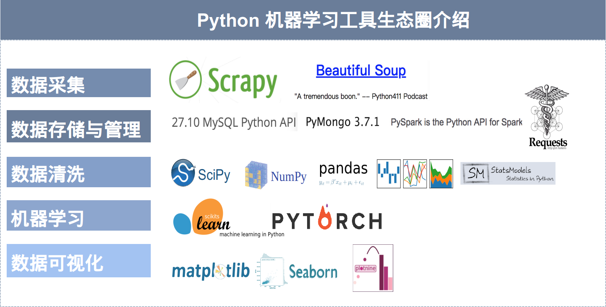

NumPy

Pandas

Scikit-learn ：Python用于数据建模的第三方库。实现主要的机器学习、数据挖掘算法。主要功能：数据集预处理、数据集划分、构建模型、模型提升、模型评估。

### Scikit-learn概览

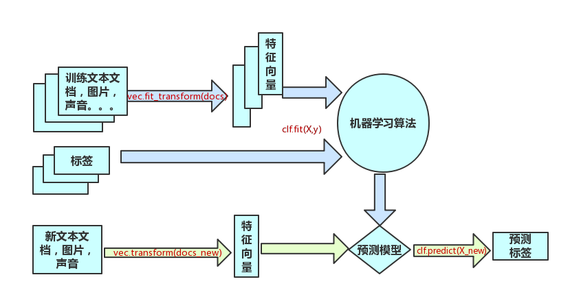

#### Scikit-learn 常用函数

*   transform 函数：数据转换

    *   ```python
        from sklearn import preprocessing
        scaler = preprocessing.StandardScaler().fit(X_train)
        X_train = scaler.transform(X_train)
        X_test = scaler.transform(X_test)
        ```

*   fit 函数：模型训练

    *   ```python
        from sklearn.linear_model import LinearRegression
        lr = LinearRegression()
        lr.fit(X_train, y_train)
        ```

*   predict 函数：模型预测

    *   ```python
        y_pred = lr.predict(X_test)
        ```

#### **Scikit-learn主要模块**

| **模块**              | **说明**           |
| --------------------- | ------------------ |
| preprocessing         | 数据预处理和标准化 |
| feature_extraction    | 特征提取           |
| feature_selection     | 特征选择           |
| linear_model          | 线性模型           |
| tree                  | 基于树的模型       |
| cluster               | 无监督聚类算法     |
| discriminant_analysis | 线性判别分析       |
| ensemble              | 集成模型           |
| metrics               | 模型评价           |
| model_selection       | 模型选择与参数调优 |

#### **Scikit-learn回归模块的主要算法**

| **类**                         | **说明**                         |
| ------------------------------ | -------------------------------- |
| linear_model.LinearRegression  | 普通最小二乘法                   |
| linear_model.Ridge             | 岭回归                           |
| linear_model.Lasso             | 用L1作为正则项的线性模型         |
| linear_model.ElasticNet        | 将L1和L2组合作为正则项的线性回归 |
| linear_model.BayesianRidge     | 贝叶斯岭回归                     |
| linear_model.TheilSenRegressor | 泰尔森回归：稳健的多元回归模型   |
| linear_model.HuberRegressor    | 对异常值具有鲁棒性的线性回归模型 |
| linear_model.RANSACRegressor   | 随机采样一致性算法               |

#### **Scikit-learn分类模块的主要算法**

| **类**                          | **说明**         |
| ------------------------------- | ---------------- |
| linear_model.LogisticRegression | 逻辑回归         |
| neighbors.KNeighborsClassifier  | K近邻            |
| tree.DecisionTreeClassifier     | 决策树用于分类   |
| naive_bayes.BernoulliNB         | Bernoulli 贝叶斯 |
| naive_bayes.GaussianNB          | Gaussian贝叶斯   |
| naive_bayes.MultinomialNB       | 多项式贝叶斯     |
| svm.LinearSVC                   | 线性支持向量分类 |

#### **Scikit-learn聚类模块的主要算法**

| **类**                          | **说明**                             |
| ------------------------------- | ------------------------------------ |
| cluster.KMeans                  | K-Means聚类                          |
| cluster.AgglomerativeClustering | 层次聚类                             |
| cluster.DBSCAN                  | 基于密度的噪声应用空间聚类（DBSCAN） |
| cluster.MeanShift               | 平均移位聚类                         |
| cluster.SpectralClustering      | 谱聚类                               |

#### **Scikit-learn降维模块的主要算法**

| **类**                                           | **说明**                                          |
| ------------------------------------------------ | ------------------------------------------------- |
| decomposition.PCA                                | 主成分分析 (PCA)                                  |
| decomposition.LatentDirichletAllocation          | LDA                                               |
| discriminant_analysis.LinearDiscriminantAnalysis | 线性判别式分析(Linear Discriminant Analysis, LDA) |
| decomposition.FastICA，decomposition.fastica     | 独立成分分析                                      |
| decomposition.NMF                                | 非负矩阵分解 (NMF)                                |
| manifold.LocallyLinearEmbedding                  | 局部线性映射                                      |
| manifold.MDS                                     | 多维缩放                                          |

### 案例：使用线性回归构建房价预测模型

基本流程如下：（只看代码，所有没有添加数据方面的信息）

1.  导入工具包
2.  加载数据
3.  训练集-测试集划分
4.  模型构建
5.  模型预测与评价

```python
import pandas as pd 

# 从sklearn的模型选择模块导入训练集-测试集划分类
from sklearn.model_selection import train_test_split
# 从sklearn的线性模型模块导入线性回归类
from sklearn.linear_model import LinearRegression
# 从sklearn的模型评价模块导入决定系数
from sklearn.metrics import r2_score
# 从sklearn的模型评价模块导入均方误差
from sklearn.metrics import mean_squared_error

data = pd.read_csv('BostonHousingData.csv') # 读取csv
y = data['target'] # 数据标签，一般为数据集的最后一列，有事也可能是第一列，因数据集而异
X = data.copy().drop(['target'], axis=1) # 去掉标签列的完整数据

# X_train为训练数据， y_train为训练集标签，X_test为测试数据，y_test为测试集标签。一般70%训练，30%测试。
X_train, X_test, y_train, y_test = train_test_split(X, y, test_size = 0.3)

lr = LinearRegression() # 创建一个线性回归对象
# LinearRegression(fit_intercept=True,normalize=False,copy_X=True,n_jobs=None)
lr.fit(X_train, y_train) # 拟合

y_pred = lr.predict(X_test) # 模型预测
print(r2_score(y_test, y_pred)) # 模型评价, 决定系数
print(mean_squared_error(y_test, y_pred)) # 均方误差
''' 运行结果
0.7561429458476269 
20.50487238687095 
'''

```

## 数据预处理

### 数据预处理与预处理模块

模型输入数据质量直接影响建模效果。在正式构建模型之前往往需要对数据进行恰当的预处理。

常用的数据预处理方法：

*   缺失值处理：真实的数据往往因为各种原因存在缺失值，需要用删除法或填补法来得到一个完整的数据子集。
*   离群值检测和处理：检测数据集中那些明显偏离数据集中的其他样本，为数据分析提供高质量的数据。
*   标准化：数据分析及建模过程中，许多机器学习算法需要其输入特征为标准化形式；若样本的特征之间的量纲差异太大，样本之间相似度评估结果将存在偏差。
*   特征编码：模型输入的特征通常需要是数值型的，所以需要将非数值型特征转换为数值特征。
*   离散化：在数据信息损失尽量少的前提下，尽可能减少元数。

常用的sklearn和pandas预处理模块：

| 处理方法         | 对应的sklearn和pandas的类                                    |
| ---------------- | ------------------------------------------------------------ |
| 缺失值处理       | sklearn.preprocessing.Imputer                                |
| 离群值检测和处理 | sklearn.neighbors.LocalOutlierFactor                         |
| 标准化           | sklearn.preprocessing.StandardScaler, sklearn.preprocessing.MinMaxScaler, sklearn.preprocessing.RobustScaler |
| 特征编码         | sklearn.preprocessing.OneHotEncoder, pandas.get_dummies，sklearn.preprocessing.LabelEncoder |
| 离散化           | pandas.cut, pandas.qcut, sklearn.preprocessing.Binarizer     |

Ref: 

*   https://scikit-learn.org/stable/modules/classes.html#module-sklearn.preprocessing
*   http://pandas.pydata.org/pandas-docs/stable/api.html

### 缺失值处理

#### 删除法

删除法通过删除包含缺失值的数据，来得到一个完整的数据子集。 数据的删除既可以从样本的角度进行，也可以从特征的角度进行。

*   删除特征：当某个特征缺失值较多，且该特征对数据分析的目标影响不大时， 可以将该特征删除。
*   删除样本：删除存在数据缺失的样本。该方法适合某些样本有多个特征存在缺失值，且存在缺失值的样本占整个数据集样本数量的比例不高的情形。
*   缺点：
    它以减少数据来换取信息的完整，丢失了大量隐藏在这些被删除数据中的信息；在一些实际场景下，数据的采集成本高且缺失值无法避免，删除法可能会造成大量的资源浪费。


#### 填补法

计算该特征中非缺失值的平均值，中位数或众数，然后使用平均值,中位数或众数来代替缺失值。

*   平均值（数值型特征）
*   众数（非数值型特征）
*   中位数

在实际应用过程中，可以根据一定的辅助特征，将数据集分成多组，然后在每一组数据上分别使用均值插补. 例如学生信息数据集，``入学年份''特征记录了学生入学的年份，可以首先根据毕业年份对数据进行分组，然后使用每一个分组数据中``年龄''特征的平均值来对缺失值进行填补。

*   缺点一：均值填补法会使得数据过分集中在平均值或众数上，导致特征的方差被低估
*   缺点二：由于完全忽略特征之间的相关性，均值填补法会大大弱化特征之间的相关性

其他填补方法：

*   随机填补
    随机填补是在均值填补的基础上加上随机项，通过增加缺失值的随机性来改善缺失值分布过于集中的缺陷
*   基于模型的填补
    将缺失特征 y 当作预测目标；使用其余特征作为输入，利用缺失特征非缺失样本构
*   建分类或回归模型
*   哑变量方法
    对于离散型特征，将缺失值作为一个单独的取值进行处理
*   EM算法填补

#### Pandas缺失值处理

缺失数据通常用NaN（not a number）表示，它是一个可以被检测出来的标记。默认在所有的统计描述中都排除缺失数据。

| **方法**  | **描述**                                                     |
| --------- | ------------------------------------------------------------ |
| dropna()  | 根据各标签的值中是否存在缺失数据对轴标签进行过滤，可通过阈值调节对缺失值的容忍度 |
| fillna()  | 用指定值或插值方法填充缺失数据                               |
| isnull()  | 返回一个含有布尔值的对象，这些布尔值表示哪些值是缺失值NA，该对象的类型与源类型一样 |
| notnull() | isnull的否定式                                               |


#### Scikit-learn缺失值处理

Scikit-learn中缺失值填补函数：

```python
import sklearn
sklearn.preprocessing.Imputer(
    missing_values=’NaN’, # 缺失值的占位符
    strategy=’mean’, # 填补策略
    axis=0, # 0为按列，1为按行
    verbose=0, # 控制imputer的详细程度 
    copy=True # True，将创建X的副本；False，填补将在X上进行
)
# strategy:
# 如果是“mean”，则使用沿轴的平均值替换缺失值。
# 如果是“median”，则使用沿轴的中位数替换缺失值。
# 如果是“most_frequent”，则使用沿轴的最频繁值替换缺失。

# Imputer在0.22中已经从preprocessing模块删除,缺失值填补转移至 Impute模块
```

##### Imputer

| **方法**               | **功能**                |
| ---------------------- | ----------------------- |
| .fit(X[, y])           | 拟合用于X的填补参数。   |
| .fit_transform(X[, y]) | 拟合数据，然后转换。    |
| .transform(X)          | 在X中计算所有缺失的值。 |


```python
# 示例：用均值对年龄进行填补
from sklearn.preprocessing import Imputer
imp = Imputer(missing_values='NaN', strategy='mean', axis=0)
imp.fit(teenager_sns[["age"]])
teenager_sns["age_imputed"]=imp.transform(teenager_sns[["age"]])
# 显示年龄缺失的行，和插补后的列"age_imputed"
teenager_sns[teenager_sns['age'].isnull()]
```


### 离群值检测

离群值指一个数据集中那些明显偏离数据集中的其他样本。

一种带有统计学味道的定义是：一个观测与其他观测偏离太多以致于值得怀疑它是由不同的机制所产生的。

产生原因：自然变异、数据测量和收集的误差以及人工操作失误等。

离群值检测可以作为数据预处理的一个步骤，为数据分析提供高质量的数据。

离群值检测也可以直接用来解决很多应用问题：信用欺诈检测、电信欺诈检测、疾病分析、计算机安全诊断等。

但离群值未必就是“异常值”。央行的例子：初步的数据分析发现存在房贷的额度低于1000的情形，疑似数据异常。经过真实验证，发现确实存在这种情况，农村贷款时候把修房报送为房贷。

#### 基于统计

在上、下α分位点之外的值认为是异常值。盒图观察

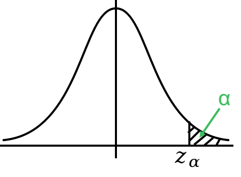

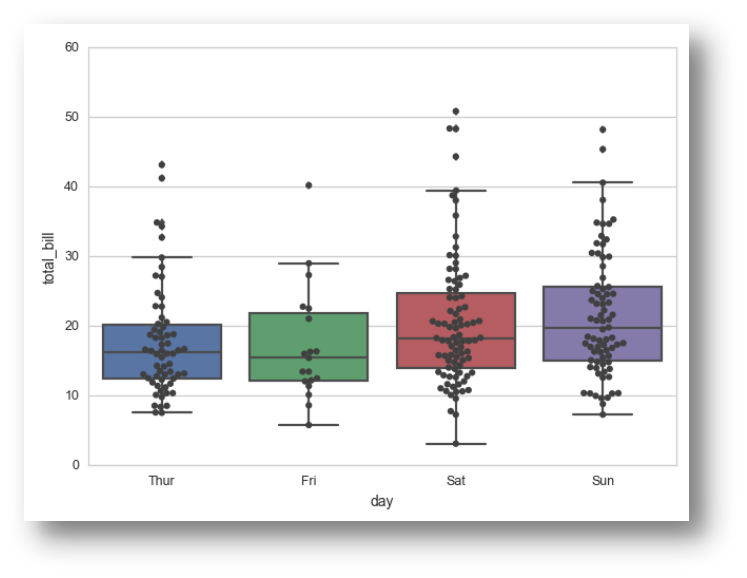

分位数：

*   K分位数：令x是一个值，如果在数据集中，百分之K的数据的值都不大于x，则称x为该数据集的K分位数。
*   分位数：Q1（25th percentile），Q3（75th percentile）
*   中间分位数范围：IQR = Q3 - Q1
*   方差（Variance）和标准差（Standard deviation）
*   方差 ：$ \sigma^2 = \frac{1}{n-1} \overset{n}{\sum \limits_{i=1}} (x_i-\overline{x})^2 $ 

盒图

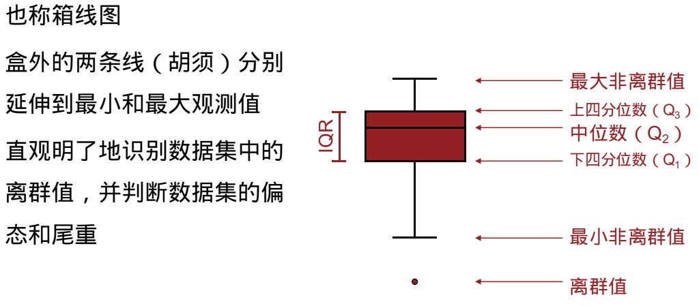

#### 基于近邻

局部异常因子算法（LOF算法，Local Outlier Factor）

基本想法：
通过比较每个点𝑝和其邻域点的密度来判断该点是否为异常点，点𝑝的密度越低，越可能被认定是异常点
密度通过点之间的距离来计算，点之间距离越远，密度越低，距离越近，密度越高


相关定义

*   d(A,B)：点A与点B之间的距离
*   d_k(A)：点A的第 k 距离，即距离点A第k远的点的距离，不包括点A 
*   N_k(A)：点A的第 k 距离邻域，即A的第 k 距离以内的所有点，包括第 k 距离的点
*   rd_k(B,A)：点A到点B的第 k 可达距离，计算公式为 : rd_k(B,A)=max{d_k(A),ⅆ(A,B)}

离群值检测：

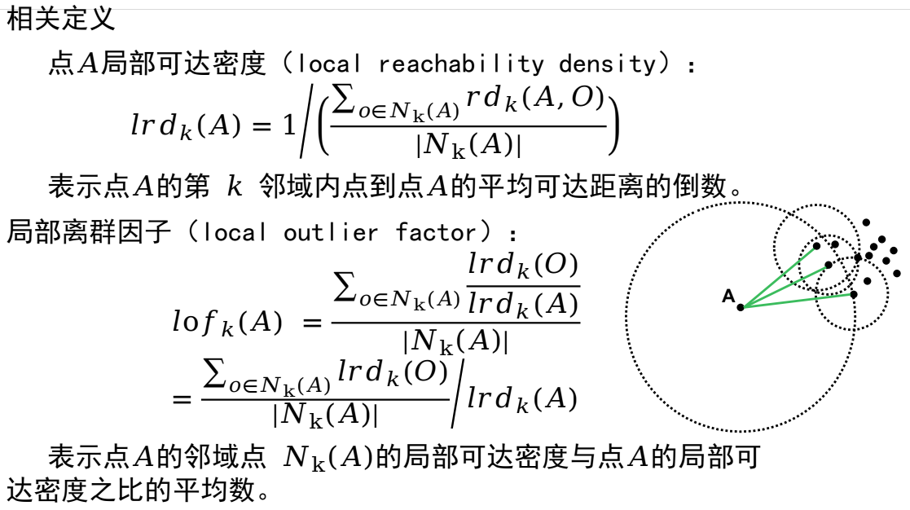

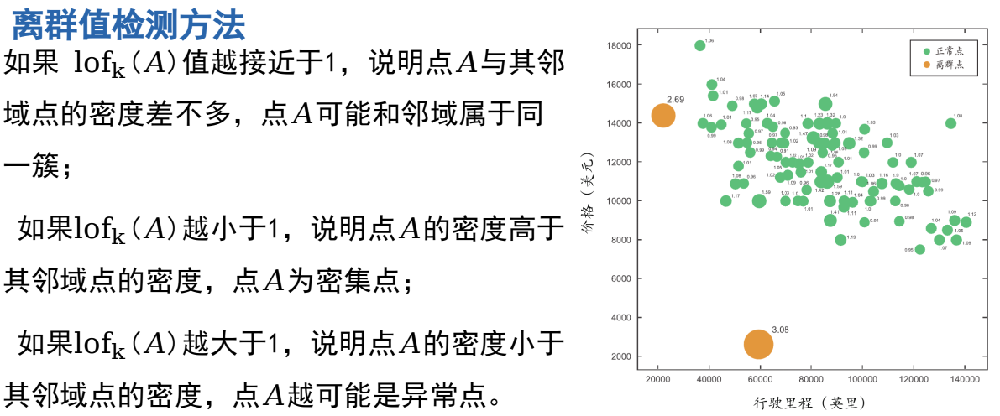


#### sklearn 离群值检测

```python
import sklearn
sklearn.neighbors.LocalOutlierFactor(
    n_neighbors=20, # 用于kneighbors查询的邻域数
    algorithm='auto', # {‘auto’, ‘ball_tree’, ‘kd_tree’, ‘brute’}, 可选 
    leaf_size=30, # 传递给BallTree或KDTree的叶子大小
    metric='minkowski', # 用于距离计算的度量
    p=2, # p = 1时，manhattan_distance（l1）；p = 2，euclidean_distance（l2）
    metric_params=None, # 度量函数的其他关键字参数
    contamination=0.1, # 数据集中异常值的比例
    n_jobs=1 # 为邻域搜索运行的并行作业数
)
```


##### LocalOutlierFactor

| **方法**                                       | **功能**                        |
| ---------------------------------------------- | ------------------------------- |
| .fit(X[, y])                                   | 使用X作为训练数据拟合模型。     |
| .fit_predict(X[, y])                           | 使模型适合训练集X并返回标签。   |
| .kneighbors([X, n_neighbors, return_distance]) | 找到一个点的K邻域。             |
| .kneighbors_graph([X, n_neighbors, mode])      | 计算X中点的k-邻域的（加权）图。 |


```python
# 示例：对行驶里程和价格进行利群检测
import pandas as pd
from sklearn.neighbors import LocalOutlierFactor
test = pd.read_csv('accord_sedan_testing.csv')
data = test[['mileage','price']]
print(data.describe())
scaler = LocalOutlierFactor()
scaler.fit(data)
data['LOF'] = - scaler.negative_outlier_factor_
data[data.LOF>1.5] # 显示局部离群因子大于1.5的样本
```

#### 离群值处理

离群值的处理方法主要是要看在测试数据上的性能是否有提升。

正常情况下如果的确是离群值，在有离群值的特征较少的情况下，去掉后在测试数据上的性能是会有显著提升的。

在对数据分布影响较小的情况下，可以把离群值当成缺失值，或用均值替换。

### 标准化

为什么要进行数据标准化？

数据分析及建模过程中，许多机器学习算法需要其输入特征为标准化形式。例如，SVM算法中的RBF核函数，线性模型中的l1、l2正则项，目标函数往往假设其特征均值在0附近且方差齐次；若样本的特征之间的量纲差异太大，样本之间相似度评估结果将存在偏差。

常见数据标准化方法：Z-Score标准化、Min-Max标准化。

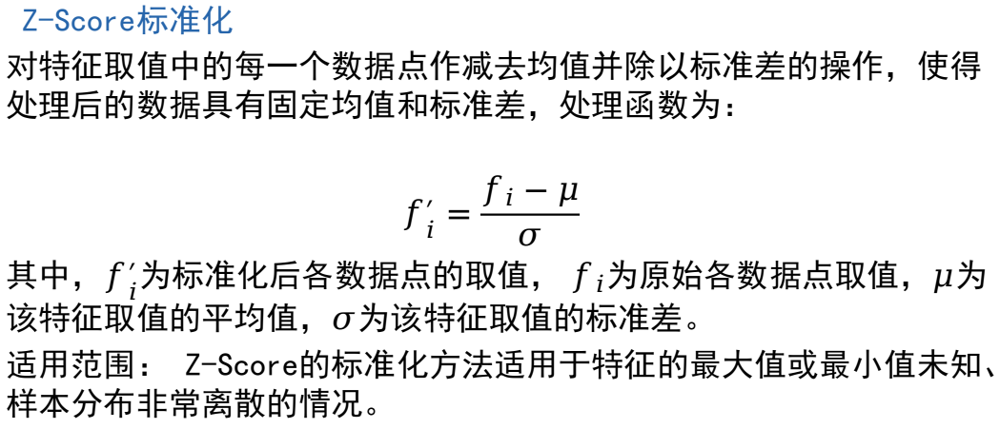

```python
# Scikit-learn中Z-Score标准化函数用法：
import sklearn
sklearn.preprocessing.StandardScaler(
    copy=True, # 如果为False，尝试避免复制并改为直接替换
    with_mean=True, # 如果为True，则在缩放之前将数据居中
    with_std=True # 如果为True，则将数据缩放为单位方差（或单位标准差）
)
# 实现相同功能的函数scale
```

##### StandardScaler

| 方法                          | 功能                                   |
| ----------------------------- | -------------------------------------- |
| .fit(X[, y])                  | 计算均值和方差用于后续标准化。         |
| .fit_transform(X[, y])        | 拟合数据，然后转换。                   |
| .inverse_transform(X[, copy]) | 将数据缩减为原始表示。                 |
| .partial_fit(X[, y])          | 在线计算X上的mean和std以便后续标准化。 |
| .transform(X[, y, copy])      | 通过居中和缩放执行标准化。             |


```python
# 示例：对朋友数量进行Z-Score标准化
from sklearn.preprocessing import StandardScaler
scaler = StandardScaler(copy=True)
teenager_sns_zscore = pd.DataFrame(scaler.fit_transform(teenager_sns[["friends"]]),columns =["friends_StandardScaled"] )
teenager_sns_zscore["friends"] = teenager_sns["friends"]
print("均值：",teenager_sns_zscore["friends_StandardScaled"].mean(axis=0))
print("方差：",teenager_sns_zscore["friends_StandardScaled"].std(axis=0))
teenager_sns_zscore.head(5)

```


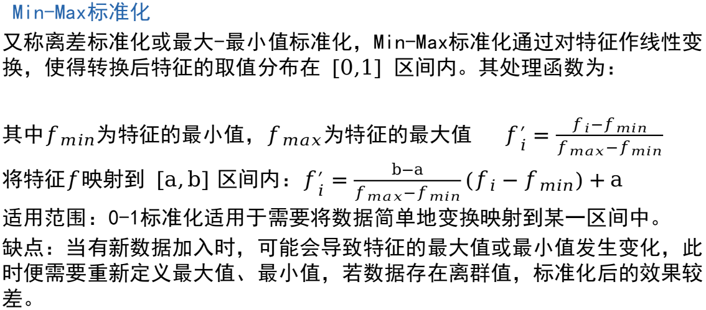

```python
# Scikit-learn中Min-Max标准化函数用法：
import sklearn 
sklearn.preprocessing.MinMaxScaler(
    feature_range=(0, 1), #期望的转换数据范围
    copy=True #设置为False以执行就地标准化并避免复制
)
# 实现相同功能的函数还有minmax_scale
```

##### MinMaxScaler

| **方法**                      | **功能**                                    |
| ----------------------------- | ------------------------------------------- |
| .fit(X[, y])                  | 计算最大值和最小值用于后续标准化。          |
| .fit_transform(X[, y])        | 拟合数据，然后转换。                        |
| .inverse_transform(X[, copy]) | 将数据重置为原始表示。                      |
| .partial_fit(X[, y])          | 在线计算X上的最小值和最大值以便后续标准化。 |
| .transform(X[, y, copy])      | 通过居中和缩放执行标准化。                  |

```python
# 示例：对朋友数量进行Min-Max标准化
from sklearn.preprocessing import MinMaxScaler
filtered_columns = ["friends"]
scaler = MinMaxScaler(copy=False)
teenager_sns_minmaxscore = pd.DataFrame(scaler.fit_transform(teenager_sns[["friends"]]),
columns = ["friends_MinMaxScaled"])
teenager_sns_minmaxscore["friends"] = teenager_sns["friends"]
teenager_sns_minmaxscore.head(5)
```


```python
# 考虑离群值的标准化
import sklearn
sklearn.preprocessing.RobustScaler(
    with_centering=True, # 如果为True，则在标准化之前将数据居中
    with_scaling=True, # 如果为True，则将数据缩放到分位数范围
    quantile_range=(25.0, 75.0), # 用于计算scale_的分位数范围
    copy=True # 如果为False，请尝试避免复制并改为直接替换
)
# 根据分位数范围（默认为IQR：Interquartile Range）减去中位数并缩放数据。
# IQR是第1个四分位数（第25个分位数）和第3个四分位数（第75个分位数）之间的范围。

# 实现相同功能的函数 robust_scale
```

##### RobustScaler

| **方法**               | **功能**                         |
| ---------------------- | -------------------------------- |
| .fit(X[, y])           | 计算中值和分位数用于后续标准化。 |
| .fit_transform(X[, y]) | 拟合数据，然后转换。             |
| .inverse_transform(X)  | 将数据缩减为原始表示。           |
| .transform(X)          | 通过居中和缩放执行标准化。       |


```python
# 示例：考虑离群值
from sklearn.preprocessing import RobustScaler
scaler = RobustScaler(copy=True)
teenager_sns_robustscaled = pd.DataFrame(scaler.fit_transform(teenager_sns[["gradyear","friends"]]),columns = ['gradyear_RobustScaled', 'friends_RobustScaled'])
teenager_sns_robustscaled[["gradyear","friends"]]=teenager_sns[["gradyear","friends"]]
print(teenager_sns_robustscaled[['gradyear_RobustScaled', 'friends_RobustScaled']].describe())
teenager_sns_robustscaled.head(5)
```


### 离散化与特征编码

模型输入的特征通常需要是数值型的，所以需要将非数值型特征转换为数值特征
如性别、职业、收入水平、国家、汽车使用品牌。包括数字编码、One-Hot编码、哑变量编码方法。

**数字编码**

原特征 gender={“M”，“F”和“unknown”}
编码后 gender={0，1，2}
缺点：引入了次序关系


##### LabelEncoder ：

| **方法**                           | **功能**                       |
| ---------------------------------- | ------------------------------ |
| .fit(y)                            | 拟合标签编码器。               |
| .fit_transform(y)                  | 拟合标签编码器并返回编码标签。 |
| .inverse_transform(Y[, threshold]) | 将标签转换回原始编码。         |
| .transform(y)                      | 将标签转换为规范化编码。       |

```python
# 示例：利用sklearn对性别进行标签编码
from sklearn.preprocessing import LabelEncoder
le = LabelEncoder()
print(teenager_sns["gender"][:4]) # 打印前4个人的性别
print(le.fit_transform(teenager_sns["gender"][:4])) # 编码
print(le.classes_)
''' 运行结果
0		M
1		F
2		M
3		F
Name: gender, dtype: object
[1 0 1 0]
['F' 'M']
'''
```

One-Hot编码

将包含𝐾个取值的离散型特征转换成𝐾个二元特征（取值为0或1）

优点：经过One-Hot编码之后，不同的原始特征之间拥有相同的距离；One-Hot编码对包含离散型特征的回归模型及分类模型的效果有很好的提升。

缺点：特征显著增多，且增加了特征之间的相关性：$f_1+f_2+ f_3+ f_4+ f_5=1$ 

```python
# 示例：用Pandas对汽车品牌进行One-Hot编码
import pandas as pd
df = pd.read_csv("car.csv")
print(df)
df = pd.get_dummies(df, columns=['Brand'])
print(df)
# pd.get_dummies(data, prefix=None, prefix_sep='_', dummy_na=False, columns=None, sparse=False, drop_first=False, dtype=None)
''' 运行结果
  Brand
0    路虎
1    吉利
2    奥迪
3    大众
4    奔驰

Brand_吉利  Brand_大众  Brand_奔驰  Brand_奥迪  Brand_路虎
0         0         0         0         0         1
1         1         0         0         0         0
2         0         0         0         1         0
3         0         1         0         0         0
4         0         0         1         0         0
'''
```

```python
# sklearn One-Hot编码
import sklearn
sklearn.preprocessing.OneHotEncoder(
    n_values='auto', # 'auto'，int或int数组，每个特征的取值个数。
    categorical_features='all', # 指定将哪些功能视为分类
    dtype=<class 'numpy.float64'>, # 期望的输出类型
    sparse=True, # 如果设置为True将返回稀疏矩阵，否则将返回一个数组。
    handle_unknown='error' # 若转换期间存在未知的分类特征，引发错误还是忽略
)
# 输入：整数矩阵，表示分类（离散）特征所采用的值。
# 输出：稀疏矩阵，其中每列对应于一个特征的一个可能值。 
# 假设输入特征采用[0，n_values）范围内的值。

```

##### OneHotEncoder

| **方法**               | **功能**                          |
| ---------------------- | --------------------------------- |
| .fit(X[, y])           | 用OneHotEncoder拟合X。            |
| .fit_transform(X[, y]) | 用OneHotEncoder拟合X，然后转换X。 |
| .transform(X)          | 使用One-Hot编码转换X。            |

```python
# 示例：sklearn对性别进行One-Hot编码
import numpy as np
from sklearn.preprocessing import OneHotEncoder
# 对性别进行数字编码
teenager_sns['gender']=teenager_sns['gender'].map({'M':1,'F':2,np.NaN:3})
enc = OneHotEncoder()
enc.fit(teenager_sns[['gender']]) # 对性别用OneHotEncoder进行拟合
print(enc.active_features_) # 活动特征的指数，意味着训练集中实际出现的值
print(enc.transform([[2]]).toarray()) # 使用One-Hot编码转换
```

#### 特征离散化

为什么要将连续型特征进行离散化处理？

*   算法特征类型有要求。如关联规则挖掘算法，ID3决策树算法。为更好地提高算法的精度。朴素贝叶斯分类算法的正确率比没有处理的情况平均高出10% ；
*   离散化处理本质是将连续型数据分段，增强了之后模型对于数据异常值的鲁棒性；
*   离散化后的特征，其取值均转化为有明确含义的区间号，数据的可解释性更强
*   特征的取值大大减少:
    一来减少了数据集对于系统存储空间的需求，
    二来在算法建模中也大大减少了模型的实际运算量，从而可以提升模型的计算效率

特征离散化的基本概念

*   特征的离散化过程是将连续型特征的取值范围划分为若干区间段(bin)，然后使用区间段代替落在该区间段的特征取值。

*   区间段之间的分割点称之为切分点(cut point)。

*   由切分点分割出来的子区间段的个数，称之为元数 (arity)。

    

假设需要将“年龄”这个连续型特征切分成𝑘个区间段，则需要(𝑘−1)个切分点。“年龄”特征的取值范围在 [0,150] 之间，通过4个切分点10、25、40和60，将其转化成为5个离散区间段


特征离散化目标：在数据信息损失尽量少的前提下，尽可能减少元数

方法：

*   二值化

    *   根据阈值将数据二值化（将特征值设置为0或1）：大于阈值的值映射为1，而小于或等于阈值的值映射为0。默认阈值为0时，只有正值映射到1。

    *   ```python
        # Scikit-learn 中二值化函数
        sklearn.preprocessing.Binarizer(
            threshold=0.0, # 低于或等于此值的特征值将替换为0，高于此值替换为1
            copy=True # 设置为False以执行就地二值化并避免复制
        )
        # 实现相同功能的函数：binarize
        ```

    *   Binarizer 方法

        *   | **方法**                 | **功能**                           |
            | ------------------------ | ---------------------------------- |
            | .fit(X[, y])             | 什么都不做，返回保持不变的估算器。 |
            | .fit_transform(X[, y])   | 拟合数据，然后转换。               |
            | .transform(X[, y, copy]) | 二值化X的每个元素。                |

    *   ```python
        # 示例：对朋友数量进行二值化
        from sklearn.preprocessing import Binarizer
        #　二值化，阈值设置为3，返回值为二值化后的数据
        scaler = Binarizer(threshold=3)
        teenager_sns_binarizer = pd.DataFrame(scaler.fit_transform(teenager_sns[["friends"]]),columns = ["friends_Binarized"])
        teenager_sns_binarizer["friends"] = teenager_sns["friends"]
        ```

    *   

*   等距离散化

    *   根据连续型特征的取值，将其均匀地划分成 𝑘 个区间，每个区间的宽度均相等，然后将特征的取值划入对应的区间从而完成特征离散化。
        如年龄取值应分布在[0,90]，确定离散化后的区间段个数为5。等距离散化对输入数据质量要求高，无法解决特征存在离群值的问题。若存在离群值150，则切分点将严重偏移。

    *   ```python
        # Pandas cut实现等距离散化
        import pandas as pd
        pd.cut(
            x, # 要离散的输入数组。 必须是一维的。
            bins, # int，标量序列或pandas.IntervalIndex，离散的标准。
            right=True, # 是否包含最右边。
            labels=None, # 指定返回的bin的标签。 必须与生成的bin长度相同。
            precision=3, # 存储和显示bin标签的精度。
            include_lowest=False # 第一个间隔是否应该是包含在内的。
        )
        ```

    *   ```python
        # 示例：对朋友数量进行等距离散化
        import pandas as pd
        data = teenager_sns['friends'].copy()
        k = 4
        # 等距离散化，各个类比依次命名为0,1,2,3
        d1 = pd.cut(data, k, labels = range(k))
        ```

    *   

*   等频离散化

    *   不要求区间段的宽度始终保持一致，而是尽量使得离散化后每一个区间内的样本量均衡

        根据连续型特征的总个数，将其均匀地划分成 𝑘 个区间段，使得每个区间段中的样本数相同，然后每一份数据的取值范围即是对应的特征离散化区间

    *   缺点：有时会将同样或接近的样本划分入不同的区间，容易使得相邻区间段内的数据具有相似的特性。

    *   ```python
        # Pandas qcut实现等频率离散化
        pandas.qcut(
            x, # 1维 ndarray 或 Series
            q, # 分位数。 10为十分位数，4为四分位数等
            labels=None, #　指定返回的bin的标签。 必须与生成的bin长度相同。
            retbins=False, #　是否返回（bins，标签）。
            precision=3 # 存储和显示bin标签的精度。
        )
        
        import pandas as pd
        data = teenager_sns['friends'].copy()
        k = 4
        #等频率离散化，各个类比依次命名为'A','B','C','D'
        d1 = pd.qcut(data, k, labels = ['A','B','C','D'])
        
        
        ```

    *   

*   聚类离散化

    *   1.  对于需要离散化的连续型特征，采用聚类算法(如K-means、EM算法等)，把样本依据该特征的分布划分成相应的簇或类；
        2.  在聚类结果的基础上，基于特定的策略，决定是否对簇进行进一步分裂或合并。利用自顶向下的策略可以针对每一个簇继续运行聚类算法，将其细分为更小的子簇；利用自底向上的策略，则可以对邻近相似的簇进行合并处理得到新的簇；
        3.  在最终确定划分的簇之后，确定切分点以及区间个数。

    *   在整个聚类的过程中，我们需要事先确定簇的个数以及描述样本之间的距离计算方式。如何选定簇的个数也会影响聚类算法的效果，从而影响特征的离散化。

    *   ```python
        # 示例：对朋友数量进行K-means聚类离散化
        import pandas as pd
        data = teenager_sns['friends'].copy()
        k = 4
        # 聚类离散化，各个类比依次命名为'A','B','C','D'
        from sklearn.cluster import KMeans # 引入KMeans
        kmodel = KMeans(n_clusters = k) # 建立模型
        kmodel.fit(data.values.reshape((len(data), 1))) # 训练模型
        c = pd.DataFrame(kmodel.cluster_centers_).sort_values(0)  # 输出聚类中心，并且排序
        w = c.rolling(2).mean().iloc[1:] # 相邻两项求中点，作为边界点
        w = [0] + list(w[0]) + [data.max()] # 把首末边界点加上，w[0]中0为列索引
        d2 = pd.cut(data, w, labels =  ['A','B','C','D'])
        ```

    *   

*   信息增益离散化

*   卡方离散化等

    *   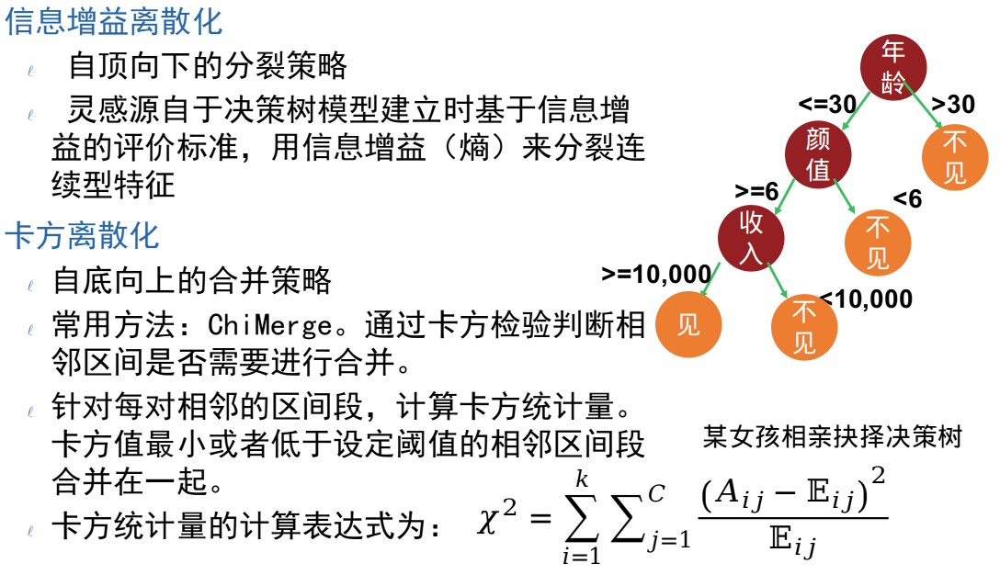

### 总结

| 常见数据预处理方法 | 对应的sklearn和pandas的类                                    |
| ------------------ | ------------------------------------------------------------ |
| 缺失值处理         | sklearn.preprocessing.Imputer                                |
| 离群值检测和处理   | sklearn.neighbors.LocalOutlierFactor                         |
| 标准化             | sklearn.preprocessing.StandardScaler, sklearn.preprocessing.MinMaxScaler, sklearn.preprocessing.RobustScaler |
| 特征编码           | sklearn.preprocessing.OneHotEncoder, pandas.get_dummies，sklearn.preprocessing.LabelEncoder |
| 离散化             | pandas.cutpandas.qcut sklearn.preprocessing.Binarizer        |


## **回归模型**

### 回归问题和Scikit-learn回归模块介绍

回归(Regression)用一个或多个自变量来预测因变量的数学方法。

在一个回归模型中，我们需要关注或预测的变量叫做因变量，我们选取的用来解释因变量变化的变量叫做自变量。

Scikit-learn回归的主要算法

| **类**                         | **说明**                                      |
| ------------------------------ | --------------------------------------------- |
| linear_model.LinearRegression  | 普通最小二乘法                                |
| linear_model.Ridge             | 岭回归                                        |
| linear_model.Lasso             | 用L1作为正则项的线性模型                      |
| linear_model.ElasticNet        | 将L1和L2组合作为正则项的线性回归              |
| linear_model.BayesianRidge     | 贝叶斯岭回归                                  |
| linear_model.TheilSenRegressor | 泰尔森回归：稳健的多元回归模型                |
| linear_model.HuberRegressor    | Huber回归（对异常值具有稳健性的线性回归模型） |
| linear_model.RANSACRegressor   | RANSAC（随机采样一致性算法）                  |
| neighbors.KNeighborsRegressor  | K近邻回归                                     |
| svm.SVR                        | 支持向量回归                                  |
| tree.DecisionTreeRegressor     | 决策树回归                                    |

### 线性回归

#### 一元线性回归

#### 多元线性回归

#### 最小二乘估计

```python
# Scikit-learn中普通最小二乘线性回归函数用法
import sklearn
sklearn.linear_model.LinearRegression(
    fit_intercept=True, # 是否计算此模型的截距。如果设置为False，则不会在计算中使用截距
    normalize=False # 当fit_intercept设置为False时，将忽略此参数。 如果为真，则回归量X将在回归之前通过减去平均值并除以L2范数来归一化。
)
```

##### LinearRegression

| 方法         | 功能                 |
| ------------ | -------------------- |
| .fit(X, y)   | 拟合模型             |
| .predict(X)  | 使用模型预测         |
| .score(X, y) | 返回预测的决定系数R2 |

| 属性        | 说明          |
| ----------- | ------------- |
| .coef_      | 回归系数（w） |
| .intercept_ | 截距          |

```python
#构建线性回归模型
from sklearn.linear_model import LinearRegression
from sklearn import metrics
lr = LinearRegression()
lr.fit(train_x, train_y)
```


评估模型的性能

线性回归模型：

`charges = 258.79*age+370.97*bmi+461.80*children-82.56*sex_male+23779.80*smoker_yes-564.06*region_northwest
-1243.80*region_southeast-1011.00*region_southwest-12881.86`

```python
#回归效果评估
pred_y_test = lr.predict(test_x)
pred_y_train = lr.predict(train_x)

print("训练集的决定系数: ", round(metrics.r2_score(train_y, pred_y_train),3))
print("测试集的决定系数: ", round(metrics.r2_score(test_y, pred_y_test),3))

''' 运行结果： 
训练集的决定系数:  0.751
测试集的决定系数:  0.75
'''
```

### 线性回归正则化

```python
# sklearn 岭回归
import sklearn
sklearn.linear_model.Ridge(
    alpha=1.0, # 正则化强度,即正则化参数λ
    fit_intercept=True # 是否计算此模型的截距。如果设置为False，则不会在计算中使用截距
)

```

##### Ridge

| 方法         | 功能                 |
| ------------ | -------------------- |
| .fit(X, y)   | 拟合模型             |
| .predict(X)  | 使用模型预测         |
| .score(X, y) | 返回预测的决定系数R2 |

| 属性        | 说明          |
| ----------- | ------------- |
| .coef_      | 回归系数（w） |
| .intercept_ | 截距          |

```python
# sklearn LASSO 回归
import sklearn
sklearn.linear_model.Lasso(
    alpha=1.0, # 即正则化参数λ，常数乘以L1项。默认为1.0。
    fit_intercept=True # 是否计算此模型的截距。
)
```

##### Lasso

| 方法         | 功能                 |
| ------------ | -------------------- |
| .fit(X, y)   | 拟合模型             |
| .predict(X)  | 使用模型预测         |
| .score(X, y) | 返回预测的决定系数R2 |

| 属性        | 说明          |
| ----------- | ------------- |
| .coef_      | 回归系数（w） |
| .intercept_ | 截距          |

```python
# 自行车分享数据集
import pandas as pd
from sklearn import model_selection
data = pd.read_csv('./input/Bike.csv')
Y = data['cnt']
X = data.copy().drop(['cnt'], axis=1)
# 将数据集划分为训练集和测试集两部分
train_x, test_x, train_y, test_y = model_selection.train_test_split(X, Y, test_size = 0.3, random_state = 14)

from sklearn.linear_model import LinearRegression
from sklearn import metrics
lr = LinearRegression()
lr.fit(train_x, train_y)

# 回归效果评估
pred_y_test = lr.predict(test_x)
pred_y_train = lr.predict(train_x)
print("训练集的决定系数:", round(metrics.r2_score(train_y, pred_y_train),4))
print("测试集的决定系数:", round(metrics.r2_score(test_y, pred_y_test),4))
''' 运行结果 
训练集的决定系数: 0.7986
测试集的决定系数: 0.8
'''
```

```python
# 岭回归模型
from sklearn.linear_model import Ridge
from sklearn import metrics
clf = Ridge(alpha=1.0)
clf.fit(train_x, train_y)

# 回归效果评估
pred_y_test = clf.predict(test_x)
pred_y_train = clf.predict(train_x)

print("训练集的决定系数:", round(metrics.r2_score(train_y, pred_y_train),4))
print("测试集的决定系数:", round(metrics.r2_score(test_y, pred_y_test),4))
''' 运行结果
训练集的决定系数: 0.7974
测试集的决定系数: 0.802
'''

# 岭回归正则化路径
from sklearn.linear_model import Ridge
from sklearn import metrics
import numpy as np
import math

lambdaList=np.arange(math.exp(0),math.exp(10), 10)
coef = pd.DataFrame() # 创建一个空的dataframe

for lambda_ in lambdaList:
    index = lambda_ 
    columns = X.columns
    clf = Ridge(alpha = lambda_)
    clf.fit(train_x, train_y)
    df = pd.DataFrame([clf.coef_],columns=columns)
    df['lambda']=math.log(index)
    coef = coef.append(df, ignore_index = True) 

import matplotlib.pyplot as plt
# %matplotlib inline # 在jupyter中可用
# 绘多条线图
for feature in X.columns:
    plt.plot( 'lambda', feature, data=coef)

plt.legend( bbox_to_anchor=(1.3, 1),loc='upper right')
plt.xlabel(r'log($\lambda$)', fontsize=16)
plt.ylabel(r'Coefficient', fontsize=16)
plt.show()
```

```python
# LASSO 模型
from sklearn import linear_model
from sklearn import metrics
clf = linear_model.Lasso(alpha=0.1)
clf.fit(train_x, train_y)

# LASSO回归效果评估
pred_y_test = clf.predict(test_x)
pred_y_train = clf.predict(train_x)

print("训练集的决定系数:", round(metrics.r2_score(train_y, pred_y_train),4))
print("测试集的决定系数:", round(metrics.r2_score(test_y, pred_y_test),4))
''' 运行结果
训练集的决定系数: 0.7986
测试集的决定系数: 0.8001
'''
```


### 稳健性回归：离群点与建模误差

在存在有损的数据（异常值或模型中的错误）的情况下拟合回归模型。

Scikit-learn提供了3种稳健性回归估计方法：

*   随机抽样一致性算法（RANSAC）
*   泰尔森回归（Theil Sen） 
*   Huber回归 


#### 随机抽样一致性算法（RANSAC）

RANSAC (RANdom SAmple Consensus) 算法

算法步骤：
1）从原始数据中随机选择一些样本作为“内点”。
2）用1中选择的样本拟合模型。
3）利用模型计算其它样本的残差，若某个样本的残差小于预先设置的阈值t，则将其加入内点，将内点中的样本量扩充。
4）用扩充后的内点拟合模型，计算均方误差。
5）重复1-4步，最终选取均方误差最小的模型。

```python
# sklearn 实现RANSAC
import sklearn
sklearn.linear_model.RANSACRegressor(
    base_estimator=None, # 估算器，实现fit(X,y)和score(X,y)和predict(X)
    min_samples=None, # 从原始数据中随机选择的最小样本数
    residual_threshold=None, # 被归类为内点的数据样本的最大残差。
    max_trials=100, # 随机样本选择的最大迭代次数。
    stop_n_inliers=inf, # 停止迭代的最小数量的内点。
    stop_score=inf, # 如果得分大于此阈值，则停止迭代。
    loss='absolute_loss' # {absolute_loss, squared_loss}分别找出每个样本的绝对损失和平方损失。 
)
```

##### RANSACRegressor

| 方法         | 功能                 |
| ------------ | -------------------- |
| .fit(X, y)   | 拟合模型             |
| .predict(X)  | 使用估计的模型预测   |
| .score(X, y) | 返回预测的决定系数R2 |

| 属性        | 说明         |
| ----------- | ------------ |
| .estimator_ | 最佳拟合模型 |


预测的分数 ： 默认是R^2

Score(X,y)：返回给定测试数据的平均精度，用于stop_score定义的停止标准。 另外，该分数用于决定选择两个随后的大共识集中的哪一个作为更好的一致。

#### 泰尔森回归（Theil Sen）

一般的回归模型公式为：$y = w_0 + w_1 x + \varepsilon$ 。其中$w_0,w_1$是模型的参数，$\varepsilon$为模型的随机误差。

在泰尔森回归中，

$\displaystyle w_1 = Median \{\frac{y_i-y_j}{x_i-x_j} : x_i \neq x_j,i<j=1,...,n \}$

泰尔森回归通过选择通过成对点的所有线的斜率的中位数来稳健地将线拟合到平面中的采样点（简单线性回归）。

```python
# 泰尔森回归：稳健的多元回归模型
import sklearn
sklearn.linear_model.TheilSenRegressor(
    fit_intercept=True, # 是否计算此模型的截距。
    n_subsamples=None, # 计算参数的样本数。
    max_iter=300 # 计算中位数的最大迭代次数。
)
# 泰尔森回归使用多维度的中位数进行估计。因此，对多变量异常值具有稳健性。估计量的稳健性随着数据特征维数的提升而迅速降低。在高维数据中，泰尔森回归的效果有时还不如最小二乘法。
```

##### TheilSenRegressor

| 方法         | 功能                 |
| ------------ | -------------------- |
| .fit(X, y)   | 拟合模型             |
| .predict(X)  | 使用估计的模型预测   |
| .score(X, y) | 返回预测的决定系数R2 |

| 属性        | 说明     |
| ----------- | -------- |
| .coef_      | 回归系数 |
| .intercept_ | 截距     |


#### Huber回归

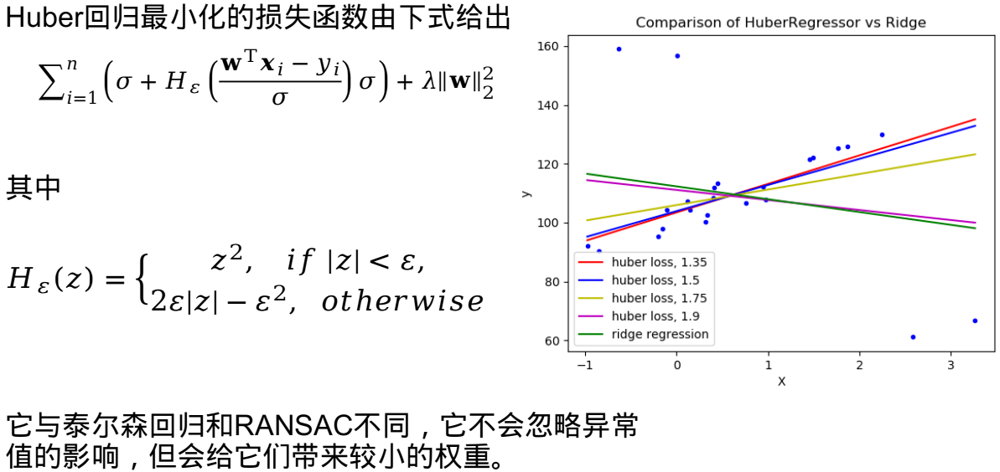

```python
# sklearn Huber 回归
sklearn.linear_model.HuberRegressor(
    epsilon=1.35, # 归类为异常值的样本数。epsilon越小，稳健性越高。
    alpha=0.0001, # 正则化参数。
    warm_start=False, # 如果设置为False，则每次调用都会重写系数。
    fit_intercept=True # 是否拟合截距。
)
```

##### HuberRegressor

| 方法         | 功能                 |
| ------------ | -------------------- |
| .fit(X, y)   | 拟合模型             |
| .predict(X)  | 使用模型预测         |
| .score(X, y) | 返回预测的决定系数R2 |

| 属性        | 说明     |
| ----------- | -------- |
| .coef_      | 回归系数 |
| .intercept_ | 截距     |

```python
import pandas as pd
from sklearn import model_selection
data = pd.read_csv('./input/ElectricalLength.csv')
Y = data['Electrical length']
X = data.copy().drop(['Electrical length'], axis=1)
# 将数据集划分为训练集和测试集两部分
train_x, test_x, train_y, test_y = model_selection.train_test_split(X, Y, test_size = 0.2)

# 线性回归模型
from sklearn.linear_model import LinearRegression
from sklearn import metrics
lr = LinearRegression()
lr.fit(train_x, train_y)

#回归效果评估
pred_y_test = lr.predict(test_x)
pred_y_train = lr.predict(train_x)

print("训练集的决定系数:", round(metrics.r2_score(train_y, pred_y_train),4))
print("测试集的决定系数:", round(metrics.r2_score(test_y, pred_y_test),4))
''' 运行结果
训练集的决定系数: 0.7063
测试集的决定系数: 0.6667
'''
```

```python
# RANSAC回归模型
from sklearn import linear_model
from sklearn import metrics
ransac = linear_model.RANSACRegressor()
ransac.fit(train_x, train_y)

#回归效果评估
pred_y_test = ransac.predict(test_x)
pred_y_train = ransac.predict(train_x)

print("训练集的决定系数:", round(metrics.r2_score(train_y, pred_y_train),4))
print("测试集的决定系数:", round(metrics.r2_score(test_y, pred_y_test),4))
''' 运行结果
训练集的决定系数: 0.681
测试集的决定系数: 0.6851
'''
```

```python
# 泰尔森回归模型
from sklearn.linear_model import TheilSenRegressor
from sklearn import metrics
theil_sen = TheilSenRegressor()
theil_sen.fit(train_x, train_y)

#回归效果评估
pred_y_test = theil_sen.predict(test_x)
pred_y_train = theil_sen.predict(train_x)

print("训练集的决定系数:", round(metrics.r2_score(train_y, pred_y_train),4))
print("测试集的决定系数:", round(metrics.r2_score(test_y, pred_y_test),4))
''' 运行结果
训练集的决定系数: 0.7
测试集的决定系数: 0.6742
'''
```

```python
# Huber回归模型
from sklearn.linear_model import HuberRegressor
from sklearn import metrics
huberRegressor = HuberRegressor()
huberRegressor.fit(train_x, train_y)

#回归效果评估
pred_y_test = huberRegressor.predict(test_x)
pred_y_train = huberRegressor.predict(train_x)

print("训练集的决定系数:", round(metrics.r2_score(train_y, pred_y_train),4))
print("测试集的决定系数:", round(metrics.r2_score(test_y, pred_y_test),4))
''' 运行结果
训练集的决定系数: 0.7044
测试集的决定系数: 0.6722
'''
```

**稳健性回归方法的选取**

Huber回归一般比RANSAC和泰尔森回归快，除非样本数很大，即n_samples >>n_features。这是因为RANSAC和泰尔森回归适合较小的数据子集。但是，对于默认参数，Huber回归比RANSAC和泰尔森回归稳健。 
RANSAC比泰尔森回归快，并且在样本数量上的伸缩性（适应性）更好。
RANSAC可以更好地处理y方向的大值异常点（一般情况下）。
泰尔森回归可以更好地应对X方向的中等大小的异常值，但是这个属性将在高维情况下消失。
不确定选哪个算法的时候，请使用RANSAC 。

### 其他回归方法

非线性回归方法：

*   K近邻回归
*   支持向量回归（SVR）
*   决策树回归
*   样条回归  
*   径向基网络 
*   高斯过程
*    ……

#### K近邻回归

当对测试样本进行回归预测时，通过按距离排序找出一个样本的k个最近邻居，将这些邻居的标签的平均值或加权平均值（距离的倒数乘以权重）赋给该样本，就可以得到该样本的预测值。

```python
# sklearn K近邻回归
import sklearn
sklearn.neighbors.KNeighborsRegressor(
    n_neighbors=5, # 用于查询的邻居数（k）。
    weights=‘uniform’, # 是否对样本进行加权，默认所有点的权重相同。
    algorithm=‘auto’, # 计算最近邻居的算法。
    p=2, # Minkowski指标的幂参数，p=1是曼哈顿距离，p=2是欧氏距离
    metric=‘minkowski’ # 距离度量指标。
)
```

##### KNeighborsRegressor

| 方法         | 功能                 |
| ------------ | -------------------- |
| .fit(X, y)   | 拟合模型             |
| .predict(X)  | 根据模型预测         |
| .score(X, y) | 返回预测的决定系数R2 |


#### 决策树回归

```python
# sklearn 决策树回归
import sklearn
sklearn.tree.DecisionTreeRegressor(
    criterion='mse', #　每一次分裂的评价标准，默认使用均方误差(MSE)
    splitter='best', #　用于在每个节点处选择拆分的策略。
    max_depth=None, #　树的最大深度。
    min_samples_split=2, #　拆分内部节点所需的最小样本数.
    min_impurity_decrease=0.0, #　如果该分裂导致杂质的减少大于或等于该值，则将分裂节点。
    min_impurity_split=None #　树木增长早期停止的门槛。
)
```

##### DecisionTreeRegressor

| 方法         | 功能                 |
| ------------ | -------------------- |
| .fit(X, y)   | 拟合模型             |
| .predict(X)  | 根据模型预测         |
| .score(X, y) | 返回预测的决定系数R2 |

| 属性                  | 说明       |
| --------------------- | ---------- |
| .feature_importances_ | 特征重要性 |
| .tree_                | 决策树对象 |

## **分类模型**

### 分类问题概述和Scikit-learn分类模块

分类是一种典型的有监督学习问题，其应用场景如：信用风险评估、医学诊断和电子邮件分类等。

信用风险评估：根据用户历史还款信息预测其未来是否会违约;
医学诊断：根据肿瘤细胞的特征进行良性和恶性的分类;
电子邮件：根据邮件内容将邮件归类（正常邮件/垃圾邮件）

分类的两个阶段：
分类器训练：即通过训练样本的特征和标签来建立分类模型
预测：利用分类模型对没有分类标签的数据进行预测分类

**二分类问题评价指标**

许多二分类问题中，由于类别分布不平衡，正确率无法有效评价分类效果，需要借助一些特定的指标来评价模型。

| 混淆矩阵<br />(Confuslon Matrix) | 预测标签<br />1(正例) | 预测标签<br />0(负例) |
| -------------------------------- | --------------------- | --------------------- |
| 真实标签<br />1(正例)            | TP（真正样本数量）    | FN（假负样本数量）    |
| 真实标签<br />0(负例)            | FP（假正样本数量）    | TN（真负样本数量）    |

$$
正确率(accuracy) = \frac{TP+TN}{TN+FN+FP+TP}  \\
召回率(recall) = \frac{TP}{TP+FN} \\
精确率(precision) = \frac{TP}{TP+FP} \\
F_1 = \frac{２\times 精确率 \times 召回率 }{精确率+召回率}
$$


**类别不平衡问题解决方法**

在分类问题中，不同的分类错误会导致不同的代价，如：病人误诊。

在类别不平衡时可以为不同类别的样本设置不同的权重（代价），该方法为代价敏感学习的基础。

通常设置每个类别的权重与该分类在样本中出现的频率成反比

**多分类任务**

“拆分法” 可以解决多分类问题，即将多分类任务拆为若干个二分类任务：

*   一对一(OvO)
    *   将N个类别两两配对，产生N(N−1)/2个分类结果，最终结果通过投票产生。
*   一对其余(OvR)
    *   每次将一个类的样例作为正例、所有其他类的样例作为反例训练N 个分类。若仅有一个分类器预测为正类，则对应的类别标记作为分类结果；若有多个分类器预测为正类，则选择预测置信度最大的类别标记作为分类结果。
*   多对多(MvM)
    *   每次将若干个类作为正类，若干个其他类作为反类，最终结果通过投票产生。

#### **Scikit-learn模块中的主要分类算法**

| **类**                          | **说明**           |
| ------------------------------- | ------------------ |
| linear_model.LogisticRegression | 逻辑回归           |
| neighbors.KNeighborsClassifier  | K近邻              |
| tree.DecisionTreeClassifier     | 决策树             |
| naive_bayes.BernoulliNB         | Bernoulli 贝叶斯   |
| naive_bayes.GaussianNB          | Gaussian 贝叶斯    |
| naive_bayes.MultinomialNB       | 多项式贝叶斯       |
| svm.LinearSVC                   | 线性支持向量分类器 |
| svm.SVC                         | 支持向量分类器     |

**通用方法**

| **方法**             | **说明**                                                 |
| -------------------- | -------------------------------------------------------- |
| fit(X, y)            | 训练模型                                                 |
| predict(X)           | 返回X中样本的预测类标签                                  |
| predict_log_proba(X) | 返回X中样本的对数预测类别概率                            |
| predict_proba(X)     | 返回X中样本的预测类别概率                                |
| score(X, y)          | 对X进行预测得到预测标签，再与真实标签y作比对，返回正确率 |


### 逻辑回归

逻辑回归是采用回归分析的思想来解决分类问题的模型，通常解决的是二分类问题，通过引入一个Logistic函数，将连续型的输出映射到(0,1)之间。即在线性回归的基础上，利用一个非线性函数，建立了二元预测目标与原始输入之间的关系。

若预测目标 $y_i \in \{1,−1\}$ ，则逻辑回归模型的基本形式为： $ P(y_i│x_i)=\frac{1}{1+e^{−y_iw^Tx_i}} $。

|                   Logistic 函数                    |
| :------------------------------------------------: |
| 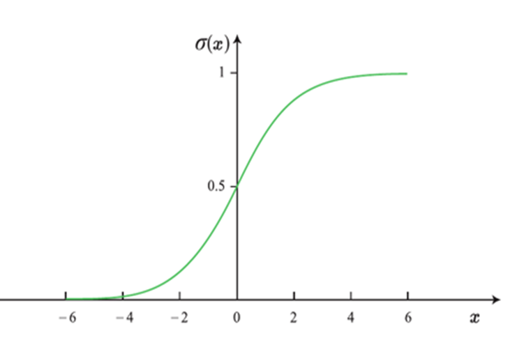 |


逻辑回归的正则化可缓解模型过拟合问题，通常在损失函数上添加惩罚项L1范数 $||w||_1$ 或添加L2范数 $||w||_2^2$ 。Sklearn中，添加L1和L2范数的逻辑回归模型目标函数：
$$
\overset{}{\min \limits_{w}}||w||_1 + C \overset{n}{\sum \limits_{i=1}}log⁡(exp⁡(−y_i(w^Tx_i))+1) \\
\overset{}{\min \limits_{w}} \frac{1}{2}||w||_2^2 + C \overset{n}{\sum \limits_{i=1}}log⁡(exp⁡(−y_i(w^Tx_i))+1) 
$$

逻辑回归算法的常用优化方法有：随机平均梯度下降法、坐标轴下降法、牛顿法和拟牛顿法等。

##### LogisticRegression类

| **参数**     | **说明**                                                     |
| ------------ | ------------------------------------------------------------ |
| penalty      | 添加正则化项，默认为“l2”                                     |
| C            | 正则化强度，正的浮点数，值越小强度越大，默认为1.0            |
| class_weight | 设置各个类别的权重，默认为“None”（权重相等）                 |
| slover       | 选择优化方法，默认为“liblinear”（坐标轴下降法）<br />还可选择：“lbfgs”（拟牛顿法的一种）、“newton-cg”（牛顿法的一种）、“sag”（随机平均梯度下降） |
| multi_class  | 多分类任务拆分策略，默认为“ovr”                              |

参数class_weight

*   样本类别不平衡且误分类代价较高，平衡类别权重，提升少数类分类效果
*   设置为“balanced”，自动计算类别权重：$ 第i类权重 = \frac{样本总数}{类的个数 × 第i类样本的个数} $ 
*   例：样本总数为100，1类有20个，0类有80个，则调整后1类与0类的权重比为
                         100/2 ×20 :100/(2×80)=2.5 :0.625=4 :1（原始权重比为1：4）
*   可自行设置类别权重，以字典形式传入，形如：{1 : 4, 0 : 1}

建立并训练逻辑回归模型

```python
class sklearn.linear_model.LogisticRegression
LogisticRegression(penalty='l2', dual=False, tol=0.0001, 
                   C=1.0, fit_intercept=True, intercept_scaling=1, 
                   class_weight=None, random_state=None, solver='lbfgs', 
                   max_iter=100, multi_class='auto', verbose=0, 
                   warm_start=False, n_jobs=None, l1_ratio=None)

from sklearn.linear_model import LogisticRegression
clf = LogisticRegression(random_state=10)  ## 模型构建
# 当优化算法为”liblinear”时，需要设置随机种子
clf.fit(train_x, train_y)  ## 模型训练

```

评估模型的性能

```python
# 模型预测
y_pred = clf.predict(test_x)
print("分类正确率：",round(clf.score(test_x, test_y),4))
from sklearn.metrics import classification_report
# 输出主要分类指标的文本报告
print(classification_report(test_y, y_pred))
''' 运行结果：
分类正确率：0.8555
	precision	recall	f1-score	support
0	0.82	0.72	0.77	114
1	0.87	0.92	0.90	232
avg/total	0.85	0.86	0.85	346
'''
```

绘制混淆矩阵的热力图

```python
from sklearn.metrics import confusion_matrix
import seaborn as sns

## 设置正常显示中文
sns.set(font='SimHei')


## 绘制热力图
ax = sns.heatmap(confusion_matrix(test_y, y_pred), annot=True, fmt='d', 
                 xticklabels=["满意(0)","不满意(1)"],
                 yticklabels=["满意(0)","不满意(1)"])
                     
ax.set_ylabel('真实')
ax.set_xlabel('预测')
ax.set_title('混淆矩阵热力图')
# 注意：这里0代表满意，1代表不满意，与前面介绍混淆矩阵的0、1相反。
```

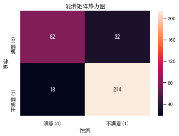

平衡样本类别权重

```python
# 模型构建、拟合并预测，设置类别权重为“balanced” 
clf = LogisticRegression(random_state=10, class_weight ='balanced')
clf.fit(train_x, train_y)
y_pred = clf.predict(test_x)
# 分类正确率
print("分类正确率：",round(clf.score(test_x, test_y),4))
# 输出主要分类指标的文本报告
print(classification_report(test_y, y_pred))
''' 运行结果:
分类正确率：0.8468
	precision	recall	f1-score	support
0	0.73	0.86	0.79	114
1	0.92	0.84	0.88	232
avg/total	0.86	0.85	0.85	346
'''
```

观察并分析结果

*   更多的满意客户被分类正确，但作为代价，不满意客户的分类正确率降低
*   调用属性 coef\_ 和 intercep\_ 可以查看模型系数和截距项

### K近邻

算法流程

1.  确定K的大小和计算相似度（距离）的方法
2.  从训练样本中找到K个与测试样本“最近” 的样本
    *  通过何种方法寻找测试样本的近邻，即如何计算样本之间的距离或相似度？如何选择𝑘的大小才能达到最好的预测效果？
3.  根据这K个训练样本的类别，通过多数投票的方式来确定测试样本的类别

常见距离

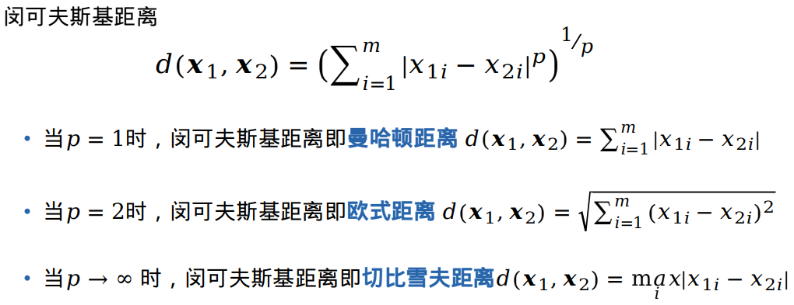

右图中，当K=3和K=6时，样本b会被分到不同的类中

K越小，模型偏差小，方差大
K越大，模型偏差大，方差小

加权K近邻

*   对找出的K个“最近” 样本，每一个样本分配一个权重，使距离较近的样本的权重较大。
*   反函数：权重为距离的倒数，设K个近邻样本的权重为w_1, w_2, …,w_K，与待测样本间的距离为d_1, d_2, …,d_K，则：$w_i=1/d_i+c     i=1,2,…,K$
*   高斯核函数：权重通过高斯核来计算：$w_i=k(x_i,x)=exp⁡{−||x_i −x||^2/2σ^2}$
*   设有M个类别，记K个近邻样本中属于类m的样本集合为$m_j，j=1, 2, …, M$，则待测样本的预测类别为最大的$P_j$所对应的类别：$P_j = \frac{\overset{}{\sum \limits_{m_i \in m_j}} w_i}{\overset{K}{\sum \limits_{i=1}} w_i}$ 

##### KNeighborsClassifier类

| **参数**    | **说明**                                                     |
| ----------- | ------------------------------------------------------------ |
| n_neighbors | 设定K的取值，默认为5                                         |
| weights     | 设置K近邻样本的权重，默认为”uniform”（权重相等），可输入函数自行定义权重 |
| metric      | 定义距离度量方式，默认为”minkowski”（闵可夫斯基距离）        |
| p           | 闵可夫斯基距离的超参数，默认为2（欧式距离）                  |

K近邻分类模型的构建与拟合

```python
class sklearn.neighbors.KNeighborsClassifier(n_neighbors=5, weights='uniform', algorithm='auto', leaf_size=30, p=2, metric='minkowski', metric_params=None, n_jobs=None, **kwargs)

from sklearn.neighbors import KNeighborsClassifier

# 模型构建与拟合
neigh = KNeighborsClassifier()
neigh.fit(train_x, train_y)

```

不同K值对分类正确率的影响

```python
# 计算不同K值下的分类正确率
K_scores = [KNeighborsClassifier(n_neighbors=k).fit(train_x,train_y)
           .score(test_x, test_y) for k in range(1,10)]

# 绘制折线图	
import matplotlib.pyplot as plt
plt.plot(range(1, 10), K_scores, 'r-.', linewidth=3)
plt.xlabel('K')
plt.ylabel('正确率')
plt.title('不同K值下模型预测正确率')
```

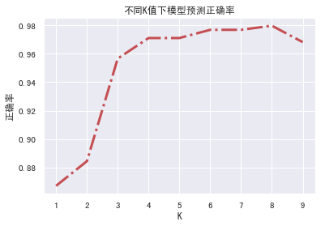

加权K近邻

```python
# 距离加权下不同K值对分类正确率的影响
K_scores_weights = [KNeighborsClassifier(n_neighbors=k,weights='distance').fit(train_x, train_y).score(test_x, test_y) for k in range(1,10)]	
# 按距离的倒数分配权重
```


### 决策树

决策树模型可以由树形结构表示，由根结点、内结点和叶结点组成，也可以基于贪婪算法对特征空间进行垂直划分。

常见的决策树模型

| 模型 | 可处理的特征类型 | 不纯度度量方式 | 分割后子结点数量 | 目标特征类型   |
| ---- | ---------------- | -------------- | ---------------- | -------------- |
| ID3  | 离散型           | 信息增益       | 大于等于2        | 离散型         |
| C4.5 | 离散型、连续型   | 信息增益率     | 大于等于2        | 离散型         |
| CART | 离散型、连续型   | Gini系数       | 等于2            | 离散型、连续型 |

决策树的剪枝

训练过程中，决策树完全生长，很容易造成过拟合，需要进行剪枝提高泛化能力，剪枝分为预剪枝和后剪枝

*   预剪枝：在决策树生成过程中，每个结点在划分前先进行评价，若当前结点划分不能带来泛化能力的提升，则停止划分并将当前结点记为叶结点。
*   后剪枝：在决策树生成后，自底向上对叶结点进行考察，若该结点对应的子树替换为叶结点可以提高决策树的泛化能力，则将该子树替换为叶结点。

决策树模型的特征重要性

根据Gini系数的减小量计算特征重要性：设有X_1，X_2，……，X_d共d个特征，第j个特征X_j在决策树中出现的结点集合为M，则X_j的重要性为：
$$
VIM_j = \sum \limits_{m \in M} VIM_{jm} \\
VIM_{jm} = Gini_m - Gini_j - Gini_r
$$
其中Gini_l和Gini_r是结点m分裂后左右结点的Gini系数，最后做归一化处理即可得到X_j的重要性评分 $VIM_j = \frac{VIM_j}{\overset{d}{\sum \limits_{c=1}} VIM_c}$ 。

##### DecisionTreeClassifier类

| **参数**           | **说明**                                                     |
| ------------------ | ------------------------------------------------------------ |
| criterion          | 结点不纯度的度量方法，默认为“gini”（CART），可设置为“entropy” |
| max_depth          | 设置树生长的最大深度，默认为“None”（不限制）                 |
| min_samples_split  | 内结点分裂所需的最小样本数，默认为2                          |
| min_samples_leaf   | 叶结点所需的最小样本数，默认为1                              |
| max_features       | 寻找最优分裂时所考虑的特征个数，默认为“None”（所有特征）     |
| min_impurity_split | 树停止生长的阈值，即当前结点的不纯度超过阈值时进行分裂，否则变为叶结点 |
| class_weight       | 设置各个类别的权重，默认为“None”（权重一致）                 |

决策树模型的建立和训练

```python
class sklearn.tree.DecisionTreeClassifier(criterion='gini', splitter='best', max_depth=None, min_samples_split=2, min_samples_leaf=1, min_weight_fraction_leaf=0.0, max_features=None, random_state=None, max_leaf_nodes=None, min_impurity_decrease=0.0, min_impurity_split=None, class_weight=None, presort='deprecated', ccp_alpha=0.0)

from sklearn.tree import DecisionTreeClassifier

# 模型建立与训练
DF_model = DecisionTreeClassifier(random_state=10)
DF_model.fit(train_x, train_y)	
```

特征重要性

```python
# 训练模型后，调用属性feature_importances_可以查看各特征的重要性
pd.Series(DF_model.feature_importances_, index=train_x.columns)
 .sort_values().plot(kind='barh', title='特征重要性')	
```

不同树深度下模型的分类正确率

```python
# 限制树深度对分类正确率的影响
depth_grid = [1, 3, 5, 7, 9, None]
depth_scores = [DecisionTreeClassifier(random_state=10, max_depth=item).fit(train_x, train_y).score(test_x, test_y) for item in depth_grid]	
# 绘制图片如下
```

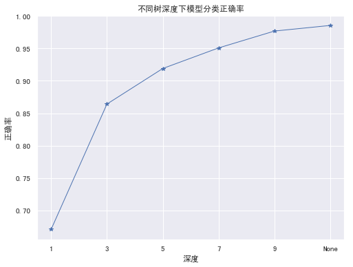

决策树模型可视化

```python
## 导入必要库
from sklearn.tree import export_graphviz
from sklearn.externals.six import StringIO
from IPython.display import Image 
import pydotplus

## 输出图片到dot文件
export_graphviz(DF_model_3, out_file='tree.dot', feature_names=train_x.columns,rounded=True, filled=True,class_names=['acc', 'unacc'])

## 使用dot文件构造图
graph= pydotplus.graph_from_dot_file('tree.dot')
Image(graph.create_png())	
# 每个结点中显示下列信息：特征划分条件、基尼系数的值、总样本量、每个类别的样本量
```

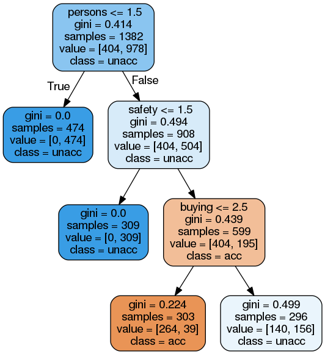


### 朴素贝叶斯

朴素贝叶斯算法是基于贝叶斯定理和特征条件独立性假设的分类方法

*   设特征向量X={X_1,X_2,…, X_d}是d维随机向量，类标签Y∈{1,2,…,c}：
    1.   先验概率 $P(Y=k)，k=1, 2,…,c$
    2.   类条件概率 $P(X│Y=k)=P(X_1,…,X_d│Y=k)=P(X_1│Y=k)P(X_2│Y=k)⋯P(X_d│Y=k)，k=1,2,…,c $  
    3.   后验概率 $P(Y=k|X)=\frac{P(X|Y=k)∙P(Y=k)}{P(X)}$ 
    4.   极大化后验概率 $arg\max \limits_{k}P(Y=k|X) = arg \max \limits_{k}{P(X│Y=k)P(Y=k)}$

拉普拉斯平滑

*   为避免其他属性携带的信息被训练集中未出现的属性值“抹去”，在估计概率值时通常要进行“平滑”（smoothing）
    1.   设$\alpha$为拉普拉斯修正系数（常设为1），先验概率P(Y=k)的估计修正为
        $P(Y=k)=\frac{\overset{n}{\sum \limits_{i=1}}I(y_i=k)+\alpha}{n+\alpha c},k=1,2,⋯,c$ 
    2.   设$X_j \in {1,2,…, s,…,m}$, 类条件概率$P(X_j = s|Y=k)$的估计修正为$P(X_j=s│Y=k)=\frac{\overset{n}{\sum \limits_{i=1}}I(X_j=s,y_i=k)+\alpha}{\overset{n}{\sum \limits_{i=1}}I(y_i=k)+\alpha m}$

连续型特征的处理

当特征为连续型时，有以下两种处理方法：

*   可以将连续特征离散化，人为设定分组区间，离散化后可利用之前的方法估计类条件概率
*   假定连续变量服从某种分布，由分布的概率密度来估计类条件概率
    *   通常假定连续型特征服从高斯分布，参数μ和σ^2的值分别由这个特征的均值和方差计算得到；对于某类Y=k，特征X_j=s时类条件概率的估计为：$P(X_j=s│Y=k)=1/\sqrt{2πσ}^{e^(s−μ)^2/2σ^2}$

##### naive_bayes模块

| **类**          | 名称             | 说明                                                         |
| --------------- | ---------------- | ------------------------------------------------------------ |
| GaussianNB()    | 高斯朴素贝叶斯   | 主要面对输入为连续型的情况，通过假设高斯分布计算类条件概率   |
| BernoulliNB()   | 伯努利朴素贝叶斯 | 主要面对输入为离散型的情况，将特征二值化，例如一个词在文本中是否出现（1为是，0为否） |
| MultinomialNB() | 多项式朴素贝叶斯 | 主要面对输入为离散型的情况，例如一个词在不同文档中出现的次数 |

参数列表及说明

##### BernoulliNB类和MultinomialNB类：

| **参数**                | **说明**                                                     |
| ----------------------- | ------------------------------------------------------------ |
| alpha                   | 添加拉普拉斯平滑系数，默认为1.0                              |
| binarize（BernoulliNB） | 二值化的阈值，默认为0.0                                      |
| fit_prior               | 是否学习先验概率，默认为True，若为False，则所有类别先验概率一致 |
| class_prior             | 自行设定类别先验概率，默认为None（学习先验概率）             |

##### GaussianNB类

| **参数** | **说明**                                         |
| -------- | ------------------------------------------------ |
| priors   | 自行设定类别先验概率，默认为None（学习先验概率） |

构建高斯朴素贝叶斯模型

```python
# 所有特征虽为离散型，但存在次序关系，可以作为连续型来处理，首先建立高斯朴素贝叶斯模型。
## 载入算法类
from sklearn.naive_bayes import GaussianNB

# 模型构建与训练
GNB= GaussianNB()
GNB.fit(train_x, train_y)

# 训练模型后，调用属性class_prior_可以查看先验概率
# 调用属性theta_和sigma_可以查看每个类别下各特征的均值和方差
```

属性的查看

训练模型后，MultinomialNB和BernoulliNB类可以查看下列属性：

| **属性**          | **说明**                         |
| ----------------- | -------------------------------- |
| class_log_prior_  | 每个类别的对数平滑先验概率       |
| feature_log_prob_ | 不同类别下各特征的对数类条件概率 |
| class_count_      | 不同类别下样本的个数             |
| feature_count_    | 不同类别下特征取值的加和         |


### 支持向量机

[第四章 56页]([第四章]分类模型.pptx)


##### LinearSVC类

| **参数**     | **说明**                                                    |
| ------------ | ----------------------------------------------------------- |
| penalty      | 指定优化时使用的范数类型，默认为”l2”，可设置为”l1”          |
| loss         | 指定优化时的损失函数，默认为”squared_hinge”（平方合页损失） |
| C            | 设置惩罚系数，默认为1.0                                     |
| multi_class  | 处理多分类问题的策略，默认为”ovr”（一对多）                 |
| class_weight | 设置不同类别的分类权重                                      |

##### SVC类

| **参数**     | **说明**                                                     |
| ------------ | ------------------------------------------------------------ |
| C            | 设置惩罚系数，默认为1.0                                      |
| kernel       | 核函数的选择，默认为”rbf”（高斯核）还可选择：”linear”（线性核）”poly”（多项式核）”sigmoid”（Sigmoid核） |
| degree       | 设置多项式核中的次数，默认为3，选其它核会被忽略              |
| gamma        | 设置高斯核、多项式核和Sigmoid核中的参数，默认为”auto”，即特征数的倒数 |
| probability  | 是否采用预测概率来估计，默认为False                          |
| class_weight | 设置不同类别的分类权重                                       |

构建线性支持向量机模型

```python
class sklearn.svm.LinearSVC(penalty='l2', loss='squared_hinge', dual=True, tol=0.0001, C=1.0, multi_class='ovr', fit_intercept=True, intercept_scaling=1, class_weight=None, verbose=0, random_state=None, max_iter=1000)

# 载入算法类
from sklearn.svm import LinearSVC

# 模型构建与拟合
lsvm = LinearSVC()
lsvm.fit(train_x, train_y)	
```

不同惩罚系数下模型分类正确率

```python
# 调整惩罚系数的取值
C_grid = [0.01, 0.1, 0.5, 1, 2, 5, 10]
C_scores = [LinearSVC(C=c, random_state=10).fit(train_x, train_y).score(test_x, test_y) for c in C_grid]
# C越大，对错误的容忍程度就越小，分类正确率会降低
# 训练模型后，调用属性 coef_ 和 intercept_ 可以查看模型系数和截距项
```

构建非线性支持向量机模型

```python
class sklearn.svm.SVC(*, C=1.0, kernel='rbf', degree=3, gamma='scale', coef0=0.0, shrinking=True, probability=False, tol=0.001, cache_size=200, class_weight=None, verbose=False, max_iter=-1, decision_function_shape='ovr', break_ties=False, random_state=None)

# 载入算法类
from sklearn.svm import SVC

# 模型构建与拟合
ksvm = SVC(random_state=10)
ksvm.fit(train_x, train_y)	
```

调整核函数与核函数的参数

```python
# 调整核函数
kernel_grid = ['poly','sigmoid']
kernel_scores = [SVC(kernel=k, random_state=10).fit(train_x, train_y).score(test_x, test_y) for k in kernel_grid]

# 调整径向基核函数中窗宽参数的取值
gamma_grid = [0.001, 0.1, 0.5, 1, 2, 5, 10]
gamma_scores = [SVC(gamma=g, random_state=10)
           .fit(train_x, train_y)
           .score(test_x, test_y) 
           for g in gamma_grid]
# 训练模型后，调用属性 support_vectors_ 可以查看所有的支持向量
```


## **聚类模型**

### 聚类问题和cluster模块介绍

“物以类聚，人以群分”，将数据集中相似的样本分到一组，每个组称为一个簇(cluster)，相同簇的样本之间相似度较高，不同簇的样本之间相似度较低。样本之间的相似度通常是通过距离定义的，距离越远，相似度越低。

应用：根据全球各地观测到的气候特征，将全球划分为不同的气候区域；根据客户的购物记录将客户分成不同的消费群体。

常见的聚类模型

*   K-Means
*   层次聚类
*   DBSCAN

Scikit-learn聚类模块cluster的主要类

| **类**                          | **说明**     |
| ------------------------------- | ------------ |
| cluster.KMeans                  | K-Means聚类  |
| cluster.AgglomerativeClustering | 层次聚类     |
| cluster.DBSCAN                  | DBSCAN聚类   |
| cluster.MeanShift               | 均值漂移聚类 |
| cluster.SpectralClustering      | 谱聚类       |


#### K-Means聚类

算法原理

1.  K-Means的目标是要将样本点划分为 K 个簇，找到每个簇的质心 $u_k (1≤k≤K)$ ，并且最小化所有样本点到所属簇质心距离的平方和 $J=\overset{n}{\sum \limits_{i=1}}\overset{K}{\sum \limits_{k=1}} r_{ik}||x_i-u_k||^2$ 
2.  其中 $r_{ik} \in \{0,1\}$，若样本 $x_i$ 被划分到簇 k中，那么$r_{ik}=1$，对于j≠k，有 r_ij=0，即$\overset{K}{\sum \limits_{k=1}}r_{ik}=1$   

K-Means算法流程

1.  设置初始质心
2.  Repeat：
    将每个样本指派到最近的质心
    用每个簇的样本均值来更新质心

3.  直到目标函数变化程度小于预设的阈值，  或迭代次数大于预设的最大迭代次数，停止迭代

初始质心的选择

*   人工给出初始质心
*   随机选择初始质心
    该方法容易陷进局部最优解，不容易得到最优的聚类结果
*   改进上述情况可采取下列方案：
    多次运行K-Means算法，每次随机选择不同的初始质心，从这些结果中选择最优（目标函数最小）的聚类结果
    使用K-Means++算法来初始化质心，主要思路是选择的初始质心尽可能的互相远离

##### KMeans类

| **参数**     | **说明**                                                     |
| ------------ | ------------------------------------------------------------ |
| n_clusters   | 希望分成的簇数，默认为8                                      |
| init         | 设置初始质心的方法{‘k-means++’（默认），‘random’或ndarray（自行设定） |
| tol          | 目标函数变化程度的阈值，小于阈值则停止迭代，默认为1e-4       |
| max_iter     | 最大迭代次数阈值，大于阈值则停止迭代，默认为300              |
| n_init       | 随机使用不同质心来运行k-means算法的次数，默认为10            |
| random_state | 设置随机种子                                                 |

构建K-Means聚类模型

```python
class sklearn.cluster.KMeans(n_clusters=8, init=’k-means++’, n_init=10, max_iter=300, tol=0.0001, precompute_distances=’auto’, verbose=0, random_state=None, copy_x=True, n_jobs=1, algorithm=’auto’)

from sklearn.cluster import KMeans
# 训练模型
model = KMeans(n_clusters=3,random_state=111).fit(auto_scaled)
# 每个样本的标签
auto_label = model.labels_
# 每个簇的质心
auto_cluster = model.cluster_centers_

```

**评估模型的性能**

可以使用许多方法来评估聚类的性能，这里采用轮廓系数（Silhouette Coefficient）来评估

对于每个样本，轮廓系数需要计算两个值a, b ：
a :这个样本和同簇内其它样本间的平均距离
b :这个样本和距离第二近的簇内所有样本间的平均距离
单个样本的轮廓系数计算如下：$s= \frac{b−a}{max⁡(a,b)}$
所有样本的轮廓系数则由每个样本的轮廓系数求平均得到

轮廓系数取值在-1到1之间，越接近1说明聚类效果越好

```python
from sklearn import metrics
labels = model.labels_

print("轮廓系数(Silhouette Coefficient): %0.4f"
      % metrics.silhouette_score(auto_scaled, labels))
'''
轮廓系数(Silhouette Coefficient): 0.3183
'''
```


#### MeanShift聚类

主要思想是认为一个簇的质心应该在簇内点最密集的地方，寻找质心的方法是随机选择一个点(seed)，从这个点开始不断的将这个点更新为这个点邻域内点的均值，这样，这个点就会不断的向高密度区域移动，直至到达最密集处

MeanShift算法原理

1.  上述过程是从多个起始点(seed)开始的，如果几个不同的起始点经过移动最终聚集在一起，则认为他们找了同一个簇的质心，将他们合并；
2.  进一步，在更新seed点的过程中，求均值时考虑临近点与当前seed点的距离，使用高斯核函数进行加权平均，即距离越近的点权重越大；
3.  高斯核需要输入一个参数bandwidth（窗宽），用来控制seed点邻域范围的大小。（由于正态分布的3σ准则（将bandwidth作为σ），出于计算上的考虑，将和seed距离超过三倍的bandwidth的点cut off，相当于用窗宽参数bandwidth可以控制邻域的大小）

选择起始点（seed）时，出于计算上的考虑，通常不使用全部样本点作为seed，而是根据窗宽bandwidth作为网格间隔，选择起始点。
选好簇质心后，将样本点分到最近的簇

##### MeanShift类

| **参数**    | **功能**                           |
| ----------- | ---------------------------------- |
| bandwidth   | 设置窗宽                           |
| seeds       | 设置起始点                         |
| bin_seeding | 是否选择全部样本点作为起始点       |
| cluster_all | 是否对全部样本进行聚类，默认为True |

构建MeanShift模型

```python
class sklearn.cluster.MeanShift(bandwidth=None, seeds=None, bin_seeding=False, min_bin_freq=1, cluster_all=True, n_jobs=None, max_iter=300)

from sklearn.cluster import MeanShift
#拟合模型
model = MeanShift(bandwidth=2).fit(auto_scaled)
#每个样本的标签
auto_label = model.labels_
#每个簇的质心
auto_cluster = model.cluster_centers_

# 评估模型的性能

# 样本的类别标签
labels = model.labels_
print("轮廓系数(Silhouette Coefficient): %0.4f"
      % metrics.silhouette_score(df_trainx_new, labels))
'''
轮廓系数(Silhouette Coefficient):  0.2487
'''
```

不同窗宽下簇的个数和轮廓系数

```python
# 不同窗宽下簇的个数和轮廓系数
bandwidth_grid = np.arange(1, 2.5, 0.2)
cluster_number = []
slt_score = []

for i in bandwidth_grid:
    model = MeanShift(bandwidth=i).fit(auto_scaled)
    cluster_number.append(len(np.unique(model.labels_)))
    slt_score.append(round(metrics.silhouette_score(auto_scaled, model.labels_), 4))
''' 举例
窗宽	簇的个数	轮廓系数	窗宽	簇的个数	轮廓系数
1.0	141	0.3628	1.8	13	0.1567
1.2	118	0.3437	2.0	6	0.2487
1.4	108	0.3404	2.2	2	0.3705
1.6	22	0.1363	2.4	2	0.3710
'''
# 随着窗宽的增加，簇的个数在不断降低
```

#### 层次聚类

层次聚类(hierarchical clustering)有两种常用的形式，自顶向下和自底向上
其中，自底向上的主要做法是，在开始时，将每个样本视为一个簇，重复的合并最近的两个簇，直到簇的个数达到给定值
谱系图可以用来描述簇合并的过程

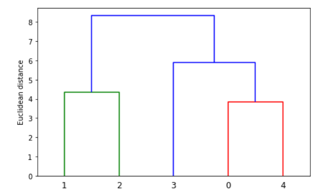

簇间距离的计算

当一个簇内样本数多于一个时，常用的度量簇间距离的方式如下：
complete（完整连接法）：两簇之间最远的样本之间的距离
average（平均连接法）： 两簇间所有样本对的距离的平均值
single（单连接法）：两簇之间最近的样本之间的距离
ward（离差平方和法）：两簇的离差平方和之和（合并后的n*方差增量最小）

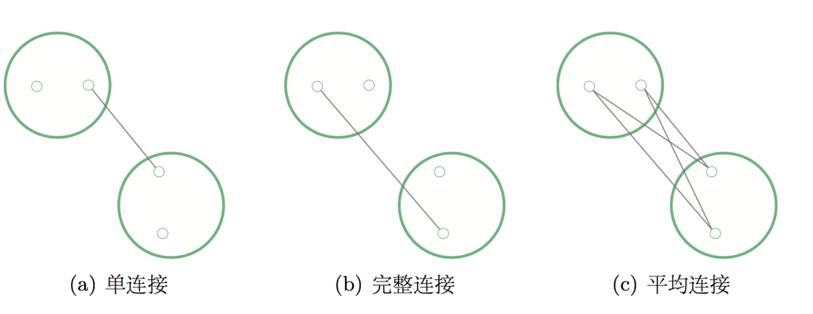

##### AgglomerativeClustering类

| **参数**   | **说明**                                                     |
| ---------- | ------------------------------------------------------------ |
| n_clusters | 希望分成的簇数，默认为2                                      |
| affinity   | 样本间的距离计算方式，默认为“euclidean”（欧式距离），还可选择“manhattan”（绝对值距离）、“cosine”（余弦相似度） |
| linkage    | 簇间的距离计算方式，默认为“ward”（离差平方和），还可选择“single”（单连接）、“complete”（完全连接）和“average”（平均连接） |

https://sklearn.org/modules/generated/sklearn.cluster.AgglomerativeClustering.html

构建层次聚类模型

```python
class sklearn.cluster.AgglomerativeClustering(n_clusters=2, affinity=’euclidean’, memory=None, connectivity=None, compute_full_tree=’auto’, linkage=’ward’, pooling_func=<function mean>)

from sklearn.cluster import AgglomerativeClustering
# 训练模型
model = AgglomerativeClustering(n_clusters=3,linkage=‘average’).fit(auto_scaled)
# 输出模型结果  
auto_label = model.labels_

# 绘制谱系图
from scipy.spatial.distance import pdist
from scipy.cluster.hierarchy import linkage, dendrogram
import matplotlib.pyplot as plt
plt.rcParams['font.sans-serif'] = ['SimHei']

#利用scipy中pdist,linkage,dendrogram函数绘制谱系图
#pdist函数返回距离矩阵，linkage函数返回一个ndarray对象，描述了簇合并的过程
#dendrogram函数用来绘制谱系图
row_clusters = linkage(pdist(auto_scaled,metric='euclidean'),method='ward')
fig = plt.figure(figsize=(12,10))
#参数p和参数truncate_mode用来将谱系图截断，部分结点的子树被剪枝，横轴显示的是该结点包含的样本数
row_dendr = dendrogram(row_clusters, p=50, truncate_mode='lastp',color_threshold=5)
plt.tight_layout()
plt.title('谱系图', fontsize=15)
```

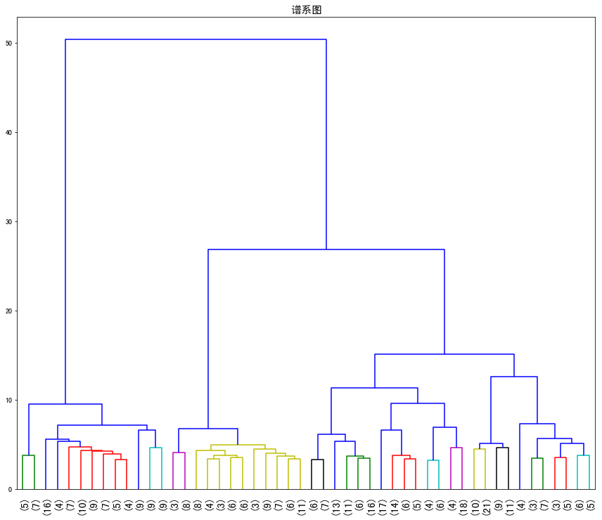

#### DBSCAN

DBSCAN算法思想

1.  DBSCAN主要思想是把样本空间中不同的高密度区域划分为不同簇
2.  对于一个样本点，如果在它的半径为ε的超球体（邻域）内的样本点个数大于N_min，则认为这个样本点在一个高密度区域内，称这个点为核心对象
3.  对于两个都处在高密度区域的样本点，如果他们之间的距离比较接近（即互相在对方的邻域内），则认为它们同属于一个簇

1.直接密度可达(directly density-reachable)。 对于数据集X, 如果样本点xj 在xi 的ε-邻域内, 并且xi为核心对象, 那么对象xj从对象xi直接密度可达;  
2.密度可达(density-reachable)。 给定样本序列p1,p2,⋯,pm, 令xi=p1，xj = pm, 如果样本pi 从p_i−1 直接密度可达, 那么样本xj 从样本xi 密度可达. 注意: 密度可达是单向的, 密度可达即可容纳在同一簇中
3.密度相连(density-connected)。如果存在一个样本p, 使得p 到xi 和xj都是密度可达的, 那么xi和xj 密度相连。

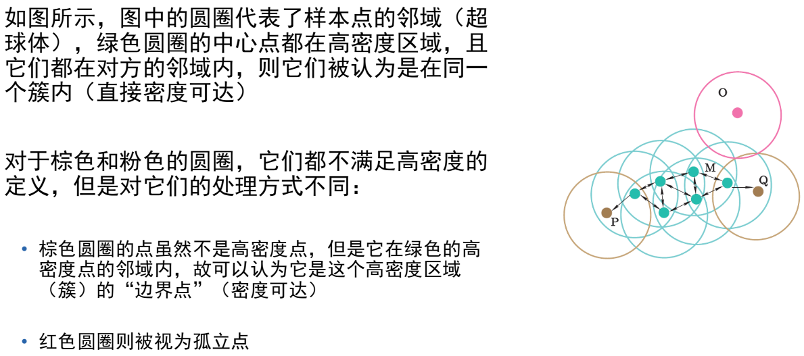

DBSCAN算法流程

1.  从一个点开始，对其半径为ε的邻域内的点赋予同一个簇标记，并寻找邻域内的其它核心对象
2.  对于找到的核心对象，重复步骤1
3.  重复上述过程直到无法找到新的高密度点为止，认为一个簇被完整找出
4.  从未被访问过的点开始，寻找下一个簇，最终没有出现在任何簇内的点被标记为孤立点

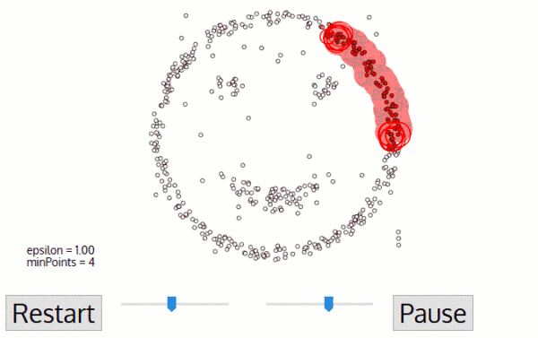

##### DBSCAN类

| **参数**    | **功能**                                            |
| ----------- | --------------------------------------------------- |
| eps         | 邻域的半径，默认为0.5                               |
| min_samples | 确定核心对象的邻域内的最小样本数，默认为5           |
| metric      | 点之间的距离度量方式，默认为“euclidean”（欧式距离） |

构建DBSCAN聚类模型

```python
class sklearn.cluster.DBSCAN(X, eps=0.5, min_samples=5, metric='minkowski', metric_params=None, algorithm='auto', leaf_size=30, p=2, sample_weight=None, n_jobs=None)

from sklearn.cluster import DBSCAN

# 训练模型
model = DBSCAN(eps=1.5,
   min_samples=4).fit(auto_scaled)
# 输出模型结果
auto_label = model.labels_

# 核心对象的索引
model.core_sample_indices_

# 输出核心对象
model.components_
```

评估模型的性能

```python
# 样本的类别标签
labels = model.labels_

# 标签中的簇数，忽略噪声点
n_clusters_ = len(set(labels)) - (1 if -1 in labels else 0)

print('簇数: %d' % n_clusters_)
print("轮廓系数(Silhouette Coefficient): %0.4f"
      % metrics.silhouette_score(auto_scaled, labels))
'''
簇数：3
轮廓系数(Silhouette Coefficient): 0.1476
'''
```

### 总结：

| **算法**  | **优点**                                                     | **缺点**                                                     |
| --------- | ------------------------------------------------------------ | ------------------------------------------------------------ |
| K-Means   | 实现简单，直观，支持多种距离计算方式                         | 需要指定簇数K，且效果依赖于初始质心的选择，容易陷入局部最优。同时不易处理非‘球’状数据，易受离群值影响 |
| MeanShift | 不需要指定簇的个数，可以处理非‘球’状数据                     | 效果依赖于带宽的选择                                         |
| 层次聚类  | 能产生不同层级的聚类结果，更加灵活                           | 空间和时间复杂度要高于K-Means聚类                            |
| DBSCAN    | 不需要指定簇的个数，可以找出任何形状的簇，能有效分辨噪音样本 | 对参数*𝑒𝑝𝑠*和min*⁡_**𝑠𝑎𝑚𝑝𝑙𝑒𝑠*的设置很敏感                     |

## **模型优化与参数优化**

### 模型评价指标与metrics模块

```python
# 模型构建与模型评估
from sklearn.linear_model import LogisticRegression
# 模型构建、拟合并预测，设置类别权重为“balanced” 
clf = LogisticRegression(random_state=10, class_weight ='balanced')
clf.fit(train_x, train_y)
y_pred = clf.predict(test_x)
# 分类正确率
print("分类正确率：",round(clf.score(test_x, test_y),4))
'''
分类正确率：0.8468
'''
```

**思考：在sklearn中除了.score方法，还有哪些方法可以评估模型呢？**


#### 分类指标

| **函数**                       | **说明**                                            |
| ------------------------------ | --------------------------------------------------- |
| metrics.accuracy_score         | 计算正确率                                          |
| metrics.f1_score               | 计算 $F_1$ 值                                       |
| metrics.confusion_matrix       | 计算混淆矩阵                                        |
| metrics.classification_report  | 输出分类指标的文本报告                              |
| metrics.recall_score           | 计算召回率                                          |
| metrics.precision_score        | 计算精确率                                          |
| metrics.roc_auc_score          | 给定预测概率和真实标签，直接返回AUC值               |
| metrics.roc_curve              | 给定预测概率和真实标签，返回FPR、TPR和阈值          |
| metrics.auc                    | 给定横纵坐标轴值，如：FPR和TPR，返回AUC值           |
| metrics.precision_recall_curve | 给定预测概率和真实标签，返回precision、recall和阈值 |
| metrics.hinge_loss             | 计算合页损失                                        |
| metrics.log_loss               | 计算对数损失                                        |

##### metrics.accuracy_score ：

| **参数**  | **说明**                                                     |
| --------- | ------------------------------------------------------------ |
| y_true    | 真实标签                                                     |
| y_pred    | 预测标签                                                     |
| normalize | 如果为True（默认），则返回分类正确的比例（正确率），若为False，则返回分类正确的样本数量 |

```python
# metrics.accuracy_score与.score方法结果一致，都可以计算正确率（accuracy）
from sklearn.metrics import accuracy_score

print("分类正确率：",round(accuracy_score(test_y ,y_pred),4))
'''
分类正确率： 0.8468
'''
print("分类正确的样本数量：",round(accuracy_score(test_y ,y_pred, normalize=False),4))
'''
分类正确的样本数量： 293
'''
```

**二分类评价指标**

许多二分类问题中，由于类别分布不平衡，需要借助一些特定的指标来评价模型。

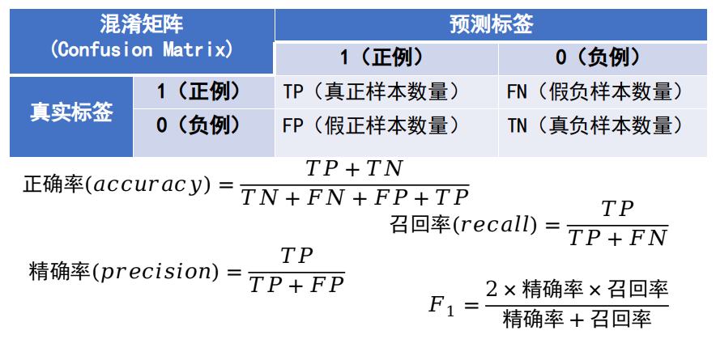

##### **precision、recall和F_1值的参数**

| **参数**  | **说明**                   |
| --------- | -------------------------- |
| y_true    | 真实标签                   |
| y_pred    | 预测标签                   |
| pos_label | 正类的类别标记，默认为1    |
| average   | 一个字符串，用于多分类问题 |


|                   average参数——多分类问题                    |||
| :----------------------------------------------------------: ||:-:|
| 多分类问题可以将数据看成多个二分类问题的集合， 参数average有如下选项：<br />
‘binary’（默认）：二分类问题<br />
‘micro’：先计算各混淆矩阵对应元素的平均值，即(TP) ̅、 (FP) ̅、 (TN) ̅和(FN) ̅，再计算评价指标<br />
‘macro’：先在各混淆矩阵上分别计算出评价指标，再计算其平均值<br />
‘weighted’：在‘macro’基础上考虑类别不平衡问题，加上权重计算评价指标 |||


```python
# precision、recall和F_1值的计算
from sklearn.metrics import precision_score
from sklearn.metrics import recall_score
from sklearn.metrics import f1_score

print("分类精确率：",round(precision_score(test_y ,y_pred),4))
print("分类召回率：",round(recall_score(test_y ,y_pred),4))
print("分类F1值：",round(f1_score(test_y ,y_pred),4))
'''
分类精确率： 0.9242
分类召回率： 0.8405
分类F1值： 0.8804
'''
print("分类F1值：",round(f1_score(test_y ,y_pred, pos_label=0),4))
'''
分类F1值： 0.7871
'''
```

##### metrics.confusion_matrix

| **参数** | **说明**                   |
| -------- | -------------------------- |
| y_true   | 真实标签                   |
| y_pred   | 预测标签                   |
| labels   | 指定混淆矩阵中出现哪些类别 |

```python
# 绘制混淆矩阵的热力图
from sklearn.metrics import confusion_matrix
import seaborn as sns
## 设置正常显示中文
sns.set(font='SimHei')
## 绘制热力图
ax = sns.heatmap(confusion_matrix(test_y, y_pred), 
                 annot=True, fmt='d', 
                 xticklabels=["满意(0)","不满意(1)"],
                 yticklabels=["满意(0)","不满意(1)"])
                     
ax.set_ylabel('真实')
ax.set_xlabel('预测')
ax.set_title('混淆矩阵热力图')
```

##### metrics.classification_report

| **参数**     | **说明**                 |
| ------------ | ------------------------ |
| y_true       | 真实标签                 |
| y_pred       | 预测标签                 |
| labels       | 指定报告中出现哪些类别   |
| target_names | 指定报告中类别显示的名称 |


```python
# 分类指标文本报告
from sklearn.metrics import classification_report
print(classification_report(test_y, y_pred))
'''
	precision	recall	f1-score	support
0	0.73	0.86	0.79	114
1	0.92	0.84	0.88	232
avg/total	0.86	0.85	0.85	346
'''
print(classification_report(test_y, y_pred, labels=[0], target_names=['满意']))
'''
	precision	recall	f1-score	support
满意	0.73	0.86	0.79	114
avg/total	0.73	0.86	0.79	114
'''
```

##### P-R曲线

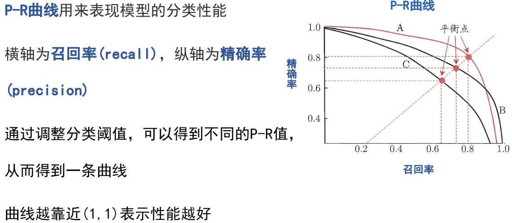

算法对样本进行分类时，都会有置信度，即表示该样本是正样本的概率，比如99%的概率认为样本Ａ是正例，１％的概率认为样本B是正例。通过选择合适的阈值，比如50%，对样本进行划分，概率大于50%的就认为是正例，小于50%的就是负例。
通过置信度就可以对所有样本进行排序，再逐个样本的选择阈值，在该样本之前的都属于正例，该样本之后的都属于负例。每一个样本作为划分阈值时，都可以计算对应的precision和recall，那么就可以以此绘制曲线。

将样本按照预测为正类的概率从大到小进行排列，逐个把样本作为正例进行预测，计算当前的精确率和召回率。

平衡点  (Break-even Point，简称 BEP) 是“查准率=查全率”时的取值，根据图可知，模型A的性能最好。

##### metrics.precision_recall_curve

| **参数**    | **说明**                     |
| ----------- | ---------------------------- |
| y_true      | 真实标签                     |
| probas_pred | 依次指定每个样本为正类的概率 |
| pos_label   | 正类的类别标记               |

```python
# 绘制P-R曲线
import matplotlib.pyplot as plt
from sklearn.metrics import precision_recall_curve

probs = clf.predict_proba(test_x)[:,0]
precision,recall,thresholds = 
precision_recall_curve(test_y,probs,pos_label=0)
#绘制P-R曲线
plt.plot(recall, precision)
plt.title('P-R曲线')
plt.xlabel('召回率')
plt.ylabel('精确率')
plt.show()
'''结果如下图'''
```

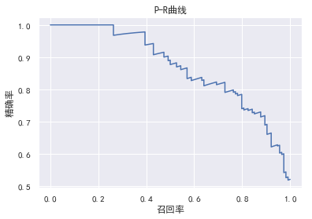

##### ROC曲线与AUC

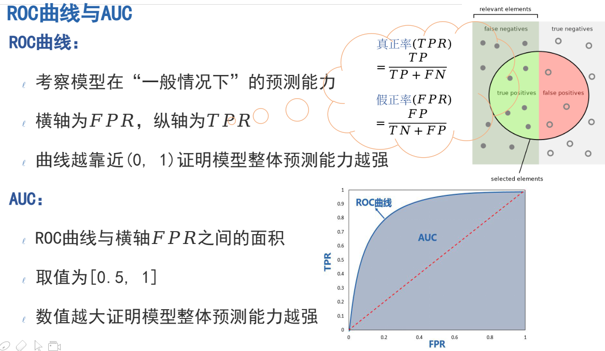

##### ROC曲线

 全称是"受试者工作特征" (Receiver Operating Characteristic)
绘制过程：

1.  首先，将测试集样本的预测概率从大到小排列
2.  然后，将每个预测概率作为分类阈值，计算在此阈值下的一组TPR和FPR
3.  最后，使FPR为横轴， TPR为纵轴，按阈值排列顺序，利用描点法绘制ROC曲线

##### metrics.roc_curve

| **参数**  | **说明**                     |
| --------- | ---------------------------- |
| y_true    | 真实标签                     |
| y_score   | 依次指定每个样本为正类的概率 |
| pos_label | 正类的类别标记               |

```python
#　绘制ROC曲线
from sklearn.metrics import roc_curve

probs = clf.predict_proba(test_x)[:,1]
fpr,tpr,thresholds = roc_curve(test_y,probs)
	# 返回值为一个元组，其元素分别为ROC曲线的FPR序列、TPR序列和阈值序列

plt.plot(fpr, tpr)
plt.xlabel('假正率')
plt.ylabel('真正率')
plt.title('ROC曲线')
plt.show()
'''结果如下图'''
```

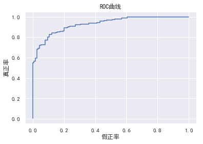

##### AUC曲线

##### metrics.roc_auc_score

| **参数** | **说明**                     |
| -------- | ---------------------------- |
| y_true   | 真实标签                     |
| y_score  | 依次指定每个样本为正类的概率 |
| average  | 一个字符串，用于多分类问题   |

##### metrics.auc

| **参数** | **说明**                |
| -------- | ----------------------- |
| x        | 折线上点的横坐标，如FPR |
| y        | 折线上点的纵坐标，如TPR |

metrics.auc: 通用方法，利用梯形法则计算曲线下的面积(AUC，也可以是其他)。
区别：roc_auc_score 是预测ROC曲线下的 AUC，在计算的时候调用了 AUC。

```python
# 计算AUC值
## 两种方法结果相同，注意输入参数的区别
from sklearn.metrics import roc_auc_score
print(roc_auc_score(test_y,probs))
'''
0.9296355111917726
'''
from sklearn import metrics
print(metrics.auc(fpr,tpr))
'''
0.9296355111917726
'''
```

##### 对数损失函数

对数损失(log loss)，又称逻辑损失(logistic loss)或交叉熵损失(cross-entropy loss），常用于评估分类模型的概率输出

二分类问题对数损失函数公式为：$-\frac{1}{n} \sum (y_i log p_i + (1-y_i)log(1-p_i))$ 

*   真实标签取值为{0，1}
*   y_i为第i个样本的真实类别
*   p_i表示第i个样本类别为1的概率

##### metrics.log_loss

| **参数**  | **说明**                                                     |
| --------- | ------------------------------------------------------------ |
| y_true    | 真实标签                                                     |
| y_pred    | 预测概率                                                     |
| normalize | 默认为True，返回样本对数损失的均值，若为False，返回对数损失的总和 |

```python
# 计算对数损失
from sklearn.metrics import log_loss
print('损失函数:',log_loss(test_y,probs))
'''
损失函数: 0.3549618366673331
'''# 损失函数越小，模型就越好
print('损失函数的总和:',log_loss(test_y,probs,normalize=False))
'''
损失函数的总和: 122.81679548689726
'''

```

##### 合页损失函数

合页损失（hinge loss）常被用于最大间隔算法作为SVM的损失函数

标签值y=±1，预测值 $\hat{y} \in R$ ，公式为：$ℎinge(z)=max⁡\{0, 1−z\}， z=y \times \hat{y}$ 

##### metrics.hinge_loss

| **参数**      | **说明**                             |
| ------------- | ------------------------------------ |
| y_true        | 真实标签                             |
| pred_decision | 使用decision_function 方法的预测结果 |

```python
# 计算合页损失
from sklearn.svm import SVC
from sklearn.metrics import hinge_loss
# SVM模型构建与拟合 # 构建非线性支持向量机模型
ksvm = SVC(random_state=10)
ksvm.fit(train_x, train_y)
# 计算合页损失
pred_decision = ksvm.decision_function(test_x)
print('合页损失：',hinge_loss(test_y,pred_decision))
'''
合页损失： 0.10316668105886984
''' 

```


#### 回归指标

```python
# 构建线性回归模型
from sklearn.linear_model import LinearRegression
from sklearn import metrics
lr = LinearRegression()
lr.fit(train_x, train_y)
## LinearRegression(copy_X=True, fit_intercept=True, n_jobs=1, normalize=False)
```

**思考：如何评价回归模型？**

| **方法**                       | **说明**       |
| ------------------------------ | -------------- |
| metrics.mean_absolute_error    | 平均绝对误差   |
| metrics.mean_squared_error     | 均方误差       |
| metrics.mean_squared_log_error | 均方对数误差   |
| metrics.median_absolute_error  | 中值绝对误差   |
| metrics.r2_score               | 决定系数 $R^2$ |


总平方和(sum of squares for total)：SST
残差平方和(sum of squares for error)：SSE
回归平方和(sum of squares for regression)：SSR

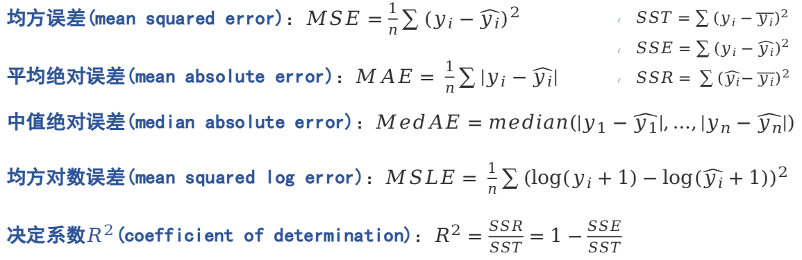

##### 回归指标的通用参数

| **参数** | **说明** |
| -------- | -------- |
| y_true   | 真实值   |
| y_pred   | 预测值   |

```python
# 计算回归指标
from sklearn.metrics import mean_squared_error
from sklearn.metrics import mean_absolute_error
from sklearn.metrics import median_absolute_error
from sklearn.metrics import r2_score

#回归效果评估
pred_y = lr.predict(test_x)
pred_y_train = lr.predict(train_x)

print("训练集的均方误差: ", round(mean_squared_error(train_y, pred_y_train),3))
print("训练集的平均绝对误差: ", round(mean_absolute_error(train_y, pred_y_train),3))
print("训练集的中值绝对误差: ", round(median_absolute_error(train_y, pred_y_train),3))
print("训练集的决定系数: ", round(metrics.r2_score(train_y, pred_y_train),3))
print("-"*30)
print("测试集的均方误差: ", round(mean_squared_error(test_y, pred_y),3))
print("测试集的平均绝对误差: ", round(mean_absolute_error(test_y, pred_y),3))
print("测试集的中值绝对误差: ", round(median_absolute_error(test_y, pred_y),3))
print("测试集的决定系数: ", round(metrics.r2_score(test_y, pred_y_test),3))
'''
训练集的均方误差:  37360229.973
训练集的平均绝对误差:  4228.405
训练集的中值绝对误差:  2583.366
训练集的决定系数:  0.751
------------------------------
测试集的均方误差:  34655210.533
测试集的平均绝对误差:  4207.363
测试集的中值绝对误差:  2648.645
测试集的决定系数:  0.75
''' # 模型在测试集上的性能得分与在训练集上的表现相差不大


```


#### 聚类分析指标

```python
# 构建KMeans聚类模型
from sklearn.cluster import KMeans
# 训练模型
model = KMeans(n_clusters=3,random_state=111).fit(auto_scaled)
```

| **方法**                    | **说明**     |
| --------------------------- | ------------ |
| metrics.silhouette_score    | 轮廓系数     |
| metrics.adjusted_rand_score | 调整兰德系数 |

##### 轮廓系数

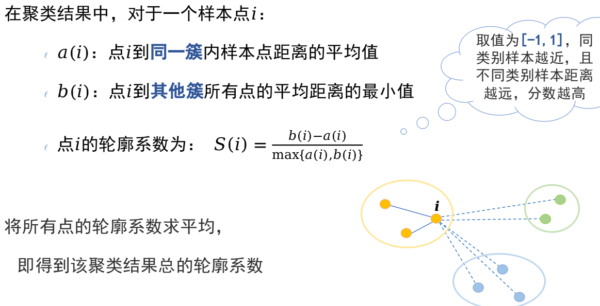

##### metrics.silhouette_score

| **参数**     | **说明**                                                     |
| ------------ | ------------------------------------------------------------ |
| X            | 特征数组，或当metric=‘precomputed’时，X为样本间距离的数组    |
| labels       | 预测标签                                                     |
| metric       | 计算距离的指标，常用方法有：‘euclidean’（默认）和‘manhattan’等 |
| random_state | 选取子集时设置的随机种子                                     |

```python
# 计算不同k值的轮廓系数
# 选择不同k值比较聚类效果
for i in np.arange(2,7):
    model = KMeans(n_clusters=i,random_state=111).fit(auto_scaled)   
    labels = model.labels_
    print('轮廓系数(k=%d):'%(i),round(silhouette_score(auto_scaled,labels),3))
'''
轮廓系数(k=2): 0.415
轮廓系数(k=3): 0.318
轮廓系数(k=4): 0.254
轮廓系数(k=5): 0.25
轮廓系数(k=6): 0.201
'''
## 轮廓系数的缺点
## 轮廓系数计算一个簇的紧致度，其值越大越好，但在形状复杂的数据上效果并不理想
```

##### 兰德指数（rand index）

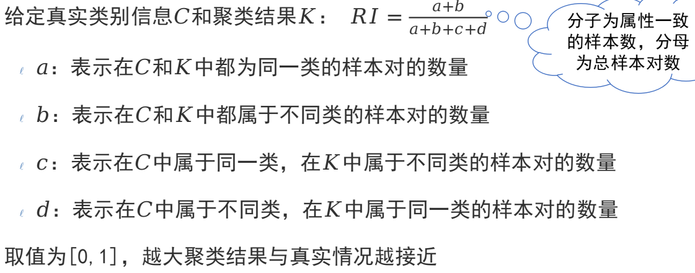

调整兰德指数（adjusted rand index）

兰德指数的缺点：在聚类结果随机产生的情况下，不能保证系数接近于0

调整兰德指数（adjusted rand index）：$ARI=\frac{RI−E(RI)}{max(RI)−E(RI)}$

ARI取值范围为[-1,1]，负数代表结果不好，越接近于1越好

##### metrics.adjusted_rand_score

| **参数**    | **说明** |
| ----------- | -------- |
| labels_true | 真实标签 |
| labels_pred | 预测标签 |

##### 评估KMeans和DBSCAN模型

```python
# 使用sklearn.datasets里的make_moons函数生成半环形图数据，并进行标准化
from sklearn.datasets import make_moons
from sklearn.cluster import DBSCAN
from sklearn.metrics.cluster import adjusted_rand_score 
# 生成随机数据
X, y = make_moons(n_samples=200, noise=0.06, random_state=1)
# 将数据缩放成平均值为0、方差为1 
scaler = StandardScaler() 
scaler.fit(X)
X_scaled = scaler.transform(X)

## 计算调整兰德指数
# 绘制簇分配结果图形
fig, axes = plt.subplots(1,2,figsize=(7, 3),subplot_kw={'xticks':(),'yticks':()}) 
# 列出要使用的算法
algorithms = [KMeans(n_clusters=2),DBSCAN()]
for ax, algorithm in zip(axes,algorithms): 
    clusters = algorithm.fit_predict(X_scaled) 
    ax.scatter(X_scaled[:, 0],X_scaled[:, 1],c=clusters,cmap='Set3',s=20)
    ax.set_title("{} - ARI: {:.2f}".format(algorithm.__class__.__name__,adjusted_rand_score(y,clusters))) # 注意：兰德指数传入的是真实标签


```


### 模型选择与model_selection模块

##### 数据集划分

model_selection.train_test_split函数将数据集切分成训练集和测试集两类

| **参数**     | **说明**         |
| ------------ | ---------------- |
| *array       | 一个或多个数据集 |
| test_size    | 指定测试集的大小 |
| train_size   | 指定训练集的大小 |
| random_state | 随机种子         |

```python
# 测试集比例为20%
## 数据集划分
from sklearn.model_selection import train_test_split

X = data.drop(['car_acceptability'], axis=1)
y = data['car_acceptability']
train_x, test_x, train_y, test_y = train_test_split(X, y, test_size = 0.2, random_state = 10)
# 也可将train_size参数设为0.8
```


#### 交叉验证


##### 数据分类器

| **类**                          | **说明**           |
| ------------------------------- | ------------------ |
| model_selection.KFold           | k折交叉分类器      |
| model_selection.StratifiedKFold | 分层k折交叉分类器  |
| model_selection.ShuffleSplit    | 打乱数据集后再划分 |

##### Kfold与StratifiedKFold

| **参数**     | **说明**                         |
| ------------ | -------------------------------- |
| n_splits     | k折数，最小为2                   |
| shuffle      | 布尔值，设置在划分前是否打乱数据 |
| random_state | 随机种子                         |

| **方法**     | **说明**                   |
| ------------ | -------------------------- |
| get_n_splits | 返回划分迭代次数，即k折数  |
| split        | 划分数据集为训练集和测试集 |

```python
# 可视化划分结果
## 对比Kfold与StratifiedKFold分类器的划分结果，各划分3折，观察不同方法的比例：
from sklearn.model_selection import KFold
from sklearn.model_selection import StratifiedKFold

kf = KFold(n_splits=3,random_state=0)
skf = StratifiedKFold(n_splits=3,random_state=0)
kf.split(X,y)
skf.split(X,y)
```

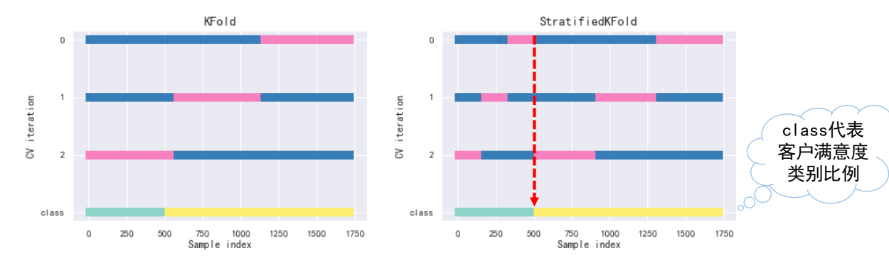

```python
# 设置shuffle参数
## 参数shuffle=True表示将数据集打乱后再划分，效果如下图所示：
```

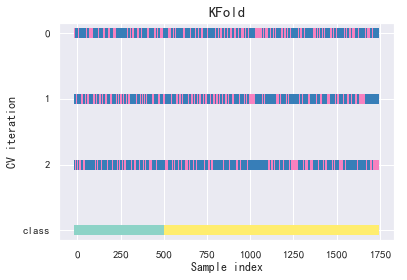

##### model_selection.ShuffleSplit

| **参数**     | **说明**                               |
| ------------ | -------------------------------------- |
| n_splits     | 划分迭代次数                           |
| test_size    | 测试集比例（浮点数）或样本数量（整数） |
| train_size   | 训练集比例（浮点数）或样本数量（整数） |
| random_state | 随机种子                               |

| **方法**     | **说明**                   |
| ------------ | -------------------------- |
| get_n_splits | 返回划分迭代次数           |
| split        | 划分数据集为训练集和测试集 |

```python
# 使用ShuffleSplit也会将数据打乱后再划分，且可以设置训练集和测试集的大小，与交叉验证区别的是：随机划分不能保证每折都不相同
from sklearn.model_selection import ShuffleSplit
rs = ShuffleSplit(n_splits=3, test_size=.2, random_state=0)
rs.split(X,y)
rs.get_n_splits()
'''
3
'''
```

##### 模型验证

| **函数**                          | **说明**                 |
| --------------------------------- | ------------------------ |
| model_selection.cross_val_score   | 根据交叉验证计算模型分数 |
| model_selection.cross_val_predict | 根据交叉验证得出预测值   |
| model_selection.learning_curve    | 学习曲线                 |

##### model_selection.cross_val_score

| **参数**  | **说明**                                                     |
| --------- | ------------------------------------------------------------ |
| estimator | 指定的模型                                                   |
| X         | 数据集中的样本集                                             |
| y         | 真实标签                                                     |
| scoring   | 指定评价指标的字符串，默认采用.score方法，可选参数为：‘accuracy’、‘f1’、‘logloss’和‘mean_squared_error’等 |
| cv        | 默认为3折交叉分类器，如果为整数即为指定的k值，也可直接指定k折交叉分类器 |

```python
from sklearn.model_selection import cross_val_score
from sklearn.linear_model import LogisticRegression

print('Cross validation score is:’,cross_val_score(LogisticRegression(),X,y,cv=5))
'''
Cross validation score is: [0.84682081 0.84682081 0.86127168 0.89855072 0.77681159]
''' # 5折交叉验证则返回5个正确率
```

##### 学习曲线

学习曲线（learning curve）是关于模型在训练集和测试集上的预测性能曲线横轴为训练集的样本数量，纵轴为交叉验证的正确率。能够判断模型的方差或偏差是否过高，以及增大训练集是否可以减小过拟合。（通过画出不同训练集大小时训练集和交叉验证的准确率，可以看到模型在新数据上的表现，进而来判断模型是否方差偏高或偏差过高，以及增大训练集是否可以减小过拟合。）

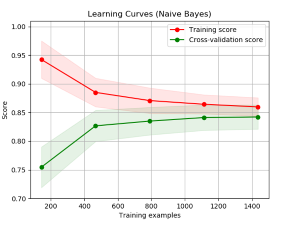

1.  高偏差：训练集与验证集收敛，但是两者收敛后的正确率远小于我们的期望，所以模型属于欠拟合问题。需要增加模型的复杂度，比如，增加特征、增加树的深度、减小正则项等等，此时再增加数据量是不起作用的。
2.  高方差：训练集正确率高于期望值，验证集则低于期望值，两者之间有很大的间距，误差很大，对于新的数据集模型适应性较差，模型属于过拟合问题。所以需要降低模型的复杂度，比如减小树的深度、增大分裂节点样本数、增大样本数、减少特征数等等。
3.  一个比较理想的学习曲线图应当是：低偏差、低方差，即收敛且误差小。

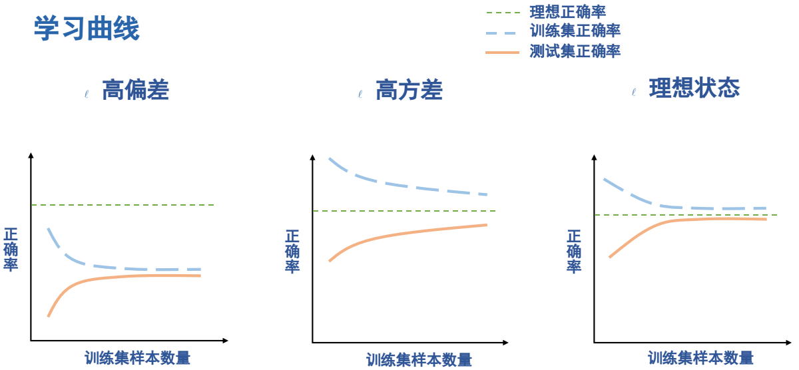

##### model_selection.learning_curve

| **参数**    | **说明**                                                     |
| ----------- | ------------------------------------------------------------ |
| estimator   | 指定的模型                                                   |
| X           | 训练集                                                       |
| y           | 训练集对应的标签                                             |
| train_sizes | 指定考察数据集的比例（浮点数）或数量（整数）                 |
| cv          | 默认为3折交叉分类器，如果为整数即为指定的k值，也可直接指定k折交叉分类器 |
| scoring     | 指定评价指标的字符串，默认采用.score方法，可选参数为：‘accuracy’、‘f1’、‘logloss’和‘mean_squared_error’等 |

```python
# 可视化学习曲线
from sklearn.model_selection import learning_curve

estimator = LogisticRegression()
cv = ShuffleSplit(n_splits=100, test_size=0.2, random_state=0)
learning_curve(estimator, X, y,cv=cv,train_sizes=np.linspace(.1, 1.0, 5))
## 模型选择LogisticRegression，分类器选择ShuffleSplit，该模型的学习曲线如下图 
```

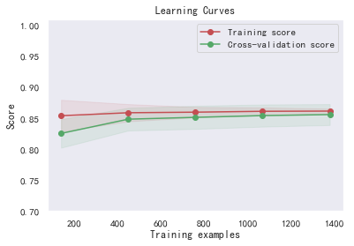

#### 参数调优

学习器模型中的两种参数：

*   模型参数：从数据中学习估计得到，如：线性回归中的系数
*   模型超参数：无法从数据中估计，需根据经验人工设置，如：k近邻算法中的k值

参数调优，即调整超参数来提升模型的泛化性能，常用方法为：

*   网格搜索交叉验证（GridSearchCV）：以穷举的方式遍历所有可能的参数组合
*   随机搜索交叉验证（RandomizedSearchCV）：依据某种分布对参数空间采样，随机的得到一些候选参数组合方案

##### 网格搜索交叉验证


##### 随机搜索交叉验证

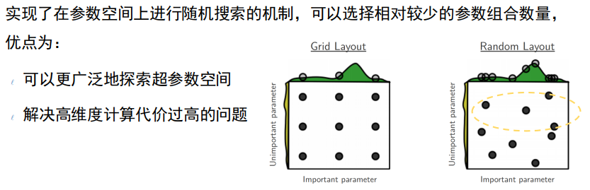

##### 参数调优常用类

| **类**                             | **说明**         |
| ---------------------------------- | ---------------- |
| model_selection.GridSearchCV       | 网格搜索交叉验证 |
| model_selection.RandomizedSearchCV | 随机搜索交叉验证 |

##### model_selection.GridSearchCV

| **参数**   | **说明**                                                     |
| ---------- | ------------------------------------------------------------ |
| estimator  | 指定的模型                                                   |
| param_grid | 关于参数名（键）和参数取值（值）的字典或字典的列表           |
| scoring    | 指定评价指标的字符串，默认采用.score方法，可选参数为：‘accuracy’、‘f1’、‘logloss’和‘mean_squared_error’等 |
| cv         | 默认为3折交叉分类器，如果为整数即为指定的k值，也可直接指定k折交叉分类器 |

| **属性**        | **说明**                                   |
| --------------- | ------------------------------------------ |
| cv_results_     | 输出以字典形式存储的每个参数组合的得分情况 |
| best_estimator_ | 输出筛选出来的最佳模型                     |
| best_score_     | 最佳模型的性能评分                         |
| best_params_    | 最佳参数组合                               |

| **方法**        | **说明**                                     |
| --------------- | -------------------------------------------- |
| fit(X[,y])      | 执行参数优化                                 |
| predict(X)      | 使用筛选的最佳模型预测数据                   |
| predict_prob(X) | 使用筛选的最佳模型预测数据为各类别的概率     |
| score(X[,y])    | 通过给定的数据集判断筛选的最佳模型的预测性能 |

##### model_selection.RandomizedSearchCV

| **参数**            | **说明**                                                     |
| ------------------- | ------------------------------------------------------------ |
| param_distributions | 关于参数名（键）和参数分布（值）的字典或字典的列表，通常使用scipy.stats模块中提供的分布，如：scipy.expon指数分布和scipy.uniform均匀分布等 |
| n_iter              | 指定每个参数采样的数量                                       |

```python
# 使用网格搜索预测客户汽车满意度
## 构建非线性支持向量机模型预测数据，即使用SVC，该模型中有两个重要参数C惩罚系数和gamma核宽度，现尝试不同取值的组合
param_grid = {'C': [0.1, 1, 10, 100], 'gamma': [0.1, 1, 10, 100]} 
print("Parameter grid:\n{}".format(param_grid))
'''
Parameter grid:
{'C': [0.1, 1, 10, 100], 'gamma': [0.1, 1, 10, 100]}
'''

from sklearn.model_selection import GridSearchCV
from sklearn.svm import SVC
grid_search = GridSearchCV(SVC(), param_grid, cv=5)

grid_search.fit(train_x, train_y)
print("Test set score: {:.3f}".format(grid_search.score(test_x,
test_y)))
'''
Test set score: 0.983
'''
print("Best parameters: {}".format(grid_search.best_params_)) 
print("Best cross validation score: {:.3f}".format(grid_search.best_score_))
'''
Best parameters: {'C': 100, 'gamma': 0.1}
Best cross validation score: 0.993
'''

# 使用随机网格搜索预测客户汽车满意度
from sklearn.model_selection import RandomizedSearchCV
import scipy

param = {'C': range(1,200,1), 'gamma':scipy.stats.expon()} 
random_search = RandomizedSearchCV(SVC(), param, cv=5, n_iter=10)
random_search.fit(train_x, train_y)
print("Test set score: {:.3f}".format(random_search.score(test_x, test_y)))
print("Best parameters: {}".format(random_search.best_params_)) 
print("Best cross validation score: {:.3f}".format(random_search.best_score_))
'''
Test set score: 1.000
Best parameters: {'C': 195, 'gamma': 0.8817567732529071}
Best cross validation score: 0.993
''' # 参数C：取值1-200，参数gamma：成指数分布，随机搜索后测试集的评分高达1
```


## **集成模型**

### 集成模型和ensemble模块介绍

集成思想：

*   先产生一组基模型，再用某种策略将他们结合起来
*   通常可获得比单一学习器优越的泛化性能
*   基模型可以相同，也可以不同

集成方法

常用的集成方法：装袋法（Bagging）、提升法（ Boosting ）和堆叠法（Stacking）


*   装袋法：
    并行的建立一些学习器，尽可能使其相互独立。从方差-偏差的角度看，可以有效减小方差
*   提升法：
    串行的建立一些学习器，通过一定策略提升弱分类器效果，组合得到强分类器。从方差-偏差的角度看，可以有效减小偏差
*   堆叠法：
    建立多个不同基模型，将每个模型的预测结果当做输入，建立一个高层的综合模型，可以有效改进预测

##### ensemble集成模块的主要类

| **类**                              | **说明**       |
| ----------------------------------- | -------------- |
| ensemble.AdaBoostClassifier         | AdaBoost分类   |
| ensemble.AdaBoostRegressor          | AdaBoost回归   |
| ensemble.RandomForestClassifier     | 随机森林分类   |
| ensemble.RandomForestRegressor      | 随机森林回归   |
| ensemble.GradientBoostingClassifier | 梯度提升分类   |
| ensemble.GradientBoostingRegressor  | 梯度提升回归   |
| ensemble.BaggingClassifier          | Bagging分类    |
| ensemble.BaggingRegressor           | Bagging回归    |
| Ensemble.VotingClassifier           | 投票表决分类器 |

### Bagging

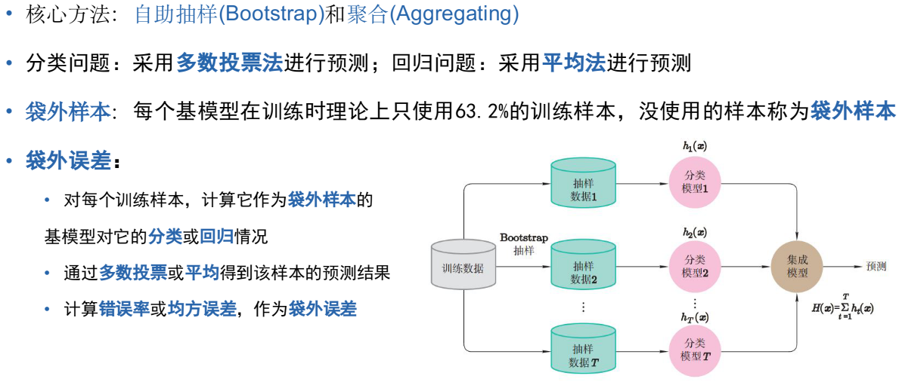


##### BaggingClassifier和BaggingRegressor类

| **参数**           | **功能**                                  |
| ------------------ | ----------------------------------------- |
| n_estimators       | 基模型的个数，默认为10                    |
| base_estimator     | 使用的基模型，默认是决策树                |
| bootstrap          | 样本的抽样方式，默认为True（有放回）      |
| bootstrap_features | 特征的抽样方式，默认为False（无放回）     |
| obb_score          | 是否使用袋外样本估计泛化能力，默认为False |

```python
# 基于决策树的Bagging模型

# 建立装袋模型
from sklearn.ensemble import BaggingClassifier

model_DF = DecisionTreeClassifier(random_state=10)
bag_DF = BaggingClassifier(base_estimator=model_DF, oob_score=True, random_state=10)
bag_DF.fit(X_train, y_train)

# 查看袋外样本得分
bag_DF.oob_score_
```

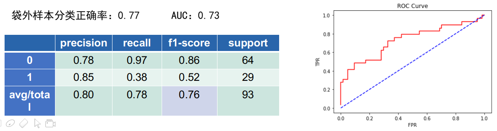

```python
# 基于逻辑回归的Bagging模型

# 建立基于逻辑回归的装袋模型
model_LR = LogisticRegression(class_weight='balanced', random_state=10)
bag_LR = BaggingClassifier(base_estimator=model_LR, oob_score=True, random_state=10)
bag_LR.fit(X_train, y_train)

# 查看袋外样本得分
bag_LR.oob_score_
```

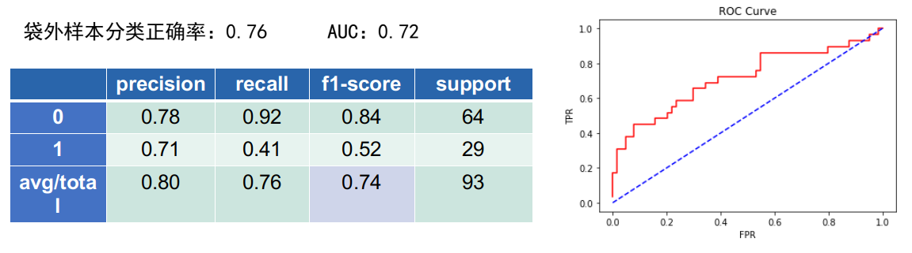

```python
# 基于决策树的Bagging模型参数调优
# 网格搜索调参
from sklearn.model_selection import GridSearchCV

grid_n = [20, 50, 100, 150, 200, 500]
grid_fea = [True, False]

grid_search = GridSearchCV(estimator=bag_DF, param_grid={'n_estimators':grid_n,'bootstrap_features':grid_fea},cv=5, scoring='roc_auc')
grid_search.fit(X_train, y_train)

'''
最优参数：{'bootstrap_features': True, 'n_estimators': 100}
测试集AUC：0.76

	precision	recall	f1-score	support
0	0.77	0.98	0.86	64
1	0.91	0.34	0.50	29
avg/total	0.81	0.78	0.75	93
'''
```


#### 随机森林

##### RandomForestClassifier类

| **参数**     | **功能**                                                     |
| ------------ | ------------------------------------------------------------ |
| n_estimators | 基决策树的个数，默认为10                                     |
| criterion    | 最佳划分的评价标准，默认为“gini”，可选“entropy”              |
| max_features | 建立每棵树使用的特征个数，默认为“auto”（$m=\sqrt{d}$），还可选：<br />“sqrt”（同“auto”）<br />“log2”（$m = log_2d$）<br />“None”（$𝑚 = 𝑑$），也可直接输入个数（正整数） |
| bootstrap    | 样本的抽样方式，默认为True（有放回）                         |
| obb_score    | 是否使用袋外样本估计泛化能力，默认为False                    |
| class_weight | 设置分类权重，默认为“None”                                   |

```python
# 不同的决策树数量对袋外样本得分的影响

# 载入算法类
from sklearn.ensemble import RandomForestClassifier

# 设置基模型个数列表
grid_n = [20, 40, 60, 80, 100, 120]

# 计算在不同基模型个数下的袋外样本得分
oob_score = []
for item in grid_n:
    model = RandomForestClassifier(n_estimators=item, random_state=10, oob_score=True)
    model.fit(X_train, y_train)
    oob_score.append(model.oob_score_)
    # 随着bagging的基决策树数目的增加，袋外样本得分不断上升
```

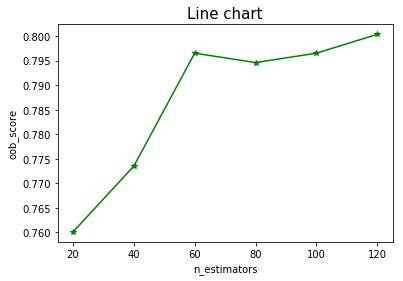

##### 随机森林网格搜索参数调优

```python
# 网格搜索参数调优
from sklearn.model_selection import GridSearchCV

grid_n = [20, 50, 100, 150, 200, 500]
grid_fea = np.arange(2, 19) 
grid_weight = ['balanced', None]

model_RF = RandomForestClassifier(random_state=10)
grid_search = GridSearchCV(estimator=model_RF, param_grid={'n_estimators':grid_n, 'max_features':grid_fea,  'class_weight':grid_weight},cv=5, scoring='roc_auc')
grid_search.fit(X_train, y_train)
'''
最优参数：{‘n_estimators’: 500, 'max_features’:6, ‘class_weight’:None}
测试集AUC：0.79

	precision	recall	f1-score	support
0	0.77	0.98	0.86	64
1	0.91	0.34	0.50	29
avg/total	0.81	0.78	0.75	93
'''
```

##### 特征重要性评估

```python
# 特征重要性评估
best_RF = grid_search.best_estimator_
best_RF.fit(X_train, y_train)

# 水平条形图绘制
plt.figure(figsize=(8, 6))
pd.Series(best_RF.feature_importances_, index=X_train.columns).sort_values().plot(kind='barh')
    # 申请人收入、贷款金额、是否有违约历史、共同申请人收入这五个特征的重要性排在前五位
```

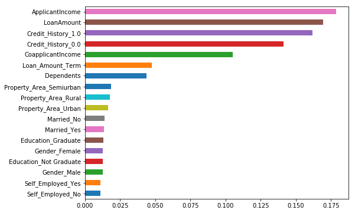


### Boosting

#### AdaBoost

##### AdaBoostClassifier类

| **参数**       | **功能**                                                   |
| -------------- | ---------------------------------------------------------- |
| base_estimator | 基学习器的设置，默认是决策树                               |
| n_estimators   | 基学习器的个数，默认为50                                   |
| Learining_rate | 学习率的设置，默认为1.0                                    |
| algorithm      | 二分类推广到多分类使用的算法，默认为“SAMME.R”，可选“SAMME” |

| **属性**             | **说明**               |
| -------------------- | ---------------------- |
| estimator_weights_   | 每个弱分类器的权重     |
| estimator_errors_    | 每个弱分类器的分类误差 |
| feature_importances_ | 特征重要性             |

```python
# 构建基于决策树的AdaBoost模型
from sklearn.ensemble import AdaBoostClassifier

# 基分类器为决策树
model_ada = AdaBoostClassifier(random_state=10, algorithm='SAMME')
model_ada.fit(X_train,y_train)

# 弱分类器的权重和误差变化折线图
plt.figure(figsize=(8, 6))
plt.plot(model_ada.estimator_weights_, 'y-+', label='weight')
plt.plot(model_ada.estimator_errors_, 'b--*', label='error')
plt.xlabel('estimator_order')
plt.legend()
    # 第一个弱分类器权重最高，误差最低，其余弱分类器间权重和误差较为接近
    # 测试集AUC：0.71
```

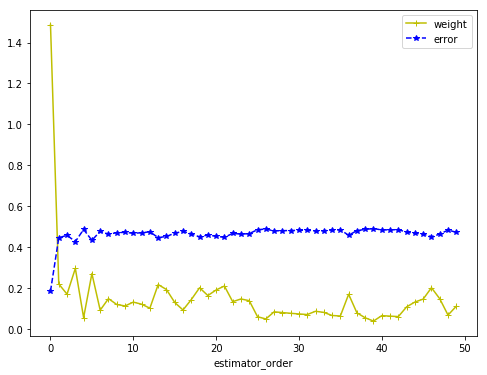

```python
# 特征重要性评估
plt.figure(figsize=(8, 6))
pd.Series(model_ada.feature_importances_,       index=X_train.columns).sort_values().plot(kind='barh')
```

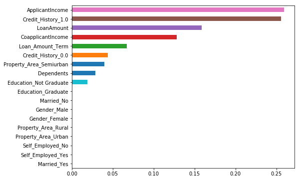

```python
# 学习率对分类误差的影响
grid_rate = np.linspace(0.01, 1, 10)

error = []
for item in grid_rate:
    model = AdaBoostClassifier(random_state=10, learning_rate=item)
    model.fit(X_train, y_train)
    error.append(model.score(X_test, y_test))
```

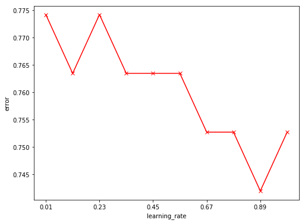

```python
# 基分类器为逻辑回归
model_LR = LogisticRegression(random_state=10, class_weight='balanced')
model_adaLR = AdaBoostClassifier(base_estimator=model_LR, random_state=10)

grid_n = [20, 50, 100, 150, 200, 500]
grid_rate = np.linspace(0.01, 1, 10)

# 网格搜索调参
grid_search = GridSearchCV(estimator=model_adaLR, param_grid={'n_estimators':grid_n, 'learning_rate':grid_rate},cv=5, scoring='roc_auc')
grid_search.fit(X_train, y_train)
'''
最优参数：{'learning_rate': 0.56, 'n_estimators': 20}
测试集AUC：0.72

	precision	Recall	f1-score	support
0	0.78	0.98	0.84	64
1	0.68	0.45	0.54	29
avg/total	0.75	0.76	0.75	93
'''
```


#### GBDT

##### GradientBoostingClassifier类

| **参数**      | **功能**                                                     |
| ------------- | ------------------------------------------------------------ |
| loss          | 指定损失函数，默认为“deviance”（对数损失），可为“exponential”（指数损失） |
| learning_rate | 学习率，默认为0.1                                            |
| n_estimators  | 弱分类器个数，默认为100                                      |
| subsample     | 拟合基学习器的训练集样本数占总样本数的比例，0到1之间的浮点数，默认为1.0 |

| **属性**             | **说明**                                     |
| -------------------- | -------------------------------------------- |
| feature_importances_ | 特征重要性                                   |
| oob_improvement_     | 每增加一个基分类器，袋外样本的损失函数减少值 |
| train_score_         | 每增加一个基分类器，训练集上损失函数的值     |

##### GradientBoostingRegressor类

| **参数**      | **功能**                                                     |
| ------------- | ------------------------------------------------------------ |
| loss          | 指定损失函数，默认为“ls”（平方损失），还可为：<br />“lad”（绝对值损失）<br />“huber”（huber损失）<br />“quantile”（分位数回归） |
| alpha         | 当loss=“huber”或”quantile”时有效，两个损失中的参数，默认为0.9 |
| learning_rate | 学习率，默认为0.1                                            |
| n_estimators  | 弱分类器个数，默认为100                                      |
| subsample     | 拟合基学习器的训练集样本数占总样本数的比例，0到1之间的浮点数，默认为1.0 |

| **属性**             | **说明**                                     |
| -------------------- | -------------------------------------------- |
| feature_importances_ | 特征重要性                                   |
| oob_improvement_     | 每增加一个基分类器，袋外样本的损失函数减少值 |
| train_score_         | 每增加一个基分类器，训练集上损失函数的值     |

```python
# 构建GBDT模型
from sklearn.ensemble import GradientBoostingClassifier

# 建立并训练GBDT模型
model_gbdt = GradientBoostingClassifier(random_state=10, subsample=.7)
model_gbdt.fit(X_train, y_train)

# 弱分类器袋外样本损失减小值和训练集损失
plt.figure(figsize=(8, 6))
plt.plot(model_gbdt.oob_improvement_, 'y-+', label='oob')
plt.plot(model_gbdt.train_score_, 'b--*', label='train')
plt.xlabel('estimator_order')
plt.legend()
    # 随着弱分类器的增加，训练集的损失在不断降低，袋外样本的损失减小值慢慢趋于平稳
    # 测试集AUC：0.75
```

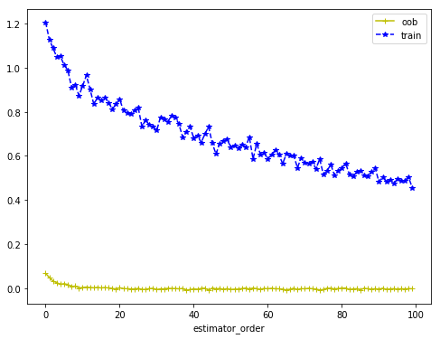

```python
# 网格搜索调参
grid_search = GridSearchCV(estimator=model_gbdt, 
param_grid={'n_estimators':grid_n, 'learning_rate':grid_rate,   'subsample':grid_sub},cv=5, scoring='roc_auc')
grid_search.fit(X_train, y_train)

# 返回最优参数
grid_search.best_params_
```

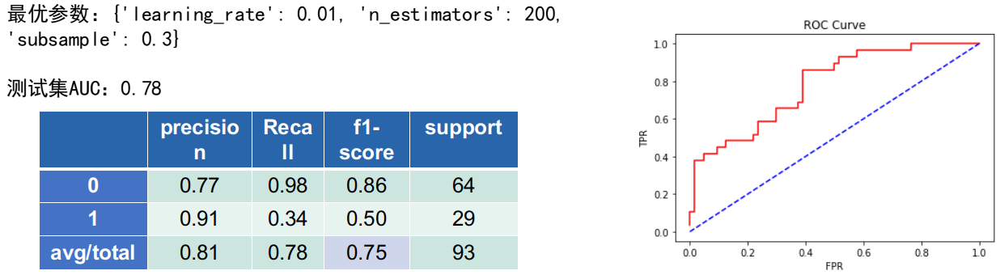

```python
# 特征重要性
best_gbdt = grid_search.best_estimator_
best_gbdt.fit(X_train, y_train)

plt.figure(figsize=(8, 6))
pd.Series(best_gbdt.feature_importances_, index=X_train.columns).sort_values().plot(kind='barh')

```

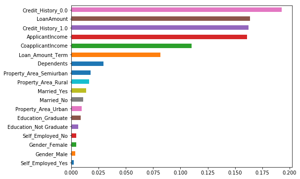

### Voting Classifier

##### VotingClassifier类

| **参数**   | **功能**                                                 |
| ---------- | -------------------------------------------------------- |
| estimators | 基分类器设置，需传入一个元组列表                         |
| voting     | 投票方式，硬投票或者软投票，默认为“hard”，软投票为“soft” |
| weights    | 基分类器的权重，需传入一个列表对象                       |

```python
# 单一模型的硬投票和软投票

# 单一模型的硬投票
model_vote_hard = VotingClassifier(estimators=[('DF',model_DF), ('LR',model_LR)]) # 决策树与逻辑回归
model_vote_hard.fit(X_train, y_train)
# 得到预测标签
y_pred_vote_hard = model_vote_hard.predict(X_test)
# 计算AUC
fpr, tpr, threshold = roc_curve(y_score=y_pred_vote_hard, y_true=y_test)
print('硬投票AUC值：', auc(fpr, tpr))
'''硬投票测试集AUC：0.67'''
# 单一模型的软投票
model_vote_soft = VotingClassifier(estimators=[('DF',model_DF), ('LR',model_LR)], voting='soft')
model_vote_soft.fit(X_train, y_train)
# 得到预测概率
y_prob_vote_soft = model_vote_soft.predict_proba(X_test)[:, 1]
# 计算AUC
fpr, tpr, threshold = roc_curve(y_score=y_prob_vote_soft, y_true=y_test)
print('软投票AUC值：', auc(fpr, tpr))
'''软投票测试集AUC：0.80'''

# 集成模型的硬投票和软投票
# 集成模型的软投票
best_RF = RandomForestClassifier(max_features=6, n_estimators=500, random_state=10)
best_gbdt = GradientBoostingClassifier(n_estimators=200, learning_rate=0.01, subsample=0.3, random_state=10)

model_vote_soft = VotingClassifier(estimators=[('RF',best_RF), ('GBDT',best_gbdt)], voting='soft')
model_vote_soft.fit(X_train, y_train)

# 得到预测概率
y_prob_vote_soft = model_vote_soft.predict_proba(X_test)[:, 1]

# 计算AUC
fpr, tpr, threshold = roc_curve(y_score=y_prob_vote_soft, y_true=y_test)
print('软投票AUC值：', auc(fpr, tpr))
'''
硬投票测试集AUC：0.66
软投票测试集AUC：0.79
'''

# AUC值加权软投票
# 加权软投票
## 获得单一模型的AUC值
model_DF.fit(X_train, y_train)
y_prob_DF = model_DF.predict_proba(X_test)[:, 1]
fpr, tpr, threshold = roc_curve(y_score=y_prob_DF, y_true=y_test)
print('决策树AUC值：', auc(fpr, tpr))
model_LR.fit(X_train, y_train)
y_prob_LR = model_LR.predict_proba(X_test)[:, 1]
fpr, tpr, threshold = roc_curve(y_score=y_prob_LR, y_true=y_test)
print('逻辑回归AUC值：', auc(fpr, tpr))
## AUC加权软投票
model_vote_soft = VotingClassifier(estimators=[('DF',model_DF), ('LR',model_LR)], voting='soft', weights=[0.76, 0.73])
model_vote_soft.fit(X_train, y_train)
# 得到预测概率
y_prob_vote_soft = model_vote_soft.predict_proba(X_test)[:, 1]
# 计算AUC
fpr, tpr, threshold = roc_curve(y_score=y_prob_vote_soft, y_true=y_test)
print('软投票AUC值：', auc(fpr, tpr))
'''
决策树测试集AUC：0.76
软投票测试集AUC：0.80
逻辑回归测试集AUC：0.73
'''
```


## **特征抽取与特征选择**

### 特征提取与特征选择概述

特征工程主要包含以下三个方面：

*   特征提取：将文本或图像等数据转换为可用于机器学习的数字特征
*   特征选择：从全部数据特征中选取一个特征子集
*   特征构建：从原始特征中人工构建新的特征


### 特征提取与feature_extraction模块

feature_extraction的主要类

*   面向图像数据

| **类**                                                       | **说明**               |
| ------------------------------------------------------------ | ---------------------- |
| sklearn.feature_extraction.image.extract_patches_2d          | 从2D图像中提取小块图像 |
| sklearn.feature_extraction.image.reconstruct_from_patches_2d | 将小块图像重组为2D图像 |

*   面向文本数据(重点)

| **类**                                  | **说明**               |
| --------------------------------------- | ---------------------- |
| feature_extraction.text.CountVectorizer | 将文本转换为词袋模型   |
| feature_extraction.text.TfidfVectorizer | 将文本转换为TF-IDF矩阵 |

#### 从文本提取特征

将文本数据转化成特征向量的过程，常用表示法为词袋法

词袋法：不考虑词法和语序，每个词语相互独立
                                    Mary wants to go to Japan.
                                    Bill wants to go to Germany.
可以建立一个词典用于构建特征向量：
                         [Mary，wants，to，go，Japan，Bill，Germany]
向量每个位置表示的单词与上面的数组一致，值为该单词在句子中出现的次数
   第一个句子： [1，1，2，1，1，0，0]
   第二个句子： [0，1，2，1，0，1，1]


CountVectorizer：只考虑词汇在文本中出现的频率

TfidfVectorizer：除了考量某词汇在文本中出现的频率，还关注包含这个词汇的文本数量适合文本条目多的情况

##### feature_extraction.text的主要类：

| **类**                                  | **说明**               |
| --------------------------------------- | ---------------------- |
| feature_extraction.text.CountVectorizer | 将文本转换为词袋模型   |
| feature_extraction.text.TfidfVectorizer | 将文本转换为TF-IDF矩阵 |

| **通用方法**        | **说明**                       |
| ------------------- | ------------------------------ |
| fit(X, y)           | 学习文本的向量表示             |
| transform(X)        | 转化为向量表示的矩阵           |
| fit_transform(X, y) | 先学习再转换为向量表示         |
| get_feature_names() | 查看所有文本的词汇（列表对象） |

##### CountVectorizer类

| 常用参数   | 说明                                                         |
| ---------- | ------------------------------------------------------------ |
| stop_words | 设置停用词，默认为None（没有），可设置为“english”或list（自行给定） |
| min_df     | 设定阈值，构建词汇表时，忽略文档频率严格低于这个阈值的词汇，默认为1 |
| binary     | 默认为False，True表示向量表示中所有非零项标记为1             |

| **属性列表** | **说明**               |
| ------------ | ---------------------- |
| vocabulary_  | 返回词汇表（字典对象） |
| stop_words_  | 返回停用词表           |

| 略详述                                                       | 1    |
| ------------------------------------------------------------ | ---- |
| stop_words: 可设为string {'english'}，list或None（默认）；<br/>                       设为english将使用内置的英语停用词；<br/>                       设为list可自定义停用词；<br/>                       设为None不使用停用词；<br/>                       设为None且参数max_df∈[0.7, 1.0)时将自动根据当前的语料库建立停用词表<br />max_df：float in range [ 0.0，1.0 ]或int，default（默认）= 1.0；<br/>                  作为阈值，构造词汇表时，如果某词的文档频率大于max_df，则这个词不会被当作关键词；<br/>                  为浮点值，则表示词出现的次数与文档数的百分比；<br/>                  为整数，则表示词出现的次数；<br/>                  如果给定了参数vocabulary，则此参数无效<br /><br/>min_df：float in range [ 0.0，1.0 ]或int，default = 1；<br/>                 作为阈值，构建词汇表时忽略文档频率低于min_df的词语；<br/>                 与max_df的作用类似<br /><br/>vocabulary_：字典类型，key为关键词，value是特征索引 | 1    |


更多参数详情请参考官方文档：
https://scikit-learn.org/stable/modules/generated/sklearn.feature_extraction.text.CountVectorizer.html

```python
class sklearn.feature_extraction.text.CountVectorizer(input='content', encoding='utf-8', decode_error='strict', strip_accents=None, lowercase=True, preprocessor=None, tokenizer=None, stop_words=None, token_pattern='(?u)\b\w\w+\b', ngram_range=(1, 1), analyzer='word', max_df=1.0, min_df=1, max_features=None, vocabulary=None, binary=False, dtype=<class 'numpy.int64'>)

# 创建词袋模型
from sklearn.feature_extraction.text import CountVectorizer

# 采用CountVectorizer提取特征向量，并去除停用词
count_vec = CountVectorizer(stop_words='english')
x_count_train = count_vec.fit_transform(train_X)
x_count_test = count_vec.transform(test_X)
# 查看向量表示矩阵
print(x_count_train) # 显示而已，不一定非要打印
''' 示例：
  (0, 5222)	1
  (0, 4749)	1
  (0, 7271)	1
   :   :
   '''　# 解释：第0个列表，词典中索引为3534的元素，词频为1

# 转化为非压缩矩阵
print(x_count_train.toarray())
''' 示例：
[[0 0 0 ..., 0 0 0]
 [0 0 0 ..., 0 0 0]
 ..., 
 [0 0 0 ..., 0 0 0]
 [0 0 0 ..., 0 0 0]]
'''
# 查看每个词在所有文档中的词频
print(x_count_train.toarray().sum(axis=0))
''' 示例：
[ 7 26  2 ...  1  1  1]
'''
# 查看词汇表
print(count_vec.vocabulary_)
''' 示例：
{'princess': 5222, 'great': 3122, 'hear': 3263, 'settling': 5835, 'happenin': 3218,……} 
''' # 所有词汇存储在一个字典对象中，字典中的键是词汇，值是该词汇的索引
# 查看索引所对应的词汇
print(count_vec.get_feature_names()[3122])
''' 示例：
great
'''
```

```python
# 建立并训练多项式朴素贝叶斯模型
# 建立并训练多项式贝叶斯模型
from sklearn.naive_bayes import MultinomialNB
mnb_count = MultinomialNB()
mnb_count.fit(x_count_train, train_y)   
mnb_count_y_predict = mnb_count.predict(x_count_test) 

# 模型评估
from sklearn.metrics import classification_report
print("预测正确率：", mnb_count.score(x_count_test, test_y))
print("分类报告:\n", classification_report(mnb_count_y_predict, test_y))
'''
预测正确率： 0.98
分类报告:
              precision    recall  f1-score   support
          0       0.99      0.98      0.99       983
          1        0.88      0.95      0.92       132
avg / total       0.98      0.98      0.98      1115
'''
```

#### TF-IDF

思想：若某词汇在一个文档中出现的频率高，且在其它文档中出现少，则认为此词汇具有很好的类别区分能力

词汇的重要性随着它在一个文档中出现的次数成正比，与它在所有文档中出现的次数成反比。

TF-IDF倾向于过滤掉常见的词语，保留重要的词语。

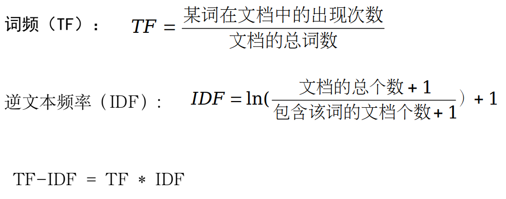

举例：

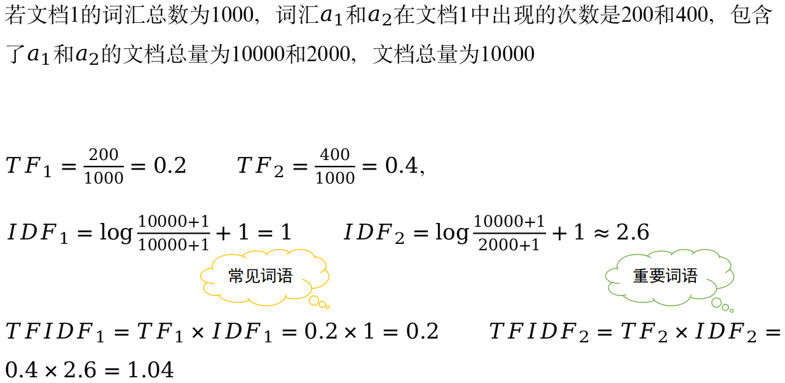

##### TfidfVectorizer类

| **常用参数** | **说明**                                                     |
| ------------ | ------------------------------------------------------------ |
| stop_words   | 设置停用词，默认为None（没有），可设置为“english”或list（自行给定） |
| min_df       | 设定阈值，构建词汇表时，忽略文档频率严格低于这个阈值的词汇，默认为1 |
| binary       | 默认为False，True表示向量表示中所有非零项标记为1             |
| smooth_idf   | 默认为True，向逆文档频率添加一个平滑项，防止其计算的值为0    |

| **属性列表** | **说明** |
| ------------ | -------- |
| vocabulary_  | 词汇表   |
| stop_words_  | 停用词表 |
| idf_         | idf值    |

```python
# 转换为TF-IDF特征
# 类参数：
class TfidfVectorizer(analyzer='word', binary=False, decode_error='strict',dtype=<class 'numpy.int64'>, encoding='utf-8', input='content',lowercase=True, max_df=1.0, max_features=None, min_df=1,ngram_range=(1, 1), norm='l2', preprocessor=None, smooth_idf=True,stop_words='english', strip_accents=None, sublinear_tf=False,token_pattern='(?u)\\b\\w\\w+\\b', tokenizer=None, use_idf=True,vocabulary=None)

# 采用TfidfVectorizer提取文本特征向量，使用英文停用词
from sklearn.feature_extraction.text import TfidfVectorizer
tfid_vec = TfidfVectorizer(stop_words='english')
x_tfid_train = tfid_vec.fit_transform(train_X)
x_tfid_test = tfid_vec.transform(test_X)

# 建立并训练多项式贝叶斯模型
mnb_tfid = MultinomialNB()
mnb_tfid.fit(x_tfid_train, train_y)
mnb_tfid_y_predict = mnb_tfid.predict(x_tfid_test)

# 模型评估
print("模型正确率：", mnb_tfid.score(x_tfid_test, test_y))
print("分类报告:\n", classification_report(mnb_tfid_y_predict, test_y))
'''
预测正确率： 0.96
分类报告:
              precision    recall  f1-score   support
ham       0       1.00      0.96      0.98      1013
spam      1       0.71      1.00      0.83       102
avg / total       0.97      0.96      0.97      1115

'''
```


### 特征选择与feature_selection模块

定义：从全部特征中选取一个特征子集来建立模型

目的：降低特征维度，提高模型性能

基本原则：
包含信息较少（方差较低）的特征应该被剔除
与目标特征相关性高的特征应该优先被选择

特征选择方法:

| **方式**            | **说明**                                               | **主要方法**                   |
| ------------------- | ------------------------------------------------------ | ------------------------------ |
| 过滤式（Filter）    | 先进行特征选择，再建立模型，特征选择的过程中不涉及建模 | 方差选择法卡方检验法相关系数法 |
| 包裹式（Wrapper）   | 建立模型并给定评价标准，选择效果最优的特征子集         | 递归特征消除法                 |
| 嵌入式（Embedding） | 特征选择与模型训练结合，在训练过程中自动进行特征选择   | ***𝐿****1***正则化项特征重要性 |

#### feature_selection模块

| **类**                              | **说明**                                              |
| ----------------------------------- | ----------------------------------------------------- |
| feature_selection.VarianceThreshold | 剔除低于方差阈值的特征                                |
| feature_selection.SelectKBest       | 根据给定的得分函数选出K个得分最高的特征               |
| feature_selection.SelectPercentile  | 根据给定的得分函数选出前p%个得分最高的特征（p需指定） |
| feature_selection.RFE               | 递归特征消除法                                        |
| feature_selection.RFECV             | 包含交叉验证的递归特征消除法                          |
| feature_selection.SelectFromModel   | 嵌入式特征消除法                                      |

| **通用方法**        | **说明**                                  |
| ------------------- | ----------------------------------------- |
| fit(X, y)           | 学习怎样进行特征选择                      |
| transform(X)        | 对X进行特征选择                           |
| fit_transform(X, y) | 先学习怎样进行特征选择，再对X进行特征选择 |
| get_support ( )     | 返回布尔数组，指明哪些特征被选择          |


#### 过滤式

##### 方差选择法

思想：方差小的特征波动性小，包含的信息也较少，对模型影响较小

方法：

*   给定一个方差阈值，计算所有特征的方差
*   保留方差大于阈值的特征
*   剔除方差小于阈值的特征

##### VarianceThreshold类

| **参数**  | **说明**                                                   |
| --------- | ---------------------------------------------------------- |
| threshold | 输入方差阈值（浮点型），默认为0.0，会自动删除方差为0的特征 |

| **属性**   | **说明**         |
| ---------- | ---------------- |
| variances_ | 查看各特征的方差 |

```python
# 剔除低于方差阈值的特征
from sklearn.feature_selection import VarianceThreshold
## 设定方差阈值为0.5
sel_var = VarianceThreshold(threshold=0.5)
## 去掉X中方差低于阈值的特征
sel_var_X = sel_var.fit_transform(X)
## 执行剔除后X的维度
sel_var_X.shape
## 查看没有被剔除的特征
print(pd.Series(sel_var.get_support(), index=X.columns))
'''
特征选择后的维度：（241，7）
选出的特征：age
cp
trestbps
chol
thalach
oldpeak
ca
'''
```

##### 卡方检验法

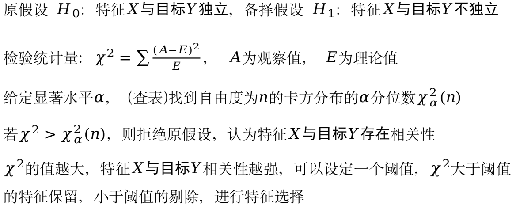

卡方检验举例

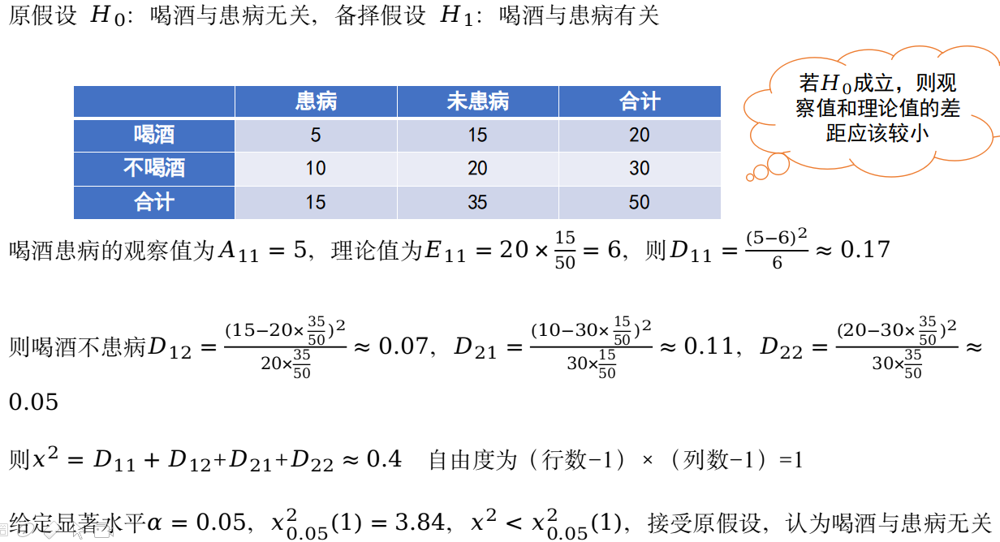

##### 相关系数检验法

##### SelectKBest和SelectPercentile类

| **参数**                       | **说明**                                                     |
| ------------------------------ | ------------------------------------------------------------ |
| score_func                     | 给出统计指标的函数，常用函数如下：  “f_regression”（默认）：相关系数检验，用于回归问题  “chi2”：卡方检验，用于分类问题  “mutual_info_regression”：计算互信息，用于回归问题  “f_classif”：基于方差分析的F检验，用于分类问题 |
| k （SelectKBest）              | 指定保留得分最高特征的个数，默认为10                         |
| Percentile（SelectPercentile） | 指定保留得分最高的前百分之几的特征，默认为10（10%）          |

| **属性** | **说明**                                            |
| -------- | --------------------------------------------------- |
| scores_  | 返回各特征的得分                                    |
| pvalues_ | 返回各特征得分的p值，若score_func仅返回得分，则为无 |

```python
# 卡方检验特征选择
from sklearn.feature_selection import SelectKBest
from sklearn.feature_selection import chi2

# 与目标变量最相关的7个特征
sel_chi = SelectKBest(chi2,k=7).fit(X, y) 

# 各个特征变量与目标变量的相关程度
print(sel_chi.scores_) 

# 返回筛选结果
print(pd.Series(sel_chi.get_support(), index=X.columns))
'''
age
cp
chol
thalach
exang
oldpeak
ca
'''
# 特征选择可视化
import matplotlib.pyplot as plt
%matplotlib inline

# 将特征的选取进行可视化——红色为True，紫色为False
plt.figure(figsize=(8, 6))
plt.matshow(sel_chi.get_support().reshape(1, -1), cmap='rainbow')
plt.xticks(range(13), X.columns)
# 结果如下图（前者卡方，后者方差）
```

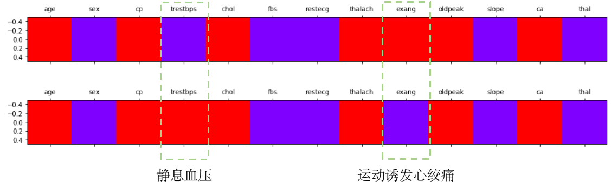


#### 包裹式

##### 递归特征消除法（RFE）

思想：利用可以学习到特征权重或重要性的模型，通过递归的方式减少特征个数来进行特征选择

步骤:

*   基于所有特征训练模型，得到每个特征的权重或重要性
*   剔除权重或重要性最小的特征，基于新的特征集合训练模型
*   最后，重复上述步骤，进行递归消除，直到剩下的特征个数满足条件为止

执行RFE的过程中，可以通过交叉验证的方式来评价模型在某个特征集合上的表现，以此来选择最佳的特征集合。

##### RFE类

| **参数**             | **说明**                                                     |
| -------------------- | ------------------------------------------------------------ |
| estimator            | 监督学习器，必须包含coef_或feature_importances_属性          |
| n_features_to_select | 指定选出几个特征，默认为None（所有特征的一半）               |
| step                 | 每次迭代剔除的特征数，默认为1，大于1为剔除的个数，0~1之间为剔除的比例 |

| **属性** | **说明**                       |
| -------- | ------------------------------ |
| support_ | 指明哪些特征被选择（布尔数组） |
| ranking_ | 特征的排名（表示被剔除的顺序） |

```python
# 基于决策树的RFE
from sklearn.feature_selection import RFE
from sklearn.tree import DecisionTreeClassifier

# 执行RFE
rfe = RFE(DecisionTreeClassifier(random_state=10), n_features_to_select=7)
rfe.fit_transform(train_X,train_y)

# 先对test_X进行转换后，再用设定好的学习器进行预测
y_pred = rfe.predict(test_X)

# 将test_X进行特征选择后，再用设定好的学习器评分
rfe.score(test_X, test_y)

# 特征排名
rfe.ranking_
'''
特征选择前决策树模型评分：0.74
特征选择后决策树模型评分：0.79

特征	排名
age	1（被选择）
sex         	4（第5次被剔除）
cp          	1（被选择）
trestbps    	1（被选择）
chol        	1（被选择）
fbs         	7（第1次被剔除）
restecg     	6（第2次被剔除）
thalach     	1（被选择）
exang       	3（第6次被剔除）
oldpeak     	1（被选择）
slope      	  2（第7次被剔除）
ca          	1（被选择）
thal 	       5（第3次被剔除）
'''
```

##### RFECV类

| **参数**               | **说明**                                                     |
| ---------------------- | ------------------------------------------------------------ |
| estimator              | 监督学习器，必须包含coef_或feature_importances_属性          |
| min_features_to_select | 需要选择的最小特征数，默认为1                                |
| step                   | 每次迭代剔除的特征数，默认为1，大于1为剔除的个数，0~1之间为剔除的比例 |
| cv                     | 交叉验证的折数，默认为3                                      |
| scoring                | 字符串或可调用对象，用于评估学习器的预测性能                 |

| grid_scores_ | 各特征子集的交叉验证得分       |
| ------------ | ------------------------------ |
| support_     | 指明哪些特征被选择（布尔数组） |
| ranking_     | 特征的排名（表示被剔除的顺序） |

```python
# 基于决策树的交叉验证RFE
# 递归特征消除+交叉验证法
from sklearn.feature_selection import RFECV

rfeCV = RFECV(DecisionTreeClassifier(random_state=10), cv=5,scoring='roc_auc')
rfeCV.fit(train_X,train_y)

## 查看特征排名
print(pd.Series(rfeCV.ranking_, index=X.columns))
'''
特征	          排名
age	          1（被选择）
sex         	1（被选择）
cp          	1（被选择）
trestbps    	1（被选择）
chol        	1（被选择）
fbs         	4（第1次被剔除）
restecg     	3（第2次被剔除）
thalach     	1（被选择）
exang       	1（被选择）
oldpeak     	1（被选择）
slope      	  1（被选择）
ca          	1（被选择）
thal 	        2（第3次被剔除）
'''
```


#### 嵌入式

思想：模型训练和特征选择结合，在优化过程中自动选择特征

方法：
l_1正则化项：优化过程中可得到稀疏解，等同于特征选择，如LASSO
特征权重或重要性：设定阈值，若某特征的权重或重要性低于阈值，则将该特征剔除，
   如：决策树、SVM

##### SelectFromModel类

| **参数**  | **说明**                                                     |
| --------- | ------------------------------------------------------------ |
| estimator | 监督学习器，，必须包含coef_或feature_importances_属性        |
| threshold | 用于特征选择的阈值，设置方法如下：       若为浮点型：则表示阈值的绝对大小       若为字符串，可设为：”mean”（默认）（权重或重要性的均值）                        “median”（权重或重要性的中位数）       若estimator包含“l1”正则化项，则默认值为1e-5 |

```python
# 基于随机森林的嵌入式特征选择
from sklearn.feature_selection import SelectFromModel
from sklearn.ensemble import RandomForestClassifier

# 使用随机森林作为监督学习器
select = SelectFromModel(RandomForestClassifier(n_estimators=200, random_state=10), threshold='median')
select.fit(train_X, train_y)
'''
特征选择后建立随机森林模型的AUC值：0.80
'''
```

## **降维**

### 降维方法与sklearn降维模块概述

降维本质上是降低数据维度，是一种无监督学习方法（LDA例外）

降维的目的：

* 摒弃冗余信息（共线性），删除噪音
* 降低计算时间、空间复杂度
* 简单模型具有更好的鲁棒性
* 实现数据可视化
* 可以作为特征提取的方法

降维方法：

- 基于矩阵分解的方法。例如：PCA、LDA、NMF
- 基于流形学习的方法。例如：MDS、LLE、t-SNE

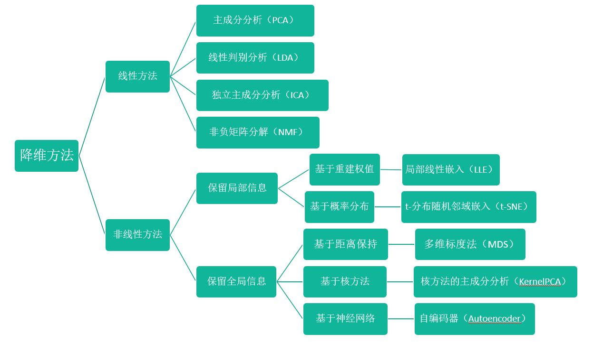

**Sklearn 降维模块：**

- Sklearn中降维的方法主要分布在以下三个模块：
  - sklearn.decomposition：包含了绝大部分的矩阵分解算法，其中包括PCA、核PCA、NMF或ICA
  - sklearn.discriminant_analysis：包含了LDA和QDA两种判别分析方法
  - sklearn.manifold：包含了基于流形学习的数据降维方法

流形是局部具有欧几里得空间性质的空间，不同于传统机器学习方法假设数据存在于欧式空间，流形学习假设数据分布嵌入在外围高维空间的一个潜在流形上。

sklearn.decomposition 模块

|              类              | 说明                  |
| :--------------------------: | --------------------- |
|      decomposition.PCA       | 主成分分析（PCA）     |
|      decomposition.NMF       | 非负矩阵分解（NMF）   |
|    decomposition.FastICA     | 独立主成分分析（ICA） |
| decomposition.FactorAnalysis | 因子分析              |
|   decomposition.KernelPCA    | 核PCA                 |
|   decomposition.SparsePCA    | 稀疏PCA               |
|  decomposition.SparseCoder   | 稀疏编码              |

sklearn.discriminant_analysis 模块

|                         类                          | 说明                |
| :-------------------------------------------------: | ------------------- |
|  discriminant_analysis.LinearDiscriminantAnalysis   | 线性判别分析（LDA） |
| discriminant_analysis.QuadraticDiscriminantAnalysis | 二次判别分析（QDA） |

sklearn.manifold 模块

|               类                | 说明                        |
| :-----------------------------: | --------------------------- |
| manifold.LocallyLinearEmbedding | 局部线性嵌入（LLE）         |
|          manifold.MDS           | 多维尺度变换（MDS）         |
|          manifold.TSNE          | t 分布随机邻域嵌入（t-SNE） |
|         manifold.Isomap         | 等度量映射（Isomap）        |


|       通用方法       | 说明               |
| :------------------: | ------------------ |
|       .fit(X)        | 训练模型           |
|    .transform(X)     | 进行降维           |
|  .fit_transform(X)   | 训练模型并进行降维 |
| Inverse_transform(X) | 进行升维（逆变换） |

### 基于矩阵分解的降维方法


#### 主成分分析（PCA）

基本思想：构造原始特征的一系列线性组合形成低维的特征，以去除数据的相关性，并使降维后的数据最大程度地保持原始高维数据的方差信息

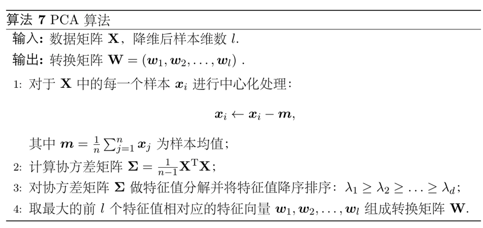

PCA 类：


|   **参数**   | **说明**                                                     |
| :----------: | :----------------------------------------------------------- |
| n_components | 一个整数，指定降维后的维数：       如果为“None”，则值为min{n_samples, n_features}       如果为“mle”，则使用Minka ‘s MLE算法来估计降维后的维数       如果为大于0小于1的浮点数，则值为降维后的维数占原始维数的百分比 |
|    whiten    | 对降维后的数据的每个特征进行标准化，使方差为1（白化），默认为False |
|  svd_solver  | 指定奇异值分解SVD的方法：       如果为“randomized”，则使用加快SVD的随机算法来应对数据量较大的情况       如果为“full”，则为传统SVD算法       如果为“arpack”，则为scipy库的sparse  SVD算法       如果为“auto”，则自动选择SVD算法来降维 |

|         **属性**          | **说明**       |
| :-----------------------: | -------------- |
|    explained_variance_    | 返回方差贡献值 |
| explained_variance_ratio_ | 返回方差贡献率 |

```python
## 导入癌症数据集及数据预处理
# 载入数据
from sklearn.datasets import load_breast_cancer
cancer = load_breast_cancer()

# 查看数据维度
print(cancer.data.shape)
# 数据维度为 （569, 30）

# 分割训练集和测试集
from sklearn.model_selection import train_test_split
X_train, X_test, y_train, y_test = train_test_split(cancer.data, cancer.target,
test_size=.2, random_state=10, stratify=cancer.target)		
# 数据标准化
from sklearn.preprocessing import StandardScaler
scaler = StandardScaler()

# 训练集标准化
scaler.fit(X_train)
X_train_scaled = scaler.transform(X_train)

# 测试集标准化
X_test_scaled = scaler.transform(X_test)
```

```python
## 建立 SVM 模型并查看模型效果
# 建立软间隔SVM模型
from sklearn.svm import LinearSVC

model_svm = LinearSVC(random_state=10)
model_svm.fit(X_train_scaled, y_train)

# 得到测试集预测标签
y_pred = model_svm.predict(X_test_scaled)

# 输出测试集预测正确率
model_svm.score(X_test_scaled, y_test)

# 绘制混淆矩阵热图
import seaborn as sns
from sklearn.metrics import confusion_matrix

ax = sns.heatmap(confusion_matrix(y_test, y_pred), annot=True, fmt='d', xticklabels=["malignant(0)","benign(1)"], yticklabels=["malignant(0)","benign(1)"])
ax.set_ylabel('True')
ax.set_xlabel('Predict')
ax.set_title('Confusion Matrix Heatmap')
# 得到测试集预测正确率为 ： 0.956
```

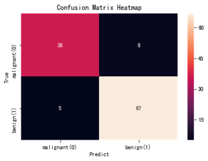

利用 PCA 进行降维：

```python
# PCA降维
from sklearn.decomposition import PCA

pca = PCA(n_components=15)
## 训练集降维
X_train_pca = pca.fit_transform(X_train_scaled)

## 测试集降维
X_test_pca = pca.transform(X_test_scaled)

# 查看方差贡献率
sum(pca.explained_variance_ratio_)

# 方差贡献率为：0.987
```

查看降维后的模型效果：

```python
# 再次建立软间隔SVM模型比较效果
model_svm.fit(X_train_pca, y_train)

## 得到测试集预测标签
y_pred_pca = model_svm.predict(X_test_pca)

## 输出测试集预测正确率
model_svm.score(X_test_pca, y_test)

# 绘制混淆矩阵热图
import seaborn as sns
from sklearn.metrics import confusion_matrix

ax = sns.heatmap(confusion_matrix(y_test, y_pred_pca), 
                 annot=True, fmt='d', 
                 xticklabels=["malignant(0)","benign(1)"], yticklabels=["malignant(0)","benign(1)"])
ax.set_ylabel('True')
ax.set_xlabel('Predict')
ax.set_title('Confusion Matrix Heatmap')
# 测试集预测正确率为：0.965
```

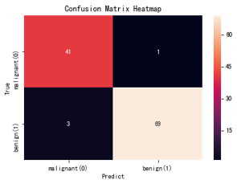

利用 PCA 将训练集降至2维进行可视化：

```python
# 降维
X_train_pca = PCA(n_components=2).fit_transform(X_train_scaled)

# 绘图
import matplotlib.pyplot as plt
plt.figure(figsize=(8, 8))
plt.scatter(X_train_pca[:, 0], X_train_pca[:, 1], c=y_train)
plt.xlabel('First principal component')
plt.ylabel('Second principal component')
# 从图片可以看出，两个类被很好的分开了
```

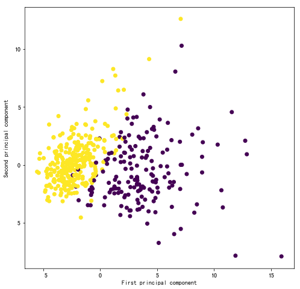

#### 线性判别分析（LDA）

线性判别分析（Linear Discriminant Analysis, LDA）是一种典型的有监督线性降维方法。

LDA的目标是利用样本的类别标签信息，找到一个利于数据分类的线性低维表示。

这个目标可以从两个角度来量化

- 第一个角度是使得降维后相同类样本尽可能近，使用类内离散度 (within-class scatter)度量
- 第二个角度是使得降维后不同类样本尽可能远，使用类间离散度 (between-class scatter)度量

LDA算法原理示意：

- 如下图所示，将原始样本分为两类并用不同图形表示
- 利用PCA方法，将得到直线𝑎，可见降维后的两类数据无法很好区分
- 利用LDA方法，能够找到直线𝑏，使得降维后两类数据很好地被区分开
- 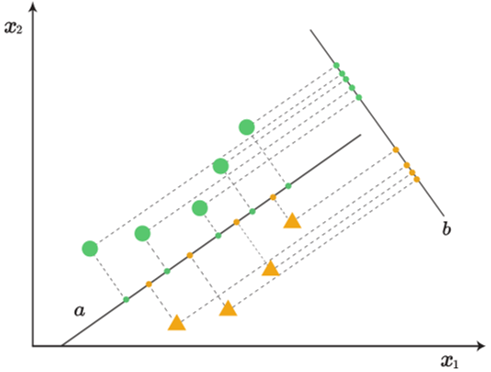

类内离散度和类间离散度：

- 类内离散度
  - 第 $c$ 类样本的类内离散度：$S_c = \overset{n_c}\sum\limits_{i=1}(x_i-m_c)(x_i-m_c)^T$
  - 总的类内离散度矩阵：$S_w=\sum\limits_{c=1}\frac{n_c}{n}S_c$
- 类间离散度
  - $S_b = \overset{C}\sum\limits_{c=1}\frac{n_c}{n}(m_c-m)(m_c-m)^T$

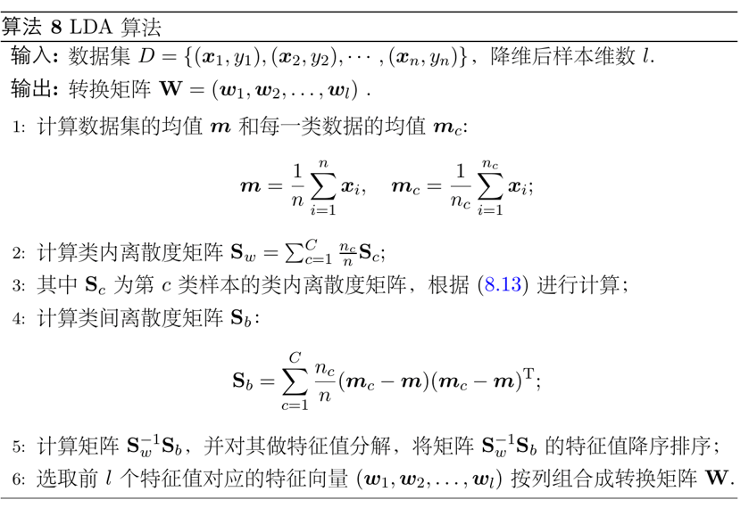

LinearDiscriminantAnalysis类：

| **参数**     | **说明**                                                     |
| ------------ | ------------------------------------------------------------ |
| solver       | 设定求解最优化问题的算法{‘svd’  （奇异值分解）,’lsqr’  （最小平方差算法）或‘eigen’  （特征值分解算法）} |
| shrinkage    | 正则化参数，增强泛化能力，默认为None，可设为‘auto’自主选择是否正则化或设为(0,  1)之间的值，但仅在solver=‘lsqr’或‘eigen’下才有意义 |
| priors       | 设定每个类别的先验概率，默认为None时认为各类先验概率等可能   |
| n_components | 设定数据降维后的维度，默认为None                             |

| **属性**                  | **说明**       |
| ------------------------- | -------------- |
| covariance                | 返回样本相关阵 |
| explained_variance_ratio_ | 返回方差贡献率 |

更多参数详情请参考官方文档：

[https://scikit-learn.org/stable/modules/generated/sklearn.discriminant_analysis.LinearDiscriminantAnalysis.html#sklearn.discriminant_analysis.LinearDiscriminantAnalysis](https://scikit-learn.org/stable/modules/generated/sklearn.discriminant_analysis.LinearDiscriminantAnalysis.html)

```python
## 利用 LDA 对鸢尾花数据集进行分类
# 载入数据
from sklearn import datasets
iris = datasets.load_iris()

X = iris.data
y = iris.target
target_names = iris.target_names

# 划分训练集和测试集
X_train,X_test,y_train,y_test = train_test_split(X, y, test_size=.2, random_state=10, stratify=y)

# 训练模型并评估模型
from sklearn.discriminant_analysis import LinearDiscriminantAnalysis

lda = LinearDiscriminantAnalysis(n_components=2)
lda.fit(X_train, y_train)

y_pred = lda.predict(X_test)

lda.score(X_test, y_test)

# 输出方差贡献率
print(sum(lda.explained_variance_ratio_))

# 测试集分类正确率：1.0
# 方差贡献率：0.99
```

将PCA和LDA的降维结果进行可视化并进行对比：

```python
# PCA降维
pca = PCA(n_components=2)
X_pca = pca.fit_transform(X_train)

# LDA降维
X_lda = lda.fit(X_train, y_train).transform(X_train)

# 设定点的颜色
colors = ['navy', 'turquoise', 'darkorange']

## 可视化
plt.figure(figsize=(10, 15))
plt.subplot(2, 1, 1)
for color, i, target_name in zip(colors, [0, 1, 2], target_names):
    plt.scatter(X_pca[y_train == i, 0], X_pca[y_train == i, 1], color=color, alpha=.8,
                label=target_name)
plt.legend(loc='best', shadow=False, scatterpoints=1)
plt.title('PCA of IRIS dataset')

plt.subplot(2, 1, 2)
for color, i, target_name in zip(colors, [0, 1, 2], target_names):
    plt.scatter(X_lda[y_train == i, 0], X_lda[y_train == i, 1], alpha=.8, color=color,
                label=target_name)
plt.legend(loc='best', shadow=False, scatterpoints=1)
plt.title('LDA of IRIS dataset')
```

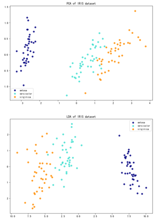

#### 非负矩阵分解（NMF）

非负矩阵分解(Non-negative Matrix Factorization)

一种主成分分析的方法，要求数据和成分都要非负，对图像数据十分有效。

NMF希望找到两个矩阵 $𝐖$ 和 $𝐇$，使得 $𝐖𝐇$ 与原数据 $X$ 的误差尽可能的少，即：
$$
\arg \min\limits_{W.H} \frac{1}{2} ||X-WH||^2_{Fro}
$$


其中 $||*||_{Fro}$ 表示 $Frobenius$ 范数，$X$ 代表 $N \times p$ 的数据矩阵，$W$ 是 $N\times r$ 的基矩阵， $H$ 是$r \times p$ 的权重矩阵， $r \leqslant \max⁡(N,p)$，其中 $X$，$W$ 和 $H$ 都是非负矩阵。

加入正则化项，其中，$\alpha$ 为 $l_1$ 与 $l_2$ c正则化项的参数，而 $\rho$ 为 $l_1$ 正则化项占总正则化项的比例：
$$
\arg \min\limits_{W,H} \frac{1}{2} ||X-WH||^2_{Fro} + \alpha \rho ||W||_1 + \alpha\rho||H||_1 + \frac{\alpha(1-\rho)}{2}||W||^2_{Fro} + \frac{\alpha(1-\rho)}{2}||H||^2_{Fro}
$$
加入正则化项后，常用的拟牛顿法和梯度下降法并不适用，Sklearn中采用坐标轴下降法进行优化。

算法流程请参见论文[《Algorithms for Non-negative Matrix Factorization》](https://papers.nips.cc/paper/1861-algorithms-for-non-negative-matrix-factorization.pdf)

NMF 类：

| **参数**     | **意义**                                                     |
| ------------ | ------------------------------------------------------------ |
| n_components | 设定数据降维后的维度                                         |
| init         | 初始化方法，’’random‘，nndsvd’，‘nndsvda’，‘nndsvdar’，‘custom’：  <br />’random‘：非负随机矩阵  <br />‘nndsvd'：非负双奇异值分解（更适合稀疏性）  <br />'nndsvda'：零填充平均值（当不需要稀疏时更好）  <br />'nndsvdar'：零填充小的随机值（当不需要稀疏时，通常更快，更准确地替代NNDSVDa)  <br />‘custom’：自定义矩阵 |
| solver       | 选择优化算法，分别是‘cd’：坐标下降法，’pg’：梯度投影算法     |
| alpha        | 总的正则化强度，默认为0                                      |
| l1_ratio     | l_1正则化项强度所占的比例，默认为0，取值在[0, 1]之间         |

$A T \& T$ 脸部数据集：

```python
	# AT&T脸部数据集包含1992年4月至1994年4月在实验室拍摄的一组脸部图像
	# 一共 400 张图片，来自 40 个不同的人，每个人 10 张图片，图片大小为 64*64

# 载入数据
from sklearn.datasets import fetch_olivetti_faces
dataset = fetch_olivetti_faces(shuffle=True, random_state=10)
faces = dataset.data

# 查看数据的维度
faces.shape		# 数据维度：(400, 4096）

# 展示数据
## 展示6张图片，按2行3列放置
n_row, n_col = 2, 3

# 人脸数据图片的显示大小
image_shape = (64, 64)

# 定义绘图函数
def plot_gallery(title, images, n_col=n_col, n_row=n_row):
    plt.figure(figsize=(10, 8))
    plt.suptitle(title, size=15)
    
    for i, comp in enumerate(images):
        plt.subplot(n_row, n_col, i + 1)
        
        # 以灰度图形式显示
        plt.imshow(comp.reshape(image_shape),cmap=plt.cm.gray)
        
        # 不显示坐标轴刻度
        plt.xticks(())
        plt.yticks(())

# 绘图展示数据
plot_gallery("Original Faces", faces[:6])
```

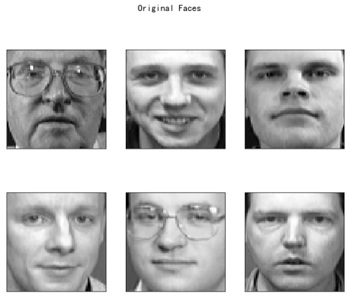

```python
# PCA降维
pca = PCA(n_components=6, whiten=True, random_state=10)
pca.fit(faces)
faces_pca = pca.components_

# 还原图像
plot_gallery("PCA Faces", faces_pca[:6])
```

面部特征较为模糊：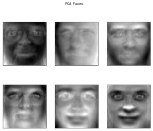

```python
# NMF降维
nmf = NMF(n_components=6, init='nndsvda', random_state=10)
nmf.fit(faces)
faces_nmf = nmf.components_

# 还原图像
plot_gallery("NMF Faces", faces_nmf[:6])
```

面部特征较为清晰：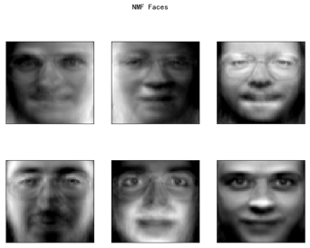

### 基于流形学习的降维方法

流形：一个低维空间在一个高维空间中被扭曲之后的结果。

低纬流形嵌入在高纬空间中。

一种形象的解释：“一块布是二维平面，把它在三维空间中扭一扭，就变成了一个流形”

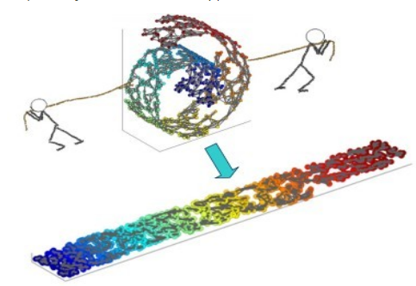

流形学习与降维：样本在高维空间分布复杂，但在局部上具有欧式空间的性质。在局部建立降维映射关系，再由局部推广到全局。数据被降至2维或3维，方便进行可视化。

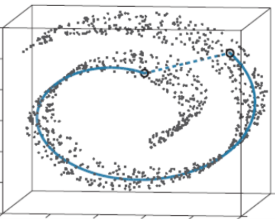

#### 局部线性嵌入（LLE）

算法思想：

- 将数据降到低维空间中，但是保留数据局部的线性关系
- 每一个样本点可以写成其 𝑘 个近邻点的线性组合，从高维嵌入（embedding）到低维时尽量保持局部的线性关系

算法步骤：

1. 选择近邻样本
   - 对于数据集中的每一个数据 $x_i$ ，使用 $K$ 近邻算法找到其 $k$ 个近邻样本
   - 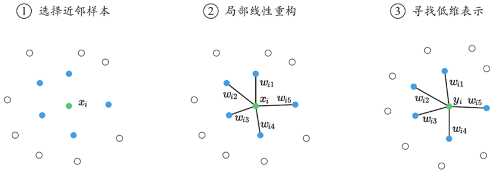
2.  局部线性重构
   - 假设样本之间的线性关系用矩阵 $W \in \mathbb{R}^{n×n}$ 表示，其元素 w_ij表示样本 𝑗 在重构样本为 𝑖 时的系数，需要最小化样本的重构误差 $\min\limits_{W} \overset{n}\sum\limits_{i=1} ||x_i-\sum\limits_{j}w_{ij}x_j||^2_2$ 
3.  寻找低纬表示
   - l使用权重 𝐖 ，找到数据的低维表示𝐘，需要最小化低维样本的重构误差 $\min\limits_{Y} \overset{n}\sum\limits_{i=1} ||y_i-\sum\limits_{j}w_{ij}y_j||^2_2$

LocallyLinearEmbedding类：

| **参数**            | **说明**                                                     |
| ------------------- | ------------------------------------------------------------ |
| n_neighbors         | 设置近邻参数k，默认值为5                                     |
| reg                 | 正则化项的系数，默认值为0.001                                |
| method              | 设置LLE在进行局部线性重构时使用的算法，可选择‘standard’, ‘hessian’, ‘modified’或’ltsa’ |
| neighbors_algorithm | 设定计算最近邻的算法{‘ball_tree’, ‘kd_tree’, ‘brute’或‘auto‘} |
| eigen_solver        | 设置求解特征值的算法{‘auto’, ‘arpack’或‘dense’}              |
| n_components        | 设置降维后的维数，一般设为2-5                                |

- Bandwidth参数可选，如果不输入，则使用estimate_bandwidth函数来计算。默认是使用样本两两之间距离的0.3分位数作为带宽

  Seeds参数同样，若没有设置且bin_seeding=True则使用get_bin_seeds函数来计算，默认使用bandwidth作为网格大小来选择起始点

  cluster_all为True时，孤立点会被分到最近的簇内；若为False，则对孤立点标记为-1

构建三维S型曲线：

```python
# 载入必要库
import matplotlib.pyplot as plt
from mpl_toolkits.mplot3d import Axes3D
from sklearn import datasets
%matplotlib inline

# 产生数据
n_points = 1000
X, color = datasets.samples_generator.make_s_curve(n_points, random_state=10)

# 绘图
fig = plt.figure(figsize=(12, 8))
ax = Axes3D(fig, elev=10, azim=80)
ax.scatter(X[:, 0], X[:, 1], X[:, 2], c=color, cmap=plt.cm.Spectral)
ax.set_title('S Curve', fontsize=20)
```

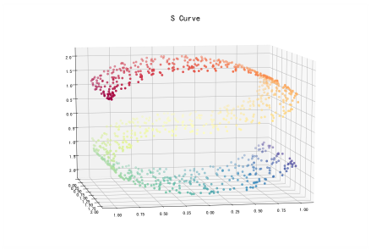

近邻数对降维结果的影响：

```python
from sklearn.manifold import LocallyLinearEmbedding

# 设置不同近邻数
n_neighbors = [5, 10, 15, 20, 50, 80] 
# 降至2维
n_components = 2

fig = plt.figure(figsize=(20, 8))

for i, number in enumerate(n_neighbors):
    # LLE进行降维
    Y = LocallyLinearEmbedding(n_neighbors=number, n_components=n_components, random_state=10).fit_transform(X)
 
    # 绘图
    ax = fig.add_subplot(231 + i)
    plt.scatter(Y[:, 0], Y[:, 1], c=color, cmap=plt.cm.Spectral)
    plt.title("n_neighbors = %s" % (number))
```

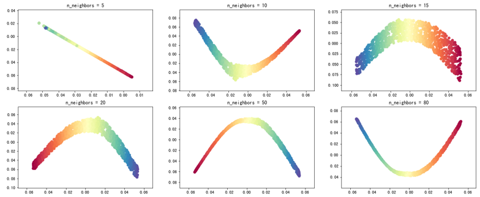

- 降维后颜色相近的点聚集在一起，证明保留了数据局部的线性关系

局部线性重构算法对降维结果的影响：

```python
# 设置不同的算法
methods = ['standard', 'ltsa', 'hessian', 'modified']

fig = plt.figure(figsize=(20, 5))

for i, methods in enumerate(methods):
    # LLE进行降维，近邻数固定为50
    Y = LocallyLinearEmbedding(n_neighbors=50, n_components=n_components, method=methods, random_state=10).fit_transform(X)
 
    # 绘图
    ax = fig.add_subplot(141 + i)
    plt.scatter(Y[:, 0], Y[:, 1], c=color, cmap=plt.cm.Spectral)
    plt.title("method = %s" % (methods))
```

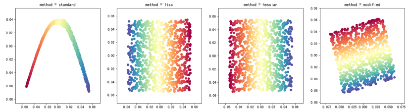

#### 多维标度法（MDS）

多维尺度变换(Multi-dimensional Scaling，MDS)的目标是找到数据的低维表示，使得降维前后样本之间的相似度信息尽量得以保留。

多维尺度变换能够只利用样本间的距离信息，找到每一个样本的特征表示，且在该特征表示下样本的距离与原始的距离尽量接近。

MDS算法原理及步骤：

- 假设数据集包含n个样本，数据集用 $n \times p$ 的矩阵 $X$ 表示，样本 $i$ 能够使用一个 $p$ 维的特征向量 $x_i$ 表示，样本间距离矩阵可以用 $n\times n$ 的矩阵 $D$ 表示，其元素 $d_ij$ 表示样本 $i$ 和样本 $j$ 的距离

- 假设 $z_i$ 为样本 $x_i$ 在低维空间的表示，即样本和样本的欧式距离为 $||z_i-z_j||_2$

- $MDS$ 的优化目标为： $\min\limits_{z_1,z_2,\dots,z_n} \sum\limits_{j \neq j}(||z_i-z_j||_2-d_{ij})^2$

- 由特征矩阵 $X$ 构造矩阵 $B=XX^T$ ，则 $B$ 中的元素可以表示为 $b_{ij}=x_i^Tx_j$ 

- 假设特征矩阵 $X$ 能完全保留距离信息，则 $d_{ij}^2 = (x_i-x_j)^T(x_i-x_j) = b_{ii} + b_{jj} - 2b_{ij}$

- 进一步计算出 $B$ 的公式为

  - $$
    b_{ij} = (\frac{1}{n}\overset{n}\sum\limits_{i=1}d_{ij}^2
    + \frac{1}{n}\overset{n}\sum\limits_{j=1}d_{ij}^2
    - \frac{1}{n^2}\overset{n}\sum\limits_{i=1}\overset{n}\sum\limits_{j=1}d_{ij}^2
    - d_{ij}^2)
    $$

- 对矩阵 $B$ 进行特征值分解 $B=U \wedge U^T$

- 取前 $l$ 个最大特征值构成对角矩阵 $\wedge_l$ 

- 用对应的特征向量按列组合成 $U_l$

- 降维后的数据矩阵计算方法 $Z=U_l \wedge_l^{\frac{1}{2}}$ 

MDS 类：

| **参数**      | **说明**                                                     |
| ------------- | ------------------------------------------------------------ |
| n_components  | 设置降维后的数据维度，默认为2                                |
| metric        | 布尔值，默认为True，使用距离度量；否则使用非距离度量SMACOF   |
| dissimilarity | 定义如何计算不相似度，‘euclidean’使用欧氏距离，‘precomputed’自行计算距离 |
| eps           | 浮点数，用于指定收敛阈值，默认为1e-3                         |

| **属性**   | **意义**                             |
| ---------- | ------------------------------------ |
| embedding_ | 返回原始数据集在低维空间中的嵌入矩阵 |

利用MDS将三维S型曲线将至2维：

```python
from sklearn.manifold import MDS

## 使用MDS降维并得到降维结果
mds = MDS(n_components, random_state=10)
Y = mds.fit_transform(X)

## 降维可视化
plt.figure(figsize=(8, 6))
plt.scatter(Y[:, 0], Y[:, 1], c=color, cmap=plt.cm.Spectral)
plt.title("MDS") 
```


根据城市间距离还原城市坐标：

```python
## 构建距离矩阵
import pandas as pd

d = pd.DataFrame([[0, 1064, 1055, 1187],
                  [1064, 0, 1675, 1717],
                  [1055, 1675, 0, 2192],
                  [1187, 1717, 2192, 0]], 
                 columns=['北京','上海','哈尔滨','兰州'], 
                 index=['北京','上海','哈尔滨','兰州'])
```

| **单位：公里** | **北京** | **上海** | **哈尔滨** | **兰州** |
| -------------- | -------- | -------- | ---------- | -------- |
| **北京**       | 0        | 1064     | 1055       | 1187     |
| **上海**       | 1064     | 0        | 1675       | 1717     |
| **哈尔滨**     | 1055     | 1675     | 0          | 2192     |
| **兰州**       | 1187     | 1717     | 2192       | 0        |

```python
## 使用MDS降维并得到降维结果
mds = MDS(n_components, random_state=10)
Y = mds.fit_transform(d)

## 降维可视化
plt.figure(figsize=(6, 4))
plt.scatter(Y[:, 0], Y[:, 1], c='red', s=20)
plt.title("根据城市间距离还原城市坐标") 
for item,city in enumerate(d.columns):
    plt.text(Y[item, 0]+20, Y[item, 1]+20, city)
```

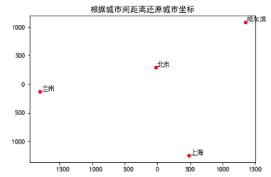

#### t-分布随机邻域嵌入算法（t-SNE）

SNM 的主要思想是假设x_i ,x_j是高维空间中的两个点，x_j的取值服从以x_i为中心方差为σ_i的高斯分布， x_i的取值服从以x_j为中心方差为σ_j的高斯分布，则x_i 与x_j 相似度的条件概率为：
$$
p_{(j|i)} = \frac{\exp(-||x_i-x_j||^2 / (2\sigma_i^2))}{\sum\limits_{k\neq i} exp(-||x_i-x_k||^2 / (2\sigma_i^2))}
$$
假设 $x_i,x_j$ 映射到低纬空间后对应 $y_i,y_j$ ，则它们之间的相似度为（低纬空间中的方差直接设置为 $\sigma_i=\frac{1}{\sqrt{2}}$）：
$$
q_{(j|i)} = \frac{\exp(-||x_i-x_j||^2)}{\sum\limits_{k\neq i} exp(-||x_i-x_k||^2)}
$$
若降维效果好，局部特征保留完整，则应有 $p_{j|i} = q_{j|i}$ ，所以优化两个分部之间的距离用 $KL$ 散度，目标函数如下：
$$
C=\sum\limits_{i}KL(P_i||Q_i) = \sum\limits_{i}\sum\limits_{j} p_{(j|i)}\log \frac{p_{(j|i)}}{q_{(j|i)}}
$$
**困惑度：**

困惑度可以反映一个点附近的有效近邻点个数：$Perp(P_i) = 2^{H(p_i)}$ (H(x)为熵)

$SNE$ 对困惑度的调整较为鲁棒，通常取值为 5-50 之间，确定后用二分搜索寻找合适的 $\sigma$

t-SNE ：

t分布随机邻域嵌入（t-Distribution Stochastic Neighbour Embedding）由Maaten于2008年提出，是基于2002年Hinton提出的随机邻域嵌入（ Stochastic Neighbour Embedding，SNE）的改进算法。

t-SNE较SNE做出如下调整：

- 加入对称性，使 $p_{ij}=p_{ji},q_{ij}=q_{ji}$ 
- 在低维空间下使用t分布替代高斯分布表示两点相似度，解决“拥挤”问题
- 为解决异常值问题，修正联合概率分布为： $p_{ij} = \frac{p_{(i|j)} + p_{(j|i)}}{2}$ 
- 使用 $t$ 分布后的相似度为 ：$q_{ij} = \frac{(1+|y_i-y_j|^2)^{-1}}{\sum\limits_{k\neq l}(1+|y_k-y_l|^2)^{-1}}$ 

TSNE 类：

| **参数**      | **说明**                                               |
| ------------- | ------------------------------------------------------ |
| n_components  | 降维后的维度，默认为2                                  |
| learning_rate | 学习率，默认为200.0，建议在[10,  1000]之间             |
| perplexity    | 困惑度，默认为30，数据集越大数值应越大，建议在5-50之间 |

| **属性**   | **说明**                             |
| ---------- | ------------------------------------ |
| embedding_ | 返回原始数据集在低维空间中的嵌入矩阵 |

利用t-SNE将三维S型曲线降至2维：

```python
from sklearn.manifold import TSNE

## 使用t-SNE降维并得到降维结果
tsne = TSNE(n_components, random_state=10)
Y = tsne.fit_transform(X)

## 降维可视化
plt.figure(figsize=(8, 6))
plt.scatter(Y[:, 0], Y[:, 1], c=color, cmap=plt.cm.Spectral)
plt.title("t-SNE")
```

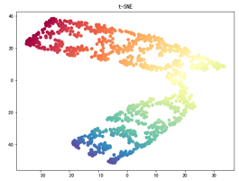

困惑度对t-SNE降维结果的影响：

```python
# 设置不同困惑度
perplexs = [2, 5, 15, 30, 50, 70]

fig = plt.figure(figsize=(20, 8))

for i, perplex in enumerate(perplexs):
    # t-SNE进行降维
    Y = TSNE(n_components, perplexity=perplex, random_state=10).fit_transform(X)
 
    # 绘图
    ax = fig.add_subplot(231 + i)
    plt.scatter(Y[:, 0], Y[:, 1], c=color, cmap=plt.cm.Spectral)
    plt.title("perplexity = %s" % (perplex))
```

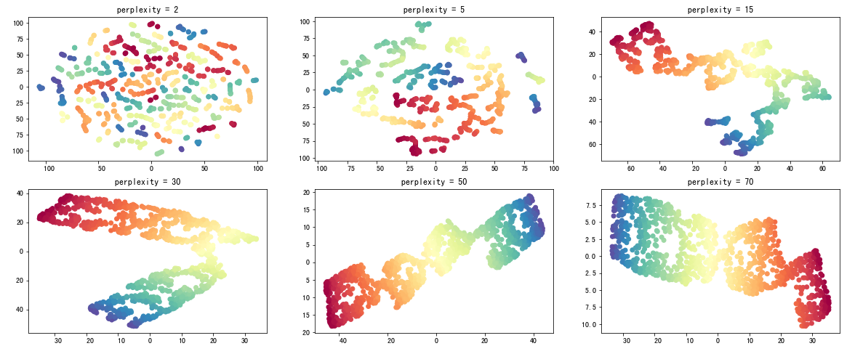

手写数字识别数据集的降维分析：

```python
# 载入手写数字识别数据集
from sklearn.datasets import load_digits

## 选择其中的五类
digits = load_digits(n_class=5)
X = digits.data
y = digits.target

# 展示数据
fig = plt.figure(figsize=(15, 8))

for item in range(5):
    ax = fig.add_subplot(151 + item)
    plt.imshow(X[item,:].reshape(8, 8), cmap=plt.cm.rainbow)
```

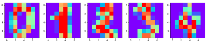

```python
# 构建2D展示函数
import numpy as np

def plot_embedding_2d(X, title):
    ## 数据归一化
    x_min, x_max = np.min(X,axis=0), np.max(X,axis=0)
    X = (X - x_min) / (x_max - x_min)

    ## 绘制散点图
    fig = plt.figure(figsize=(12, 8))
    for i in range(X.shape[0]):
        plt.text(X[i][0], X[i][1],str(digits.target[i]),
                 color=plt.cm.Set1(y[i] / 5.),
                 fontdict={'size': 9})
    ## 添加标题
    plt.title(title)
tsne = TSNE(n_components=2, random_state=10)
Y = tsne.fit_transform(X)
plot_embedding_2d(Y, "t-SNE 2D")

# 构建3D绘图函数
def plot_embedding_3d(X, title):
    
    ## 数据归一化
    x_min, x_max = np.min(X,axis=0), np.max(X,axis=0)
    X = (X - x_min) / (x_max - x_min)
    
    ## 绘制散点图
    fig = plt.figure(figsize=(12, 8))
    ax = Axes3D(fig, elev=10, azim=60)
    for i in range(X.shape[0]):
        ax.text(X[i][0], X[i, 1], X[i,2],str(digits.target[i]),
                 color=plt.cm.Set1(y[i] / 5.),
                 fontdict={ 'size': 9})
    ## 添加标题
    plt.title(title)
tsne = TSNE(n_components=3, random_state=10)
Y = tsne.fit_transform(X)
plot_embedding_3d(Y, "t-SNE 3D")
```

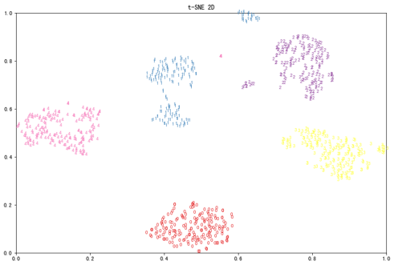

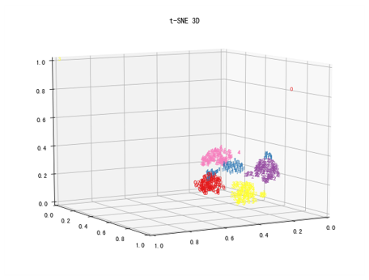

## **机器学习流水线**

数据预处理、建立训练并评估K近邻模型

```python
# 读取数据
import pandas as pd
diabetes = pd.read_csv('./input/india_diabetes.csv')

# 目标与数据分离
X = diabetes.drop(['Outcome'], axis=1)
y = diabetes['Outcome']

# 分割训练集和测试集
from sklearn.model_selection import train_test_split
X_train,X_test,y_train,y_test = train_test_split(X, y, test_size=.2, random_state=10)

# 标准化
from sklearn.preprocessing import StandardScaler
scaler = StandardScaler().fit(X_train)

## 对训练集进行标准化
X_train_scaled = scaler.transform(X_train)

## 对测试集进行相同标准化
X_test_scaled = scaler.transform(X_test)

from sklearn.neighbors import KNeighborsClassifier
# 建立模型
model_knn = KNeighborsClassifier()

# 训练模型
model_knn.fit(X_train_scaled, y_train)

# 评价模型
print("测试集分类正确率：", round(model_knn.score(X_test_scaled, y_test), 2))
```

有没有什么方法可以把一些步骤整合起来，减少代码量?

### Pipeline 类

Sklearn 中 `pipeline` 模块中的 `Pipeline` 类，实现机器学习过程中全部步骤的流式化封装和管理，大幅减少代码量。

Pipeline通常步骤：

1. 数据预处理学习器
2. 特征选择学习器
3. 执行预测的学习器

* 除最后一个学习器，其余学习器必须有 `transform` 方法，用于数据转换。

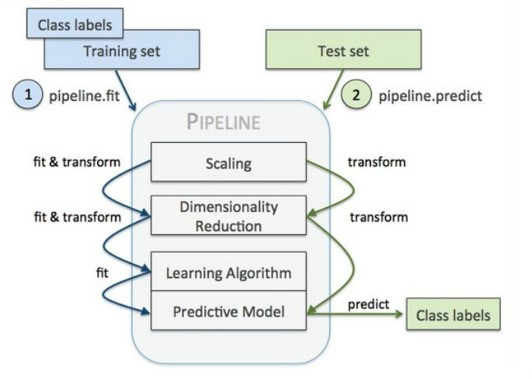

| **参数** | **说明**                                                 |
| -------- | -------------------------------------------------------- |
| steps    | 学习器列表，按顺序以元组列表的方式给出，最后一个是估计器 |

| **属性**   | **说明**                                               |
| ---------- | ------------------------------------------------------ |
| name_steps | 查看每个步骤的名称和参数，字典对象，键为名称，值为参数 |

| **方法**             | **说明**                                 |
| -------------------- | ---------------------------------------- |
| fit(X, y)            | 训练模型                                 |
| fit_predict(X,  y)   | 先训练模型，再进行预测                   |
| fit_transform(X,  y) | 先训练模型，再利用最后一个学习器进行转换 |
| predict(X)           | 进行预测                                 |
| predict_log_proba(X) | 预测对数概率                             |
| predict_proba(X)     | 预测概率                                 |
| score(X, y)          | 模型评价                                 |
| set_params( )        | 修改学习器的参数                         |

构建机器学习流水线：

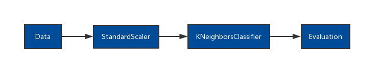

```python
from sklearn.pipeline import Pipeline

# 构建流水线
pipe = Pipeline(steps=[('scaler',StandardScaler()), 
                       ('knn', KNeighborsClassifier())])

# 训练
pipe.fit(X_train, y_train)

# 评估
print("测试集分类正确率：", round(pipe.score(X_test, y_test), 2))

""" 运行结果：
测试集分类正确率：0.77
"""
# 之前这些步骤一共编写了6行代码
```

```python
# 查看具体步骤
pipe.named_steps['knn']
"""
KNeighborsClassifier(algorithm='auto', leaf_size=30, metric='minkowski',
           metric_params=None, n_jobs=1, n_neighbors=3, p=2,
           weights='uniform')
"""

# 修改学习器参数
pipe.set_params(knn__weights='distance')
"""
Pipeline(memory=None,
     steps=[('scaler', StandardScaler(copy=True, with_mean=True, with_std=True)), ('knn', KNeighborsClassifier(algorithm='auto', leaf_size=30, metric='minkowski',
           metric_params=None, n_jobs=1, n_neighbors=3, p=2,
           weights='distance‘))])
"""
```

在流水线中使用网格搜索：

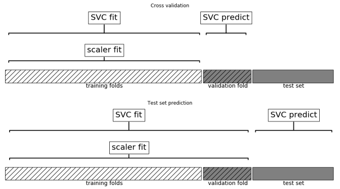

其中，交叉验证在最外层。对于数据集，也要先分割数据集，再执行Pipe

```python
from sklearn.model_selection import GridSearchCV

# 设置参数网络
param_grid = {'knn__n_neighbors': [2, 4, 6, 8, 10],
              'knn__weights': ['uniform', 'distance']}
	# 键的形式为：“步骤名称__参数名称”

# 网格搜索
grid_search = GridSearchCV(estimator=pipe, param_grid=param_grid, cv=5)
grid_search.fit(X_train, y_train)

# 测试集上的得分
grid_search.score(X_test, y_test)
"""
测试集上分类正确率：0.79                           

最优参数：{'knn__n_neighbors': 6, 'knn__weights': 'distance'}
"""
```

在网格搜索中加入学习器的选择：

```python
# 在网格搜索中加入学习器的选择
from sklearn.preprocessing import MinMaxScaler

# 设定需要选择的学习器
scale_selector = [StandardScaler(), MinMaxScaler()]

# 设置参数网络
param_grid = {'scaler': scale_selector,
              'model__n_neighbors': [2, 4, 6, 8, 10],
              'model__weights': ['uniform', 'distance']}

# 网格搜索
grid_search = GridSearchCV(estimator=pipe, param_grid=param_grid, cv=5)
grid_search.fit(X_train, y_train)

# 查看最优学习器
grid_search.best_estimator_

# 模型评价
grid_search.score(X_test, y_test)
"""
测试集上分类正确率：0.78
"""
```

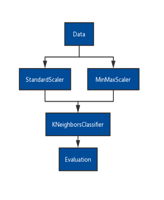

```python
# 在网格搜索中加入学习器的选择
from sklearn.linear_model import LogisticRegression
from sklearn.svm import SVC

# 设定需要选择的学习器
model_selector = [SVC(), LogisticRegression(random_state=10)]

# 设置参数网络
param_grid = {'scaler':scale_selector,
              'model': model_selector,
              'model__class_weight':['balanced', 
                                      None],
              'model__C':[0.01, 0.1, 
                          0.2, 0.5, 1]}

# 网格搜索
grid_search = GridSearchCV(estimator=pipe, param_grid=param_grid, cv=5)
grid_search.fit(X_train, y_train)
"""
测试集上分类正确率：0.79
"""
```

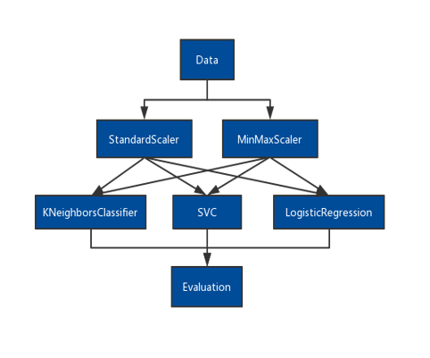

在流水线中加入特征选择并进行网格搜索：

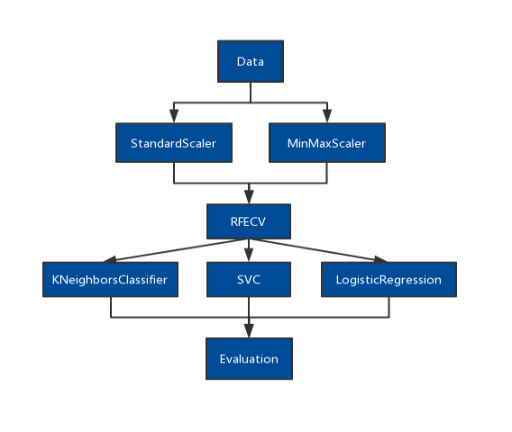

```python
from sklearn.feature_selection import RFECV
from sklearn.tree import DecisionTreeClassifier

# 在流水线中加入特征选择
pipe_new = Pipeline(steps=[('scaler',StandardScaler()), 
                           ('selector', RFECV(DecisionTreeClassifier(random_state=10), cv=5)),
                           ('model', KNeighborsClassifier())])

# 设置参数网络
param_grid = {'scaler':scale_selector,
              'model': model_selector,
              'model__class_weight':['balanced', None],
              'model__C':[0.01, 0.1, 0.2, 0.5, 1]}  

# 网格搜索
grid_search = GridSearchCV(estimator=pipe_new, param_grid=param_grid, cv=5)
grid_search.fit(X_train, y_train)

# 访问步骤属性，查看特征排名
pd.Series(grid_search.best_estimator_.named_steps['selector'].ranking_, index=X_train.columns)
"""运行结果如下："""
```

|                 **特征** | **排名** |
| -----------------------: | -------- |
|              Pregnancies | 2        |
|                  Glucose | 1        |
|            BloodPressure | 1        |
|            SkinThickness | 3        |
|                  Insulin | 4        |
|                      BMI | 1        |
| DiabetesPedigreeFunction | 1        |
|                      Age | 1        |

在流水线中加入特征降维并进行网格搜索：


```python
from sklearn.decomposition import PCA

# 在管道中加入PCA
pipe_new = Pipeline(steps=[('scaler',StandardScaler()), 
                           ('decomposition', PCA(3)),
                           ('model', KNeighborsClassifier())])

# 设置参数网络
param_grid = {'scaler':scale_selector,
              'model': model_selector,
              'decomposition__n_components':[2, 3, 4, 5, 6],
              'model__class_weight':['balanced', None],
              'model__C':[0.01, 0.1, 0.2, 0.5, 1]}  
# 网格搜索
grid_search = GridSearchCV(estimator=pipe_new, param_grid=param_grid, cv=5)
grid_search.fit(X_train, y_train)   

# 查看方差贡献率
grid_search.best_estimator_.named_steps['decomposition'].explained_variance_ratio_.sum()
"""
方差贡献率：0.90
"""
```

构建复杂机器学习流水线：

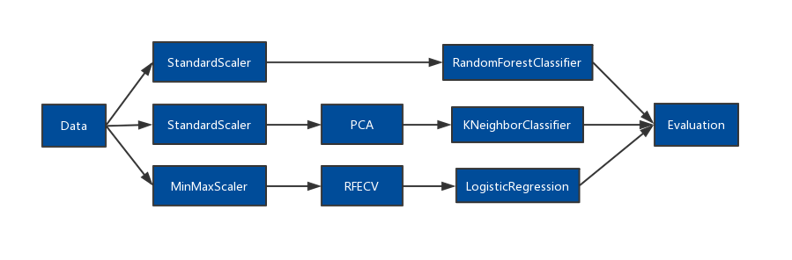

```python
# 构建流水线
pipe_rf = Pipeline(steps=[('scaler1', StandardScaler()),
                          ('model1', RandomForestClassifier(n_estimators=100,            
                                                            random_state=10))])

pipe_knn = Pipeline(steps=[('scaler2', StandardScaler()),
                           ('decomposition1', PCA(n_components=6)),
                           ('model2', KNeighborsClassifier(n_neighbors=6,  
                                                           weights='distance'))])

pipe_lr = Pipeline(steps=[('scaler3', MinMaxScaler()),
                          ('decomposition2',     
                           RFECV(DecisionTreeClassifier(random_state=10), cv=5)),
                          ('model3', LogisticRegression(random_state=10))])

# 创建流水线名称字典
pipe_dic = {0: '随机森林', 1: '加权K-近邻', 2:'逻辑回归'}
                           
# 创建流水线列表
pipelines = [pipe_rf, pipe_knn, pipe_lr]

# 训练流水线
for pipe in pipelines:
    pipe.fit(X_train, y_train)

# 模型评价
for index, item in enumerate(pipelines):
    print('%s在测试集上分类正确率: %.3f' % (pipe_dic[index], 
                                         item.score(X_test, y_test)))
"""
随机森林在测试集上分类正确率: 0.825
加权K-近邻在测试集上分类正确率: 0.780
逻辑回归在测试集上分类正确率: 0.740
"""
```

make_pipeline 类：

* Pipeline 类需要为每一个步骤提供用户自行指定的名称
* make_pipeline 类可以根据每个步骤所属的类别为其自动命名
* 其包含的属性和方法与 Pipeline 类一致

| **参数** | **说明**         |
| -------- | ---------------- |
| steps    | 按顺序给出学习器 |

使用 make_pipeline 构建流水线：

```python
# 载入库函数
from sklearn.pipeline import make_pipeline

# 构建流水线
model_LR = LogisticRegression(random_state=10)
pipe_make = make_pipeline(StandardScaler(), 
                          RFECV(model_LR, cv=5), 
                          KNeighborsClassifier())

# 训练模型
pipe_make.fit(X_train, y_train)

# 具体查看每个步骤
pipe_make.named_steps
"""
{'kneighborsclassifier': KNeighborsClassifier(algorithm='auto', leaf_size=30, metric='minkowski',
            metric_params=None, n_jobs=1, n_neighbors=5, p=2,
            weights='uniform'), 
 'rfecv': RFECV(cv=5,estimator=LogisticRegression(C=1.0, class_weight=None, dual=False, fit_intercept=True,
           intercept_scaling=1, max_iter=100, multi_class='ovr', n_jobs=1,
           penalty='l2', random_state=10, solver='liblinear', tol=0.0001,
           verbose=0, warm_start=False),
 n_jobs=1, scoring=None, step=1, verbose=0), 
 'standardscaler': StandardScaler(copy=True, with_mean=True, with_std=True)}
""" # 各步骤自动命名的名称
```

### FeatureUnion 类

- 将若干个**transformer**（转换器）对象组合成一个新的**transformer**
- 一个**FeatureUnion**对象接受输入一个**transformer**对象列表
- 训练阶段，列表中的**transformer**并行应用于数据，然后将结果横向连接，拼接成一个更大的特征向量矩阵
- 有利于将多个特征提取机制组合到一个**transformer**中

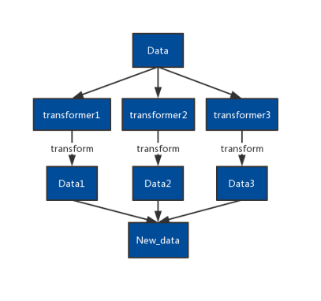

| **参数**            | **说明**                                                     |
| ------------------- | ------------------------------------------------------------ |
| transformer_list    | 应用于数据的transformer对象列表                              |
| transformer_weights | 设置每个transformer的权重，字典对象，键为transformer的名称，值为权重 |

| **属性**            | **说明**                |
| ------------------- | ----------------------- |
| transformer_list    | 查看transformer对象列表 |
| transformer_weights | 查看transformer的权重   |

| **方法**             | **说明**               |
| -------------------- | ---------------------- |
| fit(X, y)            | 训练模型               |
| fit_transform(X,  y) | 先训练模型，再进行转换 |
| predict(X)           | 进行预测               |
| get_params([deep])   | 获取transformer的参数  |
| set_params()         | 修改transformer的参数  |
| transform(X)         | 进行转换               |

构建 FeatureUnion ：

```python
from sklearn.pipeline import FeatureUnion
from sklearn.preprocessing import PolynomialFeatures

# 构建FeatureUnion
combined_features = FeatureUnion([('pca', PCA(n_components=3)),
                                  ('poly', PolynomialFeatures(degree=2, include_bias=False))])

X_features = combined_features.fit_transform(X_train)

# 查看转换后数据的维度
X_features.shape
"""
转换后数据的维度：(800, 47)
"""
```

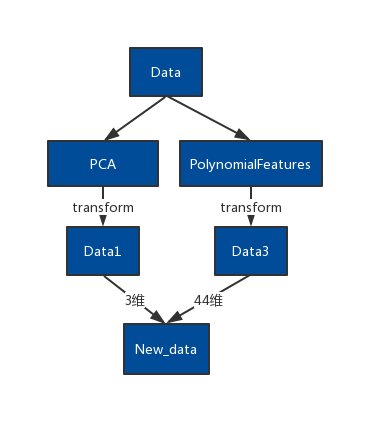

（上图中的 New_data 有47维）

将 FeatureUnion 加入流水线：

```python
# 构建流水线
pipeline = Pipeline([("features", combined_features), ("lr", LogisticRegression(random_state=10))])

param_grid = dict(features__pca__n_components=[1, 2, 3,  
                                               4, 5, 6],
                  lr__C=[0.1, 0.2, 0.5, 1],
                  lr__class_weight=[None, 'balanced'],
                  lr__penalty=['l1', 'l2'])

grid_search = GridSearchCV(pipeline, param_grid=param_grid, cv=5)
grid_search.fit(X_train, y_train)

# 查看最优流水线在测试集上的表现
grid_search.score(X_test, y_test)
```

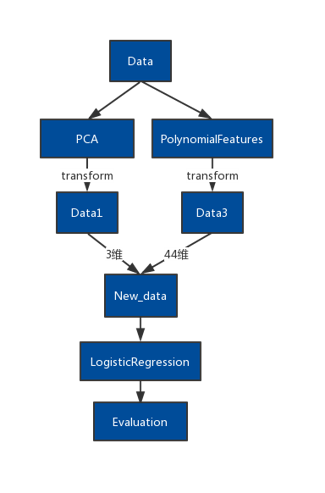

make_union 类：

- **FeatureUnion**类需要为每一个**transformer**提供用户自行指定的名称
- **make_union**类可以为每个**transformer**自动命名
- 其包含的属性和方法与**FeatureUnion**类一致

使用 make_union 构建 FeatureUnion ：

```python
from sklearn.pipeline import make_union

# 构建FeatureUnion
combined_features = make_union(PCA(n_components=3), PolynomialFeatures(degree=2, include_bias=False))

# 查看每个transformer的名称
combined_features.transformer_list
"""
[('pca',PCA(copy=True, iterated_power='auto', n_components=3, random_state=None,svd_solver='auto', tol=0.0, whiten=False)),
 ('polynomialfeatures',PolynomialFeatures(degree=2, include_bias=False, interaction_only=False))]
""" # 各transformer自动命名的名称
```