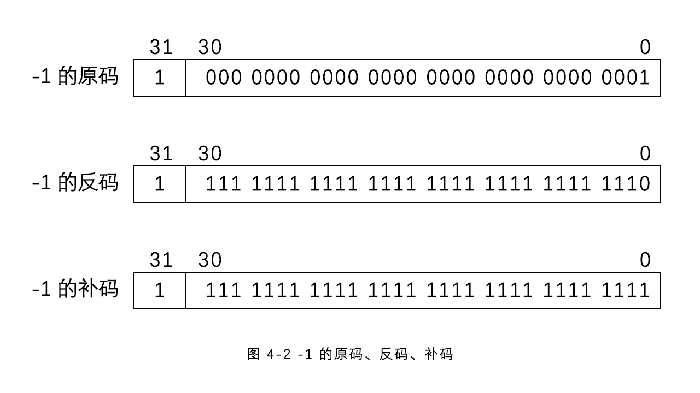
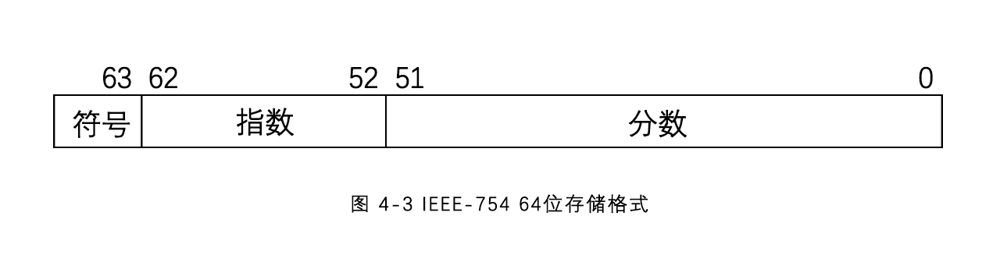

# 4  基本数据类型

在C语言中，数据类型指的是用于声明不同类型的变量或函数的一个广泛的系统。变量的类型决定了变量存储占用的空间，以及如何解释存储的位模式。

C语言中主要的数据类型大致分为以下几种：

* 基本数据类型 
  * 整型类型	(int 、short 、long)
  * 浮点数类型    (float 、double)
  * 字符类型    (char)
* 构造数据类型（有时一些构造类型也说复合型数据类型）
  * 数组
  * 结构体、联合体    (struct 、union)
  * 枚举类型    (enum)
* 指针类型    (char* 、int* 、int**)
* void 类型（空类型）

（一些材料也会将指针、数组、结构体等类型称为派生类型，而将枚举类型但分为一类，也有些会将枚举类型归结为基本数据类型）

## 4.0  变量与常量

在C语言中，所有的数据、表达式都有其数据类型，数据类型的实质是规定了对应类型数据在内存中的存储方式和编码方式。数据又分为常量与变量两种：

* 常量，又叫字面量(literals)，它通过在源程序中不同的书写格式来区分数据类型，常量的类型与值都不能在程序运行中被改变。
* 变量，通过在定义时指定从而区分它的数据类型，变量的数据类型也不能在程序运行中改变，但它的值可以被改变。

<center>表 4 - 1 常量与变量的对比</center>
|   项目   |                     常量                     |           变量           |
| :------: | :------------------------------------------: | :----------------------: |
|   类型   |           通过不同的书写格式来确定           |        声明时确定        |
|   存储   | 除了字符串常量，其他类型常量不会在内存中存储 |      会在内存中存储      |
|    值    |                   不可改变                   |         可以改变         |
| 重复使用 |                 不可重复使用                 | 通过变量名，可以重复使用 |

程序中通过变量的名字来区分不同的变量，变量名的命名要符合“标识符”的命名规则。“标识符”是C语言中的一个概念，指用来区分程序员自己定义的各种语法单元，比如变量名、函数名、构造数据类型名、宏名等。“标识符”的命名规则如下：

* 只能使用英文字母、数字和下划线进行组合，且不能以数字开头。
* 不能使用关键字。
* C99标准前，标识符的前31个字符能区分标识符；在C99标准之后，放宽到63个字符。

需要注意，C语言对字母大小写敏感。

<center>表 4 - 2 C语言关键字表</center>
| auto声明自动变量 | else | long | swich | _Atomic** |
| :--------------: | :----: | :----: | :-----: | :---------: |
| break | enum | register | typedef | _Bool* |
| case | extern | restrict* | union | _Complex* |
| char | float | return | unsigned | _Generic** |
| const | for | short | void | _Imaginary* |
| continue | goto | signed | volatile | _Noreturn** |
| default | if | sizeof | while | _Static_assert** |
| do | inline* | static | _Alignas** | _Thread_local** |
| double | int | struct | _Alignof** | |

<center>* 表示从C99标准以后，** 表示自从C11标准以后</center>
C语言是强类型语言，就是所有的变量在使用前都必须声明其类型。所有的变量声明都是使用“类型名 声明符 初始化列表”的形式，比如：

<pre name="code" class="C">	int a, *b = NULL;</pre>
其中，“ int ”是类型名，“ a ”是声明符，“ *b ”是声明符， NULL 是 b 的初始化。它声明了一个 int 型变量 a ，一个 int 型指针变量 b ，并将 b 初始化成宏值 NULL 。

<pre>	const int * foo(void);</pre>
其中，“ int ”是类型名， const 是类型修饰符， “ * foo(void) ”是声明符。它声明一个类型为 const int 指针类型的无参数函数 foo 。

<pre>	enum COLOR {RED, GREEN, BLUE} c;</pre>
其中，“ enum COLOR {RED, GREEN, BLUE} ”是类型名，“ c ”是声明符。它声明一个枚举 COLOR 类型变量 c 。

## 4.1 整数

### 4.1.0 int 型变量

整数是最常见的数据类型，其基本型为 int ，它表示一个有符号的整数。 int 型常量用十进制、八进制和十六进制表示。由于八进制和十六进制可以很方便地和二进制进行转换，主要用于二进制表达的场景，比如位运算等。

* 十进制时，首字符为1~9，后由若干个字符0~9组成。
* 八进制时，使用0作为首字符，后由若干个字符0~7组成。
* 十六进制时，使用 0x 或 0X 作为前缀字符，后由若干个字符0~9、a~f或A~F组成。

### 4.1.1 int型变量的存储和编码

计算机中使用的二进制表达一个整数， int 型变量在32位编译器上，使用4个字节存储一个 int 型整数，其存储和编码格式如图4-1所示。它使用第31位作为符号位，0表示非负，1表示负数。从0到31位为数据位，其编码方式使用补码。


补码的计算规则为，**如果整数为非负，补码与原码相同**，即原始的二进制表达；**如果整数为负，其补码等于反码（原码的数据位按位取反），再加1** 。-1 的补码计算规则如图4-2所示



使用补码来表达整数，或者说整数在内存中使用补码进行编码，其目的是简化计算电路的设计，比如计算“1+(-1)”，计算机在使用简单的二进制加法电路的情况下，原码会出现错误结果，相比较之下，使用原码的话就需要添加更加复杂的修正电路来确保正确性，而使用补码，则可以直接使用二进制加法电路进行加法运算。

根据整数的编码方式，可以得到 int 型整数的表示范围为 -2^31 ~ 2^31 。

### 4.1.2 int 型变量的定义和初始化

int 型变量在声明时，32位编译器会使用一个4字节的空间，用于存储这个 int 型变量。程序中可以使用这个变量名来访问这个空间，并按 int 型的编码规则对这4个字节的内容进行解析。int型变量的声明与初始化如下：

```c
	int a;
	// 声明一个 int 型变量，变量名为 a 
	int a, b;
	// 声明两个 int 型变量，变量名分别为 a 和 b 
	int a, b=1;
	// 声明两个 int 型变量 a 和 b ，并把 b 的值初始化为1
	int a=1, b=a;
	// 声明两个 int 型变量 a 和 b ，并把 a 的值初始化为1，把 b 初始化和 a 一样
```

注意，变量如果不被初始化，那么它的值不确定。如果使这个变量去初始化其他变量，其他变量的值同样不确定。可以使用前面声明的变量的值初始化另一个变量，但反之不然。

### 4.1.3 int类型的修饰符

int 类型可以通过类型修饰符得到其他的整数类型，类型修饰符主要有两种：

* 符号：signed、unsigned
* 长度：short、long、long long

两种修饰符可以组合使用，并且在使用过程中可以省略 int 类型符。比如 unsigned int <=> unsigned。由于默认都是 signed 的，所以在使用中很少写 signed。C标准规定各类型所占位数：short <= int <= long <= long long。

各类型所占位数与编译器和基于的操作系统相关，目前常用的32位编译器都基于 ILP32 ，即4/4/4 ( int, long和指针都是32位)的。各类型整数在C标准和 ILP32 系统中所占位数如表 4 - 3所示：

<center>表 4 - 3 整数类型在各系统中所占位数</center>
|                  整数类型                   | C标准  | ILP32 |
| :-----------------------------------------: | ------ | ----- |
|        short int、unsigned short int        | 至少16 | 16    |
|              int、unsigned int              | 至少16 | 32    |
|         long int、unsigned long int         | 至少32 | 32    |
| long long int (C99)、unsigned long long int | 至少64 | 64    |

  在 ILP32 系统中，由于 long 和 int 所占位数相同，所以很少用 long ；short也只用在一些特殊场合（比如内存有限），一般常用的类型有 unsigned int 、 long long 、unsigned long long 。其类型的数据范围如下：

<center>表 4 - 4 各类型在 ILP32 系统中的数据范围</center>
| 类型               | 数据范围       |
| :----------------- | -------------- |
| unsigned int       | 0 ~ 2^32-1     |
| long long          | -2^63 ~ 2^63-1 |
| unsigned long long | 0 ~ 2^64-1     |

为了和 int 型进行区分，其他类型的整数常量采用加后缀的方式，同时他们也都可以用十进制、八进制和十六进制来表示，long long 的两种类型的后缀建议使用大写，以方便区分字符“1”与“l”。

<center>表 4 - 5 各整数类型的常量后缀及表达</center>
| 类型               | 后缀       | 十进制 | 八进制 | 十六进制 |
| ------------------ | ---------- | ------ | ------ | -------- |
| unsigned int       | u 或 U     | 1u     | 052u   | 0x3fu    |
| long long          | ll 或 LL   | 1LL    | 052LL  | 0x3fLL   |
| unsigned long long | llu 或 LLU | 1LLU   | 052LLU | 0x3fLLU  |

与 int 类型类似，这3种类型也使用 scanf 和 printf 函数来进行输入和输出，其格式描述符（详细说明在后面 4.5 ）如下表：

<center>表 4 - 6 个整数类型格式描述符</center>
| 类型               | 十进制 | 八进制 | 十六进制     |
| ------------------ | ------ | ------ | ------------ |
| unsigned int       | %u     | %o     | %x 或 %X     |
| long long          | %lld   | %llo   | %llx 或 %LLX |
| unsigned long long | %llu   | %llo   | %llx 或 %LLX |

一些比较老的编译器，不支持 long long ，它们内部定义了类似 __int64 类型来表示64位有符号整数，其格式描述符为  “%I64d” 。另外，如果在一些老的操作系统上使用 MinGW 编译器，由于 MinGW 直接使用 Windows 的运行库，在使用 long long 类型时，使用 “%lld” 格式描述符会出错，也需要使用 “%I64d” 的格式描述符。

## 4.2 浮点数

浮点数，也叫实数，相对于整数就是多了小数点。C语言中有三种数据类型用来表达浮点数，即 float、double、long float，中文成称为单精度浮点、双精度浮点和扩展精度浮点，其中 double 类型较为常用。

### 4.2.0 浮点数常量

浮点数类型的常量都有两种形式，小数形式和科学计数法形式。double 常量的小数形式为“整数 . 小数”，比如 1.23 。如果整数或者小数部分为0，可以省略，比如 1. 和 .23 分别表示 1.0 和 0.23 。double 常量的科学计数法形式为“ **有效数字e指数** ”或者“ **有效数字E指数** ”，表示**有效数字 * 10^(指数)** ，比如 1e-6 或者 1.23e3 。（C99标准还提供一种 p 格式的科学计数法，支持16进制浮点数）

 float 和 long double 类型的常量和 double 类型的表达相似，只是通过在常量后面加后缀的方式进行区分， float 类型的后缀为“ f ”， long double 的后缀为“ L ”。比如 1.23f 和 1e-6f 都表示两个 float 常量；而 1.23L 和 1e-6L 表示两个 long double 常量。

### 4.2.1 浮点数变量

浮点数变量的定义和初始化与 int 型相似，只是将类型名换成了浮点数对应的类型，比如 double 。

```c
	double a;
	double a, b;
	double a, eps=1e-6;
	// 声明两个 double 变量 a 和 eps ，并将 eps 初始化为 0.000001
	double a=1.0, b=a+0.1;
	float a=1e8, b=a-1;
	// 浮点数变量在初始化和运算中要注意有效数字的概念，比如上面一句，因为 float 的有效数字只有 7 位， b 并不是 99999999.0 而依然是 100000000.0 。

```

### 4.2.2 浮点数的存储与编码

 double 变量使用 IEEE 754 标准的64位存储和编码方式，占8个字节的空间，其存储和编码格式如下图所示。



具体的编码规则比较复杂，详见 https://en.wikipedia.org/wiki/IEEE_754-1985 。 double 类型的数据范围是 ±2.23 * 10^(-308) ~ ±1.80 * 10(308)，大约15~16个有效数字。 double 不能表达数据范围内所有的数，即使是所有的整数也不能。对于浮点数精度，更有意义的是有效数字的感念，而不是数据范围。

 float 使用 IEEE 754 标准的 32 位存储和编码方式，占4个字节的空间，其存储和编码格式与 double 类似，只是指数和分数所占的位数变少，分别占8位和23位。 float 类型的有效数字约为7，数据范围为±1.18 * 10^(-38) ~ ±3.4 * 10(38) 。由于 float 本身精度有限，所以只用于对计算速度要求更高的场景中，一般场景中使用 double 较为常见。

 long double 使用 IEEE 754 标准的扩展浮点数类型，但标准只是规定精度和范围不能比 double 差，并未规定具体的长度。

### 4.2.3 浮点数的输入输出

浮点数的输入也是用 scanf 函数，其格式描述符如下表：

<center>表 4 - 7 浮点数的 scanf 格式描述符</center>
| 类型        | 格式描述符 %           |
| ----------- | ---------------------- |
| float       | f, F, e, E, g, G       |
| double      | lf, lF, le, lE, lg, lG |
| long double | Lf, LF, Le, LE, Lg, LG |

无论采用哪种格式描述符，用户输入的时候，既可以采用小数形式，也可以采用科学计数法的形式，对于输入结果是一样的。需要注意的是， double 和 long double 的格式描述符前缀分别是 l 和 L ，两者不能通用，如果混淆使用就会得到错误的输入结果。

浮点数的输出也是用 printf 函数，其格式描述符和 scanf 的格式描述符相同，但是含义却不一样。要注意，GNU系列的编译器并不支持 double 的格式描述符前缀 l ，使用于 float 相同的格式描述符。

* f, F

按小数形式输出，格式为默认输出小数点后 6 位。

* e, E

按科学计数法输出，有效数字部分默认小数点后 6 位，指数部分标准为 2 位，超过两位显示 3 位，也有编译器直接用 3 位。

* g, G

如果指数的值在 [ -4, +5 ]之间，输出小数形式，否则输出科学计数法形式。

浮点数还有一种常用的输出格式，是控制小数点后的位数，使用 %.nf 的形式来输出 float 或者 double 类型的值，比如 printf(“%.3f”, 1.2345) 中，将保留小数点后 3 位（将使用四舍五入的形式取舍）。但是，这个位数必须和有效数字的精度相匹配才有意义，如果超出有效数字的精度，超出部分的数码并不精确。

## 4.3 字符

字符类型是C语言用来处理字符的数据类型，C标准中有三种， char 、 signed char 、 unsigned char 。注意， char 和 signed char 并不相同， char 是独立于其他两种的一种类型， char 是否有符号是和编译器相关的。大部分编译器会把 char 处理成 signed char ， unsigned char 只在访问内存中的原始二进制值时使用。后面大多情况只讨论 char 类型，并且默认是有符号的。

### 4.3.0 char的存储与 ASCII 码

 计算机只识二进制，所以在1967年提出了 ASCII 作为一个通用的信息交换标准编码。现代计算机大部分 字符编码系统都是基于 ASCII 做扩展，以支持其他的字符，比如中文系统中常用的 GBK ， UTF-8 等。

 ASCII 使用 7 位二进制进行编码，码值从 0 到 127 ，它对英文字母、0 ~ 9数码、英文标点，控制字符等进行了编码。比如，字符“ A ”被编号为 65 。 char 类型占用一个字节，用字节的低 7 位存放一个字符的 ASCII 码值。

<center>表 4 - 8 ASCII 码值对应表</center>
### 4.3.1 char常量

 char 常量使用单引号作为限定符，一对单引号中写入一个字符，表示这个字符的 char 常量，等价于这个字符的 ASCII 码值，比如 char 常量 ‘A’ 。注意，单引号之间可以写入多个字符，但其含义和编译器相关，所以尽量不要这样做。

由于 ASCII 码中很多控制字符（比如换行）不能书写到程序中，为了表示它们，引入了转义字符的概念。转义字符使用“ \ ”作为前缀。单引号只能在字符常量中需要转义，在字符串常量中无需转义（因为不是限定符，当然用转义也可以），同样，双引号也类似，只需要在字符串常量中使用转义。‘\0’ 表示串结束符，在字符串的处理中经常需要用到这个字符，注意它的 ASCII 值为 0 ，与 字符 ‘0’ 不同。

<center>表 4 - 9 转义字符集</center>
| 转义字符 |           含义           |
| :------: | :----------------------: |
|    \'    |          单引号          |
|    \"    |          双引号          |
|    \\    |          反斜杠          |
|    \n    |      光标移到下一行      |
|    \r    |     光标移到本行开头     |
|    \t    | 光标移到本行下一个制表位 |
|   \nnn   |   nnn 为三位 8 进制值    |
|   \xnn   |   nn 为两位 16 进制值    |

### 4.3.2 char变量

 char 类型变量的定义和初始化与 int 型类似，只是将类型换成 char 。特别的是，由于 char 存储的是 ASCII 码值，可以使用整数类型表达式对其初始化，其值为初始化整数表达式值的最低字节的补码。但为了代码的辨识性，一般不使用这种方法。

```c
	char a;
	char a, b;
	char a='A', b='b';
	char a=65, b=a+'a'-'A';
	// a 的初始值为‘A’（ASCII码值为65），b的初始值为‘b’
	char a=65, b=a+256;
	// b的初始值为‘A’
```

### 4.3.3 char类型的输入输出

 char 变量使用 scanf 和 printf 来进行输入输出，其格式描述符为 c ，另外还可以使用 getchar 和 putchar 函数进行输入输出。这两组函数可以混用，在使用时要注意，空白符也是字符。

```c
#include <stdio.h>

int main()
{
    char a, b;
    scanf("%c%c", &a, &b);
    printf("%c %c\n", a, b);
    a = getchar();
    b = getchar();
    putchar(a);
    putchar(b); 
    /* 
    当用户输入“a b”时，用户输入的4个字符进入键盘缓冲区，scanf函数先从键盘缓冲区中读入两个字符a和空格，分别存入变量a和b中；printf函数输出“a \n”；然后getchar函数依次从键盘缓冲区读入“b”和“\n”，分别存入变量a和b中，putchar函数依次输出字符“b”和“\n”。
    */
    return 0;
}
```

 char 在系统中也可以认为是一种整数类型，所以，可以使用 int 型的输出格式描述符输出 char 的 ASCII 码值。

```c
#include <stdio.h>

int main()
{
    char a;
    a = getchar();
    printf("The ASCII of '%c' is %d\n", a, a);
    // 上一行后半句中用 %d 格式描述符来打印 char 型变量，会直接输出字符的 ASCII 值。 
    return 0;
}
```

### 4.3.4 字符串常量

c语言中使用双引号作为字符串常量的限定符，一个字符串常量表现为一对双引号，之间有零到任意多个字符。C语言并没有专门的字符串类型，字符串常量的类型为一个 char 数组，数组长度为字符串常量的字符数。值得注意的是,所有字符串常量隐含了一个串结束符"\0'在串尾，所以字符串常量字符数是“写出来”的字符数加1，比如”hello"的长度为6，因为最后隐含了串结束符。所以，字符常量'A '和字符串常量"A"是有本质不同的，不要混淆。字符串常量虽然是一个char数组，但是其内容是不可以修改的，不要试图去修改字符串常量的内容。

字符串常量不一定是一个字符串。比如，在字符串常量中包含串结束符，”hel\0lo"，这个字符串常量中包含两个字符串,其长度为7。编程实践上不建议在字符串常量中嵌入‘\0’的串结束符，应该避免这种写法。

在字符串常量中需要包含使用8进制或者16进制的转义字符时，如果后面紧跟着一个表示8进制或者16进制的字符，可能会导致歧义或语法错误。为此，可以使用多个字符串连接在一起，表示这个字符串常量，比如字符串常量的第一个字符为16进制转义的‘\x20’，第二个字符为字符‘f’，不能写成“\xfff”，这时会导致编译器认为后面的fff都为16进制的值，从而导致超出16进制转义字符的范围；这时应该写成“\xff”“f”，编译器会自动连接这两个字符串常量，得到正确的结果。
字符串常量还可以用于字符数组的初始化，详见后面数组中的讨论。字符串常量的输出可以使用printf或puts函数。printf 函数有两种形式，一种是直接输出字符串常量，另一种是使用%s格式描述符。**puts 函数会自动在输出后换行**。比如下面的程序，程序会输出3行，都为"hello world"。

```c
#incldue <stdio.h>
int main()
{
    printf("hello world\n");
    printf("%s %s\n", "hello", "world");
    puts("hello world");
    return 0;
}
```

## 4.4 常量与宏值的创建

### 4.4.0 常量

如果要让一个变量的值在程序中不被改变，可以使用 **const** 修饰符修饰这个变量（但当 const 修饰指针时，会有更复杂的含义），被 const 修饰的变量，除非作为函数参数，否则都需要被初始化。虽然被 const 修饰的变量的值在程序运行过程中不能被改变，但它依然是变量，不是常量（或者说字面量比较容易理解）。有时，一些编译器不支持可变长数组（VLA）特性，在使用这种变量时就可能会编译错误。

```c
#include <stdio.h>

int main()
{
    const int n = 10;
    // 等价于 int const n = 10;
    int i, a[n];
    // 会在此处编译出错，因为对数组声明时，长度表达式必须是常量表达式
    for(i=0;i<n;i++) {
        a[i] = i * i;
    }
    for(i=0;i<n;i++) {
        printf("%d:%d\n", i, a[i]);
    }
    return 0;
}
```

### 4.4.1 宏

为了提高程序的可读性和可维护性，特别当要多次使用同一个常量的时候，常使用宏定义命令 **#define** 来“定义”常量。宏定义是C语言中很常用的一种预处理指令，所谓“宏”，就是使用一个标识符来代替一个字符串，这个标识符被称为“宏名”。预处理时，编译器会将所有的宏名进行文本替换，即所谓“宏展开”。

```c
#include <stdio.h>

#define N 10		// 正常定义宏常量
#define M N*2		// 可以用上面出现过的宏来定义宏

// #define W 10+1
#define W (10+1)	// 宏展开只是简单的文字替换，所以定义时可能造成意料之外的错误
				   // 上面两种方式在下面使用的时候会被展开为：
				   // 	b = 10+1 * 2 = 12 (错误)
				   // 	b = (10+1) * 2 = 22 (正确)

#define SQ(x) ((x)*(x))
				   // 宏定义也可以带参数，被称为“宏函数”，但这里的参数没有类型，所以要注意类型，否则会没有意义

#define PRINT(str, n) for(int i=0;i<n;i++) {\
						printf(""%c",str);\
						}
				   // 宏定义后面是一个字符串，这就导致不能断行，使用“\”可以来实现多行定义

int main()
{
    int a, Na, b, c, d;
    a = N;
    printf("%d\n", a);
    // 正常使用宏定义常量
    
    printf("%d", aN);
    // 如果宏名包含在字符串或字符常量中时，将无法正常使用，如果这句不删除，该段程序在编译时就会编译出错
    
    b = W * 2
    printf("%d", b);
    
    c = 1;
    d = SQ(c + 1);
    // 宏展开为：d = SQ((c + 1)*(c + 1));
    
    return 0;
}
```

所以的宏不能重复定义，如果要重新定义宏，就要取消原来的宏定义，可以使用 **#undef** 命令。

```c
#include <stdio.h>
#define N 10
int main()
{
    int a = N;
#undef N
#define N 2
    int b = N;
    printf("%d %d\n", a, b);
    // 程序运行的结果是打印两个整型变量：10 2
    return 0;
}
```

## 4.5 标准输入与输出

这里只讨论 scanf 函数与 printf 函数。

### 4.5.0 scanf函数

 scanf 函数为标准输入函数，即从键盘（ stdin 文件）读入一个字符串，根据程序中指定的格式，对字符串进行解析，并将结果值存入对应的内存单元。其函数原型为：

<pre>	int scanf(const char *format, ...);</pre>
其中 format 为格式描述字符串，根据格式描述字符串中格式描述符来确定参数个数。格式描述字符串包含3中字符：

* 空白符，包括空格，换行和制表符。它表示忽略空白符，直到下一个非空白符。
* 除格式描述符（ % ）之外的非空白字符，它会让 scanf 函数去读取输入流中的下一个字符，并与这个非空白字符匹配，如果不匹配，就会使得函数失败返回。
* 格式描述符，一个以 % 为前导的字符串，表示按特定的格式解析输入流里的字符。（每个格式描述符的格式为：%[ * ][ 宽度 ][ 长度修饰符 ]格式区分符，其中，[]表示可选。）

<center>表 4 - 10 scanf函数格式区分符</center>
| 格式区分符 |      描述      |                           字符提取                           |
| :--------: | :------------: | :----------------------------------------------------------: |
|     i      |      整数      | 任意多个数码，可以有前导符号(+或一)。默认为10进制的数码0-9;如果是前导0，后接0- 7，则认为是8进制;如果前导是0x,后接0-f,则认为是16进制 |
|    d u     |    10进制数    | 任意多个数码，从0一9，可以有前导符号(+或一)。d将被解析成有符号整数,u将被解析成无符号整数 |
|     o      |    8进制数     | 任意多个数码，从0- 7，可以有前导符号(+或一),被解析成无符号整数 |
|     x      |    16进制数    | 任意多个数码(0-9,A-F,a- f),可以有前缀0x或0X,最前面可以有前导符号( +或一)，被解析成无符号整数 |
|  f, e, g   |     浮点数     | 任意多个数字字符，可以有前导符号(+或一),小数形式可以含小数点，科学计数法含e或者E,后面接10进制整数表示的指数 |
|     a      |     浮点数     |                C99支持,支持16进制的浮点数表达                |
|     c      |      字符      | 下一个字符。如果c之前宽度超过1,依次读入宽度个字符到指定的字符数组，但不会在最后添加串结束符 |
|     s      |     字符串     | 任意多个非空白符字符，遇到第一个空白符停止。自动在最后添加串结束符 |
|     p      |    指针地址    | 指针的地址值,具体格式依赖于系统和运行库,但和printf中的格式相同 |
|     []     |   字符扫描集   |        任意多个方括号内的字符。自动在最后添加串结束符        |
|    [^]     | 无效字符扫描集 |       任意多个非方括号内的字符。自动在最后添加串结束符       |
|     n      |      计数      |     不消耗输人字符。将已经读入的字符数存到对应地址参数中     |
|     %      |     百分号     |                          匹配一个 %                          |

这些空白符不计入指定的最大宽度。除了 n , 其他方式至少消费一个字符，如果格式不匹配，那么字符扫描到最后匹配失败的那个字符。

格式区分符的前面子格式区分符含义如下：

<center>表 4 - 11 子格式区分符含义</center>
| 修饰符 |                             描述                             |
| :----: | :----------------------------------------------------------: |
|   *    | 表示这个数据被读入，但是不被存储，所以也不需要有对应存储的地址参数 |
|  宽度  |                     指定读入的最大字符数                     |
|  长度  |            改变格式区分符以适应不同长度的数据类型            |

长度修饰符和格式区分符组合对应的数据类型如下表所示。其中， hh 和 ll 都需要C99标准的支持，表中空的部分表示无对应的类型。

<center>表 4 - 12 长度修饰符表</center>
| 长度 |     d i      |        u o x        |   f e g a    | c s [] [^] |   p    |      n       |
| :--: | :----------: | :-----------------: | :----------: | :--------: | :----: | :----------: |
|  无  |     int*     |    unsigned int*    |    float*    |   char*    | void** |     int*     |
|  hh  | signed char* |   unsigned char*    |              |            |        | signed char* |
|  h   |    short*    |   unsigned short*   |              |            |        |              |
|  l   |    long*     |   unsigned long*    |   double*    |  wchar_t*  |        |    long*     |
|  ll  |  long long*  | unsigned long long* |              |            |        |  long long*  |
|  L   |              |                     | long double* |            |        |              |

... 为不定参数，表示各格式描述符指定存储的地址。需要注意的是：

* 存储类型需要与格式描述符对应的类型相匹配；
* 存储的地址数与需要存储的格式描述符数相同；
* 存储的地址是与需要存储的格式描述符顺序相对应的。


 scanf 的返回值为 int 型，表示函数正确输入的数据的个数，函数执行失败(比如，输入结束或文件尾)时，返回 EOF 宏（ stdio.h 中定义的宏值，End of File 的缩写，一般被定义为 -1）。比如下面的程序:

```c
#include <stdio.h>

int main()
{
    int a, b, c;
    c = scanf("%d %d", &a, &b);
    printf("%d %d %d\n", a, b, c);
    return 0;
}
```

如果输入“12 34”，那么格式符合格式描述，将正确读入2个数据，所以c值为2；如果输入“12,34”，那么第一个数据正确读入，后面失败，c的值为1；如果输入“a12 34”，一开始读入就失败，所以c的值为0 。

如果遇到输入结束，比如输入“Ctrl+Z”（这是在Windows系统中，Linux系统为“Ctrl+D”），scanf 返回 EOF 宏值，此时c的值为 -1 。一般很少使用 scanf 函数的返回值，但有时可以利用它作为输入是否结束的标志。

使用宽度修饰，可以限定解析字符的最大长度，比如下面的程序，输入“123”，分别将1 、2 、3存入变量a、b、c 。

```c
#include <stdio.h>

int main()
{
    int a, b, c;
    scanf("%1d%1d%1d", &a, &b, &c);
    printf("%d %d %d\n", a, b ,c);
    return 0;
}
```

使用 n 区分符，可以获得已经正确读入的字符数，这个在 scanf 函数中用的比较少，更多使用在 sscanf 函数中。

```c
#include <stdio.h>

int main()
{
    int a, b, c, d, e;
    e = scanf("%d %n %d %n", &a, &b, &c, &d);
    printf("%d %d %d %d %d", a, b, c, d, e);
    // 如果输入“1234 567”，得到的输出为“1234 4 567 8 2”
    return 0;
}
```

如果使用 [] 区分符配合宽度设定，可以限定输入的字符串必须符合规定，比如手机号码为11位的 0-9 数码，可以用下面的程序输入：

```c
#include <stdio.h>

int main()
{
    char s[12];
    scanf("%11[0-9]", s);
    puts(s);
    return 0;
}
```

如果想输入字符串一直到行末，而不是遇到空白符就结束，可以参考下面的程序（也可以使用 gets 函数（C11之前）或 gets_s 函数（C11之后））：

```c
#include <stdio.h>

int main()
{
    char s[111];
    scanf("%[^\n]", s);
    puts(s);
    return 0;
}
```

### 4.5.1 printf函数

 printf 函数为标准输出函数，即向屏幕（stdout 文件）输出一个字符串，根据格式描述字符串中指定的格式，将对应参数的值转成指定格式的字符串。其函数原型为：

<pre>	int printf(const char *format, ...)</pre>
其中 format 为格式描述字符串，每个格式描述符的格式为：

<pre>	% [ 标志 ] [ 宽度 ] [ . 精度 ] [ 长度 ] 格式区分符 ，</pre>
其中，[ ] 表示可选。

<center>表 4 - 13 printf 的格式区分符</center>
| 格式区分符 |                          输出                           |              样例              |
| :--------: | :-----------------------------------------------------: | :----------------------------: |
|    d i     |                    10 进制有符号整数                    |              987               |
|     u      |                    10 进制无符号整数                    |           312345678            |
|     o      |                    8 进制无符号整数                     |              520               |
|    x X     | 16 进制无符号整数，<br>x 使用 a-f 表示，X 使用 A-F 表示 |          fe01<br>FE01          |
|    f F     |       浮点数，小数形式输出，默认精度为小数点后6位       |            3.141593            |
|    e E     |               浮点数，科学计数法形式输出                |         1.000000e-006          |
|    g G     |      浮点数，根据指数和有效数字位数来确定输出格式       |         1.2<br>1e-005          |
|    a A     |                浮点数，16 进制浮点数表示                | 0x1.000000p+0<br>0X1.000000P+0 |
|     c      |                        1 个字符                         |               a                |
|     s      |                       1 个字符串                        |          hello world           |
|     p      |                         地址值                          |            0061FE44            |
|     n      |      不输出，将已正确输出字符的数存储到对应参数中       |                                |
|     %      |                     % ，必须使用 %%                     |                                |

要注意，很多 Windows 平台的编译器中不支持格式区分符中的 n 。

标志是可选的，可以有 1 个或者多个，具体如下表。

<center>表 4 - 14 printf格式描述符的标志含义</center>
| 标志 |                             描述                             |
| :--: | :----------------------------------------------------------: |
|  -   |                   左对齐输出，默认为右对齐                   |
|  +   |                 总是输出符号，为负时输出符号                 |
| 空格 | 若有符号转换的结果不以符号开始，或为空，则前置空格于结果。若存在 + 标签则忽略空格 |
|  #   | 使用 o，x 或 X 时，非零值输出对应的前导符 0,0x和0X；<br>使用浮点数格式描述符时，强制输出包含小数点 |
|  0   | 对于整数和浮点数转换，使用前导零代替空格字符填充域。对于整数，若显示指定精度，则忽略此标签。对于其他转换，使用此标签导致未定义行为。若存在 - 标签则忽略 0 |

宽度也是可选的，有两种：一种是整数，一种是 * 。

* 整数 表示最少打印的字符数。如果值对应的打印字符数少于宽度，那么就填充空白或者 0 （如果在标志位使用 0 的话）。如果打印字符数超过宽度，也不会截断，而是按打印字符数进行打印。

  * *表示宽度由后面的参数决定。比如下面的程序，根据用户的输入，打印整数 n 的值，并按 width 来输出，之前填入前导 0 。

  ```c
  #include <stdio.h>
  
  int main()
  {
      int n, width;
      scanf("%d %d", &n, &width);
      printf("%0*d\n", width, n);
      return 0;
  }
  ```

  精度也为可选项，也有两种：一种是整数，一种是 * 。

  * 整数 它不能和标志符 0 组合使用。如果使用整数格式区分符，那么精度表示至少会打印的数码个数。如果超过不会发生截断，使用非 g，G 的浮点数
  * *表示宽度由后面的参数决定。

  比较常见.

  *用法是浮点数保留小数点后多少位，比如下面的程序，根据输入，输出浮点数保留小数点后多少位，但要注意超过类型有效数字的精度要求的输出是没有含义的。

```c
#include <stdio.h>

int main()
{
    double n;
    int precision;
    scanf("%lf %d", &n, &width);
    printf("%.*f\n", width, n);
    return 0;
}
```

长度修饰符与 scanf 相同。

要注意：GNU C 的编译器，不支持使用 1 长度修饰符来输出 double 类型，如果使用 GNU C 的系列编译器，输出 double 类型时，依然和 float 类型相同。这点和 scanf 是不一样的。

... 为不定参数，表示个格式描述符对应的参数值。基本要求和 scanf 的要求相同。

 printf 函数的返回值类型为 int ，表示成功输出的字符数。如果输出失败，则会返回一个负数值。