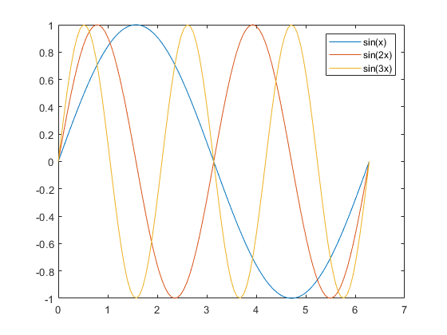
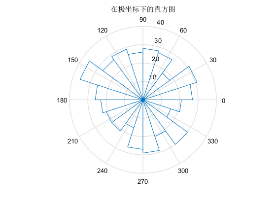
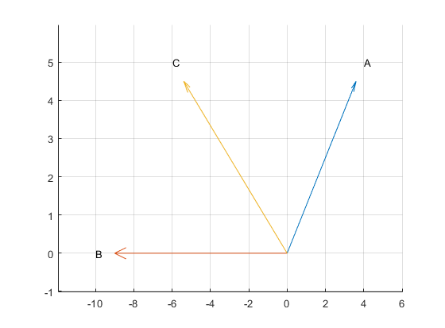

## 几种解方程方式

```matlab
% 几种可以快速计算一元二次方程的方式
% 下面操作计算的是方程 x^2-3*x+1=0 的根
% 利用 roots 函数
>> p = [1 -3 1];
>> x = roots(p)
x =
    2.6180
    0.3820
    
% 利用绘图可以得到根的大致位置
>> x = -5:0.1:5;
>> y1 = x.*x-3*x+1;
>> y2 = zeros(size(x));
>> plot(x,y1,x,y2)

% 利用 fzero 函数
>> f = @(x)x*x-3*x+1;
>> x1 = fzero(f, 0.5)       % 该函数的参数表示求方程接近0.5的根的值
x1 =
    0.3820
>> x2 = fzero(f, 2.5)       % 该函数的参数表示求方程接近2.5的根的值
x2 =
    2.6180

% 利用 fsolve 函数
>> f = @(x)x*x-3*x+1;
>> x1 = fsolve(f,0.5,optimset('Display','off'))     % fsolve函数算是fzero函数的一个优化，
% optimset('Display','off')表示不显示迭代产生的中间值
x1 =
    0.3820
>> x2 = fsolve(f,2.5,optimset('Display','off'))
x2 =
    2.6180
  
% 利用符号求根函数 solve 
>> syms x
>> x = solve(x^2-3*x+1)
x = 
 3/2+1/2*5^(1/2)
 3/2-1/2*5^(1/2)
>> x = eval(x)
x =
    2.6180
    0.3820
```

# MATLAB基础知识

在MATLAB中 % 表示单行注释

MATLAB中的续行符为连续的三个小数点

MATLAB的工作命令行支持很多命令行命令，clc代表清屏，clear代表清空当前驻留变量   

## 数值型数据类型的分类

class函数可以获得变量的数据类型

* 整型
  * 无符号8位整数数据范围：00000000 - 11111111（0 - 2^8-1）
  * 带符号8位整数数据范围：10000000 - 01111111（-2^7 - 2^7-1）
    * uint8函数可将数值数据转化为无符号的8位整数，int8函数则相反
* 浮点型
  * 单精度：在内存中占用4个字节
  * 双精度：在内存中占用8个字节（默认为双精度）
    * single函数：将其他类型的数据转化为单精度型
    * double函数：将其他类型的数据转化为双精度型
* 复型
  * 复型数据包括实部与虚部两部分，且均默认为双精度型，虚数单位用 i 或 j 来表示
    * real函数：求复数的实部
    * imag函数：求复数的虚部

matlab中的数值数据的输出格式

​	format命令：format 格式符

```matlab
>> disp(50/3)
   16.6667
>> format long
>> disp(50/3)
  16.66666666666667
>> format
>> disp(50/3)
   16.6667
% format命令对该语句下面的命令都有效
% 而且只影响数据输出格式，不影响数据的计算和存储   
```

## 变量与赋值

* MATLAB中变量名最多有63个字符，以字母开头，后接字母、数字或下划线的字符序列

* MATLAB对英文大小写敏感，而标准函数名以及命令名必须都是小写字母

* who和whos两条命令会返回在MATLAB中驻留的变量的信息，who只返回变量名，whos则返回更加详细的信息，（形同工作区）同时这些变量的信息也可以保存为mat文件（内存变量文件，一种二进制文件），以便日后的使用

```matlab
>> a = [1 2 3 4 5];
>> b = [2 4 6 8];
>> who % 显示此时内存中的驻留变量
您的变量为:
a  b  
>> whos % 详细显示内存中的驻留变量
  Name      Size            Bytes  Class     Attributes
  a         1x5                40  double              
  b         1x4                32  double 
  
% save 命令，创建内存变量文件
>>save mydata a b
% 将变量a和变量b存入名为mydata的内存变量文件
% load 命令，导入内存变量文件
>> load mydata
```

## 预定义变量

```matlab
% ans 计算结果的默认赋值变量
% i和j 代表虚数单位
% pi 代表圆周率
% NaN 代表非数
```

## 常用数学函数

函数的自变量规定为矩阵变量，（标量本身就是矩阵的特例）函数在运算时是将函数逐项作用于矩阵的每个元素上，所以最后运算的结果就是一个与自变量同型的矩阵。

```matlab
% exp函数，计算自然对数的幂
>>  A = [4 2;3 6];
>> B = exp(A)
B =
   54.5982    7.3891
   20.0855  403.4288
   
% 关于三角函数等，他们有以弧度为单位的函数和以角度为单位的函数，如果是以角度为单位的函数就在函数名后面加“d”以示区别。
>> disp(sin(pi/2))
     1
>> disp(sind(90))
     1

% abs函数可以求实数的绝对值、复数的模、字符串的ASCII码值
>> disp(abs(-4))
     4
>> disp(abs(3+4i))
     5
>> disp(abs('a'))
    97

% 关于取整的函数有fix、floor、ceil、round
    % round 四舍五入取整
    % ceil 向上取整，取大于该数的第一个整数
    % floor 向下取整
    % fix 固定取靠近0的那个整数，即舍去小数取整
    disp(round(4.7))
         5
    disp(round(4.4))
         4
    disp(ceil(4.1))
         5
    disp(floor(4.9))
         4
    disp(fix(-3.4))
        -3
    disp(fix(3.4))
         3
         
%  rem函数求余数       
>> m = 345;
>> m1 = rem(m,10)
m1 =
     5          

% isprime函数用于判断一个数是否为素数，为素数时返回1，否则返回0。下面是一种找出1到100内所有素数的方法
>> x = [1:100];
>> k = isprime(x); % 此时的变量k类似于布尔型，但其实只是用0与1表示
>> k1 = find(k);
>> p = x(k1)
p =
  Columns 1 through 18
     2     3     5     7    11    13    17    19    23    29    31    37    41    43    47    53    59    61
  Columns 19 through 25
    67    71    73    79    83    89    97
 
% sqrt函数求数字 算数平方根
```

## 搜索路径的优先级

变量 优于 内部函数 优于 程序文件，对于程序文件，先检查当前文件夹下的程序文件，再检查文件搜索路径文件夹中的程序文件

```matlab
>> clear % 清空所有变量值
>> x = sin(1)
x =
    0.8415
>> sin = [1 2 3 4 5]
sin =
     1     2     3     4     5
>> x = sin(1)
x =
     1 % x的值为sin中的第一个值，而不是1的正弦值
```

设置文件搜索路径

```matlab
% 使用path命令
>> path(path, 'e:\work')

% 使用对话框设置
```

## 矩阵的表示

### 矩阵的建立

* 利用直接输入法建立矩阵：将矩阵中的元素用**中括号**括起，按矩阵行的顺序输入各元素，同一行的各元素之间用**逗号或空格**分隔，不同行之间的元素之间用**分号**分隔。

  ```matlab
  >> A = [1 2 3;4 5 6;7 8 9]
  A =
       1     2     3
       4     5     6
       7     8     9
  ```
  
*  利用已建好的矩阵建立更大的矩阵：一个大矩阵可以由已经建立好的小矩阵拼接而成

  ``` matlab
  >> A = [1 2;3 4];
  >> B = [-1 -2;-3 -4];
  >> C = [A B;B A]
  C =
       1     2    -1    -2
       3     4    -3    -4
      -1    -2     1     2
      -3    -4     3     4
  >> D = A + i*B
  D =
     1.0000 - 1.0000i   2.0000 - 2.0000i
     3.0000 - 3.0000i   4.0000 - 4.0000i    
  ```

### 冒号表达式

格式：e1:e2:e3

* e1为初始值，e2为步长，e3为终止值
* 如果省略步长，则默认步长为1，例如 t=0:5 与 t=0:1:5 等价

利用 linspace 函数生成向量

* linspace(a, b, n)
* 其中 a 为第一个元素，b 为最后一个元素，n 为元素总数，当 n 省略时，自动生成100个元素

### 结构矩阵与单元矩阵

* 结构矩阵，可以包含不同类型的数据，

  格式为：结构矩阵元素.成员名 = 表达式

  ```matlab
  >> a(1).x1=10;a(1).x2='w';a(1).x3=[1 2;3 4];
  >> a
  a = 
    包含以下字段的 struct:
      x1: 10
      x2: 'w'
      x3: [2×2 double]
  >> a(2).x1=3;a(2).x2='j';a(2).x3=[8 2;2 0];
  >> a(3).x1=5;a(3).x2='x';a(3).x3=[7 4;5 3];
  >> a
  a = 
    包含以下字段的 1×3 struct 数组:
      x1
      x2
      x3
  >> a.x1
  ans =
      10
  ans =
       3
  ans =
       5
  >> disp(a(1).x1)
      10    
  ```

* 单元矩阵

  建立单元矩阵如一般矩阵相似，直接输入即可，只是矩阵元素用**大括号**括起

  ```matlab
  >> b = {10 'w' [1 2;3 4];12 'j' [2 4;6 4];2 'x' [7 3;2 9]}
  b =
    3×3 cell 数组
      {[10]}    {'w'}    {2×2 double}
      {[12]}    {'j'}    {2×2 double}
      {[ 2]}    {'x'}    {2×2 double}
  ```

## 矩阵元素的引用

* 通过下标来引用矩阵的元素，利用小括号来引用下标

  A(3,4) 表示A矩阵第3行第4列的元素

  ```matlab
  >> A = [1 2 3;4 5 6];
  >> A(4,5) = 10
  A =
       1     2     3     0     0
       4     5     6     0     0
       0     0     0     0     0
       0     0     0     0    10 % 同理，将右下角的部分赋值为空，可以修整矩阵，矩阵只剩下左上角的一部分
  ```

*  通过序号来引用，MATLAB中矩阵元素是按照列存储，矩阵元素的序号就是矩阵元素在内存中的排列顺序

  ```matlab
  >> A = [1 2 3;4 5 6]
  A =
       1     2     3
       4     5     6
  >> A(3)
  ans =
       2
  ```

  序号与下标是一一对应的，与C语言中二维数组的内存构成相似，只是C语言行优先，MATLAB列优先

* 矩阵元素的序号与下标可以利用 sub2ind 和 ind2sub 函数实现相互转换

  格式为： D = sub2ind(S, I, J) ，[I, J] = ind2sub(S, D)

  其中D为元素序号，S为行数与列数组成的向量，I 表示行下标，J 表示列下标

  ```matlab
  >> A = [1:3;4:6]
  A =
       1     2     3
       4     5     6
  >> D = sub2ind(size(A), 2, 3)
  D =
       6
  >> [I, J] = ind2sub(size(A), 6)
  I =
       2
  J =
       3
  ```

* 利用冒号表达式获得子矩阵，类似于Python中NumPy数组的切片索引

  ```matlab
  >> A
  A =
       1     2     3
       4     5     6
  >> A(1,:)
  ans =
       1     2     3 
  ```

  其中可以利用 end 运算符参与冒号表达式，end运算符表示某一维的末尾元素下标

  ```matlab
  >> A(end,:)
  ans =
       4     5     6 
  ```

### 改变矩阵的形状

reshape(A, m, n) ：在矩阵总元素保持不变的前提下，将矩阵A重新排成m*n的二维矩阵，不改变内存中的顺序。

## 算术运算

### 基本算术运算

\+ ，\- ，\* ，/(右除) ，\\(左除) ，\^ 

* MATLAB的算术运算是在矩阵意义下进行的

* 加减运算需要两矩阵同形，乘法运算需要前者的列数与后者的行数相等

* 除法，包括左除与右除，如果A为非奇异矩阵，则 B/A 等效与 B\*inv(A) ，A\\B 等效于 inv(A)\*B ，inv函数为求矩阵的逆的函数。对于矩阵来说，右除和左除表示两种不同的**除数矩阵**和**被除数矩阵**关系，且一般这种关系不满足交换律。

  ```matlab
  >> A = [1 2 3;4 5 6;7 4 9];
  >> B = [4 3 2;7 5 1;12 7 9];
  >> C1 = B/A % 右除
  C1 =
     -2.6667    1.6667    0.0000
     -6.5833    3.8333   -0.2500
     -5.1250    2.7500    0.8750
  >> C2 = A\B % 左除
  C2 =
     -0.2500   -0.5000   -0.3750
     -0.5000   -0.0000   -2.2500
      1.7500    1.1667    2.2917
  >> a = 3/4 % 右除
  a =
      0.7500
  >> b = 4\3 % 左除
  b =
      0.7500 
  >> A = [10.5 25];
  >> A/5 % 右除
  ans =
      2.1000    5.0000
  >> 5\A % 左除
  ans =
      2.1000    5.0000    
  ```

*  矩阵的乘方运算可以表示为 A\^x，要求其中A为方阵，x为标量

点运算 (点运算在实际应用中起着很重要的作用，也是很容易弄混的一个问题)

* 点运算符： .* 、./ 、.\ 和 .^

* 两矩阵运行点运算是指它们的对应元素进行相关运算，要求两矩阵同形

  ```matlab
  >> A = [1 2 3;4 5 6;7 8 9];
  >> B = [-1 0 1;1 -1 0;0 1 1];
  >> C = A.*B
  C =
      -1     0     3
       4    -5     0
       0     8     9
  >> D = A*B
  D =
       1     1     4
       1     1    10
       1     1    16
  ```

### 关系运算

关系运算符：< 、<= 、> 、>= 、 == 、~=(不等于)

* 当两个比较量是标量时，直接比较两数大小，关系成立则表达式结果为 1 ，否则为 0 
* 当两个比较的量是两个同形的矩阵，对相同位置的元素按标量关系运算规则逐个进行，最终结果为一个由0或1组成的矩阵
* 当一个标量，一个矩阵时，也是返回一个与矩阵同形的0，1矩阵

### 逻辑运算

逻辑运算符： & 、 | 、 ~(非)

* 运算法则与其他语言中的法则相似
* 当遇到标量与矩阵的情况，处理方法与关系运算相似

```matlab
>> % 水仙花数指各位数字的立方和等于该数本身的三位正整数
>> m = 100:999;
>> m1 = rem(m, 10);
>> m2 = rem(fix(m/10), 10);
>> m3 = fix(m/100);
>> k = find(m == m1.*m1.*m1+m2.*m2.*m2+m3.*m3.*m3)
k =
    54   271   272   308
>> s = m(k)
s =
   153   370   371   407
   % 利用MATLAB可以相比较其他语言更加便捷的找到所有的水仙花数
```

## 字符串处理

除去数值型数据变量外，还有字符型数据

使用**单引号**括起字符串变量的值，可以将其赋给变量，并可以通过冒号表达式的方式来调用其中的一部分。如果字符序列中存在单引号，要使用两个单引号来表示。

```matlab
>> str_0 = 'wxdespair';
>> str_0(1:2)
ans =
    'wx'
>> str_1 = '''wx''despair'
str_1 =
    ''wx'despair'
```

建立多行字符串，可以形成字符串矩阵

```matlab
>> str_2 = ['wxde';'pair']
str_2 =
  2×4 char 数组
    'wxde'
    'pair'
>> str_2(2,3)
ans =
    'i'
```

同时，在MATLAB中也支持ASCII码值，所以也可以使用字符值的码值来判断大小写字母。

### 字符串操作

* 字符串的执行

  格式： eval(str)

  ```matlab
  >> t = pi;
  >> m = '[t,sin(t),cos(t)]';
  >> y = eval(m)
  y =
      3.1416    0.0000   -1.0000
  ```

* 字符串与数值之间的转换

  abs和double函数都可以用来获取字符串矩阵所对应的ASCII码值矩阵

  char函数可以用来把ASCII码矩阵转换为字符矩阵

  ```matlab
  >> str_0
  str_0 =
      'wxdespair'
  >> a = abs(str_0)
  a =
     119   120   100   101   115   112    97   105   114
  >> char(a-32)
  ans =
      'WXDESPAIR'
  ```

* 字符串的比较：

  * 利用关系运算符
  * 利用字符串比较函数
    * strcmp(str1,str2)，比较两字符串是否相等，相等返回1，不相等返回0
    * strncmp(str1,str2)，比较两字符串前n个字符是否相等，相等返回1，不相等返回0
    * strcmpi(str1,str2)，在忽略大小写的前提下，比较两字符串是否相等，相等返回1，不相等返回0
    * strncmpi(str1,str2)

* 字符串的查找与替换

  * findstr(str1,str2)，返回短字符串在长字符串中的开始位置（出现多次则返回多个值）
  * strrep(str1,str2,str3)，将字符串str1中的所有子字符串str2替换为字符串str3

# 矩阵处理

## 特殊矩阵

### 通用性的特殊矩阵

* zeros函数，产生全0矩阵，即零矩阵

  ```matlab
  >> zeros(m);
  % 产生m阶零方阵
  >> zeros(m,n);
  % 产生m*n零矩阵
  >> zeros(size(A));
  % 产生与矩阵A同样大小的零矩阵
  ```

* ones函数，产生全1矩阵，即幺矩阵

* eye函数，产生对角线全1的矩阵。当矩阵为方阵时，得到单位矩阵

* rand函数，产生(0,1)区间均匀分布的随机矩阵，不包括0和1

* randn函数，产生均值为0，方差为1的标准正态分布随机矩阵

### 用于专门学科的特殊矩阵

* 魔方矩阵，（幻方）n阶幻方由1,2,3,...n^2 共 n^2 个整数组成，且每行、每列以及主副对角线上各n个元素之和都相等，且都等于(n+n^3)/2

  magic(m)函数产生m阶幻方

* 范德蒙矩阵

  vander(V) 生成以向量V为基础的范德蒙矩阵

  ```matlab
  >> V = [1 2 3 4 5];
  >> M = vander(V)
  M =
       1     1     1     1     1
      16     8     4     2     1
      81    27     9     3     1
     256    64    16     4     1
     625   125    25     5     1
  ```

* 希尔伯特矩阵

  hilb(n)产生n阶希尔伯特矩阵

  ```matlab
  >> format rat % 以分数形式显示结果
  >> m = hilb(5)
  m =
         1              1/2            1/3            1/4            1/5     
         1/2            1/3            1/4            1/5            1/6     
         1/3            1/4            1/5            1/6            1/7     
         1/4            1/5            1/6            1/7            1/8     
         1/5            1/6            1/7            1/8            1/9
  ```

* 伴随矩阵

  compan(p) 用于生成伴随矩阵，其中p是一个多项式的系数向量，高次幂在前，低次幂在后

  ```matlab
  >> format long
  >> p = [1 -2 -5 6]; % 求多项式 x^3-2x^2-5x+6 的伴随矩阵
  >> A = compan(p)
  A =
       2     5    -6
       1     0     0
       0     1     0
  ```

* 帕斯卡矩阵

  pascal(n) 函数生成一个n阶帕斯卡矩阵

  ```matlab
  >> pascal(6)
  ans =
       1     1     1     1     1     1
       1     2     3     4     5     6
       1     3     6    10    15    21
       1     4    10    20    35    56
       1     5    15    35    70   126
       1     6    21    56   126   252
  ```

## 矩阵变换

### 对角阵

* 对角矩阵：只有对角线上有非零元素的矩阵
* 数量矩阵：对角线上的元素相等的对角矩阵
* 单位矩阵：对角线上的元素都为1的对角矩阵

#### 提取与构造

* diag(A) ：提取矩阵A主对角线的元素，产生一个列向量

* diag(A,k) ：提取矩阵A第k条对角线的元素，产生一个列向量。主对角线为第零条对角线

  

* diag(V) ：以向量V为主对角线元素，产生对角矩阵
* diag(V,k) ：以向量V为第k条对角线元素，产生对角矩阵

### 三角阵

* 上三角阵：矩阵的对角线以下的元素全为零的矩阵

  * triu(A) ：提取矩阵A的主对角线及以上的元素

  * tril(A,k) ：提取矩阵A的第k条对角线及以上的元素

  * ```matlab
    >> triu(ones(4),-1)
    ans =
         1     1     1     1
         1     1     1     1
         0     1     1     1
         0     0     1     1
    ```

* 下三角阵：对角线以上的元素全为零的矩阵

  * tril() 函数，与triu函数的用法一致

### 矩阵转置

* 转置运算符是小数点后面接单引号（.‘）
* 共轭转置，其运算符是单引号（‘），它在转置的基础上还要取每个数的复共轭，这里的复指复数，实数矩阵两者没区别

### 矩阵旋转

* rot90(A,k) ：将矩阵A逆时针方向旋转 90^o 的k倍，当k为1时可以省略 

* ```matlab
  >> A = [1 3 2;-3 2 1;4 1 2]
  A =
       1     3     2
      -3     2     1
       4     1     2
  >> rot90(A)
  ans =
       2     1     2
       3     2     1
       1    -3     4
  >> rot90(A,2)
  ans =
       2     1     4
       1     2    -3
       2     3     1
  ```

### 矩阵翻转

* fliplr(A) ：对矩阵A实施左右翻转
* flipud(A) ：对矩阵A实施上下翻转

### 矩阵求逆

* inv(A) ：求方阵A的逆矩阵

* ```matlab
  >> % 求线性方程组的解...
  >> % x + 2y +3z = 5
  >> % x + 4y + 9z = -2
  >> % x + 8y + 27z = 6
  >> A = [1 2 3;1 4 9;1 8 27];
  >> b = [5;-2;6];
  >> x = inv(A)*b
  x =
     23.0000
    -14.5000
      3.6667
  >> x = A\b
  x =
     23.0000
    -14.5000
      3.6667
  ```

## 矩阵求值

* 矩阵的行列式值
  * det(A)
* 矩阵的秩 
  * rank(A)
* 矩阵的迹
  * 矩阵的迹等于矩阵的对角线元素之和，也等于矩阵的特征值值和
  * trace(A)
* 矩阵的范数
  * 向量的范数
    * 向量的 1-范数：向量元素的绝对值之和
      * norm(V,1)
    * 向量的 2-范数：向量元素绝对值的平方和的平方根
      * norm(V)或norm(V,2)
    * 向量的 $\infty$-范数：所有向量元素绝对值中的最大值
      * norm(V,inf)
  * 矩阵的范数
    * 矩阵的 1-范数：所有矩阵列元素绝对值之和的最大值
      * norm(A,1)
    * 矩阵的 2-范数：矩阵A‘A的最大特征值的平方根
      * norm(A)或norm(A,2)
    * 矩阵的 $\infty$-范数：所有矩阵行元素绝对值之和的最大值
      * norm(A,inf)
* 矩阵的条件数
  * 矩阵A的条件数等于A的范数与A的逆矩阵的范数的乘积，相应有三种状态下的条件数 
    * cond(A,1)
    * cond(A)或cond(A,2)
    * cond(A,inf)
  * 条件数越接近与1，矩阵的性能越好，反之，矩阵的性能越差

## 矩阵的特征值与特征向量

设A是n阶方阵，如果存在常数 $\lambda$ 和n维非零列向量x，使得等式 Ax=$\lambda$x 成立，则称 $\lambda$ 为A的特征值，x是对应特征值 $\lambda$ 的特征向量。

* E = eig(A) ：求矩阵A的全部特征值，构成向量E
* [X,D] = eig(A) ：求矩阵A的全部特征值，构成对角阵D，并产生矩阵X，X各列是相应的特征向量

```matlab
x = [0 0.5 0.5 3 5.5 5.5 6 6 3 0;0 0 6 0 6 0 0 8 1 8];
A = [1 0.5;0 1];
y = A*x;
subplot(2,2,1);
fill(x(1,:),x(2,:),'r');
subplot(2,2,2);
fill(y(1,:),y(2,:),'r');
```


## 稀疏矩阵

### 矩阵的存储方式

* 完全存储方式

  * 存储全部矩阵元素，按列顺序存储
  * $A=\left(
            \begin{matrix}
                1 & 0 & 0 & 0\\
                0 & 5 & 0 & 0\\
                2 & 0 & 0 & 7\\
            \end{matrix}
        \right)
       $

* 稀疏存储方式

  * 只存储矩阵非零元素的值及其位置，即行号和列号，依旧是按列顺序存储

  * (1,1),1

    (3,1),2

    (2,2),5

    (3,4),7

两种存储方式只是存储方式不同，运算方式完全相同。当参与运算的数据对象不全是稀疏存储矩阵时，所得结果是完全存储形式。

### 稀疏存储方式的产生

两种存储方式之间的转换

* A = sparse(S) ：将矩阵S转化为稀疏存储方式的矩阵A

* S = full(A) ：将矩阵A转化为完全存储方式的矩阵S

* ```matlab
  >> clear
  >> A = sparse(eye(5))
  A =
     (1,1)          1       
     (2,2)          1       
     (3,3)          1       
     (4,4)          1       
     (5,5)          1       
  >> B = full(A)
  B =
         1              0              0              0              0       
         0              1              0              0              0       
         0              0              1              0              0       
         0              0              0              1              0       
         0              0              0              0              1       
  >> whos
    Name      Size            Bytes  Class     Attributes
    A         5x5               128  double    sparse    
    B         5x5               200  double              
  ```

直接建立稀疏矩阵

* sparse(m,n) ：生成一个m*n的所有元素都是零的稀疏矩阵

* sparse(u,v,S) ：其中参数是三个等长的向量。S是欲建立稀疏存储方式的非零元素，u(i)、v(i)分别是S(i)的行列下标

  * ```matlab
    >> A = sparse([1,2,2],[2,1,4],[4,5,-7])
    A =
       (2,1)          5       
       (1,2)          4       
       (2,4)         -7       
    >> B = full(A)
    B =
           0              4              0              0       
           5              0              0             -7
    ```

* B = spconvert(A) ，之间通过A建立稀疏存储矩阵

  * A为一个 m\*3 或 m\*4 的矩阵，其每行表示一个非零元素，m是非零元素的个数

    * A(i, 1) 表示第i个非零元素所在的行
    * A(i, 2) 表示第i个非零元素所在的列
    * A(i, 3) 表示第i个非零元素值的实部
    * A(i, 4) 表示第i个非零元素值的虚部，如果都是实数则无需第4列

  * ```matlab
    >> A = [2 2 1;2 1 -1;2 4 3]
    A =
           2              2              1       
           2              1             -1       
           2              4              3       
    >> B = spconvert(A)
    B =
       (2,1)         -1       
       (2,2)          1       
       (2,4)          3   
    ```

带状稀疏矩阵的稀疏存储

稀疏矩阵有两种基本类型：无规则结构的稀疏矩阵与有规则结构的稀疏矩阵

* 带状稀疏矩阵是指所有非零元素集中在对角线上的矩阵

  * [B, d]=spdiags(A) ：从带状稀疏矩阵A中提取全部非零对角线元素赋给矩阵B及其这些非零对角线的位置向量d

  * A = spdiags(B, d, m, n) ：产生带状稀疏矩阵的稀疏存储矩阵A，其中m、n为原带状稀疏矩阵的行数与列数，矩阵B的第i列即为原带状稀疏矩阵的第i条非零对角线，向量d为原带状稀疏矩阵所有非零对角线的位置

  * ```matlab
    >> A = [11 0 0 12 0 0;0 21 0 0 22 0;0 0 31 0 0 32;41 0 0 42 0 0;0 51 0 0 52 0]
    A =
          11              0              0             12              0              0       
           0             21              0              0             22              0       
           0              0             31              0              0             32       
          41              0              0             42              0              0       
           0             51              0              0             52              0       
    >> [B,d]=spdiags(A)
    B =
           0             11             12       
           0             21             22       
           0             31             32       
          41             42              0       
          51             52              0       
    d =
          -3       
           0       
           3       
    ```

单位矩阵的稀疏存储

* speye(m,n) 返回一个m*n的稀疏存储单位矩阵

# 程序流程控制

MATLAB中的程序文件扩展名为.m，也叫.m文件，又分为脚本文件与函数文件

* 脚本文件是可以在命令行窗口直接执行的文件，所以也叫命令文件
* 函数文件，不能直接执行，必须以函数调用的方式来调用

文件的创建也有两种方式：

* 通过图形化界面的按钮创建文件

* 使用edit命令创建文件

  * ```matlab
    >> edit 新建文件名 % 会自动拓展.m后缀名
    ```

分别建立脚本文件和函数文件，求两个矩阵的乘积

* ```matlab
  % 建立 f1.m 脚本文件
  A = [1 2 3;4 5 6];
  B = [1 2;3 4;5 6];
  C = A*B
  
  % 执行文件
  >> f1
  C =
      22    28
      49    64
  ```

* ```matlab
  % 建立 f2.m 函数文件
  function C=f2(A,B)
  C = A*B;
  
  % 调用函数
  >> A = [1 2 3;4 5 6];
  >> B = [1 2;3 4;5 6];
  >> C = f2(A,B)
  C =
      22    28
      49    64
  ```

数据的输入：

* A = input(‘提示信息’, 选项);

* ```matlab
  >> A = input('请输入A的值：')
  请输入A的值：[1 2;3 4]
  A =
       1     2
       3     4
  ```

数据的输出：

* disp(输出项)

* ```matlab
  >> a = [1 2 3;4 5 6]
  a =
       1     2     3
       4     5     6
  >> disp(a) % 输出格式与自动输出不同
       1     2     3
       4     5     6
  ```

程序的暂停：

* pause(延迟秒数)，（如果省略参数，则会暂停程序，直到使用者键盘进行任意操作）
* Ctrl+C 命令可以强行终止程序的运行

## 选择结构

### if  语句

```matlab
% 单分支
if 条件 % 关系运算或逻辑运算表达式
		% 当条件结果矩阵时，如果矩阵为非空，且不包含零元素，则条件成立，否则不成立 
	语句组 % 一条或多条
end

% 双分支
if 条件
	语句组1
else
	语句组2
end

% 多分支
if 条件1
	语句组1
elseif 条件2
	语句组2
	...
else
	语句组
end
```

### switch  语句

```matlab
swich 表达式
	case 结果表达式1 % 当case结果为多个值时，用单元数据表示，大括号括起
		语句组1
	case 结果表达式2
		语句组2
	...
	otherwise
		语句组
end
```

```matlab
% 建立 f1.m 脚本文件
x = input('x = ');
switch fix(x)
    case 2
        disp(111);
    case 2
        disp(222);
    case {3, 4, 5}
        disp(333);
    otherwise
        disp(444);
end

% 执行
>> f1
x = 2
   111 % 由此可见MATLAB中的switch语句不需要break语句配合
>> f1
x = 4
   333
>> f1
x = 7
   444
```

## 循环结构

### for  语句

```matlab
for 循环变量=exp1:exp2:exp3 % 初值:步长:终值
	循环体语句
end 
```

* for 语句针对向量的每一个元素执行一次循环体

* 退出循环后，循环变量的值为向量中最后的元素值

*  当向量为空时，循环体一次也不执行

* for语句的循环变量也可以是一个列向量

  * ```matlab
    for 循环变量=矩阵表达式
    	循环体语句
    end
    ```

### while  语句

```matlab
while 条件
	循环体语句
end 
% 多用于循环次数不确定的情况，而循环次数确定的情况多用for语句
```

但 MATLAB 中也有break语句和continue语句，相应起到跳出整个循环与跳出当层循环的作用。

循环嵌套。

## 函数文件的定义与调用

函数文件的基本结构：

```matlab
function 输出形参表=函数名(输入形参表) % 但有多个形参时，用方括号括起，逗号分隔，构成一个输出矩阵
% 注释说明部分
函数体语句
```

函数文件名通常由函数名再加上扩展名.m组成。当函数文件名与函数名不相同时，忽略函数名，使用函数文件名调用函数。

函数文件中遇到return语句就表示结束函数的执行。否则直到所有语句执行完毕。

函数的调用格式：

```matlab
[输出实参表]=函数名(输入实参表)
```

实参与形参。

### 匿名函数

```matlab
函数句柄变量=@(匿名函数输入参数)匿名函数表达式
>> f = @(x, y)x^2+y^2
f =
  包含以下值的 function_handle:
    @(x,y)x^2+y^2
>> f(3, 4)
ans =
    25
    
% 又或者可以直接根据已有函数设定函数句柄变量
函数句柄变量=@函数名
>> h = @sin
h =
  包含以下值的 function_handle:
    @sin
>> h(pi/2)
ans =
     1
```

函数的嵌套调用

函数的递归调用 

* 直接递归调用：直接在函数中调用该函数

* 间接递归调用：在函数中调用另一个调用了该函数的函数

* ```matlab
  % 函数文件
  function f=fact(n)
  if n<=1
      f=1;
  else
      f=fact(n-1)*n;
  end
  
  % 执行文件
  >> fact(8)
  ans =
         40320
  ```

## 函数参数的可调性与作用域

每个函数都有两个默认的类似于预定义变量的变量

* nargin：输入实参的个数

* nargout：输出实参的个数

* ```matlab
  % 创建函数文件
  function fout=test_0(a,b,c)
  if nargin==1
      fout = a;
  elseif nargin==2
      fout = a+b;
  elseif nargin==3
      fout = (a*b*c)/2;
  end
  
  % 执行函数
  >> test_0(3, 4, 5)
  ans =
      30
  ```

局部变量与全局变量 

* 定义全局变量：
  * global 变量名 
  * 但其实MATLAB需要在调用全局变量的文件中定义一下所用的全局变量，也就相当于声明，貌似没有其他一些语言中方便。
  * 在文件中定义后，如果要在工作区使用，也要在工作区定义（声明）一下。

# 绘图

## 二维曲线

* plot 函数

  * plot(x,y)

  * ```matlab
    >> x = [2.5, 3.5, 4, 5];
    >> y = [1.5, 2.0, 1, 1.5];
    >> plot(x,y)
    ```

  * 

  * plot(x) ，将x向量的各值作为纵坐标，其在向量中的位置作为横坐标

  * 

  * 当plot函数的参数x是复数向量时，则以实部为横，虚部为纵坐标做曲线

  * 

  * 当x是向量，y是矩阵时，绘制多条曲线

    * 如果x的长度等于y的列数，则x为横，y的每个行向量为纵，曲线条数等于有的行数

    * 如果x的长度等于y的行数，则x为横，y的每个列向量为纵，曲线条数等于有的列数

    * ```matlab
      >> x = linspace(0,2*pi,100);
      >> y = [sin(x);sin(2*x);sin(0.5*x)];
      >> plot(x,y)
      ```

    * 

  * 当x，y为同型矩阵时，以x，y对应列元素为横纵坐标分别绘制曲线，曲线条数等于矩阵列数

  * plot(x1,y1,x2,y2...) 也可以使用向量对的形式绘制曲线，其中每一对向量构成一条曲线

  * plot(x,y,选项) ，这个选项可以定制曲线的线型、颜色、数据点标记

* fplot 函数

  * fplot(f,lims,选项) ，（可以不均等的设置横坐标）

    * f 代表一个函数，通常使用函数句柄
    * lims 为定义域，用二元向量[xmin,xmax]描述，默认值为[-5,5]
    * 选项内容与plot函数相同

  * ```matlba
    >> a = @(x)sin(1./x)
    a =
      包含以下值的 function_handle:
        @(x)sin(1./x)
    >> fplot(a,[0,0.2],'b')
    ```

  * 

  * fplot(funx, funy, tlims, 选项) ，双输入函数参数用法，一般用于绘制由参数方程表示的曲线。其实plot函数也可以用于绘制参数方程图像

## 绘制图形的辅助操作

* 添加标注

  * title(图形标题)

    * ```matlab
      >> x = -2*pi:0.05:2*pi;
      >> y = sin(x);
      >> plot(x,y)
      >> title('y = sin(x)')
      ```

    * 

    * ```matlab
      >> title({'MATLAB','y = sin(x)'})
      ```

    * 

    * 且title函数支持LaTex格式控制符书写字母或公式

    * 在参数前书写格式字符可以控制文本的特殊格式，包括：\bf 加粗、\it  斜体、\rm  正体

    * 还可以指定其他的一些属性，通常成对出现：title(图形标题,属性名,属性值)

      * Color属性：文本颜色
      * FontSize属性：文本字号，默认字号为11

  * xlabel(x轴说明)  、ylabel(y轴说明)

  * text(x,y,图形说明)

    * 其中x,y是文字说明的位置，文字左下角的坐标(x,y)
    * 说明与title相同
    * 还有一个 gtext(说明) 函数，没有坐标，会跟随光标的位置变动而改变位置

  * legend(图例1,图例2,...)

    * ```matlab
      >> x = linspace(0,2*pi,100);
      >> plot(x,[sin(x);sin(2*x);sin(3*x)])
      >> legend('sin(x)','sin(2x)','sin(3x)') % 参数顺序要与plot参数相同
      ```

    * 

* 坐标控制

  * axis([xmin,xmax,ymin,ymax,zmin,zmax]) ，控制坐标轴范围
  * axis函数的其他使用方式，类似于命令使用方式
    * axic equal  横纵坐标采用等长刻度
    * axic square  产生正方形坐标系（默认是矩形）
    * axis auto  使用默认设置
    * axis off  取消坐标轴
    * axis on  显示坐标轴
  * grid  控制网格
    * grid on 
    * grid off 
    * 如果不加后面选项，就是在两种状态间切换
  * box  控制边框线
    * box on 、box off 、box

* 图形保持

  * 每一次执行改变图形的命令后，都会刷新原有图形，原有图形不付存在，如果要在原有图形的基础上进行修改，就要用到图形保持命令
  * hold on 保持，不刷新、hold off 不保持，刷新 、 hold

* 图形窗口分割

  * 设置子图
    * subplot(m,n,p)
    * m与n指定将图形窗口分为m*n个绘图区
    * p指定当前活动区，区号按行优先编号

## 其他形式的二维图形

### 其他坐标系

对数坐标图

* 半对数坐标
  * semilogx(x1,y1,选项1,x2,y2,选项2,...) ， x轴为常用对数刻度，y轴仍为线性刻度
  * semilogy(x1,y1,选项1,x2,y2,选项2,...) ， y轴为常用对数刻度，x轴仍为线性刻度

* 全对数坐标

  * loglog(x1,y1,选项1,x2,y2,选项2,...) ， x 轴与 y 轴都为常用对数刻度

* ```matlab
  >> x = 0:0.1:10;
  >> y = 1./x;
  >> subplot(2,2,1);
  >> plot(x,y)
  >> title('plot(x,y)');
  >> subplot(2,2,2);
  >> semilogx(x,y)
  >> title('semilogx(x,y)');
  >> grid on
  >> subplot(2,2,3);
  >> semilogy(x,y)
  >> title('semilogy(x,y)');
  >> grid on
  >> subplot(2,2,4);
  >> loglog(x,y)
  >> title('loglog(x,y)');
  >> grid on
  ```

* 

极坐标图

* polar(theta,rho,选项)

  * theta为极角，rho为极径

  * ```matlab
    >> t = 0:pi/100:2*pi;
    >> r = 1-sin(t);
    >> subplot(1,2,1)
    >> polar(t,r)
    >> subplot(1,2,2)
    >> t1 = t-pi/2;
    >> r1 = 1-sin(t1);
    >> polar(t,r1)
    ```

  * 

### 统计图

* 条形图 

  * bar(y,style)  竖直条形图

    * y 为数据 

    * style 用于指定分组排列模式，包括

      * “grouped” ：簇状分组 （默认）
      * “stacked” ：堆状分组

    * ```matlab
      >> y = [1 2 3 4 5;1 2 1 2 1;5 4 3 2 1];
      >> subplot(1,2,1)
      >> bar(y)
      >> title('Group')
      >> subplot(1,2,2)
      >> bar(y,'stacked')
      >> title('Stack')
      ```

    * 

  * bar(x,y,style)  其中x存储横坐标。y存储数据，且y为矩阵，每一行为一组数据。

  * barh  水平条形图

* 直方图

  * hist()  直角坐标图下

    hist(y)

    hist(y,x)  其中y为数据。x用于指定区间的划分方式，默认为10》》

  * ```matlab
    >> y = randn(500,1);
    >> subplot(2,1,1)
    >> hist(y);
    >> title('高斯分布直方图');
    >> subplot(2,1,2)
    >> x = -3:0.2:3;
    >> hist(y,x);
    >> title('指定区间中心点的直方图')
    ```

  * 

  * rose()  极坐标下

    rose(theta,x)  其中theta用于确定每一区间与原点的角度，选项x用于指定区间的划分方式

  * ```matlab
    >> y = randn(500,1);
    >> theta = y*pi;
    >> rose(theta)
    >> title('在极坐标下的直方图')
    ```

  * 

* 面积类图形

  * 扇形图

    * pie

      pie(x, explode)  x存储待统计数据。explode控制图块的显示模式，类似于“爆炸”

    * ```matlab
      >> score = [5,17,23,9,4];
      >> ex = [0,0,0,0,1];
      >> pie(score, ex)
      >> legend('优秀','良好','中等','及格','不及格','location','eastoutside')
      ```

    * 

  * 面积图

    * area()

* 散点类图形

  * scatter  ：散点图

    * scatter(x,y,选项,‘filled’)

    * x,y 用于定位数据点。选项用于指定线型、颜色、数据点标记。filled 用于填充闭合型的数据点标记。

    * ```matlab
      >> t = 0:pi/50:2*pi;
      >> x = 16*sin(t).^3;
      >> y = 13*cos(t)-5*cos(2*t)-2*cos(3*t)-cos(4*t);
      >> scatter(x,y,'rd','filled')
      ```

    * 

  * stairs  ：阶梯图

  * stem  ：杆图

### 矢量图

* compass  ：罗盘图

* feather  ：羽毛图

* quiver  ：箭头图

  * quiver(x,y,u,v)   ，(x,y)指定矢量起点，(u,v)指定矢量终点

  * ```matlab
    >> A = [4,5];
    >> B = [-10,0];C=A+B;
    >> hold on;
    >> quiver(0,0,A(1),A(2));
    >> quiver(0,0,B(1),B(2));
    >> quiver(0,0,C(1),C(2));
    >> text(A(1),A(2),'A');
    >> text(B(1),B(2),'B');
    >> text(C(1),C(2),'C');
    >> axis([-12,6,-1,6])
    >> grid on
    ```

  * 

## 三维曲线

* plot3 

  * plot3(x,y,z)    

  * ```matlab
    >> x = [0.2,1.8,2.5];
    >> y = [1.3,2.8,1.1];
    >> z = [0.4,1.2,1.6];
    >> plot3(x,y,z)
    >> grid on
    >> axis([0,3,1,3,0,2])
    ```

  * 

  * ```matlab
    >> t = linspace(0,10*pi,200);
    >> x = sin(t)+t.*cos(t);
    >> y = cos(t)-t.*sin(t);
    >> z = t;
    >> subplot(1,2,1)
    >> plot3(x,y,z)
    >> grid on
    >> subplot(1,2,2)
    >> plot3(x(1:4:200),y(1:4:200),z(1:4:200))
    >> grid on
    ```

  * 

  * 也可以由矩阵作为参数绘制多条三维曲线

  * ```matlab
    >> t = 0:0.01:2*pi;
    >> t = t';
    >> x = [t,t,t,t,t];
    >> y = [sin(t),sin(t)+1,sin(t)+2,sin(t)+3,sin(t)+4];
    >> z = [t,t,t,t,t];
    >> plot3(x,y,z)
    >> plot3(x,y,z)
    ```

  * 

  * 也可以使用多个数据对，从而绘制不同定义域的三维曲线

  * 也可以用于绘制参数方程图像

    * ```matlab
      >> t = 0:pi/50:6*pi;
      >> x = cos(t);
      >> y = sin(t);
      >> z = 2*t;
      >> plot3(x,y,z,'p')
      >> xlabel('X');
      >> ylabel('Y');
      >> zlabel('Z');
      >> grid on
      ```

    * 

* fplot3

  * fplot(funx,funy,funz,tlims,选项)

  * x,y,z代表定义曲线的三个坐标函数，常用函数句柄的形式。

  * tlims为参数函数的定义域，用区间形式表示，默认为[-5,5]

  * ```matlab
    >> xt = @(t)exp(-t/10).*sin(5*t);
    >> yt = @(t)exp(-t/10).*cos(5*t);
    >> zt = @(t)t;
    >> fplot3(xt,yt,zt,[-12,12])
    ```

  * 

  * 也可以用选项指定线型、颜色、数据点标记。


## 三维曲面


## 图形修饰处理


## 交互式绘图工具


# 10:05


# 视频，26 ，00:00

《科学计算与MATLAB语言》中南大学（已完结，章节名字在介绍中）-转自中国
https://www.bilibili.com/video/av51366148?from=search&seid=5788006335944972250

