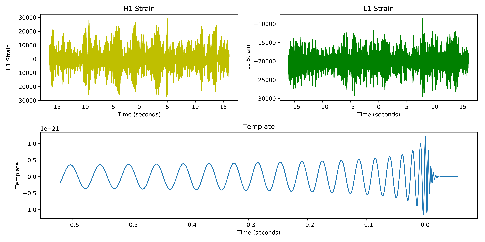

常用的 python IDE 工具：

|  文本工具类  |    集成工具类     |
| :----------: | :---------------: |
|     IDLE     |      Pycharm      |
|  Notepad++   |       Wing        |
| Sublime Text |  PyDev & Eclipse  |
| Vim & Emacs  |   Visual Studio   |
|     Atom     | Anaconda & Spyter |
| Komodo Edit  |      Canopy       |
|              |                   |

#### 实例：绘制引力波

```python
import numpy as np
import matplotlib.pyplot as plt
from scipy.io import wavfile
rate_h, hstrain = wavfile.read(r"template\H1_Strain.wav", "rb")
rate_l, lstrain = wavfile.read(r"template\L1_Strain.wav", "rb")
reftime, ref_H1 = np.genfromtxt('template\wf_template.txt').transpose()
htime_interval = 1/rate_h
ltime_interval = 1/rate_l
htime_len = hstrain.shape[0]/rate_h
htime = np.arange(-htime_len/2, htime_len/2, htime_interval)
ltime_len = lstrain.shape[0]/rate_l
ltime = np.arange(-ltime_len/2, ltime_len/2, ltime_interval)
fig = plt.figure(figsize=(12, 6))

plth = fig.add_subplot(221)
plth.plot(htime, hstrain, 'y')
plth.set_xlabel('Time (seconds)')
plth.set_ylabel('H1 Strain')
plth.set_title('H1 Strain')

pltl = fig.add_subplot(222)
pltl.plot(ltime, lstrain, 'g')
pltl.set_xlabel('Time (seconds)')
pltl.set_ylabel('L1 Strain')
pltl.set_title('L1 Strain')

pltref = fig.add_subplot(212)
pltref.plot(reftime, ref_H1)
pltref.set_xlabel('Time (seconds)')
pltref.set_ylabel('Template')
pltref.set_title('Template')

fig.tight_layout()
plt.savefig("Gravitational_Waves_Original.png", dpi=600)
plt.show()
plt.close(fig)
```

