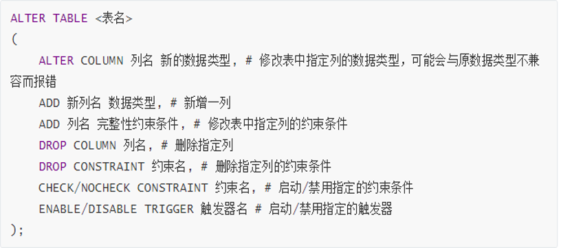

[TOC]


### 注释方式：

* -- <注释>    
  * 注意有个空格
* \# <注释>
* /* <注释> */

## 数据定义

### 创建、删除、查看数据库

* 创建数据库

```mysql
-- 语法
CREATE DATABASE <database_name>;
# 举例
CREATE DATABASE mysql_0;
```

```mysql
mysql> CREATE DATABASE mysql_0;
Query OK, 1 row affected (0.13 sec)
```


* 查看数据库

```mysql
# 语法
SHOW DATABASES;
```

```mysql
mysql> SHOW DATABASES;
+--------------------+
| Database           |
+--------------------+
| information_schema |
| mysql              |
| mysql_0            |
| performance_schema |
| sakila             |
| sys                |
| world              |
+--------------------+
7 rows in set (0.00 sec)
```


* 删除数据库

```mysql
# 语法
DROP DATABASE <database_name>;
# 举例
DROP DATABASE mysql_0;
```

```mysql
mysql> DROP DATABASE mysql_0;
Query OK, 0 rows affected (0.19 sec)

mysql> SHOW DATABASES;
+--------------------+
| Database           |
+--------------------+
| information_schema |
| mysql              |
| performance_schema |
| sakila             |
| sys                |
| world              |
+--------------------+
6 rows in set (0.00 sec)
```


* 进入数据库

```mysql
# 语法
USE <database_name>;
# 举例
USE mysql_0;
```

```mysql
mysql> USE mysql_0;
Database changed
```


### 创建、修改、删除基本表

* 创建基本表

```mysql
# 语法
CREATE TABLE <table_name>
(    
列名1 数据类型1 [列级完整性约束条件1],    
列名2 数据类型2 [列级完整性约束条件1],    
...    
[表级完整性约束条件] 
);
# 举例
CREATE TABLE C
(
CNO char(5) NOT NULL,
CN varchar(20),
CT int,
PRIMARY KEY (CNO),
CHECK (CT >= 1)
) default charset utf8; # 如果文本编码没有问题，最后一行可以省略，只保留右括号与分号。

CREATE TABLE S
(
SNO char(5),
SN varchar(8) NOT NULL,
SEX char(2) NOT NULL,
AGE int NOT NULL,
DEPT varchar(8),
PRIMARY KEY (SNO),
UNIQUE (SN),
CONSTRAINT ck_S CHECK (SEX IN ('男','女') AND AGE > 0)
) default charset utf8;

CREATE TABLE SC
(
SNO char(5) NOT NULL,
CNO char(5) NOT NULL,
SCORE numeric(3, 0),
CONSTRAINT pk_SC PRIMARY KEY (SNO, CNO),
CONSTRAINT fk_SNO_SC FOREIGN KEY (SNO) REFERENCES S(SNO),
CONSTRAINT fk_CNO_SC FOREIGN KEY (CNO) REFERENCES C(CNO)
) default charset utf8;
```
```mysql
mysql> CREATE TABLE C
    -> (
    -> CNO char(5) NOT NULL,
    -> CN varchar(20),
    -> CT int,
    -> PRIMARY KEY (CNO),
    -> CHECK (CT >= 1)
    -> ) default charset utf8;
Query OK, 0 rows affected, 1 warning (0.87 sec)

mysql> CREATE TABLE S
    -> (
    -> SNO char(5),
    -> SN varchar(8) NOT NULL,
    -> SEX char(2) NOT NULL,
    -> AGE int NOT NULL,
    -> DEPT varchar(8),
    -> PRIMARY KEY (SNO),
    -> UNIQUE (SN),
    -> CONSTRAINT ck_S CHECK (SEX IN ('男','女') AND AGE > 0)
    -> ) default charset utf8;
Query OK, 0 rows affected, 1 warning (0.71 sec)

mysql> CREATE TABLE SC
    -> (
    -> SNO char(5) NOT NULL,
    -> CNO char(5) NOT NULL,
    -> SCORE numeric(3, 0),
    -> CONSTRAINT pk_SC PRIMARY KEY (SNO, CNO),
    -> CONSTRAINT fk_SNO_SC FOREIGN KEY (SNO) REFERENCES S(SNO),
    -> CONSTRAINT fk_CNO_SC FOREIGN KEY (CNO) REFERENCES C(CNO)
    -> ) default charset utf8;
Query OK, 0 rows affected, 1 warning (0.66 sec)
```


* * MySQL数据类型

    * 数值型

    

    * 文本型

    

    * 日期型

    

* * SQL约束条件

    * NULL / NOT NULL

    

    * UNIQUE

    

    * PRIMARY KEY

    

    * FOREIGN KEY

    

    * CHECK

    

    * DEFAULT

    

* 查看基本表

  ```mysql
  # 查看当前数据库中所有的表
  	# 语法
  SHOW TABLES;
  # 查看某个表的结构
  	# 语法
  DESC table_name;
  # 举例
  DESC C;
  ```

  ```mysql
  mysql> SHOW TABLES;
  +-------------------+
  | Tables_in_mysql_0 |
  +-------------------+
  | c                 |
  | s                 |
  | sc                |
  +-------------------+
  3 rows in set (0.00 sec)
  
  mysql> DESC C;
  +-------+-------------+------+-----+---------+-------+
  | Field | Type        | Null | Key | Default | Extra |
  +-------+-------------+------+-----+---------+-------+
  | CNO   | char(5)     | NO   | PRI | NULL    |       |
  | CN    | varchar(20) | YES  |     | NULL    |       |
  | CT    | int(11)     | YES  |     | NULL    |       |
  +-------+-------------+------+-----+---------+-------+
  3 rows in set (0.00 sec)
  ```

* 修改基本表

  ```mysql
  # SQL语言用ALTER TABLE命令来修改基本表。修改基本表的行为包含：添加新列，添加列的完整性约束条件，删除列，删除列的完整性约束条件，改变原有列的数据类型，禁用参照完整性。
  # 语法
  
  ```

  

  修改表后可以查看表的结构是否改变。

* 删除基本表

  ```mysql
  # 语法
  DROP TABLE <table_name>; 
  # 注意
  	# 删除表需要相应的操作权限，一般只删除自己建立的无用表；执行删除命令后是否真能完成删除操作，取决与其操作是否违反了完整性约束条件。
  
  ```

  ```mysql
  mysql> DROP TABLE SC;
  Query OK, 0 rows affected (0.43 sec)
  
  mysql> SHOW TABLES;
  +-------------------+
  | Tables_in_mysql_0 |
  +-------------------+
  | c                 |
  | s                 |
  +-------------------+
  2 rows in set (0.05 sec)
  ```

  

### 修改表名

```mysql
# 语法
ALTER TABLE old_name RENAME TO new_name;
# 注意
	# 表名、视图名、列名都可以修改，但是数据库名是无法修改的。
```


### 创建、删除索引

* 索引的概念

  索引是双刃剑，添加索引，可以加速数据查询，但会减慢更新速度。

  索引分为聚集索引和非聚集索引，聚集索引比非聚集索引速度快，一个表中只有一个聚集索引，但可以有多个非聚集索引。

  聚集索引一般是表中的主键索引，如果表中没有显示指定主键，则会选择表中的第一个不允许为NULL的唯一索引，如果还是没有的话，就采用 Innodb 存储引擎为每行数据内置的6字节 ROWID 作为聚集索引。

* 创建索引

  ```mysql
  # 语法
  CREATE  [UNIQUE]
  [CLUSTERED/NONCLUSTERED]
  INDEX<索引名>ON{<表名>/<视图名>}(<列名>[ASC/DESC])
  	# 其中，UNIQUE表示唯一索引，CLUSTERED表示建立聚集索引，NONCLUSTERED表示建立非聚集索引。
  # 注意
  	# MySQL的语法定义聚集索引与非聚集索引与上述语法稍有不同，不能用上面的语法定义聚集/非聚集索引，会报错。
  ```

* 删除索引

  ```mysql
  # 语法
  DROP INDEX table_name<index_name>;
  DROP INDEX view_name<index_name>;
  # MySQL 语法
  ALTER TABLE table_name DROP INDEX index_name;
  ```

## 数据查询

SELECT

SELECT 语句用于从数据库中选取数据，结果被存储在一个结果表中，称为结果集。

```mysql
# 语法 MySQL
SELECT column_name1,column_name2 FROM table_name
[WHERE exp]
[LIMIT N][OFFSET M]
	# 注意
-- * 查询语句中你可以使用一个或者多个表，表之间使用逗号(,)分割，并使用WHERE语句来设定查询条件。
-- * SELECT 命令可以读取一条或者多条记录。
-- * 使用星号（*）来代替其他字段，SELECT语句会返回表的所有字段数据
-- * 使用 WHERE 语句来包含任何条件。
-- * 使用 LIMIT 属性来设定返回的记录数。
-- * 通过OFFSET指定SELECT语句开始查询的数据偏移量。默认情况下偏移量为0。
```

```SQL
# 语法 SQL Server
SELECT [ALL/DISTINCT] <目标表达式1>[[AS] 列别名1][,<目标表达式2>[[AS] 列别名2]]...
[INTO <新表名>]
FROM <表名1/视图名1>[[AS] 表别名1][,<表名2/视图名2>[[AS] 表别名2]]...
[WHERE <元组/记录筛选条件表达式>]
[GROUP BY <列名11>[,<列名12>]...[HAVING <分组筛选条件表达式>]]
[ORDER BY <列名21>[ASC/DESC][,<列名22>[ASC/DESC]]...]
```

### 查询整表

```mysql
mysql> SELECT * FROM C;
+-----+----------+------+
| CNO | CN       | CT   |
+-----+----------+------+
| C1  | C语言    |    4 |
| C2  | 离散数学 |    2 |
| C3  | 操作系统 |    3 |
| C4  | 数据结构 |    4 |
| C5  | 数据库   |    4 |
| C6  | 汇编语言 |    3 |
| C7  | 信息基础 |    2 |
+-----+----------+------+
7 rows in set (0.08 sec)
```

### 查询某列，某些列

```mysql
mysql> SELECT CN FROM C;
+----------+
| CN       |
+----------+
| C语言    |
| 离散数学 |
| 操作系统 |
| 数据结构 |
| 数据库   |
| 汇编语言 |
| 信息基础 |
+----------+
7 rows in set (0.00 sec)

mysql> SELECT CNO,CN FROM C;
+-----+----------+
| CNO | CN       |
+-----+----------+
| C1  | C语言    |
| C2  | 离散数学 |
| C3  | 操作系统 |
| C4  | 数据结构 |
| C5  | 数据库   |
| C6  | 汇编语言 |
| C7  | 信息基础 |
+-----+----------+
7 rows in set (0.00 sec)
```

### 添加表达式与文本列

```mysql
mysql> SELECT SN,2019-AGE FROM S;
+------+----------+
| SN   | 2019-AGE |
+------+----------+
| 李   |     1998 |
| 王   |     1999 |
| 陈   |     1996 |
| 张   |     2000 |
| 吴   |     1998 |
| 徐   |     1997 |
| 陈东 |     1999 |
+------+----------+
7 rows in set (0.00 sec)

mysql> SELECT SN,'出生日期',2019-AGE,lower(DEPT) FROM S;
+------+----------+----------+-------------+
| SN   | 出生日期 | 2019-AGE | lower(DEPT) |
+------+----------+----------+-------------+
| 李   | 出生日期 |     1998 | 信息        |
| 王   | 出生日期 |     1999 | 计算机      |
| 陈   | 出生日期 |     1996 | 自动化      |
| 张   | 出生日期 |     2000 | 自动化      |
| 吴   | 出生日期 |     1998 | 信息        |
| 徐   | 出生日期 |     1997 | 计算机      |
| 陈东 | 出生日期 |     1999 | 信息        |
+------+----------+----------+-------------+
7 rows in set (0.00 sec)
```

### 替换列名

```mysql
mysql> SELECT SN,'出生日期',2019-AGE,lower(DEPT) FROM S;
/* 同时显示新列名与旧列名
new_column_name(old_column_name)
*/
+------+----------+----------+-------------+
| SN   | 出生日期 | 2019-AGE | lower(DEPT) |
+------+----------+----------+-------------+
| 李   | 出生日期 |     1998 | 信息        |
| 王   | 出生日期 |     1999 | 计算机      |
| 陈   | 出生日期 |     1996 | 自动化      |
| 张   | 出生日期 |     2000 | 自动化      |
| 吴   | 出生日期 |     1998 | 信息        |
| 徐   | 出生日期 |     1997 | 计算机      |
| 陈东 | 出生日期 |     1999 | 信息        |
+------+----------+----------+-------------+
7 rows in set (0.00 sec)

mysql> SELECT SN SNAME,'出生日期:' BIRTH,2019-AGE BIRTHDAY,DEPT AS DEPARTMENT FROM S; 
/* 替换列名成新
-- old_column_name new_column_name
-- old_column_name ASnew_column_name
*/
+-------+-----------+----------+------------+
| SNAME | BIRTH     | BIRTHDAY | DEPARTMENT |
+-------+-----------+----------+------------+
| 李    | 出生日期: |     1998 | 信息       |
| 王    | 出生日期: |     1999 | 计算机     |
| 陈    | 出生日期: |     1996 | 自动化     |
| 张    | 出生日期: |     2000 | 自动化     |
| 吴    | 出生日期: |     1998 | 信息       |
| 徐    | 出生日期: |     1997 | 计算机     |
| 陈东  | 出生日期: |     1999 | 信息       |
+-------+-----------+----------+------------+
7 rows in set (0.00 sec)
```

### 去除重复项

使用 DISTINCT 选项

```mysql
mysql> SELECT SNO FROM SC;
+-----+
| SNO |
+-----+
| S1  |
| S3  |
| S1  |
| S4  |
| S5  |
| S3  |
| S3  |
| S4  |
| S4  |
| S3  |
+-----+
10 rows in set (0.03 sec)

mysql> SELECT DISTINCT SNO FROM SC;
+-----+
| SNO |
+-----+
| S1  |
| S3  |
| S4  |
| S5  |
+-----+
4 rows in set (0.01 sec)
```

### WHERE 语句

添加 WHERE 子句限定查询结果

```mysql
mysql> SELECT SN FROM S;
+------+
| SN   |
+------+
| 吴   |
| 张   |
| 徐   |
| 李   |
| 王   |
| 陈   |
| 陈东 |
+------+
7 rows in set (0.01 sec)

mysql> SELECT SN FROM S WHERE DEPT='计算机';
-- WHERE 表达式可以使用等式，也可以使用 IS 或 NOT IS ，不在赘述
+----+
| SN |
+----+
| 王 |
| 徐 |
+----+
2 rows in set (0.00 sec)

mysql> SELECT SNO,AGE FROM S WHERE AGE < 20;
-- WHERE 表达式可以使用比较表达式
+-----+-----+
| SNO | AGE |
+-----+-----+
| S4  |  19 |
+-----+-----+
1 row in set (0.00 sec)

mysql> SELECT SNO,AGE FROM S WHERE AGE BETWEEN 20 AND 30;
-- WHERE 表达式可以使用 BETWEEN ... AND ... 或加 NOT 句式  
+-----+-----+
| SNO | AGE |
+-----+-----+
| S1  |  21 |
| S2  |  20 |
| S3  |  23 |
| S5  |  21 |
| S6  |  22 |
| S7  |  20 |
+-----+-----+
6 rows in set (0.00 sec)

mysql> SELECT SNO,AGE FROM S WHERE AGE NOT BETWEEN 20 AND 30;
+-----+-----+
| SNO | AGE |
+-----+-----+
| S4  |  19 |
+-----+-----+
1 row in set (0.00 sec)

mysql> SELECT SNO,AGE FROM S WHERE AGE IN (21,20);
-- WHERE 表达式可以使用 IN 加 一个选项集合 的句式，也可以添加 NOT 
+-----+-----+
| SNO | AGE |
+-----+-----+
| S1  |  21 |
| S2  |  20 |
| S5  |  21 |
| S7  |  20 |
+-----+-----+
4 rows in set (0.00 sec)

mysql> SELECT SNO,AGE FROM S WHERE AGE NOT IN (21,20);
+-----+-----+
| SNO | AGE |
+-----+-----+
| S3  |  23 |
| S4  |  19 |
| S6  |  22 |
+-----+-----+
3 rows in set (0.00 sec)

mysql> SELECT SNO,AGE FROM S WHERE AGE LIKE '%1';
-- WHERE 表达式可以使用 LIKE 加通配符表达式的形式。这里的通配符表达式需要使用单引号括起，_表示单一字符，%表示任意字符。如果在原列记录中包含这两个字符，为防止错误，要使用反义符 \ 。 
+-----+-----+
| SNO | AGE |
+-----+-----+
| S1  |  21 |
| S5  |  21 |
+-----+-----+
2 rows in set (0.00 sec)

mysql> SELECT SNO,AGE FROM S WHERE AGE LIKE '_1';
+-----+-----+
| SNO | AGE |
+-----+-----+
| S1  |  21 |
| S5  |  21 |
+-----+-----+
2 rows in set (0.00 sec)
# 多个WHERE表达式可以使用 AND 或 OR 连接
```

### 统计函数

SELECT 语句可以添加一些统计函数进行统计汇总查询

```mysql
mysql> SELECT COUNT(*) AS '学生总人数' FROM S;
+------------+
| 学生总人数 |
+------------+
|          7 |
+------------+
1 row in set (0.00 sec)

mysql> SELECT COUNT(DISTINCT SNO) FROM SC;
+---------------------+
| COUNT(DISTINCT SNO) |
+---------------------+
|                   4 |
+---------------------+
1 row in set (0.00 sec)

mysql> SELECT COUNT(SNO) FROM SC;
+------------+
| COUNT(SNO) |
+------------+
|         10 |
+------------+
1 row in set (0.00 sec)
```

```mysql
mysql> SELECT * FROM SC;
+-----+-----+-------+
| SNO | CNO | SCORE |
+-----+-----+-------+
| S1  | C1  |    90 |
| S1  | C2  |    85 |
| S3  | C1  |    73 |
| S3  | C4  |    88 |
| S3  | C5  |    85 |
| S3  | C7  |    68 |
| S4  | C2  |    65 |
| S4  | C5  |    90 |
| S4  | C6  |    79 |
| S5  | C2  |    89 |
+-----+-----+-------+
10 rows in set (0.00 sec)

mysql> SELECT COUNT(*),MAX(SCORE),MIN(SCORE),AVG(SCORE) FROM SC;
+----------+------------+------------+------------+
| COUNT(*) | MAX(SCORE) | MIN(SCORE) | AVG(SCORE) |
+----------+------------+------------+------------+
|       10 |         90 |         65 |    81.2000 |
+----------+------------+------------+------------+
1 row in set (0.00 sec)
```

```mysql
mysql> SELECT * FROM SC;
+-----+-----+-------+
| SNO | CNO | SCORE |
+-----+-----+-------+
| S1  | C1  |    90 |
| S1  | C2  |    85 |
| S3  | C1  |    73 |
| S3  | C4  |    88 |
| S3  | C5  |    85 |
| S3  | C7  |    68 |
| S4  | C2  |    65 |
| S4  | C5  |    90 |
| S4  | C6  |    79 |
| S5  | C2  |    89 |
+-----+-----+-------+
10 rows in set (0.00 sec)

mysql> SELECT CNO,COUNT(SNO) AS '选课人数' FROM SC GROUP BY CNO;
+-----+----------+
| CNO | 选课人数 |
+-----+----------+
| C1  |        2 |
| C2  |        3 |
| C4  |        1 |
| C5  |        2 |
| C6  |        1 |
| C7  |        1 |
+-----+----------+
6 rows in set (0.00 sec)

mysql> SELECT CNO,COUNT(SNO) FROM SC GROUP BY CNO HAVING COUNT(*)>=2;
+-----+------------+
| CNO | COUNT(SNO) |
+-----+------------+
| C1  |          2 |
| C2  |          3 |
| C5  |          2 |
+-----+------------+
3 rows in set (0.00 sec)
```

### 查询的顺序

```mysql
mysql> SELECT SNO,SCORE FROM SC WHERE CNO='C2' ORDER BY SCORE DESC;
+-----+-------+
| SNO | SCORE |
+-----+-------+
| S5  |    89 |
| S1  |    85 |
| S4  |    65 |
+-----+-------+
3 rows in set (0.00 sec)

mysql> SELECT * FROM S ORDER BY DEPT,AGE DESC;
+-----+------+-----+-----+--------+
| SNO | SN   | SEX | AGE | DEPT   |
+-----+------+-----+-----+--------+
| S1  | 李   | 男  |  21 | 信息   |
| S5  | 吴   | 女  |  21 | 信息   |
| S7  | 陈东 | 男  |  20 | 信息   |
| S3  | 陈   | 女  |  23 | 自动化 |
| S4  | 张   | 男  |  19 | 自动化 |
| S6  | 徐   | 女  |  22 | 计算机 |
| S2  | 王   | 女  |  20 | 计算机 |
+-----+------+-----+-----+--------+
7 rows in set (0.00 sec)
```

### 连接查询

```mysql
mysql> SELECT * FROM S,SC WHERE S.SNO=SC.SNO;
+-----+----+-----+-----+--------+-----+-----+-------+
| SNO | SN | SEX | AGE | DEPT   | SNO | CNO | SCORE |
+-----+----+-----+-----+--------+-----+-----+-------+
| S1  | 李 | 男  |  21 | 信息   | S1  | C1  |    90 |
| S1  | 李 | 男  |  21 | 信息   | S1  | C2  |    85 |
| S3  | 陈 | 女  |  23 | 自动化 | S3  | C1  |    73 |
| S3  | 陈 | 女  |  23 | 自动化 | S3  | C4  |    88 |
| S3  | 陈 | 女  |  23 | 自动化 | S3  | C5  |    85 |
| S3  | 陈 | 女  |  23 | 自动化 | S3  | C7  |    68 |
| S4  | 张 | 男  |  19 | 自动化 | S4  | C2  |    65 |
| S4  | 张 | 男  |  19 | 自动化 | S4  | C5  |    90 |
| S4  | 张 | 男  |  19 | 自动化 | S4  | C6  |    79 |
| S5  | 吴 | 女  |  21 | 信息   | S5  | C2  |    89 |
+-----+----+-----+-----+--------+-----+-----+-------+
10 rows in set (0.00 sec)

mysql> SELECT S.SNO,SN,SEX,AGE,DEPT,CNO,SCORE FROM S,SC WHERE S.SNO=SC.SNO;
+-----+----+-----+-----+--------+-----+-------+
| SNO | SN | SEX | AGE | DEPT   | CNO | SCORE |
+-----+----+-----+-----+--------+-----+-------+
| S1  | 李 | 男  |  21 | 信息   | C1  |    90 |
| S1  | 李 | 男  |  21 | 信息   | C2  |    85 |
| S3  | 陈 | 女  |  23 | 自动化 | C1  |    73 |
| S3  | 陈 | 女  |  23 | 自动化 | C4  |    88 |
| S3  | 陈 | 女  |  23 | 自动化 | C5  |    85 |
| S3  | 陈 | 女  |  23 | 自动化 | C7  |    68 |
| S4  | 张 | 男  |  19 | 自动化 | C2  |    65 |
| S4  | 张 | 男  |  19 | 自动化 | C5  |    90 |
| S4  | 张 | 男  |  19 | 自动化 | C6  |    79 |
| S5  | 吴 | 女  |  21 | 信息   | C2  |    89 |
+-----+----+-----+-----+--------+-----+-------+
10 rows in set (0.00 sec)

mysql> SELECT S.SNO,SN,SEX,AGE,DEPT,CNO,SCORE FROM S LEFT OUTER JOIN SC ON S.SNO=SC.SNO;
+-----+------+-----+-----+--------+------+-------+
| SNO | SN   | SEX | AGE | DEPT   | CNO  | SCORE |
+-----+------+-----+-----+--------+------+-------+
| S1  | 李   | 男  |  21 | 信息   | C1   |    90 |
| S1  | 李   | 男  |  21 | 信息   | C2   |    85 |
| S2  | 王   | 女  |  20 | 计算机 | NULL |  NULL |
| S3  | 陈   | 女  |  23 | 自动化 | C1   |    73 |
| S3  | 陈   | 女  |  23 | 自动化 | C4   |    88 |
| S3  | 陈   | 女  |  23 | 自动化 | C5   |    85 |
| S3  | 陈   | 女  |  23 | 自动化 | C7   |    68 |
| S4  | 张   | 男  |  19 | 自动化 | C2   |    65 |
| S4  | 张   | 男  |  19 | 自动化 | C5   |    90 |
| S4  | 张   | 男  |  19 | 自动化 | C6   |    79 |
| S5  | 吴   | 女  |  21 | 信息   | C2   |    89 |
| S6  | 徐   | 女  |  22 | 计算机 | NULL |  NULL |
| S7  | 陈东 | 男  |  20 | 信息   | NULL |  NULL |
+-----+------+-----+-----+--------+------+-------+
13 rows in set (0.00 sec)
```

### 合并查询

```mysql
SELECT SNO AS 学号,SUM(SCORE) AS 总分 FROM SC WHERE SNO='S1'
UNION
SELECT SNO AS 学号,SUM(SCORE) AS 总分 FROM SC WHERE SNO='S5';
```

```mysql
mysql> SELECT SNO AS 学号,SUM(SCORE) AS 总分 FROM SC WHERE SNO='S1'
    -> UNION
    -> SELECT SNO AS 学号,SUM(SCORE) AS 总分 FROM SC WHERE SNO='S5';
+------+------+
| 学号 | 总分 |
+------+------+
| S1   |  175 |
| S5   |   89 |
+------+------+
2 rows in set (0.00 sec)
```

### 嵌套查询

```mysql
mysql> SELECT SNO,SN,DEPT FROM S WHERE DEPT IN(SELECT DEPT FROM S WHERE SN='王');
+-----+----+--------+
| SNO | SN | DEPT   |
+-----+----+--------+
| S2  | 王 | 计算机 |
| S6  | 徐 | 计算机 |
+-----+----+--------+
2 rows in set (0.00 sec)

mysql> SELECT A.SNO,A.SN,B.DEPT FROM S A,S B WHERE A.DEPT=B.DEPT AND B.SN='王';
+-----+----+--------+
| SNO | SN | DEPT   |
+-----+----+--------+
| S2  | 王 | 计算机 |
| S6  | 徐 | 计算机 |
+-----+----+--------+
2 rows in set (0.00 sec)

mysql> SELECT SNO,SN,DEPT FROM S WHERE DEPT=(SELECT DEPT FROM S WHERE SN='王');
+-----+----+--------+
| SNO | SN | DEPT   |
+-----+----+--------+
| S2  | 王 | 计算机 |
| S6  | 徐 | 计算机 |
+-----+----+--------+
2 rows in set (0.00 sec)
```

### LIMIT 语句

```mysql
# 取前n条数据
LIMIT n
# 取第n行的数据
LIMIT n-1, 1
# 取第n行到第m行之间的数据
LIMIT n-1,m-n+1
```

```mysql
mysql> SELECT * FROM C;
+-----+----------+------+
| CNO | CN       | CT   |
+-----+----------+------+
| C1  | C语言    |    4 |
| C2  | 离散数学 |    2 |
| C3  | 操作系统 |    3 |
| C4  | 数据结构 |    4 |
| C5  | 数据库   |    4 |
| C6  | 汇编语言 |    3 |
| C7  | 信息基础 |    2 |
+-----+----------+------+
7 rows in set (0.00 sec)

mysql> SELECT * FROM C LIMIT 3;
+-----+----------+------+
| CNO | CN       | CT   |
+-----+----------+------+
| C1  | C语言    |    4 |
| C2  | 离散数学 |    2 |
| C3  | 操作系统 |    3 |
+-----+----------+------+
3 rows in set (0.00 sec)

mysql> SELECT * FROM C LIMIT 3,1;
+-----+----------+------+
| CNO | CN       | CT   |
+-----+----------+------+
| C4  | 数据结构 |    4 |
+-----+----------+------+
1 row in set (0.00 sec)
```

### 储存查询结果到表中

```mysql
# MySQL 语法
CREATE TABLE table_name
AS
SELECT ...;
```

```mysql
mysql> CREATE TABLE C_1TO3 AS SELECT * FROM C LIMIT 3;
Query OK, 3 rows affected (0.75 sec)
Records: 3  Duplicates: 0  Warnings: 0

mysql> show tables;
+-------------------+
| Tables_in_mysql_0 |
+-------------------+
| c                 |
| c_1to3            |
| deptage           |
| s                 |
| sc                |
+-------------------+
5 rows in set (0.00 sec)

mysql> SELECT * FROM C_1TO3;
+-----+----------+------+
| CNO | CN       | CT   |
+-----+----------+------+
| C1  | C语言    |    4 |
| C2  | 离散数学 |    2 |
| C3  | 操作系统 |    3 |
+-----+----------+------+
3 rows in set (0.00 sec)
```

## 数据更新

INSERT 、 UPDATE 、 DELETE

### 插入数据

```mysql
# 语法
INSERT INTO <table_name>[column_name1, column_name2,...]
VALUES
(value1, value2, ...);
```

注意：

1. 若没有指定任何列，则默认修改全部列。
2. 若某些列名没有出现在into子句中，则在新纪录中这些列的值取空值。

[表 S](INSERT INTO S
VALUES
('S1','李','男',20,'信息'),
('S2','王','女',19,'计算机'),
('S3','陈','女',23,'自动化'),
('S4','张','男',18,'自动化'),
('S5','吴','女',20,'信息'),
('S6','徐','女',21,'计算机'),
('S7','陈东','男',19,'信息');)

[表 C](INSERT INTO C
VALUES
('C1','C语言',4),
('C2','离散数学',2),
('C3','操作系统',3),
('C4','数据结构',4),
('C5','数据库',4),
('C6','汇编语言',3),
('C7','信息基础',2);)

[表 SC](INSERT INTO SC
VALUES
('S1','C1',90),
('S1','C2',85),
('S2','C1',84),
('S2','C2',94),
('S2','C3',83),
('S3','C1',73),
('S3','C7',68),
('S3','C4',88),
('S3','C5',85),
('S4','C2',65),
('S4','C5',90),
('S4','C6',79),
('S5','C2',89);)

* 插入单个元组

  ```mysql
  mysql> INSERT INTO C
      -> VALUES
      -> ('C1','C语言',4);
  Query OK, 1 row affected (0.07 sec)
  ```

* 插入多个元组

  ```mysql
  mysql> INSERT INTO C
      -> VALUES
      -> ('C2','离散数学',2),
      -> ('C3','操作系统',3),
      -> ('C4','数据结构',4),
      -> ('C5','数据库',4),
      -> ('C6','汇编语言',3),
      -> ('C7','信息基础',2);
  Query OK, 6 rows affected (0.09 sec)
  Records: 6  Duplicates: 0  Warnings: 0
  ```

查看表的全部内容

```mysql
SELECT * FROM <table_name>;
```

```mysql
mysql> SELECT * FROM C;
+-----+----------+------+
| CNO | CN       | CT   |
+-----+----------+------+
| C1  | C语言    |    4 |
| C2  | 离散数学 |    2 |
| C3  | 操作系统 |    3 |
| C4  | 数据结构 |    4 |
| C5  | 数据库   |    4 |
| C6  | 汇编语言 |    3 |
| C7  | 信息基础 |    2 |
+-----+----------+------+
7 rows in set (0.00 sec)
```

* 插入子查询结果

  ```mysql
  mysql> CREATE TABLE DEPTAGE
      -> (
      -> DEPT varchar(20),
      -> AVGAGE tinyint
      -> ) default charset utf8;
  Query OK, 0 rows affected, 1 warning (0.35 sec)
  
  mysql> INSERT INTO DEPTAGE(DEPT,AVGAGE)
      -> SELECT DEPT,AVG(AGE) FROM S GROUP BY DEPT;
  Query OK, 3 rows affected (0.13 sec)
  Records: 3  Duplicates: 0  Warnings: 0
  
  mysql> SELECT * FROM DEPTAGE;
  +--------+--------+
  | DEPT   | AVGAGE |
  +--------+--------+
  | 信息   |     20 |
  | 计算机 |     20 |
  | 自动化 |     21 |
  +--------+--------+
  3 rows in set (0.00 sec)
  ```

* 插入某些列

  ```mysql
  mysql> INSERT INTO SC(SNO,CNO)
      -> VALUES
      -> ('S7','C1');
  Query OK, 1 row affected (0.15 sec)
  
  mysql> SELECT * FROM SC;
  +-----+-----+-------+
  | SNO | CNO | SCORE |
  +-----+-----+-------+
  | S1  | C1  |    90 |
  | S1  | C2  |    85 |
  | S2  | C1  |    84 |
  | S2  | C2  |    94 |
  | S2  | C3  |    83 |
  | S3  | C1  |    73 |
  | S3  | C4  |    88 |
  | S3  | C5  |    85 |
  | S3  | C7  |    68 |
  | S4  | C2  |    65 |
  | S4  | C5  |    90 |
  | S4  | C6  |    79 |
  | S5  | C2  |    89 |
  | S7  | C1  |  NULL |
  +-----+-----+-------+
  14 rows in set (0.00 sec)
  ```

### 修改数据

```mysql
# 语法
UPDATE <表名>
SET <列名>=<表达式>[,<列名>=<表达式>]...
[WHERE<条件>]
```

功能：修改指定表中满足WHERE子句条件的元组。

其中SET子句用于指定修改方法，即用<表达式>的值取代相应的属性列的值。如果省略WHERE子句，则表示要修改表中的所有元组。

* 修改某一个元组的值

  ```mysql
  mysql> SELECT * FROM S;
  +-----+------+-----+-----+--------+
  | SNO | SN   | SEX | AGE | DEPT   |
  +-----+------+-----+-----+--------+
  | S1  | 李   | 男  |  20 | 信息   |
  | S2  | 王   | 女  |  19 | 计算机 |
  | S3  | 陈   | 女  |  23 | 自动化 |
  | S4  | 张   | 男  |  18 | 自动化 |
  | S5  | 吴   | 女  |  20 | 信息   |
  | S6  | 徐   | 女  |  21 | 计算机 |
  | S7  | 陈东 | 男  |  19 | 信息   |
  +-----+------+-----+-----+--------+
  7 rows in set (0.00 sec)
  
  mysql> UPDATE S
      -> SET AGE=22
      -> WHERE SNO='S3';
  Query OK, 1 row affected (0.13 sec)
  Rows matched: 1  Changed: 1  Warnings: 0
  
  mysql> SELECT * FROM S;
  +-----+------+-----+-----+--------+
  | SNO | SN   | SEX | AGE | DEPT   |
  +-----+------+-----+-----+--------+
  | S1  | 李   | 男  |  20 | 信息   |
  | S2  | 王   | 女  |  19 | 计算机 |
  | S3  | 陈   | 女  |  22 | 自动化 |
  | S4  | 张   | 男  |  18 | 自动化 |
  | S5  | 吴   | 女  |  20 | 信息   |
  | S6  | 徐   | 女  |  21 | 计算机 |
  | S7  | 陈东 | 男  |  19 | 信息   |
  +-----+------+-----+-----+--------+
  7 rows in set (0.05 sec)
  ```

* 修改多个元组的值

  ```mysql
  mysql> UPDATE S
      -> SET AGE=AGE+1;
  Query OK, 7 rows affected (0.14 sec)
  Rows matched: 7  Changed: 7  Warnings: 0
  
  mysql> SELECT * FROM S;
  +-----+------+-----+-----+--------+
  | SNO | SN   | SEX | AGE | DEPT   |
  +-----+------+-----+-----+--------+
  | S1  | 李   | 男  |  21 | 信息   |
  | S2  | 王   | 女  |  20 | 计算机 |
  | S3  | 陈   | 女  |  23 | 自动化 |
  | S4  | 张   | 男  |  19 | 自动化 |
  | S5  | 吴   | 女  |  21 | 信息   |
  | S6  | 徐   | 女  |  22 | 计算机 |
  | S7  | 陈东 | 男  |  20 | 信息   |
  +-----+------+-----+-----+--------+
  7 rows in set (0.00 sec)
  ```

* 带子查询的修改语句

  ```mysql
  mysql> SELECT * FROM SC;
  +-----+-----+-------+
  | SNO | CNO | SCORE |
  +-----+-----+-------+
  | S1  | C1  |    90 |
  | S1  | C2  |    85 |
  | S2  | C1  |    84 |
  | S2  | C2  |    94 |
  | S2  | C3  |    83 |
  | S3  | C1  |    73 |
  | S3  | C4  |    88 |
  | S3  | C5  |    85 |
  | S3  | C7  |    68 |
  | S4  | C2  |    65 |
  | S4  | C5  |    90 |
  | S4  | C6  |    79 |
  | S5  | C2  |    89 |
  | S7  | C1  |  NULL |
  +-----+-----+-------+
  14 rows in set (0.00 sec)
  
  mysql> UPDATE SC
      -> SET SCORE=0
      -> WHERE SNO IN(SELECT SNO FROM S WHERE DEPT='计算机');
  Query OK, 3 rows affected (0.15 sec)
  Rows matched: 3  Changed: 3  Warnings: 0
  
  mysql> SELECT * FROM SC;
  +-----+-----+-------+
  | SNO | CNO | SCORE |
  +-----+-----+-------+
  | S1  | C1  |    90 |
  | S1  | C2  |    85 |
  | S2  | C1  |     0 |
  | S2  | C2  |     0 |
  | S2  | C3  |     0 |
  | S3  | C1  |    73 |
  | S3  | C4  |    88 |
  | S3  | C5  |    85 |
  | S3  | C7  |    68 |
  | S4  | C2  |    65 |
  | S4  | C5  |    90 |
  | S4  | C6  |    79 |
  | S5  | C2  |    89 |
  | S7  | C1  |  NULL |
  +-----+-----+-------+
  14 rows in set (0.00 sec)
  ```

### 删除数据

```mysql
# 语法
DELETE [FROM] <table_name>[WHERE <条件>]
```

功能：从指定表中删除满足WHERE子句条件的所有元组。

如果省略WHERE子句，则表示删除表中的全部元组，但表的定义仍在字典中。还有一种方法可以快速删除表中全部元组，语法为 <pre>TRUNCATE <table_name> <pre>。

* 删除某一个元组的值

  ```mysql
  mysql> DELETE FROM S
      -> WHERE SNO='S7';
  ERROR 1451 (23000): Cannot delete or update a parent row: a foreign key constraint fails (`mysql_0`.`sc`, CONSTRAINT `fk_SNO_SC` FOREIGN KEY (`SNO`) REFERENCES `s` (`SNO`))
  	# 删除失败，因为S表有一个外部键与之关联
  mysql> DELETE FROM SC
      -> WHERE SNO='S7';
  Query OK, 1 row affected (0.08 sec)
  
  mysql> SELECT * FROM SC;
  +-----+-----+-------+
  | SNO | CNO | SCORE |
  +-----+-----+-------+
  | S1  | C1  |    90 |
  | S1  | C2  |    85 |
  | S2  | C1  |     0 |
  | S2  | C2  |     0 |
  | S2  | C3  |     0 |
  | S3  | C1  |    73 |
  | S3  | C4  |    88 |
  | S3  | C5  |    85 |
  | S3  | C7  |    68 |
  | S4  | C2  |    65 |
  | S4  | C5  |    90 |
  | S4  | C6  |    79 |
  | S5  | C2  |    89 |
  +-----+-----+-------+
  13 rows in set (0.00 sec)
  ```

* 删除多个元组的值

  ```mysql
  mysql> DELETE FROM SC; # 删除所有记录
  Query OK, 13 rows affected (0.17 sec)
  
  mysql> SELECT * FROM SC;
  Empty set (0.00 sec)
  
  mysql> INSERT INTO SC
      -> VALUES
      -> ('S1','C1',90),
      -> ('S1','C2',85),
      -> ('S2','C1',84),
      -> ('S2','C2',94);
  Query OK, 4 rows affected (0.15 sec)
  Records: 4  Duplicates: 0  Warnings: 0
  
  mysql> TRUNCATE SC; # 删除所有记录
  Query OK, 0 rows affected (0.95 sec)
  
  mysql> SELECT * FROM SC;
  Empty set (0.11 sec)
  ```

* 带子查询的删除语句

  ```mysql
  mysql> INSERT INTO SC
      -> VALUES
      -> ('S1','C1',90),
      -> ('S1','C2',85),
      -> ('S2','C1',84),
      -> ('S2','C2',94),
      -> ('S2','C3',83),
      -> ('S3','C1',73),
      -> ('S3','C7',68),
      -> ('S3','C4',88),
      -> ('S3','C5',85),
      -> ('S4','C2',65),
      -> ('S4','C5',90),
      -> ('S4','C6',79),
      -> ('S5','C2',89);
  Query OK, 13 rows affected (0.12 sec)
  Records: 13  Duplicates: 0  Warnings: 0
  
  mysql> DELETE FROM SC
      -> WHERE SNO IN(SELECT SNO FROM S WHERE DEPT='计算机');
  Query OK, 3 rows affected (0.13 sec)
  
  mysql> SELECT * FROM SC;
  +-----+-----+-------+
  | SNO | CNO | SCORE |
  +-----+-----+-------+
  | S1  | C1  |    90 |
  | S1  | C2  |    85 |
  | S3  | C1  |    73 |
  | S3  | C4  |    88 |
  | S3  | C5  |    85 |
  | S3  | C7  |    68 |
  | S4  | C2  |    65 |
  | S4  | C5  |    90 |
  | S4  | C6  |    79 |
  | S5  | C2  |    89 |
  +-----+-----+-------+
  10 rows in set (0.01 sec)
  ```

## 视图

视图是从一个或几个基本表(视图)导出的表，它与基本表不同，是一个虚表。

### 创建视图

```mysql
# 语法
CREATE VIEW <view_name>[(column_name1,column_name2, ...)]
AS <子查询>
```

注意：

* 子查询可以是任意复杂的SELECT语句，但是不允许有ORDER BY子句和DISTINCT短语。
* 组成视图的属性列名要么全部省略，要么全部指定

```mysql
mysql> show tables;
+-------------------+
| Tables_in_mysql_0 |
+-------------------+
| c                 |
| c_1to3            |
| deptage           |
| s                 |
| sc                |
+-------------------+
5 rows in set (0.00 sec)

mysql> SELECT * FROM C;
+-----+----------+------+
| CNO | CN       | CT   |
+-----+----------+------+
| C1  | C语言    |    4 |
| C2  | 离散数学 |    2 |
| C3  | 操作系统 |    3 |
| C4  | 数据结构 |    4 |
| C5  | 数据库   |    4 |
| C6  | 汇编语言 |    3 |
| C7  | 信息基础 |    2 |
+-----+----------+------+
7 rows in set (0.00 sec)

mysql> CREATE VIEW IS_C
    -> AS SELECT * FROM C WHERE CT>=3;
Query OK, 0 rows affected (0.12 sec)

mysql> show tables;
+-------------------+
| Tables_in_mysql_0 |
+-------------------+
| c                 |
| c_1to3            |
| deptage           |
| is_c              |
| s                 |
| sc                |
+-------------------+
6 rows in set (0.00 sec)
```

### 删除视图

```mysql
# 语法
DROP VIEW <view_name>
```

```mysql
mysql> DROP VIEW IS_C;
Query OK, 0 rows affected (0.16 sec)

mysql> show tables;
+-------------------+
| Tables_in_mysql_0 |
+-------------------+
| c                 |
| c_1to3            |
| deptage           |
| s                 |
| sc                |
+-------------------+
5 rows in set (0.00 sec)
```

### 查询视图

```mysql
# 与基本表的查询语法一致
mysql> SELECT * FROM IS_C;
+-----+----------+------+
| CNO | CN       | CT   |
+-----+----------+------+
| C1  | C语言    |    4 |
| C3  | 操作系统 |    3 |
| C4  | 数据结构 |    4 |
| C5  | 数据库   |    4 |
| C6  | 汇编语言 |    3 |
+-----+----------+------+
5 rows in set (0.00 sec)

mysql> SELECT * FROM IS_C WHERE CT>3;
+-----+----------+------+
| CNO | CN       | CT   |
+-----+----------+------+
| C1  | C语言    |    4 |
| C4  | 数据结构 |    4 |
| C5  | 数据库   |    4 |
+-----+----------+------+
3 rows in set (0.00 sec)
```

### 更新视图

与基本表的更新的语法一致。有插入(INSERT)、删除(DELETE)、修改(UPDATE)三类操作。但是并不是所
有的视图都可以更新的。

```mysql
mysql> UPDATE IS_C SET CT=35 WHERE CNO='C1';
Query OK, 1 row affected (0.11 sec)
Rows matched: 1  Changed: 1  Warnings: 0

mysql> SELECT * FROM IS_C;
+-----+----------+------+
| CNO | CN       | CT   |
+-----+----------+------+
| C1  | C语言    |   35 |
| C3  | 操作系统 |    3 |
| C4  | 数据结构 |    4 |
| C5  | 数据库   |    4 |
| C6  | 汇编语言 |    3 |
+-----+----------+------+
5 rows in set (0.00 sec)

mysql> SELECT * FROM C;
+-----+----------+------+
| CNO | CN       | CT   |
+-----+----------+------+
| C1  | C语言    |   35 |
| C2  | 离散数学 |    2 |
| C3  | 操作系统 |    3 |
| C4  | 数据结构 |    4 |
| C5  | 数据库   |    4 |
| C6  | 汇编语言 |    3 |
| C7  | 信息基础 |    2 |
+-----+----------+------+
7 rows in set (0.00 sec)
```

## 数据备份与恢复

### 备份

```shell
-- 语法：
# mysqldump基本语法：
	# 1.备份一个数据库
mysqldump -u username -p database_name table_name1 table_name2 ... > BackupName.sql
	# 2.备份多个数据库
mysqldump -u username -p --databases dbname1,dbname2,... > BackupName.sql
	# 3.备份所有数据库
mysqldump -u username -p -all-databases > BackupName.sql
# 注意：这些命令与上方的命令不同，是在终端或命令行中执行的，而不是在mysql的shell中，要退出mysql。恢复也是。
```

```shell
C:\Users\Administrator>mysqldump -u root -p mysql_0 > E:/mysql_0.sql
Enter password: ******
```

其中：

* 需要备份的表为空则整个数据库备份；
* BackupName.sql参数表设计备份文件的名称，文件名前面可以加上一个绝对路径。通常将数据库保存成一个 sql 文件；

### 恢复

```shell
# 语法
mysql -u username -p database_name < backup.sql
```

backup.sql 表示已经备份好的数据库的路径

```shell
C:\Users\Administrator>mysql -u root -p mysql_0 < E:/mysql_0.sql
Enter password: ******
```


